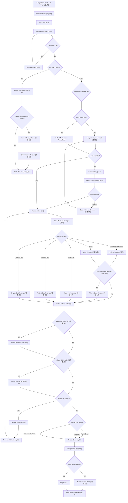

# OUTPUT-01: User Journey Flowchart

> **Phase**: P02 Business Flow Chart
> **Task**: User Journey — End-to-end flow from entry to session end
> **Output Date**: 2026-06-11
> **Scope**: 1期-MVP + existing capabilities + 2期 references

---

## User Journey Flowchart (Mermaid)

---

## Node-to-Function Mapping Table

| # | Node Label | Status | Function ID | Description |
|---|-----------|--------|-------------|-------------|
| 1 | 6 Page Entry Points with entry_tag | 已有 | US-MVP-16 | Entry from 6 mall pages; entry_tag passing exists partially, full embed is P1-MVP |
| 2 | Welcome Message | 已有 | F-EX-01 | `welcome_content` field in `customer_admin_chat_settings` |
| 3 | JWT Login | 已有 | F-EX-02 | `/api/user` login endpoint, JWT cookie storage |
| 4 | WebSocket Connect | 已有 | F-EX-03 | `ws://...?token=<JWT>`, gorilla/websocket |
| 5 | Auto Reconnect | 已有 | F-EX-04 | Frontend WebSocket `onclose` reconnect logic |
| 6 | Any Agent Online? | 已有 | F-EX-05 | `admins` action provides online agent list |
| 7 | Offline Auto-Reply | 待建-1期 | US-MVP-22 | Expand `auto_rules` with `u-offline` scene |
| 8 | Leave Message Card Shown? | 待建-1期 | US-MVP-20 | Detect offline state, show leave message guidance |
| 9 | Leave Message Form | 待建-1期 | US-MVP-20 | Form with category, content, attachments |
| 10 | Submit Leave Message | 待建-1期 | US-MVP-20 | POST `/api/user/chat/leave-message` |
| 11 | Rule Matching | 待建-1期 | US-MVP-02 | Route rule engine with priority matching |
| 12 | Match Route Rule? | 待建-1期 | US-MVP-02 | Diamond: rule hit or fallback |
| 13 | Assign to Target Agent | 待建-1期 | US-MVP-02 | Assign per route rule (specified agent / skill group / idle-first) |
| 14 | Default Assignment - Round Robin | 已有 | F-EX-06 | Current `is_auto_accept` logic |
| 15 | Agent Available? | 已有 | F-EX-07 | Check agent capacity before assignment |
| 16 | Enter Waiting Queue | 已有 | F-EX-08 | `waiting-users` queue management |
| 17 | Show Queue Position | 已有 | F-EX-09 | `waiting-user-count` action |
| 18 | Queue Timeout Overflow | 待建-1期 | US-MVP-02 | AC7: queue timeout auto-overflow transfer |
| 19 | Session Active | 已有 | F-EX-10 | Session status = accept; also target of transfer loop |
| 20 | Send-Receive Messages | 已有 | F-EX-11 | `send-message` / `receive-message` actions |
| 21 | Message Type? | 已有 | F-EX-12 | consts.go message type dispatch |
| 22 | Deliver Message | 已有 | F-EX-13 | text / image / video / pdf delivery |
| 23 | Voice Message | 待建-1期 | US-MVP-14 | `audio` type with recorder + player |
| 24 | Order Card Message | 待建-1期 | US-MVP-17 | `order_card` message type |
| 25 | Product Card Message | 待建-1期 | US-MVP-18 | `product_card` message type |
| 26 | Coupon Card Message | 待建-1期 | US-MVP-19 | `coupon_card` message type |
| 27 | Sensitive Word Detected? | 待建-1期 | US-MVP-04 | DFA-based sensitive word filter middleware |
| 28 | Filter or Block Message | 待建-1期 | US-MVP-04 | Replace `***` for user / block for agent |
| 29 | Mark Read-Unread | 已有 | F-EX-14 | `read` action + `is_read` field |
| 30 | Revoke Within 2min? | 待建-1期 | US-MVP-03 | `revoke-message` action, 2-min window |
| 31 | Revoke Message | 待建-1期 | US-MVP-03 | `revoked_at` field, content hidden |
| 32 | Phone Call Needed? | 待建-1期 | US-MVP-15 | Call button visibility |
| 33 | Initiate Phone Call | 待建-1期 | US-MVP-15 | `Taro.makePhoneCall` / `tel:` protocol |
| 34 | Transfer Session | 已有 | F-EX-15 | `CTransfer` controller |
| 35 | Transfer Notification | 已有 | F-EX-16 | `user-transfer` action |
| 36 | Session End Trigger? | 已有 | F-EX-17 | Agent close / User end |
| 37 | Timeout Auto-Close | 待建-1期 | US-MVP-05 | Cron-based session timeout close |
| 38 | Rating Popup | 待建-1期 | US-MVP-21 | Post-session rating modal |
| 39 | Submit Service Rating | 待建-1期 | US-MVP-21 | 4-dimension star rating + tags + comment |
| 40 | Save to Session History | 已有 | F-EX-18 | `getChatSessions` + session list |

---

## Legend

| Status Label | Meaning |
|-------------|---------|
| **已有** | Capability exists in current codebase (from OUTPUT-02 capability baseline) |
| **待建-1期** | Required in 1期-MVP phase, mapped to US-MVP-XX (from OUTPUT-03) |
| **待建-2期** | Planned for phase 2, mapped to US-P2-XX (from OUTPUT-04) |

---

## Flow Statistics

| Metric | Count |
|--------|-------|
| Total nodes | 40 |
| 已有 (existing) | 18 |
| 待建-1期 (to build phase 1) | 22 |
| 待建-2期 (to build phase 2) | 0 |
| Decision diamonds | 11 |

---

## Key Decision Points

1. **Any Agent Online?** — Branches into offline flow (auto-reply + leave message) vs. online routing
2. **Rule Matching** — New route rule engine determines agent assignment strategy
3. **Sensitive Word Detected?** — Intercepts messages for compliance before delivery
4. **Revoke Within 2min?** — Time-gated message revoke capability
5. **Session End Trigger?** — Three termination paths: agent close, user end, timeout auto-close

---

> **File Status**: Complete. 40 nodes covering full user journey from entry to history. All nodes tagged with status and mapped to function IDs.
