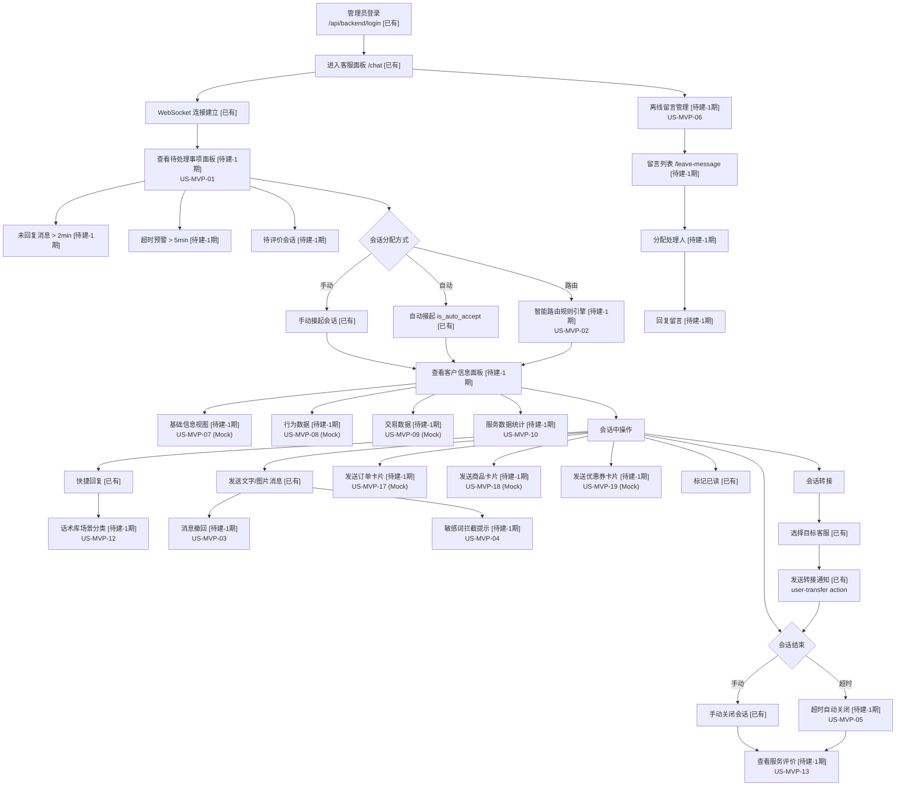

# OUTPUT-02: 管理端客服操作流程图

> **阶段**: P02 业务现状流程图
> **产出日期**: 2026-06-11
> **数据来源**: OUTPUT-02-capability-baseline, OUTPUT-03-requirements-phase1, CLAUDE.md

---

## 流程图：管理端客服操作全流程

---

## 节点-功能映射表

| 节点ID | 节点名称 | 状态 | 功能/US编号 | 代码/API对应 |
|--------|---------|------|------------|-------------|
| A0 | 管理员登录 | 已有 | 基础能力 | `/api/backend/login` → `CCurrentAdmin.Login` |
| A1 | 进入客服面板 | 已有 | 基础能力 | `/chat` 页面，routes.ts 已定义 |
| A2 | WebSocket 连接建立 | 已有 | 基础能力 | `/api/backend/ws` → `CWs`，valtio store 管理 |
| B0 | 待处理事项面板 | 待建-1期 | US-MVP-01 | 新增 `/api/backend/todo` 接口 + `/chat` 左侧面板组件 |
| B1 | 未回复消息 > 2min | 待建-1期 | US-MVP-01 AC1 | 后端聚合查询 `customer_chat_messages` |
| B2 | 超时预警 > 5min | 待建-1期 | US-MVP-01 AC1-2 | `cron.go` 定时扫描 + WebSocket 推送 |
| B3 | 待评价会话 | 待建-1期 | US-MVP-01 AC1 | 聚合 `customer_chat_sessions` 无评价记录的已关闭会话 |
| C0 | 会话分配方式 | 已有 | 分支判断 | — |
| C1 | 手动接起会话 | 已有 | 基础能力 | WebSocket `waiting-users` + 客服点击接起 |
| C2 | 自动接起 | 已有 | 基础能力 | `is_auto_accept` 字段，`customer_admin_chat_settings` |
| C3 | 智能路由规则引擎 | 待建-1期 | US-MVP-02 (P0-C) | 新增 `customer_chat_route_rules` 表 + 匹配引擎，替换 `is_auto_accept` |
| D0 | 客户信息面板 | 待建-1期 | US-MVP-07~10 | `/chat` 右侧新增客户信息卡片组件 |
| D1 | 基础信息视图 | 待建-1期 | US-MVP-07 (P0-N) | 扩展 `getUserInfo`，Mock 会员等级/联系方式 |
| D2 | 行为数据 | 待建-1期 | US-MVP-08 (P0-N) | 定义 `GET /api/user/behavior`，Mock 浏览/加购数据 |
| D3 | 交易数据 | 待建-1期 | US-MVP-09 (P0-N) | 定义 `GET /api/user/transactions`，Mock 订单数据 |
| D4 | 服务数据统计 | 待建-1期 | US-MVP-10 (P0-N) | 新增 `GET /api/backend/user/service-stats`，聚合 sessions+messages |
| E0 | 会话中操作 | 已有 | 分支判断 | — |
| E1 | 发送文字/图片消息 | 已有 | 基础能力 | WebSocket `send-message` / `receive-message` |
| E2 | 快捷回复 | 已有 | 基础能力 | `CAutoMessage` CRUD + 客服面板快捷回复面板 |
| E3 | 话术库场景分类 | 待建-1期 | US-MVP-12 (P0-N) | `customer_chat_auto_messages` 增加 `scene_tags` + `knowledge_item_id` |
| E4 | 发送订单卡片 | 待建-1期 | US-MVP-17 (P0-C) | 新增 `order_card` 消息类型，Mock 订单数据 |
| E5 | 发送商品卡片 | 待建-1期 | US-MVP-18 (P0-C) | 新增 `product_card` 消息类型，Mock 商品数据 |
| E6 | 发送优惠券卡片 | 待建-1期 | US-MVP-19 (P0-N) | 新增 `coupon_card` 消息类型，Mock 优惠券数据 |
| E7 | 消息撤回 | 待建-1期 | US-MVP-03 (P0-C) | `customer_chat_messages` 增加 `revoked_at`，新增 `revoke-message` action |
| E8 | 标记已读 | 已有 | 基础能力 | WebSocket `read` action + `is_read` 字段 |
| E9 | 敏感词拦截提示 | 待建-1期 | US-MVP-04 (P0-C) | 新增 `customer_chat_sensitive_words` 表 + DFA 过滤中间件 |
| F0 | 会话转接 | 已有 | 基础能力 | — |
| F1 | 选择目标客服 | 已有 | 基础能力 | `CTransfer` + 客服列表选择 UI |
| F2 | 发送转接通知 | 已有 | 基础能力 | WebSocket `user-transfer` action + `customer_chat_transfers` 表 |
| G0 | 会话结束 | 已有 | 分支判断 | — |
| G1 | 手动关闭会话 | 已有 | 基础能力 | `CSession.Close`，会话状态 → close |
| G2 | 超时自动关闭 | 待建-1期 | US-MVP-05 (P0-C) | `cron.go` 定时扫描 + `session-close` action + 可配超时时间 |
| G3 | 查看服务评价 | 待建-1期 | US-MVP-13 (P0-N) | 新增 `customer_chat_ratings` 表 + `/rating` 管理页面 |
| H0 | 离线留言管理 | 待建-1期 | US-MVP-06 (P0-N) | 新增 `customer_chat_leave_messages` 表 + `/leave-message` 页面 |
| H1 | 留言列表 | 待建-1期 | US-MVP-06 AC1-2 | `/api/backend/leave-message` CRUD + 状态/分类筛选 |
| H2 | 分配处理人 | 待建-1期 | US-MVP-06 AC4 | 后端分配接口，关联 `customer_admins` |
| H3 | 回复留言 | 待建-1期 | US-MVP-06 AC5 | 回复接口 + 状态流转（待处理→处理中→已回复） |

---

## 统计

| 指标 | 数值 |
|------|------|
| 总节点数 | 36 |
| 已有节点 | 12 (33%) |
| 待建-1期节点 | 24 (67%) |
| 待建-2期节点 | 0 |
| P0-Critical 关联 | US-MVP-02, 03, 04, 05, 17, 18 |
| P0-Nice 关联 | US-MVP-01, 06, 07, 08, 09, 10, 12, 13, 19 |

---

> **文件状态**: 初稿完成，36 节点覆盖登录→待办→接起→客户信息→会话操作→转接→结束→留言管理全流程
