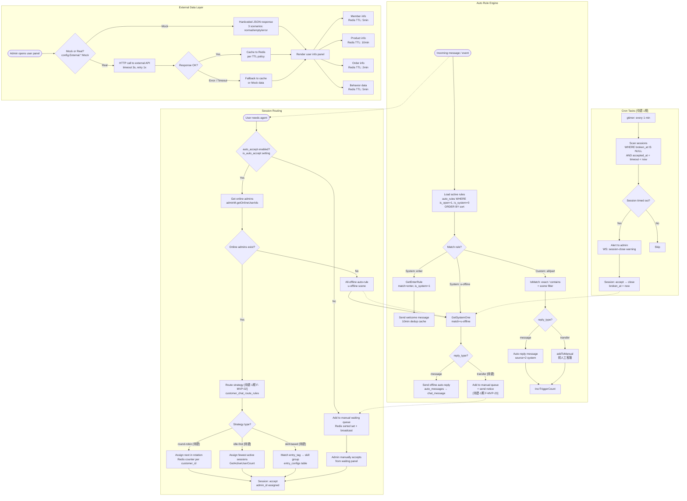

# OUTPUT-03: System Internal Flowcharts

> **Phase**: P02 — Business Flow Charts
> **Output**: 03 — System Internal Flows
> **Date**: 2026-06-11
> **Sources**: CLAUDE.md, database.sql, consts.go, router.go, cron.go, user_manager.go, admin_manager.go, auto_rule.go, manager.go, client.go, OUTPUT-02, OUTPUT-06

---

## Flowchart 1: Session & Message Lifecycle

```mermaid
flowchart TD
    subgraph Session["Session Lifecycle"]
        S1([User connects WebSocket]) --> S2{Has assigned admin?}
        S2 -- Yes --> S3[Load active session<br/>customer_chat_sessions]
        S2 -- No --> S4{Is in manual queue?}
        S4 -- Yes --> S5["Session: status=wait<br/>waiting-users broadcast"]
        S4 -- No --> S6[Trigger enter auto-rule<br/>GetEnterRule / welcome]
        S6 --> S7{Auto-transfer enabled?<br/>is-auto-transfer setting}
        S7 -- Yes --> S8["Add to manual queue<br/>Redis sorted set"]
        S7 -- No --> S9[AI response / idle]
        S8 --> S5
        S5 --> S10{Admin accepts?}
        S10 -- Yes --> S11["Session: wait → accept<br/>accepted_at = now"]
        S10 -- No --> S12["Session: wait → cancel<br/>canceled_at = now"]
        S11 --> S13[Active chat in progress]
        S13 --> S14{Close trigger?}
        S14 -- "Rate message" --> S15["Session: accept → close<br/>rate field set"]
        S14 -- "Admin/Timeout" --> S16["Session: accept → close<br/>broken_at = now"]
        S14 -- "Cancel by user" --> S12
    end

    subgraph Message["Message Pipeline"]
        M1(["WS: send-message"]) --> M2[Validate: type + content + req_id + rate-limit]
        M2 -- Invalid --> M3["WS → error-message"]
        M2 -- Valid --> M4["Sensitive word DFA filter<br/>[待建-1期 F-MVP-04]<br/>customer_chat_sensitive_words"]
        M4 --> M5{Hit sensitive word?}
        M5 -- "Yes [待建]" --> M6["Replace / Reject<br/>log to DB"]
        M5 -- No --> M7["Persist message<br/>customer_chat_messages<br/>source: 0=user 1=admin 2=sys 3=AI"]
        M6 --> M7
        M7 --> M8["WS → receipt<br/>{user_id, req_id, msg_id}"]
        M8 --> M9{Message source?}
        M9 -- "User → Admin" --> M10["Delivery to admin conn<br/>admin_manager.deliveryMessage"]
        M9 -- "Admin → User" --> M11["Validate user-admin relation<br/>FirstActive session check"]
        M11 --> M12["Delivery to user conn<br/>user_manager.deliveryMessage"]
        M10 --> M13["Update send_at timestamp"]
        M12 --> M13
        M13 --> M14["Read status tracking<br/>read_at field + WS: read action"]
        M14 --> M15{Revoke request?<br/>[待建-1期 F-MVP-03]}
        M15 -- "Yes [待建]" --> M16["Set revoked_at + WS: revoke-message<br/>Time window: ≤2 min"]
        M15 -- No --> M17([Message lifecycle complete])
        M16 --> M17
    end

    subgraph MultiTenant["Multi-Tenant Isolation"]
        T1["customer_id on every query<br/>sessions / messages / rules / files"] --> T2["Shard: customerId % 10<br/>Per-tenant connection pool"]
        T2 --> T3["Redis key prefix by type<br/>admin:user:ID:server / admin:ID:setting"]
    end

    S1 -.-> M1
    M10 -.-> S13
```

### DB Table Mapping (Flowchart 1)

| Node / Step | Table | Key Fields |
|---|---|---|
| Session create | `customer_chat_sessions` | id, user_id, admin_id, customer_id, queried_at |
| Session accept | `customer_chat_sessions` | accepted_at, type=0/1 |
| Session close/cancel | `customer_chat_sessions` | broken_at, canceled_at, rate |
| Message persist | `customer_chat_messages` | id, session_id, type, content, source, req_id, read_at |
| Sensitive word filter [待建] | `customer_chat_sensitive_words` | word, category, action(replace/reject) |
| Message revoke [待建] | `customer_chat_messages` | +revoked_at field |
| Admin settings | `customer_admin_chat_settings` | is_auto_accept, welcome_content |
| Manual queue | Redis sorted set | manual:{customerId} → userId + score |

### API Route Mapping (Flowchart 1)

| Endpoint | Method | Used By |
|---|---|---|
| `/api/user/chat` (WS) | WebSocket | User sends/receives messages |
| `/api/backend/ws` (WS) | WebSocket | Admin sends/receives messages |
| `/api/backend/session` | REST | Session list, detail, close |
| `/api/backend/chat` | REST | Message history, pagination |
| `/api/backend/chat-file` | REST | File upload (image/audio/video/pdf) |
| `/api/backend/revoke` [待建] | POST | F-MVP-03 message revoke |
| `/api/backend/sensitive-word/*` [待建] | CRUD | F-MVP-04 sensitive word management |

### WebSocket Actions (Flowchart 1)

| Action | Direction | Status |
|---|---|---|
| `send-message` | Client → Server | 已有 |
| `receive-message` | Server → Client | 已有 |
| `receipt` | Server → Client | 已有 |
| `read` | Server → Client | 已有 |
| `error-message` | Server → Client | 已有 |
| `waiting-users` | Server → Admin | 已有 |
| `waiting-user-count` | Server → User | 已有 |
| `user-online` / `user-offline` | Server → Admin | 已有 |
| `revoke-message` [待建] | 双向 | F-MVP-03 |
| `session-close` [待建] | Server → Client | F-MVP-05 |

---

## Flowchart 2: Rule Engine, Routing & External Data



### DB Table Mapping (Flowchart 2)

| Node / Step | Table | Key Fields |
|---|---|---|
| Active rules | `customer_chat_auto_rules` | customer_id, match, match_type, reply_type, scenes, sort, is_open |
| System rules (enter) | `customer_chat_auto_rules` | match=enter, is_system=1 |
| System rules (u-offline) | `customer_chat_auto_rules` | match=u-offline, is_system=1 |
| Rule scenes | `customer_chat_auto_rule_scenes` | rule_id, name |
| Auto messages | `customer_chat_auto_messages` | id, name, type, content |
| Route rules [待建] | `customer_chat_route_rules` | strategy, entry_tag, skill_group, priority |
| Entry config [待建] | `customer_chat_entry_configs` | page, label, entry_tag, position |
| Sensitive words [待建] | `customer_chat_sensitive_words` | word, category, action |
| Admin settings | `customer_admin_chat_settings` | is_auto_accept |

### API Route Mapping (Flowchart 2)

| Endpoint | Method | Used By |
|---|---|---|
| `/api/backend/auto-rule` | CRUD | Custom rule management |
| `/api/backend/system-rule` | GET | System rule view (enter, u-offline) |
| `/api/backend/auto-message` | CRUD | Quick reply template CRUD |
| `/api/backend/chat-setting` | CRUD | System settings (is-auto-transfer, etc.) |
| `/api/backend/option` | GET | Option lists (match types, reply types) |
| `/api/backend/route-rule/*` [待建] | CRUD | F-MVP-02 routing rule management |
| `/api/backend/sensitive-word/*` [待建] | CRUD | F-MVP-04 sensitive word management |
| `/api/backend/session-timeout/*` [待建] | CRUD | F-MVP-05 timeout settings |
| `/api/backend/entry-config/*` [待建] | CRUD | F-MVP-16 entry config management |

### Redis Key Mapping (Flowchart 2)

| Key Pattern | TTL | Purpose |
|---|---|---|
| `admin:user:{uid}:server` | 24h | gRPC cluster: user WS server location |
| `admin:{uid}:setting` | — | Admin setting cache |
| `manual:{customerId}` | — | Sorted set: waiting queue |
| `welcome:{uid}` | 10min | Welcome dedup |
| `ext:member:{uid}` | 5min | Member info cache |
| `ext:product:{id}` | 10min | Product info cache |
| `ext:order:{orderNo}` | 2min | Order detail cache |
| `ext:behavior:{uid}` | 5min | User behavior cache |

---

## Node Count

| Flowchart | Nodes | Edges |
|---|---|---|
| Flowchart 1 — Session & Message Lifecycle | 28 | 35 |
| Flowchart 2 — Rule Engine, Routing & External | 31 | 38 |
| **Total** | **59** | **73** |

---

## Implementation Status Legend

| Label | Meaning |
|---|---|
| 已有 | Implemented and working |
| 待建-1期 | To build in MVP phase |
| F-MVP-XX | Feature reference in gap analysis |

---

> **File status**: Draft complete. Covers session state machine, message pipeline with sensitive word filtering, rule engine with all scenes, cron timeout logic, routing strategies, and external data layer with cache/fallback.
