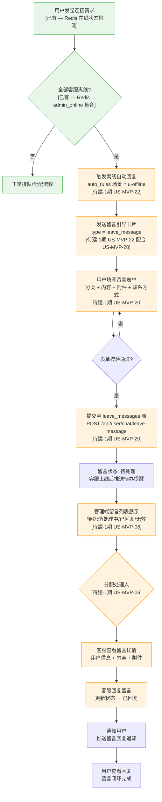
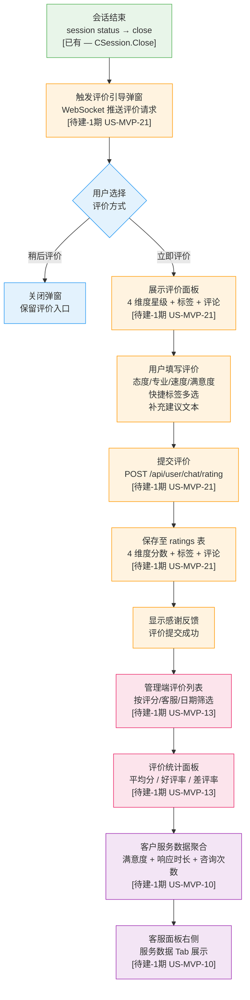
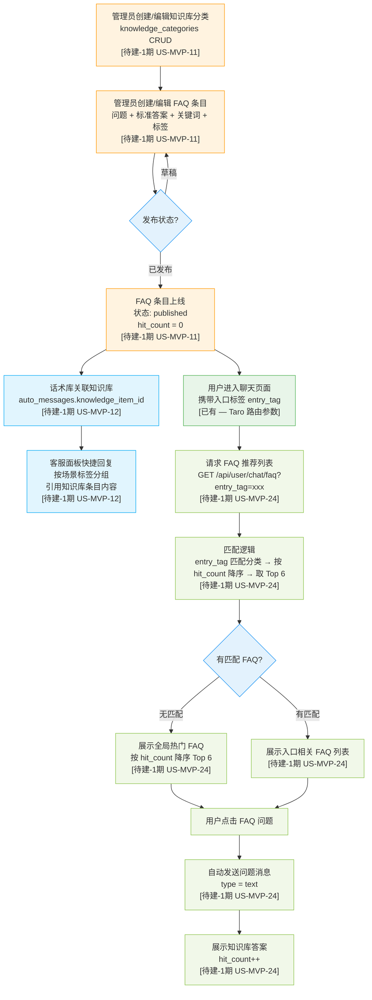

# OUTPUT-04: 扩展场景业务流程图

> **阶段**: P02 业务流程图
> **产出日期**: 2026-06-11
> **数据来源**: OUTPUT-03 (1期需求)、OUTPUT-02 (能力基线)、CLAUDE.md (规则引擎/数据库)

---

## Flow A — 离线留言闭环 (Offline Leave Message Loop)

### A.1 流程图



图例：绿色 = 已有能力 | 橙色 = 待建-1期

### A.2 协同关系

```
US-MVP-22 (离线自动回复 — 触发)
    │
    ▼  触发离线回复 + 留言引导卡片
US-MVP-20 (离线留言提交 — 用户端)
    │
    ▼  写入 leave_messages 表
US-MVP-06 (留言管理 — 管理端)
```

### A.3 节点-功能映射表

| 节点 | 节点描述 | 功能 ID | 状态 | 技术实现要点 |
|------|---------|---------|------|-------------|
| A1 | 用户发起连接请求 | — | 已有 | Redis `admin_online` 集合检测在线状态 |
| A2 | 全部客服离线判断 | — | 已有 | Redis SMEMBERS + 空集合判断 |
| A2x | 正常排队/分配 | — | 已有 | WebSocket `waiting-users` 排队机制 |
| A3 | 触发离线自动回复 | US-MVP-22 | 待建-1期 | 扩展 auto_rules scenes，新增 `u-offline` 触发；复用 `controller/rule/` 规则引擎 |
| A4 | 发送留言引导卡片 | US-MVP-22 + US-MVP-20 | 待建-1期 | 新增 `leave_message` 消息类型；WebSocket `leave-message-guide` action |
| A5 | 用户填写留言表单 | US-MVP-20 | 待建-1期 | Taro LeaveMessageForm 组件；表单含分类/订单号/内容/图片/联系方式 |
| A6 | 表单校验 | US-MVP-20 | 待建-1期 | 前端校验 + 后端参数校验 |
| A7 | 提交至 leave_messages 表 | US-MVP-20 | 待建-1期 | POST `/api/user/chat/leave-message`；新建 `customer_chat_leave_messages` 表 |
| A8 | 留言状态: 待处理 | US-MVP-20 → US-MVP-06 | 待建-1期 | 状态机：pending → processing → replied → invalid |
| A9 | 管理端留言列表 | US-MVP-06 | 待建-1期 | GET `/api/backend/leave-message`；管理端 `/leave-message` 页面 |
| A10 | 分配处理人 | US-MVP-06 | 待建-1期 | PATCH `/api/backend/leave-message/:id/assign`；支持指定客服 |
| A11 | 客服查看留言详情 | US-MVP-06 | 待建-1期 | GET `/api/backend/leave-message/:id`；展示用户信息+内容+附件 |
| A12 | 客服回复留言 | US-MVP-06 | 待建-1期 | POST `/api/backend/leave-message/:id/reply`；更新状态为 replied |
| A13 | 通知用户 | US-MVP-06 | 待建-1期 | WebSocket 推送或服务号通知 |
| A14 | 用户查看回复 | US-MVP-06 + US-MVP-20 | 待建-1期 | 用户端留言记录页或消息内展示回复 |

---

## Flow B — 服务评价闭环 (Service Rating Loop)

### B.1 流程图



图例：绿色 = 已有 | 橙色 = US-MVP-21 | 粉色 = US-MVP-13 | 紫色 = US-MVP-10 | 蓝色 = 用户选择

### B.2 协同关系

```
US-MVP-21 (服务评价 UI — 用户端提交)
    │
    ▼  写入 ratings 表
US-MVP-13 (客服评价管理 — 管理端查看/统计)
    │
    ▼  聚合评价数据
US-MVP-10 (客户服务数据 — 统计面板展示)
```

### B.3 节点-功能映射表

| 节点 | 节点描述 | 功能 ID | 状态 | 技术实现要点 |
|------|---------|---------|------|-------------|
| B1 | 会话结束 | — | 已有 | `customer_chat_sessions` status → close；CSession.Close 方法 |
| B2 | 触发评价引导弹窗 | US-MVP-21 | 待建-1期 | 会话关闭后 WebSocket 推送评价请求；或前端检测会话关闭状态自动弹窗 |
| B3 | 用户选择评价方式 | US-MVP-21 | 待建-1期 | RatingModal 组件：立即评价 / 稍后评价 |
| B3x | 关闭弹窗保留入口 | US-MVP-21 | 待建-1期 | 聊天界面保留"评价"按钮入口 |
| B4 | 展示评价面板 | US-MVP-21 | 待建-1期 | Taro RatingModal 组件；4 维度星级(1-5) + 标签多选 + 评论框 |
| B5 | 用户填写评价 | US-MVP-21 | 待建-1期 | 态度/专业/速度/满意度星级；快捷标签：态度友好/专业高效/回复迅速/耐心解答/有待提升 |
| B6 | 提交评价 | US-MVP-21 | 待建-1期 | POST `/api/user/chat/rating`；参数：session_id + 4 维度分数 + 标签[] + comment |
| B7 | 保存至 ratings 表 | US-MVP-21 | 待建-1期 | 新建 `customer_chat_ratings` 表；字段含 session_id, user_id, admin_id, attitude_score, professional_score, speed_score, satisfaction_score, tags(JSON), comment |
| B8 | 显示感谢反馈 | US-MVP-21 | 待建-1期 | 前端展示"感谢您的评价"提示 |
| B9 | 管理端评价列表 | US-MVP-13 | 待建-1期 | GET `/api/backend/rating`；管理端 `/rating` 页面；支持评分范围/客服/日期筛选 |
| B10 | 评价统计面板 | US-MVP-13 | 待建-1期 | GET `/api/backend/rating/statistics`；平均分/好评率/差评率聚合 |
| B11 | 客户服务数据聚合 | US-MVP-10 | 待建-1期 | GET `/api/backend/user/service-stats`；聚合 sessions + messages + ratings |
| B12 | 服务数据 Tab 展示 | US-MVP-10 | 待建-1期 | `/chat` 面板右侧客户信息卡片新增"服务数据"Tab |

---

## Flow C — 知识库生态闭环 (Knowledge Base Ecosystem)

### C.1 流程图



图例：橙色 = US-MVP-11 | 浅蓝 = US-MVP-12 | 绿色 = 已有 | 浅绿 = US-MVP-24 | 蓝色 = 判断

### C.2 协同关系

```
US-MVP-11 (知识库/FAQ 管理 — 数据源)
    │
    ├──▶ US-MVP-12 (话术库场景分类 — 引用知识库)
    │       auto_messages.knowledge_item_id 关联
    │       scene_tags 按场景分组
    │
    └──▶ US-MVP-24 (FAQ 快捷问题 — 推荐知识库条目)
            knowledge_items 按 entry_tag + hit_count 匹配
```

### C.3 节点-功能映射表

| 节点 | 节点描述 | 功能 ID | 状态 | 技术实现要点 |
|------|---------|---------|------|-------------|
| C1 | 管理员创建/编辑知识库分类 | US-MVP-11 | 待建-1期 | 新建 `knowledge_categories` 表；管理端 `/knowledge` 页面左侧分类树 CRUD + 拖拽排序 |
| C2 | 管理员创建/编辑 FAQ 条目 | US-MVP-11 | 待建-1期 | 新建 `knowledge_items` 表；字段：question, answer(富文本), keywords, tags, entry_tag, status, hit_count |
| C3 | 发布状态判断 | US-MVP-11 | 待建-1期 | 状态机：draft → published → archived；仅 published 状态对用户端可见 |
| C4 | FAQ 条目上线 | US-MVP-11 | 待建-1期 | PATCH `/api/backend/knowledge/item/:id/publish`；hit_count 初始化为 0 |
| C5 | 话术库关联知识库 | US-MVP-12 | 待建-1期 | `customer_chat_auto_messages` 增加 `knowledge_item_id` 字段；快捷回复编辑页增加"引用知识库"选择器 |
| C6 | 客服面板快捷回复按场景分组 | US-MVP-12 | 待建-1期 | `auto_messages` 增加 `scene_tags` 字段；客服面板快捷回复组件按场景标签分组展示 |
| C7 | 用户进入聊天页面携带入口标签 | — | 已有 | Taro 路由参数 `entry_tag`；与 US-MVP-16 六页面入口配合 |
| C8 | 请求 FAQ 推荐列表 | US-MVP-24 | 待建-1期 | GET `/api/user/chat/faq?entry_tag=xxx`；用户端 FAQList 组件 |
| C9 | 匹配逻辑 | US-MVP-24 | 待建-1期 | SQL: WHERE entry_tag = ? AND status = 'published' ORDER BY hit_count DESC LIMIT 6 |
| C10 | 有匹配 FAQ 判断 | US-MVP-24 | 待建-1期 | 结果集非空判断 |
| C11 | 展示全局热门 FAQ | US-MVP-24 | 待建-1期 | SQL: WHERE status = 'published' ORDER BY hit_count DESC LIMIT 6（无 entry_tag 过滤） |
| C12 | 展示入口相关 FAQ 列表 | US-MVP-24 | 待建-1期 | FAQList 组件渲染；最多 6 条，显示问题摘要 |
| C13 | 用户点击 FAQ 问题 | US-MVP-24 | 待建-1期 | FAQList 组件 onClick 事件；触发自动发送 |
| C14 | 自动发送问题消息 | US-MVP-24 | 待建-1期 | 调用现有 `send-message` action；type = text；content = 用户选中的问题文本 |
| C15 | 展示知识库答案 + hit_count++ | US-MVP-24 | 待建-1期 | 后端收到 FAQ 相关消息时 UPDATE knowledge_items SET hit_count = hit_count + 1；答案以系统消息(type=notice)或客服消息形式展示 |

---

## 附录：跨流程依赖关系

| 依赖关系 | 涉及流程 | 说明 |
|---------|---------|------|
| US-MVP-22 → US-MVP-20 | Flow A | 离线自动回复触发留言引导，用户才能看到留言表单 |
| US-MVP-20 → US-MVP-06 | Flow A | 用户提交留言后，管理端才能展示留言列表 |
| US-MVP-21 → US-MVP-13 | Flow B | 用户端评价提交后，管理端才有评价数据可管理 |
| US-MVP-13 → US-MVP-10 | Flow B | 评价数据聚合后，才能在客户服务数据中展示满意度 |
| US-MVP-11 → US-MVP-12 | Flow C | 知识库条目创建后，话术库才能引用 |
| US-MVP-11 → US-MVP-24 | Flow C | 知识库条目发布后，FAQ 快捷问题才有数据源 |
| US-MVP-16 → US-MVP-24 | Flow C | 入口标签由六页面入口传递，FAQ 按 entry_tag 匹配 |

---

> **文件状态**: 初稿完成，含 3 条独立 Mermaid 流程图、节点-功能映射表、协同关系图
