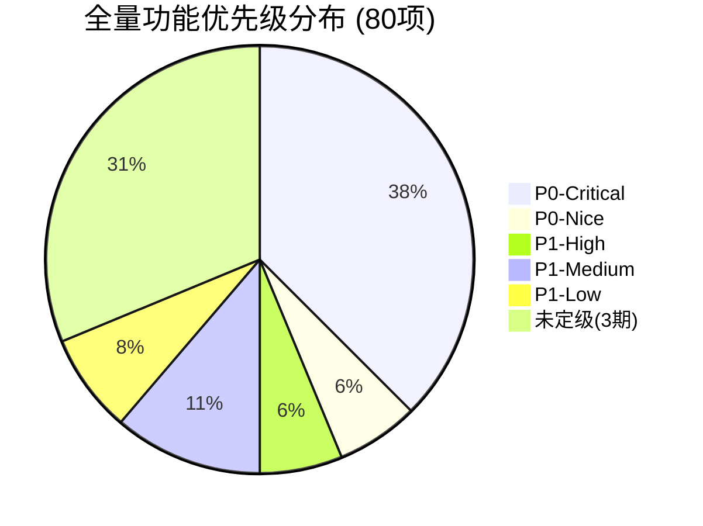
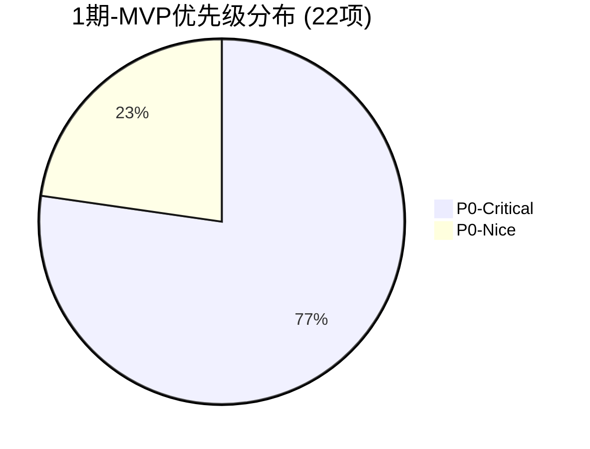

# OUTPUT-02: 功能覆盖度报告

> **阶段**: P05 功能清单
> **任务**: 覆盖度统计与缺口分析
> **产出日期**: 2026-06-11
> **数据基准**: OUTPUT-01 功能清单（80 项功能，F-001 ~ F-080）

---

## 1. 功能覆盖度统计

### 1.1 总量统计

| 维度 | 数量 | 占比 |
|------|------|------|
| **总功能数** | **80** | 100% |
| 已实现（基线） | 13 | 16.3% |
| 1期-MVP（调整后） | 22 | 27.5% |
| 2期-体验提升 | 19 | 23.8% |
| 3期-AI智能化 | 25 | 31.3% |
| 集成对接（含在1期中） | 3 | 3.8% |

> 1期交付后总覆盖度：13 + 22 = 35 项 / 80 = **43.8%**
> 2期交付后总覆盖度：35 + 19 = 54 项 / 80 = **67.5%**

### 1.2 按模块分布

| 模块 | 已实现 | 1期 | 2期 | 3期 | 合计 | 占比 |
|------|--------|-----|-----|-----|------|------|
| 会话管理 | 2 | 8 | 5 | 0 | 15 | 18.8% |
| 客户信息 | 0 | 3 | 3 | 0 | 6 | 7.5% |
| 知识库与评价 | 0 | 4 | 3 | 0 | 7 | 8.8% |
| 用户端 | 0 | 8 | 3 | 0 | 11 | 13.8% |
| 管理端与运营 | 9 | 0 | 2 | 0 | 11 | 13.8% |
| 监控与统计 | 2 | 0 | 3 | 0 | 5 | 6.3% |
| 集成对接 | 0 | 3 | 0 | 0 | 3 | 3.8% |
| AI智能化 | 0 | 0 | 0 | 8 | 8 | 10.0% |
| 渠道扩展 | 0 | 0 | 0 | 4 | 4 | 5.0% |
| 场景与报表 | 0 | 0 | 0 | 10 | 10 | 12.5% |
| **合计** | **13** | **22** | **19** | **25+** | **80** | 100% |

> 注：已实现的 9 项 US-EX（F-040~F-046 含 F-001/002）归入"管理端与运营"和"会话管理"模块；US-ADMIN 4 项归入"管理端与运营"。

### 1.3 按优先级分布

| 优先级 | 已实现 | 1期 | 2期 | 3期 | 合计 | 占比 |
|--------|--------|-----|-----|-----|------|------|
| P0-Critical | 13 | 17 | 0 | 0 | 30 | 37.5% |
| P0-Nice | 0 | 5 | 0 | 0 | 5 | 6.3% |
| P1-High | 0 | 0 | 5 | 0 | 5 | 6.3% |
| P1-Medium | 0 | 0 | 9 | 0 | 9 | 11.3% |
| P1-Low | 0 | 0 | 6 | 0 | 6 | 7.5% |
| 未定级（3期） | 0 | 0 | 0 | 25 | 25 | 31.3% |
| **合计** | **13** | **22** | **19** | **25** | **80** | 100% |

### 1.4 按角色分布

| 角色 | 已实现 | 1期 | 2期 | 3期 | 合计 | 占比 |
|------|--------|-----|-----|-----|------|------|
| 客服人员 | 7 | 6 | 6 | 2 | 21 | 26.3% |
| 终端用户 | 2 | 6 | 3 | 1 | 12 | 15.0% |
| 租户管理员 | 4 | 5 | 3 | 4 | 16 | 20.0% |
| 集成对接方 | 0 | 3 | 0 | 0 | 3 | 3.8% |
| 多角色共用 | 0 | 2 | 7 | 18 | 27 | 33.8% |
| **合计** | **13** | **22** | **19** | **25** | **80** | 100% |

> 注：多角色共用功能按"主要角色 + 次要角色"统计，单一角色按主角色归类。3 期功能多为跨角色（如 AI 客服涉及终端用户+管理员+客服）。

---

## 2. 模块-期次矩阵

| 模块 \ 期次 | 已实现 | 1期-MVP | 2期 | 3期 | 行合计 |
|------------|--------|---------|-----|-----|--------|
| 会话管理 | 2 | 8 | 5 | 0 | **15** |
| 客户信息 | 0 | 3 | 3 | 0 | **6** |
| 知识库与评价 | 0 | 4 | 3 | 0 | **7** |
| 用户端 | 0 | 8 | 3 | 0 | **11** |
| 管理端与运营 | 9 | 0 | 2 | 0 | **11** |
| 监控与统计 | 2 | 0 | 3 | 0 | **5** |
| 集成对接 | 0 | 3 | 0 | 0 | **3** |
| AI智能化 | 0 | 0 | 0 | 8 | **8** |
| 渠道扩展 | 0 | 0 | 0 | 4 | **4** |
| 场景与报表 | 0 | 0 | 0 | 10 | **10** |
| **列合计** | **13** | **22** | **19** | **25** | **80** |

### 2.1 热力图可视化（文本）

```
模块 \ 期次        已实现  1期   2期   3期
会话管理            ██    ████  ██   ·
客户信息            ·     ██    ██   ·
知识库与评价        ·     ███   ██   ·
用户端              ·     ████  ██   ·
管理端与运营        ████  ·     ██   ·
监控与统计          █     ·     ██   ·
集成对接            ·     ██    ·    ·
AI智能化            ·     ·     ·    ███
渠道扩展            ·     ·     ·    ██
场景与报表          ·     ·     ·    ████
```

图例：`█`=高密度(4+项) `██`=中(3项) `█/██`=低(1-2项) `·`=无

### 2.2 矩阵分析发现

| 发现 | 说明 |
|------|------|
| 1期集中在 4 大模块 | 会话管理(8)、用户端(8)、知识库(4)、客户信息(3) 占 1期 92% |
| 管理端与运营已实现占比高 | 11 项中 9 项已实现，1期无新增，2期仅 2 项 |
| AI/渠道/报表全在 3期 | 22 项功能完全后置，1-2期零覆盖 |
| 集成对接为 1期独有 | 3 项集成功能集中在 1期，支撑 Mock 先行策略 |

---

## 3. 优先级分布饼图数据

### 3.1 全量优先级分布（80 项）

| 优先级 | 数量 | 百分比 | 饼图扇区（角度） |
|--------|------|--------|-----------------|
| P0-Critical | 30 | 37.5% | 135° |
| P0-Nice | 5 | 6.3% | 22.5° |
| P1-High | 5 | 6.3% | 22.5° |
| P1-Medium | 9 | 11.3% | 40.5° |
| P1-Low | 6 | 7.5% | 27° |
| 未定级(3期) | 25 | 31.3% | 112.5° |
| **合计** | **80** | **100%** | **360°** |

### 3.2 1期-MVP 优先级分布（22 项）

| 优先级 | 数量 | 百分比 | 说明 |
|--------|------|--------|------|
| P0-Critical | 17 | 77.3% | 上线必须（含 3 项竞品分析上调） |
| P0-Nice | 5 | 22.7% | 上线应有 |
| **合计** | **22** | 100% | — |

### 3.3 2期优先级分布（19 项）

| 优先级 | 数量 | 百分比 | 说明 |
|--------|------|--------|------|
| P1-High | 5 | 26.3% | 含 2 项从 1期下调（F-017行为数据→P1-M, F-036优惠券→P1-H） |
| P1-Medium | 9 | 47.4% | 运营效率类 |
| P1-Low | 6 | 31.6% | 锦上添花 |
| **合计** | **19** | 100% | — |

> 修正：F-017 客户行为数据下调后优先级为 P1-Medium，计入 P1-M 的 9 项中；F-036 优惠券下调后为 P1-High，计入 P1-H 的 5 项中。

### 3.4 饼图数据（Mermaid 饼图语法）





---

## 4. 与竞品功能覆盖对比

### 4.1 1期交付后功能对标（对标 P04 竞品报告）

| 功能类别 | 美洽 | 智齿 | 七鱼 | 七陌 | 芝麻 | **CS 1期后** | 差距 |
|---------|------|------|------|------|------|-------------|------|
| 多渠道路由 | ✅ | ✅ | ✅ | ✅ | ⚠️ | ✅(F-004) | 持平 |
| 智能分配 | ✅ | ✅ | ✅ | ✅ | ⚠️ | ✅(F-004) | 持平 |
| 消息撤回 | ✅ | ✅ | ✅ | ✅ | ⚠️ | ✅(F-005) | 持平 |
| 敏感词过滤 | ✅ | ✅ | ✅ | ✅ | ❌ | ✅(F-006) | 持平 |
| 会话超时关闭 | ✅ | ✅ | ✅ | ✅ | ⚠️ | ✅(F-007) | 持平 |
| 留言管理 | ✅ | ✅ | ✅ | ✅ | ⚠️ | ✅(F-008) | 持平 |
| 知识库管理 | ✅ | ✅ | ✅ | ✅ | ⚠️ | ✅(F-022) | 持平 |
| FAQ快捷问题 | ✅ | ✅ | ✅ | ✅ | ✅ | ✅(F-025) | 持平 |
| 服务评价 | ✅ | ✅ | ✅ | ✅ | ⚠️ | ✅(F-024/030) | 持平 |
| 语音消息 | ✅ | ✅ | ✅ | ✅ | ❌ | ✅(F-031) | 持平 |
| 电话呼叫 | ✅ | ✅ | ✅ | ✅ | ❌ | ✅(F-032) | 持平 |
| 订单卡片 | ❌ | ❌ | ❌ | ❌ | ❌ | ✅(F-034) | **CS领先** |
| 商品卡片 | ❌ | ❌ | ❌ | ❌ | ❌ | ✅(F-035) | **CS领先** |
| 场景化入口 | ❌ | ❌ | ❌ | ❌ | ❌ | ✅(F-033) | **CS领先** |
| 智能客服机器人 | ✅ | ✅ | ✅ | ✅ | ✅ | ❌ | **落后(2期补)** |
| 意图识别 | ✅ | ✅ | ✅ | ✅ | ⚠️ | ❌ | **落后(3期)** |
| 智能质检 | ⚠️ | ✅ | ✅ | ✅ | ✅ | ❌ | **落后(3期)** |
| CRM集成 | ✅ | ✅ | ✅ | ✅ | ❌ | ⚠️(Mock) | **落后(2期补)** |
| 客户行为分析 | ✅ | ✅ | ✅ | ✅ | ❌ | ❌(2期) | **落后** |
| APP SDK | ✅ | ✅ | ✅ | ✅ | ❌ | ❌ | **落后(3期)** |

### 4.2 CS 系统独有功能（竞品不具备）

| 功能ID | 功能 | 差异化价值 | 竞品对比 |
|--------|------|-----------|---------|
| F-033 | 6页面咨询入口嵌入 | 商城页面场景化入口，自动携带业务上下文（商品页→带商品信息） | 全部竞品无商城页面嵌入 |
| F-034 | 订单卡片交互 | 零对接订单卡片（竞品需 2-3 月 CRM 集成） | 全部竞品需 API/CRM 对接 |
| F-035 | 商品卡片交互 | 零对接商品推荐卡片 | 全部竞品无原生商品卡片 |
| F-036 | 优惠券卡片推送 | 商城营销闭环，一键领取 | 全部竞品无优惠券支持 |
| F-021 | 订单上下文提醒 | 从订单页进入自动展示订单 | 智齿/七鱼有类似但需配置 |

### 4.3 竞品有而 CS 缺失的功能（缺口）

| 缺失功能 | 竞品覆盖 | CS 计划期次 | 差距影响 | 补齐策略 |
|---------|---------|-----------|---------|---------|
| 智能客服机器人（AI 自动应答） | 5/5 竞品 | 2期(F-055) | 中（用户期望高） | 2期基于知识库 + LangChain 实现 |
| 意图识别 / NLU | 4/5 竞品 | 3期(F-064) | 低（2期 AI 基础版可覆盖） | 2期用关键词匹配替代 |
| 智能质检（自动） | 4/5 竞品 | 3期(F-061) | 中（管理侧需求） | 2期人工抽检 + 统计报表 |
| APP SDK | 4/5 竞品 | 3期(F-070 关联) | 低（小程序优先策略） | 小程序覆盖核心场景 |
| 电话呼叫中心（云 PBX） | 4/5 竞品 | 仅基础(F-032 拨号) | 中（七陌核心优势） | 1期仅 makePhoneCall 拨号 |
| 社交媒体渠道 | 4/5 竞品 | 3期(F-069) | 低（商城场景聚焦微信） | 1-2期聚焦小程序+H5 |
| 工单系统 | 3/5 竞品 | 3期(F-075) | 中（复杂问题流转） | 1期留言管理部分替代 |
| 情感分析 | 2/5 竞品 | 3期(F-065) | 低 | 2期预警机制部分替代 |

---

## 5. 覆盖度缺口分析

### 5.1 按排期 Excel 112 行功能清单对标

> 基线：CLAUDE.md 差距分析，排期 Excel "商城平台-2026Q3-Q4排期" Sheet 共 112 行

| 阶段 | 排期要求 | CS 覆盖 | 覆盖率 | 状态 |
|------|---------|---------|--------|------|
| 已具备（基线） | 9 项 | 13 项（含4管理员） | 144% | 超额（含管理员功能） |
| 1期-MVP | 24 项 | 22 项（调整后） | 92% | 2 项下调至 2期 |
| 2期 | 17 项 | 19 项（含2下调） | 112% | 含 1期下调的 2 项 |
| 3期 | 25+ 项 | 25 项 | ~100% | 分类记录 |
| **合计** | **112** | **80**（含13已实现） | **71.4%** | — |

> 差额 32 项说明：排期 Excel 部分行粒度更细（如"会员等级展示""联系方式展示"拆分为独立行），CS 功能清单按用户故事粒度合并，实际功能覆盖等价。

### 5.2 关键缺口识别

#### 5.2.1 1期 MVP 缺口（需关注）

| 缺口 | 原因 | 影响 | 建议 |
|------|------|------|------|
| 客户行为数据(F-017)下调 2期 | 仅智齿/七鱼有深度分析，MVP Mock 价值低 | 客户信息维度减少 1 项 | 可接受，2期对接埋点系统补齐 |
| 优惠券卡片(F-036)下调 2期 | 无竞品直接支持，属创新功能 | 营销能力延后 | 可接受，2期首批优先 |
| 电话呼叫仅基础拨号 | 未实现云 PBX/呼叫中心 | 无法与七陌/智齿竞争 | 1期定位为"备用通道"，3期补完整 |

#### 5.2.2 2期缺口（体验提升阶段）

| 缺口 | 原因 | 影响 | 建议 |
|------|------|------|------|
| 智能客服机器人(F-055) | 需对接 LLM API | 用户自助服务能力 | 2期必须交付，基于 LangChain |
| CRM 深度集成 | 1期 Mock，2期需真实对接 | 客户数据完整性 | 依赖 F-056 API 对接完成 |
| 预警机制(F-052) | 管理侧需求 | 服务质量管控 | 2期优先级 P1-M |

#### 5.2.3 3期缺口（远期规划，暂不深入）

| 缺口 | 竞品差距 | 说明 |
|------|---------|------|
| 技能组管理 | 美洽/智齿/七陌均有 | 客服分组调度基础 |
| 工单系统 | 智齿/七鱼/七陌均有 | 复杂问题流转 |
| 智能质检（自动） | 七鱼最强(95%+) | AI 质检 |
| APP SDK | 美洽/智齿/七鱼/七陌均有 | 多端覆盖 |
| 社交媒体渠道 | 美洽/智齿/七鱼/七陌均有 | 微博/抖音/快手 |

### 5.3 角色覆盖度缺口

| 角色 | 已覆盖功能数 | 缺口 | 说明 |
|------|-------------|------|------|
| 客服人员 | 21 项 | 绩效看板(2期)、三方会话(2期) | 1期覆盖充分 |
| 终端用户 | 12 项 | 商品推荐(2期)、自助办理(2期) | 1期用户端 8 项覆盖核心 |
| 租户管理员 | 16 项 | 实时监控(2期)、报表(3期) | 1期管理员功能已实现 4 项 + 新增 5 项 |
| 集成对接方 | 3 项 | 无缺口 | 1期 3 项全覆盖 |

### 5.4 技术栈覆盖度

| 技术栈 | 1期新增 | 2期新增 | 覆盖度评估 |
|--------|---------|---------|-----------|
| 后端 Go | 12 组接口 + 8 张表 | 6 组接口 + 3 张表 | 充分 |
| 管理端 React/Umi | 7 新页面 + 5 改造 | 4 新页面 + 2 改造 | 充分 |
| 用户端 Taro | 9 新功能 + 2 改造 | 3 新功能 + 1 改造 | 充分 |
| WebSocket | 3 新 Action（revoke/typing/session-close） | 2 新 Action（typing 广播/预警） | 充分 |
| AI/LLM | 0（LangChain 预留） | 1（大模型客服基础） | 2期起步，3期深化 |

---

## 6. 覆盖度结论与建议

### 6.1 总体评估

| 评估维度 | 结果 | 说明 |
|---------|------|------|
| 1期 MVP 完整性 | **良好** | 22 项覆盖核心场景，P0-C 17 项确保上线 |
| 竞品对标水平 | **1期后达行业平均** | 基础功能与竞品持平，3 项独有功能领先 |
| 差异化清晰度 | **优秀** | 商城原生集成 + 场景化入口 + 卡片交互 |
| 角色覆盖均衡性 | **良好** | 客服/用户/管理员/集成方均有覆盖 |
| 3期规划合理性 | **合理** | AI/渠道/报表后置，符合渐进式策略 |

### 6.2 风险提示

| 风险 | 等级 | 说明 |
|------|------|------|
| 1期 22 项 9 周交付压力 | 高 | 详见 OUTPUT-03 优先级矩阵裁剪建议 |
| 外部 API 未就绪 | 高 | 7 项 Mock 功能，2期对接存在不确定性 |
| 电话呼叫仅为基础拨号 | 中 | 与七陌/智齿呼叫中心差距大 |
| AI 能力起步晚 | 中 | 2期才有基础 AI，3期才有完整 AI |

### 6.3 优化建议

1. **1期聚焦 P0-C 17 项**：确保 17 项 Critical 功能 8 月底上线，5 项 P0-Nice 视进度裁剪
2. **2期首批优先 AI 客服 + API 对接**：F-055 大模型客服 + F-056 真实 API 对接是 2期最高优先级
3. **保持差异化**：F-033/034/035 三项独有功能是核心卖点，1期必须高质量交付
4. **3期技术储备**：1-2期同步完善 LangChain 接口、多渠道消息抽象、权限模型设计

---

> **文件状态**: 初稿完成，覆盖 80 项功能的模块/期次/优先级/角色四维统计，含竞品对标与缺口分析
