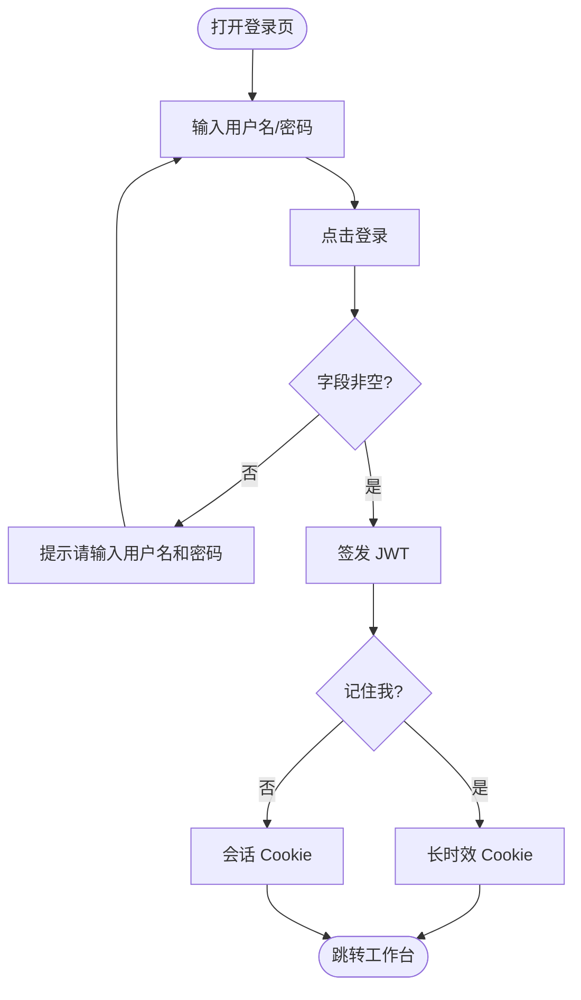
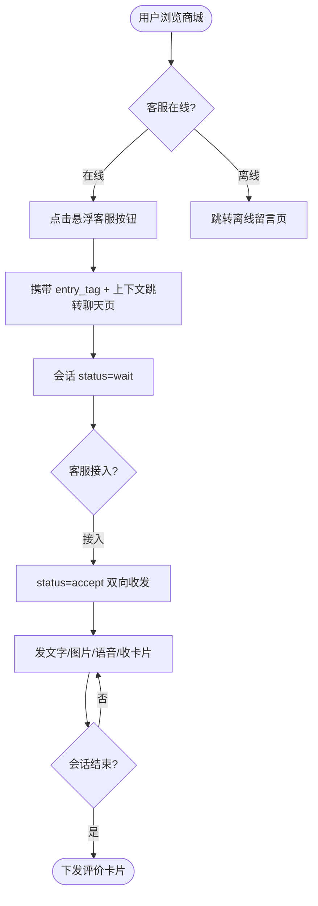
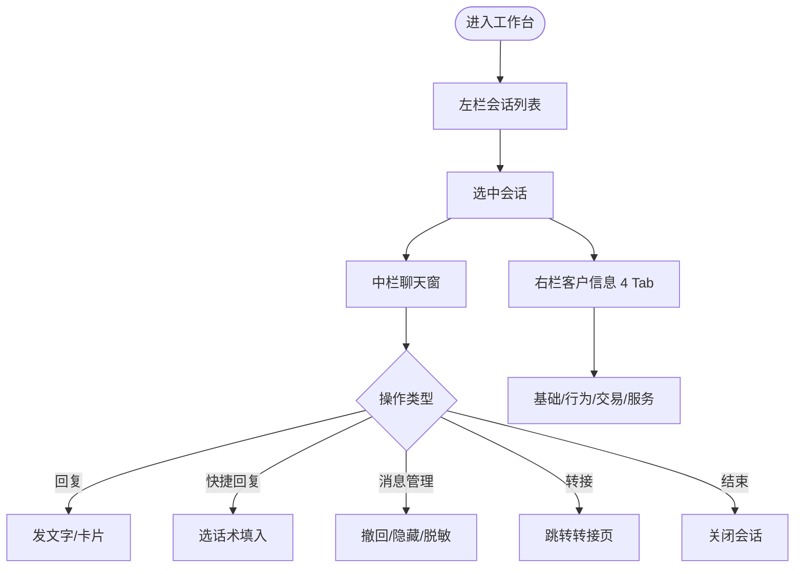
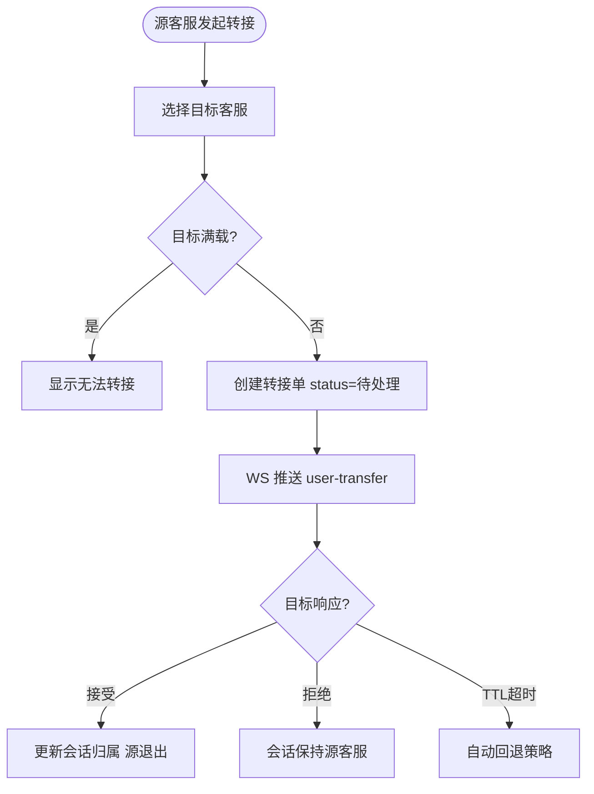
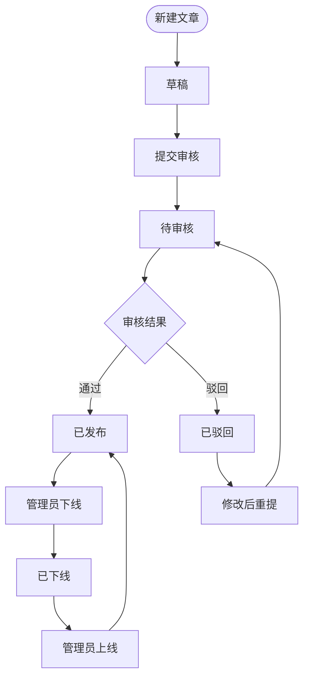
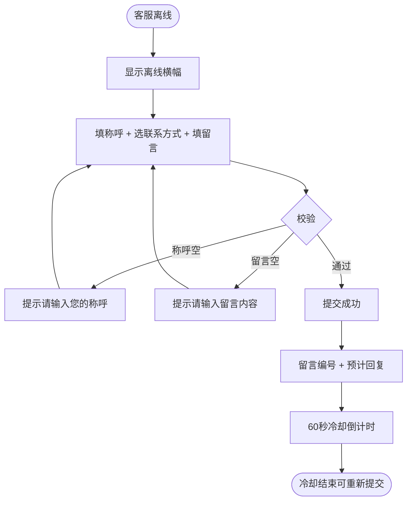
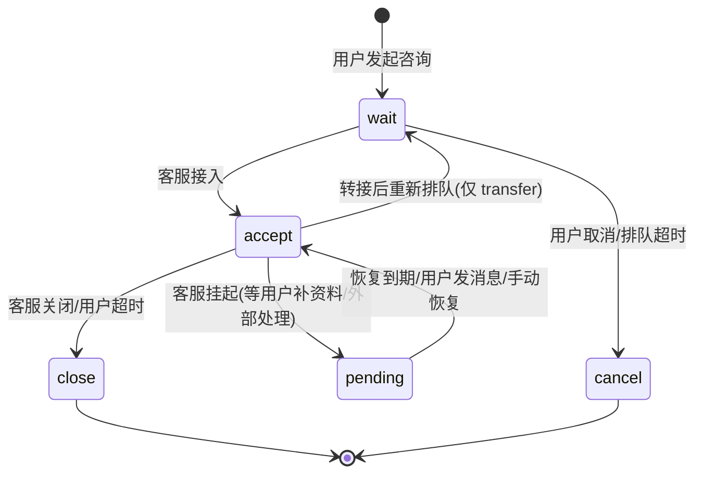

# OCS（在线客服）- PRD V1.0

> 版本：V1.0（1期 MVP） | 最后更新：2026-06-15
> 原则：一页纸讲清楚，图大于文，只写差异不写常识
> 范围口径：**1 期 MVP**（17 个原型页面 = 管理端 12 页 + 用户端 5 页，可独立闭环上线）；2/3 期内容以 灰字 标注，不纳入本期上线范围（详见 1.2）
> 角色口径：本 PRD 将业务逻辑清单的 5 角色（User/Agent/Admin/Backend/DB）合并为 **3 角色**（U/A/SYS），SYS 含管理员人工操作 + 后端系统自动化，状态流转「触发角色」列文字区分手动/自动
> 数据源：《业务逻辑清单_V1.0.md》《PROTOTYPE-FLOWS.md》（覆盖 20 页，本 PRD 取其中 1 期 17 页）

---

## 目录

- [一、范围边界](#一范围边界)
  - [1.1 本次做（In Scope）](#11-本次做in-scope)
  - [1.2 本次不做（Out of Scope）](#12-本次不做out-of-scope)
- [二、角色列表](#二角色列表)
- [模块 A · 登录认证](#模块-a--登录认证)
  - [A.1 功能用例与验收](#a1-功能用例与验收)
  - [A.2 核心流程](#a2-核心流程)
  - [A.3 数据流向](#a3-数据流向)
- [模块 U · 用户端咨询](#模块-u--用户端咨询)
  - [U.1 功能用例与验收](#u1-功能用例与验收)
  - [U.2 核心流程](#u2-核心流程)
  - [U.3 数据流向](#u3-数据流向)
- [模块 W · 工作台](#模块-w--工作台)
  - [W.1 功能用例与验收](#w1-功能用例与验收)
  - [W.2 核心流程](#w2-核心流程)
  - [W.3 数据流向](#w3-数据流向)
- [模块 S · 会话服务](#模块-s--会话服务)
  - [S.1 功能用例与验收](#s1-功能用例与验收)
  - [S.2 核心流程](#s2-核心流程)
  - [S.3 数据流向](#s3-数据流向)
- [模块 C · 内容配置](#模块-c--内容配置)
  - [C.1 功能用例与验收](#c1-功能用例与验收)
  - [C.2 核心流程](#c2-核心流程)
  - [C.3 数据流向](#c3-数据流向)
- [模块 F · 用户端自助](#模块-f--用户端自助)
  - [F.1 功能用例与验收](#f1-功能用例与验收)
  - [F.2 核心流程](#f2-核心流程)
  - [F.3 数据流向](#f3-数据流向)
- [七、单据流转](#七单据流转)
- [八、接口时序](#八接口时序)
- [九、实时通信](#九实时通信)

---

## 一、范围边界

### 1.1 本次做（In Scope）

| 编号 | 模块 | 代号 | 功能点 | 优先级 | 说明 |
|------|------|:-:|--------|:-:|------|
| F-01 | 登录认证 | A | 管理端登录（账号密码 + 记住我 + JWT 鉴权） | P0 | 管理端唯一入口 |
| F-02 | 用户端咨询 | U | 9 场景咨询入口 + 聊天主界面（文字/图片/语音/卡片） | P0 | 用户旅程起点 |
| F-03 | 工作台 | W | 数据仪表盘 + 客服工作台（三栏）+ 待办事项 | P0 | 客服核心工作界面 |
| F-04 | 会话服务 | S | 历史会话 + 客户信息 + 会话转接 + 评价管理 + 留言管理 | P0 | 会话全生命周期 |
| F-05 | 内容配置 | C | 知识库管理 + 话术库 + 系统设置（路由/超时/敏感词/欢迎语） | P1 | 客服运营配置 |
| F-06 | 用户端自助 | F | FAQ 常见问题 + 离线留言 + 服务评价 | P0 | 用户旅程末端 |

> **仪表盘口径调整**：`admin-dashboard.html` 排期表原标 2 期，但原型已按 1 期实现且与工作台/待办存在跳转联动，经确认纳入 1 期上线，避免闭环断裂。
>
> **17 页拆分明细**：管理端 12 页（登录、仪表盘、工作台、待办、历史会话、客户信息、转接、评价管理、留言管理、知识库、话术库、系统设置）+ 用户端 5 页（入口、聊天、FAQ、离线留言、服务评价）。排除 AI 三页（ai-bot-config/ai-quality/ai-report，3 期）。
>
> **版本归属声明**：排期表（线上客服排期_20260610.xlsx）与本 PRD 存在版本归属不一致时（如仪表盘排期标 V2 但 PRD 纳入 V1），**以本 PRD 为准**。排期表为早期规划产物，PRD 为最终版本定义依据。

### 1.2 本次不做（Out of Scope）

> 口径 B（按排期表完整规划）。以下功能本期不开发，原型/排期表相关规划以 灰字 标注，供后续版本参考。

**2 期 · 体验提升**（共 17 项）：

- 工单系统 B8（V2 上线客服工单模块，占用位页 admin-ticket.html；OMS 工单系统于 V2 废弃，由客服工单统一承接）
- 实时监控面板 / 个人绩效看板 / 预警机制 / 会话量统计 / 渠道统计（数据看板增强）
- 消息预显 / 三方会话 / 拉黑屏蔽（会话工作区增强）
- 客户标签体系（360° 客户视图增强）
- AI 话术推荐 / 商品推荐 / 订单上下文提醒 / 转人工意图提示（右栏 AI 辅助）
- 主动推送消息（会话配置增强）
- 关键词联想（知识库增强）
- 消息已读回执 / 输入状态提示（聊天窗增强）
- FAQ 多轮引导 / 猜你想问 / 自助办理 / 智能自助服务（FAQ 增强）
- 大模型智能客服（基础版）

**3 期 · AI 智能化**（共 25+ 项）：

- 机器人配置（ai-bot-config.html，流程设计器/意图管理/知识库关联）
- 智能质检（ai-quality.html，AI 自动评分/规则配置）
- 报表看板（ai-report.html，趋势/排行/渠道/AI 解决率/热力图）
- 客服账号管理 / 技能组 + 权重分流 / 6 种角色权限
- 渠道接入：IVR 电话 / 邮件 / 抖音小红书私信
- 智能客服核心能力：意图识别 / 知识图谱 / NLP 多模态 / 文档解析 / 上下文记忆
- 售前智能客服：商品参数对比 / 促销解读 / 尺码推荐 / 个性化推荐
- 售中售后智能客服：物流跟踪 / 订单状态查询 / 退换货引导 / 退差价改地址
- 人机协同：无缝转人工 / 辅助模式 / AI 会话摘要

> 原型侧处理：2/3 期页面（`ai-bot-config.html`、`ai-quality.html`、`ai-report.html`）文件保留，已从侧边栏导航与原型首页入口隐藏（灰字折叠），1 期不进入导航流。详见 `prototype-cs/nav.js`、`prototype-cs/index.html`。

---

## 二、角色列表

| 角色 | 代号 | 说明 |
|------|:-:|------|
| 终端用户 | U | 商城 C 端用户，通过商城各页面悬浮按钮发起咨询 |
| 客服 | A | 客服人员，管理端核心使用者，负责会话接待/转接/留言回复 |
| 系统·管理员 | SYS | 合并管理员（人工配置：路由/敏感词/知识库审核/留言分配）与后端系统（自动：超时关闭/cron 扫描/WS 推送）。状态流转「触发角色」列统一写 SYS，文字区分手动/自动 |

---

# 模块 A · 登录认证

管理端登录是客服进入系统的唯一入口，校验通过后签发 JWT，后续所有 `/api/backend/*` 请求与 WebSocket 连接均凭此鉴权。

## A.1 功能用例与验收

### 功能用例表

| 编号 | 角色 | 场景 | 动作 | 预期结果 |
|------|------|------|------|----------|
| UC-A-01 | A | 登录 | 输入用户名/密码 → 点击「登录」 | 字段非空校验通过 → 签发 JWT → 跳转工作台 |
| UC-A-02 | A | 密码明暗文切换 | 点击密码框右侧「眼睛」图标 | 密码框 `type` 在 password/text 间切换，图标切换 |
| UC-A-03 | A | 记住我 | 勾选/取消「记住我」复选框 | 影响 JWT Token 存储时长（Cookie 过期时间） |

### 验收标准

| 编号 | 对应用例 | Given | When | Then |
|------|:------:|-------|------|------|
| AC-A-01 | UC-A-01 | 已进入登录页，用户名 `admin`、密码 `123456` 已默认填入 | 点击「登录」按钮 | 校验通过，提示「登录成功（原型演示）」，跳转 `index.html` |
| AC-A-02 | UC-A-01 | 未输入用户名或密码 | 点击「登录」按钮 | 提示「请输入用户名和密码」，阻止提交 |
| AC-A-03 | UC-A-02 | 已进入登录页 | 点击眼睛图标 | 密码 `type` 切换 text/password，眼睛/闭眼图标切换 |
| AC-A-04 | UC-A-03 | 已进入登录页 | 点击「记住我」复选框区域 | 复选框 `.checked` 类切换；点击区域内 A 标签链接不触发勾选（`e.target.tagName==='A'` 拦截） |
| AC-A-05 | UC-A-01 | JWT 过期或 Cookie 缺失 | 访问任意 `/api/backend/*` 受保护路由 | AdminAuth 中间件重定向 `admin-login.html` |

#### 测试账号

| 账号 | 姓名 | 角色 | 状态 | 用途 |
|------|------|------|------|------|
| admin / 123456 | 默认管理员 | A | 正常 | 登录验证、管理端全流程 |
| 用户端测试号 | — | U | 正常 | 用户端聊天/FAQ/留言/评价全流程 |

> 登录验证：用户名 `admin`、密码 `123456`（原型默认填入）；正式版经加密后传输。
> WebSocket 鉴权：连接 URL 携带 `?token=<JWT>`，服务端校验失败推送 `other-login` 并断开。

## A.2 核心流程

### A.2.1 主流程

### A.2.2 状态流转

| 对象 | 状态1 | → 状态2 | 触发条件 | 触发角色 | 守卫条件 |
|------|-------|---------|----------|----------|----------|
| 登录态 | 未登录 | 已登录 | 用户名密码校验通过 | A | 字段 `.trim()` 非空 |
| 登录态 | 已登录 | 未登录 | JWT 过期 / 异地登录踢出 | SYS | 旧连接收到 `other-login` 后断开 |

### A.2.3 异常与边界

| 异常场景 | 触发条件 | 处理方式 |
|----------|----------|----------|
| 异地登录踢出 | 同一账号在新设备登录 | 旧连接收到 `other-login` action 后断开，前端跳转登录页 |
| 多开警告 | 同一账号多设备同时在线 | 推送 `more-than-one` 警告，不强制踢出 |
| 忘记密码 | 点击「忘记密码？」 | 原型占位链接，正式版走找回密码流程 |

## A.3 数据流向

登录信息由客服输入，后端校验后签发 JWT，存于 Cookie；后续请求与 WS 连接均携带此 Token。

### A.3.1 数据责任

| 业务数据 | A(客服) | SYS(系统·管理员) |
|---------|---------|-----------|
| 登录凭证 | 创建（输入） | 签发/校验/失效 |

### A.3.2 字段说明

| 字段中文名 | 字段名 | 类型 | 校验规则 | 取值范围 | 来源 | 去向 | 错误提示 | 说明 |
|-----------|--------|------|----------|----------|------|------|----------|------|
| 用户名 | username | string | `.trim()` 非空 | — | 客服输入（默认 `admin`） | 登录请求体 POST `/api/backend/login` | 请输入用户名和密码 | 与 `customer_admins` 表匹配 |
| 密码 | password | string | `.trim()` 非空 | — | 客服输入（默认 `123456`） | 登录请求体（正式版加密传输） | 请输入用户名和密码 | `type` 随眼睛图标切换 |
| 记住我 | remember | boolean | — | true/false | 客服勾选状态 | 决定 JWT Cookie 过期时间 | — | true→长时效；false→会话级 |
| 租户标识 | customer_id | string | — | — | 登录页所属租户（URL/子域名推断） | 登录请求携带，隔离多租户数据 | — | 13 张核心表均按 `customer_id` 隔离 |

---

# 模块 U · 用户端咨询

用户从商城 9 个场景页点击悬浮「联系客服」按钮进入聊天，携带场景标签与上下文（商品/订单/物流等），客服端无需用户复述即可获知咨询对象。

## U.1 功能用例与验收

### 功能用例表

| 编号 | 角色 | 场景 | 动作 | 预期结果 |
|------|------|------|------|----------|
| UC-U-01 | U | 首页咨询 | 点击右下角悬浮「联系客服」按钮 | 跳转 `user-chat.html`，携带 `entry_tag: home` |
| UC-U-02 | U | 场景咨询 | 在商品/订单/购物车/物流/退换货等场景页点击客服按钮 | 跳转聊天页，自动发送对应卡片 + 携带 entry_tag + 上下文参数 |
| UC-U-03 | U | 发送文字消息 | 输入框输入文字 → 按 Enter/点「发送」 | 消息出现在右侧气泡 + 时间戳 |
| UC-U-04 | U | 发送图片/语音 | 点击图片/麦克风图标 | 发送图片（160×120 缩略图）/语音（波形+时长） |
| UC-U-05 | U | 接收客服卡片 | 客服发送订单/商品/优惠券卡片 | 左侧显示对应卡片（橙/绿/红 banner）+ 操作按钮 |
| UC-U-06 | U | 查看历史会话 | 点击顶部时钟图标 | 右侧滑入历史面板（时间/状态/客服/预览） |
| UC-U-07 | U | 悬浮按钮交互 | 长按拖动悬浮按钮 | 放大 1.1x、半透明、松手吸附最近屏幕边缘 |

### 验收标准

| 编号 | 对应用例 | Given | When | Then |
|------|:------:|-------|------|------|
| AC-U-01 | UC-U-02 | 用户在商品详情页 | 点击「商品咨询」按钮 | 跳转 `user-chat.html`，自动发送商品卡片，携带 `entry_tag:product` + `product_id` + `product_name` + `price` |
| AC-U-02 | UC-U-03 | 会话已建立（status=accept） | 输入框输入文字按 Enter | 清空输入框，消息出现在右侧气泡；空内容（`.trim().length===0`）不发送 |
| AC-U-03 | UC-U-04 | 会话已建立 | 点击麦克风图标录音并发送 | 显示语音气泡（波形条 + 时长） |
| AC-U-04 | UC-U-05 | 客服发送优惠券卡片 | 用户查看会话 | 显示优惠券卡片（红色 banner + 面额/门槛/有效期 +「立即领取」按钮） |
| AC-U-05 | UC-U-06 | 聊天页顶部 | 点击时钟图标 | 历史面板滑入（translateX 0）+ 半透明遮罩；点击关闭/遮罩则滑出 |
| AC-U-06 | UC-U-07 | 悬浮按钮可见 | 长按拖动 | 按钮放大半透明跟随手指，松手吸附屏幕边缘；位置存 localStorage 记忆 |
| AC-U-07 | UC-U-07 | 有未读消息/会话进行中 | 系统状态变化 | 按钮右上角红点角标 + 呼吸动画；会话中按钮变绿色 |

> 测试账号见「A.1 测试账号」

## U.2 核心流程

### U.2.1 主流程

> 离线分支（`user-offline.html`）见 F 模块；评价（`user-rating.html`）见 F 模块。

### U.2.2 状态流转

会话状态机（详见「七、单据流转」会话单生命周期）：

| 对象 | 状态1 | → 状态2 | 触发条件 | 触发角色 | 守卫条件 |
|------|-------|---------|----------|----------|----------|
| 会话 | — | wait | 用户发起咨询 | U | 无活跃会话 |
| 会话 | wait | accept | 客服接入 | A | 会话未被他人接入（乐观锁） |
| 会话 | accept | pending | 客服点「挂起」并设恢复时间 | A | 等待用户补充资料/外部处理，默认恢复 30 分钟 |
| 会话 | pending | accept | 恢复时间到期 / 用户发新消息 / 客服手动恢复 | SYS/U/A | 期间不计入超时统计 |
| 会话 | accept/pending | close | 客服关闭/用户超时 | A/SYS | accept 无响应超时 15 分钟；pending 不触发超时 |
| 会话 | wait | cancel | 用户取消/排队超时 | U/SYS | 仍为 wait |

### U.2.3 异常与边界

| 异常场景 | 触发条件 | 处理方式 |
|----------|----------|----------|
| 客服离线 | 进入聊天页检测无客服在线 | 跳转离线留言页（user-offline.html） |
| 电话咨询仅 H5 | 小程序环境点击「电话咨询」 | 不支持直接拨号，需 H5 环境 `tel:` 唤起 |
| 挂起会话超期未恢复 | pending 状态恢复时间到期 | 自动转回 accept，客服收到提醒；若客服离线则重新排队或转接 |
| 挂起期间用户发消息 | pending 状态收到用户新消息 | 立即转回 accept（用户行为优先于定时恢复） |

## U.3 数据流向

场景标签与上下文由前端根据当前页面自动识别，跳转聊天页时携带；会话建立后经 WebSocket 双向收发消息（WS 协议详见「九、实时通信」）。

### U.3.1 数据责任

| 业务数据 | U(用户) | A(客服) | SYS(系统·管理员) |
|---------|---------|---------|-----------|
| 场景上下文（entry_tag） | 创建（点击入口） | 查看 | 落库 `customer_chat_sessions.entry_tag` |
| 聊天消息 | 创建/发送 | 创建/发送/撤回 | 落库 `customer_chat_messages` |

### U.3.2 字段说明

| 字段中文名 | 字段名 | 类型 | 校验规则 | 取值范围 | 来源 | 去向 | 错误提示 | 说明 |
|-----------|--------|------|----------|----------|------|------|----------|------|
| 场景标签 | entry_tag | enum | — | home/product/order/cart/help/profile/logistics/refund/phone | 前端按当前页识别 | 会话建立时携带，客服端工作台展示用户来源 | — | 不同页面 tag 不同，按钮文案随之变化 |
| 上下文参数 | product_id/order_id/tracking_no 等 | string | — | — | 当前页面 URL/页面数据 | 跳转聊天页自动填充首条消息+卡片 | — | 客服端无需用户复述 |
| 消息类型 | type | enum | — | text/image/audio/order_card/product_card/coupon_card/rate | WebSocket send-message | 不同消息渲染不同气泡 | — | 卡片消息由客服端发送 |
| 客服在线状态 | — | enum | — | online/offline | WebSocket admins action | 聊天页顶部 header 状态点 | — | 离线→跳转离线留言页 |
| 悬浮按钮位置 | — | — | — | — | 用户拖拽后 localStorage 记忆 | 全站通用组件位置 | — | 松手吸附边缘，下次恢复 |

---

# 模块 W · 工作台

客服核心工作界面，含数据仪表盘（运营概览）、客服工作台（三栏：会话列表/聊天窗/客户信息）、待办事项（未回复/超时/待评价三大类集中处理）。

## W.1 功能用例与验收

### 功能用例表

| 编号 | 角色 | 场景 | 动作 | 预期结果 |
|------|------|------|------|----------|
| UC-W-01 | A | 查看仪表盘核心指标 | 进入仪表盘 | 展示今日会话数/在线客服数/平均响应时长/满意度 4 张指标卡 + 趋势箭头 |
| UC-W-02 | A | 查看待办汇总 | 进入仪表盘/待办页 | 展示超时未响应/待转接确认/差评待跟进/未读留言/知识库待审核 5 类计数 |
| UC-W-03 | A | 会话列表 Tab 切换 | 点击工作台「进行中/等待中/挂起/已关闭」Tab | 切换 active，列表按 status 分组过滤（挂起=pending） |
| UC-W-04 | A | 发送文字消息 | 选中会话，输入文字 → Enter | 清空输入框，消息经 WS `send-message` 推送 |
| UC-W-05 | A | 快捷回复 | 点「快捷回复▾」→ 选话术 | 话术填入输入框，面板关闭 |
| UC-W-06 | A | 消息撤回 | hover 客服消息 →「⋯」→「撤回」 | 消息替换为「⏱ 你撤回了一条消息」，触发器隐藏 |
| UC-W-07 | A | 用户消息管理 | hover 用户消息 →「⋯」→ 隐藏/脱敏 | 隐藏→「该消息已被管理员隐藏」；脱敏→手机号/地址打码 |
| UC-W-08 | A | 发送富媒体卡片 | 点工具栏卡片按钮（订单/商品/优惠券/图片） | 会话区生成对应卡片（橙/绿/红 banner） |
| UC-W-09 | A | 待办-未回复回复 | 待办页未回复消息 → 点「立即回复」 | 跳转工作台定位该会话 |
| UC-W-10 | A | 待办-超时接入 | 待办页超时预警 → 点「立即接入」 | 接入该会话，移出等待队列 |
| UC-W-11 | A | 待办-评价筛选催办 | 待办页点「全部/待评价/已跳过/已评价」筛选 → 「催评」 | 按 data-status 过滤；催评→向用户端推送评价邀请 |
| UC-W-12 | A | 查看客户信息（4 Tab） | 工作台右栏点「基础信息/行为数据/交易数据/服务数据」 | 切换对应面板（数据源：会员库/埋点/OMS/客服库） |
| UC-W-13 | A | 待办-超时预警分级 | 查看待办页超时预警列 | 3 级阈值预警：首次响应 >5 分钟 / 排队 >4 分钟 / 静默 >15 分钟，红（已超时）/橙（临界）着色 |
| UC-W-14 | A | 挂起会话 | 工作台选中 accept 会话 → 点「挂起」→ 填挂起原因 + 恢复时间 | status=accept→pending；会话移入「挂起」列表，暂停超时计时 |
| UC-W-15 | A | 恢复挂起会话 | 挂起会话恢复时间到期 / 用户发新消息 / 客服手动点「恢复」 | status=pending→accept；重新计入超时；客服收到提醒 |

### 验收标准

| 编号 | 对应用例 | Given | When | Then |
|------|:------:|-------|------|------|
| AC-W-01 | UC-W-01 | 已登录进入仪表盘 | 页面加载 | 4 张指标卡展示（今日会话/在线客服/平均响应/满意度）；后端 `/api/backend/dashboard` 超时→降级占位 |
| AC-W-02 | UC-W-04 | 已选中会话 | 输入框输入文字按 Enter | 清空输入框，消息出现在会话区；空内容（`.trim().length===0`）不发送；Shift+Enter 换行不发送 |
| AC-W-03 | UC-W-06 | 客服已发送文字/卡片消息 | hover→「⋯」→「撤回」 | 原消息替换为灰色斜体「⏱ 你撤回了一条消息」，加 `.is-recalled` 类，触发器隐藏 |
| AC-W-04 | UC-W-07 | 用户消息含手机号 | hover→「⋯」→「脱敏处理」 | 正则 `1[3-9]\d{9}` 匹配→`前3位****后4位`；地址匹配→`****`；消息变黄底左边框 |
| AC-W-05 | UC-W-11 | 待办页 | 点「待评价/已跳过/已评价」筛选标签 | 切换 active，按 `data-status` 过滤显示/隐藏 |
| AC-W-06 | UC-W-12 | 已选中会话 | 点右栏「交易数据」标签 | 切换 `.info-tabs .itab.active`，显示近期订单列表（订单号+状态徽标+金额+时间） |
| AC-W-07 | UC-W-14 | 选中 accept 会话 | 点「挂起」→ 填原因 + 恢复时间（默认 30 分钟）→ 确认 | status=accept→pending；会话从「进行中」移到「挂起」列表；无响应超时计时暂停 |
| AC-W-08 | UC-W-15 | 会话处于 pending | 用户发新消息 | 立即 status=pending→accept（用户行为优先于定时恢复），客服收到「会话已恢复」提醒 |
| AC-W-09 | UC-W-15 | 会话处于 pending，恢复时间到期 | cron 扫描到 resume_at ≤ now | 自动 status=pending→accept；客服离线则重新排队或转接 |

> 测试账号见「A.1 测试账号」

## W.2 核心流程

### W.2.1 主流程（工作台接待）

### W.2.2 状态流转

待评价状态机（评价详见 S 模块评价管理）：

| 对象 | 状态1 | → 状态2 | 触发条件 | 触发角色 | 守卫条件 |
|------|-------|---------|----------|----------|----------|
| 评价 | 待评价 | 已评价 | 用户提交评价 | U | 会话 status=close |
| 评价 | 待评价 | 已跳过 | 用户跳过/超时未评价 | U/SYS | 超时阈值后自动归为已跳过 |

### W.2.3 异常与边界

| 异常场景 | 触发条件 | 处理方式 |
|----------|----------|----------|
| 仪表盘数据超时 | `/api/backend/dashboard` 超时 | 降级显示占位或错误提示（原型为静态数据） |
| 实时标签断连 | WebSocket 断连 | 「实时」绿标签变灰并提示重连 |
| 客户视图数据源失败 | 会员库/埋点/OMS 任一超时 | 该 Tab 降级显示「数据暂不可用」+ 重新加载按钮；超时阈值 2s |
| 消息撤回时序 | 超过 2 分钟 | 拒绝撤回（仅允许 2 分钟内消息） |

## W.3 数据流向

会话列表按 status 分组来自 `customer_chat_sessions`；消息经 WebSocket 双向收发并落 `customer_chat_messages`；客户视图四类数据分别来自会员库/埋点/OMS/客服库，MVP 阶段行为/交易为 Mock 占位。

### W.3.1 数据责任

| 业务数据 | A(客服) | SYS(系统·管理员) |
|---------|---------|-----------|
| 会话列表 | 查看/转接/关闭 | 状态流转/超时关闭 |
| 聊天消息 | 创建/撤回/脱敏 | 落库/敏感词过滤 |
| 客户视图 | 查看 | 多源聚合/降级 |

### W.3.2 字段说明

| 字段中文名 | 字段名 | 类型 | 校验规则 | 取值范围 | 来源 | 去向 | 错误提示 | 说明 |
|-----------|--------|------|----------|----------|------|------|----------|------|
| 今日会话数 | — | number | — | ≥0 | `customer_chat_sessions` 当日新建计数（不含 cancel） | 仪表盘指标卡 + WS 实时推送 | — | **会话量口径** |
| 在线客服数 | — | number | — | ≥0 | WS 连接的客服（`ActionUserOnline`）实时统计 | 仪表盘指标卡 `X/24` | — | 客服上下线即时变化 |
| 平均响应时长 | — | number | — | ≥0 | 客服首条回复与用户首条消息的时间差均值（秒） | 仪表盘指标卡 | — | 新响应记录→滑动平均重算 |
| 满意度评分 | — | number | — | 0-5 | 评价消息（type=rate）的 rate 字段均分 | 仪表盘指标卡 `X.XX/5.0` | — | **满意度口径**：rate 均值（如 4.82/5.0），1-5 星映射 |
| 未读消息数 | — | number | — | ≥0 | `customer_chat_messages` 中 `is_read=0` 且来源=用户 | 会话项 unread-badge | — | 客服查看（ActionRead）→徽标消失 |
| 消息撤回状态 | is_recalled | boolean | — | true/false | 客服撤回操作 | 消息内容替换为撤回提示 | — | 撤回后不可再操作 |
| 紧急度等级 | urgency | enum | — | high/medium/low | 会话标签(VIP/投诉)+等待时长+关键词综合判定 | 待办紧急度标签 | — | 等待时长增加→可能升级 |
| 超时预警阈值 | alert_thresholds | object | — | 首次响应 5 分钟 / 排队 4 分钟 / 静默 15 分钟 | 系统设置（admin-settings）配置的响应/排队/静默阈值 | 待办超时预警列底部规则说明 + 预警条目着色（红已超时/橙临界） | — | 阈值与 C 模块路由/超时配置联动；管理员修改后预警列表实时刷新 |

---

# 模块 S · 会话服务

会话全生命周期管理：历史会话（多维筛选/导出）、客户信息（360°画像）、会话转接（负载均衡/TTL回退）、评价管理（差评追踪）、留言管理（分配/回复状态机）。

## S.1 功能用例与验收

### 功能用例表

| 编号 | 角色 | 场景 | 动作 | 预期结果 |
|------|------|------|------|----------|
| UC-S-01 | A | 历史会话筛选 | 设置日期/客服/关键词 → 查询 | 列表按组合条件过滤，支持重置/导出/刷新 |
| UC-S-02 | A | 查看客户 360° | 客户信息页切换 4 Tab | 基础信息/行为轨迹/交易记录/服务历史 |
| UC-S-03 | A | 客户信息降级 | 数据源超时 | 显示骨架屏或红色错误图标 + 重新加载 |
| UC-S-04 | A | 发起转接 | 工作台点「转接」→ 选目标客服 → 确认 | 创建转接单，WS 推送 user-transfer 至目标 |
| UC-S-05 | A | 转接-查看负载 | 转接页查看客服卡片容量条 | 绿(<50%)/黄(50-80%)/红(满载) 颜色区分 |
| UC-S-06 | A | 转接-TTL回退 | 转接超时无响应 | 自动回退至原客服/重新排队/取消（按配置） |
| UC-S-07 | A | 评价管理筛选 | 按评分范围/客服/关键词查询 | 列表按条件过滤，差评行黄底高亮 |
| UC-S-08 | A | 差评追踪 | 差评行点「差评追踪」 | 打开差评跟进流程（联系用户/复核/改进） |
| UC-S-09 | SYS | 留言分配 | 留言管理点「分配」→ 选处理人/优先级 → 确认 | 状态 待处理→处理中，处理人列显示 |
| UC-S-10 | SYS | 留言回复 | 处理中留言点「回复」→ 选模板/填内容 → 发送 | 状态 处理中→已回复，按通知方式推送用户 |
| UC-S-11 | SYS | 留言标记无效 | 勾选广告/骚扰留言 → 标记无效 | 状态→无效，不计入考核统计 |

### 验收标准

| 编号 | 对应用例 | Given | When | Then |
|------|:------:|-------|------|------|
| AC-S-01 | UC-S-01 | 历史会话页 | 输入关键词点查询 | 列表按用户昵称/会话ID/手机号模糊匹配；无匹配→空状态 |
| AC-S-02 | UC-S-03 | 客户信息页，数据源超时 | 系统触发/演示面板切换 | 红色错误图标 + 「数据加载失败」+ 数据源名 + 「重新加载」按钮 |
| AC-S-03 | UC-S-04 | 工作台选中会话 | 点「转接」跳转转接页 | 未选目标→确认按钮不可用；选满载客服→显示「无法转接」 |
| AC-S-04 | UC-S-06 | 转接单 TTL（默认 5 分钟，后台 1~60 分钟可配）到期 | 无响应 | 自动执行回退策略（回退原客服/重新排队/取消），推送「转接超时」 |
| AC-S-05 | UC-S-07 | 评价管理页 | 点「差评 ≤2 星」Tab | 列表过滤差评，差评行 `.bad-rating` 黄底 + 「差评追踪」链接 |
| AC-S-06 | UC-S-09 | 待处理留言（未分配） | 点「分配」→ 选处理人 → 确认 | 状态转「处理中」，「分配」按钮隐藏，「回复」按钮启用 |
| AC-S-07 | UC-S-10 | 留言未分配处理人 | 尝试点「回复」 | 按钮 disabled，hover 显示 tooltip「请先分配处理人」 |
| AC-S-08 | UC-S-10 | 待处理态直接调回复接口 | 后端校验 | 返回「请先分配处理人」（强制约束：必须先分配才能回复） |

> 测试账号见「A.1 测试账号」

## S.2 核心流程

### S.2.1 主流程（转接）

### S.2.2 状态流转

**转接单状态机**（`customer_chat_transfers`）：

| 对象 | 状态1 | → 状态2 | 触发条件 | 触发角色 | 守卫条件 |
|------|-------|---------|----------|----------|----------|
| 转接单 | — | 待处理 | 源客服发起转接 | A | 目标客服容量 < 上限 |
| 转接单 | 待处理 | 已接受 | 目标客服点接受 | A | 并发校验（乐观锁） |
| 转接单 | 待处理 | 已拒绝 | 目标拒绝/满载自动拒绝 | A | — |
| 转接单 | 待处理 | 已取消 | 源客服点取消 | A | — |
| 转接单 | 待处理 | 超时回退 | TTL 到期无响应 | SYS | 默认 5 分钟（后台 1~60 分钟可配） |

**留言状态机**（offline message）：

| 对象 | 状态1 | → 状态2 | 触发条件 | 触发角色 | 守卫条件 |
|------|-------|---------|----------|----------|----------|
| 留言 | 待处理 | 处理中 | 管理员分配处理人 | SYS | 必须先分配才能回复 |
| 留言 | 处理中 | 已回复 | 处理人发送回复 | SYS | 已分配处理人 |
| 留言 | 处理中/待处理 | 无效 | 标记无效 | SYS | 广告/骚扰/重复 |

### S.2.3 异常与边界

| 异常场景 | 触发条件 | 处理方式 |
|----------|----------|----------|
| 多客服抢同一会话 | 多客服同时接入同一 wait 会话 | 乐观锁：仅第一个成功（CAS），其余返回「会话已被接入」 |
| 转接并发 | 目标同时被多个源客服发起 | 转接单 `to_admin_id+session_id` 唯一约束 |
| 目标满载 | 目标客服会话数达上限 | 转接页显示「满载」+「无法转接」（cursor:not-allowed） |
| 留言时序 | 待处理态直接回复 | 强制约束：必须先分配（待处理→处理中）才能回复 |
| 转接接受一致性 | 接受后会话归属与转接单状态 | 同一事务更新 sessions.admin_id 和 transfers.status，原子性保证 |

## S.3 数据流向

转接记录来自 `customer_chat_transfers`；留言经用户端离线页提交落库，管理员分配/回复流转状态；评价数据从 `customer_chat_messages`（type=rate）聚合。

### S.3.1 数据责任

| 业务数据 | A(客服) | SYS(系统·管理员) |
|---------|---------|-----------|
| 转接记录 | 发起/催办/取消 | 接受/拒绝/超时回退 |
| 留言 | — | 分配/回复/标记无效 |
| 评价数据 | 查看/差评追踪 | 聚合/统计 |

### S.3.2 字段说明

| 字段中文名 | 字段名 | 类型 | 校验规则 | 取值范围 | 来源 | 去向 | 错误提示 | 说明 |
|-----------|--------|------|----------|----------|------|------|----------|------|
| 转接状态 | status | enum | — | pending/success/rejected/cancelled/timeout | 转接操作触发 | 状态标签（黄/绿/红/灰） | — | TTL 归零→超时回退 |
| 转接倒计时 | ttl_expire_at | datetime | — | now + TTL（默认 5 分钟） | 转接创建时写入 | 待处理行倒计时徽标 | — | TTL 后台 1~60 分钟可配；归零→触发回退策略 |
| 在线客服负载 | — | number | — | 0-上限 | WS 实时统计各客服当前会话数/最大会话数 | 转接页容量条（绿/黄/红） | — | 会话接入/结束→实时变化 |
| 转接成功率 | — | number | — | 0-100% | 已完成数/(已完成+已拒绝+已取消) | 统计条绿色 | — | **转接成功率口径** |
| 留言状态 | status | enum | — | pending/process/replied/invalid | 状态机流转 | 状态标签（黄/蓝/绿/灰） | — | 强制约束：pending 不能直接 replied |
| 评分 | rate | number | — | 1-5 | 用户评价提交（type=rate） | 评价管理星级/仪表盘均值 | — | **满意度口径**：rate 字段均分（如 4.82/5.0），与 W 模块一致；rate≤2 判定差评 |
| 催评转化率 | — | number | — | 0-100% | 已评价数/(已评价+已跳过) | 待办页待评价列底部 | — | **催评转化率口径** |

---

# 模块 C · 内容配置

客服运营配置中心：知识库管理（FAQ 文章 + 快捷回复 + 富文本编辑 + 审核闭环）、话术库（场景×业务双维度分类）、系统设置（欢迎语/离线语/路由规则/会话超时/敏感词）。

## C.1 功能用例与验收

### 功能用例表

| 编号 | 角色 | 场景 | 动作 | 预期结果 |
|------|------|------|------|----------|
| UC-C-01 | SYS | 知识库分类筛选 | 点击左侧分类树节点 | 节点高亮，右侧表格仅显示该分类文章 |
| UC-C-02 | SYS | 新建/编辑文章 | 点「+新建文章」/行「编辑」 | 编辑器展开，工具栏格式化，保存后入库 |
| UC-C-03 | SYS | 文章审核 | 待审核文章点「审核」→ 通过/驳回 | 通过→已发布；驳回→已驳回+填原因 |
| UC-C-04 | SYS | 快捷回复管理 | 点「+新增快捷回复」/启用停用 | Modal 填写（内容/分类/排序/状态），列表实时同步工作台 |
| UC-C-05 | SYS | 话术双维度筛选 | 点击场景标签 + 业务分类标签 | AND 逻辑组合筛选，计数更新 |
| UC-C-06 | SYS | 新建话术 | 右侧表单填内容+选场景+业务分类 → 保存 | 写入列表，统计刷新 |
| UC-C-07 | SYS | 编辑欢迎语 | 系统设置改 welcome_content + 选推送时机 | 用户端预览更新，区块标记 dirty |
| UC-C-08 | SYS | 配置路由规则 | 切换自动接入/分流策略/容量上限/排队超时 | 区块标记 dirty |
| UC-C-09 | SYS | 管理敏感词 | 切换全局过滤 + 选策略 + 增删 4 分组词 | 区块标记 dirty |
| UC-C-10 | SYS | 脏状态保存 | 修改任意设置 → 点「保存设置」 | 清空 dirty，底部提示消失 |

### 验收标准

| 编号 | 对应用例 | Given | When | Then |
|------|:------:|-------|------|------|
| AC-C-01 | UC-C-03 | 文章状态待审核 | 点「审核」→ 选驳回 | 显示驳回原因必填文本域；不选决定点提交→提示「请选择审核决定」 |
| AC-C-02 | UC-C-03 | 审核 Modal | 选通过/驳回（驳回填原因）→ 提交 | 通过→状态已发布，操作列恢复；驳回→状态已驳回，操作列变「查看驳回原因/修改重提/删除」 |
| AC-C-03 | UC-C-05 | 已选场景标签 | 再点业务分类标签 | 同时满足双条件话术显示，无匹配→计数 0 |
| AC-C-04 | UC-C-06 | 关键词匹配场景 | 选「关键词匹配」 | 额外显示「触发关键词」输入框 |
| AC-C-05 | UC-C-07 | 欢迎语区块 | 改 welcome_content（200字限制） | 实时字数统计，区块加 `.dirty` 类（左侧 3px 橙色竖条） |
| AC-C-06 | UC-C-10 | 有 dirty 区块 | 点锚点导航链接 | 弹出「您有未保存的修改，确定要离开吗？」；取消→阻止跳转 |
| AC-C-07 | UC-C-10 | 有 dirty 区块 | 点「保存设置」 | dirtySections.clear()，所有区块移除 dirty 类，底部提示消失 |

> 测试账号见「A.1 测试账号」

## C.2 核心流程

### C.2.1 主流程（知识库文章审核）

### C.2.2 状态流转

**知识库文章状态机**（`customer_chat_knowledge_base`）：

| 对象 | 状态1 | → 状态2 | 触发条件 | 触发角色 | 守卫条件 |
|------|-------|---------|----------|----------|----------|
| 文章 | 草稿 | 待审核 | 作者提交 | SYS | 必填项齐全 |
| 文章 | 待审核 | 已发布 | 审核员通过 | SYS | 审核期间内容未修改 |
| 文章 | 待审核 | 已驳回 | 审核员驳回 | SYS | 必填驳回原因 |
| 文章 | 已驳回 | 待审核 | 作者修改后重提 | SYS | 修改了被驳回字段 |
| 文章 | 已发布 | 已下线 | 管理员下线 | SYS | — |
| 文章 | 已下线 | 已发布 | 管理员上线 | SYS | 不需再次审核 |

**话术状态机**（快捷回复/话术库）：

| 对象 | 状态1 | → 状态2 | 触发条件 | 触发角色 | 守卫条件 |
|------|-------|---------|----------|----------|----------|
| 话术 | — | 启用 | 新建默认/手动启用 | SYS | — |
| 话术 | 启用 | 停用 | 管理员停用 | SYS | — |

### C.2.3 异常与边界

| 异常场景 | 触发条件 | 处理方式 |
|----------|----------|----------|
| 并发编辑同一文章 | 两管理员同时编辑 | 编辑锁定：进入编辑态锁定，他人见「正在被 XX 编辑」；30 分钟无操作自动释放 |
| 敏感词 fail-open | 词库加载失败 | 放行 + 告警（fail-open 策略） |
| 敏感词命中 | 消息含敏感词 | 按策略：替换 `***`/拦截返回错误/仅记录审计；红线词强制拦截 |

## C.3 数据流向

知识库文章由管理员创建维护，经审核闭环发布至用户端 FAQ；话术库按场景×业务分类，工作台快捷回复面板实时同步；系统设置影响路由/超时/敏感词全局行为。

### C.3.1 数据责任

| 业务数据 | A(客服) | SYS(系统·管理员) |
|---------|---------|-----------|
| 知识库文章 | 查看 | 创建/修改/审核/上下线 |
| 话术 | 使用（快捷回复） | 创建/修改/启停 |
| 系统设置 | — | 配置/保存/重置 |

### C.3.2 字段说明

| 字段中文名 | 字段名 | 类型 | 校验规则 | 取值范围 | 来源 | 去向 | 错误提示 | 说明 |
|-----------|--------|------|----------|----------|------|------|----------|------|
| 文章状态 | status | enum | — | published/draft/review/offline/rejected | 审核操作 | 表格状态标签 | — | 审核通过→published；驳回→rejected |
| 文章分类 | category | enum | — | order/return/pay/logistic/account | `customer_chat_kb_categories` 分类树 | 分类树节点 + 表格分类标签 | — | 点击节点筛选右侧列表 |
| 快捷回复分类 | qr_category | enum | — | general/greeting/presale/aftersale/complaint/logistic | `customer_chat_auto_messages.category` | 快捷回复表格分类标签 | — | 6 种分类对应 6 种颜色 |
| 话术场景 | scene | enum | — | enter/offline/keyword/transfer/general | `customer_chat_auto_rule_scenes` 场景表 | 话术条目 scene-badge + 筛选标签 | — | 关键词匹配场景→额外显示触发关键词 |
| 话术业务分类 | biz | enum | — | presale/aftersale/complaint/general | 话术 `data-biz` 属性 | 话术条目 biz-* 颜色标签 | — | 与场景标签 AND 组合筛选 |
| 欢迎语 | welcome_content | string | ≤200字 | — | `customer_chat_settings.welcome_content` | 文本域 + 用户端预览气泡 | — | 保存后新会话 0.5s 内自动推送 |
| 离线语 | offline_content | string | — | — | `customer_chat_settings.offline_content` | 离线态预览气泡 | — | 所有客服离线时展示 |
| 自动接入 | is_auto_accept | boolean | — | true/false | `customer_chat_settings` 路由配置 | 路由规则 switch 开关 | — | 开启后按分流策略自动分配 |
| 单客服接待上限 | max_sessions | number | 默认 10 | ≥1 | 系统设置路由配置 | 客服容量满载判定/转接页容量条 | — | 容量设为 0→该客服不参与自动分配（手动接入不受限） |
| 排队超时转人工 | queue_timeout | number | 默认 120 秒 | ≥0 | 系统设置路由配置 | cron 扫描，超时触发转人工/留言 | — | 与待办预警「排队 4 分钟临界」阈值联动 |
| 关键词转人工词表 | transfer_keywords | array | 可增删 | 人工/客服/投诉/退款/售后/转人工 | 系统设置路由配置 | 紫色标签列表 | — | 用户消息命中任一关键词时自动转人工，跳过机器人 |
| 分流策略 | routing_strategy | enum | — | 轮询分配/按空闲度分配/按客户优先级 | `customer_chat_settings` 路由配置 | 三选一 radio-card | — | 保存后对新会话生效 |
| 用户无响应超时 | idle_timeout | number | 默认 15 分钟 | ≥0 | 系统设置超时配置 | cron 每 1 分钟扫描，超时推送提醒 | — | 待办预警「静默 15 分钟」对应此阈值 |
| 自动关闭时长 | auto_close_timeout | number | 默认 30 分钟 | ≥0 | 系统设置超时配置 | cron 扫描，超时 status=close | — | wait/accept → close；pending 状态不触发自动关闭 |
| 挂起默认恢复时间 | pending_resume_default | number | 默认 30 分钟 | ≥0 | 系统设置超时配置 | 客服挂起会话时的默认倒计时 | — | pending 到期自动恢复 accept；期间不计超时 |
| 敏感词策略 | sensitive_strategy | enum | — | 替换/拦截/仅记录 | 系统设置敏感词配置 | 消息发送中间件 | — | 替换→`***`；拦截→阻断返回错误；红线词强制拦截 |
| 今日敏感词命中 | — | number | — | ≥0 | 消息发送实时检测统计 | 敏感词区块统计 | — | 命中按策略处理 |

---

# 模块 F · 用户端自助

用户旅程末端：FAQ 常见问题（自助 + 服务指南）、离线留言（客服离线时提交）、服务评价（4 维度评分 + 标签 + 文字）。

## F.1 功能用例与验收

### 功能用例表

| 编号 | 角色 | 场景 | 动作 | 预期结果 |
|------|------|------|------|----------|
| UC-F-01 | U | FAQ 搜索/分类筛选 | 搜索框输入/点分类标签 | 按关键词/分类过滤 FAQ 列表 |
| UC-F-02 | U | FAQ 展开答案 | 点击 FAQ 条目 | 单展开模式，显示绿色答案气泡 + 有用/没用反馈 |
| UC-F-03 | U | FAQ 转人工 | 点底部「转人工客服 ›」 | 跳转 user-chat.html |
| UC-F-04 | U | 离线留言填写 | 填称呼/选联系方式类型/填留言 | 必填校验，联系方式类型切换清空输入 |
| UC-F-05 | U | 离线留言提交 | 点「提交留言」 | 显示成功 + 留言编号 + 预计回复 + 60 秒冷却 |
| UC-F-06 | U | 评价-星级评分 | 点击 4 维度星星 | 点击位置及左侧星星变金色 |
| UC-F-07 | U | 评价-标签+文字 | 多选印象标签 + 填文字评价 | toggle selected 类，实时字数统计 |
| UC-F-08 | U | 评价-提交/跳过 | 点「提交评价」/「跳过」 | 提交→成功态；跳过→toast + 关闭弹层 |

### 验收标准

| 编号 | 对应用例 | Given | When | Then |
|------|:------:|-------|------|------|
| AC-F-01 | UC-F-02 | FAQ 列表 | 点击某条 FAQ | 收起其他展开项，当前条加 `expanded` 类（主色边框+阴影），显示答案；再次点击收起 |
| AC-F-02 | UC-F-04 | 离线表单 | 未填称呼点提交 | 提示「请输入您的称呼」 |
| AC-F-03 | UC-F-04 | 离线表单 | 切换联系方式类型胶囊 | 选中胶囊高亮，placeholder 随类型切换（手机号/微信号/邮箱），清空已输入内容 |
| AC-F-04 | UC-F-05 | 必填项已填 | 点「提交留言」 | 表单视图隐藏，成功视图显示（绿色勾选 + 留言编号 #LM... + 预计回复 + 60 秒冷却倒计时） |
| AC-F-05 | UC-F-05 | 留言已提交（冷却中） | 查看成功页 | 返回按钮禁用，文案「请等待 (Ns)」，半透明+禁止光标；倒计时结束→恢复「提交新留言」 |
| AC-F-06 | UC-F-06 | 评价弹层展开 | 点击 4 维度星星 | 点击及左侧星星 `.active` 变金色，hover 放大 1.12x；已是 1 星再点→清零 |
| AC-F-07 | UC-F-08 | 评分完成 | 点「提交评价」 | `sessionStorage.cs_rating_status='completed'`，弹层替换为成功态 |
| AC-F-08 | UC-F-08 | 评价弹层展开 | 点「跳过」 | `sessionStorage.cs_rating_status='skipped'`，toast「已跳过评价」，1 秒后关闭弹层 |

> 测试账号见「A.1 测试账号」

## F.2 核心流程

### F.2.1 主流程（离线留言）

### F.2.2 状态流转

**评价状态机**（rate）：

| 对象 | 状态1 | → 状态2 | 触发条件 | 触发角色 | 守卫条件 |
|------|-------|---------|----------|----------|----------|
| 评价 | — | 待评价 | 会话 close（正常结束） | SYS | cancel 状态不生成评价任务 |
| 评价 | 待评价 | 已评价 | 用户提交评价 | U | 星级+标签+文字 |
| 评价 | 待评价 | 已跳过 | 用户跳过/超时 | U/SYS | 超时阈值后自动归为已跳过 |

### F.2.3 异常与边界

| 异常场景 | 触发条件 | 处理方式 |
|----------|----------|----------|
| 留言重复提交 | 同一 user_id 60 秒内相似内容 | 60 秒冷却：仅保留首条，返回「请勿重复提交」+ 展示原留言编号 |
| 评价文字超长 | 文字评价 >200 字 | 前端实时字数统计，超出截断并提示 |
| 跳过状态持久化 | 用户曾跳过评价 | 页面刷新读 `sessionStorage.cs_rating_status`，skipped/completed→不再弹评价 |

## F.3 数据流向

FAQ 内容来自管理端知识库已发布文章；离线留言经用户提交落库后进入管理端待办并通知客服；评价写入 `customer_chat_messages`（type=rate）同步至评价管理。

### F.3.1 数据责任

| 业务数据 | U(用户) | SYS(系统·管理员) |
|---------|---------|-----------|
| FAQ 内容 | 查看/反馈 | 创建/审核/发布 |
| 离线留言 | 创建（提交） | 分配/回复 |
| 服务评价 | 创建（评分） | 聚合/统计 |

### F.3.2 字段说明

| 字段中文名 | 字段名 | 类型 | 校验规则 | 取值范围 | 来源 | 去向 | 错误提示 | 说明 |
|-----------|--------|------|----------|----------|------|------|----------|------|
| FAQ 分类 | category | enum | — | order/refund/pay/logistics/account | 文章 category 字段 | 分类标签栏 + 条目 data-cat | — | 点击分类标签过滤显示 |
| 命中频次 | — | number | — | ≥0 | FAQ 浏览/搜索统计聚合 | 条目右侧火焰图标 + 次数 | — | 高频标注 HOT 红色标签 |
| 联系方式类型 | contact_type | enum | — | phone/wechat/email | 用户选择 | 输入框 placeholder 切换 | — | 切换类型清空已输入内容 |
| 留言编号 | — | string | — | #LM+日期+序号 | 系统自动生成 | 成功页展示 | — | — |
| 冷却倒计时 | — | number | — | 60→0 秒 | 前端 setInterval 每秒递减 | 成功页倒计时 + 返回按钮禁用 | — | 归零后恢复提交能力 |
| 4 维度评分 | attitude/speed/professional/solution | number | — | 1-5 | 用户点击星星（data-val） | 星星 active 类金色高亮 | — | 提交后写入 rate 字段 |
| 评价状态 | cs_rating_status | enum | — | completed/skipped | sessionStorage | 控制弹层是否再次弹出 | — | completed/skipped 后本会话不再弹 |

---

## 七、单据流转

### 7.1 会话单（customer_chat_sessions）生命周期

| 阶段 | 触发 | 单据字段变更 | 关联动作 |
|------|------|--------------|----------|
| 创建 | 用户点击客服按钮 | id/user_id/customer_id/entry_tag/status=wait/created_at | 推送等待计数；触发欢迎语 |
| 接入 | 客服接入 | admin_id/status=accept/accepted_at | 推送 user-online；加载客户视图 |
| 交互 | 消息收发循环 | 持续写 customer_chat_messages | 敏感词过滤；撤回；已读同步 |
| 挂起 | 客服点「挂起」并设恢复时间 | status=pending/pending_reason/resume_at | 暂停超时计时；用户发消息立即恢复 |
| 恢复 | pending 恢复时间到期/用户发新消息/手动恢复 | status=accept/resumed_at | 重新计入超时；客服收到提醒 |
| 转接 | 源客服发起 | 创建 transfers 单；接受后更新 admin_id | 推送 user-transfer；TTL 倒计时 |
| 结束 | 客服关闭/超时 | status=close/closed_at | 下发评价卡片；归档；触发质检（异步） |

> 转接过程会话不重新创建，仅变更 admin_id 归属；仅「重新排队」类型短暂回到 wait。
> pending 状态不计入无响应超时，避免客服等待用户补资料时被误判超时；用户发新消息立即恢复 accept（用户行为优先）。

### 7.2 留言单（offline message）生命周期

| 阶段 | 触发 | 单据字段变更 | 关联动作 |
|------|------|--------------|----------|
| 提交 | 用户离线页提交（校验通过） | id(编号#LM...)/user_id/name/contact/content/status=待处理/created_at | 60 秒冷却防重；通知管理员 |
| 分配 | 管理员选处理人 | assignee_id/priority/status=处理中/assigned_at | 锁定处理人；通知 |
| 回复 | 处理人发送回复 | reply_content/reply_method/result/status=已回复/replied_at | 按通知方式推送用户 |
| 标记无效 | 管理员标记 | status=无效/invalid_reason | 不通知用户；保留审计 |

> 强制约束：status=待处理时不允许直接回复，必须先分配进入处理中。

### 7.3 转接单（customer_chat_transfers）生命周期

| 阶段 | 触发 | 单据字段变更 | 关联动作 |
|------|------|--------------|----------|
| 发起 | 源客服选目标并确认 | id/session_id/from_admin_id/to_admin_id/reason/status=待处理/ttl_expire_at | 推送 user-transfer；TTL 启动 |
| 接受 | 目标点接受 | status=已接受/accepted_at | 更新会话 admin_id；源退出；通知用户 |
| 拒绝 | 目标点拒绝/满载自动 | status=已拒绝/rejected_at | 会话保持源客服 |
| 取消 | 源点取消 | status=已取消/cancelled_at | 会话保持源客服 |
| 超时回退 | TTL 到期无响应 | status=超时/timed_out_at | 会话保持源客服；推送「转接超时」 |

---

## 八、接口时序

### 8.1 同步接口

| # | 操作 | 请求路径 | 请求参数 | 响应结构 | 异常码 |
|---|------|----------|----------|----------|--------|
| 1 | 管理员登录 | POST `/api/backend/login` | username/password/remember/customer_id | JWT token | 凭证错误 |
| 2 | 仪表盘数据 | GET `/api/backend/dashboard` | 时间范围 | 指标卡数据 | 超时降级 |
| 3 | 客服接入会话 | POST `/api/backend/session/accept` | session_id | accept 状态 | 已被接入（并发） |
| 4 | 发起转接 | POST `/api/backend/transfer/create` | session_id/to_admin_id/reason | 转接单 | 目标满载 |
| 5 | 接受转接 | POST `/api/backend/transfer/accept` | transfer_id | 接受成功 | 容量满载/并发 |
| 6 | 留言分配 | POST `/api/backend/leave/assign` | leave_id/assignee_id/priority | 处理中 | 状态非待处理 |
| 7 | 留言回复 | POST `/api/backend/leave/reply` | leave_id/content/method/result | 已回复 | 未分配（强制先分配） |
| 8 | 用户提交评价 | POST `/api/user/rate` | session_id/rate/tags/comment | 成功 | 会话非 close/重复评价 |
| 9 | 用户离线留言 | POST `/api/user/offline/submit` | name/contact/content | 留言编号 | 冷却命中 |
| 10 | 客户视图聚合 | GET `/api/backend/customer/info` | user_id | 4 Tab 数据 | 部分降级 |

### 8.2 异步流程

| # | 触发事件 | 处理链路 | 重试策略 | 补偿机制 |
|---|----------|----------|----------|----------|
| 1 | 消息发送 | User/Agent WS → 存库 → 推送对端 | 存库失败返回 error；推送失败重连拉历史 | 断线重连上报 last_message_id |
| 2 | 会话超时关闭 | cron 扫描 → 无响应会话 → close → 推送 | 扫描失败下次重试；单会话失败跳过告警 | — |
| 3 | 转接 TTL 回退 | 定时扫描 ttl_expire_at < now → 超时 → 推送 | — | 源客服可重新选择目标 |
| 4 | 敏感词过滤 | 消息链路中间件 → 命中词库 → 策略处理 | 词库加载失败放行+告警（fail-open） | — |
| 5 | 客户视图聚合 | 并行调 会员库/埋点/OMS → 聚合 | 任一源失败降级；超时 2s | 全失败→仅基础信息 |
| 6 | 离线留言通知 | 站内信兜底 + 短信/微信 | 站内信必达；短信/微信失败重试队列 | 不阻塞状态变更 |

---

## 九、实时通信

本系统核心载体为 WebSocket（IM 场景），REST 接口表达不了的服务端主动推送全部收口于此。

### 9.1 连接协议

| 项 | 说明 |
|----|------|
| 协议 | WebSocket（ws/wss） |
| 鉴权 | 连接 URL 携带 `?token=<JWT>`，服务端校验失败推送 `other-login` 并断开 |
| 心跳 | ping/pong 保活，超时断开重连 |
| 断线补偿 | 重连后客户端上报 `last_message_id`，后端推送该 ID 之后缺失消息，避免重复/遗漏 |

### 9.2 Action 协议

| Action | 方向 | 触发时机 | 说明 |
|--------|------|----------|------|
| send-message | 双向 | 发送消息 | 用户/客服发消息 |
| receive-message | S→C | 对方发消息 | 推送新消息 |
| receipt | S→C | 发送回执 | 返回 message_id + timestamp |
| read | 双向 | 已读通知 | 更新 is_read，推送对端 |
| user-online | S→C | 用户上线 | 通知客服端 |
| user-offline | S→C | 用户下线 | 通知客服端 |
| waiting-users | S→C | 队列变化 | 推送等待列表 |
| waiting-user-count | S→C | 队列计数 | 实时更新等待人数 |
| admins | S→C | 客服列表 | 用户端展示在线客服 |
| user-transfer | S→C | 转接 | 通知目标客服 |
| other-login | S→C | 异地登录 | 旧连接踢出 |
| more-than-one | S→C | 多开 | 多设备警告 |
| error-message | S→C | 错误 | 推送错误信息 |

> 消息类型：text / image / audio / video / pdf / navigator / rate / notice。
> 消息来源：0=用户 / 1=客服 / 2=系统 / 3=AI（AI 来源为 3 期，1 期 source=0/1/2）。

---

## 检查清单（自查）

- [x] 核心流程图能独立表达主流程（不看文字也能看懂）
- [x] 每条用例的 Given-When-Then 可独立测试
- [x] UC↔AC 对应用例列完整，每条验收可追溯到具体用例
- [x] 涉及数据字段标注「来源」和「去向」；统计指标口径写入字段表来源列
- [x] 版本级内容只写一次，未在模块间重复；测试账号全文仅 A 模块一次
- [x] 各模块 UC/AC/代号不跨模块冲突（A/U/W/S/C/F 全局唯一）
