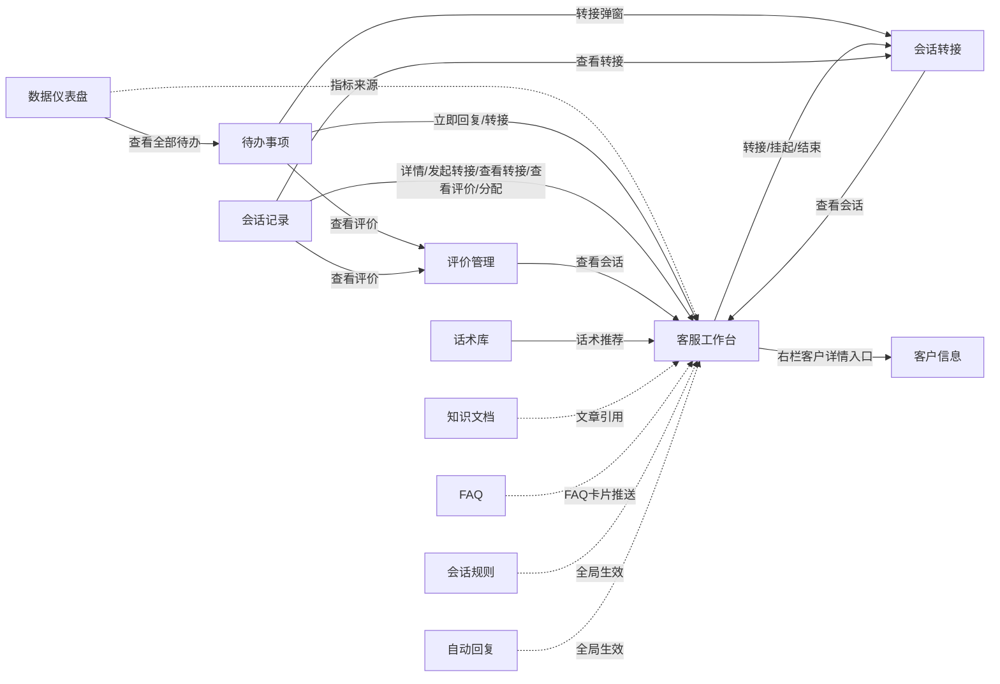
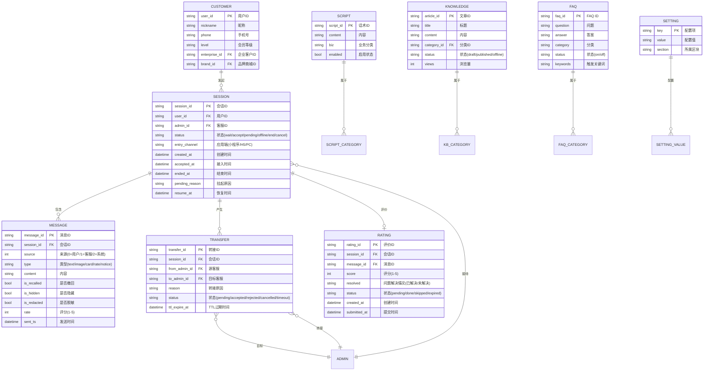
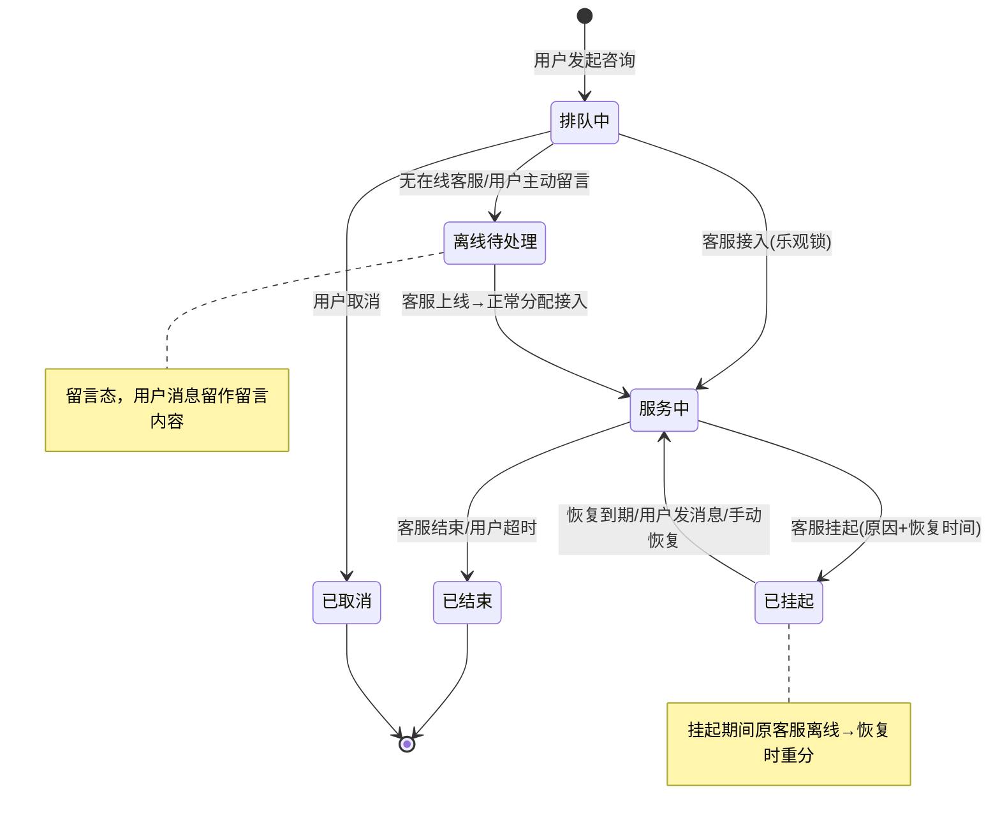
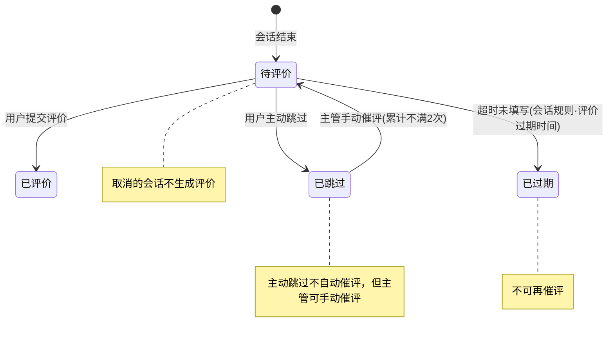
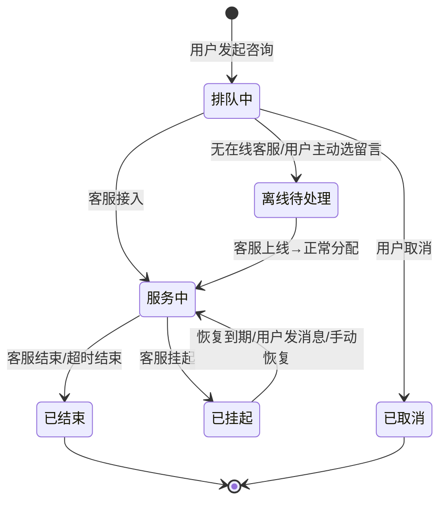
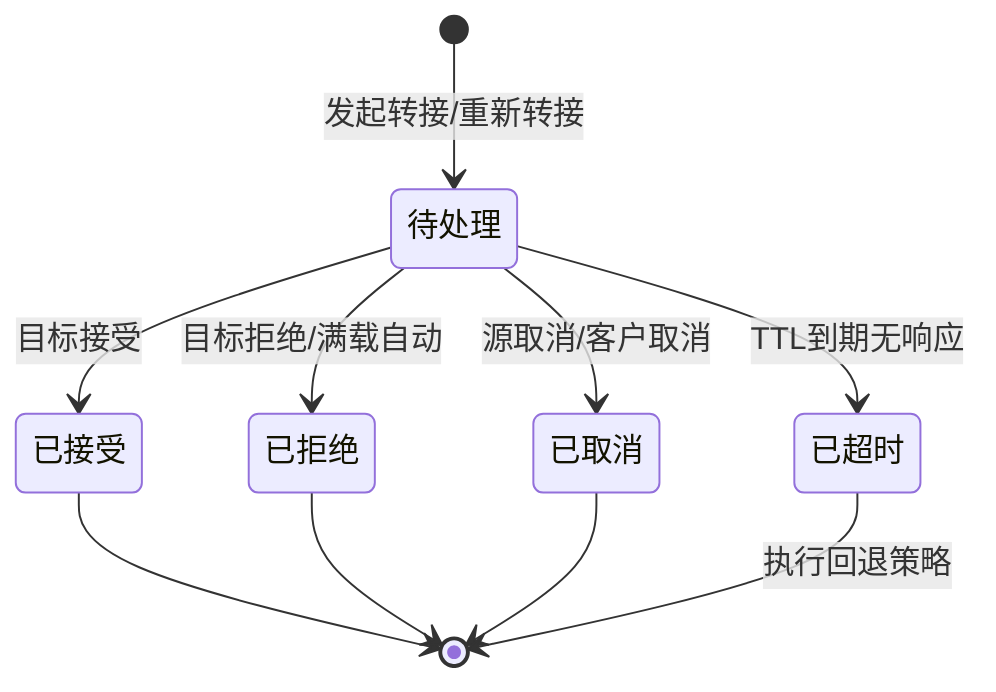
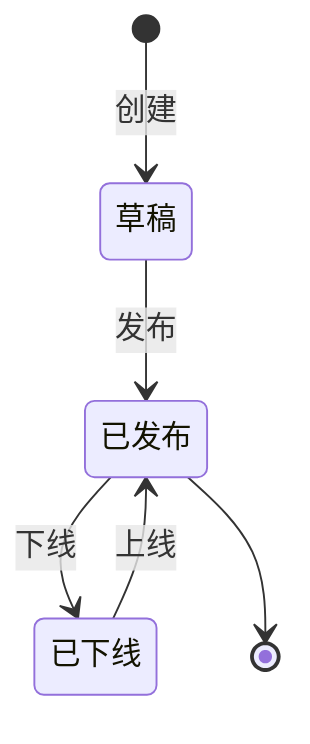

# PRD-后台-V0.8

> **版本**: V0.8 | **日期**: 2026-07-06 | **状态**: 评审稿
>
> **原型目录**: `prototype-cs/admin/`
>
> **评审议题**:
> 1. **业务对象全生命周期与功能菜单对应** — 7类核心业务对象：会话(6种状态)、转接(5种状态)、服务评价(4种状态)、知识库文章(3种状态)，以及FAQ、话术、客户信息(简单启停/查看)。确认每个对象的完整生命周期在12个功能菜单中都能找到对应的处理入口和查询出口。
> 2. **会话主轴与子流程衔接** — 会话是唯一服务主线，转接和评价是会话结束路径上的子流程。确认转接超时后3种回退方式、评价跳过规则、重复排队2次终止等兜底规则。
> 3. **各功能模块职责边界** — 会话记录负责回溯查询；客户信息独立页是完整档案；待办事项是从各模块聚合的督办入口，需确认它与各源头的数据同步机制。客服工作台属另一篇PRD，本稿仅保留会话状态机及关键关联说明。
> 4. **系统配置项覆盖** — 会话规则(4区块) + 自动回复(5段) 共20+项，是否覆盖了上线所需全部可调参数，默认值是否合理。
> 5. **数据表设计** — 7张核心数据表的字段是否完整、新建表命名是否与现有体系一致、敏感词对接商城的集成方案。
> 6. **消息推送与断线恢复** — 8类实时消息推送是否覆盖全部业务场景、客服断线重连后能否补拉丢失的消息、6种业务卡片类型是否完整。

---

## 一、范围边界

| 范围 | 内容 |
|------|------|
| **In Scope** | 数据仪表盘 / 待办事项 / 会话记录（含离线待处理留言态） / 客户信息 / 会话转接 / 评价管理 / 知识文档 / 话术库 / FAQ / 会话规则 / 自动回复（11 个模块，11 个原型页 + 客户信息页不在侧边栏导航） |
| **Out Scope** | 客服工作台（详见另一篇PRD《PRD-客服工作台》，本稿仅保留会话状态机及关键关联说明）；用户端（聊天界面/FAQ自助/留言提交/评价提交，属另一篇PRD）；2期（工单系统/客服账号管理/技能组/渠道接入/实时监控/个人绩效/标签体系/三方会话/消息预显/AI辅助）；3期（AI机器人/智能质检/报表看板） |

### 一.1 角色列表

| 代号 | 角色 | 说明 |
|------|------|------|
| R-A | 客服 | 工作台接待、待办处理、转接发起、消息撤回/隐藏/脱敏、留言回复（分配后）。A 仅见分配给自己的会话 |
| R-S | 客服主管 | 更高权限：留言分配/回复、知识库上下线、话术管理、会话规则配置、自动回复配置、转接回退策略配置、催办/一键催评。S 见全部会话 |
| R-C | 终端用户 | 后台各模块的数据产出方（发消息、提留言、提交评价）；本稿仅在与后台交互边界处出现 |
| R-SYS | 系统 | 非人自动：cron 会话超时结束、转接 TTL 回退、WS 推送、敏感词过滤、留言 60s 冷却防重、评价超时归跳过、欢迎语/离线语自动推送 |

> **审计口径**（ADR-0001）：任一会话/转接/留言状态迁移必须可区分是 R-S（人点）还是 R-SYS（自动）。R-C/R-A/R-S = source 0/1/1，R-SYS = source 2。
>
> **数据可见性**（ADR-0002）：R-A 仅见分配给自己的会话，R-S 见全部。多客服在线时由路由自动分配。
>
> **角色筛选规则（一期）**：
> - **R-A 客服**：会话记录、会话转接 — 无客服/企业/品牌筛选项，仅见与自己相关的会话（`admin_id = 当前客服`）；会话转接列表仅展示 `from_admin_id = 当前客服 OR to_admin_id = 当前客服` 的记录。
> - **R-S 主管**：全量可见，含全部筛选项和全部会话/转接记录。

---

## 二、页面清单

| 序号 | 页面名称 | 文件名 | 状态 | 版本 | 评审点 |
|------|----------|--------|------|------|--------|
| 1 | 数据仪表盘 | admin-dashboard.html | ✅ 已有原型 | V2 | — |
| 2 | 客服工作台 | admin-workbench.html | 📄 另一篇PRD | V2 | 本稿仅保留状态机及关联说明 |
| 3 | 待办事项 | admin-todo.html | ✅ 已有原型 | V2 | — |
| 4 | 会话记录 | admin-session-record.html | ✅ 已有原型 | V2 | 评审点2 |
| 5 | 客户信息 | admin-customer-info.html | ✅ 已有原型 | V1 | 评审点3 |
| 6 | 会话转接 | admin-transfer.html | ✅ 已有原型 | V2 | 评审点5 |
| 7 | 评价管理 | admin-rating-mgmt.html | ✅ 已有原型 | V2 | — |
| 8 | 知识文档 | admin-knowledge.html | ✅ 已有原型 | V2 | — |
| 9 | 话术库 | admin-scripts.html | ✅ 已有原型 | V2 | — |
| 10 | FAQ | admin-faq.html | ✅ 已有原型 | V2 | — |
| 11 | 会话规则 | admin-settings.html | ✅ 已有原型 | V2 | 评审点4 |
| 12 | 自动回复 | admin-auto-reply.html | ✅ 已有原型 | V2 | — |
| 13 | **客服账号管理** | **admin-staff.html** | ❌ 待补充 | 3期 | — |
| 14 | **工单系统** | **admin-ticket.html** | ❌ 待补充 | 2期 | — |
| 15 | **渠道接入** | **admin-channel.html** | ❌ 待补充 | 2期 | — |
| 16 | **AI 机器人配置** | **ai-bot-config.html** | ❌ 待补充 | 3期 | — |
| 17 | **AI 质检** | **ai-quality.html** | ❌ 待补充 | 3期 | — |
| 18 | **AI 报表** | **ai-report.html** | ❌ 待补充 | 3期 | — |
| 19 | **AI 场景配置** | **ai-scene.html** | ❌ 待补充 | 3期 | — |

### 二.1 待补充页面骨架

**页面13: 客服账号管理（admin-staff.html）【待补充 · 3期】**

> **说明**: 占位原型，基于现有商城账号体系扩展（复用 customer_admins 认证 + 扩展属性表加角色/技能组）。功能范围：客服账号增删改查、技能组+权重分流、6 种角色权限、默认客服组/组间切换、离线会话处理、分流设置。

**【请补充：页面布局、字段、交互细节】**

---

**页面14-19** 均为 2/3 期占位页，原型仅含占位标记，无实质内容。**不在本稿范围**。

### 二.2 页面跳转关系

> 客服工作台为常驻全屏工作页签。在工作台内点任何菜单都新开页签，不离开工作台。其余页侧边栏常驻。**客服工作台详见另一篇PRD《PRD-客服工作台》，本稿仅保留会话状态机及关键关联说明。**

---

## 三、实体关系总览

### 三.1 核心实体 ER 图

### 三.2 字段说明表

#### 三.2.1 会话（SESSION）

| 序号 | 字段名 | 显示名 | 类型 | 必填 | 校验规则 | 来源/口径 |
|------|--------|--------|------|------|----------|-----------|
| 1 | session_id | 会话ID | varchar(32) | 是 | 格式 `#CS` + yyyyMMdd + 序号 | 系统生成 |
| 2 | user_id | 用户ID | varchar(32) | 是 | 外键关联 CUSTOMER | 会话创建时绑定 |
| 3 | admin_id | 客服ID | varchar(32) | 否 | 外键关联 ADMIN | 接入时写入 |
| 4 | status | 会话状态 | enum | 是 | wait/accept/pending/offline/end/cancel | 状态机流转 |
| 5 | entry_channel | 应用端 | enum | 是 | 小程序/H5/PC | 会话创建时落库 |
| 6 | enterprise_id | 企业客户ID | varchar(32) | 是 | 外键 | 租户归属 |
| 7 | brand_id | 品牌商城ID | varchar(32) | 是 | 外键 | 租户归属 |
| 8 | created_at | 创建时间 | datetime | 是 | 系统时间 | 系统自动 |
| 9 | accepted_at | 接入时间 | datetime | 否 | — | 接入时写入 |
| 10 | ended_at | 结束时间 | datetime | 否 | — | 结束时写入 |
| 11 | pending_reason | 挂起原因 | varchar(200) | 否 | 挂起时必填 | 客服输入 |
| 12 | resume_at | 恢复时间 | datetime | 否 | 从预设选项 N 选一 | 挂起时选择 |

#### 三.2.2 消息（MESSAGE）

| 序号 | 字段名 | 显示名 | 类型 | 必填 | 校验规则 | 来源/口径 |
|------|--------|--------|------|------|----------|-----------|
| 1 | message_id | 消息ID | varchar(32) | 是 | 系统生成 | 系统生成 |
| 2 | session_id | 会话ID | varchar(32) | 是 | 外键关联 SESSION | 发送时绑定 |
| 3 | source | 来源 | tinyint | 是 | 0=用户/1=客服/2=系统 | 发送时确定 |
| 4 | type | 消息类型 | enum | 是 | text/image/audio/video/card/rate/notice | 发送时确定 |
| 5 | content | 内容 | text | 是 | — | 发送方输入 |
| 6 | is_recalled | 是否撤回 | bool | 否 | 默认 false | 撤回操作标记 |
| 7 | is_hidden | 是否隐藏 | bool | 否 | 默认 false | 隐藏操作标记 |
| 8 | is_redacted | 是否脱敏 | bool | 否 | 默认 false | 脱敏操作标记 |
| 9 | is_read | 是否已读 | bool | 否 | 默认 false | 已读同步 |
| 10 | rate | 评分 | tinyint | 否 | 1-5 | 用户评价提交 |
| 11 | sent_ts | 发送时间 | datetime | 是 | 系统时间 | 系统记录 |

#### 三.2.3 转接单（TRANSFER）

| 序号 | 字段名 | 显示名 | 类型 | 必填 | 校验规则 | 来源/口径 |
|------|--------|--------|------|------|----------|-----------|
| 1 | transfer_id | 转接ID | varchar(32) | 是 | 系统生成 | 系统生成 |
| 2 | session_id | 会话ID | varchar(32) | 是 | 外键关联 SESSION | 发起转接时绑定 |
| 3 | from_admin_id | 源客服ID | varchar(32) | 是 | 外键关联 ADMIN | 发起时确定 |
| 4 | to_admin_id | 目标客服ID | varchar(32) | 是 | 外键关联 ADMIN | 发起时选择 |
| 5 | reason | 转接原因 | enum | 是 | VIP/技能/繁忙/超时 | 发起时选择 |
| 6 | status | 转接状态 | enum | 是 | pending/accepted/rejected/cancelled/timeout | 状态机流转 |
| 7 | remark | 备注 | varchar(500) | 否 | — | 发起时填写 |
| 8 | ttl_expire_at | TTL过期时间 | datetime | 是 | 默认当前+5分钟 | 发起时生成 |
| 9 | accepted_at | 接受时间 | datetime | 否 | — | 接受时写入 |
| 10 | rejected_at | 拒绝时间 | datetime | 否 | — | 拒绝时写入 |
| 11 | depth | 转接深度 | tinyint | 是 | ≥1，上限 3 | 逐跳+1 |

---

═════════ 以下每个模块独立成章 ═════════

---

## 四、数据仪表盘（代号：D）

客服主管运营驾驶舱。统一筛选栏（日期范围 + 客服）驱动 4 指标卡 + 会话量趋势 + 满意度排行 + 待办汇总 + 今日概况。指标卡采用卡片式，主指标在上、子指标在下。

- **入口**: 侧边栏 > 数据仪表盘
- **关键元素**: 统一筛选栏（日期范围选择器默认当日 + 客服下拉默认全部）、时效说明、4 指标卡（各含主指标+子指标）、会话量趋势柱状图、满意度排行、待办汇总、今日概况
- **使用角色**: R-A / R-S

### 四.1 功能用例与验收

| UC编号 | 用例名称 | 角色 | 说明 |
|--------|----------|------|------|
| UC-D-01 | 筛选数据 | R-A | 选择日期范围+客服，指标卡和前2图表联动刷新 |
| UC-D-02 | 查看核心指标 | R-A | 4 张指标卡，主指标大字在上、子指标小字在下 |
| UC-D-03 | 切换趋势视图 | R-A | 点「今天/近7天」互斥切换 |
| UC-D-04 | 查看满意度排行 | R-A | 客服绩效排行列表 |
| UC-D-05 | 查看待办汇总 | R-A | 4 类待办计数 |
| UC-D-06 | 跳转待办 | R-A | 点「查看全部待办 ->」跳转 admin-todo.html |
| UC-D-07 | 查看今日概况 | R-A | 5 项概况（排队/已接入/已结束/转接次数/首次响应率） |

**验收标准（AC-D）**

| AC编号 | 验收标准 | 对应用例 | Given | When | Then |
|--------|----------|:--------:|-------|------|------|
| AC-D-01 | 筛选联动 | UC-D-01 | 仪表盘 | 切换日期/客服 | 4 指标卡 + 前 2 图表数据联动刷新 |
| AC-D-02 | 指标卡结构 | UC-D-02 | 仪表盘 | 页面加载 | 4 卡片渲染：总会话量(接入/未接入/客服发起)、在线客服数(总/离线)、平均首次响应时间(平均响应时间/15s应答率)、满意度(参评率/邀评率/邀评成功率) |
| AC-D-03 | 趋势视图切换 | UC-D-03 | 趋势卡按钮组 | 点未选中按钮 | 该按钮加 `btn-primary`、原选中回退 `btn-default`；趋势图标题联动('今天·全部客服'/'近7天·全部客服') |
| AC-D-04 | 待办跳转 | UC-D-06 | 待办汇总区 | 点 `.view-all-link` | 跳转 `admin-todo.html`（纯 a 跳转，无拦截） |
| AC-D-05 | 时效说明 | UC-D-01 | 筛选栏右侧 | 页面加载 | 显示「指标近实时(约5分钟) · 满意度每小时更新」 |
| AC-D-06 | 日期范围限制 | UC-D-01 | 日期选择器 | 选日期 | 跨度限制为 N 月 X 日 ~ N+1 月 X 日 |

> 测试账号：管理端测试号（王小明/张小明/刘洋 等），覆盖 A/S 角色。后台 12 模块全流程。验证码：固定值。重置：浏览器控制台执行 `Auth.resetAccounts()` 恢复初始数据。

### 四.2 核心流程

只读驾驶舱，无状态流转。核心交互：筛选栏联动刷新 + 趋势按钮切换 + 待办跳转。

### 四.3 数据字段

| 字段 | 类型 | 取值/口径 | 来源 | 去向 |
|------|------|----------|------|------|
| 总会话量 | number | 筛选时段内会话总数（不含 cancel） | `customer_chat_sessions` | 指标卡 1 |
| 接入会话量 | number | status=accept 计数 | 同上 | 指标卡 1 子指标 |
| 未接入会话量 | number | wait+offline 计数 | 同上 | 指标卡 1 子指标 |
| 客服发起会话量 | number | 客服主动发起计数 | 同上 | 指标卡 1 子指标 |
| 总客服数 | number | 注册客服总数 | ADMIN 表 | 指标卡 2 子指标 |
| 在线客服数 | number | WS 连接客服数 | WS `user-online` | 指标卡 2 主指标 |
| 离线客服数 | number | 总客服数 - 在线客服数 | 计算 | 指标卡 2 子指标 |
| 平均首次响应时间 | number(秒) | 客服首条回复 − 用户首条消息，取均值 | 会话消息时间差 | 指标卡 3 主指标 |
| 15s 应答率 | number(%) | 15s 内应答的会话占比 | 会话消息时间差 | 指标卡 3 子指标 |
| 满意度评分 | number | rate 字段均分（1-5） | `customer_chat_messages`(type=rate) | 指标卡 4 |
| 参评率 | number(%) | 已评价会话/可评价会话 | 计算 | 指标卡 4 子指标 |
| 邀评率 | number(%) | 已发送评价邀请/可评价会话 | 计算 | 指标卡 4 子指标 |
| 邀评成功率 | number(%) | 已评价/已发送邀请 | 计算 | 指标卡 4 子指标 |
| 会话量趋势 | series | 按小时会话量 | sessions 按小时聚合 | 柱状图 |
| 客服绩效 | object | 姓名/评价数/平均分/差评数 | 客服维度聚合 | 排行榜 |
| 待办分项计数 | object | 4 类（超时未响应/待转接/差评/未读留言） | 各业务模块聚合 | 待办汇总 |
| 今日概况 | object | 5 项（排队/已接入/已结束/转接次数/首次响应率） | 实时聚合 | 概况面板 |

> [待补] 原型为静态 Mock 数据，无真实接口调用。上表字段为 PRD 落库口径，供后端实现。

---

## 五、客服工作台（代号：W）

> **本模块详见另一篇PRD《PRD-客服工作台》。** 本稿仅保留会话状态机（跨模块共享骨架）及与其他模块的关键关联说明。

客服核心三栏工作台（左会话列表 / 中聊天窗 / 右客户信息），实时接待、消息收发与管理、挂起/转接/结束会话。

- **入口**: 侧边栏 > 会话管理 > 客服工作台
- **使用角色**: R-A

### 五.1 会话状态机（跨模块共享）

会话状态流转是本后台所有模块的公共骨架，工作台是其操作入口。

| 当前状态 | 目标状态 | 触发动作 | 守卫条件 | 执行角色 |
|----------|----------|----------|----------|----------|
| — | wait | 用户发起咨询 | 无活跃会话 | R-C |
| wait | accept | 客服接入 | 乐观锁（未被他人接入） | R-A |
| wait | offline | 无在线客服 / 用户主动留言 | — | R-SYS / R-C |
| wait | cancel | 用户取消 | — | R-C |
| offline | accept | 客服上线路由分配 / 主管手动分配 | — | R-SYS / R-S |
| accept | pending | 客服挂起 | 原因必填 + 选恢复时间 | R-A |
| pending | accept | 恢复到期 / 用户发消息 / 手动恢复 | 回原客服；原客服离线则重分 | R-SYS / R-C / R-A |
| accept | end | 客服结束 / 用户超时 | 结束即推评价邀请 | R-A / R-SYS |

### 五.2 与本稿其他模块的关键关联

| 工作台操作 | 关联模块 | 说明 |
|-----------|----------|------|
| 挂起会话 | 会话规则（十四） | 恢复时间选项从会话规则的挂起恢复时间预设中读取，N 选一 |
| 转接会话 | 会话转接（九） | 操作栏「转接」→ 创建转接单，进入转接状态机 |
| 结束会话 | 评价管理（十） | 结束时推送满意度评价邀请，生成评价记录 |
| 快捷回复 | 话术库（十三） | 选话术覆盖写入输入框 |
| 右栏客户信息 | 客户信息（八） | 轻量摘要；完整档案跳转客户信息页 |
| 消息收发 | 实时通信（十八） | WS 实时推送与接收 |

> 完整功能用例、验收标准、异常边界、数据字段等详见《PRD-客服工作台》。

---

## 六、待办事项（代号：T）

客服/主管待办集中处理看板，三列分流：未回复消息 / 超时预警（6 类）/ 待评价会话（4 态）。无复选框，统计卡无图标，按紧急度排序。

- **入口**: 侧边栏 > 会话管理 > 待办事项
- **关键元素**: 顶部 4 统计卡（无图标）、三列待办列表（未回复/超时预警/待评价）、筛选标签、催评/一键催评按钮
- **使用角色**: R-A（查看/回复/接入/转接）、R-S（催办/催评/一键催评）

### 六.1 功能用例与验收

| UC编号 | 用例名称 | 角色 | 说明 |
|--------|----------|------|------|
| UC-T-01 | 未回复-立即回复 | R-A | 跳转工作台定位该会话 |
| UC-T-02 | 超时-接入 | R-A | 接入会话，移出队列 |
| UC-T-03 | 超时-催办 | R-S | 催办通知对应客服 |
| UC-T-04 | 超时-转接 | R-A | 弹出转接弹窗 |
| UC-T-05 | 待评价-筛选 | R-A | 按全部/待评价/已跳过/已过期过滤 |
| UC-T-06 | 待评价-催评 | R-S | 推送评价邀请，封顶 2 次；主动跳过立即停催 |
| UC-T-07 | 待评价-关闭 | R-A | 二次确认后定格 skipped 终态 |

**验收标准（AC-T）**

| AC编号 | 验收标准 | 对应用例 | Given | When | Then |
|--------|----------|:--------:|-------|------|------|
| AC-T-01 | 接入操作 | UC-T-02 | 超时行 | 点接入 | toast 反馈；行 removeRow；列计数-1 |
| AC-T-02 | 筛选切换 | UC-T-05 | 待评价列 | 点筛选标签 | 互斥高亮；按 `data-status` 显隐行；4 态（全部/待评价/已跳过/已过期） |
| AC-T-03 | 关闭二次确认 | UC-T-07 | 待评价行 | 点关闭 | 先弹二次确认；确认 -> 定格 skipped + removeRow + 计数-1 |
| AC-T-04 | 紧急行渲染 | UC-T-01 | 紧急行 | 渲染 | `.urgency.high`（danger 底） |
| AC-T-05 | 未回复排序 | UC-T-01 | 未回复列 | 渲染 | 按分钟数正序（从小到大），紧急行优先高亮 |

### 六.2 核心流程

#### 六.2.1 超时预警五类阈值

| 类型 | 阈值 | 着色 | 触发 | 操作 |
|------|------|------|------|------|
| 会话超时（静默） | 15 分钟 | danger 红底 | 客服最后回复后用户无响应 | 提醒客服；超时后进入自动结束倒计时 |
| 响应超时（首次响应） | 5 分钟 | orange 临界 | 用户首条消息后客服未响应 | 提醒客服 |
| 轮次响应超时 | 3 分钟 | orange 临界 | accept 状态下客服未回复用户后续消息 | 提醒客服 |
| 转接超时 | 5 分钟 | orange 临界 | transfer 目标客服超时未接 | 退回 / 重新分配 |
| 挂起超时 | 10 分钟 | orange 临界 | 会话挂起后客服未处理 | 根据会话规则中挂起超时动作配置执行 |

> 阈值与会话规则联动：`idle_timeout`(静默)/`first_resp_timeout`(首次响应)/`round_resp_timeout`(轮次响应)/`transfer_timeout`(转接)/`suspend_timeout`(挂起)。自动结束由静默超时 + 自动结束时长两阶段触发，不产生预警。排队不设超时，用户等待直到客服接入。原型已渲染全部 5 类预警，每类有独立倒计时和操作按钮。

#### 六.2.2 评价状态流转

#### 六.2.3 紧急度判定

紧急度（`urgency` = high/low）决定未回复消息列的行着色与排序：

- **紧急**：未回复且命中紧急关键词（退款/退货/投诉/差评/破损/物流异常）
- **一般**：其余

> 一期系统自动判定，客服不可手动标记。类目关键词匹配复用后端规则引擎。**未回复消息仅按紧急度判定，不单独考虑等待时长**；排序按分钟数正序（从小到大）。

### 六.3 数据字段

| 字段 | 类型 | 取值 | 说明 |
|------|------|------|------|
| 紧急度 urgency | enum | high/low（紧急/一般） | 系统按规则自动判定 |
| 评价状态 data-status | enum | pending/done/skipped/expired | 待评价列筛选与四态计数（全部/待评价/已跳过/已过期） |
| 超时类型 | enum | session/response/round/transfer/suspend | 对应五类阈值 |

---

## 七、会话记录（代号：SR）

会话查询页（**会话为唯一服务实体**）。多维筛选 + 详情/发起转接/查看转接/查看评价/分配 + 导出。**「留言」不再独立成实体/菜单，而是会话在无在线客服时的「离线待处理」状态**（ADR-0012）。

- **入口**: 侧边栏 > 会话管理 > 会话记录
- **关键元素**: 统计摘要条（6 项）、筛选条（日期/客服/企业客户/品牌商城/应用端）、状态 Tab（全部/进行中/离线待处理/已结束/已转接）、数据表格、导出/刷新按钮
- **使用角色**: R-A / R-S

### 七.1 功能用例与验收

| UC编号 | 用例名称 | 角色 | 说明 |
|--------|----------|------|------|
| UC-SR-01 | 统计摘要 | R-A | 进入页面，6 项统计：总会话/进行中/离线待处理/已结束/已转接/平均评分 |
| UC-SR-02 | 筛选查询 | R-A | 日期/客服/企业客户/品牌商城/应用端 + 状态 Tab 组合过滤 |
| UC-SR-03 | 查看详情 | R-A | 行「详情」弹窗 |
| UC-SR-04 | 查看转接 | R-A | 行「查看转接」跳转会话转接页 |
| UC-SR-05 | 查看评价 | R-A | 行「查看评价」跳转评价管理页 |
| UC-SR-06 | 发起转接 | R-A | 进行中行「发起转接」弹窗 |
| UC-SR-07 | 导出/刷新 | R-A | toast 反馈 |
| UC-SR-08 | 按用户归集视图 | R-A | 切「按用户」视图，同用户折叠展开 |
| UC-SR-09 | 再次联系 | R-A | 跳转工作台发起会话 |
| UC-SR-10 | 分配离线态会话 | R-S | 离线待处理行「分配」-> 抽屉选客服 |

**验收标准（AC-SR）**

| AC编号 | 验收标准 | 对应用例 | Given | When | Then |
|--------|----------|:--------:|-------|------|------|
| AC-SR-01 | 状态 Tab 过滤 | UC-SR-02 | 列表 | 切换状态 Tab | 5 Tab 按 `data-status`(进行中/离线待处理/已结束/已转接/已取消) 过滤；进行中 Tab 包含服务中和已挂起两种会话 |
| AC-SR-02 | 发起转接入口 | UC-SR-06 | 进行中行 | 渲染 | 操作列含「发起转接」按钮 |
| AC-SR-03 | 已取消行操作 | UC-SR-02 | 已取消行 | 渲染 | 操作列仅「详情」 |
| AC-SR-04 | 离线态分配 | UC-SR-10 | 离线待处理行 | 点分配->确认 | status->accept，未分配->客服名，行去浅橙底 |
| AC-SR-05 | 查看转接跳转 | UC-SR-04 | 已转接行 | 点「查看转接」 | 跳转 `admin-transfer.html` |
| AC-SR-06 | 查看评价跳转 | UC-SR-05 | 已结束行 | 点「查看评价」 | 跳转 `admin-rating-mgmt.html` |

### 七.2 核心流程

会话记录为查询终点页，展示会话全生命周期状态流转：

- **离线待处理**：无在线客服时新会话进入此态，用户消息留作留言内容；用户在线时也可主动选留言进入此态
- **已挂起**：客服挂起后会话进入此态，暂停超时计算；恢复到期/用户发消息/手动恢复后回到服务中；挂起期间原客服离线则恢复时重分
- **分配路径**：客服上线后由路由自动分配，或主管手动分配
- **视图模式**：默认「按会话」逐条展示；支持「按用户」归集视图（同用户折叠+展开完整对话流），两视图互斥

### 七.3 数据字段

| 字段 | 取值 | 说明 |
|------|------|------|
| 会话 ID | `#CS` + yyyyMMdd + 序号 | `col-id` |
| 用户列 | 头像 + 昵称 + 脱敏手机 `138****2891` | `col-user` |
| 应用端列 | 小程序 / H5 / PC | 三层归属叶层 |
| 客服/处理人 | 单名 / 转接双名 / 连环全链「A->B->C」（限深 3 跳）/ 离线态=未分配 | — |
| 状态 s-tag | 进行中 / 离线待处理 / 已结束 / 已转接 / 已取消 | 进行中 Tab 包含服务中和已挂起两种会话；离线待处理行浅橙底 |
| 用户最后消息 | 用户发出的最后 1 条文字消息内容 | 替代原摘要列 |
| 评分 | 1-5 星 或 `未评价` / 离线态=`—` | — |
| 操作 | 详情/再次联系/发起转接/查看转接/查看评价/分配 | 按状态显示对应操作 |

> 数据来源：`customer_chat_sessions`（唯一实体）；转接记录见 `customer_chat_transfers`。**留言不再有独立表**（ADR-0012）。

---

## 八、客户信息（代号：CI）

单个客户 360° 画像聚合页，4 Tab（基础/行为/交易/服务），数据来自会员库/埋点/OMS/客服库，按源独立降级。**不在侧边栏导航，从工作台进入。**

- **入口**: 工作台右栏「详情入口」-> 跳转本页
- **关键元素**: 蓝色概要卡（头像/昵称/手机/会员等级/标签/快捷操作）、4 Tab 切换、按源独立降级
- **使用角色**: R-A

### 八.1 功能用例与验收

| UC编号 | 用例名称 | 角色 | 说明 |
|--------|----------|------|------|
| UC-CI-01 | 查看客户概要 | R-A | 蓝色概要卡：头像+昵称+脱敏手机+会员等级+标签+快捷操作 |
| UC-CI-02 | 切换 4 Tab | R-A | 基础/行为/交易/服务，3 个有效 Tab 带计数角标；行为 Tab 一期灰显 |
| UC-CI-03 | 数据源降级 | R-A | 某 Tab 数据源超时 -> 红色错误图标+「数据加载失败」+源名+「重新加载」 |
| UC-CI-04 | 重新加载 | R-A | 错误态点「重新加载」恢复 |
| UC-CI-05 | 返回工作台 | R-A | 点「<- 返回工作台」 |

**验收标准（AC-CI）**

| AC编号 | 验收标准 | 对应用例 | Given | When | Then |
|--------|----------|:--------:|-------|------|------|
| AC-CI-01 | Tab 切换 | UC-CI-02 | 4 Tab | 点 tab-item | 按 `data-tab` 切 `.active`；选中 Tab 计数角标蓝底 |
| AC-CI-02 | 降级展示 | UC-CI-03 | 某 Tab 源超时 | 渲染 | 红叉+「数据加载失败」+源名+重新加载 |
| AC-CI-03 | 独立降级 | UC-CI-03 | 多源 | 任一源失败 | 仅该 Tab 报错，其他 Tab 不受影响 |
| AC-CI-04 | 重新加载 | UC-CI-04 | 错误态 | 点重新加载 | 重置源为 ok，还原内容 |

### 八.2 核心流程

#### 八.2.1 4 Tab 数据源与降级

| Tab | 数据源 | 一期状态 |
|-----|--------|----------|
| 基础信息 | 商城会员库 | 有效 |
| 行为轨迹 | 埋点系统 | 灰显「即将上线」（2 期） |
| 交易记录 | OMS/订单库 | 有效 |
| 服务历史 | 客服数据库 | 有效 |

> **与工作台右栏内联视图的区别**：工作台右栏是会话上下文驱动的**轻量摘要**；本页是完整 360° 画像（4 Tab + 时间线 + 订单表 + 服务史 + 评价）。二者共用交易接口，但本页为详情型、从工作台进入。

#### 八.2.2 异常与边界

| 场景 | 处理 |
|------|------|
| 一期范围（ADR-0010） | 一期 3 有效 Tab（服务/基础/交易）+ 行为灰显占位 |
| 降级粒度 | 按源独立降级，未做全局兜底。如需全局兜底属增量 |
| 超时阈值 | 原型仅文案「响应超时」，无具体毫秒数。[待补] 建议约定（如 2s） |
| 标签体系 | 基础 Tab 已实装标签 pill + 来源统计 +「管理」入口；一期标签为只读展示+占位入口，完整标签管理属 2 期 |

### 八.3 数据字段

| Tab | 关键字段 |
|-----|---------|
| 基础 | 个人资料（昵称/手机/注册时间/归属三层/实名）/ 会员信息（等级/积分/成长值/有效期/专属客服）/ 联系方式（手机/邮箱/微信/地址/语言）/ 客户标签 |
| 行为 | 4 stat-mini（浏览/加购/收藏/搜索词）+ 常逛分类 + 高频搜索词 + 近 7 天时间线（action: view/search/cart/order） |
| 交易 | 3 汇总（累计消费/订单数/退换货）+ 订单表 6 列（订单号/商品/金额/下单时间/状态/操作） |
| 服务 | 4 统计（咨询次数/平均满意度/平均首次响应/平均时长）+ 历史咨询卡片（会话 ID/状态/消息数/时长/摘要/评价星级/接待客服） |

---

## 九、会话转接（代号：TR）

转接记录管理 + 在线客服负载监控。**发起转接入口已移至客服工作台操作栏和会话记录操作列，本页仅作转接记录查询与客服负载查看。** 生命周期（ADR-0003）：pending 期间会话处「转接中」、源只读；accepted 写权全转给目标；连环限深 3 跳；失败回流 rejected/cancelled 回源、timeout 走回退 3 选 1；重新排队累计 2 次终止兜底。

- **入口**: 侧边栏 > 会话管理 > 会话转接
- **关键元素**: 统计条（5 项）、筛选区、转接记录列表、右栏在线客服负载面板（仅展示基本信息+负载，无排序/技能筛选/标签/描述文字/转接超时设置卡片）
- **使用角色**: R-A / R-S

### 九.1 功能用例与验收

| UC编号 | 用例名称 | 角色 | 说明 |
|--------|----------|------|------|
| UC-TR-01 | 查看转接统计 | R-A | 5 项：累计/待处理/已接受/已拒绝/成功率 |
| UC-TR-02 | 筛选转接记录 | R-A | 原客服/目标客服/原因 + 状态 Tab |
| UC-TR-03 | 查看客服负载 | R-A | 右栏在线客服面板，容量条绿/黄/红 |
| UC-TR-04 | 催办 | R-A | 待处理行「催办」 |
| UC-TR-05 | 查看会话 | R-A | 行「查看会话」跳转工作台 |
| UC-TR-06 | 取消转接 | R-A | 待处理行「取消」-> 状态变更 |
| UC-TR-07 | 重新转接 | R-A | 超时行「重新转接」-> 状态回待处理+新TTL |

**验收标准（AC-TR）**

| AC编号 | 验收标准 | 对应用例 | Given | When | Then |
|--------|----------|:--------:|-------|------|------|
| AC-TR-01 | 满载拦截 | UC-TR-03 | 在线面板 | 满载卡（如 10/10） | 显示满载状态 |
| AC-TR-02 | 取消转接 | UC-TR-06 | 待处理行 | 点取消 | 状态->cancelled + 操作仅「详情」+ 去黄底 |
| AC-TR-03 | 重新转接 | UC-TR-07 | 超时行 | 点重新转接->确认 | 状态回「待处理 + 剩余 5:00」+ 目标更新 + 操作恢复 |

### 九.2 核心流程

#### 九.2.1 转接单状态机

| 当前状态 | 目标状态 | 触发动作 | 守卫条件 | 执行角色 |
|----------|----------|----------|----------|----------|
| — | pending | 发起/重新转接 | 目标容量 < 上限 | R-A |
| pending | accepted | 目标接受 | 并发乐观锁 | R-A |
| pending | rejected | 目标拒绝/满载自动 | — | R-A / R-SYS |
| pending | cancelled | 源取消/客户取消 | — | R-A / R-C |
| pending | timeout | TTL 到期 | 默认 5 分钟（1~60 可配） | R-SYS |

#### 九.2.2 回退策略（TTL 到期，在会话规则中配置）

| 策略 | 说明 |
|------|------|
| 回退至原客服 | 会话自动归还原客服 |
| 重新排队分配 | 进入排队队列，由路由引擎重分 |
| 自动取消并通知 | 转接取消，原客服+用户均收到通知 |

#### 九.2.3 异常与边界

| 场景 | 处理 |
|------|------|
| 满载目标 | 前端硬阻断（按钮 disabled + 灰字） |
| 连环限深（ADR-0003） | 深度上限 3 跳（原客服 + 最多 2 次主动转接），超限拒绝；每跳独立转接单+独立 TTL |
| 限深计数重置（ADR-0003） | timeout 回退走「重新排队分配」时计数归零（系统兜底重分≠客服踢皮球） |
| 离线宽限（ADR-0003） | 客服离线时名下活跃会话宽限 2 分钟，重连恢复；超时转排队重分 |
| 失败回流（ADR-0003） | rejected/cancelled -> 回源客服恢复可发；timeout -> 走回退 3 选 1 |
| 重新排队次数上限（Q1/ADR-0003） | 累计 2 次仍无人接手 -> 终止兜底：优先回原客服（在线）、否则结束+致歉+留言邀约 |
| 失败回流消息归属（Q4/ADR-0003） | 转接期间进队列的用户消息，失败回流时一并退原客服（作为未读），绝不丢消息 |

#### 九.2.4 转接日志事件

> 每次转接操作的关键节点均记录为事件，用于审计追溯（ADR-0001）和转接质量分析。

| 事件名 | 触发时机 | 操作角色 | 关键字段 |
|--------|----------|----------|----------|
| `transfer.created` | 源客服发起转接 | R-A | transfer_id/session_id/from_admin_id/to_admin_id/reason/remark/depth |
| `transfer.accepted` | 目标客服接受 | R-A | transfer_id/accepted_at |
| `transfer.rejected` | 目标拒绝/满载自动 | R-A / R-SYS | transfer_id/rejected_at（满载时 reason=capacity） |
| `transfer.cancelled` | 源/客户取消 | R-A / R-C | transfer_id/cancelled_at/cancel_by |
| `transfer.timeout` | TTL 到期 | R-SYS | transfer_id/timed_out_at |
| `transfer.rollback` | 回退策略执行 | R-SYS | transfer_id/strategy（回退原客服/重新排队/自动取消） |
| `transfer.reminder` | 催办通知 | R-A / R-S | transfer_id/reminded_by |

**公共字段**：`event_id`（PK）/ `event_type` / `transfer_id`（FK） / `session_id`（FK） / `operator_id` / `operator_type`（1=R-A / 2=R-SYS，满足 ADR-0001 审计口径） / `created_at` / `metadata`（json，存 reason/remark/strategy 等附加上下文）。

> 落表建议：新建 `customer_chat_transfer_events`（事件流水表），与 `customer_chat_transfers`（转接单主表）1:N 关联。

### 九.3 数据字段

| 字段 | 取值 | 说明 |
|------|------|------|
| 转接状态 t-tag | pending(黄)/accepted(蓝)/rejected(红)/cancelled(灰)/timeout(橙) | 5 态配色 |
| 转接原因 reason-tag | vip/skill/busy/timeout | 4 类 |
| 客服负载 | cur/max(默认10) | 容量条 |
| TTL | 1~60 分钟（默认 5） | 在会话规则中配置 |
| 成功率 | 已完成/(已完成+已拒绝+已取消+已超时) | 统计 |

> 数据来源：`customer_chat_transfers`；WS Action：`user-transfer`。

---

## 十、评价管理（代号：R）

用户评价监控：评分分布 + 客服满意度排名 + 筛选 + 催评转化率。评价内容简化为评分 + 问题解决情况（已解决/未解决）。

- **入口**: 侧边栏 > 会话管理 > 评价管理
- **关键元素**: 4 指标卡、5 行评分分布、客服排名表、筛选区（日期/客服/评分多选/关键词 + 状态 Tab）、评价列表
- **使用角色**: R-A（查看/筛选）、R-S（催评）

### 十.1 功能用例与验收

| UC编号 | 用例名称 | 角色 | 说明 |
|--------|----------|------|------|
| UC-R-01 | 查看评价指标 | R-A | 4 指标：平均满意度/累计评价数/差评数(≤2星)/催评转化率 |
| UC-R-02 | 查看评分分布 | R-A | 5 行（5*~1*占比），≤2 星红色渐变 |
| UC-R-03 | 查看客服排名 | R-A | 客服满意度排名表（评价数/平均分/差评数） |
| UC-R-04 | 筛选评价 | R-A | 日期/客服/评分多选下拉/关键词 + 状态 Tab |
| UC-R-05 | 查看评价详情 | R-A | 行「详情」弹窗 |
| UC-R-06 | 查看会话 | R-A | 行「查看会话」 |
| UC-R-07 | 催评 | R-S | 对未评价会话推送评价邀请，封顶 2 次；主动跳过立即停催 |

**验收标准（AC-R）**

| AC编号 | 验收标准 | 对应用例 | Given | When | Then |
|--------|----------|:--------:|-------|------|------|
| AC-R-01 | 状态 Tab 过滤 | UC-R-04 | 列表 | 切状态 Tab | 4 Tab（全部/好评≥4/中评=3/差评≤2）按评分桶过滤 |
| AC-R-02 | 评分多选筛选 | UC-R-04 | 筛选栏 | 勾选星級 checkbox | 按选中星级过滤，支持多选（1-5星） |
| AC-R-03 | 差评行高亮 | UC-R-04 | 评分 ≤2 行 | 渲染 | `.bad-rating` 黄底高亮 |
| AC-R-04 | 催评 | UC-R-07 | 待评价行 | 点催评 | 推送评价邀请，累计不满 2 次；主动跳过行不显示催评按钮 |

### 十.2 核心流程

#### 十.2.1 评价内容结构

评价内容简化为二维：

| 维度 | 取值 | 说明 |
|------|------|------|
| 评分 | 1-5 星 | 用户提交的星级评分 |
| 问题解决情况 | 已解决/未解决 | 用户回答「请问您的问题解决了吗？」 |

> 不再展示客户评论文字和评价标签。评价表仅保留 `score` + `resolved` 字段。

#### 十.2.2 评价状态

| 桶 | 判定 |
|----|------|
| 好评 good | score ≥ 4 |
| 中评 mid | score === 3 |
| 差评 bad | score ≤ 2 |

### 十.3 数据字段

| 字段 | 取值 | 说明 |
|------|------|------|
| 评价 ID | `#RT` + yyyyMMdd + 序号 | col-id |
| 评分 | 1-5 单一星值 | `rate` 字段 |
| 问题解决情况 | 已解决/未解决 | `resolved` 字段 |
| 差评判定 | rate ≤ 2 | — |
| 催评转化率 | 已评价/(已评价+已跳过) | 唯一口径，指标卡展示 |

> 数据来源：`customer_chat_ratings` 的 `score` 字段（1-5）。不再包含会员等级字段、差评追踪按钮。

---

## 十一、知识文档（代号：KB）

知识库文章管理：左侧分类树导航（无 icon）+ 富文本编辑器 + 发布/下线（3 态）+ 导入文档 + 浏览量统计。

- **入口**: 侧边栏 > 知识库 > 知识文档
- **关键元素**: 左侧分类树（5 类+回收站，无 icon）、右侧文章列表（标题/分类/状态/浏览量/操作）、富文本编辑器
- **使用角色**: R-S

### 十一.1 功能用例与验收

| UC编号 | 用例名称 | 角色 | 说明 |
|--------|----------|------|------|
| UC-KB-01 | 分类树筛选 | R-S | 点分类节点，节点高亮+右表过滤 |
| UC-KB-02 | 新建/编辑文章 | R-S | 富文本编辑器展开 |
| UC-KB-03 | 上下线 | R-S | 已发布「下线」/已下线「上线」 |
| UC-KB-04 | 删除文章 | R-S | 二次确认弹窗（不可恢复） |

**验收标准（AC-KB）**

| AC编号 | 验收标准 | 对应用例 | Given | When | Then |
|--------|----------|:--------:|-------|------|------|
| AC-KB-01 | 分类联动 | UC-KB-01 | 分类树 | 点节点 | `.tree-node.active` + toast；分类树节点无 icon |
| AC-KB-02 | 删除确认 | UC-KB-04 | 任意行 | 点删除 | 二次确认弹窗「文章《X》删除后不可恢复」 |

### 十一.2 核心流程

#### 十一.2.1 文章状态机（3 态）

| 当前状态 | 目标状态 | 触发动作 | 守卫条件 | 执行角色 |
|----------|----------|----------|----------|----------|
| — | 草稿 | 创建 | — | R-S |
| 草稿 | 已发布 | 发布 | — | R-S |
| 已发布 | 已下线 | 下线 | — | R-S |
| 已下线 | 已发布 | 上线 | — | R-S |

#### 十一.2.2 异常与边界

| 场景 | 处理 |
|------|------|
| 删除 | 二次确认（不可恢复） |
| 顶部筛选 | 不含分类筛选和分类管理按钮 |

### 十一.3 数据字段

| 字段 | 取值 | 说明 |
|------|------|------|
| 文章状态 s-tag | published/draft/offline | 3 态配色 |
| 文章分类 cat-tag | order/return/pay/logistic/account | 5 业务分类（+全部+回收站） |

> 数据来源：**新建表** `customer_chat_knowledge_base`（文章）+ `customer_chat_kb_categories`（分类）。知识文档分类与 FAQ 分类、话术业务分类为三套独立分类体系，互不关联。

---

## 十二、FAQ（代号：FQ）

维护常见问题 Q/A，供移动端自动发送 FAQ 卡片：用户咨询命中关键词时，系统以卡片形式推送对应 FAQ。左侧分类树无 icon，操作栏按钮横向排列。

- **入口**: 侧边栏 > 知识库 > FAQ
- **关键元素**: 筛选区（分类/状态/搜索）、FAQ 列表（问题/答案摘要/触发关键词/状态/推送次数/点击次数/操作）、新建/编辑弹窗
- **使用角色**: R-S

### 十二.1 功能用例与验收

| UC编号 | 用例名称 | 角色 | 说明 |
|--------|----------|------|------|
| UC-FQ-01 | 筛选 FAQ | R-S | 选择分类/状态/搜索，表格过滤刷新 |
| UC-FQ-02 | 新建 FAQ | R-S | 填写问题/答案/分类/触发关键词 |
| UC-FQ-03 | 编辑 FAQ | R-S | 行「编辑」修改 |
| UC-FQ-04 | 启停 FAQ | R-S | 行「启用」/「停用」，状态 on<->off 切换 |
| UC-FQ-05 | 删除 FAQ | R-S | 二次确认弹窗 |

**验收标准（AC-FQ）**

| AC编号 | 验收标准 | 对应用例 | Given | When | Then |
|--------|----------|:--------:|-------|------|------|
| AC-FQ-01 | 筛选过滤 | UC-FQ-01 | FAQ 列表 | 切换分类/状态/输入搜索词 | 表格实时过滤 |
| AC-FQ-02 | 停用 | UC-FQ-04 | 启用态 FAQ | 点「停用」 | 状态变 off(灰点)，不再参与匹配推送 |
| AC-FQ-03 | 启用 | UC-FQ-04 | 停用态 FAQ | 点「启用」 | 状态变 on(绿点)，恢复匹配推送 |
| AC-FQ-04 | 操作栏按钮 | — | FAQ 列表 | 渲染 | 操作栏按钮横向排列，列宽分布合理 |

### 十二.2 核心流程

#### 十二.2.1 状态机（简单启停）

| 当前状态 | 目标状态 | 触发动作 | 守卫条件 | 执行角色 |
|----------|----------|----------|----------|----------|
| on(启用) | off(停用) | 点停用 | — | R-S |
| off | on | 点启用 | — | R-S |

#### 十二.2.2 异常与边界

| 场景 | 处理 |
|------|------|
| 删除 | 二次确认（不可恢复） |
| 同关键词多 FAQ | 命中多个时推送策略由自动回复中的「机器人 FAQ 命中策略」决定 |

### 十二.3 数据字段

| 字段 | 取值 | 说明 |
|------|------|------|
| FAQ 状态 fq-tag | on(绿点)/off(灰点) | 启停 |
| FAQ 分类 faq-category | order/return/pay/logistic/account/other | 6 分类 |
| FAQ 触发关键词 | 自由标签 | 用户消息命中匹配 |
| 推送次数 | number | FAQ 卡片被系统自动推送的总次数 |
| 点击次数 | number | 用户点击 FAQ 卡片查看详情的总次数 |

> 数据来源：[注意] **待建表** `customer_chat_faqs`+`faq_card`（表名/字段待确认）。推送次数与点击次数用于衡量 FAQ 有效性与用户自助解决率。FAQ 分类与知识文档分类、话术业务分类为三套独立分类体系，互不关联。

---

## 十三、话术库（代号：SC）

按业务分类管理话术 + 变量替换，工作台智能推荐。左侧分类树无 icon。

- **入口**: 侧边栏 > 知识库 > 话术库
- **关键元素**: 业务标签行（5 类）、话术卡片列表、右侧新建/编辑表单、批量导入按钮
- **使用角色**: R-S

### 十三.1 功能用例与验收

| UC编号 | 用例名称 | 角色 | 说明 |
|--------|----------|------|------|
| UC-SC-01 | 业务筛选 | R-S | 点业务标签过滤 |
| UC-SC-02 | 新建话术 | R-S | 右侧表单填内容+业务 -> 保存 |
| UC-SC-03 | 复制/编辑 | R-S | 卡片「复制/编辑」 |
| UC-SC-04 | 批量导入 | R-S | toast 选文件提示 |

**验收标准（AC-SC）**

| AC编号 | 验收标准 | 对应用例 | Given | When | Then |
|--------|----------|:--------:|-------|------|------|
| AC-SC-01 | 复制 | UC-SC-03 | 话术卡 | 点复制 | `navigator.clipboard.writeText` + toast「已复制」 |
| AC-SC-02 | 操作栏按钮 | — | 话术列表 | 渲染 | 操作栏按钮横向排列，列宽分布合理 |

### 十三.2 核心流程

#### 十三.2.1 业务分类

| 业务 biz | 说明 |
|----------|------|
| presale(售前) | 商品咨询、下单引导 |
| aftersale(售后) | 退换货、退款 |
| complaint(投诉) | 投诉处理 |
| general(通用) | 通用应答 |
| quickreply(快捷回复) | 常用快捷回复 |

> quickreply 吸收已废弃的快捷回复独立页 `admin-quick-reply.html`。

#### 十三.2.2 话术变量

发送时自动替换：`{用户昵称}` / `{订单号}` / `{客服昵称}`。**变量兜底**：填充失败 -> 阻止发送 + 标红提示客服（区分「用户暂无订单」/「数据获取失败」），客服手改后发。

### 十三.3 数据字段

| 字段 | 取值 | 说明 |
|------|------|------|
| 业务 biz-tag | biz-presale/aftersale/complaint/general/quickreply | 5 类 |
| 启用状态 | on/off | 新建默认启用 |
| 高频标记 | `.script-index.hot` + `.usage-count.hot` | 火焰图标 |

> 数据来源：`customer_chat_auto_messages` / `customer_chat_auto_rules`。**不含场景字段**。话术业务分类与知识文档分类、FAQ 分类为三套独立分类体系，互不关联。

---

## 十四、会话规则（代号：ST）

全局会话规则配置，4 区块：客服分配规则 / 会话超时设置 / 紧急度设置 / 敏感词。会话超时区块内含挂起超时与评价卡片过期两个子卡片。dirty 标记 + 保存。欢迎语与离线回复已抽离至「自动回复」独立菜单。

- **入口**: 侧边栏 > 客服设置 > 会话规则
- **关键元素**: 4 锚点导航、4 配置区块（switch/radio/input/textarea/词表）、时间单位选择器（秒/分/小时）、挂起恢复时间选项（可增删）、评价卡片过期子卡片（与挂起超时平级）、dirty 标记（左 3px 橙条）、保存/重置按钮
- **使用角色**: R-S

### 十四.1 功能用例与验收

| UC编号 | 用例名称 | 角色 | 说明 |
|--------|----------|------|------|
| UC-ST-01 | 锚点导航 | R-S | 点 4 锚点跳转对应区块；有 dirty 弹离开确认 |
| UC-ST-02 | 编辑配置 | R-S | 改任意配置项，区块加 `.dirty` + 底部提示 |
| UC-ST-03 | 保存设置 | R-S | 点「保存设置」，清 dirty |
| UC-ST-04 | 重置/取消 | R-S | 还原 |
| UC-ST-05 | 离开拦截 | R-S | 有 dirty 点锚点，confirm 拦截 |
| UC-ST-06 | 切换时间单位 | R-S | 超时阈值切换秒/分，值自动转换 |
| UC-ST-07 | 管理挂起恢复时间 | R-S | 增删挂起恢复时间预设选项 |

**验收标准（AC-ST）**

| AC编号 | 验收标准 | 对应用例 | Given | When | Then |
|--------|----------|:--------:|-------|------|------|
| AC-ST-01 | dirty 标记 | UC-ST-02 | 任意区块 | 改配置项 | `markDirty(section)`：左 3px `--cs-warning` 竖条 + 底部提示 |
| AC-ST-02 | 保存 | UC-ST-03 | 有 dirty | 点保存 | `dirtySections.clear()`，所有区块去 dirty |
| AC-ST-03 | 离开拦截 | UC-ST-05 | 有 dirty | 点锚点 | `confirm('您有未保存的修改，确定要离开吗？')`；取消->阻止跳转 |
| AC-ST-04 | 时间单位切换 | UC-ST-06 | 超时配置 | 切换单位 | 值自动换算（如 60 秒 → 1 分），切换后重算 |
| AC-ST-05 | 挂起恢复时间增删 | UC-ST-07 | 挂起超时区块 | 点添加/删除 | 预设选项列表增删，至少保留 1 个 |

### 十四.2 核心流程

#### 十四.2.1 四区块配置项

| 区块 | 字段 | 控件 | 默认值 | 说明 |
|------|------|------|--------|------|
| 客服分配规则 | `routing_strategy` | radio 2 | 轮询分配 | 按空闲度 |
| 客服分配规则 | `max_sessions` | input | 10 | 单客服接待上限 |
| 客服分配规则 | `transfer_keywords` | switch+词表 | 开；词：人工/客服/投诉/退款/售后/转人工 | 命中跳过机器人 |
| 超时 | 首次响应超时 | input+单位下拉(秒/分) | 300 秒 | accept 首轮 |
| 超时 | 轮次响应超时 | input+单位下拉(秒/分) | 180 秒 | accept 对话轮次 |
| 超时 | 用户静默超时 | input+单位下拉(秒/分) | 900 秒 | 客服最后回复后计时 |
| 超时 | 自动结束时长 | input+单位下拉(秒/分) | 1800 秒 | 静默超时后无回复→自动结束 |
| 超时 | 转接超时 | input+单位下拉(秒/分) | 300 秒 | transfer TTL |
| 超时 | 挂起超时动作 | select | 自动恢复会话 | 可选：自动恢复/自动结束/保持挂起 |
| 超时 | 挂起恢复时间选项 | 标签列表+增删 | 600 秒/1800 秒/3600 秒 | 客服挂起时 N 选一；可增删，至少保留 1 个 |
| 超时 | 超时提醒文案 | textarea | "您已长时间未回复…" | 超时自动结束场景推送 |
| 超时 | 结束提醒文案 | textarea | "由于您长时间未回复…" | 超时自动结束场景推送 |
| 超时 | 评价卡片过期时间 | input+单位下拉(秒/分) | 259200 秒 | 会话结束后评价卡片超时未填→标记已过期，不可再催评 |
| 紧急度设置 | `urgency_high_keywords` | 词表 | 退款/退货/投诉/差评/破损/物流异常 | 判定规则：未回复且命中关键词→紧急 |
| 敏感词 | 全局过滤开关 | switch | 开 | 词库由商城供给（ADR-0007） |
| 敏感词 | `sensitive_strategy` | radio 2 | 替换为 ***（双方） | 另一项「仅用户端替换」 |

> 时间单位默认为秒，每个超时项通过下拉框在「秒」和「分」间切换，值自动换算。

#### 十四.2.2 异常与边界

| 场景 | 处理 |
|------|------|
| 路由策略变更 | 仅对新会话生效 |
| 敏感词 fail-open（ADR-0008） | 商城词库不可达 -> fail-open 全放行+告警；OCS 不自留红线最小集 |
| 命中策略 | 策略+全局开关归 OCS 租户，词库归商城 |
| 离开拦截 | 仅锚点导航触发 confirm，无 beforeunload |
| 挂起恢复时间 | 至少保留 1 个选项，删除最后一个时按钮 disabled |

### 十四.3 数据字段

| 字段 | 落表 |
|------|------|
| 分配规则/超时/紧急度/敏感词 | `customer_chat_settings` |
| 敏感词过滤 | 外部集成（对接商城词库，ADR-0007） |
| 超时逻辑 | `internal/cron/cron.go` |

---

## 十五、自动回复（代号：AR）

独立页面，5 段电梯导航：机器人欢迎语 / 客服欢迎语 / 转接客服欢迎语 / 离线自动回复 / 会话结束自动消息。dirty 标记 + 保存。

- **入口**: 侧边栏 > 客服设置 > 自动回复
- **关键元素**: 5 锚点导航（机器人欢迎语/客服欢迎语/转接客服欢迎语/离线自动回复/会话结束自动消息）、每段含 textarea+预览+推送时机、离线留言通知方式（仅企业微信）、dirty 标记、保存/重置按钮
- **使用角色**: R-S

### 十五.1 功能用例与验收

| UC编号 | 用例名称 | 角色 | 说明 |
|--------|----------|------|------|
| UC-AR-01 | 锚点导航 | R-S | 点 5 锚点跳转对应区块 |
| UC-AR-02 | 编辑欢迎语 | R-S | 改任意 textarea，实时字数统计+预览 |
| UC-AR-03 | 切换推送策略 | R-S | 选择机器人 FAQ 命中策略/推送时机 |
| UC-AR-04 | 保存设置 | R-S | 点「保存设置」，清 dirty |
| UC-AR-05 | 重置/取消 | R-S | 还原默认值 |

**验收标准（AC-AR）**

| AC编号 | 验收标准 | 对应用例 | Given | When | Then |
|--------|----------|:--------:|-------|------|------|
| AC-AR-01 | 字数统计 | UC-AR-02 | 欢迎语 textarea | 输入 | 实时字数统计（X/200），超限 `.over` 变 danger |
| AC-AR-02 | 预览联动 | UC-AR-02 | 欢迎语 textarea | 输入 | 下方预览气泡实时更新 |
| AC-AR-03 | 保存 | UC-AR-04 | 有 dirty | 点保存 | 所有区块去 dirty，toast 反馈 |
| AC-AR-04 | 推送策略切换 | UC-AR-03 | radio-card | 点选 | 互斥切换，选中的加 `.checked` |

### 十五.2 核心流程

#### 十五.2.1 五段配置项

| 段 | 字段 | 控件 | 默认值 | 说明 |
|----|------|------|--------|------|
| 机器人欢迎语 | `robot_welcome_content` | textarea | "您好，我是 AI 助手…" | ≤200字；支持 `{用户昵称}` |
| 机器人欢迎语 | `robot_faq_strategy` | radio 3 | 推送首条 | 推送首条/全部(最多3条)/按优先级 |
| 客服欢迎语 | `staff_welcome_content` | textarea | "您好，欢迎联系商城客服中心！…" | ≤200字；支持文字与表情 |
| 客服欢迎语 | `staff_welcome_push_timing` | radio 2 | 进入会话立即推送 | 另一项「客服接入后推送」 |
| 转接客服欢迎语 | `transfer_welcome_content` | textarea | "您好，我是客服 {客服昵称}…" | ≤200字；支持 `{客服昵称}`、`{客服工号}` |
| 转接客服欢迎语 | `transfer_welcome_push_timing` | radio 2 | 转接成功立即推送 | 另一项「目标客服首次回复时推送」 |
| 离线自动回复 | `offline_content` | textarea | "当前无客服在线（工作时间 9:00-21:00）…" | ≤200字 |
| 离线自动回复 | `offline_notify_method` | checkbox | 企业微信推送客服 | 短信置灰暂不支持 |
| 会话结束自动消息 | `session_end_content` | textarea | "感谢您的咨询，本次会话已结束…" | ≤200字；支持 `{用户昵称}`、`{客服昵称}`；客服主动关闭会话时触发；与十四.2.1「结束提醒文案」（超时自动结束场景）互斥 |
| 会话结束自动消息 | `session_end_push_timing` | radio 2 | 客服主动关闭时推送 | 另一项「用户端确认后推送」 |

> 注：客服主动关闭与超时自动结束是两种互斥的会话结束路径。前者推送本段配置的「会话结束自动消息」，后者推送十四.2.1 中配置的「结束提醒文案」。

#### 十五.2.2 异常与边界

| 场景 | 处理 |
|------|------|
| 字数超限 | 输入框下方字数统计变红（`.over`），超限不可保存 |
| 变量替换 | 推送时实时替换 `{用户昵称}`/`{客服昵称}`/`{客服工号}`，替换失败保留原文 |

### 十五.3 数据字段

| 字段 | 落表 |
|------|------|
| robot_welcome_content / staff_welcome_content / transfer_welcome_content / offline_content / session_end_content | `customer_chat_settings` |
| robot_faq_strategy / staff_welcome_push_timing / transfer_welcome_push_timing / offline_notify_method / session_end_push_timing | `customer_chat_settings` |

---

═════════ 全局收尾 ═════════

---

## 十六、单据流转

### 十六.1 会话单（customer_chat_sessions）

| 阶段 | 触发 | 字段变更 | 关联动作 |
|------|------|----------|----------|
| 创建 | 用户点客服按钮 | id/user_id/customer_id/entry_channel/status=wait/created_at | 推等待计数；触发欢迎语 |
| 接入 | 客服接入 | admin_id/status=accept/accepted_at | 推 user-online；加载客户视图 |
| 离线(ADR-0012) | 无在线客服时建会话 / 用户主动留言 | status=offline | 进待办；用户消息留作留言内容 |
| 离线分配 | 客服上线->路由分配 / 主管手动分配 | admin_id/status=accept | 推 user-online；同一会话线程继续 |
| 交互 | 消息收发 | 持续写 messages | 敏感词过滤；撤回；已读同步 |
| 挂起 | 客服挂起 | status=pending/pending_reason/resume_at | 暂停超时；用户发消息立即恢复 |
| 转接 | 源发起 | 创建 transfers；接受后更新 admin_id | 推 user-transfer；TTL 倒计时 |
| 结束 | 客服结束/超时 | status=end/ended_at | 推评价邀请；归档 |
| 评价过期 | 评价卡片超时未填 | rating.status=expired | 标记已过期，不可再催评 |

### 十六.2 转接单（customer_chat_transfers）

| 阶段 | 触发 | 字段变更 | 动作 |
|------|------|----------|------|
| 发起 | 源选目标确认 | session_id/from_admin_id/to_admin_id/reason/status=pending/ttl_expire_at/depth | 推 user-transfer |
| 接受 | 目标接受 | status=accepted/accepted_at | 更新 admin_id；源退出 |
| 拒绝 | 目标拒绝/满载 | status=rejected/rejected_at | 保持源客服 |
| 取消 | 源/客户取消 | status=cancelled/cancelled_at | 保持源客服 |
| 超时 | TTL 到期 | status=timeout/timed_out_at | 执行回退策略 |

---

## 十七、接口时序

### 十七.1 同步接口

| # | 操作 | 路径 | 参数 | 异常码 |
|---|------|------|------|--------|
| 1 | 仪表盘数据 | GET `/api/backend/dashboard` | 时间范围 + 客服 ID | 超时降级 |
| 2 | 客服接入 | POST `/api/backend/session/accept` | session_id | 已被接入(并发) |
| 3 | 发起转接 | POST `/api/backend/transfer/create` | session_id/to_admin_id/reason | 目标满载 |
| 4 | 接受转接 | POST `/api/backend/transfer/accept` | transfer_id | 满载/并发 |
| 5 | 客户信息聚合 | GET `/api/backend/customer/info` | user_id | 部分降级 |
| 6 | 客户交易 | GET `/api/user/transactions` | user_id | 降级 |
| 7 | 客户行为 | GET `/api/user/behavior` | user_id | 降级 |
| 8 | 历史会话导出 | GET `/api/backend/session/export` | 筛选条件 | 空数据 |

### 十七.2 异步流程

| # | 触发 | 链路 | 重试 | 补偿 |
|---|------|------|------|------|
| 1 | 消息发送 | WS send-message -> 存库 -> 推对端 | 存库失败返 error；推送失败重连拉历史 | 上报 last_message_id |
| 2 | 会话超时结束 | cron 扫描 -> end -> 推评价邀请 | 下次重试 | — |
| 3 | 转接 TTL 回退 | 扫描 ttl_expire_at<now -> 回退策略 -> 推送 | — | 源重选目标 |
| 4 | 敏感词过滤 | 消息中间件 -> 命中 -> 策略处理 | fail-open 放行+告警 | — |
| 5 | 客户视图聚合 | 并行调 4 源 -> 聚合 | 按源独立降级 | 单源失败不影响其他 |

---

## 十八、实时通信

### 十八.1 连接协议

| 项 | 说明 |
|----|------|
| 协议 | WebSocket（ws/wss） |
| 鉴权 | 供应链系统网关统一鉴权 |
| 心跳 | ping/pong 保活，超时断开重连 |
| 断线补偿 | 重连上报 `last_message_id`，后端推该 ID 之后缺失消息 |

### 十八.2 Action 协议

| Action | 方向 | 触发 | 说明 |
|--------|------|------|------|
| send-message / receive-message | 双向 / S→C | 收发消息 | 用户/客服发消息 |
| receipt | S→C | 发送回执 | message_id + timestamp |
| read | 双向 | 已读 | 更新 is_read |
| user-online / user-offline | S→C | 用户上下线 | 通知客服端 |
| waiting-users / waiting-user-count | S→C | 队列变化 | 等待列表/计数 |
| admins | S→C | 客服列表 | 用户端展示在线客服 |
| user-transfer | S→C | 转接 | 通知目标客服 |
| error-message | S→C | 错误 | 推送错误 |

> 消息类型：text / image / audio / video / pdf / navigator / rate / notice（+ 富媒体：order_card / product_card / coupon_card / cart_card / logistic_card / refund_card）。
> 消息来源：0=用户 / 1=客服 / 2=系统（AI=3 属 3 期）。

---

*文档结束。标注 ❌ 的页面为本次评审前需补充原型的页面。*