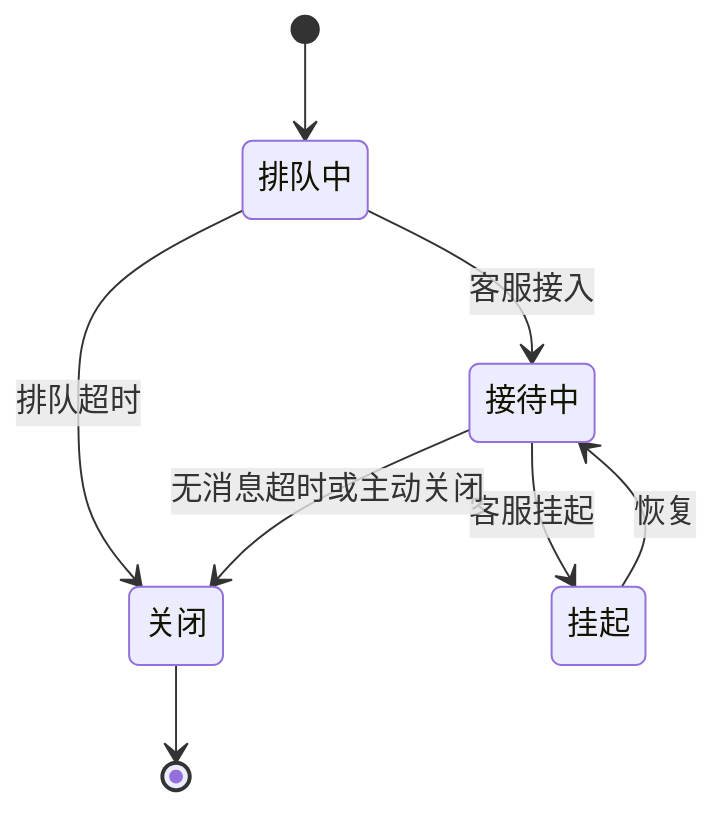

# 商城客服后台 PRD V0.9 — 竞品分析报告

> **分析对象**:`PRD-后台-V0.9.md`(在线客服系统·后台管理端,11 模块)
> **分析模式**:Mode B 产品评审(技能 `competitive-analysis` V2.0)
> **日期**:2026-07-16
> **对标范围**:电商客服为主(淘宝千牛/京东咚咚/有赞)+ 通用客服 SaaS 对照(智齿/Udesk/网易七鱼/阿里云 CCS/合力亿捷)
> **证据图例**:🟢 Confirmed(公开资料证实)/ 🟡 Reasoned(行业最佳实践推理)/ 🔴 Speculative(推测,需验证)

---

## 一、执行决策摘要

### 总体结论
这是一份**完成度与细致度都高于业界公开产品**的客服后台 PRD——状态机、转接防"踢皮球"、source 审计口径三块设计明显领先;主要差距在**缺技能组路由**和**三套独立知识体系**,二者均是一期可接受、但需为 2 期预留扩展位的设计取舍。

### 最大优势
**转接链路的防死循环设计**(连环限深 3 跳 + 重新排队次数上限 + 失败回流 + 离线宽限)与**source 审计口径**(人 vs 系统字段级区分),业界公开产品文档鲜见如此颗粒度。

### 最大风险
1. **「在线客服全满载」场景的排队行为未定义**——PRD 已移除排队超时,若所有在线客服都满载,用户可能死等(🔴 需澄清)。
2. **缺技能组(skill group)**——点对点转接在客服规模扩张后效率瓶颈。
3. **三套独立知识分类**(知识文档/FAQ/话术)维护成本高,偏离业界"统一知识库"趋势。

### 建议改动
1. **[高]** 澄清并补全「在线客服全满载」排队兜底(超时转留言 / 溢出策略),杜绝死等。
2. **[高]** 一期路由补「最少会话优先」算法;转接/路由为 2 期「技能组」预留扩展位。
3. **[中]** 审计日志补「存储防篡改 + 合规」策略(服务企业客户 `enterprise_id` 场景)。
4. **[中]** 评估三套知识体系中期是否收敛到统一知识底座。
5. **[低]** 排队超时移除后,强化「离线留言」的用户侧提示与预期管理。

### 评分
| 维度 | 得分 (/10) | 说明 |
|------|:---------:|------|
| 产品设计契合度 | 8 | 状态机/转接/待办设计完整,贴合商城客服场景 |
| 行业对标度 | 7 | 核心机制对标成熟,但缺技能组、知识体系偏离统一趋势 |
| 架构稳健性 | 8 | 事件流水 + source 审计 + 乐观锁 + 失败回流,稳健 |
| 竞争差异化 | 7 | source 审计、连环限深、offline 统一留言态为亮点 |
| 实施风险(越低越好) | 7 | 中低;待澄清全满载排队、知识维护、审计合规 |
| **总体** | **7.4** | 一期可落地的高质量设计,2 处需补强 |

---

## 二、竞品格局概览

| 平台 | 层级 | 类型 | 定位 | 对标价值 |
|------|------|------|------|----------|
| 淘宝千牛 / 店小蜜 | 🎯 垂直 | 电商客服 | 淘系商家工作台 + 智能客服 | 快捷话术、挂起留言分流、人机协同 |
| 京东咚咚 / 京小智 | 🎯 垂直 | 电商客服 | 京东商家 IM + 智能客服 | 人机辅助接待 |
| 有赞 AI 客服 | 🎯 垂直 | 电商 SaaS | 统一知识库 + AI 导购 + CRM | 统一知识库趋势、数据看板 |
| 智齿科技 | 🏛️ 横向 | 通用客服 SaaS | 一体化在线+呼叫+工单 | 技能组管理、转接显示目标状态 |
| Udesk(沃丰科技) | 🏛️ 横向 | 通用客服 SaaS | AI 全渠道智能客服 | 技能组路由、多渠道 |
| 网易七鱼 | 🏛️ 横向 | 通用客服 SaaS | 轻量智能客服 | 超时警示、关闭二次确认 |
| 阿里云 CCS | 🏛️ 横向 | 通用客服 SaaS | 全链路机器人+人工+工单 | 路由策略(技能/优先级/负载) |
| 合力亿捷 | 🏛️ 横向 | 呼叫中心+客服 | 操作审计日志、等保合规 | 审计日志不可篡改存储 |

> 🏛️ 横向 = 通用客服 SaaS 最佳实践基线;🎯 垂直 = 电商客服同场景验证。

---

## 三、逐维度对比

### 3.1 🔴 核心:会话转接与客服调度(原维度④ 供应商/寻源)

#### 为何选这些竞品
- **🏛️ 智齿 / Udesk / 阿里云 CCS**:技能组路由 + 负载均衡的行业基线,验证"规模化怎么做"。
- **🎯 淘宝千牛**:电商客服挂起/离线时的消息分流逻辑,与本 PRD 的 offline/pending 直接可比。

#### 对比

**vs 智齿 / Udesk / 阿里云 CCS(技能组路由):**

| 维度 | 业界技能组方案 | 本 PRD 方案 |
|------|---------------|-------------|
| 路由/转接单位 | **技能组**(售前/售后/技术) | **指定客服**(`to_admin_id`,点对点) |
| 负载均衡算法 | 轮询 / 最少会话 / 优先级加权 / 饱和度 | 仅「轮询分配(按空闲度)」 |
| 转接目标展示 | 显示目标状态(忙碌/空闲) | 满载红色硬阻断、其余蓝色 |
| 排队溢出 | 排队优先级 + 超时溢出到其他组 | 无排队超时(已移除) |

→ **部分采纳 ⚠️**
- 乐观锁并发接入、转接目标满载阻断:与业界一致,**保留**。🟢
- 路由算法偏简单:业界标配「最少会话优先」本 PRD 未明确,**建议一期补上**(比纯轮询更均衡)。🟡
- 缺技能组:一期单租户小团队可接受(点对点够用),但**必须为 2 期技能组预留**(PRD 已将"技能组"列入 Out Scope 2 期,方向正确)。🟡

**vs 淘宝千牛(挂起/离线分流):**
> 千牛:客服离线或挂起时,「接待过且未转人工的消息」默认分配给留言处理。🟢 Confirmed([淘宝帮助中心](https://helpcenter.taobao.com/servicehall/knowledge_detail?kwdContentId=264200137210930176))

→ **采纳 ✅** 本 PRD 把"留言"建模为会话的 `offline` 态(ADR-0012)而非独立实体,比千牛"分流到留言处理"更统一(会话为唯一实体),**设计更优**。🟡 Reasoned

#### 行业最佳实践推理
成熟客服系统的调度核心是「**技能组 + 负载均衡 + 转接防抖**」三件套。技能组解决"找对人",负载均衡解决"分配匀",转接防抖(限深/回退/兜底)解决"不踢皮球"。本 PRD 在**第三件(转接防抖)上做到了业界公开文档罕见的细致度**(见下),但在第一件(技能组)上做了减法。

#### 转接防抖——本 PRD 的差异化亮点 🌟

| 防抖机制 | 本 PRD 设计 | 业界公开情况 |
|----------|------------|-------------|
| 连环转接限深 | **限深 3 跳**(原客服+最多2次主动转接),超限拒绝 | 🟡 业界有此痛点,公开细节少 |
| 重新排队上限 | **累计 2 次仍无人接→终止兜底**(回原客服/结束+致歉+留言邀约) | 🟡 业界少有公开的兜底终止逻辑 |
| 失败回流 | rejected/cancelled→回源;timeout→回退 3 选 1;**队列中用户消息一并退原客服,绝不丢消息** | 🟡 "不丢消息"是强保证,优秀 |
| 离线宽限 | 客服离线名下会话宽限 2 分钟,重连恢复 | 🟡 合理的人性化设计 |
| 限深计数重置 | timeout 走"重新排队"时计数归零(系统兜底≠客服踢皮球) | 🟡 区分系统兜底与人为踢皮球,严谨 |

> 这一组设计直接回答了"转接会不会变成客服间踢皮球/无限循环"的行业老大难。🟡 Reasoned(逻辑严密,但属本 PRD 原创细化,无直接竞品文档可比)

#### 采纳/不采纳小结
| 竞品 | 关键差异 | 决策 | 证据 | 理由 |
|------|---------|------|------|------|
| 智齿/Udesk | 技能组路由 | ⚠️ 2 期 | 🟢 | 一期规模够用,预留扩展位 |
| 阿里云 CCS | 最少会话优先算法 | ✅ 采纳 | 🟢 | 比纯轮询均衡,成本低 |
| 千牛 | 留言独立分流 | ❌ 不采纳 | 🟢 | 本 PRD offline 统一态更优 |

#### 一句话裁定
> 转接防抖细节**领先业界**,但路由层缺技能组是规模化隐患——一期点对点可走,2 期必须补技能组。

#### 📌 对本设计的启示
- **[高]** 一期路由补「最少会话优先」;转接模块接口为「技能组」预留(`to_admin_id` → 未来可扩 `to_skill_group_id`)。
- **[保留]** 连环限深、重新排队上限、失败回流、不丢消息保证——这是核心竞争力,写进技术契约。

---

### 3.2 🔴 核心:会话状态机与服务交付(原维度③ 订单履约)

#### 为何选这些竞品
- **🏛️ 网易七鱼 / 7x24cc / QQ 起点**:会话状态、超时自动结束、关闭二次确认的标准做法。
- **🎯 淘宝千牛**:挂起/离线分流(同 3.1)。
- **行业基线**:人人都是产品经理《IM 客服服务流程》的会话工单状态流转。🟢([wosipm](https://www.wosipm.com/pd/5390426.html))

#### 业界典型状态机

- 网易七鱼:会话超时**警示色提醒**、在线会话关闭**二次确认**。🟢([七鱼](https://b.163.com/knowledge/public/U4hejvXCE4/knowdetail?docId=UJqhALT6X2))
- QQ 起点:**超时自动结束**(设定时间无消息→自动结束 + 超时提醒 + 结束语)。🟢([QQ起点](https://admin.qidian.qq.com/hp/helpCenter/getArticle?id=12527))
- 7x24cc:会话状态管理含**转接/挂起/关闭/合并/标记**。🟢([7x24cc](https://www.7x24cc.com/help/innews/9063.html))

#### 对比

| 状态/机制 | 业界典型 | 本 PRD(6 态) |
|-----------|---------|--------------|
| 基础态 | 排队/接待/挂起/关闭 | wait/accept/pending/end + **offline + cancel** |
| 离线留言 | 多为独立留言工单 | **offline 统一会话态**(ADR-0012) |
| 用户取消 | 常隐含 | **显式 cancel 态** |
| 排队超时 | 有(防死等) | **已移除**(V0.9) |
| 挂起超时 | 单纯挂起 | **挂起超时→自动回复→轮次响应超时**(链式) |
| 无消息超时 | 有 | 有(用户静默超时 900s→自动结束 1800s) |
| 关闭二次确认 | 七鱼有 ✅ | 待评价「关闭」二次确认 ✅(AC-T-03) |

→ **整体采纳 ✅,一处待澄清 ⚠️**
- 本 PRD 状态机比业界典型**更完整**:把 offline(留言)和 cancel(用户取消)显式建模,offline 统一为会话态是**优秀设计**。🟡
- 挂起超时→自动回复→轮次响应超时的**链式超时**比业界单纯挂起更精细。🟡
- 关闭二次确认与七鱼一致,**保留**。🟢

#### ⚠️ 风险点:全满载排队行为未定义 🔴
> PRD 移除了排队超时,offline 态触发条件是「无在线客服」。但若**有在线客服但全部满载**(`max_sessions=10` 占满),用户会进入 `wait` 排队——此时**无超时、无溢出策略**,可能死等。

- 业界做法:排队超时关闭([博客园排队机制](https://www.cnblogs.com/taoshihan/p/18911610))或溢出到其他技能组。
- 建议:补一条「全满载 → 排队超时(可配)→ 转 offline 留言」的兜底路径。🔴 Speculative(需向产品确认当前是否已有此逻辑)

#### 一句话裁定
> 状态机设计**完整度优于业界**,offline/cancel 显式建模是亮点;唯一硬伤是「全满载排队」无兜底,必须补。

#### 📌 对本设计的启示
- **[高]** 澄清并补全「全满载」排队兜底(超时转 offline 留言,或溢出策略)。
- **[保留]** offline 统一留言态、链式挂起超时、关闭二次确认。

---

### 3.3 🔴 核心:数据模型与审计追溯(原维度⑧ 数据模型)

#### 为何选这些竞品
- **🏛️ 合力亿捷**:操作审计日志 + 不可篡改存储 + 等保三级,审计合规基线。🟢([合力亿捷选型指南](https://www.hollycrm.com/innews/9068.html))
- **7x24cc**:对话日志含「转人工标记」字段。🟢([7x24cc](https://www.7x24cc.com/help/innews/7384.html))
- **智齿**:机器人转人工流程优化、分组接待。🟢([智齿](https://help.zhichi.com/pages/76ba88/))

#### 对比

| 机制 | 业界 | 本 PRD |
|------|------|--------|
| 审计粒度 | 「操作审计日志」(数据访问/知识库变更/模型调用) | **source 审计口径**:每条状态迁移区分人(1)/系统(2)(ADR-0001) |
| 转接追溯 | 操作日志 | **transfer.events 全生命周期事件流水**(created/viewed/accepted/rejected/cancelled/timeout/rollback/reminder)+ `session.type_change` |
| 消息级标记 | 转人工标记 | **is_recalled / is_hidden / is_redacted / is_read**(撤回/隐藏/脱敏/已读) |
| 日志防篡改 | 不可篡改(WORM/区块链)、等保三级 | **未提及** |

→ **大部分采纳 ✅,一处待补 ⚠️**

#### 本 PRD 的差异化亮点 🌟
- **source 审计口径(人 vs 系统)**:业界审计多为"谁操作了什么",本 PRD 在**每条状态迁移上区分是人点的还是系统自动的**。这对客服系统责任界定(投诉追溯:是客服没接还是系统超时)极有价值,公开产品鲜见字段级实现。🟢(合力亿捷提操作审计,本 PRD 更细)
- **事件流水(event sourcing 风格)**:每个转接节点独立事件 + `metadata` json,结构化程度高于业界"操作日志",利于转接质量分析与回放。🟡 Reasoned(事件溯源是成熟架构模式,本 PRD 应用了)
- **消息级脱敏 `is_redacted`**:业界客服系统消息级脱敏不普遍,这是亮点。🟡

#### ⚠️ 待补:审计日志的存储与合规
> 合力亿捷强调审计日志**不可篡改(WORM/区块链)+ 等保三级**。本系统有 `enterprise_id`(企业客户),若涉及 B 端合规,需补审计日志的存储防篡改与合规策略。🟡 Reasoned

#### 采纳/不采纳小结
| 竞品 | 关键差异 | 决策 | 证据 | 理由 |
|------|---------|------|------|------|
| 合力亿捷 | 日志不可篡改 + 等保 | ⚠️ 待补 | 🟢 | 服务企业客户需合规 |
| 智齿 | 转人工流程日志 | ✅ 已超越 | 🟢 | 本 PRD 事件流水更细 |
| 7x24cc | 转人工标记 | ✅ 已涵盖 | 🟢 | session.type_change 已覆盖 |

#### 一句话裁定
> source 审计 + 事件流水是**架构级亮点**,领先业界公开产品;唯一缺口是审计日志的防篡改/合规存储。

#### 📌 对本设计的启示
- **[保留]** source 审计口径、transfer.events 事件流水、消息级脱敏——写进数据架构,作为差异化卖点。
- **[中]** 补审计日志存储策略(append-only / WORM),若服务企业客户评估等保要求。

---

### 3.4 🔴 核心:知识体系 + 自动回复触达(原维度⑤ 通知触达)

#### 为何选这些竞品
- **🎯 有赞 AI 客服**:统一知识库 + AI 导购 + CRM 打通,代表"统一知识底座"趋势。🟢([有赞](https://www.youzan.com/chanpin/aikf))
- **🎯 淘宝千牛**:团队快捷短语配置。🟢([千牛快捷短语](https://helpcenter.taobao.com/servicehall/knowledge_detail?kwdContentId=10235967924346893))
- **抖音飞鸽**:人工接待时机器人推荐话术。🟢([飞鸽](https://school.jinritemai.com/doudian/wap/article/aHKFgnqDGxVs))

#### 对比

| 维度 | 业界 | 本 PRD |
|------|------|--------|
| 知识架构 | 有赞:**统一知识库**(一处置备多处用) | **三套独立分类**(知识文档/FAQ/话术,互不关联) |
| 自动回复粒度 | 欢迎语 + 自动回复(粗) | **6 段细粒度**(机器人欢迎/客服欢迎/转接欢迎/离线/会话结束/催评) |
| 话术校验 | 多为直接发送 | **变量兜底**(填充失败阻止发送 + 标红,区分"无订单/获取失败") |
| FAQ 效果度量 | 有赞数据看板 | **推送次数 + 点击次数**(衡量自助解决率) |
| 敏感词 | 平台内置 | **fail-open + 词库归商城**(职责清晰) |

→ **多数采纳 ✅,一处权衡 ⚠️**

#### ⚠️ 设计权衡:三套独立知识体系 vs 统一知识底座
- 有赞等趋向**统一知识库**(同一知识点一处置备,机器人/人工/AI 共用)。
- 本 PRD **知识文档(人读)/ FAQ(机器人推)/ 话术(客服快捷)三套独立分类、互不关联**。
- **合理性**:三者职责不同(文档=深度阅读、FAQ=卡片推送、话术=快捷回复),一期分离可降低耦合。🟡
- **代价**:同一知识点(如"退货流程")可能三处维护,长期易漂移。🟡

> 裁定:**短期保留,中期评估统一底座**。这不是错误,是需有意识的取舍。

#### 本 PRD 的亮点
- **6 段自动回复细粒度配置**:尤其「转接客服欢迎语」「催评自动消息」独立成段,比业界粗粒度专业。🟡
- **话术变量兜底**:填充失败阻止发送 + 标红提示,业界少见这种强校验,防发错订单号。🟡 Reasoned
- **FAQ 推送/点击统计**:数据驱动衡量自助解决率,与有赞数据看板理念一致。🟢

#### 一句话裁定
> 自动回复细粒度与话术兜底**优于业界**;三套独立知识体系是可接受的取舍,但需规划中期统一。

#### 📌 对本设计的启示
- **[中]** 三套知识分类短期保留,规划中期是否收敛统一底座(降低重复维护)。
- **[保留]** 6 段自动回复、话术变量兜底、FAQ 双计数、敏感词 fail-open——均为亮点。

---

### 3.5–3.9 非核心维度(简述)

| 维度 | 评估 | 证据 |
|------|------|------|
| **数据仪表盘** | ✅ 标准只读驾驶舱(4 指标卡+趋势+排行+待办汇总),注明「近实时5分钟/满意度每小时」,符合业界。建议补指标口径文档。 | 🟡 |
| **客户 360 画像** | ✅ **4 Tab 按源独立降级**是亮点(业界多为全量失败);行为 Tab 灰显(2 期)合理。 | 🟡 |
| **评价管理** | ✅ 简化为「评分 + 问题解决」二维,催评转化率口径清晰。比业界带文字评论更轻,适合一期。 | 🟡 |
| **系统边界** | ✅ 对接会员库/OMS/敏感词词库/企业微信,边界清晰;敏感词词库归商城(不自留)是合理职责划分(ADR-0007)。 | 🟡 |
| **运营效率** | ✅ dirty 标记 + 电梯导航 + 时间单位秒/分切换,配置体验好。 | 🟡 |

---

## 四、决策矩阵(关键设计取舍)

| 选项 | 行业成熟度 | 成本 | 风险 | 建议 |
|------|:---------:|:----:|:----:|:----:|
| 一期点对点转接(无技能组) | 高 | 低 | 中(规模化) | ⚠️ 一期采用+预留扩展 |
| 一期补「最少会话优先」路由 | 高 | 低 | 低 | ✅ 采纳 |
| 知识三套独立分类 | 中 | 低 | 中(维护漂移) | ⚠️ 短期保留+中期评估 |
| 排队超时移除(改 offline 留言) | 低 | 低 | **高(死等)** | ❌ 需补全满载兜底 |
| source 审计 + 事件流水 | 中 | 中 | 低 | ✅ 采纳(差异化) |
| 审计日志 WORM/合规 | 高 | 中 | 低 | ⚠️ 服务企业客户时补 |

---

## 五、业务影响评估

| 影响维度 | 评级 | 说明 |
|----------|:----:|------|
| 收入影响 | 中 | 客服效率提升间接影响转化(响应速度/满意度) |
| 效率影响 | 高 | 转接防抖 + 待办集中 + 自动回复,直接降客服成本 |
| 风险影响 | 中 | 全满载死等、知识漂移、审计合规三处需关注 |
| 体验影响 | 高 | offline 留言态、链式超时、消息脱敏提升用户体验 |

---

## 六、跨竞品综合

| 竞品 | 验证了什么 | 本设计的差异化 |
|------|-----------|---------------|
| 智齿/Udesk | 技能组路由是规模化标配 | 一期减法 + 转接防抖细化 |
| 淘宝千牛 | 挂起/离线分流逻辑 | offline 统一会话态(更优) |
| 有赞 | 统一知识库趋势 | 三套独立(取舍,需规划收敛) |
| 合力亿捷 | 审计日志合规基线 | source 审计 + 事件流水(更细,但缺合规存储) |
| 网易七鱼 | 超时警示/二次确认 | 链式超时 + 关闭二次确认(一致或更细) |

> **一句话结论**:业界验证了"技能组 + 统一知识库 + 审计合规"是规模化标配;本 PRD 在**转接防抖、状态机完整度、source 审计**上做了更深的细化,差异化明确——代价是技能组与知识统一两处需为未来留位。

---

## 七、可行性结论

| # | 设计决策 | 竞品证据 | 可行性 |
|---|---------|---------|:------:|
| 1 | 乐观锁并发接入 | 阿里云 CCS / 智齿 | ✅ 高 |
| 2 | offline 统一留言态 | 千牛(分流)→ 本设计更优 | ✅ 高 |
| 3 | 转接连环限深 + 失败回流 | 🟡 业界有痛点无公开细节 | ✅ 高(原创细化) |
| 4 | source 审计 + 事件流水 | 合力亿捷(操作审计) | ✅ 高 |
| 5 | 一期无技能组点对点转接 | 智齿/Udesk(均有技能组) | ⚠️ 中(规模化瓶颈) |
| 6 | 排队超时移除 | 业界普遍有排队超时 | ❌ 低(需补兜底) |
| 7 | 三套独立知识体系 | 有赞(统一知识库) | ⚠️ 中(维护成本) |

> ✅ 高 = 多竞品验证;⚠️ 中 = 证据混合;❌ 低 = 无竞品这么做/有风险。

---

## 八、明确不采纳

| 业界做法 | 不采纳原因 | 何时重新评估 |
|----------|-----------|-------------|
| 排队超时关闭(业界标配) | 本 PRD 选择"无在线客服→offline 留言"替代,避免死等排队 | 若补全「全满载」兜底后,可不再需要排队超时 |
| 技能组路由(智齿/Udesk) | 一期单租户小团队,点对点够用;降低复杂度 | 客服规模扩张 / 2 期 |
| 统一知识库(有赞) | 三类知识职责不同,一期分离降耦合 | 知识维护漂移成为痛点时 |
| 留言独立成实体(千牛) | offline 统一会话态更优雅,会话为唯一实体 | 不重新评估(本设计更优) |

---

## 九、总体评估

### 优势(领先或差异化)
1. 转接防抖四件套(限深/排队上限/失败回流/不丢消息)——业界公开文档罕见。
2. source 审计口径(人 vs 系统字段级)——责任追溯利器。
3. offline 统一留言态——会话为唯一实体,模型干净。
4. 客户 360 按源独立降级——优于业界全量失败。
5. 话术变量兜底 + FAQ 双计数——细节专业。

### 待改进
1. 「全满载」排队无兜底(死等风险)——**最高优先级**。
2. 路由缺「最少会话优先」+ 无技能组扩展预留。
3. 审计日志无防篡改/合规策略。
4. 三套知识体系长期维护成本。

### 风险
1. 全满载死等 → 用户流失(🔴 需立即澄清)。
2. 知识三处维护漂移 → 答复口径不一(🟡 中期)。
3. 审计合规缺口 → 企业客户场景合规风险(🟡 视客户类型)。

### 置信度
| 维度 | 置信度 | 原因 |
|------|:------:|------|
| 转接调度对标 | 🟢 | 多竞品公开资料 |
| 状态机对标 | 🟢 | 多来源(七鱼/QQ起点/7x24cc/wosipm) |
| 数据模型审计 | 🟡 | 合规部分推理为主 |
| 知识体系对标 | 🟢 | 有赞/千牛/飞鸽公开资料 |
| 全满载排队风险 | 🔴 | PRD 未明确,属推测,需产品确认 |

---

## 十、参考资料

| 来源 | 链接 | 类型 |
|------|------|------|
| 百度云《集团网站在线客服系统架构》 | https://cloud.baidu.com/article/5520369 | 行业文章 |
| 腾讯云《在线客服智能路由》 | https://cloud.tencent.com/developer/article/2162275 | 厂商文档 |
| 阿里云 CCS《会话分配策略》 | https://help.aliyun.com/zh/ccs/transfer-settings | 官方文档 |
| 哔哩哔哩客服坐席调度演进 | https://zhuanlan.zhihu.com/p/7558787354 | 工程实践 |
| 智齿科技技能组管理(华为云) | https://support.huaweicloud.com/sobotcc-saasapp/sobotcc_03.html | 官方文档 |
| 智齿在线客服转接 | https://www.zhichi.com/livechat | 官方文档 |
| Udesk 在线客服 | https://www.udesk.cn/feature_channels.html | 官方文档 |
| 淘宝帮助(挂起/离线分流) | https://helpcenter.taobao.com/servicehall/knowledge_detail?kwdContentId=264200137210930176 | 官方文档 |
| 千牛快捷短语设置 | https://helpcenter.taobao.com/servicehall/knowledge_detail?kwdContentId=10235967924346893 | 官方文档 |
| 有赞 AI 客服 | https://www.youzan.com/chanpin/aikf | 官方文档 |
| 有赞智能客服 | https://www.youzan.com/chanpin/zhinengkefu | 官方文档 |
| 京小智(京东商家客服) | https://portal-aixiaozhi.jd.com/ | 官方产品 |
| 人人都是产品经理《IM 客服服务流程》 | https://www.wosipm.com/pd/5390426.html | 行业文章 |
| 博客园《在线客服排队机制设计》 | https://www.cnblogs.com/taoshihan/p/18911610 | 工程实践 |
| QQ 起点《超时自动结束会话》 | https://admin.qidian.qq.com/hp/helpCenter/getArticle?id=12527 | 官方文档 |
| 网易七鱼工作台设置 | https://b.163.com/knowledge/public/U4hejvXCE4/knowdetail?docId=UJqhALT6X2 | 官方文档 |
| 7x24cc 会话状态管理 | https://www.7x24cc.com/help/innews/9063.html | 厂商文档 |
| 合力亿捷《AI 客服选型指南》(审计日志) | https://www.hollycrm.com/innews/9068.html | 行业文章 |
| 抖音飞鸽机器人推荐话术 | https://school.jinritemai.com/doudian/wap/article/aHKFgnqDGxVs | 官方文档 |
| 阿里云 CCS 客服工作台 | https://www.aliyun.com/product/ccs | 官方产品 |

---

*报告生成于 2026-07-16,基于公开资料 + 行业最佳实践推理。标注 🔴 的「全满载排队」为推测风险,建议向产品负责人确认。*
