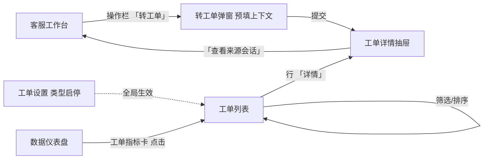
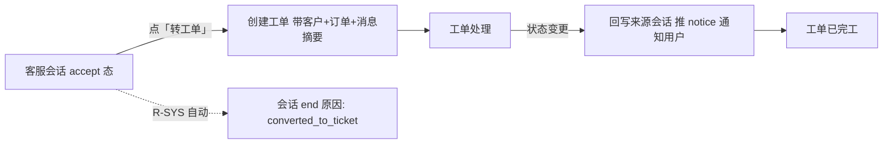
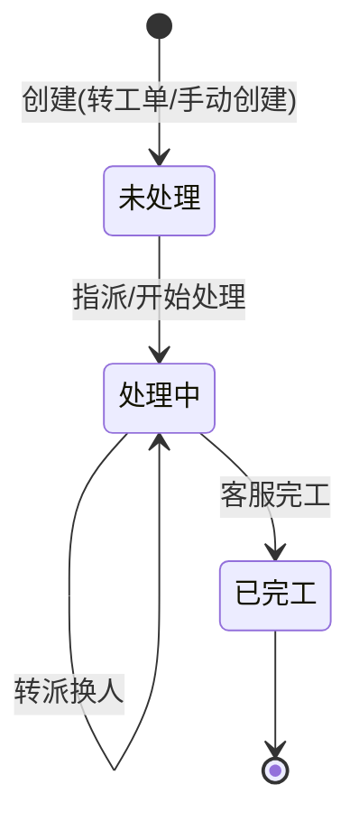

# PRD-客服工单-V0.3

> **版本**: V0.3 | **日期**: 2026-07-20 | **状态**: 评审稿
>
> **原型目录**: `prototype-cs/admin/` (`admin-ticket.html` / `admin-ticket-settings.html`)
>
> **依据**: 《工单系统-竞品调研-V0.1.md》、《PRD-后台-V0.9.md》
>
> **V0.2 → V0.3 关键调整**:
> 1. **移除 SLA 时效与升级功能**——客服工单简化为售后事务跟踪,不再绑定时效承诺/超时升级。
> 2. 工单主表移除 `sla_response_due` / `sla_resolve_due` 字段。
> 3. 移除 SLA 配置表 `customer_chat_ticket_sla_config`。
> 4. cron 移除 `ticketSLA` 扫描(仅保留 `ticketAutoAssign` 自动分派)。
> 5. 工单列表移除 SLA 倒计时列、SLA 统计(即将超时/已超时/SLA 达成率)、SLA 排序;统计回归 4 项。
> 6. 工单设置页移除 SLA 矩阵/升级阈值/工作时间/催办通道等配置,仅保留「工单类型启停」。
> 7. 工单优先级(`priority`)保留,作为分类/筛选/排序/视觉标识,不再驱动 SLA。
>
> **保留不变(沿用 V0.2)**:会话转工单(会话 end 联动)、3 态状态机(未处理/处理中/已完工)、工单分派(手动+轮询)、回写会话通知、操作日志(人/系统审计,V0.3 由「事件流水」更名)、T 型数据模型、与 OMS 集成边界。
>
> **V0.3 评审中修订(对齐原型)**:
> 11. 「事件流水」→ **「操作日志」**(更名,语义不变)。
> 12. **工单描述可编辑 + 保留历史版本**:详情可改描述,旧版本归档可查(新增 `description` 字段)。
> 13. 列表新增 **「来源」列**:显示来源会话 ID(或「-」),支持手动关联/修改/清除会话 ID。
> 14. **工单类型 + 优先级 可增删改**(设置页),并显示各配置当前工单数量。
> 15. **回复改为跳转会话工作台**(不在工单内回复留言);工单内仅保留「内部备注」(去掉对客回复留言)。
> 16. **转单 = 转接工单**(转派给别的客服,非转接会话)。
> 17. **工单设置独立页**(归属「客服设置」菜单),列表顶部不再放设置入口;详情状态操作按钮集中抽屉底部。
>
> **V0.3 评审二次修订(对齐原型)**:
> 18. **选用户+订单创建工单**:直接建单时手动选客户(搜索)+ 选订单(可选);新增客户搜索/按客户查订单接口(#10/#11);`order_id` 改可选。
> 19. 状态机 **3 态**:未处理 / 处理中 / 已完工(创建→未处理;已完工=终态,不可操作,继续需新建工单)。
> 20. ~~重启~~ **移除**(完工不可操作,继续处理请新建工单)。
> 21. 列表新增 **「关联订单」列**(点击跳订单详情/订单管理页)+ **分页可切换**。
> 22. **留言**:工单不涉及留言分配(留言在会话记录处理,ADR-0012)。
> 23. **工单的会话一定是人工处理过的会话**:转工单前提 = 会话 accept(人工接待过);机器人/排队/留言会话(未人工处理)不可转工单;手动关联会话 ID 需后端校验为人工处理过的会话。
> 24. **去「待回复」「阻塞」「已解决/已关闭」态 → 3 态(未处理/处理中/已完工)**;**TE 工单评价本期不做**(内部工单无评分,`score` 字段保留供 2 期);列表字段名:类型→**工单类型**、来源→**来源会话**;**创建时间**列改**更新人/更新时间**(合并列);新增筛选项 **客户昵称/手机号、处理人、来源会话、关联订单号**;**删「重启」**(完工不可操作,继续请新建);**删「沟通记录」timeline**(详情只留内部备注)。
> 25. **「工单管理」→「客服工单」**(改名);**创建方式 3 种**:① 会话转工单 ② 手动创建 ③ **从订单受理创建**(订单管理页点「受理」→带商品/收货/项目名,待订单管理页就绪);**位置**:最终商城后台统一(在线客服+客服工单),初期客服后台过渡;**批量追加订单**(手机号搜→全选多订单,工单-订单 1 对多,待定);**OMS 业务字段**(项目名/商品/收货,待 OMS 字段梳理本周确认);**会话自动生成工单**(2 期,一期手动转)。

---

## 零、对存量系统的改动清单

> **原则**:客服工单是 OCS 客服后台 V0.9 的**迭代增量**。区分「新建」与「改动现有」。

| 序号 | 动作 | 对象 | 说明 |
|------|------|------|------|
| 0.1 | **新建表** | `customer_chat_tickets` | 工单主表 |
| 0.2 | **新建表** | `customer_chat_ticket_events` | 工单事件流水 |
| 0.3 | **新建表** | `customer_chat_ticket_comments` | 工单备注(内部/对客) |
| 0.4 | **新建表** | `customer_chat_ticket_extensions` | 工单业务附表(T 型) |
| 0.5 | **改现有表** | `customer_chat_messages` | + `ticket_id varchar(32) NULL FK→tickets` |
| 0.6 | **改现有表** | `customer_chat_sessions` | + `ticket_id varchar(32) NULL FK→tickets` |
| 0.7 | **新建 API** | `/api/backend/ticket/*` | 工单 CRUD + 分派 + 备注 + 导出(见十二) |
| 0.8 | **改现有 API** | `/api/backend/session/end` | 结束原因枚举增加 `converted_to_ticket` |
| 0.9 | **扩展 cron** | `internal/cron/cron.go` | + `ticketAutoAssign`(每 1 分钟,轮询分派) |
| 0.10 | **新建页面** | `admin-ticket.html` | 工单列表页 |
| 0.11 | **新建组件** | 工单详情抽屉 | 从工作台和列表两处进入 |
| 0.12 | **扩展页面** | `admin-ticket-settings.html` | 工单设置页(工单类型启停) |
| 0.13 | **扩展页面** | `admin-dashboard.html` | + 工单指标卡(工单量/处理时长/满意度) |
| 0.14 | **改工作台** | `admin-workbench.html` | 操作栏 +「转工单」按钮;右栏 +「该客户工单」区 |

> 相比 V0.2:移除了 `customer_chat_ticket_sla_config`(SLA 配置表)、`sla_response_due`/`sla_resolve_due`(工单表字段)、`ticketSLA`(cron 扫描)。

---

## 一、范围边界

| 范围 | 内容 |
|------|------|
| **In Scope (1 期)** | 工单列表与查询 / 工单详情与处理 / **会话转工单** / 工单分派(手动+轮询) / 工单回写会话通知 / 工单配置(类型+优先级启停) / 仪表盘扩展工单指标卡 |
| **Out Scope** | **SLA 时效与升级(已移除,见 V0.2→V0.3 调整;后续如需时效承诺再启)**;轮次响应/关单确认/母子工单/审批/机器人自动建单/技能组分派/流转触发器/完整报表/OMS 深度集成(退款退货换货直连) |

> **定位**:客服工单是 OCS 客服后台 **V0.9 的迭代增量**,在已有会话/客户/通知/角色基础设施上,增加「工单」事务实体 + 会话协同接口。会话解决即时问题,工单承接需跨部门/需订单系统操作的售后问题(退款/退货/换货/投诉/补发/价格干预)。
>
> **注**:V0.3 去除 SLA 后,工单不再有「时效承诺 + 超时升级」机制,改为客服主动跟进 + 主管人工督促。如业务后续需要时效承诺,可再引入 SLA 模块。

### 一.1 角色列表

| 代号 | 角色 | 客服工单职责 |
|------|------|-------------|
| R-A | 客服 | 会话转工单、处理工单、内部备注、转派、回复用户(跳工作台)、完工 |
| R-S | 客服主管 | 查看全部工单、工单类型配置、督促跟进;2 期含审批 |
| R-C | 终端用户 | (本期工单为内部处理,用户不可见,无操作) |
| R-SYS | 系统 | 轮询自动分派、状态自动流转、回写会话通知 |

> **审计口径**(沿用 ADR-0001):工单每次状态迁移通过 `ticket_event` 记录,`operator_type` 区分 `admin` / `customer` / `system`。
>
> **数据可见性**(沿用 ADR-0002):R-A 仅见分配给自己的工单;R-S 见全部。

---

## 二、页面清单

| 序号 | 页面名称 | 文件名 | 状态 | 说明 |
|------|----------|--------|------|------|
| 1 | 工单列表 | admin-ticket.html | ✅ 已建 | 客服工单(独立一级菜单) |
| 2 | 工单详情 | 抽屉(嵌入工作台与列表) | ✅ 已建 | — |
| 3 | 工单设置 | admin-ticket-settings.html | ✅ 已建 | 工单类型启停(归属「客服设置」) |

### 二.1 页面跳转关系



> 工单列表为独立页(客服工单一级菜单);工单详情为抽屉;工单设置归属「客服设置」。

---

## 三、实体关系总览

### 三.1 核心实体 ER 图

```mermaid
erDiagram
    CUSTOMER ||--o{ TICKET : "发起"
    SESSION ||--o| TICKET : "来源"
    ORDER ||--o{ TICKET : "关联"
    ADMIN ||--o{ TICKET : "处理"
    TICKET ||--|| TICKET_EXTENSION : "业务附表 T型"
    TICKET ||--o{ TICKET_EVENT : "事件流水"
    TICKET ||--o{ TICKET_COMMENT : "备注"
    SESSION ||--o{ MESSAGE : "消息"
    TICKET ||--o{ MESSAGE : "回写消息"

    CUSTOMER { string user_id PK }
    SESSION { string session_id PK "新增 ticket_id FK" }
    ORDER { string order_id PK }
    ADMIN { string admin_id PK }
    MESSAGE {
        string message_id PK
        string ticket_id FK_nullable
    }
    TICKET {
        string ticket_id PK
        string ticket_no
        string title
        string type
        string priority
        string status
        string user_id FK
        string order_id FK
        string session_id FK
        string handler_admin_id FK
        int score
        int source
        datetime created_at
        datetime finished_at
    }
    TICKET_EXTENSION {
        string ticket_id FK
        string ext_key
        string ext_value
    }
    TICKET_EVENT {
        string event_id PK
        string ticket_id FK
        string event_type
        string operator_id
        string operator_type
        json metadata
        datetime created_at
    }
    TICKET_COMMENT {
        string comment_id PK
        string ticket_id FK
        string type
        text content
        string author_id
        datetime created_at
    }
```

> 相比 V0.2:TICKET 表移除 `sla_response_due` / `sla_resolve_due`;`resolved_at` → `finished_at`,移除 `closed_at`(对齐 3 态)。

### 三.2 字段说明

#### 三.2.1 工单主表 (`customer_chat_tickets`)

| 序号 | 字段名 | 显示名 | 类型 | 必填 | 校验/默认 | 来源/口径 |
|------|--------|--------|------|------|-----------|-----------|
| 1 | ticket_id | 工单 ID | varchar(32) PK | 是 | 系统生成 | 系统生成 |
| 2 | ticket_no | 工单编号 | varchar(32) UK | 是 | `#TK` + yyyyMMdd + 6 位序号 | 系统生成 |
| 3 | title | 标题 | varchar(200) | 是 | — | 创建时填写 |
| 4 | type | 工单类型 | varchar(20) | 是 | 退款 / 退货退款 / 换货 / 投诉 / 补发 / 价格干预 | 创建时选 |
| 5 | priority | 优先级 | varchar(10) | 否 | 紧急 / 高 / 中 / 低 | 创建时选(分类/排序用,不驱动 SLA) |
| 6 | status | 工单状态 | varchar(20) | 是 | 未处理 / 处理中 / 已完工 | 状态机流转 |
| 7 | user_id | 客户 ID | varchar(32) | 是 | FK → CUSTOMER | 创建时绑定 |
| 8 | order_id | 订单 ID | varchar(32) | 否 | FK → ORDER | 售后工单关联订单;投诉/咨询类可无订单(留空) |
| 9 | session_id | 来源会话 ID | varchar(32) | 否 | FK → SESSION | 会话转工单时写入 |
| 10 | handler_admin_id | 处理人 | varchar(32) | 否 | FK → ADMIN | 指派时写入 |
| 11 | handler_group | 处理组 | varchar(32) | 否 | — | 分派时写入(一期预留) |
| 12 | created_at | 创建时间 | datetime | 是 | 系统时间 | 系统自动 |
| 13 | finished_at | 完工时间 | datetime | 否 | — | 完工时写入(终态) |
| 14 | source | 来源 | tinyint | 是 | 0=用户 / 1=客服 / 2=系统 / 3=订单受理 | 创建时确定(会话转工单/手动创建=客服;从订单受理创建=订单受理,见修订25) |
| 15 | score | 工单评分 | tinyint | 否 | 1-5 | 2 期评价;本期内部工单无评价,字段保留 |
| 16 | description | 工单描述 | text | 否 | — | 创建时填写;详情可编辑,保留历史版本(存 TICKET_EVENT 或独立 desc_versions 表) |

> 相比 V0.2:移除 `sla_response_due` / `sla_resolve_due`(V0.2 序号 13/14);`resolved_at` → `finished_at`(3 态无"已解决",完工即终态);移除 `closed_at`(3 态无"已关闭")。`priority` 改为**非必填**(无 SLA 后,优先级仅为可选分类)。`source` 增 `3=订单受理`(修订25 创建方式③)。

#### 三.2.2 ~ 三.2.5(事件流水 / 备注 / MESSAGE 扩展 / SESSION 扩展)

沿用 V0.2,无变化:
- `customer_chat_ticket_events`:`ticket.created` / `ticket.assigned` / `ticket.replied` / `ticket.transferred`(V0.3 移除 `ticket.escalated`;3 态无已解决/重启/已关闭,故移除 `resolved` / `reopened` / `closed`)。`operator_type` = admin/customer/system。
- `customer_chat_ticket_comments`:internal(内部)/ public(对客,回写会话)。
- MESSAGE + `ticket_id`(回写消息可追溯)。
- SESSION + `ticket_id`(转工单标记 + 反向跳转)。

---

═════════ 以下每个模块独立成章 ═════════

---

## 四、工单列表与查询(代号:TL)

工单查询页。多维筛选 + 操作入口。R-A 仅见自己的工单,R-S 见全部。

- **入口**: 客服工单(独立一级菜单)
- **关键元素**: 统计摘要条(4 项)、筛选条(工单类型/优先级/状态/客户昵称手机号/处理人/来源会话/关联订单号/日期)、数据表格(含「来源会话」「关联订单」「更新人/更新时间」列)、导出
- **使用角色**: R-A / R-S

### 四.1 功能用例与验收

| UC 编号 | 用例名称 | 角色 | 说明 |
|---------|---------|------|------|
| UC-TL-01 | 统计摘要 | R-A | 进入页面,4 项统计:工单总数 / 待处理 / 处理中 / 今日解决 |
| UC-TL-02 | 筛选查询 | R-A | 工单类型 / 优先级 / 状态 / 客户昵称手机号 / 处理人 / 来源会话 / 关联订单号 / 日期 组合过滤 |
| UC-TL-03 | 查看详情 | R-A | 行「详情」打开抽屉 |
| UC-TL-04 | 导出 | R-S | 导出筛选结果为 Excel |
| UC-TL-05 | 修改来源会话 | R-A | 行「来源」点击 → 内联编辑会话 ID(关联/修改/清除);**后端校验:关联会话须为人工处理过的(accept 过/有 admin_id)** |

**验收标准(AC-TL)**

| AC 编号 | 验收标准 | 对应用例 | Given | When | Then |
|---------|---------|:--------:|-------|------|------|
| AC-TL-01 | 数据可见性 | UC-TL-02 | 列表 | R-A 登录 | 仅见 `handler_admin_id = 自己` 的工单;R-S 见全部 |
| AC-TL-02 | 状态筛选 | UC-TL-02 | 筛选栏 | 切状态 | 按 status 过滤(未处理/处理中/已完工) |
| AC-TL-03 | 优先级筛选 | UC-TL-02 | 筛选栏 | 切优先级 | 按 priority 过滤(紧急/高/中/低) |

### 四.2 数据字段(列表列)

| 字段 | 取值 | 说明 |
|------|------|------|
| 工单号 | `#TK` + yyyyMMdd + 序号 | col-id |
| 标题 | 工单标题 | — |
| 工单类型 | 退款/退货退款/换货/投诉/补发/价格干预 | tag |
| 优先级 | 紧急/高/中/低 | tag,紧急红色(分类用,无 SLA) |
| 来源会话 | 会话 ID / 「-」 | 点击可编辑(关联/修改/清除会话) |
| 关联订单 | 订单 ID / 「-」 | 点击查看订单详情(跳订单管理页) |
| 状态 | 未处理/处理中/已完工 | s-tag |
| 客户 | 昵称 + 脱敏手机 | CUSTOMER 表 |
| 处理人 | 客服名 / 「未分配」 | — |
| 更新人/更新时间 | 更新人 + 更新时间(合并列) | — |
| 操作 | 详情 / 回复(跳工作台) / 转派(转单) / 指派(未处理态) | 按状态+角色显示;**完工在详情抽屉底部(非行操作,对齐六.2)** |

> 相比 V0.2:移除「SLA 倒计时」列、「即将超时/已超时/SLA 达成率」统计、「SLA 排序」。统计回归 4 项。

---

## 五、会话转工单(代号:CT)— 核心模块

客服在会话中把需异步跟进的售后问题转为工单,带上下文建单,处理后回写会话通知用户。

- **入口**: 客服工作台 > 会话操作栏「转工单」
- **使用角色**: R-A(转)、R-SYS(回写通知)

### 五.1 功能用例与验收

| UC 编号 | 用例名称 | 角色 | 说明 |
|---------|---------|------|------|
| UC-CT-01 | 发起转工单 | R-A | **人工处理过的会话(accept/有 admin_id)**点「转工单」,弹窗预填上下文(机器人/排队/留言等未人工处理的会话不可转) |
| UC-CT-02 | 自动带入上下文 | R-A | 自动填:客户信息 + 订单 + 会话消息摘要 |
| UC-CT-03 | 选类型/优先级 | R-A | 选工单类型、可选优先级、填标题 |
| UC-CT-04 | 会话状态联动 | R-SYS | 转工单后**会话自动结束**(`end`),结束原因 `converted_to_ticket` |
| UC-CT-05 | 工单回写会话 | R-SYS | 工单状态变更 → 向来源会话推系统消息(`notice`)通知用户 |
| UC-CT-06 | (本期不实现) | — | TE 工单评价 2 期(本期工单内部处理,无评价) |
| UC-CT-07 | 客服直接创建工单 | R-A | 工单列表「新建工单」→ 弹窗手动选客户(搜索)+ 选订单(可选,按客户查)→ 无 session_id |

**验收标准(AC-CT)**:沿用 V0.2(AC-CT-01 ~ AC-CT-06),无 SLA 相关。

### 五.2 核心流程(协同闭环)



> 相比 V0.2:流程图移除「SLA 超时 → 两级升级」支路。

---

## 六、工单详情与处理(代号:TD)

工单抽屉:基本信息 + 状态流转 + 内部备注 + 操作日志 + 来源会话。工单描述可编辑(保留历史版本);回复用户跳转会话工作台(不在工单内回复留言)。

- **入口**: 工单列表「详情」/ 工作台「转工单」后
- **使用角色**: R-A(处理)、R-S(查看全部)

### 六.1 工单状态机



| 当前状态 | 目标状态 | 触发动作 | 守卫条件 | 执行角色 | 1期/2期 |
|----------|----------|----------|----------|----------|---------|
| — | 未处理 | 转工单/手动创建 | — | R-A / R-C | ✅ 1 期 |
| 未处理 | 处理中 | 指派/开始处理 | handler_admin_id | R-A / R-SYS | ✅ 1 期 |
| 处理中 | 处理中 | 转派 | 换 handler | R-A | ✅ 1 期 |
| 处理中 | 已完工 | 客服完工 | — | R-A | ✅ 1 期 |

> 3 态(未处理/处理中/已完工)。已完工为终态,不可操作,继续处理需新建工单。

### 六.2 功能用例与验收(UC-TD / AC-TD)

沿用 V0.2 并修订:查看详情 / 指派转派 / 内部备注 / 状态变更 / 查看来源会话 / 完工。**修订**:① 事件流水更名「操作日志」;② 去掉对客回复留言(回复用户改为跳转会话工作台),工单内仅保留内部备注;③ 工单描述可编辑 + 保留历史版本;④ 状态操作按钮集中抽屉底部。已完工为终态,不可操作(继续请新建)。

**新增/修订用例:**

| UC 编号 | 用例名称 | 角色 | 说明 |
|---------|---------|------|------|
| UC-TD-07 | 完工 | R-A | 处理中态点「完工」→ 已完工(终态,不可操作) |
| UC-TD-08 | 编辑描述 | R-A | 详情「编辑」→ 改描述 → 保存为新版本(旧版本归档) |
| UC-TD-09 | 查看描述历史 | R-A | 详情「历史版本」→ 展开各版本(时间/操作人/内容) |
| UC-TD-10 | 回复用户 | R-A | 点「回复用户」→ 跳转会话工作台(在会话里回复,非工单内留言) |
| UC-TD-11 | 添加内部备注 | R-A | 工单内添加内部备注(仅客服可见,不回写会话) |

---

## 七、工单分派(代号:AS)

1 期:手动指派 + 轮询自动分派。2 期:技能组/规则分派。

- **使用角色**: R-A(指派/转派)、R-SYS(自动分派)
- **cron 调度**: 轮询自动分派每 **1 分钟**扫描处理中且无 handler 的工单

### 七.1 功能用例与验收(UC-AS / AC-AS)

沿用 V0.2:手动指派 / 轮询自动分派(跳过满载,全满载进待分配池通知主管)/ 转派(带审计)。无 SLA 相关。

---

## 八、工单回写与通知(代号:RB)

工单状态变更回写来源会话(若有 `session_id`),通知用户,形成闭环。

- **使用角色**: R-SYS

### 八.1 功能用例与验收

| UC 编号 | 用例名称 | 角色 | 说明 |
|---------|---------|------|------|
| UC-RB-01 | 状态回写 | R-SYS | 处理中 / 已完工 → 来源会话推 `notice` 消息 |
| UC-RB-02 | (本期不做) | — | 对客回复走「回复用户」跳工作台,工单内不做对客消息回写 |

**验收标准(AC-RB)**

| AC 编号 | 验收标准 | 对应用例 | Given | When | Then |
|---------|---------|:--------:|-------|------|------|
| AC-RB-01 | 回写消息可追溯 | UC-RB-01 | 工单 session_id 存在 | 状态变更 | 向会话推 `type=notice` 消息(MESSAGE.ticket_id=工单ID),用户端可见 |
| AC-RB-02 | 无来源会话 | UC-RB-01 | session_id 为空 | 状态变更 | 跳过回写,仅站内通知处理人 |

> 相比 V0.2:移除 UC-RB-03「SLA 升级通知客服」(SLA 已去除)。回写通道沿用 csNotify + 企业微信(作通用通知,非 SLA 专用)。

---

## 九、工单评价(代号:TE)

**本期不实现**(工单为内部处理,用户不可见,无评价)。保留 `score` 字段供后续启用;2 期如需用户评价再开启。

---

## 十、工单报表与配置(代号:RP / CF)

### 十.1 工单报表(RP)

扩展现有数据仪表盘(`admin-dashboard.html`),新增工单指标卡。

| 指标 | 口径 |
|------|------|
| 工单量 | 时段内新建工单数(按类型/优先级分类) |
| 平均处理时长 | `finished_at − created_at` 均值 |
| 工单满意度 | TICKET.score 均值(1-5) |
| 客服工单绩效 | 处理量 / 平均时长,按 handler_admin_id 聚合 |

> 相比 V0.2:移除「SLA 达成率」指标。

### 十.2 工单配置(CF)

`admin-ticket-settings.html`,工单类型 + 优先级 增删改(含数量显示)。

| 配置 | 说明 | 存储 |
|------|------|------|
| 工单类型 | 增删改类型(退款/退货退款/换货/投诉/补发/价格干预)+ 关联业务附表字段 | `customer_chat_settings` |
| 优先级 | 增删改优先级(紧急/高/中/低) | 同上 |
| 数量展示 | 各类型/优先级显示当前工单数量(只读统计) | 实时聚合 |

> 相比 V0.2:移除 SLA 矩阵 / 升级阈值 / 工作时间 / 自动定级 / 催办通道(均为 SLA 相关)。配置为「工单类型 + 优先级 增删改」(含各配置工单数量展示)。

---

## 十一、单据流转

### 十一.1 工单单(`customer_chat_tickets`)

| 阶段 | 触发 | 字段变更 | 关联动作 |
|------|------|----------|----------|
| 创建 | 会话转工单 / 客服手动创建 / 从订单受理创建 | ticket_id / ticket_no / type / priority / **status=未处理** / user_id / order_id / session_id / source / created_at | 写 `ticket.created` 事件;若 session_id 则会话标记 end(reason=converted_to_ticket)+ ticket_id;进入轮询分派池 |
| 指派 | 手动/轮询 cron | handler_admin_id / **status=处理中** | 写 `ticket.assigned` 事件 |
| 完工 | 客服完工 | **status=已完工** / finished_at | 回写会话 notice;**终态,不可操作,继续需新建工单** |

> 相比 V0.2:移除「升级」阶段(SLA 超时转派/升级主管);**对齐 3 态状态机(六.1)**——创建→未处理(原误为"处理中"),移除「待回复」「关闭(自动)」「重启」(三态外阶段;2 期自动关单/重启需另行评估状态)。

---

## 十二、接口时序

### 十二.1 同步接口

| # | 操作 | 方法 | 路径 | 关键参数 | 异常码 |
|---|------|------|------|----------|--------|
| 1 | 工单列表 | GET | `/api/backend/ticket/list` | 筛选条件(type/priority/status/handler/date) | 空数据 |
| 2 | 工单详情 | GET | `/api/backend/ticket/detail` | ticket_id | 无权限 / 不存在 |
| 3 | 创建工单(含转工单) | POST | `/api/backend/ticket/create` | type / priority / title / user_id / order_id / session_id | 参数缺失 / order_id 无效 |
| 4 | 状态变更 | POST | `/api/backend/ticket/update` | ticket_id / action(**assign 指派 / transfer 转派 / finish 完工**) | 非法状态迁移(3 态:未处理→处理中→已完工) |
| 5 | 指派/转派 | POST | `/api/backend/ticket/assign` | ticket_id / handler_admin_id | 目标满载 |
| 6 | 备注 | POST | `/api/backend/ticket/comment` | ticket_id / type / content | — |
| 7 | 工单类型配置 | GET/POST | `/api/backend/ticket/type-config` | 类型启停列表 | — |
| 8 | 工单导出 | GET | `/api/backend/ticket/export` | 筛选条件 | 空数据 |
| 9 | 会话结束(扩展) | POST | `/api/backend/session/end` | session_id / reason | — |
| 10 | 客户搜索(直接建单) | GET | `/api/backend/customer/search?keyword=` | 关键词(手机号/昵称/ID) | 空结果 |
| 11 | 按客户查订单(直接建单) | GET | `/api/backend/customer/orders?user_id=` | user_id | 空订单 |

> 相比 V0.2:移除「SLA 配置读写」接口(#7 sla-config),替换为「工单类型配置」。
>
> **V0.3 新增 #10/#11**(支持直接建单选客户 + 订单):客户搜索 + 按客户查订单。1 期临时接口(原型 mock 演示),2 期切正式 OMS 客户/订单查询。

### 十二.2 异步流程

| # | 触发 | 链路 | cron 频率 | 补偿 |
|---|------|------|-----------|------|
| 1 | 状态回写 | 工单状态变更 → 有 session_id 则推 notice 消息 → 写入 MESSAGE(含 ticket_id) | 即时(事件驱动) | 推送失败则 WS 重连后客户端拉历史 |
| 2 | 自动分派 | cron 扫处理中无 handler 工单 → 轮询在线客服 → 写入 handler | **每 1 分钟** | 全部满载 → 待分配池 + CS 通知主管 |
| 3 | 评价邀请 | 已解决 → 有 session_id 则推评价邀请消息 | 即时(事件驱动) | — |

> 相比 V0.2:移除「SLA 计时 + 升级」异步流程(cron ticketSLA 已去除)。

### 十二.3 与 OMS 集成接口(2 期,1 期仅记录不操作)

沿用 V0.2:查询订单 / 发起退款 / 退货退款(RMA)/ 换货补发 / 售后事件回写——均 2 期,1 期工单仅记录 order_id 关联。

---

## 十三、与前台的交互

工单通知通过现有 WebSocket 通道推送到用户端(复用 `receive-message` action,消息类型 `notice`)。MESSAGE.ticket_id 使前端可识别工单通知,跳转工单进度页。

| 交互点 | 方向 | 说明 |
|--------|------|------|
| 工单进度通知 | SYS → 用户 | `type=notice`,内容含工单号 + 标题 + 状态,附带 ticket_id |
| 工单评价邀请 | SYS → 用户 | `type=notice`,含评分入口,用户提交后写 TICKET.score |
| 用户补充信息 | 用户 → 工单 | 通过来源会话发送消息(MESSAGE 关联 ticket_id),工单详情可查看 |

> 相比 V0.2:无 SLA 预警通知(SLA 已去除)。

---

## 十四、与现有客服系统集成总结

| 集成点 | 现有 OCS 能力 | 客服工单接入方式 | 复用程度 |
|--------|--------------|-----------------|----------|
| 会话转工单 | 会话状态机 + 工作台操作栏 | 操作栏增「转工单」;转后会话 end | **改现有** |
| 客户关联 | CUSTOMER 表 + 客户 360 画像 | TICKET.user_id FK | **复用** |
| 订单关联 | 客户信息-交易 Tab(OMS) | TICKET.order_id FK | **复用** |
| 通知通道 | csNotify + 企业微信 | 状态回写/转派通知 复用通道 | **复用** |
| 角色体系 | R-A / R-S | 处理人=R-A,主管=R-S | **复用** |
| 审计口径 | 事件流水模式(ADR-0001) | TICKET_EVENT(operator_type=admin/customer/system) | **改现有模式** |
| 仪表盘 | 数据仪表盘(admin-dashboard) | 扩展工单指标卡 | **改现有页面** |
| 会话回写 | MESSAGE 表 + WS 推送 | MESSAGE.ticket_id + type=notice | **改现有表** |
| 工单评价 | —(会话 RATING 耦合于 session) | **独立新建** TICKET.score | **新建** |

> 相比 V0.2:移除「SLA 引擎(新建)」行。复用率提升(不再新建 SLA 引擎)。

---

## 十五、落地路线

**1 期(MVP):**

| 序号 | 交付项 | 依赖 |
|------|--------|------|
| 1 | 数据库迁移:新建 TICKET 四表 + MESSAGE.ticket_id + SESSION.ticket_id | — |
| 2 | 工单 CRUD API + 状态机(3 态:未处理/处理中/已完工) | 1 |
| 3 | 会话转工单(工作台操作栏 + 上下文预填 + 会话自动 end) | 2 + 现有工作台 |
| 4 | 手动指派 + 轮询自动分派 | 2 |
| 5 | 工单回写会话通知(notice + ticket_id) | 2 + 现有 WS |
| 6 | 工单评价(TICKET.score) | **2 期**(本期内部工单无评价) |
| 7 | 工单列表页 + 详情抽屉 | 2 |
| 8 | 工单设置页(类型启停) | 现有 settings 模式 |
| 9 | 仪表盘扩展工单指标卡 | 2 + 现有 dashboard 页 |

**2 期:**

| 序号 | 交付项 |
|------|--------|
| 10 | 技能组分派 + 流转触发器 |
| 11 | 母子工单 + 审批 + 内部 @/关注 |
| 12 | 完整工单报表 + 看板 |
| 13 | 机器人自动建单(仅针对人工处理过的会话;纯机器人会话需先转人工再转工单) |
| 14 | OMS 深度集成(退款/退货/换货直连) |
| 15 | 用户确认/超时自动关单 |
| 16 | (可选)如需时效承诺,再引入 SLA 模块 |

> 相比 V0.2:1 期移除「SLA 引擎」交付项;2 期移除 SLA 暂停/重开计时,新增「(可选)SLA 模块」作为后续可选。

---

## 十六、风险与待确认

| # | 风险/待确认 | 说明 | 应对 |
|---|------------|------|------|
| 🔴 1 | OMS 接口未就绪 | OMS 重构中,1 期工单无法直连退款/退货操作;**直接建单选客户/订单依赖「客户搜索」「按客户查订单」两个接口** | 1 期仅记录订单关联;客户搜索/订单查询 API 需后端临时提供(或 1 期原型 mock);`order_id` 改可选 |
| ⚠️ 2 | 转工单时机 | 自动转 vs 手动转;**前提:工单的会话必须是人工处理过的**(规则) | 1 期手动 + 关键词建议;自动转 2 期且仅限人工处理过的会话 |
| ⚠️ 3 | 会话 end 后回写 | 用户能否在原会话窗口继续收到工单通知 | 依赖 MESSAGE.ticket_id + 用户端识别 notice 消息类型,需用户端配合改造 |
| ⚠️ 4 | 售后单(RMA)归属 | 售后单在 OMS 还是工单 | 售后单归 OMS(一等实体),工单仅跟踪处理进度 |
| ⚠️ 5 | 工作台右栏「该客户工单」区 | 需在工作台新增工单列表嵌入 | 依赖工作台 PRD,需与工作台负责人对齐 |
| ⚠️ 6 | 去除 SLA 后的跟进保障 | 无超时升级,工单可能积压 | 主管人工督促 + 报表关注「处理中时长」;如积压严重再引入 SLA |

> 相比 V0.2:移除 SLA 暂停相关风险;新增「去除 SLA 后的跟进保障」风险。

---

*本稿为 V0.3 评审稿,在 V0.2 基础上移除 SLA 时效与升级功能,客服工单简化为售后事务跟踪。标注 🔴 项需向技术/业务确认(OMS 接口可用性 + 用户端改造范围)。*
