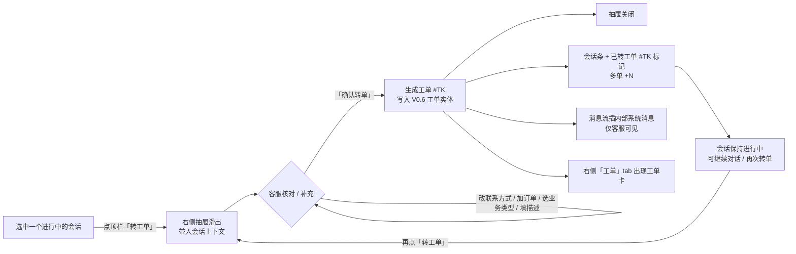

# PRD-工作台转工单-V0.1

> **版本**: V0.1 | **日期**: 2026-08-03 | **状态**: 初稿
>
> **原型目录**: `prototype-cs/admin/` (`admin-workbench.html`)
>
> **依据**: 《PRD-客服工单-V0.6.md》(本文**承接其 §0.15「改工作台」**——V0.6 将工作台转工单入口明确留由工作台负责人另排,本稿即该范围的产品定义)、《PRD-后台-V0.9.md》
>
> **归档**: 本稿为现行版本;历史版本见 `archive/`。
>
> **核心口径**:
> - **工作台内闭环**:转工单不再 `location.href` 跳建单独立页,改为客服工作台右侧**抽屉**完成;与同排「挂起 / 转接 / 结束」按钮交互一致(均弹层 + 页内完成)。
> - **会话继续**:转单后当前会话**不结束**,会话与工单「关联但不互斥」。**区别于** V0.6 原 `converted_to_ticket`(转单=结束会话)语义;本功能 source 仍 = 会话转,但会话状态机不受转单影响。
> - **工单仅客服可见**:工单号 / 工单状态为内部标识,**不推送用户端**,转单**不给客户发任何消息**;消息流中的「已转工单」系统消息属客服侧内部备注(V0.6 §一:工单为内部处理,用户不可见)。
> - **字段默认带入**:客户 / 联系方式 / 订单 / 企业 / 商城从当前会话上下文自动带入,客服可核对修改;降低转单成本同时保留纠错能力。
> - **多工单**:同一会话可转多张工单(客户接连提出多个售后问题),不拦截、不合并。
> - **不新增工单数据模型**:工单实体 / 字典 / 状态机完全复用 V0.6 §三;本功能只是**工作台侧的轻量建单入口**,提交后工单进入 V0.6 工单列表 / 详情正常流转。

---

## 总览:工作台转工单操作流程

> 一句话口径:**选中会话 → 抽屉带入上下文 → 核对补充 → 确认转单 → 会话继续、工单可见、客户无感。**

---

## 零、对工作台的改动清单

> **原则**:仅改 `admin-workbench.html` 一个文件;不新建页面。所有工单数据 / 字典 / 状态机沿用 V0.6。

| 序号 | 动作 | 对象 | 说明 |
|------|------|------|------|
| 0.1 | **引入脚本** | `<head>` | + `js/ticket-dict.js`(字典) + `js/cascader.js`(三级级联,建单页同款) |
| 0.2 | **改按钮逻辑** | `#btnTicket`(聊天顶栏) | `toast + location.href 跳转` → `打开右侧抽屉`;旧 `admin-ticket-create.html?mode=session` 跳转废弃 |
| 0.3 | **新增抽屉** | `#ticketDrawer` / `#ticketMask` | 复用 `.lib-drawer` 容器(与话术库 / 待接受转接抽屉同源),宽 520px |
| 0.4 | **新增右栏 tab** | `.info-tabs` + `.info-pane[data-pane="ticket"]` | 「工单」tab,展示该客户工单列表(内部) |
| 0.5 | **新增样式** | `<style>` | 抽屉表单字段 `.tk-*`、工单卡 `.tk-card`、会话条标记 `.s-tag.ticket` / `.ticket-pop` |
| 0.6 | **新增 JS 模块** | 文件末尾 `<script>` | `openTicketDrawer` / 字段带入 / 校验 / 提交 / 会话条回写 / 工单 tab 渲染 / 多工单浮层 |
| 0.7 | **不改** | V0.6 工单列表 / 详情 / 建单独立页 / 配置页 | 工单列表「+创建工单」、订单列表「批量创建工单」仍走 `admin-ticket-create.html`(standalone/order/batch),不受影响 |

> 与 V0.6 §0.15 的差异:V0.6 原计划工作台「转工单」按钮跳建单页 + 会话结束(`converted_to_ticket`)。本稿改为**工作台内抽屉 + 会话继续**,语义更贴合「边聊边转单」。`session.end` 的 `converted_to_ticket` 枚举保留兼容(其他入口可能用),工作台不再触发。

---

## 一、范围边界

| 范围 | 内容 |
|------|------|
| **In Scope (本期)** | 工作台顶栏「转工单」抽屉(带入上下文 + 字段核对 + 提交) / 会话继续 + 会话条工单标记 / 消息流内部系统消息 / 右栏「工单」tab(按客户) / 多工单(+N 浮层) / 边界拦截(未选会话 / 已结束会话) |
| **Out Scope(本期不做)** | 工单进度**主动推送**回流会话(工单受理 / 完工时在工作台弹提示,2 期);会话结束时未完工工单的拦截校验(2 期);工作台内工单详情面板(本期 `#TK` 点击新开 V0.6 工单列表 / 详情页) |

> **定位**:本功能是 V0.6 工单系统在工作台侧的**轻量建单入口**,解决 V0.6 §0.15 遗留的「工作台转工单」交互。会话解决即时问题,转工单让客服在不打断对话的前提下,把需跨部门 / 需订单系统操作的售后问题落成工单跟进。

### 一.1 角色列表

| 代号 | 角色 | 工作台转工单职责 |
|------|------|-----------------|
| R-A | 客服 | 在工作台选中会话后发起转工单、核对 / 修改带入字段、提交;会话继续后可再次转单 |
| R-S | 客服主管 | 同 R-A(本功能不区分权限,工单权限遵循 V0.6 §一.1) |
| R-C | 终端用户 | **无感知**:工单为内部处理,转单不推送消息,用户端不出现工单号(V0.6 §一) |
| R-SYS | 系统 | 生成工单号、回写会话条标记 / 消息流内部消息 / 工单 tab |

---

## 二、入口与页面

### 二.1 入口

聊天区顶栏(`.chat-topbar .topbar-actions`)「转工单」按钮(`#btnTicket`),与「挂起 / 转接 / 备注 / 结束 / 待接受转接」并列。

- **可用态**:当前选中一个「进行中 / 等待中 / 挂起」会话(data-status ∈ {accept, wait, pending})。
- **禁用态 + 拦截**:未选中任何会话,或选中会话为「已结束」(data-status = close)→ 点击 toast「请先选择一个会话」/「该会话已结束,无法转工单」,不打开抽屉。

### 二.2 抽屉结构(`#ticketDrawer`,宽 520px,右侧滑入)

| 区块 | 内容 |
|------|------|
| 头部 | 标题「转工单 · {客户名}」+ 关闭 |
| 上下文条(蓝) | 来源会话 `#CS…` · 客户 `{名}` `{手机}`(只读,展示带入结果) |
| 已有工单提示(橙,条件) | 本会话已有 N 张工单:{#TK…};提交将再创建一张(仅在已转过单时出现) |
| 工单信息 | 业务类型(三级级联)* · 责任承担方(投诉类联动)* · 优先级 · 完成期限 · 反馈方式* · 协助部门* · 受理客服* · 二次投诉 |
| 关联订单 | 订单列表(带入 + 可增删)+「+ 添加订单」(复用 `modals/drawer-ticket-order.html`) |
| 联系方式 | 联系人 · 移动电话 · 来电电话 · 联系地址(默认带入,可改)+「+ 新联系人」(折叠:新联系人 / 新移动电话 / 新座机 / 新地址) |
| 工单描述* | textarea |
| 提示条 | 「提交后会话继续 · 工单仅客服可见 · 转单不向客户发消息」 |
| 底部 | 取消 / 确认转单 |

### 二.3 右栏「工单」tab

新增 `.info-pane[data-pane="ticket"]`,按当前客户展示其工单卡列表(工单号 / 状态点 / 业务类型 / 受理客服 / 优先级 / 关联订单 / 来源会话 + 时间)。空态:「该客户暂无工单」。点击工单卡 → 新开 V0.6 `admin-ticket.html`。

---

## 三、转工单抽屉字段定义(默认带入规则)

> **核心**:尽可能从当前会话上下文带入,客服核对修改;必填项与 V0.6 §三.2.1 对齐,来源字段固定不展示。

| 序号 | 字段 | 必填 | 默认带入来源 | 可改 | 口径 / 校验 |
|------|------|:---:|------|:---:|------|
| 1 | 工单业务类型(三级) | 是 | — | 是 | `category > sub_category > type`,复用 V0.6 `CATEGORY_TREE`;`createCascader` 三级级联 |
| 2 | 责任承担方 | 投诉类必填 | — | 是 | 一级 = 投诉业务时联动显示并必填;否则隐藏(V0.6 `RESPONSIBLE_PARTIES`) |
| 3 | 优先级 | 否 | 一般 | 是 | 一般 / 紧急 / 特急(V0.6 `PRIORITIES`);不驱动 SLA |
| 4 | 完成期限 | 否 | — | 是 | 1天 / 7天 / 15天(V0.6 `DEADLINES`);驱动 `deadline_at` |
| 5 | 反馈方式 | 是 | **在线客服会话** | 是 | 转单默认「在线客服会话」(V0.6 `FEEDBACK_METHODS`);可改电话 / 短信等 |
| 6 | 协助部门 | 是 | **客服部** | 是 | 默认客服部(V0.6 `DEPTS`);跨部门协同时改商品 / 商务 / 物流部 |
| 7 | 受理客服 | 是 | **当前登录客服** | 是 | 默认当前客服(原型 `张小明`);需转他人时手动改(V0.6 `ACCEPTORS`) |
| 8 | 二次投诉 | 否 | 否 | 是 | 否 / 是 |
| 9 | 关联订单 | 否 | **当前会话客户首笔订单** | 是(增删) | 工单-订单 1 对多(V0.6 §三.2.5);「+ 添加订单」复用 `drawer-ticket-order.html`;展示 = 主订单号 + 子订单号 + SKU + 金额 + 状态 |
| 10 | 企业名称 | 是 | **会话客户企业**(三层归属[0]) | 是 | V0.6 `ENTERPRISES`;带入错可下拉改 |
| 11 | 商城名称 | 是 | **会话客户商城**(三层归属[1]) | 是 | V0.6 `MALLS` |
| 12 | 联系人 | 否 | 会话客户姓名 | 是 | 默认取客户名;代下单 / 代收时改 |
| 13 | 移动电话 | 否 | 会话客户手机号 | 是 | 默认取客户手机 |
| 14 | 来电电话 | 否 | — | 是 | 客户用别的号码来电时填(可空) |
| 15 | 联系地址 | 否 | 会话客户地址(如有) | 是 | 售后需收货 / 寄回地址 |
| 16 | 新联系人(4 字段) | 否 | — | 折叠展开 | 收货人以外的实际联系人(V0.6 §三.2.6):新联系人 / 新移动电话 / 新座机 / 新地址 |
| 17 | 工单描述 | 是 | — | 是 | 详细描述问题(仅客服 / 受理人可见);**本功能要求必填**(严于 V0.6,转单场景须说明问题) |
| 18 | 来源(source) | 系统 | **固定 = 会话转(1)** | 否 | 不展示;对应 V0.6 `source=1` |

> **带入读取口径**:客户对象 = 工作台 `window.getCurrentCust()`(当前选中会话);手机 / 企业 / 商城优先取客户字段,缺失时从右栏「基础信息」tab DOM 兜底读取(初始李晓红为 isDefault,信息在初始 HTML)。三层归属映射见工作台 `BELONG`。

---

## 四、用例

### UC-TF-01 打开转工单抽屉
- **前置**:工作台已选中一个非「已结束」会话。
- **主流程**:点顶栏「转工单」→ 右侧抽屉滑出 + 遮罩 → 初始化业务类型级联 + 填充字典 + 重置表单 + 带入上下文。
- **后置**:抽屉待填写;遮罩点击 / 取消 / 关闭均收起抽屉。

### UC-TF-02 上下文自动带入
- 抽屉头部「转工单 · {客户名}」;上下文条显示来源会话号(按客户名稳定 mock `#CS2026xxxxxx`)、客户名、手机。
- 关联订单带入客户首笔;联系方式 / 企业 / 商城按 §三默认值带入。

### UC-TF-03 填写工单信息
- 业务类型三级级联选择;选「投诉业务」→ 责任承担方出现并必填;否则隐藏。
- 受理客服默认当前客服;反馈方式默认在线客服会话;协助部门默认客服部。

### UC-TF-04 关联订单管理
- 默认带入客户首笔订单(展示主单 / 子单 / SKU / 金额 / 状态)。
- 「+ 添加订单」→ 复用 `modals/drawer-ticket-order.html`(查询勾选多单,跨查询保留)→ 追加,去重。
- 每条可「移除」。

### UC-TF-05 联系方式核对与修改
- 默认带入客户姓名 / 手机;客服可改,可填来电电话 / 联系地址。
- 「+ 新联系人」折叠展开 4 字段(代收 / 实际联系人)。

### UC-TF-06 提交转单(确认转单)
- **校验**:业务类型必填;投诉类责任承担方必填;反馈方式 / 协助部门 / 受理客服 / 工单描述必填。失败 → toast 定位对应字段。
- **通过**:生成工单号 `#TK` + yyyyMMdd + 3 位序号;按 V0.6 §三.2.1 落工单实体(source=1 会话转,session_id = 当前会话);写 `ticket_order`(1 对多)、`ticket_extension`(联系方式 / 业务字段)。
- 关闭抽屉 → 触发 UC-TF-07 / UC-TF-09 + toast「已转工单 #TK…,会话继续」。

### UC-TF-07 会话继续与回写(会话条 + 消息流)
- **会话不结束**:不改 `data-status`,会话仍可在「进行中 / 等待中 / 挂起」对应 tab 见到。
- **会话条标记**:当前会话 `.session-status-row` 追加紫色「已转工单 {#TK}」标签(仅客服侧);多单追加「+N」。
- **消息流内部消息**:插入系统消息「已转工单 {#TK}(业务类型 / 受理)· 会话继续 · 仅客服可见」,**不推送用户端**。
- 点会话条工单标签 / +N → 浮层列该会话全部工单(号 + 三级类型 + 状态),点条目新开 V0.6 工单列表。

### UC-TF-08 多工单
- 已转过工单的会话,再次「转工单」→ 抽屉顶部出现橙色「本会话已有 N 张工单:…;提交将再创建一张」;不拦截。
- 每次提交生成独立 `#TK`;会话条显示最近一个 + 累计 +N。

### UC-TF-09 右栏「工单」tab
- 切到「工单」tab → 按当前客户展示其全部工单卡(号 / 状态点 / 业务类型 / 受理 / 优先级 / 关联订单 / 来源会话 + 时间)。
- 切换会话(客户)→ 工单 tab 跟随刷新;空态「该客户暂无工单」。
- 点工单卡 → 新开 V0.6 `admin-ticket.html`。

### UC-TF-10 边界与异常
- 未选会话点转工单 → toast「请先选择一个会话」。
- 选中「已结束」会话点转工单 → toast「该会话已结束,无法转工单」。
- 字典未加载(`ticket-dict.js` 缺失)→ 控制台告警,下拉空,提交被校验拦。

---

## 五、业务规则

| 编号 | 规则 |
|------|------|
| **BR-TF-01** | **会话继续**:转单后当前会话状态不变,不触发 `session.end`;会话与工单关联(`ticket.session_id`)但不互斥。覆盖 V0.6 原 `converted_to_ticket`(转单=结束)在本入口的行为。 |
| **BR-TF-02** | **工单仅客服可见**:工单号 / 状态 / 「已转工单」消息均为内部,不推送用户端(`service-user`);转单不向客户发任何消息。 |
| **BR-TF-03** | **来源固定**:本入口创建的工单 `source = 1`(客服 / 会话转),不展示来源选择。 |
| **BR-TF-04** | **受理客服默认当前**:建单时默认当前登录客服,可改(V0.6 §三.2.1 序号 13)。 |
| **BR-TF-05** | **字段默认带入**:联系方式 / 企业 / 商城 / 关联订单从会话上下文带入,可改;带入值不强制必填校验通过(企业 / 商城 / 反馈方式 / 协助部门 / 受理客服 / 业务类型 / 描述 必填)。 |
| **BR-TF-06** | **多工单不拦截**:同一会话可转多张;每张独立 `#TK`,不合并、不阻断再次转单。 |
| **BR-TF-07** | **数据可见性**:工单数据权限遵循 V0.6 §一.1(R-A 见分配给自己的,R-S 见全部);本入口不额外加权限。 |

---

## 六、状态回写与衔接

### 六.1 回写点(提交后,均仅客服侧)

| 回写对象 | 内容 | 可见性 |
|----------|------|--------|
| 会话条 `.session-status-row` | 「已转工单 {#TK}」紫标 + 多单「+N」 | 客服 |
| 消息流 `.msg-thread` | 内部系统消息(suspend-notice 风格) | 客服(不推用户端) |
| 右栏「工单」tab | 该客户工单卡列表 | 客服 |
| 工单实体(V0.6) | 新建工单(source=1,session_id 关联) | 进入 V0.6 工单列表 / 详情 |

### 六.2 与 V0.6 工单系统衔接

- **复用**:`ticket-dict.js`(字典)、`cascader.js`(三级级联)、`modals/drawer-ticket-order.html`(关联订单抽屉)。
- **不重复定义**:工单主表 / 事件流水 / 状态机 / 字段口径全部沿用 V0.6 §三;本入口提交的工单与 `admin-ticket-create.html?mode=session` 产出的工单**等价**,在 V0.6 列表 / 详情正常受理 / 跟进 / 完工。
- **区别仅入口形态**:V0.6 的 session 模式 = 跳独立页 + 会话结束;本入口 = 工作台抽屉 + 会话继续。两者落库一致,会话语义不同。
