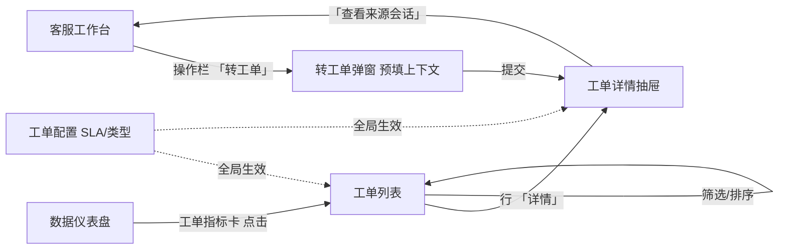
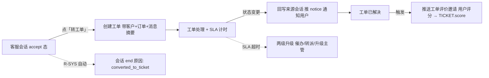
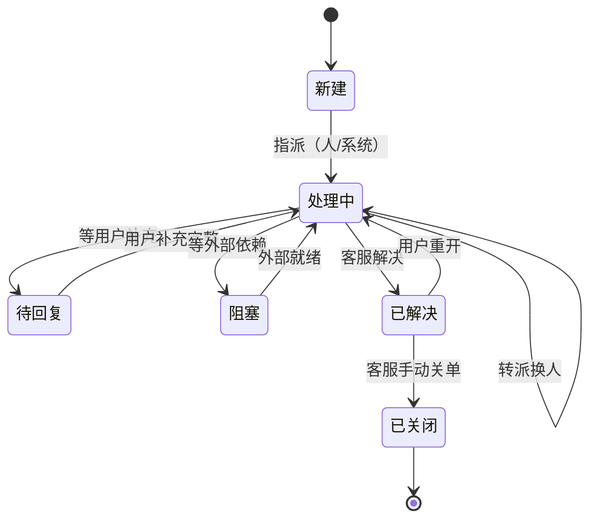
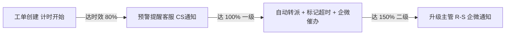

# PRD-工单管理-V0.2

> **版本**: V0.2 | **日期**: 2026-07-17 | **状态**: 评审稿（V0.1 矛盾修正版）
>
> **原型目录**: `prototype-cs/admin/` (`admin-ticket.html` 待建)
>
> **依据**: 《工单系统-竞品调研-V0.1.md》、《PRD-后台-V0.9.md》
>
> **V0.1 → V0.2 关键修正**:
> 1. ~~「工单系统」~~→ **「工单管理」**（定位为已有客服后台的迭代增量模块，非独立系统）。
> 2. **已关闭可达性**：1 期增补「客服手动关单」路径，6 态全部可达。
> 3. **会话转工单联动**：转工单后会话 **end**（不挂起），不污染现有 pending 语义。
> 4. **工单评价**：1 期独立轻度实现（TICKET 表内嵌 `score`），不强行复用会话 RATING 表。
> 5. **SLA 引擎定位**：明确为**新建** SLA 引擎，仅**通知通道**复用 csNotify + 企业微信。
> 6. **事件命名**：统一 `ticket.created` / `ticket.assigned` 等点分隔格式。
> 7. **存量和新建边界**：增加「零、对存量系统的改动清单」，明确哪些是新建表/API，哪些是对现有表的改动。
> 8. **`order_id` 必填**：售后工单全部关联订单，`order_id` 改为必填。
> 9. **`MESSAGE` 表扩展 `ticket_id`**：回写会话的通知消息可追溯到工单。
> 10. **cron 调度**：工单 SLA 扫描与现有会话超时扫描分频执行。

---

## 零、对存量系统的改动清单

> **原则**：工单管理是 OCS 客服后台 V0.9 的**迭代增量**。以下区分「新建」与「改动现有」。

| 序号 | 动作 | 对象 | 说明 |
|------|------|------|------|
| 0.1 | **新建表** | `customer_chat_tickets` | 工单主表 |
| 0.2 | **新建表** | `customer_chat_ticket_events` | 工单事件流水 |
| 0.3 | **新建表** | `customer_chat_ticket_comments` | 工单备注（内部/对客） |
| 0.4 | **新建表** | `customer_chat_ticket_extensions` | 工单业务附表（T 型） |
| 0.5 | **新建表** | `customer_chat_ticket_sla_config` | 工单 SLA 配置（独立于会话规则） |
| 0.6 | **改现有表** | `customer_chat_messages` | + `ticket_id varchar(32) NULL FK→tickets` |
| 0.7 | **改现有表** | `customer_chat_sessions` | + `ticket_id varchar(32) NULL FK→tickets` |
| 0.8 | **新建 API** | `/api/backend/ticket/*` | 工单 CRUD + 分派 + 备注 + SLA 配置 + 导出（见十二） |
| 0.9 | **改现有 API** | `/api/backend/session/end` | 结束原因枚举增加 `converted_to_ticket` |
| 0.10 | **扩展 cron** | `internal/cron/cron.go` | + `ticketSLA`（每 5 分钟）+ `ticketAutoAssign`（每 1 分钟） |
| 0.11 | **新建页面** | `admin-ticket.html` | 工单列表页 |
| 0.12 | **新建组件** | 工单详情抽屉 | 从工作台和列表两处进入 |
| 0.13 | **扩展页面** | `admin-settings.html` | + 工单配置区（SLA 矩阵 / 工单类型 / 升级阈值） |
| 0.14 | **扩展页面** | `admin-dashboard.html` | + 工单指标卡 |
| 0.15 | **改工作台** | `admin-workbench.html` | 操作栏 +「转工单」按钮；右栏 +「该客户工单」区 |

---

## 一、范围边界

| 范围 | 内容 |
|------|------|
| **In Scope (1 期)** | 工单列表与查询 / 工单详情与处理 / **会话转工单** / SLA 时效与两级升级 / 工单分派(手动+轮询) / 工单回写会话通知 / 工单评价(轻度) / 工单配置(SLA+类型) / 仪表盘扩展工单指标卡 |
| **Out Scope (2 期+)** | 轮次响应 SLA / 关单确认 SLA / SLA 暂停/重开计时 / 母子工单(子任务) / 金额审批 / 机器人自动建单 / 技能组分派 / 流转触发器 / 工单完整报表与 SLA 看板 / OMS 深度集成(退款/退货/换货直连) |

> **定位**: 工单管理是 OCS 客服后台 **V0.9 的迭代增量**（「后台 2 期」范畴），在已有会话/客户/通知/角色基础设施上，增加「工单」事务实体 + SLA 时效引擎 + 会话协同接口。会话解决即时问题，工单承接需跨部门/需订单系统操作/有明确时效承诺的售后问题。

### 一.1 角色列表

| 代号 | 角色 | 工单管理职责 |
|------|------|-------------|
| R-A | 客服 | 会话转工单、处理工单、内部备注、转派、对客消息、手动关单 |
| R-S | 客服主管 | SLA 升级终点、工单配置(SLA/类型)、查看全部工单；2 期含审批 |
| R-C | 终端用户 | 工单补充信息、查看进度、工单评价（已解决 → 评分）、重开工单 |
| R-SYS | 系统 | SLA 计时、超时升级、轮询自动分派、状态自动流转、回写会话通知 |

> **审计口径**（沿用 ADR-0001）：工单每次状态迁移通过 `ticket_event` 记录，`operator_type` 区分 `admin` / `customer` / `system`。
>
> **数据可见性**（沿用 ADR-0002）：R-A 仅见分配给自己的工单；R-S 见全部。

---

## 二、页面清单

| 序号 | 页面名称 | 文件名 | 状态 | 说明 |
|------|----------|--------|------|------|
| 1 | 工单列表 | admin-ticket.html | ❌ 待建 | 侧边栏「工单管理（独立一级菜单）」 |
| 2 | 工单详情 | 抽屉（嵌入工作台与列表） | ❌ 待建 | — |
| 3 | 工单配置 | admin-settings.html 扩展区 | ❌ 待建 | SLA 矩阵 / 类型 / 升级阈值（归属「客服设置」） |

### 二.1 页面跳转关系



> 工单列表为独立页（侧边栏「工单管理（独立一级菜单）」）；工单详情为抽屉；工单配置归属「客服设置」。

---

## 三、实体关系总览

### 三.1 核心实体 ER 图

```mermaid
erDiagram
    CUSTOMER ||--o{ TICKET : "发起"
    SESSION ||--o| TICKET : "来源"
    ORDER ||--o{ TICKET : "关联"
    ADMIN ||--o{ TICKET : "处理"
    TICKET ||--|| TICKET_EXTENSION : "业务附表 T型"
    TICKET ||--o{ TICKET_EVENT : "事件流水"
    TICKET ||--o{ TICKET_COMMENT : "备注"
    SESSION ||--o{ MESSAGE : "消息"
    TICKET ||--o{ MESSAGE : "回写消息"

    CUSTOMER { string user_id PK }
    SESSION { string session_id PK "新增 ticket_id FK" }
    ORDER { string order_id PK }
    ADMIN { string admin_id PK }
    MESSAGE {
        string message_id PK
        string ticket_id FK_nullable
    }
    TICKET {
        string ticket_id PK
        string ticket_no
        string title
        string type
        string priority
        string status
        string user_id FK
        string order_id FK
        string session_id FK
        string handler_admin_id FK
        datetime sla_response_due
        datetime sla_resolve_due
        int score
        int source
        datetime created_at
        datetime resolved_at
        datetime closed_at
    }
    TICKET_EXTENSION {
        string ticket_id FK
        string ext_key
        string ext_value
    }
    TICKET_EVENT {
        string event_id PK
        string ticket_id FK
        string event_type
        string operator_id
        string operator_type
        json metadata
        datetime created_at
    }
    TICKET_COMMENT {
        string comment_id PK
        string ticket_id FK
        string type
        text content
        string author_id
        datetime created_at
    }
```

> CUSTOMER / SESSION / ORDER / ADMIN / MESSAGE 为现有 OCS 实体，其中 SESSION 和 MESSAGE 为本次迭代改动表。TICKET 四表为新建。T 型架构：主表通用字段 + 业务附表（按工单类型的特有字段以 KV 存储）。

### 三.2 字段说明

#### 三.2.1 工单主表 (`customer_chat_tickets`)

| 序号 | 字段名 | 显示名 | 类型 | 必填 | 校验/默认 | 来源/口径 |
|------|--------|--------|------|------|-----------|-----------|
| 1 | ticket_id | 工单 ID | varchar(32) PK | 是 | 系统生成 | 系统生成 |
| 2 | ticket_no | 工单编号 | varchar(32) UK | 是 | `#TK` + yyyyMMdd + 6 位序号 | 系统生成 |
| 3 | title | 标题 | varchar(200) | 是 | — | 创建时填写 |
| 4 | type | 工单类型 | varchar(20) | 是 | 退款 / 退货退款 / 换货 / 投诉 / 补发 / 价格干预 | 创建时选 |
| 5 | priority | 优先级 | varchar(10) | 是 | 紧急 / 高 / 中 / 低 | 创建时选或规则定级 |
| 6 | status | 工单状态 | varchar(20) | 是 | 新建 / 处理中 / 待回复 / 阻塞 / 已解决 / 已关闭 | 状态机流转 |
| 7 | user_id | 客户 ID | varchar(32) | 是 | FK → CUSTOMER | 创建时绑定 |
| 8 | order_id | 订单 ID | varchar(32) | **是** | FK → ORDER | 售后工单均关联订单 |
| 9 | session_id | 来源会话 ID | varchar(32) | 否 | FK → SESSION | 会话转工单时写入 |
| 10 | handler_admin_id | 处理人 | varchar(32) | 否 | FK → ADMIN | 指派时写入 |
| 11 | handler_group | 处理组 | varchar(32) | 否 | — | 分派时写入（一期预留） |
| 12 | created_at | 创建时间 | datetime | 是 | 系统时间 | 系统自动 |
| 13 | sla_response_due | 响应时效截止 | datetime | 是 | `created_at` + SLA 响应时效（工作时间累加） | 系统按 SLA 算 |
| 14 | sla_resolve_due | 解决时效截止 | datetime | 是 | `created_at` + SLA 解决时效（工作时间累加） | 系统按 SLA 算 |
| 15 | resolved_at | 解决时间 | datetime | 否 | — | 已解决时写入 |
| 16 | closed_at | 关闭时间 | datetime | 否 | — | 已关闭时写入 |
| 17 | source | 来源 | tinyint | 是 | 1=客服 / 0=用户 / 2=系统 | 创建时确定 |
| 18 | score | 工单评分 | tinyint | 否 | 1-5 | 已解决后用户评价，独立于会话 RATING |

> `order_id` 改为**必填**。工单管理全部面向售后场景（退款/退货/换货/投诉/补发/价格干预），每种类型均需关联订单。面向非订单场景的客服问题留在会话，不转工单。

#### 三.2.2 工单事件流水 (`customer_chat_ticket_events`)

| 字段 | 类型 | 取值/口径 |
|------|------|----------|
| event_id | varchar(32) PK | 系统生成 |
| ticket_id | varchar(32) FK | 关联工单 |
| event_type | varchar(30) | `ticket.created` / `ticket.assigned` / `ticket.replied` / `ticket.resolved` / `ticket.reopened` / `ticket.escalated` / `ticket.transferred` / `ticket.closed` |
| operator_id | varchar(32) | 操作人 ID（系统事件为空） |
| operator_type | varchar(10) | `admin` / `customer` / `system` |
| created_at | datetime | 系统时间 |
| metadata | json | 上下文（转派 from→to / 升级级别 / SLA 值 / 阻塞原因等） |

> **命名对齐**：事件统一用 `对象.动作` 格式（与后台 PRD V0.9 转接事件 `transfer.created` 等一致）。
>
> **operator_type 语义**：`admin`=客服/主管操作，`customer`=终端用户操作，`system`=系统自动。与 TICKET 表 `source` 字段（1=客服/0=用户/2=系统）为不同维度的概念——`source` 记录工单由谁创建，`operator_type` 记录事件由谁触发。

#### 三.2.3 工单备注 (`customer_chat_ticket_comments`)

| 字段 | 类型 | 取值/口径 |
|------|------|----------|
| comment_id | varchar(32) PK | 系统生成 |
| ticket_id | varchar(32) FK | 关联工单 |
| type | varchar(10) | `internal`（内部备注，客户不可见）/ `public`（对客消息，回写会话） |
| content | text | 内容 |
| author_id | varchar(32) FK | 作者 admin_id |
| created_at | datetime | 系统时间 |

#### 三.2.4 MESSAGE 表扩展（改动存量表 `customer_chat_messages`）

| 新增字段 | 类型 | 必填 | 说明 |
|---------|------|------|------|
| ticket_id | varchar(32) | 否 | FK → `customer_chat_tickets`，工单回写会话的 notice 消息写入此字段，用于：① 会话内区分消息来源；② 用户端消息跳转工单详情 |

#### 三.2.5 SESSION 表扩展（改动存量表 `customer_chat_sessions`）

| 新增字段 | 类型 | 必填 | 说明 |
|---------|------|------|------|
| ticket_id | varchar(32) | 否 | FK → `customer_chat_tickets`，会话转工单时写入，用于工作台「已转工单」标记和工单详情「查看来源会话」反向跳转 |

---

═════════ 以下每个模块独立成章 ═════════

---

## 四、工单列表与查询（代号：TL）

工单查询页。多维筛选 + SLA 排序 + 操作入口。R-A 仅见自己的工单，R-S 见全部。

- **入口**: 侧边栏 > 工单管理（独立一级菜单）
- **关键元素**: 统计摘要条（6 项）、筛选条（类型/优先级/状态/客服/日期）、SLA 倒计时列、数据表格、导出
- **使用角色**: R-A / R-S

### 四.1 功能用例与验收

| UC 编号 | 用例名称 | 角色 | 说明 |
|---------|---------|------|------|
| UC-TL-01 | 统计摘要 | R-A | 进入页面，6 项统计：工单总数 / 待处理 / 即将超时 / 已超时 / 今日解决 / SLA 达成率 |
| UC-TL-02 | 筛选查询 | R-A | 类型 / 优先级 / 状态 / 客服 / 日期 组合过滤 |
| UC-TL-03 | SLA 排序 | R-A | 默认按「已超时 > 即将超时 > 其余」排序 |
| UC-TL-04 | 查看详情 | R-A | 行「详情」打开抽屉 |
| UC-TL-05 | 导出 | R-S | 导出筛选结果为 Excel |

**验收标准（AC-TL）**

| AC 编号 | 验收标准 | 对应用例 | Given | When | Then |
|---------|---------|:--------:|-------|------|------|
| AC-TL-01 | 数据可见性 | UC-TL-02 | 列表 | R-A 登录 | 仅见 `handler_admin_id = 自己` 的工单；R-S 见全部 |
| AC-TL-02 | SLA 倒计时渲染 | UC-TL-03 | 列表 | 渲染 | 每行显示响应/解决剩余时间；已超时红色、即将超时（< 20%）橙色 |
| AC-TL-03 | 超时优先排序 | UC-TL-03 | 列表 | 默认加载 | 已超时 > 即将超时 > 其余，同档按 due 时间升序 |
| AC-TL-04 | 状态筛选 | UC-TL-02 | 筛选栏 | 切状态 | 按 status 过滤（新建/处理中/待回复/阻塞/已解决/已关闭） |

### 四.2 数据字段（列表列）

| 字段 | 取值 | 说明 |
|------|------|------|
| 工单号 | `#TK` + yyyyMMdd + 序号 | col-id |
| 标题 | 工单标题 | — |
| 类型 | 退款/退货退款/换货/投诉/补发/价格干预 | tag |
| 优先级 | 紧急/高/中/低 | tag，紧急红色 |
| 状态 | 新建/处理中/待回复/阻塞/已解决/已关闭 | s-tag |
| 客户 | 昵称 + 脱敏手机 | CUSTOMER 表 |
| SLA 倒计时 | 响应剩余 / 解决剩余 | 已超时红、临期橙 |
| 处理人 | 客服名 / 「未分配」 | — |
| 创建时间 | datetime | — |
| 操作 | 详情 / 转派 / 指派 | 按状态+角色显示 |

---

## 五、会话转工单（代号：CT）— 核心模块

客服在会话中把需异步跟进的售后问题转为工单，带上下文建单，处理后回写会话通知用户。

- **入口**: 客服工作台 > 会话操作栏「转工单」
- **使用角色**: R-A（转）、R-SYS（回写通知）

### 五.1 功能用例与验收

| UC 编号 | 用例名称 | 角色 | 说明 |
|---------|---------|------|------|
| UC-CT-01 | 发起转工单 | R-A | accept 态会话点「转工单」，弹窗预填上下文 |
| UC-CT-02 | 自动带入上下文 | R-A | 自动填：客户信息 + 订单（右栏选中订单）+ 会话消息摘要 + 建议优先级 |
| UC-CT-03 | 选类型/优先级 | R-A | 选工单类型、确认或改优先级、填标题 |
| UC-CT-04 | 会话状态联动 | R-SYS | 转工单后**会话自动结束**（`end`），结束原因为 `converted_to_ticket` |
| UC-CT-05 | 工单回写会话 | R-SYS | 工单状态变更 → 向来源会话推系统消息（`notice`）通知用户 |
| UC-CT-06 | 解决触发工单评价 | R-SYS | 工单「已解决」→ 向用户推送工单满意度评价邀请 |

**验收标准（AC-CT）**

| AC 编号 | 验收标准 | 对应用例 | Given | When | Then |
|---------|---------|:--------:|-------|------|------|
| AC-CT-01 | 上下文预填 | UC-CT-02 | 转工单弹窗 | 打开 | 自动填 user_id / order_id / session_id + 消息摘要；优先级按关键词建议 |
| AC-CT-02 | 建单写事件 | UC-CT-01 | 提交 | 确认 | 创建 TICKET(status=新建) + 写 `ticket.created` 事件(operator_type=`admin`) |
| AC-CT-03 | 会话结束联动 | UC-CT-04 | 转工单后 | — | 来源会话 `status=end` + `ticket_id=新工单ID` + 结束原因=`converted_to_ticket`；向会话推 notice：「您的问题已转为工单 #TK…，我们将在工单中继续为您处理」 |
| AC-CT-04 | 回写通知 | UC-CT-05 | 工单状态变更 | 处理中/已解决 | 向 session_id 推 `type=notice` 消息（MESSAGE.ticket_id=工单ID），用户端可见 |
| AC-CT-05 | 反向跳回 | UC-CT-01 | 工单详情 | 点「查看来源会话」 | 跳回工作台并定位该会话 |
| AC-CT-06 | 评价触发 | UC-CT-06 | 工单已解决 | — | 推送工单评价邀请（非会话 RATING），用户提交评价写 TICKET.score |

### 五.2 核心流程（协同闭环）



> **转工单时机判定**：需跨部门/需订单系统操作/需时效承诺 → 转工单；纯沟通 → 留会话。一期手动转（由客服判断），2 期加关键词建议与机器人自动转。

> **设计决策——为什么转工单后会话结束而不是挂起**：
> 1. 会话 `pending` 是为「客服查资料、短暂离开」设计的，挂起恢复时间以分钟计（后台 PRD 预设 600s/1800s/3600s），工单处理可能长达数天，语义不匹配。
> 2. `pending` 状态下会话仍会计入超时预警（挂起超时 → 自动回复 → 轮次响应超时），对已转工单的会话无意义。
> 3. 会话 `end` 后工单通过 notice 消息回写，用户端可收到通知并查看工单进度，链路完整。

---

## 六、工单详情与处理（代号：TD）

工单抽屉：基本信息 + 状态流转 + 内部协作（备注/对客消息）+ 事件流水 + 来源会话。

- **入口**: 工单列表「详情」/ 工作台「转工单」后
- **使用角色**: R-A（处理）、R-S（查看全部/升级终点）

### 六.1 工单状态机



| 当前状态 | 目标状态 | 触发动作 | 守卫条件 | 执行角色 | 1期/2期 |
|----------|----------|----------|----------|----------|---------|
| — | 新建 | 转工单/手动创建 | — | R-A / R-C | ✅ 1 期 |
| 新建 | 处理中 | 指派 | handler_admin_id 必填 | R-A / R-SYS | ✅ 1 期 |
| 处理中 | 待回复 | 等用户补充 | — | R-A | ✅ 1 期 |
| 待回复 | 处理中 | 用户补充完整 | — | R-C / R-A | ✅ 1 期 |
| 处理中 | 处理中 | 转派 | 换 handler | R-A | ✅ 1 期 |
| 处理中 | 阻塞 | 等外部依赖 | 阻塞原因必填 | R-A | ✅ 1 期 |
| 阻塞 | 处理中 | 外部就绪 | — | R-A / R-SYS | ✅ 1 期 |
| 处理中 | 已解决 | 客服解决 | — | R-A | ✅ 1 期 |
| 已解决 | 处理中 | 用户重开 | 用户不满意 | R-C | ✅ 1 期 |
| **已解决 → 已关闭** | 客服手动关单 | — | R-A | ✅ **1 期** |
| 已解决 → 已关闭 | 用户确认 / 超时自动 | 关单确认时效 | R-C / R-SYS | 🟡 2 期 |
| 已关闭 → 已关闭 | — | — | — | 终态，不可迁移 |

> **V0.2 修正**：1 期增加「客服手动关单」路径（已解决 → 已关闭），使 6 态在 1 期全部可达。2 期增加「用户确认 / 超时自动关单」。

### 六.2 功能用例与验收

| UC 编号 | 用例名称 | 角色 | 说明 |
|---------|---------|------|------|
| UC-TD-01 | 查看详情 | R-A | 工单信息 + 客户 + 订单 + 来源会话 + 事件流水 |
| UC-TD-02 | 指派/转派 | R-A | 指派给自己或转派他人，写事件 |
| UC-TD-03 | 内部备注 | R-A | `type=internal`，客户不可见 |
| UC-TD-04 | 对客消息 | R-A | `type=public`，回写来源会话（MESSAGE.ticket_id=工单ID） |
| UC-TD-05 | 状态变更 | R-A | 按状态机流转，写事件 |
| UC-TD-06 | 查看来源会话 | R-A | 跳回工作台 |
| UC-TD-07 | 手动关单 | R-A | 已解决态点「关闭」，二次确认后关单 |

**验收标准（AC-TD）**

| AC 编号 | 验收标准 | 对应用例 | Given | When | Then |
|---------|---------|:--------:|-------|------|------|
| AC-TD-01 | 事件流水 | UC-TD-05 | 任意状态变更 | 提交 | 写 TICKET_EVENT，operator_type 区分 admin/customer/system |
| AC-TD-02 | 双通道消息 | UC-TD-03/04 | 详情 | 发备注 | internal 仅工单内可见；public 回写来源会话（MESSAGE 写入 ticket_id） |
| AC-TD-03 | 转派带历史 | UC-TD-02 | 转派 | 确认 | handler 更新 + 事件写 `ticket.transferred`（metadata 存 from→to） + 新处理人 CS 通知 |
| AC-TD-04 | 阻塞需原因 | UC-TD-05 | 处理中→阻塞 | 提交 | 阻塞原因必填，否则阻断 |
| AC-TD-05 | 手动关单确认 | UC-TD-07 | 已解决 | 点「关闭」 | 弹出二次确认；确认后 status→已关闭 + closed_at=now + 写 `ticket.closed` 事件 |

---

## 七、SLA 时效与升级（代号：SL）

工单区别于会话的核心能力。工单 SLA 引擎为**独立新建**模块——与现有会话超时预警共享**通知通道**（csNotify + 企业微信），但其计时模型、升级策略、配置结构均为独立设计。

- **入口**: 客服设置 > 工单配置 > SLA
- **使用角色**: R-S（配置）、R-SYS（计时/升级）
- **cron 调度**: 工单 SLA 扫描独立于会话超时扫描，每 **5 分钟**执行一次（工单 SLA 以小时/天为尺度，无需秒级扫描）

### 七.1 SLA 配置（独立配置表 `customer_chat_ticket_sla_config`）

**① 事件清单：**

| 事件 | 计时区间 | 衡量 | 1 期/2 期 |
|------|---------|------|----------|
| 首次响应 FRT | 创建 → 客服首次回复 | 接单速度 | ✅ 1 期 |
| 解决 RT | 创建 → 已解决 | 处理速度 | ✅ 1 期 |
| 轮次响应 | 用户补充 → 客服回复 | 跟进速度 | 🟡 2 期 |
| 关单确认 | 已解决 → 确认/超时关闭 | 等确认上限 | 🟡 2 期 |

**② 时效矩阵（默认值，全可配）：**

| 优先级 | 首次响应 | 解决 | 典型场景 |
|--------|---------|------|---------|
| 紧急 | 10 分钟 | 2 小时 | 重大投诉 / VIP / 系统故障 |
| 高 | 30 分钟 | 4 小时 | 退款异常 / 物流丢件 |
| 中 | 1 小时 | 8 小时（1 工作日） | 常规退换货 |
| 低 | 2 小时 | 24 小时 | 一般咨询转工单 |

**③ 配置项：**

| 配置项 | 控件 | 默认值 | 存储 |
|--------|------|--------|------|
| SLA 矩阵 | 优先级（行）× 事件（列），每格 input + 单位下拉（分/时/天） | 见上表 | `customer_chat_ticket_sla_config` |
| 工作时间计时 | switch（开=9:00-21:00，关=7×24） | 开 | 同上 |
| 一级升级阈值 | input % | 100% | 同上 |
| 二级升级阈值 | input % | 150% | 同上 |
| 催办通道 | checkbox（CS 通知 + 企业微信） | 均开 | 同上 |

### 七.2 超时升级流程



### 七.3 功能用例与验收

| UC 编号 | 用例名称 | 角色 | 说明 |
|---------|---------|------|------|
| UC-SL-01 | SLA 计时 | R-SYS | 工单创建即按优先级 + 工作时间计算 sla_*_due |
| UC-SL-02 | 即将超时预警 | R-SYS | 达时效 80% → CS 通知提醒客服 |
| UC-SL-03 | 一级升级 | R-SYS | 达 100% → 自动转派 + 标记超时 + 企微催办 |
| UC-SL-04 | 二级升级 | R-SYS | 达 150% → 升级主管 R-S + 企微通知 |
| UC-SL-05 | 配置 SLA | R-S | 修改时效矩阵 / 阈值 / 工作时间 |

**验收标准（AC-SL）**

| AC 编号 | 验收标准 | 对应用例 | Given | When | Then |
|---------|---------|:--------:|-------|------|------|
| AC-SL-01 | 计时按优先级 | UC-SL-01 | 创建工单 | priority 确定 | sla_*_due = created_at + 对应优先级时效（工作时间累加）；写 ticket.created 事件 metadata 含 SLA 值 |
| AC-SL-02 | 工作时间模式 | UC-SL-01 | 配置 switch=开 | 计时 | 仅 9:00-21:00 累计，非工作时段不计入时钟 |
| AC-SL-03 | 一级升级 | UC-SL-03 | 达 100% | cron 扫描 | 转派（换 handler）+ 标记超时 + 企微催办 + 写 ticket.escalated 事件 |
| AC-SL-04 | 二级升级 | UC-SL-04 | 达 150% | cron 扫描 | 升级 R-S 主管 + 企微通知 + 写事件 |
| AC-SL-05 | 配置持久化 | UC-SL-05 | 配置页 | 保存 | 落 `customer_chat_ticket_sla_config`（独立表，与会话规则的 `customer_chat_settings` 分离），新工单生效 |

### 七.4 异常与边界

| 场景 | 处理 |
|------|------|
| 待回复暂停 SLA 计时 | 1 期不实现（2 期）；1 期「首次响应/解决」均从创建时刻累计，不暂停 |
| 重开后 SLA 重计 | 2 期；1 期重开不重置 sla_*_due |
| 配置变更生效 | 仅对新创建的工单生效；存量工单保持创建时的 SLA 值 |
| 升级通知通道 | 复用现有 csNotify + 企业微信；不新建独立通知通道 |

> **与会话超时预警的边界**：
> | 维度 | 会话超时预警（现有） | 工单 SLA（新建） |
> |------|---------------------|------------------|
> | 计时模型 | cron 扫消息 sent_ts 时间差（pull） | cron 扫每行 deadline datetime 列（push） |
> | 配置存储 | `customer_chat_settings` KV 表 | `customer_chat_ticket_sla_config` 独立表 |
> | 时间尺度 | 秒/分钟级 | 小时/天级 |
> | 升级机制 | 单级预警通知 | 两级 escalation（转派 100% → 升级主管 150%） |
> | 工作时间 | 无 | 9:00-21:00 可选 |
> | **共享部分** | — | **通知通道**（csNotify + 企业微信） |

---

## 八、工单分派（代号：AS）

1 期：手动指派 + 轮询自动分派。2 期：技能组/规则分派。

- **使用角色**: R-A（指派/转派）、R-SYS（自动分派）
- **cron 调度**: 轮询自动分派每 **1 分钟**扫描新建且无 handler 的工单

### 八.1 功能用例与验收

| UC 编号 | 用例名称 | 角色 | 说明 |
|---------|---------|------|------|
| UC-AS-01 | 手动指派 | R-A | 创建/转工单时指定 handler；或从列表「指派」操作指定 |
| UC-AS-02 | 轮询自动分派 | R-SYS | 新建工单未指定 handler → cron 轮询分配给在线客服 |
| UC-AS-03 | 满载跳过 | R-SYS | 客服达 `max_sessions` 上限 → 跳过该客服 |
| UC-AS-04 | 转派 | R-A | 处理中转派他人 |

**验收标准（AC-AS）**

| AC 编号 | 验收标准 | 对应用例 | Given | When | Then |
|---------|---------|:--------:|-------|------|------|
| AC-AS-01 | 轮询分配 | UC-AS-02 | 新建无 handler | cron 扫到 | 按在线客服列表轮询，跳过满载，写 `ticket.assigned` 事件 |
| AC-AS-02 | 满载跳过 | UC-AS-03 | 候选达 `max_sessions` | 轮询到 | 跳过该客服，选下一个；全部满载 → 进入待分配池 + CS 通知主管 |
| AC-AS-03 | 转派审计 | UC-AS-04 | 转派 | 确认 | handler 变更 + 写 `ticket.transferred` 事件（metadata 含 from→to） |

---

## 九、工单回写与通知（代号：RB）

工单状态变更回写来源会话（若有 `session_id`），通知用户，形成闭环。

- **使用角色**: R-SYS

### 九.1 功能用例与验收

| UC 编号 | 用例名称 | 角色 | 说明 |
|---------|---------|------|------|
| UC-RB-01 | 状态回写 | R-SYS | 处理中 / 已解决 → 来源会话推 `notice` 消息 |
| UC-RB-02 | 对客消息回写 | R-SYS | `public` 类型备注 → 写入来源会话 MESSAGE 表（`ticket_id`=工单ID） |
| UC-RB-03 | 升级通知客服 | R-SYS | SLA 升级 → 企微 + CS 通知处理人/主管 |

**验收标准（AC-RB）**

| AC 编号 | 验收标准 | 对应用例 | Given | When | Then |
|---------|---------|:--------:|-------|------|------|
| AC-RB-01 | 回写消息可追溯 | UC-RB-01 | 工单 session_id 存在 | 状态变更 | 向会话推 `type=notice` 消息（MESSAGE.ticket_id=工单ID），用户端可见 |
| AC-RB-02 | 无来源会话 | UC-RB-01 | session_id 为空 | 状态变更 | 跳过回写，仅站内/企微通知处理人 |
| AC-RB-03 | 升级通道 | UC-RB-03 | SLA 升级 | 触发 | csNotify + 企业微信，复用现有通知基础设施 |

---

## 十、工单评价（代号：TE）

1 期：工单评价为轻量独立机制，TICKET 表内嵌 `score` 字段（1-5），不绑定或复用会话 RATING 表。

- **触发**: 工单状态变更为「已解决」后，系统向来源会话（若有）推工单评价邀请消息
- **使用角色**: R-C（评价）、R-SYS（推送邀请）
- **存储**: `TICKET.score`（单值，1-5）
- **2 期展望**: 独立工单评价表 `customer_chat_ticket_ratings`（评分 + 文本 + 催评次数），或扩展会话 RATING 表加 `ticket_id`

| UC 编号 | 用例名称 | 角色 | 说明 |
|---------|---------|------|------|
| UC-TE-01 | 推送评价邀请 | R-SYS | 工单已解决 → 向来源会话推评价卡片消息 |
| UC-TE-02 | 用户评分 | R-C | 用户提交评分 1-5 → 写入 TICKET.score |
| UC-TE-03 | 查看工单评分 | R-A/R-S | 工单详情/列表显示 `score` |

**验收标准（AC-TE）**

| AC 编号 | 验收标准 | 对应用例 | Given | When | Then |
|---------|---------|:--------:|-------|------|------|
| AC-TE-01 | 评价邀请 | UC-TE-01 | 工单已解决 | — | 向 session_id 推 type=notice 消息（含评价入口），MESSAGE.ticket_id=工单ID |
| AC-TE-02 | 无会话不推送 | UC-TE-01 | session_id 为空 | — | 跳过评价邀请推送 |
| AC-TE-03 | 评分写入 | UC-TE-02 | 用户评分 | 提交 | TICKET.score = 用户值（1-5） |

> **为什么 1 期不复用会话 RATING 表**：
> 1. `customer_chat_ratings` 的 FK 是 `session_id`（必填），而工单可能无来源会话。
> 2. RATING 状态流转（pending/done/skipped/expired）发生在会话结束时，工单评价触发点在已解决而非会话结束。
> 3. 1 期仅需评分单值存储，2 期再统一评价体系时做表结构扩展。

---

## 十一、工单报表与配置（代号：RP / CF）

### 十一.1 工单报表（RP）

扩展现有数据仪表盘（`admin-dashboard.html`），新增工单指标卡。

| 指标 | 口径 |
|------|------|
| 工单量 | 时段内新建工单数（按类型/优先级分类） |
| 平均处理时长 | `resolved_at − created_at` 均值 |
| SLA 达成率 | 未超时解决数 / 总解决数 |
| 工单满意度 | TICKET.score 均值（1-5） |
| 客服工单绩效 | 处理量 / 平均时长 / 达成率，按 handler_admin_id 聚合 |

### 十一.2 工单配置（CF）

扩展 `admin-settings.html` 页面，新增「工单配置」区块。

| 配置 | 说明 | 存储 |
|------|------|------|
| SLA 矩阵 | 优先级 × 事件 时效（见七） | `customer_chat_ticket_sla_config` |
| 工单类型 | 启用/停用类型 + 关联业务附表字段定义 | `customer_chat_ticket_sla_config` |
| 升级阈值 | 一级/二级百分比 | `customer_chat_ticket_sla_config` |
| 自动定级规则 | 关键词 / 客户等级 → 优先级 | `customer_chat_ticket_sla_config` |

---

## 十二、单据流转

### 十二.1 工单单（`customer_chat_tickets`）

| 阶段 | 触发 | 字段变更 | 关联动作 |
|------|------|----------|----------|
| 创建 | 会话转工单 / 客服手动创建 | ticket_id / ticket_no / type / priority / status=新建 / user_id / order_id / session_id / created_at / sla_*_due | 写 `ticket.created` 事件；触发轮询分派；若 session_id 则会话标记 end + ticket_id |
| 指派 | 手动/轮询 cron | handler_admin_id / status=处理中 | 写 `ticket.assigned` 事件 |
| 待回复 | 等用户补充 | status=待回复 | (2 期暂停 SLA) |
| 阻塞 | 等外部依赖 | status=阻塞 / 原因写入 metadata | — |
| 升级 | SLA 超时 | 标记超时 / handler 转派 | 写 `ticket.escalated` 事件；企微 + CS 通知 |
| 解决 | 客服解决 | status=已解决 / resolved_at | 回写会话 notice；触发工单评价邀请 |
| 关闭（手动） | 客服手动关单 | status=已关闭 / closed_at | 写 `ticket.closed` 事件 |
| 关闭（自动） | 用户确认 / 超时 | status=已关闭 / closed_at | (2 期) |
| 重开 | 用户不满意 | status=处理中 | 写 `ticket.reopened` 事件；(2 期重置 SLA) |

---

## 十三、接口时序

### 十三.1 同步接口

| # | 操作 | 方法 | 路径 | 关键参数 | 异常码 |
|---|------|------|------|----------|--------|
| 1 | 工单列表 | GET | `/api/backend/ticket/list` | 筛选条件（type/priority/status/handler/date） | 空数据 |
| 2 | 工单详情 | GET | `/api/backend/ticket/detail` | ticket_id | 无权限 / 不存在 |
| 3 | 创建工单（含转工单） | POST | `/api/backend/ticket/create` | type / priority / title / user_id / order_id / session_id | 参数缺失 / order_id 无效 |
| 4 | 状态变更 | POST | `/api/backend/ticket/update` | ticket_id / action（resolve / block / reopen / close 等） | 非法状态迁移 |
| 5 | 指派/转派 | POST | `/api/backend/ticket/assign` | ticket_id / handler_admin_id | 目标满载 |
| 6 | 备注 | POST | `/api/backend/ticket/comment` | ticket_id / type / content | — |
| 7 | SLA 配置读写 | GET/POST | `/api/backend/ticket/sla-config` | 矩阵 / 阈值 / 工作时间 | — |
| 8 | 工单导出 | GET | `/api/backend/ticket/export` | 筛选条件 | 空数据 |
| 9 | 会话结束（扩展） | POST | `/api/backend/session/end` | session_id / reason | — |

> 接口 9 为现有接口扩展：`reason` 枚举新增 `converted_to_ticket`，触发时写入 SESSION.ticket_id。

### 十三.2 异步流程

| # | 触发 | 链路 | cron 频率 | 补偿 |
|---|------|------|-----------|------|
| 1 | SLA 计时 + 升级 | cron 扫 `sla_*_due` → 判断超时比例 → 预警/一级升级/二级升级 | **每 5 分钟** | 下次扫描覆盖 |
| 2 | 状态回写 | 工单状态变更 → 有 session_id 则推 notice 消息 → 写入 MESSAGE（含 ticket_id） | 即时（事件驱动） | 推送失败则 WS 重连后客户端拉历史 |
| 3 | 自动分派 | cron 扫新建无 handler 工单 → 轮询在线客服 → 写入 handler | **每 1 分钟** | 全部满载 → 待分配池 + CS 通知主管 |
| 4 | 评价邀请 | 已解决 → 有 session_id 则推评价邀请消息 | 即时（事件驱动） | — |

> **cron 调度策略**：工单 SLA 扫描（5 分钟）与现有会话超时扫描（分钟级）在 `cron.go` 中分 goroutine 执行，互不阻塞。工单 SLA 尺度为小时/天级，5 分钟精度足够，且避免与高频会话 cron 竞争。

### 十三.3 与 OMS 集成接口（2 期，1 期仅记录不操作）

| # | 操作 | 方向 | 说明 |
|---|------|------|------|
| 1 | 查询订单详情 | 工单 → OMS | GET 订单/物流/售后单（1 期只读展示） |
| 2 | 发起退款 | 工单 → OMS | 2 期：退款工单触发 OMS 退款单 |
| 3 | 退货退款（RMA） | 工单 → OMS | 2 期：触发退货单→签收→退款 |
| 4 | 换货/补发 | 工单 → OMS | 2 期 |
| 5 | 售后事件回写 | OMS → 工单 | 2 期：退款结果/退货签收 → 更新工单状态 |

---

## 十四、与前台的交互

工单通知通过现有 WebSocket 通道推送到用户端（复用 `receive-message` action，消息类型 `notice`）。MESSAGE.ticket_id 使前端可识别工单通知，跳转工单进度页。

| 交互点 | 方向 | 说明 |
|--------|------|------|
| 工单进度通知 | SYS → 用户 | `type=notice`，内容含工单号 + 标题 + 状态，附带 ticket_id |
| 工单评价邀请 | SYS → 用户 | `type=notice`，含评分入口，用户提交后写 TICKET.score |
| 用户补充信息 | 用户 → 工单 | 通过来源会话发送消息（MESSAGE 关联 ticket_id），工单详情可查看 |

---

## 十五、与现有客服系统集成总结

| 集成点 | 现有 OCS 能力 | 工单管理接入方式 | 复用程度 |
|--------|--------------|-----------------|----------|
| 会话转工单 | 会话状态机 + 工作台操作栏 | 操作栏增「转工单」；转后会话 end | **改现有** |
| 客户关联 | CUSTOMER 表 + 客户 360 画像 | TICKET.user_id FK | **复用** |
| 订单关联 | 客户信息-交易 Tab（OMS） | TICKET.order_id FK | **复用** |
| 通知通道 | csNotify + 企业微信 | SLA 升级 / 转派通知 复用通道 | **复用** |
| 角色体系 | R-A / R-S | 处理人=R-A，升级终点=R-S | **复用** |
| 审计口径 | 事件流水模式（ADR-0001） | TICKET_EVENT（operator_type=admin/customer/system） | **改现有模式** |
| 仪表盘 | 数据仪表盘（admin-dashboard） | 扩展工单指标卡 | **改现有页面** |
| 会话回写 | MESSAGE 表 + WS 推送 | MESSAGE.ticket_id + type=notice | **改现有表** |
| SLA 引擎 | —（会话超时预警为 pull 模型） | **独立新建** push 模型 | **新建** |
| 工单评价 | —（会话 RATING 耦合于 session） | **独立新建** TICKET.score | **新建** |

> **复用率重新评估**：
> - 复用（不改或仅扩展）：角色体系、通知通道、CUSTOMER/ORDER 实体 — 约占基础设施 40%
> - 改动现有：会话状态机、SESSION 表、MESSAGE 表、仪表盘页面 — 约占 20%
> - 全新建设：TICKET 四表 + SLA 引擎 + 工单 CRUD API + 工单页面 — 约占 40%

---

## 十六、落地路线

**1 期（MVP）：**

| 序号 | 交付项 | 依赖 |
|------|--------|------|
| 1 | 数据库迁移：新建 TICKET 四表 + MESSAGE.ticket_id + SESSION.ticket_id | — |
| 2 | 工单 CRUD API + 状态机（6 态含手动关单） | 1 |
| 3 | 会话转工单（工作台操作栏 + 上下文预填 + 会话自动 end） | 2 + 现有工作台 |
| 4 | SLA 引擎（计时 + 80% 预警 + 100%/150% 两级升级） | 1 + cron |
| 5 | 手动指派 + 轮询自动分派 | 2 |
| 6 | 工单回写会话通知（notice + ticket_id） | 2 + 现有 WS |
| 7 | 工单评价（TICKET.score） | 2 |
| 8 | 工单列表页 + 详情抽屉 | 2 |
| 9 | 工单配置页（SLA 矩阵/类型/升级阈值） | 1 + 现有 settings 页 |
| 10 | 仪表盘扩展工单指标卡 | 2 + 现有 dashboard 页 |

**2 期：**

| 序号 | 交付项 |
|------|--------|
| 11 | 轮次响应 / 关单确认 SLA + 暂停/重开计时 |
| 12 | 技能组分派 + 流转触发器 |
| 13 | 母子工单 + 审批 + 内部 @/关注 |
| 14 | 完整工单报表 + SLA 看板 |
| 15 | 机器人自动建单 |
| 16 | OMS 深度集成（退款/退货/换货直连） |
| 17 | 用户确认/超时自动关单 |

---

## 十七、风险与待确认

| # | 风险/待确认 | 说明 | 应对 |
|---|------------|------|------|
| 🔴 1 | OMS 接口未就绪 | OMS 重构中，1 期工单无法直连退款/退货操作 | 1 期仅记录订单关联；`order_id` 必填（用户端必须带订单才能发起售后） |
| ⚠️ 2 | 转工单时机 | 自动转 vs 手动转 | 1 期手动 + 关键词建议；自动转 2 期 |
| ⚠️ 3 | SLA 待回复/重开暂停计时 | 暂停影响 SLA 公平性 | 1 期不暂停（总时效）；2 期再补暂停模型 |
| ⚠️ 4 | 会话 end 后回写 | 用户能否在原会话窗口继续收到工单通知 | 依赖 MESSAGE.ticket_id + 用户端识别 notice 消息类型，需用户端配合改造 |
| ⚠️ 5 | 售后单（RMA）归属 | 售后单在 OMS 还是工单 | 售后单归 OMS（一等实体），工单仅跟踪处理进度 |
| ⚠️ 6 | 工作台右栏「该客户工单」区 | 需在工作台新增工单列表嵌入 | 依赖工作台 PRD，需与工作台负责人对齐 |

---

*本稿为 V0.2 评审稿，修正了 V0.1 中 6 项内部矛盾和 6 项跨模块冲突。标注 🔴 项需向技术/业务确认（OMS 接口可用性 + 用户端改造范围）。*
