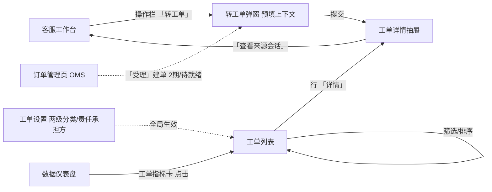
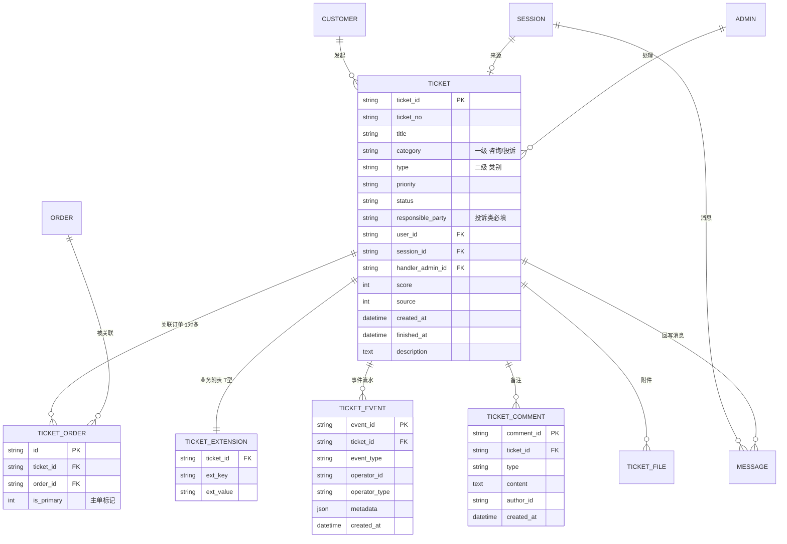
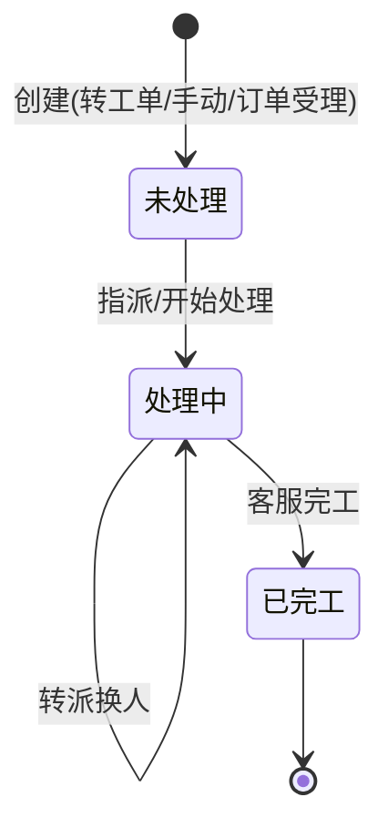

# PRD-客服工单-V0.4

> **版本**: V0.4 | **日期**: 2026-07-22 | **状态**: 评审稿
>
> **原型目录**: `prototype-cs/admin/` (`admin-ticket.html` / `admin-ticket-settings.html`)
>
> **依据**: 《商城客服工单需求-20260721.pptx》→《PPT转换-商城客服工单业务需求文档-V1.5.md》(BRD V1.5)、《7月21日09:16 面聊纪要》、《PRD-后台-V0.9.md》
>
> **V0.3 归档**: V0.3 已移至 `PRD/客服工单/archive/PRD-客服工单-V0.3.md`,本稿为现行版本。
>
> **V0.3 → V0.4 关键调整(对齐 BRD V1.5)**:
> 26. **工单分类两级化**:扁平 6 类 → 两级(咨询/投诉 → 类别),分类字典后台可配(取自 BRD §4.4)。
> 27. **新增「责任承担方」**:投诉类工单必填(宏兆 / 供应商 / 东莞邮政 / 昆山吉波,可配)。
> 28. **受理字段族补全**:联系人 / 电话 / 地址 + 项目名 + 反馈方式 + 是否二次投诉 + 提交部门,落 `extension` 表;**剔除「新座机」等冗余字段**(纪要)。
> 29. **订单自动带出清单**:明确建单自动带入的订单字段(项目名 / 收货 / SKU / 金额等,BRD §4.3)。
> 30. **批量追加订单**:手机号搜客户全量订单 → 全选,工单-订单 **1 对多**。
> 31. **工单催办 + 附件 / 追加材料**:详情操作补「催办」「附件上传」。
> 32. **范围口径明确**:SLA **维持去除**(后续可选);消费者自助建单、触发式 / AI 自动建单、规则型分配 → **2 / 3 期**。
>
> **保留不变(沿用 V0.3)**:会话转工单(会话 end 联动)、3 态状态机(未处理 / 处理中 / 已完工)、工单分派(手动 + 轮询)、回写会话通知、操作日志(人 / 系统审计)、T 型数据模型、与 OMS 集成边界、**去 SLA 决策**、工单内部处理(用户不可见)。
>
> **历史演进摘要(V0.2→V0.3,沿用)**:① 移除 SLA 时效与升级(含 `sla_response_due`/`sla_resolve_due`、`ticket_sla_config` 表、`ticketSLA` cron);② 工单管理 → **客服工单**(改名);③ 状态机 **3 态**(未处理 / 处理中 / 已完工),创建→未处理,已完工=终态;④ 删「重启」「沟通记录」timeline;⑤ 事件流水 → **操作日志**;⑥ 工单描述可编辑 + 保留历史版本;⑦ 回复改为跳转会话工作台,工单内仅留内部备注;⑧ 转单 = 转接工单;⑨ 工单设置独立页;⑩ 创建方式 3 种(会话转 / 手动 / 订单受理);⑪ 工单的会话必须是人工处理过的(accept / 有 admin_id)。

---

## 零、对存量系统的改动清单

> **原则**:客服工单是 OCS 客服后台 V0.9 的**迭代增量**。区分「新建」与「改动现有」。

| 序号 | 动作 | 对象 | 说明 |
|------|------|------|------|
| 0.1 | **新建表** | `customer_chat_tickets` | 工单主表(含 `category` / `responsible_party`,见三.2.1) |
| 0.2 | **新建表** | `customer_chat_ticket_events` | 工单事件流水(操作日志) |
| 0.3 | **新建表** | `customer_chat_ticket_comments` | 工单备注(内部) |
| 0.4 | **新建表** | `customer_chat_ticket_extensions` | 工单业务附表(T 型:联系方式 / 订单快照 / 业务字段) |
| 0.5 | **新建表** | `customer_chat_ticket_orders` | **工单-订单关联表(1 对多)**(V0.4 新增,支持批量追加) |
| 0.6 | **改现有表** | `customer_chat_messages` | + `ticket_id varchar(32) NULL FK→tickets` |
| 0.7 | **改现有表** | `customer_chat_sessions` | + `ticket_id varchar(32) NULL FK→tickets` |
| 0.8 | **新建 API** | `/api/backend/ticket/*` | 工单 CRUD + 分派 + 备注 + 催办 + 导出(见十二) |
| 0.9 | **改现有 API** | `/api/backend/session/end` | 结束原因枚举增加 `converted_to_ticket` |
| 0.10 | **扩展 cron** | `internal/cron/cron.go` | + `ticketAutoAssign`(每 1 分钟,轮询分派) |
| 0.11 | **新建页面** | `admin-ticket.html` | 工单列表页(状态分栏 + 两级分类筛选) |
| 0.12 | **新建组件** | 工单详情抽屉 | 从工作台和列表两处进入 |
| 0.13 | **扩展页面** | `admin-ticket-settings.html` | 工单设置页(两级分类 + 责任承担方 + 优先级 增删改) |
| 0.14 | **扩展页面** | `admin-dashboard.html` | + 工单指标卡 |
| 0.15 | **改工作台** | `admin-workbench.html` | 操作栏 +「转工单」按钮;右栏 +「该客户工单」区 |

> 相比 V0.3:新增 `customer_chat_ticket_orders`(1 对多订单关联,支撑批量追加);主表 + `category` / `responsible_party`;设置页承载两级分类 + 责任承担方配置。

---

## 一、范围边界

| 范围 | 内容 |
|------|------|
| **In Scope (1 期)** | 工单列表与查询 / 工单详情与处理 / **会话转工单** / 工单分派(手动 + 轮询) / 工单回写会话通知 / **两级分类 + 责任承担方配置** / **受理字段族 + 订单自动带出** / **批量追加订单(1 对多)** / **催办** / **附件上传** / 仪表盘扩展工单指标卡 |
| **Out Scope(本期不做)** | **SLA 时效与升级**(已移除,后续可选,见十六);**消费者侧自助提交工单**(2 期);**触发式自动建单 / AI 智能建单**(2 / 3 期);**规则型分配**(按类型 / 项目 / 客户等级 / 技能,2 期);轮次响应 / 关单确认 / 母子工单 / 审批 / 技能组分派 / 流转触发器 / 完整报表 / OMS 深度集成(退款退货换货直连) |

> **定位**:客服工单是 OCS 客服后台 **V0.9 的迭代增量**,在已有会话 / 客户 / 通知 / 角色基础设施上,增加「工单」事务实体 + 会话协同接口。会话解决即时问题,工单承接需跨部门 / 需订单系统操作的售后问题(退款 / 退货 / 换货 / 投诉 / 补发 / 价格干预)。
>
> **本期工单为内部处理,用户不可见**(消费者自助建单 2 期)。V0.4 去 SLA 后,工单无「时效承诺 + 超时升级」,改为客服主动跟进 + 主管人工督促 + **催办**。

### 一.1 角色列表

| 代号 | 角色 | 客服工单职责 |
|------|------|-------------|
| R-A | 客服 | 会话转工单、处理工单、内部备注、转派、催办、回复用户(跳工作台)、完工、上传附件 |
| R-S | 客服主管 | 查看全部工单、工单分类 / 责任承担方配置、督促跟进、催办;2 期含审批 |
| R-C | 终端用户 | (本期工单为内部处理,用户不可见,无操作;消费者自助建单 2 期) |
| R-SYS | 系统 | 轮询自动分派、状态自动流转、回写会话通知 |

> **审计口径**(沿用 ADR-0001):工单每次状态迁移通过 `ticket_event` 记录,`operator_type` 区分 `admin` / `customer` / `system`。
>
> **数据可见性**(沿用 ADR-0002):R-A 仅见分配给自己的工单;R-S 见全部。

---

## 二、页面清单

| 序号 | 页面名称 | 文件名 | 状态 | 说明 |
|------|----------|--------|------|------|
| 1 | 工单列表 | admin-ticket.html | ✅ 已建 | 客服工单(独立一级菜单,状态分栏 + 两级分类筛选) |
| 2 | 工单详情 | 抽屉(嵌入工作台与列表) | ✅ 已建 | 含催办 / 附件 |
| 3 | 工单设置 | admin-ticket-settings.html | ✅ 已建 | 两级分类 + 责任承担方 + 优先级 增删改 |

### 二.1 页面跳转关系



> 工单列表为独立页(客服工单一级菜单);工单详情为抽屉;工单设置归属「客服设置」。**订单管理页受理建单(创建方式③)待 OMS 订单管理页就绪**。

---

## 三、实体关系总览

### 三.1 核心实体 ER 图



> 相比 V0.3:① TICKET 主表 `type`(扁平 6 类)拆为 **`category`(一级)+ `type`(二级类别)**,新增 **`responsible_party`**(投诉类);② 新增 **`TICKET_ORDER` 关联表**(工单-订单 1 对多,替代主表单 `order_id`);③ 新增 **`TICKET_FILE` 附件**;沿用 `TICKET_EXTENSION` 承载联系方式 / 订单快照 / 业务字段。`order_id` 从主表移至关联表(主单 `is_primary=1`)。

### 三.2 字段说明

#### 三.2.1 工单主表 (`customer_chat_tickets`)

| 序号 | 字段名 | 显示名 | 类型 | 必填 | 校验 / 默认 | 来源 / 口径 |
|------|--------|--------|------|------|-----------|-----------|
| 1 | ticket_id | 工单 ID | varchar(32) PK | 是 | 系统生成 | 系统生成 |
| 2 | ticket_no | 受理编号 | varchar(32) UK | 是 | `#TK` + yyyyMMdd + 6 位序号 | 系统生成;创建后不可修改(BRD §4.2) |
| 3 | title | 标题 | varchar(200) | 是 | — | 创建时填写 |
| 4 | category | 受理业务类型(一级) | varchar(10) | 是 | 咨询 / 投诉 | 创建时选(见三.3) |
| 5 | type | 工单类别(二级) | varchar(30) | 是 | 联动一级(BRD §4.4 字典) | 创建时选(见三.3) |
| 6 | priority | 优先级(紧急程度) | varchar(10) | 否 | 一般 / 紧急 / 特急(BRD §4.2) | 创建时选(分类 / 排序用,不驱动 SLA) |
| 7 | status | 工单状态 | varchar(20) | 是 | 未处理 / 处理中 / 已完工,默认「未处理」 | 状态机流转 |
| 8 | responsible_party | 责任承担方 | varchar(30) | 投诉类必填 | 宏兆 / 供应商 / 东莞邮政 / 昆山吉波(可配) | 投诉类创建时必选(见三.3) |
| 9 | user_id | 客户 ID | varchar(32) | 是 | FK → CUSTOMER | 创建时绑定 |
| 10 | session_id | 来源会话 ID | varchar(32) | 否 | FK → SESSION | 会话转工单时写入(人工处理过的会话) |
| 11 | handler_admin_id | 处理人 | varchar(32) | 否 | FK → ADMIN | 指派时写入 |
| 12 | handler_group | 处理组 | varchar(32) | 否 | — | 分派时写入(一期预留) |
| 13 | source | 来源 | tinyint | 是 | 0=用户 / 1=客服 / 2=系统 / 3=订单受理 | 创建时确定(会话转工单 / 手动创建=客服;从订单受理创建=订单受理) |
| 14 | score | 工单评分 | tinyint | 否 | 1-5 | 2 期评价;本期内部工单无评价,字段保留 |
| 15 | created_at | 受理时间 | datetime | 是 | 系统时间,精确到秒 | 系统自动;不可修改(BRD §4.2) |
| 16 | finished_at | 完工时间 | datetime | 否 | — | 完工时写入(终态) |
| 17 | description | 工单描述(受理内容) | text | 否 | — | 创建时填写;详情可编辑,保留历史版本 |

> 相比 V0.3:① `type`(扁平 6 类)→ **`category` + `type`(两级)**;② 新增 **`responsible_party`**(投诉类必填);③ `order_id` 移至 `TICKET_ORDER` 关联表(1 对多);④ 优先级口径对齐 BRD「一般 / 紧急 / 特急」。**移除 SLA 字段**(沿用 V0.3)。**无「完成期限」字段**(随 SLA 去除,见十六)。
>
> **BRD §4.2 字段落位**:受理编号 / 受理时间(不可改)= 序号 2 / 15;受理人 = 序号 11(handler);紧急程度 = 序号 6;受理业务类型 / 类别 / 类型 = 序号 4 / 5;责任承担方 = 序号 8;受理内容 = 序号 17。其余联系方式 / 订单 / 业务字段落 `extension`(三.2.6)。

#### 三.2.2 ~ 三.2.5(事件流水 / 备注 / MESSAGE 扩展 / SESSION 扩展)

沿用 V0.3,无变化:
- `customer_chat_ticket_events`:`ticket.created` / `ticket.assigned` / `ticket.replied` / `ticket.transferred` / **`ticket.reminded`(催办,V0.4 新增)**。`operator_type` = admin / customer / system。
- `customer_chat_ticket_comments`:internal(内部)。
- MESSAGE + `ticket_id`(回写消息可追溯)。
- SESSION + `ticket_id`(转工单标记 + 反向跳转)。

#### 三.2.6 业务附表 (`customer_chat_ticket_extensions`)字段清单 — V0.4 新增

> T 型扩展表(`ext_key` / `ext_value`)承载 BRD §4.2 / §4.3 的受理字段与订单快照。**剔除「新座机 / 新联系地址 / 新移动电话」等冗余变体**(纪要)。

| 分组 | ext_key | 说明 | 来源 |
|------|---------|------|------|
| **联系方式** | contact_name | 联系人(默认取订单收货人,可改) | BRD §4.2 |
| | contact_phone | 移动电话(默认取收货号码,可改) | BRD §4.2 |
| | contact_tel | 座机电话(可选,保留) | BRD §4.2 |
| | contact_address | 联系地址(默认取收货地址,可改) | BRD §4.2 |
| | incoming_call | 来电电话(人工录入) | BRD §4.2 |
| **业务字段** | project_name | 具体项目名称(必填;订单建单自动带出) | BRD §4.2 / §4.3 |
| | feedback_method | 反馈方式(电话 / 短信 / 业务口 / 合作商平台 / 合作商邮件) | BRD §4.2 |
| | is_secondary_complaint | 是否二次投诉(是 / 否) | BRD §4.2 |
| | submit_dept | 工单提交部门(客服部 / 商品部 / 商务部) | BRD §4.2 |
| **订单快照** | order_snapshot | 建单时自动带入的订单信息 JSON(平台 / 主子单号 / 下单时间 / SKU / 商品名 / 数量 / 金额 / 支付方式 / 供应商 / 收货人 / 收货电话 / 收货地址 / 项目名) | BRD §4.3 |

> 订单的**多对一关联**走 `TICKET_ORDER` 表(三.1);`order_snapshot` 仅存建单时刻主单快照供详情展示与留痕。

### 三.3 工单分类体系(两级)与责任承担方 — V0.4 新增

> 对齐 BRD §4.4 三级树,收敛为**两级**(7/21 纪要口径):一级「受理业务类型」+ 二级「工单类别」。BRD 三级树中的「产品 / 物流」作为类别的**分组标签**展示,不单独成级。分类字典后台可配(设置页)。

```
受理业务类型(一级 category)
├── 咨询(category=咨询)
│   ├── [产品] 产品信息 / 操作使用 / 售后网点 / 产品原因更换 / 产品原因退货 / 缺货更换 / 缺货取消 / 开具发票 / 其他
│   └── [物流] 配送情况 / 更改配送地址 / 客户原因取消配送 / 客户原因重新配送 / 物流原因取消配送 / 物流原因重新配送 / 商务导单错误 / 其他
└── 投诉(category=投诉)  ← 投诉类必填「责任承担方」
    ├── [产品] 产品原因更换 / 产品原因退货 / 返修 / 补配件 / 缺货超时未收到 / 补偿 / 其他
    │        责任承担方:宏兆 / 供应商 / 东莞邮政 / 昆山吉波
    └── [物流] 超时未收到 / 否认签收 / 少货 / 错货 / 物流破损更换 / 物流破损退货 / 丢失 / 其他
             责任承担方:宏兆 / 供应商 / 东莞邮政 / 昆山吉波
```

| 规则 | 说明 |
|------|------|
| 一级 | 咨询 / 投诉(必选) |
| 二级 | 联动一级,具体类别(BRD §4.4 字典,可后台增删改) |
| 责任承担方 | **仅投诉类必填**;选项可配(默认宏兆 / 供应商 / 东莞邮政 / 昆山吉波) |
| 查询筛选 | 支持到二级(如「投诉 → 物流 → 物流破损退货」) |
| 字典维护 | 设置页增删改(见十.2),分类字典需业务方维护责任(见十六) |

---

## 四、工单列表与查询(代号:TL)

工单查询页。状态分栏 + 多维筛选 + 操作入口。R-A 仅见自己的工单,R-S 见全部。

- **入口**: 客服工单(独立一级菜单)
- **关键元素**: 状态分栏(待处理 / 处理中 / 已完工 + 全部)、统计摘要条(4 项)、筛选条(受理客服 / 工单类型(两级) / 优先级 / 状态 / 客户昵称手机号 / 处理人 / 来源会话 / 关联订单号 / **商品名称** / **项目名称** / 日期)、数据表格、导出
- **使用角色**: R-A / R-S

### 四.1 功能用例与验收

| UC 编号 | 用例名称 | 角色 | 说明 |
|---------|---------|------|------|
| UC-TL-01 | 状态分栏 + 统计摘要 | R-A | 分栏:待处理 / 处理中 / 已完工 / 全部;4 项统计:工单总数 / 待处理 / 处理中 / 今日完工 |
| UC-TL-02 | 筛选查询 | R-A | 受理客服 / **工单类型(两级)** / 优先级 / 状态 / 客户昵称手机号 / 处理人 / 来源会话 / 关联订单号 / **商品名称** / **项目名称** / 日期 组合过滤 |
| UC-TL-03 | 查看详情 | R-A | 行「详情」打开抽屉 |
| UC-TL-04 | 导出 | R-S | 导出筛选结果为 Excel(财务对账 / 运营复盘,BRD §4.12) |
| UC-TL-05 | 修改来源会话 | R-A | 行「来源」点击 → 内联编辑会话 ID(关联 / 修改 / 清除);**后端校验:关联会话须为人工处理过的(accept 过 / 有 admin_id)** |

> 相比 V0.3:① 列表按状态**分栏**(BRD §4.6 BR-140);② 筛选补 **商品名称 / 项目名称**(依赖订单带出);③ **移除「期限」筛选**(随 SLA 去除)。

### 四.2 数据字段(列表列)

| 字段 | 取值 | 说明 |
|------|------|------|
| 工单号 | `#TK` + yyyyMMdd + 序号 | col-id |
| 标题 | 工单标题 | — |
| 工单类型 | 一级 + 二级(如「投诉 · 物流破损退货」) | tag |
| 优先级 | 一般 / 紧急 / 特急 | tag,紧急红色(分类用,无 SLA) |
| 责任承担方 | 宏兆 / 供应商 / …(投诉类) | 投诉类显示 |
| 来源会话 | 会话 ID / 「-」 | 点击可编辑(关联 / 修改 / 清除会话) |
| 关联订单 | 主单 ID / 多单「+N」 | 点击查看订单详情(跳订单管理页);1 对多 |
| 状态 | 未处理 / 处理中 / 已完工 | s-tag |
| 客户 | 昵称 + 脱敏手机 | CUSTOMER 表 |
| 处理人 | 客服名 / 「未分配」 | — |
| 更新人 / 更新时间 | 更新人 + 更新时间(合并列) | — |
| 操作 | 详情 / 回复(跳工作台) / 转派(转单) / 催办 / 指派(未处理态) | 按状态 + 角色显示;**完工在详情抽屉底部(非行操作,对齐六.2)** |

> 相比 V0.3:列表补**责任承担方列**(投诉类);关联订单支持**多单展示**;行操作补**催办**。无 SLA 倒计时列。

---

## 五、工单创建(代号:CT)— 核心模块

客服把需异步跟进的售后问题创建为工单,带上下文建单,处理后回写会话通知用户。

- **入口**: 客服工作台 > 会话操作栏「转工单」/ 工单列表「新建工单」/ 订单管理页「受理」(待就绪)
- **使用角色**: R-A(创建)、R-SYS(回写通知)

### 五.1 创建方式(3 种)

| 方式 | 入口 | 说明 |
|------|------|------|
| ① 会话转工单 | 工作台会话操作栏「转工单」 | **人工处理过的会话(accept / 有 admin_id)**点「转工单」,弹窗预填上下文(客户 + 订单 + 消息摘要);机器人 / 排队 / 留言等未人工处理的会话不可转 |
| ② 手动创建 | 工单列表「新建工单」 | 手动选客户(搜索手机号 / 昵称 / ID)+ 选订单(可选,按客户查;支持批量追加)+ 填写;无 session_id |
| ③ 从订单受理创建 | 订单管理页「受理」 | 基于订单建单,自动带出商品 / 收货 / 项目名;**待订单管理页(OMS)就绪**(2 期前用方式②替代) |

> 消费者侧自助提交工单(BRD BR-110/111)= **2 期**,本期不做。

### 五.2 订单信息自动关联(自动带出)— BRD §4.3

建单时(方式①②③)若关联订单,系统自动带入以下信息(落 `extension.order_snapshot` + `TICKET_ORDER`):

| 编号 | 自动带入 |
|------|---------|
| BR-130 | 平台、项目名称 |
| BR-131 | 收货人姓名、电话、地址 |
| BR-132 | 主订单号、子订单号、下单时间、商品 SKU(编码)、商品名称、数量 |
| BR-133 | 订单金额、支付方式 |
| BR-134 | 供应商名称 / 供应商商品信息 |
| BR-135 | 同一手机号多个订单 → 手机号搜索全量订单 → **批量追加(1 对多)**(见五.3) |

### 五.3 批量追加订单(1 对多)— V0.4 新增

| UC 编号 | 用例 | 说明 |
|---------|------|------|
| UC-CT-10 | 批量追加订单 | 建单 / 处理中,通过客户手机号搜索其全部订单 → 全选多单 → 批量加入工单(工单-订单 1 对多,`TICKET_ORDER`);无需逐个输入订单号 |
| UC-CT-11 | 手动追加单订单 | 输入具体订单号追加(适用于无手机号 / 老订单场景) |

> 相比 V0.3:批量追加从「待定」转正为 1 期(纪要点 5)。主单 `is_primary=1`,其余 `is_primary=0`。

### 五.4 会话状态联动与回写

| UC 编号 | 用例 | 说明 |
|---------|------|------|
| UC-CT-04 | 会话状态联动 | 会话转工单后**会话自动结束**(`end`),结束原因 `converted_to_ticket` |
| UC-CT-05 | 工单回写会话 | 工单状态变更 → 向来源会话推系统消息(`notice`)通知用户 |

---

## 六、工单详情与处理(代号:TD)

工单抽屉:基本信息 + 状态流转 + 内部备注 + 操作日志 + 来源会话 + 附件。工单描述可编辑(保留历史版本);回复用户跳转会话工作台。

- **入口**: 工单列表「详情」/ 工作台「转工单」后
- **使用角色**: R-A(处理)、R-S(查看全部)

### 六.1 工单状态机



| 当前状态 | 目标状态 | 触发动作 | 守卫条件 | 执行角色 | 1期/2期 |
|----------|----------|----------|----------|----------|---------|
| — | 未处理 | 转工单 / 手动创建 / 订单受理 | — | R-A / R-C | ✅ 1 期 |
| 未处理 | 处理中 | 指派 / 开始处理 | handler_admin_id | R-A / R-SYS | ✅ 1 期 |
| 处理中 | 处理中 | 转派 | 换 handler | R-A | ✅ 1 期 |
| 处理中 | 已完工 | 客服完工 | — | R-A | ✅ 1 期 |

> 3 态(未处理 / 处理中 / 已完工)。已完工为终态,不可操作,继续处理需新建工单。

### 六.2 功能用例与验收(UC-TD / AC-TD)

沿用 V0.3 并修订:查看详情 / 指派转派 / 内部备注 / 状态变更 / 查看来源会话 / 完工。**V0.4 新增**:催办、附件上传 / 追加材料。已完工为终态,不可操作。

| UC 编号 | 用例名称 | 角色 | 说明 |
|---------|---------|------|------|
| UC-TD-07 | 完工 | R-A | 处理中态点「完工」→ 已完工(终态,不可操作) |
| UC-TD-08 | 编辑描述 | R-A | 详情「编辑」→ 改描述 → 保存为新版本(旧版本归档) |
| UC-TD-09 | 查看描述历史 | R-A | 详情「历史版本」→ 展开各版本(时间 / 操作人 / 内容) |
| UC-TD-10 | 回复用户 | R-A | 点「回复用户」→ 跳转会话工作台(在会话里回复,非工单内留言) |
| UC-TD-11 | 添加内部备注 | R-A | 工单内添加内部备注(仅客服可见,不回写会话);**录入结果清晰可见**(纪要点 6) |
| **UC-TD-12** | **催办** | R-A / R-S | 对处理中工单催办(写 `ticket.reminded` 事件 + 站内通知处理人);超时催办的自动触发随 SLA 不做,本期为人工催办 |
| **UC-TD-13** | **附件 / 追加材料** | R-A | 详情上传附件 / 处理后追加材料(`TICKET_FILE`);处理记录不可改,附件只增 |

> 相比 V0.3:新增 UC-TD-12 催办、UC-TD-13 附件。状态操作按钮集中抽屉底部。

---

## 七、工单分派(代号:AS)

1 期:手动指派 + 轮询自动分派。2 期:规则型分派(按类型 / 项目 / 客户等级 / 负载 / 技能)。

- **使用角色**: R-A(指派 / 转派)、R-SYS(自动分派)
- **cron 调度**: 轮询自动分派每 **1 分钟**扫描处理中且无 handler 的工单

### 七.1 功能用例与验收(UC-AS / AC-AS)

沿用 V0.3:手动指派 / 轮询自动分派(跳过满载,全满载进待分配池通知主管)/ 转派(带审计)。无 SLA 相关。

> BRD §4.5 规则型分配(退款→售后组、物流投诉→物流组、VIP 优先、负载均衡、技能匹配)= **2 期**;多规则命中优先级待评审(BRD Open Issue #2)。

---

## 八、工单回写与通知(代号:RB)

工单状态变更回写来源会话(若有 `session_id`),通知用户,形成闭环。

- **使用角色**: R-SYS

### 八.1 功能用例与验收

| UC 编号 | 用例名称 | 角色 | 说明 |
|---------|---------|------|------|
| UC-RB-01 | 状态回写 | R-SYS | 处理中 / 已完工 → 来源会话推 `notice` 消息 |
| UC-RB-02 | (本期不做) | — | 对客回复走「回复用户」跳工作台,工单内不做对客消息回写 |

**验收标准(AC-RB)**

| AC 编号 | 验收标准 | 对应 | Given | When | Then |
|---------|---------|:----:|-------|------|------|
| AC-RB-01 | 回写消息可追溯 | UC-RB-01 | 工单 session_id 存在 | 状态变更 | 向会话推 `type=notice` 消息(MESSAGE.ticket_id=工单ID),用户端可见 |
| AC-RB-02 | 无来源会话 | UC-RB-01 | session_id 为空 | 状态变更 | 跳过回写,仅站内通知处理人 |

> 完结消息卡片通知客户(BRD BR-151)= **随消费者自助建单 2 期**,本期不做。

---

## 九、工单评价(代号:TE)

**本期不实现**(工单为内部处理,用户不可见,无评价)。保留 `score` 字段供后续启用;2 期如需用户评价再开启。

---

## 十、工单报表与配置(代号:RP / CF)

### 十.1 工单报表(RP)

扩展现有数据仪表盘(`admin-dashboard.html`),新增工单指标卡。

| 指标 | 口径 |
|------|------|
| 工单量 | 时段内新建工单数(按类型 / 优先级分类) |
| 平均处理时长 | `finished_at − created_at` 均值 |
| 工单满意度 | TICKET.score 均值(1-5)(2 期,本期不展示) |
| 客服工单绩效 | 处理量 / 平均时长,按 handler_admin_id 聚合 |

> 无 SLA 达成率指标。

### 十.2 工单配置(CF)

`admin-ticket-settings.html`,两级分类 + 责任承担方 + 优先级 增删改(含数量显示)。

| 配置 | 说明 | 存储 |
|------|------|------|
| 一级分类 | 咨询 / 投诉(枚举,一般不改) | `customer_chat_settings` |
| 二级类别 | 增删改类别(联动一级,BRD §4.4 字典) | 同上 |
| 责任承担方 | 增删改(宏兆 / 供应商 / 东莞邮政 / 昆山吉波;投诉类用) | 同上 |
| 优先级 | 增删改(一般 / 紧急 / 特急) | 同上 |
| 数量展示 | 各分类 / 责任方 / 优先级 显示当前工单数量(只读统计) | 实时聚合 |

> 相比 V0.3:配置从「类型 + 优先级」扩为「**两级分类 + 责任承担方 + 优先级**」。

---

## 十一、单据流转

### 十一.1 工单单(`customer_chat_tickets`)

| 阶段 | 触发 | 字段变更 | 关联动作 |
|------|------|----------|----------|
| 创建 | 会话转工单 / 手动创建 / 订单受理 | ticket_id / ticket_no / category / type / priority / responsible_party(投诉类) / **status=未处理** / user_id / TICKET_ORDER / session_id / source / created_at / extension(联系方式+订单快照) | 写 `ticket.created`;若 session_id则会话 end(reason=converted_to_ticket)+ticket_id;进轮询分派池 |
| 指派 | 手动 / 轮询 cron | handler_admin_id / **status=处理中** | 写 `ticket.assigned` |
| 催办 | 人工(R-A/R-S) | — | 写 `ticket.reminded` + 站内通知处理人(V0.4) |
| 完工 | 客服完工 | **status=已完工** / finished_at | 回写会话 notice;**终态,不可操作,继续需新建工单** |

> 对齐 3 态状态机(六.1):创建→未处理。无「待回复 / 阻塞 / 重启 / 关闭」阶段。无 SLA 升级阶段。

---

## 十二、接口时序

### 十二.1 同步接口

| # | 操作 | 方法 | 路径 | 关键参数 | 异常码 |
|---|------|------|------|----------|--------|
| 1 | 工单列表 | GET | `/api/backend/ticket/list` | 筛选(category/type/priority/status/handler/商品名/项目名/date) | 空数据 |
| 2 | 工单详情 | GET | `/api/backend/ticket/detail` | ticket_id | 无权限 / 不存在 |
| 3 | 创建工单(含转工单) | POST | `/api/backend/ticket/create` | category / type / priority / title / responsible_party(投诉类) / user_id / order_ids[] / session_id / extension | 参数缺失 / order_id 无效 / 投诉类缺责任承担方 |
| 4 | 状态变更 | POST | `/api/backend/ticket/update` | ticket_id / action(**assign / transfer / finish**) | 非法状态迁移(3 态) |
| 5 | 指派 / 转派 | POST | `/api/backend/ticket/assign` | ticket_id / handler_admin_id | 目标满载 |
| 6 | 备注 | POST | `/api/backend/ticket/comment` | ticket_id / type / content | — |
| 7 | 分类 / 责任方 / 优先级配置 | GET/POST | `/api/backend/ticket/type-config` | 两级分类 + 责任承担方 + 优先级 列表 | — |
| 8 | 工单导出 | GET | `/api/backend/ticket/export` | 筛选条件 | 空数据 |
| 9 | 会话结束(扩展) | POST | `/api/backend/session/end` | session_id / reason | — |
| 10 | 客户搜索(直接建单) | GET | `/api/backend/customer/search?keyword=` | 关键词(手机号 / 昵称 / ID) | 空结果 |
| 11 | 按客户查订单(直接建单 / 批量追加) | GET | `/api/backend/customer/orders?user_id=` | user_id | 空订单 |
| **12** | **催办** | POST | `/api/backend/ticket/remind` | ticket_id | — |
| **13** | **附件上传 / 追加材料** | POST | `/api/backend/file/upload` | ticket_id / file | 文件超限 |

> V0.4 新增:**#12 催办**、**#13 附件**(复用现有 file 上传)。#3 创建参数 `order_id` → `order_ids[]`(1 对多);投诉类必传 `responsible_party`。#7 配置扩为两级分类 + 责任承担方 + 优先级。

### 十二.2 异步流程

| # | 触发 | 链路 | cron 频率 | 补偿 |
|---|------|------|-----------|------|
| 1 | 状态回写 | 工单状态变更 → 有 session_id 则推 notice 消息 → 写入 MESSAGE(含 ticket_id) | 即时(事件驱动) | 推送失败则 WS 重连后客户端拉历史 |
| 2 | 自动分派 | cron 扫处理中无 handler 工单 → 轮询在线客服 → 写入 handler | **每 1 分钟** | 全部满载 → 待分配池 + CS 通知主管 |

> 无 SLA 计时 / 升级异步流程。

### 十二.3 与 OMS 集成接口(2 期,1 期仅记录不操作)

沿用:查询订单 / 发起退款 / 退货退款(RMA)/ 换货补发 / 售后事件回写 —— 均 2 期,1 期工单仅记录 order_id 关联(1 对多)。

---

## 十三、与前台的交互

工单通知通过现有 WebSocket 通道推送到用户端(复用 `receive-message` action,消息类型 `notice`)。MESSAGE.ticket_id 使前端可识别工单通知。

| 交互点 | 方向 | 说明 |
|--------|------|------|
| 工单进度通知 | SYS → 用户 | `type=notice`,内容含工单号 + 标题 + 状态,附带 ticket_id |
| 用户补充信息 | 用户 → 工单 | 通过来源会话发送消息(MESSAGE 关联 ticket_id),工单详情可查看 |

> 工单评价邀请、完结消息卡片 = **2 期**(随消费者自助建单)。

---

## 十四、与现有客服系统集成总结

| 集成点 | 现有 OCS 能力 | 客服工单接入方式 | 复用程度 |
|--------|--------------|-----------------|----------|
| 会话转工单 | 会话状态机 + 工作台操作栏 | 操作栏增「转工单」;转后会话 end | **改现有** |
| 客户关联 | CUSTOMER 表 + 客户 360 画像 | TICKET.user_id FK | **复用** |
| 订单关联 | 客户信息-交易 Tab(OMS) | TICKET_ORDER(1 对多) | **复用** |
| 通知通道 | csNotify + 企业微信 | 状态回写 / 转派 / 催办通知 复用通道 | **复用** |
| 角色体系 | R-A / R-S | 处理人=R-A,主管=R-S | **复用** |
| 审计口径 | 事件流水模式(ADR-0001) | TICKET_EVENT(operator_type=admin/customer/system) | **改现有模式** |
| 仪表盘 | 数据仪表盘(admin-dashboard) | 扩展工单指标卡 | **改现有页面** |
| 会话回写 | MESSAGE 表 + WS 推送 | MESSAGE.ticket_id + type=notice | **改现有表** |
| 附件存储 | 七牛云 / 本地(library/storage) | TICKET_FILE 复用存储 | **复用** |
| 工单评价 | —(会话 RATING 耦合于 session) | **独立新建** TICKET.score(2 期) | **新建** |

---

## 十五、落地路线

**1 期(MVP):**

| 序号 | 交付项 | 依赖 |
|------|--------|------|
| 1 | 数据库迁移:新建 TICKET 五表(主表 + events + comments + extensions + **orders 1对多**)+ MESSAGE/SESSION.ticket_id | — |
| 2 | 工单 CRUD API + 状态机(3 态)+ 分类两级 + 责任承担方校验 | 1 |
| 3 | 会话转工单(工作台操作栏 + 上下文预填 + 会话自动 end) | 2 + 现有工作台 |
| 4 | 手动指派 + 轮询自动分派 | 2 |
| 5 | 工单回写会话通知(notice + ticket_id) | 2 + 现有 WS |
| 6 | **受理字段族 + 订单自动带出(extension)** | 2 + OMS 字段(十六) |
| 7 | **批量追加订单(1 对多)** | 2 + #11 接口 |
| 8 | **催办(#12)+ 附件(#13)** | 2 |
| 9 | 工单列表页(状态分栏 + 两级分类筛选)+ 详情抽屉 | 2 |
| 10 | 工单设置页(两级分类 + 责任承担方 + 优先级) | 现有 settings 模式 |
| 11 | 仪表盘扩展工单指标卡 | 2 + 现有 dashboard |

**2 期:**

| 序号 | 交付项 |
|------|--------|
| 12 | 消费者侧自助提交工单(前端入口 + 完结消息卡片) |
| 13 | 订单管理页「受理」建单(创建方式③) |
| 14 | 触发式自动建单 / AI 智能建单(仅人工处理过的会话) |
| 15 | 规则型分配(类型 / 项目 / 客户等级 / 技能 / 负载) |
| 16 | 技能组分派 + 流转触发器 + 母子工单 + 审批 |
| 17 | 完整工单报表 + 看板 + 工单评价 |
| 18 | OMS 深度集成(退款 / 退货 / 换货直连) |
| 19 | (可选)如需时效承诺,再引入 SLA 模块 |

---

## 十六、风险与待确认

| # | 风险 / 待确认 | 说明 | 应对 |
|---|------------|------|------|
| 🟢 1 | SLA 去留 | BRD 列为核心,**已定:1 期维持去除**(后续可选) | 无时效承诺;客服跟进 + 主管督促 + 人工催办 |
| 🟢 2 | 消费者自助建单 | BRD 标 P0,**已定:2 期** | 本期工单内部处理,用户不可见 |
| 🔴 3 | OMS 接口 / 字段未就绪 | OMS 重构中;**受理字段族 + 订单带出依赖 OMS 字段梳理**(纪要待办:本周发字段清单) | 1 期仅记录关联;字段清单待业务方(发言人1)本周确认;临时 mock |
| ⚠️ 4 | 「完成期限」字段 | BRD 有(1/7/15天,联动 SLA),**随 SLA 去除移除** | 若业务坚持要软性期限,2 期以非 SLA 字段补回 |
| ⚠️ 5 | 受理字段取舍 | 提交部门 / 反馈方式 / 是否二次投诉 BRD 有,**1 期建议:反馈方式 + 二次投诉保留,提交部门可选** | 落 extension,字段清单本周定稿 |
| ⚠️ 6 | 分类两级字典维护 | 两级分类 + 责任承担方字典需业务方维护责任 | 设置页可配;初始字典取自 BRD §4.4 |
| ⚠️ 7 | 转工单时机 | 自动转 vs 手动转;**前提:工单的会话必须是人工处理过的** | 1 期手动 + 关键词建议;自动转 2 期且仅限人工处理过的会话 |
| ⚠️ 8 | 工作台右栏「该客户工单」区 | 需在工作台新增工单列表嵌入 | 依赖工作台 PRD,需与工作台负责人对齐 |
| ⚠️ 9 | 去除 SLA 后的跟进保障 | 无超时升级,工单可能积压 | 主管人工督促 + 催办 + 报表关注「处理中时长」 |

---

## 附录 A:原型待同步清单(本轮 PRD 定稿后单独做)

> V0.4 PRD 相对当前原型(`28cf785`)的新增点,需后续一轮落到 `prototype-cs/admin/`:

| 原型文件 | 待同步改动 | 对应 PRD |
|---------|-----------|---------|
| `modal-create-ticket.html`(建单弹窗) | 分类选择器两级化(咨询 / 投诉 → 类别);投诉类显「责任承担方」;联系方式 / 项目名 / 反馈方式字段;order-picker 批量多选(1 对多) | 三.3 / 三.2.6 / 五.2 / 五.3 |
| `admin-ticket.html`(列表) | 状态分栏;类型列显示两级;补责任承担方列(投诉类);筛选补商品名 / 项目名、去期限;行操作补催办 | 四.1 / 四.2 |
| `drawer-ticket-detail.html`(详情) | 补「催办」按钮(UC-TD-12);补附件 / 追加材料区(UC-TD-13) | 六.2 |
| `admin-ticket-settings.html`(设置) | 配置改两级分类 + 责任承担方 + 优先级(含数量) | 十.2 |

---

*本稿 V0.4 在 V0.3 基础上对齐 BRD V1.5,落地两级分类、责任承担方、受理字段族、订单自动带出、批量追加、催办、附件;SLA 维持去除,消费者自助 / 自动 / AI 建单、规则分配归 2 / 3 期。V0.3 已归档于 `PRD/客服工单/archive/`。标注 🔴 项需向技术 / 业务确认(OMS 字段可用性)。*
