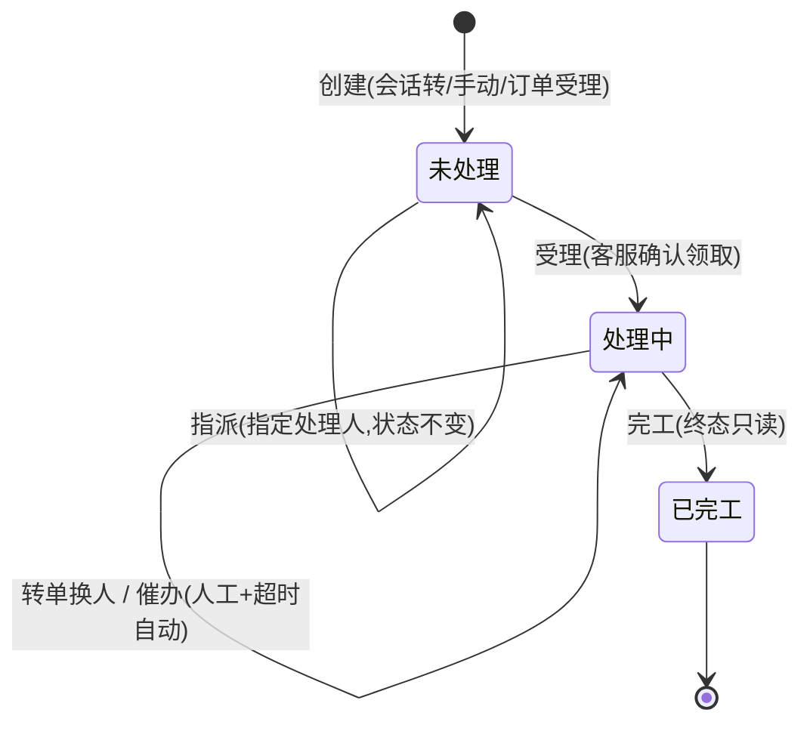
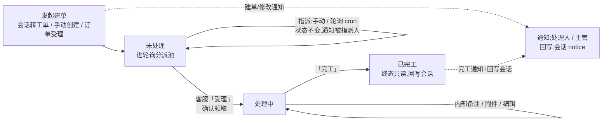
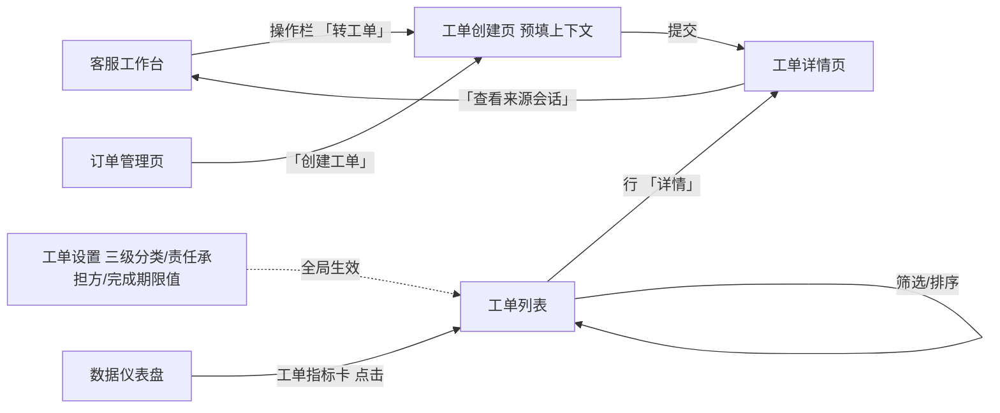
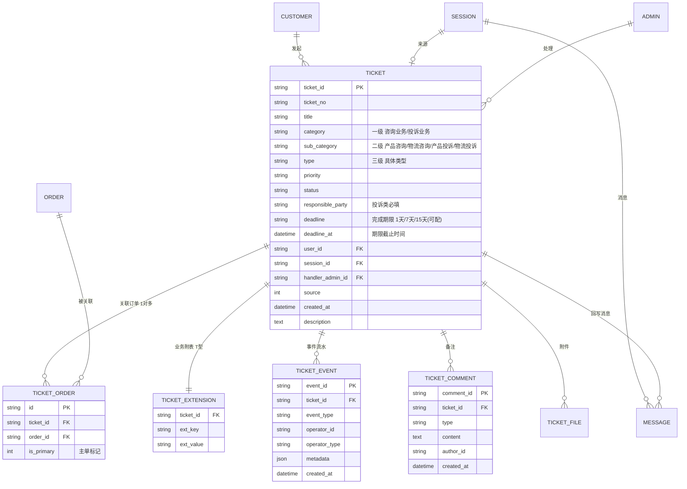
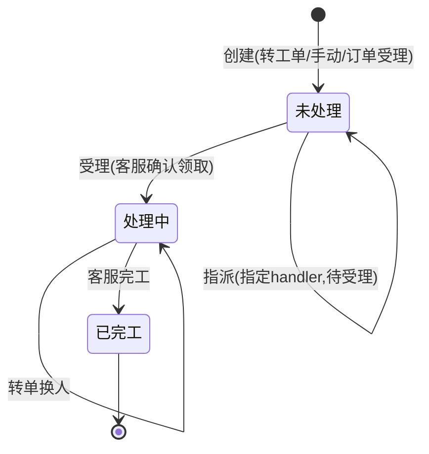

# PRD-客服工单-V0.5

> **⚠️ 已归档(2026-07-28)**:本稿已被 V0.6 取代(内容重整为干净版,需求口径不变),仅作历史参考。现行版本见 `../PRD-客服工单-V0.6.md`。

> **版本**: V0.5 | **日期**: 2026-07-22 | **状态**: 评审稿
>
> **原型目录**: `prototype-cs/admin/` (`admin-ticket.html` / `admin-ticket-create.html` / `admin-ticket-detail.html` / `admin-ticket-settings.html` / `admin-order-list.html` / `admin-workbench.html`)
>
> **依据**: 《商城客服工单需求-20260721.pptx》→《PPT转换-商城客服工单业务需求文档-V1.5.md》(BRD V1.5)、《7月21日09:16 面聊纪要》、《PRD-后台-V0.9.md》
>
> **V0.4 归档**: V0.4 已移至 `PRD/客服工单/archive/PRD-客服工单-V0.4.md`。
>
> **V0.4 → V0.5 关键调整(对齐 BRD V1.5 剩余差异)**:
> 33. **字段对齐 BRD §4.2**:恢复「新联系人/新移动电话/新座机电话/新联系地址」;座机拆回双字段;工单提交部门→必填;反馈方式→必填。移除 `handler_group`/`score`/`finished_at`。
> 34. **分类三级化**:`category`(一级 受理业务类型) + `sub_category`(二级 咨询/投诉类别) + `type`(三级 具体类型),对齐 BRD §4.4 三级树。
> 35. **完成期限代替 SLA**:新增 `deadline` 字段(1天/7天/15天,设置页可配);`deadline_at` 自动计算;列表/详情倒计时+超时标记;cron 每30分钟扫描+自动催办通知。
> 36. **新增「受理」操作**:指派后客服手动确认受理→状态变处理中;保持 3 态状态机。
> 37. **补充通知**:建单/修改时通知处理人(BR-150);超时自动通知处理人+主管(BR-161/162);完工记录不可修改强化。
> 38. **订单受理入口 1 期可用**:`admin-order-list.html` 已有「创建工单」按钮(行内)+「批量创建工单」按钮(工具栏,勾选多单合并为一张,不限制客户),创建方式③从 2 期转入 1 期。
> 39. **工作台同步调整**:`admin-workbench.html` 需同步新增「受理」操作入口 + 建单/转工单通知 + 右栏工单区;由工作台负责人另排,属 1 期范围(见 §零 0.15)。
>
> **V0.5 分类/责任/期限决策**:
> - 三级分类字典(一级一般不改,二级+三级可维护)后台可配;初始字典取自 BRD §4.4。
> - 责任承担方仅投诉类必填;选项可配(默认:宏兆 / 供应商 / 东莞邮政 / 昆山吉波)。
> - 完成期限:1天/7天/15天(可配),替换原 SLA 的时效管控。到期→超时标记+通知;完成后不可再改。
>
> **保留不变(沿用 V0.4)**:会话转工单(会话 end 联动)、3 态状态机(未处理 / 处理中 / 已完工)、工单分派(手动 + 轮询)、回写会话通知、操作日志(人 / 系统审计)、T 型数据模型、与 OMS 集成边界、工单内部处理(用户不可见)。
>
> **历史演进摘要(V0.3→V0.4,沿用)**:① 移除 SLA 时效与升级(含 `sla_response_due`/`sla_resolve_due`、`ticket_sla_config` 表、`ticketSLA` cron);② 工单管理 → **客服工单**(改名);③ 状态机 **3 态**(未处理 / 处理中 / 已完工),创建→未处理,已完工=终态;④ 删「重启」「沟通记录」timeline;⑤ 事件流水 → **操作日志**;⑥ 工单描述可编辑 + 保留历史版本;⑦ 回复改为跳转会话工作台,工单内仅留内部备注;⑧ 转单 = 转接工单;⑨ 工单设置独立页;⑩ 创建方式 3 种(会话转 / 手动 / 订单受理);⑪ 工单的会话必须是人工处理过的(accept / 有 admin_id)。

---

## 总览:工单状态机与操作流程(2026-07-27 补,详表见 §六.1 / §十一)

**总状态机**(3 态;指派不改状态,受理才流转,已完工=终态只读):



**总操作流程**(端到端:发起 → 分派 → 受理 → 处理 → 完工,全程通知/回写):



> 一句话口径:**创建即未处理;指派只定人不变状态;受理才进处理中;完工即终态,继续处理须新建工单。** 详细转换表(守卫条件/执行角色)见 §六.1,单据字段级流转见 §十一。

---

## 零、对存量系统的改动清单

> **原则**:客服工单是 OCS 客服后台 V0.9 的**迭代增量**。区分「新建」与「改动现有」。

| 序号 | 动作 | 对象 | 说明 |
|------|------|------|------|
| 0.1 | **新建表** | `customer_chat_tickets` | 工单主表(含 `category` / `sub_category` / `type` 三级 / `responsible_party` / `deadline` / `deadline_at`,见三.2.1) |
| 0.2 | **新建表** | `customer_chat_ticket_events` | 工单事件流水(操作日志) |
| 0.3 | **新建表** | `customer_chat_ticket_comments` | 工单备注(内部) |
| 0.4 | **新建表** | `customer_chat_ticket_extensions` | 工单业务附表(T 型:联系方式 / 订单快照 / 业务字段) |
| 0.5 | **新建表** | `customer_chat_ticket_orders` | **工单-订单关联表(1 对多)**(V0.4 新增,支持批量追加) |
| 0.6 | **改现有表** | `customer_chat_messages` | + `ticket_id varchar(32) NULL FK→tickets` |
| 0.7 | **改现有表** | `customer_chat_sessions` | + `ticket_id varchar(32) NULL FK→tickets` |
| 0.8 | **新建 API** | `/api/backend/ticket/*` | 工单 CRUD + 分派 + 受理 + 备注 + 催办 + 导出(见十二) |
| 0.9 | **改现有 API** | `/api/backend/session/end` | 结束原因枚举增加 `converted_to_ticket` |
| 0.10 | **扩展 cron** | `internal/cron/cron.go` | + `ticketAutoAssign`(每 1 分钟,轮询分派);+ `ticketDeadlineCheck`(每 30 分钟,到期扫标记+通知) |
| 0.11 | **新建页面** | `admin-ticket.html` | 工单列表页(状态分栏 + 三级分类筛选 + 完成期限筛选 + 倒计时列) |
| 0.12 | **新建页面** | `admin-ticket-detail.html` | 工单详情独立页(列表行「详情」进入;含催办 / 附件 / 倒计时 / 受理) |
| 0.13 | **扩展页面** | `admin-ticket-settings.html` | 工单设置页(三级分类 + 责任承担方 + 优先级 + **完成期限值** 增删改) |
| 0.14 | **扩展页面** | `admin-dashboard.html` | + 工单指标卡 |
| 0.15 | **改工作台** | `admin-workbench.html` | 操作栏 +「转工单」+「受理」按钮;右栏 +「该客户工单」区;**由工作台负责人另排,属 1 期范围** |
| 0.16 | **已就绪(1 期)** | `admin-order-list.html` | 订单列表「创建工单」(行内)/「批量创建工单」(工具栏)→建单入口(创建方式③,已在原型实现) |
| 0.17 | **新建页面** | `admin-ticket-create.html` | 工单创建独立页(standalone / order / batch 三模式,预填会话或订单上下文;三级分类级联 + 批量追加订单) |

> 相比 V0.4:主表 `category`+`sub_category`+`type` 三级化;新增 `deadline`/`deadline_at`;移除 `handler_group`/`score`/`finished_at`;设置页承载三级分类+责任承担方+优先级+完成期限值配置。

---

## 一、范围边界

| 范围 | 内容 |
|------|------|
| **In Scope (1 期)** | 工单列表与查询 / 工单详情与处理 / **会话转工单** / 工单分派(手动 + 轮询) / **「受理」操作** / 工单回写会话通知 / **三级分类 + 责任承担方配置** / **受理字段族 + 订单自动带出** / **批量追加订单(1 对多)** / **催办** / **附件上传** / **完成期限+倒计时+超时通知** / 仪表盘扩展工单指标卡 / **订单列表页「受理」建单** / **工作台工单入口同步**(由工作台负责人另排) |
| **Out Scope(本期不做)** | **消费者侧自助提交工单**(2 期);**触发式自动建单 / AI 智能建单**(2 / 3 期);**规则型分配**(按类型 / 项目 / 客户等级 / 技能,2 期);轮次响应 / 关单确认 / 母子工单 / 审批 / 技能组分派 / 流转触发器 / 完整报表 / OMS 深度集成(退款退货换货直连) |

> **定位**:客服工单是 OCS 客服后台 **V0.9 的迭代增量**,在已有会话 / 客户 / 通知 / 角色基础设施上,增加「工单」事务实体 + 会话协同接口。会话解决即时问题,工单承接需跨部门 / 需订单系统操作的售后问题(退款 / 退货 / 换货 / 投诉 / 补发 / 价格干预)。
>
> **本期工单为内部处理,用户不可见**(消费者自助建单 2 期)。V0.5 以完成期限(1天/7天/15天,设置页可配)代替 SLA,到期倒计时提醒 + 超时自动标记 + 通知处理人与主管 + 人工催办。

### 一.1 角色列表

| 代号 | 角色 | 客服工单职责 |
|------|------|-------------|
| R-A | 客服 | 会话转工单、处理工单、受理、内部备注、转单、催办、回复用户(跳工作台)、完工、上传附件 |
| R-S | 客服主管 | 查看全部工单、工单分类 / 责任承担方 / 完成期限值配置、催促跟进、催办;2 期含审批 |
| R-C | 终端用户 | (本期工单为内部处理,用户不可见,无操作;消费者自助建单 2 期) |
| R-SYS | 系统 | 轮询自动分派、状态自动流转、回写会话通知、建单/修改通知、超时扫描通知 |

> **审计口径**(沿用 ADR-0001):工单每次状态迁移通过 `ticket_event` 记录,`operator_type` 区分 `admin` / `customer` / `system`。
>
> **数据可见性**(沿用 ADR-0002):R-A 仅见分配给自己的工单;R-S 见全部。

---

## 二、页面清单

| 序号 | 页面名称 | 文件名 | 状态 | 说明 |
|------|----------|--------|------|------|
| 1 | 工单列表 | admin-ticket.html | ✅ 已建 | 客服工单(独立一级菜单,状态分栏 + 三级分类筛选 + 完成期限筛选 + 倒计时列) |
| 2 | 工单详情 | admin-ticket-detail.html | ✅ 已建 | 独立页(列表行「详情」进入),含催办 / 附件 / 倒计时 / 受理 / 新联系字段 |
| 3 | 工单创建 | admin-ticket-create.html | ✅ 已建 | 独立建单页(standalone / order / batch 三模式,预填上下文) |
| 4 | 工单设置 | admin-ticket-settings.html | ✅ 已建 | 三级分类 + 责任承担方 + 优先级 + 完成期限值 增删改 |
| 5 | 订单列表 | admin-order-list.html | ✅ 已建 | 订单「创建工单」(行内)/「批量创建工单」(工具栏)→建单入口(1 期可用) |
| 6 | 客服工作台 | admin-workbench.html | 🔧 改现有 | 操作栏 +「转工单」+「受理」;右栏 +「该客户工单」区;**由工作台负责人另排** |

### 二.1 页面跳转关系



> 工单列表 / 工单创建 / 工单详情均为独立页;工单设置归属「客服设置」。订单管理页「创建工单」建单入口已就绪(admin-order-list.html)。**工单列表属「订单与售后」模块**(2026-07-27 六轮):页面骨架 = 商城运营后台(顶栏 + 自有侧边栏 + 页签),与订单列表互跳;侧边栏「订单与售后」分组内顺序 = 订单列表 → 客服工单。

---

## 三、实体关系总览

### 三.1 核心实体 ER 图



> 相比 V0.4:① TICKET 主表 `category`+`type`(两级)拆为 **`category`(一级)+ `sub_category`(二级)+ `type`(三级)**,对齐 BRD §4.4;② 新增 **`deadline`/`deadline_at`**(完成期限代替 SLA);③ 移除 `handler_group`(处理组)/`score`(评分)/`finished_at`(完工时间,走 event 流水记录)。其余不变。

### 三.2 字段说明

#### 三.2.1 工单主表 (`customer_chat_tickets`)

| 序号 | 字段名 | 显示名 | 类型 | 必填 | 校验 / 默认 | 来源 / 口径 |
|------|--------|--------|------|------|-----------|-----------|
| 1 | ticket_id | 工单 ID | varchar(32) PK | 是 | 系统生成 | 系统生成 |
| 2 | ticket_no | 受理编号 | varchar(32) UK | 是 | `#TK` + yyyyMMdd + 6 位序号 | 系统生成;创建后不可修改(BRD §4.2) |
| 3 | category | 受理业务类型(一级) | varchar(10) | 是 | 咨询业务 / 投诉业务 | 创建时选(见三.3) |
| 4 | sub_category | 咨询/投诉类别(二级) | varchar(20) | 是 | 联动一级:产品咨询/物流咨询/产品投诉/物流投诉(BRD §4.4 字典) | 创建时选(见三.3) |
| 5 | type | 具体咨询/投诉类型(三级) | varchar(30) | 是 | 联动二级(BRD §4.4 字典,可后台增删改) | 创建时选(见三.3) |
| 6 | priority | 优先级(紧急程度) | varchar(10) | 否 | 一般 / 紧急 / 特急 | 创建时选(可配,见十.2;分类/排序用,不驱动 SLA) |
| 7 | status | 工单状态 | varchar(20) | 是 | 未处理 / 处理中 / 已完工,默认「未处理」 | 状态机流转 |
| 8 | responsible_party | 责任承担方 | varchar(30) | 投诉类必填 | 宏兆 / 供应商 / 东莞邮政 / 昆山吉波(可配) | 投诉类创建时必选(见三.3) |
| 9 | deadline | 完成期限 | varchar(10) | 否 | 1天 / 7天 / 15天(设置页可配) | 创建时选;驱动 deadline_at |
| 10 | deadline_at | 期限截止时间 | datetime | 否 | `created_at` + deadline 时长 | 系统自动计算;用于倒计时展示 + 超时扫描 |
| 11 | user_id | 客户 ID | varchar(32) | 否 | FK → CUSTOMER | 会话 / 订单建单自动绑定;手动创建 1 期不强制选客户(可通过关联订单 / 联系方式追溯,2026-07-24 三轮定) |
| 12 | session_id | 来源会话 ID | varchar(32) | 否 | FK → SESSION | 会话转工单时写入(人工处理过的会话) |
| 13 | handler_admin_id | 处理人 | varchar(32) | 否 | FK → ADMIN | 指派时写入 |
| 14 | source | 来源 | tinyint | 是 | 0=用户 / 1=客服 / 2=系统 / 3=订单受理 | 创建时确定(会话转工单 / 手动创建=客服;从订单受理创建=订单受理) |
| 15 | created_at | 受理时间 | datetime | 是 | 系统时间,精确到秒 | 系统自动;不可修改(BRD §4.2) |
| 16 | description | 工单描述(受理内容) | text | 否 | — | 创建时填写;详情可编辑,保留历史版本 |

> 相比 V0.4:① `category`+`type`(两级)→ **`category`+`sub_category`+`type`(三级)**,一级用词对齐 BRD「咨询业务/投诉业务」;② 新增 **`deadline`/`deadline_at`**(完成期限代替 SLA);③ 移除 `handler_group`(处理组,BRD 无对应字段)、`score`(评分,本期不实现,BRD 无)、`finished_at`(完工时间走 event 流水记录);④ **移除 `title`**(2026-07-27 五轮:三轮曾定「系统生成三级类型+工单号」,五轮确认该字段无存在必要,列表/详情/通知均不再出现标题)。**无 SLA 字段**(沿用 V0.3)。
>
> **BRD §4.2 字段落位**:受理编号 / 受理时间(不可改)= 序号 2 / 15;受理人 = 序号 13(handler);紧急程度 = 序号 6;受理业务类型 / 类别 / 类型 = 序号 3 / 4 / 5;责任承担方 = 序号 8;完成期限 = 序号 9;受理内容 = 序号 16。其余联系方式 / 订单 / 业务字段落 `extension`(三.2.6)。

#### 三.2.2 ~ 三.2.5(事件流水 / 备注 / MESSAGE 扩展 / SESSION 扩展)

沿用 V0.4,新增事件类型:
- `customer_chat_ticket_events`:`ticket.created` / `ticket.assigned` / `ticket.accepted`(V0.5 新增) / `ticket.edited`(V0.5 新增,编辑工单信息:字段级旧值→新值,UC-TL-06) / `ticket.replied` / `ticket.transferred` / `ticket.reminded`(催办) / `ticket.overdue`(V0.5 新增,超时标记) / `ticket.finished`。`operator_type` = admin / customer / system。**所有 event 记录不可修改、不可删除。**
- `customer_chat_ticket_comments`:internal(内部)。
- MESSAGE + `ticket_id`(回写消息可追溯)。
- SESSION + `ticket_id`(转工单标记 + 反向跳转)。

#### 三.2.6 业务附表 (`customer_chat_ticket_extensions`)字段清单 — V0.5 对齐 BRD

> T 型扩展表(`ext_key` / `ext_value`)承载 BRD §4.2 / §4.3 的受理字段与订单快照。**V0.5 对齐 BRD,恢复全部联系字段变体。**

| 分组 | ext_key | 说明 | 来源 |
|------|---------|------|------|
| **联系方式** | contact_name | 联系人(默认取订单收货人,可改;示例为收货人姓名) | BRD §4.2 |
| | contact_phone | 移动电话(默认取收货号码,可改) | BRD §4.2 |
| | contact_address | 联系地址(默认取收货地址,可改) | BRD §4.2 |
| | incoming_call | 来电电话(人工录入) | BRD §4.2 |
| | new_contact_name | 新联系人(收货人以外的实际联系人,人工录入) | BRD §4.2 |
| | new_contact_phone | 新移动电话(人工录入) | BRD §4.2 |
| | new_contact_tel | 新座机电话(人工录入) | BRD §4.2 |
| | new_contact_address | 新联系地址(人工录入) | BRD §4.2 |
| **业务字段** | enterprise_name | 企业名称(**必填**;订单 / 会话建单自动带出,手工建单下拉选择;2026-07-28 十三轮:替代原「项目名称」) | BRD §4.2 / §4.3 |
| | mall | 品牌商城(**必填**;同 enterprise_name,来源与订单「所属商城」一致) | BRD §4.2 / §4.3 |
| | feedback_method | 反馈方式(**必填**:电话 / 在线客服会话 / 短信 / 业务口 / 合作商平台 / 合作商邮件;2026-07-28 补「在线客服会话」) | BRD §4.2 |
| | is_secondary_complaint | 是否二次投诉(是 / 否) | BRD §4.2 |
| | submit_dept | 工单提交部门(**必填**:客服部 / 商品部 / 商务部) | BRD §4.2 |
| **订单快照** | order_snapshot | 建单时自动带入的订单信息 JSON(平台 / 主子单号 / 下单时间 / SKU / 商品名 / 数量 / 金额 / 支付方式 / 供应商 / 收货人 / 收货电话 / 收货地址 / 企业名称 / 品牌商城) | BRD §4.3 |

> 订单的**1 对多关联**走 `TICKET_ORDER` 表(三.1);`order_snapshot` 仅存建单时刻主单快照供详情展示与留痕。

### 三.3 工单分类体系(三级)与责任承担方

> 对齐 BRD §4.4 三级树:一级「受理业务类型」+ 二级「咨询/投诉类别」+ 三级「具体咨询/投诉类型」。分类字典后台可配(设置页)。

```
受理业务类型(一级 category)
├── 咨询业务(category=咨询业务)
│   ├── 产品咨询(sub_category=产品咨询)
│   │   └── 具体类型(type):产品信息 / 操作使用 / 售后网点 / 产品原因更换 / 产品原因退货 / 缺货更换 / 缺货取消 / 开具发票 / 其他
│   └── 物流咨询(sub_category=物流咨询)
│       └── 具体类型(type):配送情况 / 更改配送地址 / 客户原因取消配送 / 客户原因重新配送 / 物流原因取消配送 / 物流原因重新配送 / 商务导单错误 / 其他
└── 投诉业务(category=投诉业务)  ← 投诉类必填「责任承担方」
    ├── 产品投诉(sub_category=产品投诉)
    │   └── 具体类型(type):产品原因更换 / 产品原因退货 / 返修 / 补配件 / 缺货超时未收到 / 补偿 / 其他
    │        责任承担方:宏兆 / 供应商 / 东莞邮政 / 昆山吉波
    └── 物流投诉(sub_category=物流投诉)
        └── 具体类型(type):超时未收到 / 否认签收 / 少货 / 错货 / 物流破损更换 / 物流破损退货 / 丢失 / 其他
             责任承担方:宏兆 / 供应商 / 东莞邮政 / 昆山吉波
```

| 规则 | 说明 |
|------|------|
| 一级 | 咨询业务 / 投诉业务(必选,枚举,一般不改) |
| 二级 | 联动一级:产品咨询 / 物流咨询 / 产品投诉 / 物流投诉(必选,可后台增删改) |
| 三级 | 联动二级,具体类型(BRD §4.4 字典,可后台增删改) |
| 责任承担方 | **仅投诉类必填**;选项可配(默认宏兆 / 供应商 / 东莞邮政 / 昆山吉波) |
| 查询筛选 | 三级联动(如「投诉业务 → 物流投诉 → 物流破损退货」) |
| 字典维护 | 设置页增删改(见十.2),分类字典需业务方维护责任(见十六) |

---

## 四、工单列表与查询(代号:TL)

工单查询页。状态分栏 + 多维筛选 + 操作入口。R-A 仅见自己的工单,R-S 见全部。

- **入口**: 客服工单(独立一级菜单)
- **关键元素**: 状态分栏(未处理 / 处理中 / 已完工 + 全部)、统计摘要条(4 项)、筛选条(**关联订单号** / **联系人** / **联系人手机号** / **来电手机号** / 受理客服 / 工单类型三级联动 / 完成期限 / 优先级 / 状态 / 处理人 / **SKU物流编码** / **商品名称** / **企业名称** / **品牌商城** / 日期;2026-07-27 五轮:前 4 项提前,联系人/手机号拆为两个独立条件,「来电号码」正名「来电手机号」,SKU物流编码为**单一字段**;2026-07-28 十三轮:「项目名称」替换为「企业名称(模糊)+ 品牌商城(下拉)」)、数据表格(行勾选)、导出(弹窗)
- **使用角色**: R-A / R-S

### 四.1 功能用例与验收

| UC 编号 | 用例名称 | 角色 | 说明 |
|---------|---------|------|------|
| UC-TL-01 | 状态分栏 + 统计摘要 | R-A | 分栏:未处理 / 处理中 / 已完工 / 全部;4 项统计:工单总数 / 未处理 / 处理中 / 今日完工 |
| UC-TL-02 | 筛选查询 | R-A | **关联订单号** / **联系人** / **联系人手机号** / **来电手机号** / 受理客服 / **工单类型(三级联动)** / **完成期限** / 优先级 / 状态 / 处理人 / **SKU物流编码(单一字段)** / **商品名称** / **企业名称** / **品牌商城(下拉)** / 日期 组合过滤(2026-07-27 五轮:联系人/手机号拆两条件,顺序对齐高频查询;2026-07-28 十三轮:项目名称→企业名称+品牌商城) |
| UC-TL-03 | 查看详情 | R-A | 行「详情」打开详情页 |
| UC-TL-04 | 导出 | R-S | 点击「导出」弹窗选范围:**① 导出勾选数据**(列表行勾选,含全选;未勾选时禁用)/ **② 导出查询结果数据**(当前筛选结果);仅主管可见可用;导出 Excel(财务对账 / 运营复盘,BRD §4.12) |
| UC-TL-05 | 修改来源会话 | R-A | 行「来源」点击 → 内联编辑会话 ID(关联 / 修改 / 清除);**后端校验:关联会话须为人工处理过的(accept 过 / 有 admin_id)** |
| UC-TL-06 | 编辑工单信息 | R-A | 行「编辑」→ 抽屉改单(三级分类 / 责任承担方 / 优先级 / 完成期限 / 联系方式 / 业务字段);**已完工终态不可改**;改完成期限按修改时刻 + 新期限重算截止;改为投诉类必校验责任承担方;写操作日志(字段级旧值→新值);详情页元信息卡同一入口;编辑 / 创建 / 详情三处排版一致(分区 + 标签左置),降低学习成本;**业务字段(企业名称 / 品牌商城 / 反馈方式 / 提交部门 / 二次投诉)并入「基本信息」分区,不再单独成区(2026-07-24 四轮;07-28 十三轮项目名称拆为企业名称+品牌商城)** |

> 相比 V0.4:① 筛选从两级→**三级联动**;② 增加**完成期限筛选**;③ 列表增加**倒计时列**。

### 四.2 数据字段(列表列)

| 字段 | 取值 | 说明 |
|------|------|------|
| 工单号 | `#TK` + yyyyMMdd + 序号 | col-id |
| 受理业务类型 | 一级(投诉业务 / 咨询业务) | 2026-07-24 四轮:类型由「一列三行」**拆为 3 列**(对齐旧系统分列习惯),列宽更省 |
| 咨询/投诉类别 | 二级(物流投诉 / 产品咨询 / …) | 同上,独立列 |
| 具体类型 | 三级(物流破损退货 / 补配件 / …) | 同上,独立列 |
| 优先级 | 一般 / 紧急 / 特急 | tag,紧急红色 |
| 责任承担方 | 宏兆 / 供应商 / …(投诉类) | 投诉类显示;黑色普通字(不用彩色 tag) |
| 剩余时间 / 完成期限 | 首行剩余时间(超时红字不加粗)/ 次行灰字完成期限 | 合并列;倒计时;超时以首行红字提示(行不做整行高亮) |
| 状态 | 未处理 / 处理中 / 已完工 | s-tag |
| 受理时间 | 工单创建时间(= `created_at`,BRD「受理时间」) | **默认降序(新→旧),点击表头切换升序,再点切回**;图标 ▲ 升 / ▼ 降(2026-07-24 四轮新增,07-27 定默认序;**07-27 六轮:与「来源类型」列互换位置**,移至状态列后) |
| 关联订单 | 主单 ID / 多单「+N」 | 点击跳订单列表页并按该主订单号搜索定位(八轮起,不再弹窗);1 对多 |
| 联系人/手机号 | 联系人姓名 + 手机号(**列表脱敏展示**(如 138****2891),**详情不脱敏**——2026-07-27 六轮:数据口径按订单列表规则,推翻四轮「全号不脱敏」;筛选仍可按全号匹配。列名由「客户」改「联系人/手机号」,展示 = 工单联系人(默认取订单收货人),非 CUSTOMER 昵称;2026-07-27 定) | 不显示头像 |
| 处理人 / 更新时间 | 处理人 + 更新时间(合并列,处理人 / 「未分配」) | — |
| 来源类型 | 订单 / 会话 / 客服工单 | 显示类型 + 具体单号或会话 ID;客服工单显示「-」;会话类点击可编辑(关联 / 修改 / 清除)(07-27 六轮:与「受理时间」列互换,移至操作列前) |
| 操作 | 详情 / 编辑(非终态,UC-TL-06)/ 回复(跳工作台) / **受理**(未处理+已分配) / 转单 / 催办 / 指派(未处理+未分配) | 按状态 + 角色显示;**完工在详情页底部(非行操作,对齐六.2)** |

> 相比 V0.4:类型列→三级(四轮再拆为 3 个独立列);补**完成期限列+剩余时间(倒计时)列**;补**受理时间列(可排序)**;客户列手机号**列表脱敏展示、详情不脱敏**(2026-07-27 六轮按订单列表口径);行操作补**受理**(有 handler 未受理时显示);移除 handler_group/score/finished_at 列(字段已删)。

---

## 五、工单创建(代号:CT)— 核心模块

客服把需异步跟进的售后问题创建为工单,带上下文建单,处理后回写会话通知用户。

- **入口**: 客服工作台 > 会话操作栏「转工单」/ 工单列表「创建工单」/ 订单管理页「创建工单」
- **使用角色**: R-A(创建)、R-SYS(回写通知)

### 五.1 创建方式(3 种)

| 方式 | 入口 | 说明 |
|------|------|------|
| ① 会话转工单 | 工作台会话操作栏「转工单」 | **人工处理过的会话(accept / 有 admin_id)**点「转工单」,建单页预填上下文(客户 + 订单 + 消息摘要);机器人 / 排队 / 留言等未人工处理的会话不可转 |
| ② 手动创建 | 工单列表「创建工单」 | **自定义来源**(客服创建 / 电话 / 邮件 / 线下其他)+ 选订单(可选,按客户查;支持批量追加)+ 填写;无 session_id;**1 期不强制绑定客户**(可通过关联订单 / 联系方式追溯) |
| ③ 从订单受理创建 | 订单管理页「创建工单」(行内)/「批量创建工单」(工具栏,多单合并一张,不限制客户) | 基于订单建单,自动带出商品 / 收货 / 企业名称 / 品牌商城;admin-order-list.html 入口已就绪 |

> 消费者侧自助提交工单(BRD BR-110/111)= **2 期**,本期不做。

### 五.2 订单信息自动关联(自动带出)— BRD §4.3

建单时(方式①②③)若关联订单,系统自动带入以下信息(落 `extension.order_snapshot` + `TICKET_ORDER`):

| 编号 | 自动带入 |
|------|---------|
| BR-130 | 平台、企业名称、品牌商城 |
| BR-131 | 收货人姓名、电话、地址 |
| BR-132 | 主订单号、子订单号、下单时间、商品 SKU(编码)、商品名称、数量 |
| BR-133 | 订单金额、支付方式 |
| BR-134 | 供应商名称 / 供应商商品信息 |
| BR-135 | 同一手机号多个订单 → 手机号搜索全量订单 → **批量追加(1 对多)**(见五.3) |
| **BR-136** | **关联订单区展示列(建单页 / 详情页):主订单号 / 子订单号 / 商品编码(SKU) / 商品名称 / 数量 / 供应商名称(另保留金额 / 状态列);手动追加的订单仅有单号,其余列显示「-」(OMS 字段待对接)** |

### 五.3 批量追加订单(1 对多)— V0.4 新增

| UC 编号 | 用例 | 说明 |
|---------|------|------|
| UC-CT-10 | 批量追加订单 | 建单 / 处理中,通过客户手机号搜索其全部订单 → 全选多单 → 批量加入工单(工单-订单 1 对多,`TICKET_ORDER`);无需逐个输入订单号 |
| UC-CT-11 | 手动追加单订单 | 输入具体订单号追加(适用于无手机号 / 老订单场景) |

> 主单 `is_primary=1`,其余 `is_primary=0`。

#### 五.3.1 关联订单弹窗交互(2026-07-27 九轮定稿)

- **形态**:**居中普通弹窗**(原右侧抽屉,九轮改;宽约 960px,遮罩点击 / ESC / × 可关)。
- **结构**:顶部**筛选区** + 中部**结果列表** + 底部操作栏。
- **筛选区(2026-07-27 十轮:单关键词框拆为多字段组件)**:6 个筛选组件——**主订单号**(兼容子订单号模糊)/ **商品编码**(SKU/物流编码)/ **商品名称** / **供应商名称** / **收货手机号** 5 个输入框 + **订单状态**下拉(全部/待发货/运输中/已签收/已完成/已取消);多条件 **AND** 组合,「查询」按钮 / 回车触发,「重置」清空全部条件恢复全量。
- **列表(非卡片式)**:数据表格,首列为**勾选列**(表头勾选框 = 全选 / 全不选**当前页**),其余列与关联订单卡片(BR-136)完全一致:**主订单号 / 子订单号 / 商品编码 / 商品名称 / 数量 / 供应商名称 / 金额 / 状态**;整行点击与点勾选框等效切换选中,选中行蓝底高亮(不再用右上角 ✓ 图标,避免遮挡信息);列表区固定高度、表头吸顶。
- **分页(2026-07-27 十一轮新增)**:**5 条/页**,表格下方右对齐分页条(共 N 条 + 上一页/页码/下一页,末页下一页置灰);查询 / 重置 / 回车触发条件变化时**自动回第 1 页**;勾选项**跨页保留**(全选仅作用当前页,与工单列表口径一致)。
- **已选保留**:勾选项跨查询 / 翻关键词不丢失;底部左侧实时显示「已选 N 单」,确认按钮显示「确认关联(N)」,未选时禁用。
- **确认**:按主订单号**去重**追加到工单关联订单区(已关联的重复单自动跳过),空结果提示「未找到匹配订单」。

### 五.4 会话状态联动与回写

| UC 编号 | 用例 | 说明 |
|---------|------|------|
| UC-CT-04 | 会话状态联动 | 会话转工单后**会话自动结束**(`end`),结束原因 `converted_to_ticket` |
| UC-CT-05 | 工单回写会话 | 工单状态变更 → 向来源会话推系统消息(`notice`)通知用户 |

---

## 六、工单详情与处理(代号:TD)

工单详情页:基本信息 + 状态流转 + 内部备注 + 操作日志 + 来源会话 + 附件 + 倒计时。工单描述可编辑(保留历史版本);回复用户跳转会话工作台。

- **入口**: 工单列表「详情」/ 工作台「转工单」后
- **使用角色**: R-A(处理)、R-S(查看全部)

### 六.1 工单状态机



| 当前状态 | 目标状态 | 触发动作 | 守卫条件 | 执行角色 | 1期/2期 |
|----------|----------|----------|----------|----------|---------|
| — | 未处理 | 转工单 / 手动创建 / 订单受理 | — | R-A / R-C | ✅ 1 期 |
| 未处理 | 未处理 | 指派 | 指定 handler_admin_id | R-A / R-SYS | ✅ 1 期 |
| 未处理 | 处理中 | 受理 | handler 匹配当前用户 | R-A | ✅ 1 期(V0.5 新增) |
| 处理中 | 处理中 | 转单 | 换 handler | R-A | ✅ 1 期 |
| 处理中 | 已完工 | 客服完工 | — | R-A | ✅ 1 期 |

> 3 态(未处理 / 处理中 / 已完工)。指派仅在未处理态指定 handler,不改变状态;受理=客服确认领取→状态变处理中。已完工为终态,不可操作,继续处理需新建工单。

### 六.2 功能用例与验收(UC-TD / AC-TD)

沿用 V0.4 并修订:查看详情 / 指派 / 转单 / 受理 / 内部备注 / 状态变更 / 查看来源会话 / 完工。**V0.5 新增**:受理;完成期限倒计时。已完工为终态,不可操作。

| UC 编号 | 用例名称 | 角色 | 说明 |
|---------|---------|------|------|
| UC-TD-07 | 完工 | R-A | 处理中态点「完工」→ 已完工(终态,不可操作) |
| UC-TD-08 | 编辑描述 | R-A | 详情「编辑」→ 改描述 → 保存为新版本(旧版本归档) |
| UC-TD-09 | 查看描述历史 | R-A | 详情「历史版本」→ 展开各版本(时间 / 操作人 / 内容) |
| UC-TD-10 | 回复用户 | R-A | 点「回复用户」→ 跳转会话工作台(在会话里回复,非工单内留言) |
| UC-TD-11 | 添加内部备注 | R-A | 工单内添加内部备注(仅客服可见,不回写会话);**录入结果清晰可见**(纪要点 6) |
| **UC-TD-12** | **催办** | R-A / R-S / **R-SYS** | 对处理中工单催办(人工催办写 `ticket.reminded` + 站内通知处理人;**超时工单系统自动催办**) |
| **UC-TD-13** | **附件 / 追加材料** | R-A | 详情上传附件 / 处理后追加材料(`TICKET_FILE`);处理记录不可改,附件只增 |
| **UC-TD-14** | **受理** | R-A | 未处理+已分配 → 客服点击「受理」确认领取 → 状态变处理中(写 `ticket.accepted`) |
| **UC-TD-15** | **编辑工单信息** | R-A | 元信息卡「编辑」→ 同 UC-TL-06 编辑抽屉;已完工终态入口隐藏;保存写操作日志 |

> 相比 V0.4:新增 UC-TD-14 受理;催办扩展为人工+系统双触发(超时自动)。状态操作按钮集中详情页底部。**操作日志每条 = 时间 + 操作内容 + 操作账号(姓名)+ 角色(客服 / 主管 / 系统)**,不再仅标「人 / 系统」(2026-07-27 五轮;数据层仍 `operator_type`=admin/customer/system,展示层按账号角色渲染)。

---

## 七、工单分派(代号:AS)

1 期:手动指派 + 轮询自动分派。**指派不改变状态(留在未处理),受理后才变处理中。** 2 期:规则型分派(按类型 / 项目 / 客户等级 / 负载 / 技能)。

- **使用角色**: R-A(指派 / 受理 / 转单)、R-SYS(自动分派、超时扫描)
- **cron 调度**: 轮询自动分派每 **1 分钟**扫描未处理无 handler 的工单;**超时扫描每 30 分钟**扫描 deadline_at < now 且未完工工单

### 七.1 功能用例与验收(UC-AS / AC-AS)

沿用 V0.4:手动指派 / 轮询自动分派(跳过满载,全满载进待分配池通知主管)/ 转单(带审计)。V0.5 新增:受理(指派后客服手动确认)、超时自动通知。

> BRD §4.5 规则型分配(退款→售后组、物流投诉→物流组、VIP 优先、负载均衡、技能匹配)= **2 期**;多规则命中优先级待评审(BRD Open Issue #2)。

---

## 八、工单回写与通知(代号:RB)

工单状态变更回写来源会话(若有 `session_id`),通知用户;建单/修改/超时通知处理人与主管,形成闭环。

- **使用角色**: R-SYS

### 八.1 功能用例与验收

| UC 编号 | 用例名称 | 角色 | 说明 |
|---------|---------|------|------|
| UC-RB-01 | 状态回写 | R-SYS | 处理中 / 已完工 → 来源会话推 `notice` 消息 |
| UC-RB-02 | (本期不做) | — | 对客回复走「回复用户」跳工作台,工单内不做对客消息回写 |
| **UC-RB-03** | **超时通知** | R-SYS | deadline_at 到期/已超 → 标记工单超时 + 站内通知处理人 + 通知主管(BRD BR-161/162) |
| **UC-RB-04** | **建单通知** | R-SYS | 新建工单(尤其带指派) → 站内通知处理人(BRD BR-150) |
| **UC-RB-05** | **修改通知** | R-SYS | 工单内容修改 → 站内通知处理人(BRD BR-150) |

**验收标准(AC-RB)**

| AC 编号 | 验收标准 | 对应 | Given | When | Then |
|---------|---------|:----:|-------|------|------|
| AC-RB-01 | 回写消息可追溯 | UC-RB-01 | 工单 session_id 存在 | 状态变更 | 向会话推 `type=notice` 消息(MESSAGE.ticket_id=工单ID),用户端可见 |
| AC-RB-02 | 无来源会话 | UC-RB-01 | session_id 为空 | 状态变更 | 跳过回写,仅站内通知处理人 |
| AC-RB-03 | 超时自动通知 | UC-RB-03 | deadline_at < now 且 status≠已完工 | cron 扫描 | 标记超时 + 通知处理人 + 通知主管 |

> 完结消息卡片通知客户(BRD BR-151)= **随消费者自助建单 2 期**,本期不做。

---

## 九、工单评价(代号:TE)

**本期不实现**(工单为内部处理,用户不可见,无评价)。V0.5 已移除 `score` 字段(主表不保留),2 期如需用户评价再新增。

---

## 十、工单报表与配置(代号:RP / CF)

### 十.1 工单报表(RP)

扩展现有数据仪表盘(`admin-dashboard.html`),新增工单指标卡。

| 指标 | 口径 |
|------|------|
| 工单量 | 时段内新建工单数(按类型 / 优先级分类) |
| 平均处理时长 | `finished_at`(event) − `created_at` 均值 |
| 客服工单绩效 | 处理量 / 平均时长,按 handler_admin_id 聚合 |
| 超期工单数 | deadline_at < now 且未完工的工单数 |

### 十.2 工单配置(CF)

`admin-ticket-settings.html`,三级分类 + 责任承担方 + 优先级 + 完成期限值 增删改(含数量显示)。

| 配置 | 说明 | 存储 |
|------|------|------|
| 一级分类 | 咨询业务 / 投诉业务(枚举,一般不改) | `customer_chat_settings` |
| 二级类别 | 增删改类别(联动一级:产品咨询/物流咨询/产品投诉/物流投诉) | 同上 |
| 三级类型 | 增删改具体类型(联动二级,BRD §4.4 字典) | 同上 |
| 责任承担方 | 增删改(宏兆 / 供应商 / 东莞邮政 / 昆山吉波;投诉类用) | 同上 |
| 优先级 | 增删改(一般 / 紧急 / 特急) | 同上 |
| 完成期限值 | 增删改(默认:1天 / 7天 / 15天,可自定义天数) | 同上 |
| 数量展示 | 各分类 / 责任方 / 优先级 / 完成期限 显示当前工单数量(只读统计) | 实时聚合 |

> 相比 V0.4:配置从「两级分类 + 责任承担方 + 优先级」扩为「**三级分类 + 责任承担方 + 优先级 + 完成期限值**」。
>
> 菜单入口(2026-07-27 十轮):**商城运营后台侧栏「系统设置 > 工单配置」**(原客服模块「客服设置 > 工单设置」撤下;客服工单属订单与售后模块,其配置归系统设置)。

---

## 十一、单据流转

### 十一.1 工单单(`customer_chat_tickets`)

| 阶段 | 触发 | 字段变更 | 关联动作 |
|------|------|----------|----------|
| 创建 | 会话转工单 / 手动创建 / 订单受理 | ticket_id / ticket_no / category / sub_category / type / priority / responsible_party(投诉类) / deadline / deadline_at / **status=未处理** / user_id / TICKET_ORDER / session_id / source / created_at / extension(联系方式+订单快照) | 写 `ticket.created`;若 session_id则会话 end(reason=converted_to_ticket)+ticket_id;进轮询分派池;若带指派则建单通知处理人 |
| 指派 | 手动 / 轮询 cron | handler_admin_id(**状态不改变,仍为未处理**) | 写 `ticket.assigned`;通知被指派人 |
| 受理 | 客服确认领取 | **status=处理中** | 写 `ticket.accepted`(V0.5 新增) |
| 催办 | 人工(R-A/R-S) / 系统(auto:deadline_at<now) | — | 写 `ticket.reminded` + 站内通知处理人;超时→附加 `ticket.overdue` |
| 超时 | cron 扫描 deadline_at < now且未完工 | 超时标记 | 写 `ticket.overdue` + 通知处理人 + 通知主管 |
| 完工 | 客服完工 | **status=已完工** | 回写会话 notice;**终态,不可操作,继续需新建工单**;已完工工单不再参与超时扫描 |

> 对齐 3 态状态机(六.1):创建→未处理;指派→未处理(有 handler);受理→处理中;已完工=终态。**所有 event 记录不可修改、不可删除。** 无「待回复 / 阻塞 / 重启 / 关闭」阶段。

---

## 十二、接口时序

### 十二.1 同步接口

| # | 操作 | 方法 | 路径 | 关键参数 | 异常码 |
|---|------|------|------|----------|--------|
| 1 | 工单列表 | GET | `/api/backend/ticket/list` | 筛选(category/sub_category/type/deadline/priority/status/handler/受理客服/customer/来源类型/商品名/企业名称/品牌商城/date) | 空数据 |
| 2 | 工单详情 | GET | `/api/backend/ticket/detail` | ticket_id | 无权限 / 不存在 |
| 3 | 创建工单(含转工单) | POST | `/api/backend/ticket/create` | category / sub_category / type / deadline / priority / responsible_party(投诉类) / **enterprise_name / mall / feedback_method / submit_dept** / user_id(选填) / order_ids[] / session_id / extension(联系方式;title 系统生成) | 参数缺失 / order_id 无效 / 投诉类缺责任承担方 / 提交部门或反馈方式未填 |
| 4 | 状态变更 | POST | `/api/backend/ticket/update` | ticket_id / action(**assign / accept / transfer / finish**) | 非法状态迁移(3 态) |
| 5 | 受理 | POST | `/api/backend/ticket/accept` | ticket_id | 非当前处理人 / 状态非未处理 |
| **15** | **编辑工单信息** | POST | `/api/backend/ticket/edit` | ticket_id / category / sub_category / type / responsible_party / priority / deadline(按修改时刻+新期限重算 deadline_at) / extension(联系方式+业务字段) | 已完工终态不可改 / 投诉类缺责任承担方 |
| 6 | 指派 / 转单 | POST | `/api/backend/ticket/assign` | ticket_id / handler_admin_id | 目标满载 |
| 7 | 备注 | POST | `/api/backend/ticket/comment` | ticket_id / type / content | — |
| 8 | 分类 / 责任方 / 优先级 / 完成期限值配置 | GET/POST | `/api/backend/ticket/type-config` | 三级分类 + 责任承担方 + 优先级 + 完成期限值 列表 | — |
| 9 | 工单导出 | GET | `/api/backend/ticket/export` | 筛选条件 | 空数据 |
| 10 | 会话结束(扩展) | POST | `/api/backend/session/end` | session_id / reason | — |
| 11 | 客户搜索(直接建单) | GET | `/api/backend/customer/search?keyword=` | 关键词(手机号 / 昵称 / ID) | 空结果 |
| 12 | 按客户查订单(直接建单 / 批量追加) | GET | `/api/backend/customer/orders?user_id=` | user_id | 空订单 |
| **13** | **催办** | POST | `/api/backend/ticket/remind` | ticket_id | — |
| **14** | **附件上传 / 追加材料** | POST | `/api/backend/file/upload` | ticket_id / file | 文件超限 |

> V0.5 新增:**#5 受理**;#3 创建参数增加 `sub_category`/`deadline`;actions 增加 `accept`;#8 配置扩为三级分类+责任承担方+优先级+完成期限值;**#15 编辑工单信息**(UC-TL-06,写 `ticket.edited`)。

### 十二.2 异步流程

| # | 触发 | 链路 | cron 频率 | 补偿 |
|---|------|------|-----------|------|
| 1 | 状态回写 | 工单状态变更 → 有 session_id 则推 notice 消息 → 写入 MESSAGE(含 ticket_id) | 即时(事件驱动) | 推送失败则 WS 重连后客户端拉历史 |
| 2 | 自动分派 | cron 扫未处理无 handler 工单 → 轮询在线客服 → 写入 handler(不改变状态) | **每 1 分钟** | 全部满载 → 待分配池 + CS 通知主管 |
| 3 | 超时扫描 | cron 扫 deadline_at < now 且 status≠已完工工单 → 超时标记 + 通知处理人 + 通知主管 | **每 30 分钟** | maxRetry 3 → 告警 |
| 4 | 建单/修改通知 | 工单创建(带指派)/内容修改 → 站内通知相关处理人 | 即时(事件驱动) | — |

### 十二.3 与 OMS 集成接口(2 期,1 期仅记录不操作)

沿用:查询订单 / 发起退款 / 退货退款(RMA)/ 换货补发 / 售后事件回写 —— 均 2 期,1 期工单仅记录 order_id 关联(1 对多)。

---

## 十三、与前台的交互

工单通知通过现有 WebSocket 通道推送到用户端(复用 `receive-message` action,消息类型 `notice`)。MESSAGE.ticket_id 使前端可识别工单通知。

| 交互点 | 方向 | 说明 |
|--------|------|------|
| 工单进度通知 | SYS → 用户 | `type=notice`,内容含工单号 + 状态,附带 ticket_id(2026-07-27 五轮:标题字段已删,通知不再带标题) |
| 建单通知 | SYS → 处理人 | 站内消息:新建工单(带指派时通知被指派人) |
| 超时通知 | SYS → 处理人+主管 | 站内消息:工单已超期,附带 deadline_at |
| 用户补充信息 | 用户 → 工单 | 通过来源会话发送消息(MESSAGE 关联 ticket_id),工单详情可查看 |

> 工单评价邀请、完结消息卡片 = **2 期**(随消费者自助建单)。

---

## 十四、与现有客服系统集成总结

| 集成点 | 现有 OCS 能力 | 客服工单接入方式 | 复用程度 |
|--------|--------------|-----------------|----------|
| 会话转工单 | 会话状态机 + 工作台操作栏 | 操作栏增「转工单」+「受理」;转后会话 end | **改现有** |
| 客户关联 | CUSTOMER 表 + 客户 360 画像 | TICKET.user_id FK | **复用** |
| 订单关联 | 客户信息-交易 Tab(OMS) | TICKET_ORDER(1 对多) | **复用** |
| 通知通道 | csNotify + 企业微信 | 状态回写 / 转单 / 催办 / 超时 / 建单通知 复用通道 | **复用** |
| 角色体系 | R-A / R-S | 处理人=R-A,主管=R-S | **复用** |
| 审计口径 | 事件流水模式(ADR-0001) | TICKET_EVENT(operator_type=admin/customer/system) | **改现有模式** |
| 仪表盘 | 数据仪表盘(admin-dashboard) | 扩展工单指标卡(含超期工单数) | **改现有页面** |
| 会话回写 | MESSAGE 表 + WS 推送 | MESSAGE.ticket_id + type=notice | **改现有表** |
| 附件存储 | 七牛云 / 本地(library/storage) | TICKET_FILE 复用存储 | **复用** |

---

## 十五、落地路线

**1 期(MVP):**

| 序号 | 交付项 | 依赖 |
|------|--------|------|
| 1 | 数据库迁移:新建 TICKET 五表(主表含三级分类+deadline/deadline_at + events + comments + extensions + **orders 1对多**)+ MESSAGE/SESSION.ticket_id | — |
| 2 | 工单 CRUD API + 状态机(3 态,含 accept 受理)+ 三级分类 + 责任承担方 + 完成期限校验 | 1 |
| 3 | 会话转工单(工作台操作栏 + 上下文预填 + 会话自动 end) | 2 + 现有工作台 |
| 4 | 手动指派 + 轮询自动分派(指派不改变状态) | 2 |
| 4.5 | **「受理」操作**(指派后客服确认领取→状态变处理中) | 2 |
| 5 | 工单回写会话通知(notice + ticket_id) | 2 + 现有 WS |
| 5.5 | **建单/修改通知处理人 + 超时扫描通知(每30分钟)** | 2 + cron |
| 6 | **受理字段族(含新XXX)+ 订单自动带出(extension)** | 2 + OMS 字段(十六) |
| 7 | **批量追加订单(1 对多)** | 2 + #11 接口 |
| 8 | **催办(#13)+ 附件(#14)** | 2 |
| 9 | 工单列表页(状态分栏 + 三级分类筛选 + 完成期限筛选 + 倒计时列)+ 详情页(含受理+新联系字段)+ 建单页(三级级联 + 批量追加) | 2 |
| 10 | 工单设置页(三级分类 + 责任承担方 + 优先级 + **完成期限值**) | 现有 settings 模式 |
| 11 | 仪表盘扩展工单指标卡(含超期工单数) | 2 + 现有 dashboard |
| 12 | **工作台同步:操作栏+「受理」,右栏+「该客户工单」区,建单通知展示** | 由工作台负责人另排(属 1 期范围) |

**2 期:**

| 序号 | 交付项 |
|------|--------|
| 13 | 消费者侧自助提交工单(前端入口 + 完结消息卡片) |
| 14 | 触发式自动建单 / AI 智能建单(仅人工处理过的会话) |
| 15 | 规则型分配(类型 / 项目 / 客户等级 / 技能 / 负载) |
| 16 | 技能组分派 + 流转触发器 + 母子工单 + 审批 |
| 17 | 完整工单报表 + 看板 + 工单评价(重新引入 score) |
| 18 | OMS 深度集成(退款 / 退货 / 换货直连) |

---

## 十六、风险与待确认

| # | 风险 / 待确认 | 说明 | 应对 |
|---|------------|------|------|
| 🟢 1 | 完成期限代替 SLA | 已定:用完成期限(1/7/15天,可配)代替 SLA | 到期倒计时+超时标记+自动通知处理人+主管;期限值设置页可配 |
| 🟢 2 | 消费者自助建单 | BRD 标 P0,**已定:2 期** | 本期工单内部处理,用户不可见 |
| 🔴 3 | OMS 接口 / 字段未就绪 | OMS 重构中;**受理字段族 + 订单带出依赖 OMS 字段梳理**(纪要待办:本周发字段清单) | 1 期仅记录关联;字段清单待业务方(发言人1)本周确认;临时 mock |
| ✅ 4 | 「完成期限」字段 | 已定:保留并对齐 BRD,替代原 SLA | 设置页可配;倒计时+超时通知已纳入 1 期 |
| ✅ 5 | 受理字段取舍 | 已确定:新XXX联系字段/提交部门(必填)/反馈方式(必填)/二次投诉均保留 | 落 extension;字段清单本稿已定 |
| ⚠️ 6 | 分类三级字典维护 | 三级分类字典需业务方维护责任 | 设置页可配;初始字典取自 BRD §4.4 |
| ⚠️ 7 | 转工单时机 | 自动转 vs 手动转;**前提:工单的会话必须是人工处理过的** | 1 期手动 + 关键词建议;自动转 2 期且仅限人工处理过的会话 |
| ⚠️ 8 | 工作台右栏「该客户工单」区 + 操作栏「受理」 | 需在工作台新增工单功能入口 | **由工作台负责人另排,属本次 1 期范围**;需与工作台 PRD 对齐 |
| ⚠️ 9 | 指派与受理分离后的流程 | 指派不改变状态→受理才变处理中,若客服不受理? | 主管督促+催办;未受理工单在「未处理」栏展示 |

---

## 附录 A:原型待同步清单(本轮 PRD 定稿后单独做)

> V0.5 PRD 相对当前原型的新增点,需后续一轮落到 `prototype-cs/admin/`:

| 原型文件 | 待同步改动 | 对应 PRD |
|---------|-----------|---------|
| `admin-ticket-create.html`(建单独立页) | 分类选择器三级级联(受理业务类型→咨询/投诉类别→具体类型);投诉类显「责任承担方」;联系方式(含新XXX字段)/提交部门(必填)/反馈方式(必填)/完成期限(下拉)字段;order-picker 批量多选(1 对多) | 三.3 / 三.2.6 / 五.2 / 五.3 |
| `admin-ticket.html`(列表) | 状态分栏;类型列显示三级;补责任承担方列(投诉类);补完成期限列+倒计时列(超时红色);筛选补三级联动+完成期限+商品名+企业名称/品牌商城;行操作补受理+催办 | 四.1 / 四.2 |
| `admin-ticket-detail.html`(详情独立页) | 类型展示三级;补新联系人字段;补倒计时展示;补「受理」按钮(未处理+已分配态);补「催办」按钮(UC-TD-12);补附件/追加材料区(UC-TD-13) | 六.2 |
| `admin-ticket-settings.html`(设置) | 配置改三级分类(一级枚举+二级可配+三级可配)+责任承担方+优先级+完成期限值(含数量) | 十.2 |
| `admin-workbench.html`(工作台) | 操作栏补「受理」入口;右栏补「该客户工单」区;新增建单/超时通知展示;**由工作台负责人另排** | 见 §零 0.15 |

> 注(2026-07-22 已同步):建单与详情以**独立页**形态落地(`admin-ticket-create.html` / `admin-ticket-detail.html`),替代原「弹窗 / 抽屉」设计;列表 / 设置 / 订单建单入口 / 工作台「转工单」按钮均已同步,工作台其余改造(受理入口 / 右栏工单区)仍由工作台负责人另排。
>
> 注(2026-07-24 二轮对齐):① 列表关联订单列补多单「+N」展示(1 对多);② 来源类型筛选改三选下拉;③ 导出加主管(R-S)权限门控;④ 详情页补移动电话/座机/来电电话/联系地址 4 字段、状态操作按钮集中页面底部、「查看来源会话」实跳工作台;⑤ 设置页分类补改名/删除(增删改齐全)、分类计数改为当前工单数量;⑥ 术语统一:分栏/统计用「未处理」(对齐状态机),「转派」统一为「转单」,超时仅红字提示(行不高亮,以原型为准)。
>
> 注(2026-07-24 三轮对齐,PM 拍板):① **导出弹窗**(UC-TL-04):列表加行勾选,导出支持「勾选数据 / 查询结果数据」两范围,仍仅主管;② **三处(建单/详情/编辑抽屉)统一去掉「标题 / 客户 / 座机电话」字段**——标题改系统生成(三级类型+工单号),客户改会话/订单自动绑定(手动创建不强制,`user_id` 降选填),基础座机电话 `contact_tel` 从 extension 移除(新座机保留);联系人示例数据统一为收货人姓名;③ **筛选项调整**:去「来源类型」(二轮刚加的下拉,三轮取消),新增「SKU物流编码」「来电号码」;④ 创建接口 #3 参数显式列出 `project_name`/`feedback_method`/`submit_dept`(反馈方式多处已统一:建单/编辑抽屉/详情均为必填+同 5 选项,字典 `ticket-dict.js`)。
>
> 注(2026-07-24 四轮对齐,PM 拍板;对照旧系统表头评审):① **手机号不做脱敏**——列表客户列 / 建单预填 / 详情默认 / 关联订单抽屉均改全号(客服作业需直接外呼核对);② **列表新增「受理时间」列**(= created_at,BRD 受理时间),表头点击升 / 降 / 默认三态排序;③ **类型「一列三行」拆为 3 个独立列**(受理业务类型 / 咨询投诉类别 / 具体类型,对齐旧系统分列);④ **业务字段并入基本信息**——项目名称 / 反馈方式 / 提交部门 / 二次投诉 在建单页与编辑抽屉并入「基本信息」分区(不再单独「业务字段」卡);详情元信息卡加「基本信息」分区表头,「编辑」链接收入表头;⑤ 明确不处理项:待跟进部门列 / 跟进标记 / 项目列上列表 / 「受理客服」术语改名(维持现术语)。
>
> 注(2026-07-27 五轮对齐,PM 拍板):① **「标题」字段整体删除**——主表 `title` 移除(三轮曾定系统生成,五轮确认无必要),列表标题列 / 详情 title 参数 / 建单页相关注释全部清除,进度通知不再带标题;② 列表「客户」列改名「**联系人/手机号**」(= 工单联系人姓名 + 手机号,默认取订单收货人,非 CUSTOMER 昵称),筛选项拆为「联系人」「联系人手机号」两个独立条件;③ 导出按钮权限演示形态调整:客服角色由「隐藏」改「常显置灰 + 点击提示」(仅主管可用的门控不变);④ 详情页底部吸底操作栏按钮居中;⑤ **操作日志改「操作账号 + 角色」**——每条记录展示 时间 + 内容 + 操作账号(姓名)+ 角色(客服/主管/系统),不再仅标「客服/系统」 Badge;⑥ **筛选项顺序与口径**:关联订单号 / 联系人 / 联系人手机号 / 来电手机号 提前为前 4 项,联系人与其手机号拆为两个独立条件,「来电号码」正名「来电手机号」,SKU物流编码确认单一字段(提示语不再写「SKU / 物流编码」两义);⑦ **导航归位**:客服工单属订单与售后模块,侧边栏由一级独立项迁入「订单与售后」分组,置于「订单列表」下方(订单列表仍跨系统新开页签);列表操作列冻结吸附右侧;受理时间列默认降序、点击切升序(▲/▼)。
>
> 注(2026-07-27 六轮对齐,PM 拍板;工单列表整体对齐订单列表):① **页面骨架换商城运营后台**——顶栏(含角色切换演示)+ 自有侧边栏(订单与售后:订单列表/客服工单互跳)+ 页签栏,不再用客服模块 nav.js 骨架;从客服模块菜单进入时与订单列表一样跨系统新开页签;② **内容区样式按订单列表**:统计换订单同款 **4 卡片**(图标圆+大数字,指标不变=工单总数/未处理/处理中/今日完工;初定保留横条,同日 PM 改为卡片);筛选区换订单 `.ff` 内嵌标签样式 + **收起/展开**(前 4 项=关联订单号/联系人/联系人手机号/来电手机号 常显,其余收起;**默认收起状态**,点「展开」显示全部),筛选功能(14 条件+三级联动)不变;行勾选加蓝底高亮(`.checked`);状态列维持 s-tag 圆点不换样式;分页换订单右对齐样式(第X-Y条/总共N条 + 页码 + 10条/页),且**翻页为真分页**(筛选变化重置回第 1 页;全选=当前页;导出「查询结果数据」= 跨页全部命中行);③ **数据口径按订单列表规则:列表脱敏、详情不脱敏**——联系人/手机号列展示掩码(如 138****2891),全号保留于数据属性供筛选匹配,详情页展示全号(推翻四轮「全号不脱敏」决定);④ **示例数据补齐场景 + 占位数据演示翻页**:7 条示例数据置顶,新增 10 条占位数据(受理时间更早,默认降序自然排示例之后),共 17 行 2 页;占位行补齐此前缺口场景——倒计时「临期(≤24h 橙色)」(此前只有正常/已超时)、责任方「昆山吉波」、反馈方式「短信/合作商邮件」、未处理-未分配(指派)/未处理-已分配(受理) 更多样本;⑤ **创建日期筛选改单格区间**(同日 PM 拍板):单 `.ff` 盒子占 1 列,**框内显字段名**「创建日期：」+ 双日期值 + → + 日历图标,筛选区 16 项正好 4 行整(功能仍为静态展示;订单列表的 span 2 不动;窄屏 <1440px 日期值可能轻微裁剪,宽屏正常);⑥ **列序**:受理时间列与来源类型列互换(受理时间移至状态列后=第 10 列,来源类型移至操作列前=第 14 列)。
>
> 注(2026-07-27 七轮对齐,PM 拍板「全做」;工单详情/建单页排版整改):① **两页骨架统一商城运营后台**——详情/建单弃用客服模块 nav.js 骨架,换 mo 顶栏+侧栏(客服工单高亮)+页签(详情/建单各作新页签),面包屑改内容区页头「← 返回列表 + 标题」;② **详情页左右栏内容互换**——主栏(约 2/3)放 基本信息(**2 列网格**,14 字段不再单列堆 320px 窄栏)+ 关联订单(表宽不再横滑)+ 工单描述 + 附件;右栏(360px sticky)放 内部备注 + 操作日志(纵向流式内容适配窄栏);③ **建单页表单行改固定 2 列 grid**(原 flex wrap 中等屏宽塌行错位);④ 「来源」字段(standalone/batch 模式)改正常半宽(原 1/3 宽独占一行);⑤ 建单页下拉箭头自绘 chevron,与列表筛选 `.ff` 风格统一(原原生箭头)。功能/字段/交互全部不变(纯排版整改)。
>
> 注(2026-07-27 八轮对齐,PM 拍板):① **列表「查看订单」不再弹窗,改为跳订单列表页并按主订单号搜索定位**——`admin-ticket.html` 关联订单列点击跳 `admin-order-list.html?oid=<主单号>`,订单列表预填「主订单号」筛选框并只显示该订单(mock 单号格式未全量打通,查不到时合成一行演示数据,标注「OMS 待对接」);原订单详情弹窗 `modal-order-detail.html` 不再被工单列表引用(客户信息页/工作台仍在用,文件保留);② **详情页右栏两卡片始终充满屏幕**——弃用 sticky,改左右栏独立滚动:右栏(内部备注+操作日志)固定占满内容区高度,数据少时两卡片均分留白,数据多时各自内部上下滚动(备注卡底部回复框吸底不滚),主栏内容自身滚动不影响右栏;底部操作栏始终可见;③ **详情/建单页骨架与工单列表完全统一**——深色顶栏(#001529)+简版两组菜单换为列表同款白顶栏(logo+角色切换+图标+操作手册)+全量侧边菜单(首页/选品管理/运营配置/商城装修/活动卡券/积分管理/订单与售后/渠道管理/系统设置)+同款页签样式;④ **内部备注卡片样式与操作日志卡片一致**——时间线气泡样式(timeline)弃用,改 event-flow 行式(时间+内容+操作账号+角色);⑤ **备注输入框默认收起**——卡片底部仅显「+ 添加备注」按钮,点击才展开输入框(可取消),提交后自动收起;⑥ **关联订单卡片多单按行拆分**——列表多单工单的 data-order 逗号串(#DD1,#DD2,#DD3)原被详情页整体当一个订单渲染、多单挤同一行单元格;现逐单一行,首单带完整字段,其余单仅单号(明细 mock 未带,显示 -);⑦ **详情页页头与状态栏合并一栏**——「← 返回列表 + 工单详情 #工单号 + 状态 + 期限倒计时」同栏展示,不再页头/状态两条;⑧ **责任承担方/完成期限/优先级统一归入基本信息**——优先级/责任方从状态栏标签撤下(优先级新增基本信息行,紧急/特急保红字;责任承担方/完成期限原有行保留),状态栏只留状态+倒计时;编辑抽屉(drawer-ticket-edit)经核对「基本信息」分区已含三字段,无需改动;⑨ **详情页三条滚动条(主栏/备注流/日志流)改白色**滑块;⑩ **状态栏四项字体统一 13px**(标题/工单号/状态/倒计时原 15px 粗/13px/14px/12px 不一;状态标签同步补列表同款圆点样式);⑪ **详情页按钮统一收敛 13px**(全局 btn 14px 偏大,页内覆盖 13px/5px 14px,「+ 添加备注」原私有小号样式撤销,随页面统一);⑫ **状态栏「← 返回列表」撤除**(回列表经页签「客服工单」或底部操作栏按钮;建单页页头同款链接同轮撤除);⑬ **内部备注/操作日志改时间降序**——最新记录插到列表顶部(原升序追加底部;初始示例日志顺序同步调整);⑭ **卡片操作统一为按钮样式**——「编辑」(基本信息)/「添加订单」/「添加备注」统一 btn-default 按钮(13px),文字不带「+」号(原「编辑/添加订单」为蓝色文字链接、添加订单带 +;工单描述卡的「编辑」「历史版本(2)」随后同轮一并统一);⑮ **备注/日志不显示角色,系统操作账号名=系统**——ev-item 去除角色标签(推翻五轮「操作账号+角色」),每条=时间+内容+操作账号,系统产生的记录账号名直接显示「系统」(原显示「—」+角色标签);⑯ **完工按钮字体颜色改白**(原绿字绿边,恢复 btn-primary 默认白字蓝底);⑰ **已完工终态详情页只读对齐**——经逐行核对,列表 17 行行操作与详情操作规则一致(未处理未分配→指派/已分配→受理/处理中→催办转单回复/已完工→仅详情),出入在详情页内部:已完工时基本信息「编辑」已隐藏但 添加订单/添加备注/上传附件/描述编辑/订单移除 仍可用;现终态统一隐藏全部变更入口(tk-done 类门控);⑱ **卡片按钮统一右上角**——详情页 6 张卡片的操作按钮全部收入卡片标题行右端(margin-left:auto):基本信息「编辑」/关联订单「添加订单」/工单描述「编辑·历史版本」原已在,附件「上传附件/追加材料」由卡片底部上移、内部备注「添加备注」由卡片底部上移(输入框仍在底部展开),「上传附件」文字同步去「+」号;⑲ **建单页表单改一行 4 个组件 + 卡片铺满**——`.fm-row` 由 2 列 grid 改 4 列(窄屏 <1100px 回落 2 列),字段行两两合并(基本信息 11 字段→3 行、联系方式 4 字段→1 行、新联系人 4 字段→1 行;「来源」从独占行并入第 3 行);`.create-inner` 去掉 max-width:1200px 居中限制,卡片背景铺满内容区宽度;⑳ **建单页按钮与详情页统一**——「添加订单」从表格下方移入卡片标题行右端、文本与详情页一致(原「+ 添加订单(查询关联)」);「+ 新联系人信息」折叠链接改 btn-default 按钮「添加新联系人」(说明文案改 title 提示);按钮字号统一 13px(页内覆盖,同详情页)。另:PRD 开头补「总览:工单状态机与操作流程」一节(总状态机+总操作流程图,详表仍见 §六.1/§十一)。
>
> 注(2026-07-27 九轮对齐,PM 拍板;关联订单弹窗整改):① **右侧抽屉改居中普通弹窗**(约 960px 宽,建单页/详情页两处「添加订单」入口同步切换);② **卡片式选项改「查询 + 列表」**——原卡片式每张卡 4 行字段、勾选后右上角 ✓ 图标遮挡信息;现改数据表格,首列勾选列(表头勾选框=全选当前查询结果),展示列与关联订单卡片(BR-136)一致:主订单号/子订单号/商品编码/商品名称/数量/供应商名称/金额/状态,整行点击等效勾选、选中行蓝底高亮,✓ 遮挡问题消除;③ **查询区补「查询」按钮**(输入实时过滤与回车/按钮查询并存),已选跨查询保留,底部「已选 N 单 / 确认关联(N)」实时联动;④ 交互细则落定 PRD §五.3.1。
>
> 注(2026-07-27 十轮对齐,PM 拍板;弹窗筛选拆分 + 菜单整改):① **关联订单弹窗筛选拆为多字段组件**——单关键词输入框拆为 6 个筛选组件(主订单号/商品编码/商品名称/供应商名称/收货手机号 5 输入 + 订单状态下拉),AND 组合查询,「查询/重置」按钮 + 回车触发,实时输入过滤取消;② **菜单撤除「售后配置」**——商城运营后台侧栏「订单与售后」组去掉售后配置占位项(订单列表/客服工单/工单详情/工单创建 4 页同步,售后监控保留);③ **「工单配置」菜单移入「系统设置」**——原客服模块(nav.js)「客服设置 > 工单设置」撤下,改挂商城运营后台侧栏「系统设置 > 工单配置」(4 个 mo 页面同步;页面本身仍为客服模块骨架,跨系统新开页签,骨架迁移另排);④ **3 个菜单标 V1.5 角标**——mo 侧栏 订单列表 / 客服工单 / 工单配置 三项加版本角标(样式复用客服模块 menu-ver),客服模块侧栏本有的角标不变。
>
> 注(2026-07-27 十一轮对齐,PM 拍板):① **关联订单弹窗加分页**——5 条/页,表格下方右对齐分页条(共 N 条 + 页码 + 上下页),条件变化自动回第 1 页;全选口径由「当前查询结果」收窄为「当前页」(对齐工单列表),已选跨页保留;mock 订单池 7→12 单演示 3 页;② **按钮样式字号全局统一**——`.mo-content` 按钮收敛规则(13px / 5px 14px)从详情/建单页内覆盖**上移 styles.css 全局**,工单列表 / 订单列表同步生效(原两列表为全局 14px / 6px 16px),详情/建单页内重复覆盖删除;两列表 8 个按钮 + 详情 11 个按钮浏览器实测全部 13px / 5px 14px;③ **建单页底部按钮居中**(吸底操作栏由右对齐改居中,与详情页底部操作栏一致)。
>
> 注(2026-07-28 十二轮对齐,PM 拍板):① **编辑工单抽屉「添加新联系人」按钮与建单页统一**——原蓝色文字链接「+ 新联系人信息(收货人以外的实际联系人)」改 btn-default 按钮「添加新联系人」(说明文案改 title 提示,13px / 5px 14px 页内覆盖对齐建单页 mo 按钮规格),折叠开合逻辑不变(collapse-toggle 样式与 ± 文案切换代码移除);② **筛选栏操作组(收起/展开·重置·查询)占一个组件位置**——从网格下方独立整行移入筛选网格末列一格(右对齐);**收起态常显由 4 项改 3 项**(关联订单号/联系人/联系人手机号),第 4 格 = 操作组,收起时正好一行;「来电手机号」转入收起项(展开后仍第 4 位);展开态 16 组件 4 行 + 操作组末行末列;**订单列表筛选栏同款同步**(常显 4 项改 3 项=主订单号/子订单号/SKU物流编码,商品名称转入收起项;下单时间仍 span 2,操作组占末行末列;订单列表默认展开态不变)。
>
> 注(2026-07-28 十三轮对齐,PM 拍板):**「项目名称」字段整体替换为「企业名称 + 品牌商城」2 个字段**——① **取值规则**:从订单列表 / 工作台(会话)创建的工单,两字段从订单 / 会话自带信息自动带出(可改);手工创建的工单由客服下拉选择,两者均必填(字典入 `ticket-dict.js`:ENTERPRISES=苏宁邮政/东莞邮政/昆山吉波/宏兆自营,MALLS=兆点福利,与订单「所属商城」同源);② **建单页**:基本信息区原「项目名称」输入框换两个必填下拉,订单 / 会话 / 批量三种带入模式均预填,提交校验两项必选;③ **工单列表**:筛选项「项目名称」换「企业名称(模糊输入)+ 品牌商城(下拉)」,17 行示例数据 `data-project` 拆为 `data-enterprise` + `data-mall`;④ **详情页**:基本信息「项目名称」行换「企业名称」「品牌商城」两行;⑤ **编辑抽屉**:输入框换两个必填下拉(回填 / 校验 / 回写同步);⑥ **订单列表**:行内「创建工单」透传参数 `project` 换 `enterprise` + `mall`(商城取所属商城列,企业 mock 苏宁邮政,OMS 字段待对接);⑦ PRD 字段表 `project_name` 拆为 `enterprise_name` + `mall`,订单快照 / BR-130 / 接口 #1#3 / UC-TL-02 / UC-TL-06 同步。
>
> 注(2026-07-28 十四轮,PM 拍板):**反馈方式补「在线客服会话」选项**——排在「电话」之下,枚举变 6 项(电话 / 在线客服会话 / 短信 / 业务口 / 合作商平台 / 合作商邮件);字典 `ticket-dict.js` FEEDBACK_METHODS、建单页与编辑抽屉下拉同步,字段表 feedback_method 更新。

---

*本稿 V0.5 在 V0.4 基础上补齐 BRD V1.5 剩余差异:字段对齐(新XXX恢复/双座机/提交部门必填/反馈方式必填)、分类三级化、完成期限代替SLA(倒计时+超时通知)、新增受理操作、补充建单/修改/超时通知。消费者自助/自动/AI建单、规则分配、OMS深度集成归 2/3 期。V0.4 已归档于 `PRD/客服工单/archive/`。标注 🔴 项需向技术/业务确认(OMS 字段可用性);工作台同步由工作台负责人另排。*
