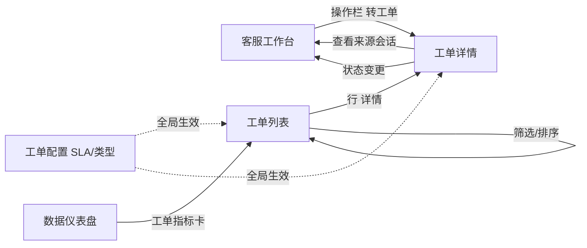
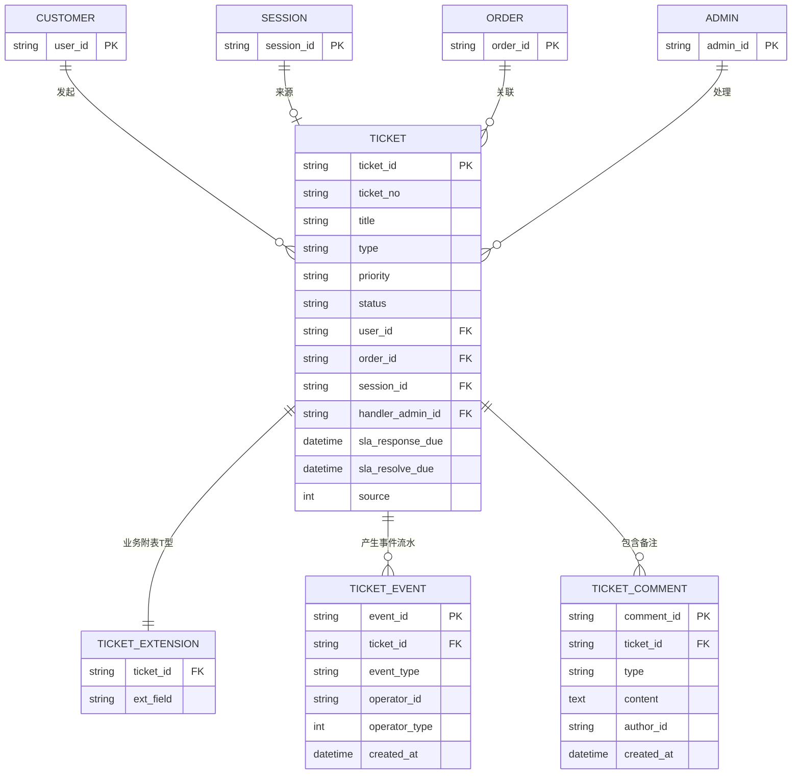
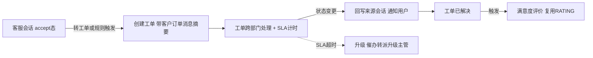
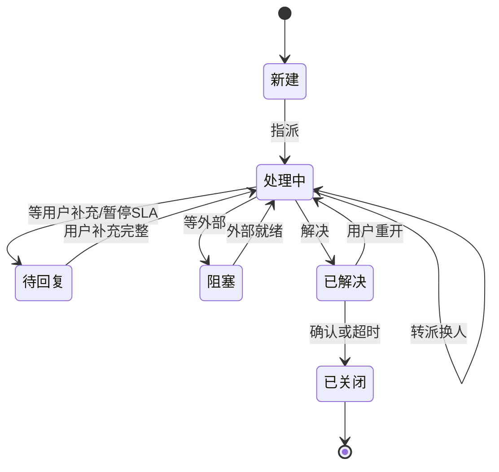

# PRD-工单系统-V0.1

> **版本**: V0.1 | **日期**: 2026-07-16 | **状态**: 初稿(基于竞品调研生成,待评审)
>
> **原型目录**: `prototype-cs/admin/`(`admin-ticket.html` 待建)
>
> **依据**: 《工单系统-竞品调研-V0.1.md》、《PRD-后台-V0.9.md》
>
> **变更摘要(V0.1 首版)**:
> 1. 定义工单系统一期范围(客服售后工单,建立在现有在线客服基础上)。
> 2. 工单数据模型(T 型:主表+业务附表)+ 状态机(6 态)+ 事件流水。
> 3. 会话转工单核心链路(带上下文建单 → 处理 → 回写会话通知 → 评价闭环)。
> 4. SLA 时效(首次响应/解决)+ 分级超时升级(escalation),全部可配。
> 5. 工单分派(一期手动+轮询)、内部协作(内部备注/对客消息双通道)。
> 6. 明确与现有会话系统、OMS 的边界。

---

## 一、范围边界

| 范围 | 内容 |
|------|------|
| **In Scope** | 工单列表与查询 / 工单详情与处理 / **会话转工单** / SLA 时效与升级 / 工单分派(手动+轮询)/ 工单回写通知 / 工单报表 / 工单配置(SLA+类型) |
| **Out Scope** | **2 期**:轮次响应 SLA、关单确认 SLA、母子工单/子任务、金额审批、自动建单(机器人)、技能组分派、触发器自动化;**工单与 OMS 深度集成**(一期工单仅记录售后意图,退款/退货/换货的实际操作由 OMS 2 期对接,见 🔴 风险) |

> **定位**:工单系统是 OCS 客服后台 **2 期**功能,补全会话系统缺失的「异步事务跟踪」能力。会话解决即时问题,工单承接需跨部门/需订单系统操作/需时效承诺的售后问题。

### 一.1 角色列表

| 代号 | 角色 | 工单场景职责 |
|------|------|------|
| R-A | 客服 | 会话转工单、处理工单、内部备注、转派、对客消息 |
| R-S | 客服主管 | escalation 终点(超时升级接收)、工单配置(SLA/类型)、查看全部工单;2 期含审批 |
| R-C | 终端用户 | 工单补充信息、查看进度、评价 |
| R-SYS | 系统 | SLA 计时、超时升级、自动分派(轮询)、状态自动流转、回写会话通知 |

> **审计口径**(沿用 ADR-0001):工单每次状态迁移必须区分 R-A/R-S(人,source=1)还是 R-SYS(系统,source=2)。工单事件流水 `TICKET_EVENT` 记 `operator_type`。
>
> **数据可见性**:R-A 仅见分配给自己的工单;R-S 见全部工单(沿用 ADR-0002)。

---

## 二、页面清单

| 序号 | 页面名称 | 文件名 | 状态 | 版本 |
|------|----------|--------|------|------|
| 1 | 工单列表 | admin-ticket.html | ❌ 待建 | V1 |
| 2 | 工单详情 | 抽屉/弹窗(嵌工作台与列表) | ❌ 待建 | V1 |
| 3 | 工单配置(SLA/类型) | admin-settings.html 扩展区块 或 独立页 | ❌ 待建 | V1 |

### 二.1 页面跳转关系

> 工单列表为独立页(侧边栏「会话管理 > 工单」);工单详情为抽屉,从工作台「转工单」和列表「详情」两处进入;工单配置归属「客服设置」。

---

## 三、实体关系总览

### 三.1 核心实体 ER 图

> CUSTOMER / SESSION / ORDER / ADMIN 为现有 OCS 实体(此处只画关系);TICKET 四表为工单新建。T 型架构:主表通用字段 + 业务附表(按工单类型的特有字段,如退款金额/物流单号)。

### 三.2 字段说明

#### 三.2.1 工单主表(TICKET)

| 序号 | 字段名 | 显示名 | 类型 | 必填 | 校验规则 | 来源/口径 |
|------|--------|--------|------|------|----------|-----------|
| 1 | ticket_id | 工单ID | varchar(32) | 是 | 系统生成 | 系统生成 |
| 2 | ticket_no | 工单编号 | varchar(32) | 是 | `#TK` + yyyyMMdd + 序号 | 系统生成 |
| 3 | title | 标题 | varchar(200) | 是 | — | 创建时填写/提取 |
| 4 | type | 工单类型 | enum | 是 | 退款/退货退款/换货/投诉/补发/价格干预 | 创建时选 |
| 5 | priority | 优先级 | enum | 是 | 紧急/高/中/低 | 创建时选或规则自动定级 |
| 6 | status | 工单状态 | enum | 是 | 新建/处理中/待回复/阻塞/已解决/已关闭 | 状态机流转 |
| 7 | user_id | 客户ID | varchar(32) | 是 | FK CUSTOMER | 创建时绑定 |
| 8 | order_id | 订单ID | varchar(32) | 否 | FK ORDER | 售后工单必填 |
| 9 | session_id | 来源会话ID | varchar(32) | 否 | FK SESSION | 会话转工单时写入 |
| 10 | handler_admin_id | 处理人 | varchar(32) | 否 | FK ADMIN | 指派时写入 |
| 11 | handler_group | 处理组 | varchar(32) | 否 | — | 分派时写入 |
| 12 | created_at | 创建时间 | datetime | 是 | 系统时间 | 系统自动 |
| 13 | sla_response_due | 响应时效截止 | datetime | 是 | created_at + SLA响应时效 | 系统按 SLA 算 |
| 14 | sla_resolve_due | 解决时效截止 | datetime | 是 | created_at + SLA解决时效 | 系统按 SLA 算 |
| 15 | resolved_at | 解决时间 | datetime | 否 | — | 已解决时写入 |
| 16 | closed_at | 关闭时间 | datetime | 否 | — | 已关闭时写入 |
| 17 | source | 来源 | tinyint | 是 | 0用户/1客服/2系统 | 创建时确定 |

#### 三.2.2 工单事件流水(TICKET_EVENT)

| 字段 | 类型 | 取值/口径 |
|------|------|----------|
| event_id | varchar(32) PK | 系统生成 |
| ticket_id | varchar(32) FK | 关联工单 |
| event_type | enum | created/assigned/replied/resolved/reopened/escalated/transferred/closed |
| operator_id | varchar(32) | 操作人 admin_id(系统事件为空) |
| operator_type | tinyint | 1=人 / 2=系统(满足 ADR-0001 审计口径) |
| created_at | datetime | 系统时间 |
| metadata | json | 附加上下文(转派原因/升级级别/SLA值等) |

#### 三.2.3 工单备注(TICKET_COMMENT)

| 字段 | 类型 | 取值/口径 |
|------|------|----------|
| comment_id | varchar(32) PK | 系统生成 |
| ticket_id | varchar(32) FK | 关联工单 |
| type | enum | internal(内部备注,客户不可见)/ public(对客消息,回写会话) |
| content | text | 内容 |
| author_id | varchar(32) FK | 作者 admin_id |
| created_at | datetime | 系统时间 |

> 数据来源:新建表 `customer_chat_tickets`(主表)+ `customer_chat_ticket_events`(事件流水)+ `customer_chat_ticket_comments`(备注)+ `customer_chat_ticket_extensions`(业务附表)。事件流水复用现有 `transfer.events` 模式。

---

═════════ 以下每个模块独立成章 ═════════

---

## 四、工单列表与查询(代号:TL)

工单查询页。多维筛选 + SLA 排序 + 操作入口。R-A 仅见自己的工单,R-S 见全部。

- **入口**: 侧边栏 > 会话管理 > 工单
- **关键元素**: 统计摘要条(待处理/即将超时/已超时/今日解决)、筛选条(类型/优先级/状态/客服/日期)、SLA 倒计时列、数据表格、导出
- **使用角色**: R-A / R-S

### 四.1 功能用例与验收

| UC编号 | 用例名称 | 角色 | 说明 |
|--------|----------|------|------|
| UC-TL-01 | 统计摘要 | R-A | 进入页面,4 项统计:待处理/即将超时/已超时/今日解决 |
| UC-TL-02 | 筛选查询 | R-A | 类型/优先级/状态/客服/日期组合过滤 |
| UC-TL-03 | SLA 排序 | R-A | 按「即将超时/已超时」优先排序 |
| UC-TL-04 | 查看详情 | R-A | 行「详情」打开抽屉 |
| UC-TL-05 | 导出 | R-S | 导出筛选结果 |

**验收标准(AC-TL)**

| AC编号 | 验收标准 | 对应用例 | Given | When | Then |
|--------|----------|:--------:|-------|------|------|
| AC-TL-01 | 数据可见性 | UC-TL-02 | 列表 | R-A 登录 | 仅见 `handler_admin_id = 自己` 的工单;R-S 见全部 |
| AC-TL-02 | SLA 倒计时渲染 | UC-TL-03 | 列表 | 渲染 | 每行显示响应/解决剩余时间;已超时红色、即将超时(<20%)橙色 |
| AC-TL-03 | 超时优先排序 | UC-TL-03 | 列表 | 默认排序 | 已超时 > 即将超时 > 其余,同档按 due 时间正序 |
| AC-TL-04 | 状态筛选 | UC-TL-02 | 筛选栏 | 切状态 | 按 status 过滤(新建/处理中/待回复/阻塞/已解决/已关闭) |

### 四.2 数据字段(列表列)

| 字段 | 取值 | 说明 |
|------|------|------|
| 工单号 | `#TK` + yyyyMMdd + 序号 | col-id |
| 标题 | 工单标题 | — |
| 类型 | 退款/退货退款/换货/投诉/补发/价格干预 | tag |
| 优先级 | 紧急/高/中/低 | tag,紧急红色 |
| 状态 | 新建/处理中/待回复/阻塞/已解决/已关闭 | s-tag |
| 客户 | 昵称 + 脱敏手机 | 复用 CUSTOMER |
| SLA 倒计时 | 响应剩余 / 解决剩余 | 已超时红、临期橙 |
| 处理人 | 客服名 / 未分配 | — |
| 创建时间 | datetime | — |
| 操作 | 详情/转派/指派 | 按状态/角色显示 |

---

## 五、会话转工单(代号:CT)— 核心模块

「建在客服基础上」的关键。客服在会话中把需异步跟进的售后问题转为工单,带上下文建单,处理后回写会话。

- **入口**: 客服工作台 > 会话操作栏「转工单」
- **使用角色**: R-A(转)、R-SYS(回写通知)

### 五.1 功能用例与验收

| UC编号 | 用例名称 | 角色 | 说明 |
|--------|----------|------|------|
| UC-CT-01 | 发起转工单 | R-A | 会话中点「转工单」,弹窗预填上下文 |
| UC-CT-02 | 自动带入上下文 | R-A | 自动填:客户信息 + 订单(右栏)+ 会话消息摘要 + 建议优先级 |
| UC-CT-03 | 选类型/优先级 | R-A | 选工单类型、确认/改优先级、填标题 |
| UC-CT-04 | 会话状态联动 | R-SYS | 转工单后,会话可挂起(pending)或由客服选择结束 |
| UC-CT-05 | 工单回写会话 | R-SYS | 工单状态变更 → 向来源会话推系统消息(notice)通知用户 |
| UC-CT-06 | 解决触发评价 | R-SYS | 工单「已解决」→ 可触发满意度评价(复用 RATING) |

**验收标准(AC-CT)**

| AC编号 | 验收标准 | 对应用例 | Given | When | Then |
|--------|----------|:--------:|-------|------|------|
| AC-CT-01 | 上下文预填 | UC-CT-02 | 转工单弹窗 | 打开 | 自动填 user_id/order_id/session_id + 消息摘要;优先级按关键词建议 |
| AC-CT-02 | 建单写事件 | UC-CT-01 | 提交 | 确认 | 创建 TICKET(status=新建)+ 写 TICKET_EVENT(created,operator_type=1) |
| AC-CT-03 | 会话联动 | UC-CT-04 | 转工单后 | — | 来源会话显示「已转工单 #TK...」;会话状态可 pending(客服挂起) |
| AC-CT-04 | 回写通知 | UC-CT-05 | 工单状态变更 | 处理中/已解决 | 向 session_id 推 type=notice 系统消息,用户可见 |
| AC-CT-05 | 反向跳回 | UC-CT-01 | 工单详情 | 点「查看来源会话」 | 跳回工作台并定位该会话 |
| AC-CT-06 | 评价触发 | UC-CT-06 | 工单已解决 | — | 推送评价邀请(复用 RATING 流程) |

### 五.2 核心流程(协同闭环)

> **转工单时机判定**:需跨部门/需订单系统操作/需时效承诺 → 转工单;纯沟通 → 留会话。一期手动转(客服判断),2 期加关键词建议与机器人自动转。

---

## 六、工单详情与处理(代号:TD)

工单抽屉:基本信息 + 状态流转 + 内部协作(备注/对客消息)+ 事件流水 + 来源会话。

- **入口**: 工单列表「详情」/ 工作台「转工单」后
- **使用角色**: R-A(处理)、R-S(查看全部/升级终点)

### 六.1 工单状态机

| 当前状态 | 目标状态 | 触发动作 | 守卫条件 | 执行角色 |
|----------|----------|----------|----------|----------|
| — | 新建 | 转工单/创建 | — | R-A / R-C |
| 新建 | 处理中 | 指派 | handler_admin_id 必填 | R-A / R-SYS |
| 处理中 | 待回复 | 等用户补充 | — | R-A |
| 待回复 | 处理中 | 用户补充完整 | — | R-C / R-A |
| 处理中 | 处理中 | 转派 | 换 handler | R-A |
| 处理中 | 阻塞 | 等外部依赖 | 原因必填 | R-A |
| 阻塞 | 处理中 | 外部就绪 | — | R-A / R-SYS |
| 处理中 | 已解决 | 解决 | — | R-A |
| 已解决 | 处理中 | 用户重开 | 不满意 | R-C |
| 已解决 | 已关闭 | 用户确认/超时 | 关单确认时效(2期) | R-C / R-SYS |

### 六.2 功能用例与验收

| UC编号 | 用例名称 | 角色 | 说明 |
|--------|----------|------|------|
| UC-TD-01 | 查看详情 | R-A | 工单信息 + 客户 + 订单 + 来源会话 + 事件流水 |
| UC-TD-02 | 指派/转派 | R-A | 指派给自己或转派他人,写事件 |
| UC-TD-03 | 内部备注 | R-A | type=internal,客户不可见 |
| UC-TD-04 | 对客消息 | R-A | type=public,回写来源会话 |
| UC-TD-05 | 状态变更 | R-A | 按状态机流转,写事件 |
| UC-TD-06 | 查看来源会话 | R-A | 跳回工作台 |

**验收标准(AC-TD)**

| AC编号 | 验收标准 | 对应用例 | Given | When | Then |
|--------|----------|:--------:|-------|------|------|
| AC-TD-01 | 事件流水 | UC-TD-05 | 任意状态变更 | 提交 | 写 TICKET_EVENT,operator_type 区分人/系统 |
| AC-TD-02 | 双通道消息 | UC-TD-03/04 | 详情 | 发备注 | internal 仅工单内可见;public 回写来源会话 |
| AC-TD-03 | 转派带历史 | UC-TD-02 | 转派 | 确认 | handler 更新 + 事件记录 from→to + 新处理人提醒 |
| AC-TD-04 | 阻塞需原因 | UC-TD-05 | 处理中→阻塞 | 提交 | 阻塞原因必填,否则阻断 |

---

## 七、SLA 时效与升级(代号:SL)

工单区别于会话的核心能力。所有时效值均为后台配置项(不硬编码)。

- **入口**: 客服设置 > 工单配置 > SLA
- **使用角色**: R-S(配置)、R-SYS(计时/升级)

### 七.1 SLA 配置(全部可配,复用会话规则配置页模式)

**① 事件清单:**

| 事件 | 计时区间 | 一期/二期 |
|------|---------|----------|
| 首次响应 FRT | 创建 → 客服首次回复 | ✅ 一期 |
| 解决 RT | 创建 → 已解决 | ✅ 一期 |
| 轮次响应 | 用户补充 → 客服回复 | 🟡 二期 |
| 关单确认 | 已解决 → 确认/超时关闭 | 🟡 二期 |

**② 时效矩阵(默认值,可配):**

| 优先级 | 首次响应 | 解决 | 典型场景 |
|--------|---------|------|---------|
| 🔴 紧急 | 10 分钟 | 2 小时 | 重大投诉/VIP/系统故障 |
| 🟠 高 | 30 分钟 | 4 小时 | 退款异常/物流丢件 |
| 🟡 中 | 1 小时 | 8 小时(1 工作日) | 常规退换货 |
| 🟢 低 | 2 小时 | 24 小时 | 一般咨询转工单 |

**③ 配置项:** SLA 矩阵(优先级×事件,每格 input+单位下拉)、工作时间计时 switch(9:00-21:00)、优先级自动定级规则、一级升级阈值(默认100%)、二级升级阈值(默认150%)、催办通道(csNotify+企业微信)。

### 七.2 超时升级流程

### 七.3 功能用例与验收

| UC编号 | 用例名称 | 角色 | 说明 |
|--------|----------|------|------|
| UC-SL-01 | SLA 计时 | R-SYS | 工单创建即按优先级算 sla_response_due/sla_resolve_due |
| UC-SL-02 | 即将超时预警 | R-SYS | 达时效 80% → 提醒客服 |
| UC-SL-03 | 一级升级 | R-SYS | 达 100% → 自动转派+标记超时+催办 |
| UC-SL-04 | 二级升级 | R-SYS | 达 150% → 升级主管 |
| UC-SL-05 | 配置 SLA | R-S | 改时效矩阵/阈值/工作时间 |

**验收标准(AC-SL)**

| AC编号 | 验收标准 | 对应用例 | Given | When | Then |
|--------|----------|:--------:|-------|------|------|
| AC-SL-01 | 计时按优先级 | UC-SL-01 | 创建工单 | priority 确定 | sla_*_due = created_at + 对应优先级时效;写 metadata |
| AC-SL-02 | 工作时间模式 | UC-SL-01 | 配置 switch=开 | 计时 | 仅 9:00-21:00 累计,非工作时段不计入 |
| AC-SL-03 | 一级升级 | UC-SL-03 | 达 100% | cron 扫到 | 转派(换 handler)+ 标记超时 + 企微催办 + 写 escalated 事件 |
| AC-SL-04 | 二级升级 | UC-SL-04 | 达 150% | cron 扫到 | 升级 R-S 主管 + 写事件 |
| AC-SL-05 | 配置持久化 | UC-SL-05 | 配置页 | 保存 | 落 customer_chat_settings,新工单生效(存量工单口径见七.4) |

### 七.4 异常与边界

| 场景 | 处理 |
|------|------|
| 待回复暂停计时 | 一期不实现(2 期);一期「首次响应/解决」均从创建累计 |
| 重开重计 | 2 期;一期重开不重置 SLA |
| 配置变更生效 | 仅对新工单生效;存量工单保持原 SLA(口径同会话规则) |
| 升级通道 | 复用现有 csNotify + 企业微信;无独立通道 |

> **与会话 SLA 边界**:会话 SLA(现有,分钟级:首次响应5min/轮次3min/转接5min)与工单 SLA(小时级)是两套独立配置,尺度差一个数量级不能混;共用配置 UI + 通知通道。

---

## 八、工单分派(代号:AS)

一期:手动指派 + 轮询自动分派。2 期:技能组/规则分派。

- **使用角色**: R-A(指派/转派)、R-SYS(自动分派)

### 八.1 功能用例与验收

| UC编号 | 用例名称 | 角色 | 说明 |
|--------|----------|------|------|
| UC-AS-01 | 手动指派 | R-A | 创建/转工单时指定 handler |
| UC-AS-02 | 轮询自动分派 | R-SYS | 新建工单未指定 handler → 按轮询分配给在线客服 |
| UC-AS-03 | 满载跳过 | R-SYS | 客服达 max_sessions 上限 → 跳过 |
| UC-AS-04 | 转派 | R-A | 处理中转派他人 |

**验收标准(AC-AS)**

| AC编号 | 验收标准 | 对应用例 | Given | When | Then |
|--------|----------|:--------:|-------|------|------|
| AC-AS-01 | 轮询分配 | UC-AS-02 | 新建无 handler | 自动分派 | 按在线客服轮询,跳过满载,写 assigned 事件 |
| AC-AS-02 | 满载跳过 | UC-AS-03 | 候选达上限 | 轮询 | 跳过该客服,选下一个;全满载 → 待分配池 + 主管提醒 |
| AC-AS-03 | 转派审计 | UC-AS-04 | 转派 | 确认 | handler 变更 + 写 transferred 事件(from→to) |

> 复用会话系统路由经验(轮询/负载/max_sessions);2 期补技能组(PRD 已列 Out Scope)。

---

## 九、工单回写与通知(代号:RB)

工单状态变更回写来源会话,通知用户,形成闭环。

- **使用角色**: R-SYS

### 九.1 功能用例与验收

| UC编号 | 用例名称 | 角色 | 说明 |
|--------|----------|------|------|
| UC-RB-01 | 状态回写 | R-SYS | 处理中/已解决 → 来源会话推 notice |
| UC-RB-02 | 对客消息回写 | R-SYS | public 备注 → 回写会话 |
| UC-RB-03 | 升级通知客服 | R-SYS | SLA 升级 → 企微通知处理人/主管 |

**验收标准(AC-RB)**

| AC编号 | 验收标准 | 对应用例 | Given | When | Then |
|--------|----------|:--------:|-------|------|------|
| AC-RB-01 | 回写消息 | UC-RB-01 | 工单 session_id 存在 | 状态变更 | 向会话推 type=notice 消息,用户端可见 |
| AC-RB-02 | 无来源会话 | UC-RB-01 | session_id 为空 | 状态变更 | 跳过回写,仅站内/企微通知 |
| AC-RB-03 | 升级通道 | UC-RB-03 | SLA 升级 | 触发 | csNotify + 企业微信通知,复用现有通道 |

---

## 十、工单报表与配置(代号:RP / CF)

### 十.1 工单报表(RP)

扩展现有数据仪表盘,新增工单指标卡。

| 指标 | 口径 |
|------|------|
| 工单量 | 时段内新建工单数(按类型/优先级) |
| 平均处理时长 | resolved_at − created_at 均值 |
| SLA 达成率 | 未超时解决 / 总解决 |
| 工单满意度 | 复用 RATING 均分 |
| 客服工单绩效 | 处理量/平均时长/达成率 |

### 十.2 工单配置(CF)

| 配置 | 说明 |
|------|------|
| SLA 矩阵 | 优先级 × 事件 时效(见七) |
| 工单类型 | 启用/停用 类型 + 关联业务附表字段 |
| 升级阈值 | 一级/二级 % |
| 自动定级规则 | 关键词/客户等级 → 优先级 |

---

## 十一、单据流转

### 十一.1 工单单(customer_chat_tickets)

| 阶段 | 触发 | 字段变更 | 关联动作 |
|------|------|----------|----------|
| 创建 | 会话转工单/用户提交 | id/no/type/priority/status=新建/user_id/order_id/session_id/created_at/sla_*_due | 写 created 事件;触发分派;若 session_id 则会话联动 |
| 指派 | 手动/轮询 | handler_admin_id/status=处理中 | 写 assigned 事件 |
| 待回复 | 等用户补充 | status=待回复 | (2期暂停SLA) |
| 阻塞 | 等外部依赖 | status=阻塞/原因 | — |
| 升级 | SLA 超时 | 标记超时/handler 转派 | 写 escalated 事件;企微通知 |
| 解决 | 客服解决 | status=已解决/resolved_at | 回写会话;触发评价 |
| 关闭 | 确认/超时 | status=已关闭/closed_at | (2期关单确认) |

---

## 十二、接口时序

### 十二.1 同步接口

| # | 操作 | 路径 | 参数 | 异常码 |
|---|------|------|------|--------|
| 1 | 工单列表 | GET `/api/backend/ticket/list` | 筛选条件 | 空数据 |
| 2 | 工单详情 | GET `/api/backend/ticket/detail` | ticket_id | 无权限 |
| 3 | 创建工单(转工单) | POST `/api/backend/ticket/create` | type/priority/title/user_id/order_id/session_id | 参数缺失 |
| 4 | 状态变更 | POST `/api/backend/ticket/update` | ticket_id/action | 非法状态迁移 |
| 5 | 指派/转派 | POST `/api/backend/ticket/assign` | ticket_id/handler_admin_id | 目标满载 |
| 6 | 备注 | POST `/api/backend/ticket/comment` | ticket_id/type/content | — |
| 7 | SLA 配置 | POST `/api/backend/ticket/sla-config` | 矩阵/阈值 | — |
| 8 | 工单导出 | GET `/api/backend/ticket/export` | 筛选条件 | 空数据 |

### 十二.2 异步流程

| # | 触发 | 链路 | 重试 | 补偿 |
|---|------|------|------|------|
| 1 | SLA 计时 | cron 扫 sla_*_due → 预警/升级 | 下次重试 | — |
| 2 | 状态回写 | 状态变更 → 推会话 notice | 推送失败重连拉 | — |
| 3 | 自动分派 | 新建无 handler → 轮询分配 | 全满载进待分配池 | 主管提醒 |
| 4 | 评价触发 | 已解决 → 推评价邀请 | 按催评配置 | — |

### 十二.3 与 OMS 集成接口(2 期,🔴 一期仅记录)

| # | 操作 | 方向 | 说明 |
|---|------|------|------|
| 1 | 查订单详情 | 工单 → OMS | GET 订单/物流/售后单(一期只读展示) |
| 2 | 发起退款 | 工单 → OMS | 2 期:退款工单触发 OMS 退款单 |
| 3 | 退货退款(RMA) | 工单 → OMS | 2 期:触发退货单→签收→退款 |
| 4 | 换货/补发 | 工单 → OMS | 2 期 |
| 5 | 售后事件回写 | OMS → 工单 | 2 期:退款结果/退货签收 → 更新工单状态 |

> 🔴 **一期边界**:OMS 重构中,一期工单仅记录售后意图(order_id 关联 + 附表存退款金额/物流单号),不直连 OMS 操作;退款/退货/换货的实际执行待 OMS 对外 API 就绪后 2 期对接。

---

## 十三、与现有客服系统集成

| 集成点 | 现有 OCS 能力 | 工单接入方式 |
|--------|--------------|--------------|
| 会话转工单 | 会话状态机(accept/pending) | accept 态操作栏「转工单」,带上下文建单 |
| 客户关联 | 客户 360 画像 | 工单 user_id 关联,详情显示客户档案 |
| 订单关联 | 客户信息-交易Tab(OMS) | 工单 order_id 关联 |
| 通知通道 | csNotify + 企业微信 | SLA 升级/回写复用 |
| 角色体系 | R-A / R-S | 处理人=R-A,升级/配置=R-S |
| 审计口径 | source + 事件流水 | TICKET_EVENT 同模式(operator_type 人/系统) |
| 评价体系 | RATING | 工单解决触发评价 |
| 仪表盘 | 数据仪表盘 | 扩展工单指标卡 |
| 路由经验 | 转接防抖 | 工单转派借鉴防"踢皮球" |

> **一句话**:OCS 加工单 = 在现有会话/客户/评价/通知/角色骨架上,增加「工单」事务实体 + SLA 引擎 + 会话协同接口。70% 复用,30% 新建。

---

## 十四、落地路线

**一期(MVP):**
1. 工单 CRUD + T 型数据模型 + 状态机(6 态)
2. 会话转工单(手动,带上下文)+ 回写通知
3. SLA(首次响应/解决 + 即将超时预警 + 一/二级升级)
4. 手动指派 + 轮询自动分派
5. 工单列表/详情 + 工作台右栏工单区
6. 工单配置(SLA 矩阵/类型)

**二期:**
7. 轮次响应/关单确认 SLA + 暂停/重开计时
8. 技能组分派 + 流转触发器
9. 母子工单 + 审批 + 内部协作(@/关注)
10. 工单报表 + SLA 看板
11. 机器人自动建单
12. OMS 深度集成(退款/退货/换货直连)

---

## 十五、风险与待确认

| # | 风险/待确认 | 说明 | 应对 |
|---|------------|------|------|
| 🔴 1 | OMS 接口未就绪 | OMS 重构中,一期工单无法直连退款/退货 | 一期仅记录;2 期对接 |
| ⚠️ 2 | 转工单时机 | 自动转 vs 手动转 | 一期手动 + 关键词建议;自动转 2 期 |
| ⚠️ 3 | SLA 暂停计时 | 待回复/重开暂停 | 一期不暂停(总时效);2 期 |
| ⚠️ 4 | 工单与「会话挂起/转接」边界 | 何时留会话、何时转工单 | 需跨部门/需订单操作/需时效承诺 → 转工单 |
| ⚠️ 5 | 售后单(RMA)归属 | 售后单在 OMS 还是工单 | 售后单归 OMS(一等实体),工单只触发+跟踪 |

---

*本稿为 V0.1 初稿,基于《工单系统-竞品调研-V0.1》生成,待产品评审。标注 🔴 项需向技术/业务确认(OMS 接口可用性)。*
