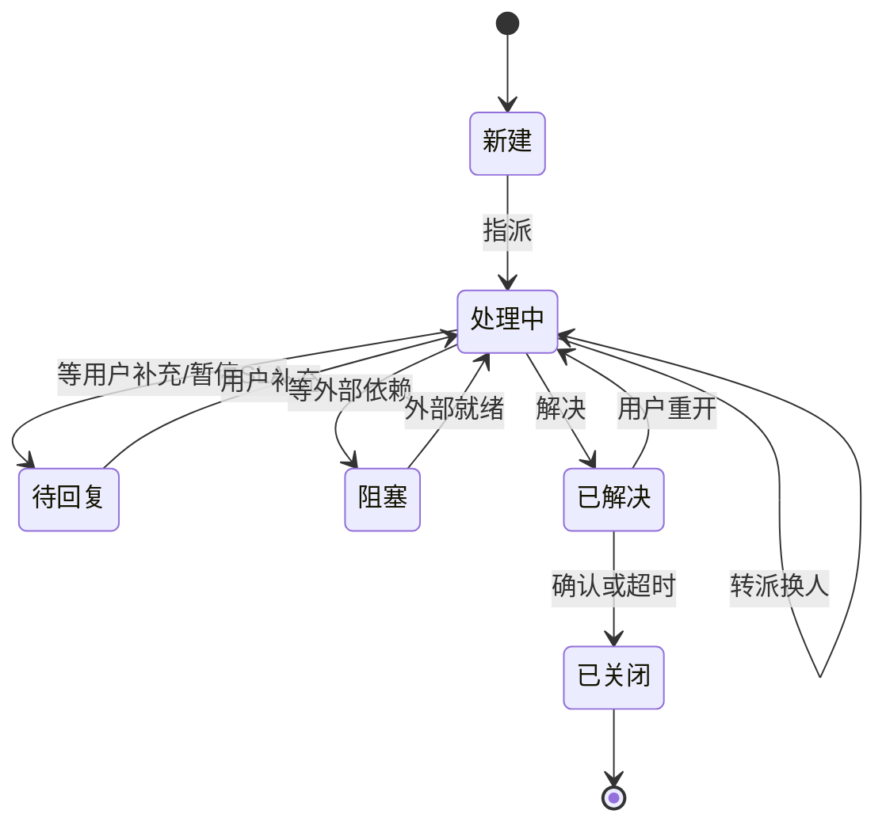
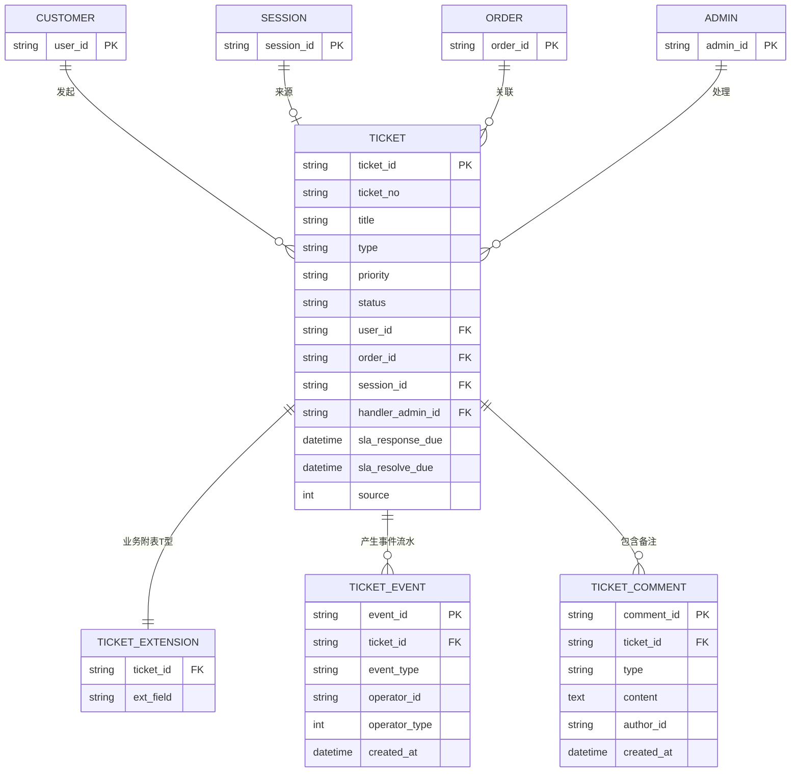
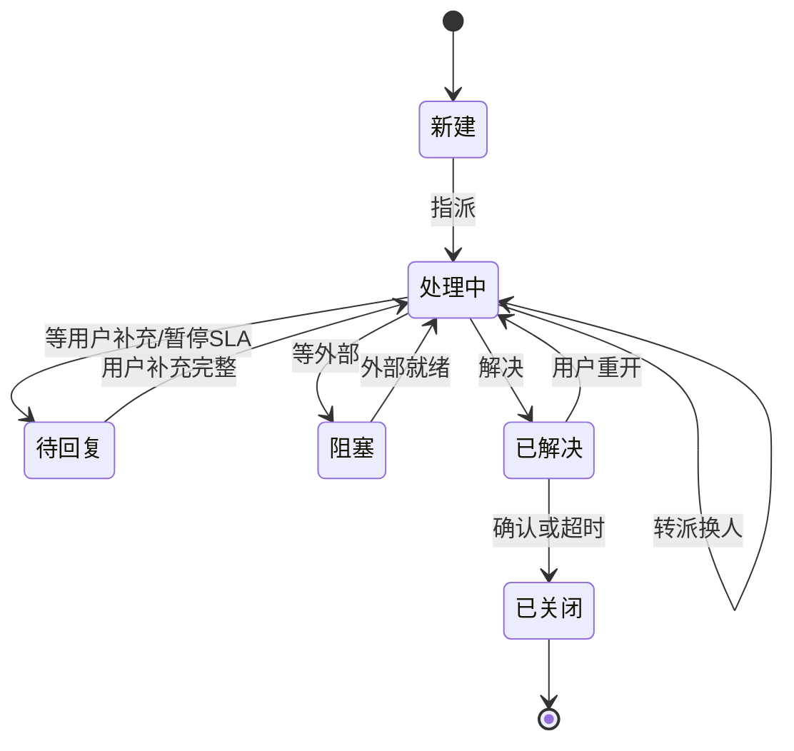
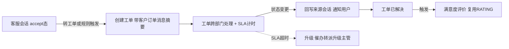

# OCS 工单系统竞品调研报告(设计前调研)

> **定位**:为 OCS 客服后台 **2 期「工单系统」**(`admin-ticket.html`,当前为占位页)的设计提供输入
> **业务方向**:客服售后工单(会话转工单、退换货/投诉/售后处理),**建立在现有在线客服系统之上**
> **对标范围**:国内为主(智齿/Udesk/网易七鱼/逸创 KF5/合力亿捷)+ 国际标杆对照(Zendesk/Freshdesk)+ 开源方案(NocoBase)
> **模式**:设计前调研(工单尚无 PRD,故对比角度为「业界做法 → OCS 该怎么设计」)
> **日期**:2026-07-16 | **证据图例**:🟢 公开资料证实 / 🟡 行业最佳实践推理 / 🔴 推测待验证

---

## 一、调研背景与核心结论

### 为什么做这个调研
工单系统在 V0.9 PRD 里是 2 期占位,无设计文档。本报告在**设计前**系统调研业界客服工单产品,产出可直接作为工单 PRD 骨架的设计建议,并重点回答用户最关心的问题:**「工单系统如何建立在现有在线客服基础上」**(会话↔工单协同)。

### 核心结论(三句话)
1. **业界已收敛到「客服会话 + 工单同一条服务链路」**——会话解决即时问题,解决不了/需异步跟进的转工单,工单处理后**回写会话通知用户**,形成闭环。OCS 已有成熟会话系统,加工单是补这条链路的"重活/异步"环节,起点很高。
2. **SLA 时效 + 超时升级(escalation)是工单区别于会话的核心能力**——分优先级配响应/解决时效,超时分级升级(100%→转派高一级,150%→升级主管)。这块 OCS 可复用现有「超时预警3类」的通知机制。
3. **数据模型建议借鉴 NocoBase 的「T 型架构」**(主表+业务附表)+ 工单模板自定义字段,适配多售后场景(退款/退货/换货/投诉各异),且能平滑关联现有 SESSION/CUSTOMER。

### 工单系统对 OCS 的价值
- **承接会话溢出**:复杂/需跨部门/需时效承诺的售后问题,从会话转入工单异步处理,释放客服即时接待产能。
- **补全服务闭环**:会话是"即时沟通",工单是"事务跟踪",二者合一才是完整客服体系(业界标配)。
- **可量化管理**:SLA 达成率、处理时长、工单满意度——补足会话系统难以度量的事务处理质量。

---

## 二、业界工单系统格局

| 产品 | 层级 | 定位 | 对 OCS 的对标价值 |
|------|------|------|------------------|
| **智齿科技** | 🏛️ 国内 | 一体化客服(在线+工单+呼叫) | 工单模板/自定义字段、流转+定时触发器、SLA、**在线客服+工单联动**、留言转工单 |
| **Udesk(沃丰科技)** | 🏛️ 国内 | AI 全渠道智能客服 | SLA 多层级、**分级 escalation**、触发器提醒目标、多级流转、IM 工作台辅助区看工单 |
| **网易七鱼** | 🏛️ 国内 | 轻量智能客服 | **会话转工单(智能提取填字段+情绪→优先级)**、规则分派、机器人自动建单 |
| **逸创 KF5** | 🏛️ 国内 | 专注工单(起于 IT 运维) | 工单类型分类/标签、多客服协同+工程师派单、流转/转派、报表 |
| **合力亿捷** | 🏛️ 国内 | 呼叫中心+客服 | **SLA 可视化+超时多渠道催办+逐级上报**、与 Zendesk/Freshdesk 对比 |
| **Zendesk** | 🌐 国际 | 全球工单标杆 | 优先级绑定 SLA 政策、触发器自动化、SLA 报告、FRT 60min 基线 |
| **Freshdesk** | 🌐 国际 | 全球工单标杆 | 内置 escalation 规则、多渠道提醒 |
| **NocoBase 工单方案** | 🔧 开源 | 低代码工单方案 | **T 型数据架构(主表+业务附表)**、转换规则、触发条件——设计模板价值 |

> 选型逻辑:OCS 是商城客服(非 IT helpdesk),故以**客服型工单**(智齿/Udesk/七鱼)为主,逸创(IT 运维起家)作协作机制参照,Zendesk/Freshdesk 作 SLA 最佳实践基线。

---

## 三、四维度深挖

### 3.1 🔴 工单数据模型 + 状态机

#### 业界做法

**数据模型:**
- **工单模板 + 自定义字段**是标配:智齿支持级联字段、按业务流程配不同模板;逸创按工单类型分类+标签;阿里云工单+CRM组合自定义字段。🟢([智齿工单](https://function.help.sobot.com/gong-dan-xi-tong.html)、[逸创](https://www.kf5.com/product/ticket))
- **NocoBase「T 型架构」**:主表存通用字段(标题/优先级/状态/客户/处理人),业务附表存各工单类型特有字段(退款单的退款金额/物流单号 vs 投诉单的投诉对象/证据)。🟢([NocoBase 工单设计](https://docs.nocobase.com/cn/solution/ticket-system/design))——**强烈建议 OCS 借鉴**,因为售后场景(退款/退货/换货/投诉)字段差异大,T 型架构能避免单表字段爆炸。
- **关联实体**:工单需关联 客户 / 来源会话 / 订单(OCS 已有 SESSION、CUSTOMER,补 ORDER 关联即可)。

**状态机:**
业界典型工单生命周期(🟡 多源归纳,智齿/逸创/Udesk 一致):

- 关键态:**待回复**(等用户补充信息,暂停 SLA 计时)、**重开**(已解决但用户不满意,重新激活)、**已关闭**(终态,区别于"已解决")。🟡
- **流转触发器**:智齿/逸创支持"工单满足条件→自动变更状态/指派",减少人工。🟢([智齿流转触发器](https://function.help.sobot.com/gong-dan-xi-tong.html))

#### → OCS 设计建议
| 项 | 建议 | 依据 |
|----|------|------|
| 数据架构 | **T 型**:工单主表(通用)+ 业务附表(按类型) | 🟢 NocoBase |
| 工单类型 | 售后场景预设:退款/退货退款/换货/投诉/补发/价格干预 | 🟡 业界分类 |
| 自定义字段 | 工单模板 + 自定义字段(支持级联,如"商品→SKU") | 🟢 智齿 |
| 关联 | `session_id`(来源会话)+ `user_id` + `order_id`(订单) | 🟡 OCS 复用现有实体 |
| 状态机 | 新建/处理中/待回复/阻塞/已解决/已关闭 + 重开/转派 | 🟢 业界标配 |
| 触发器 | 条件驱动状态变更(如"用户补充完整→自动转处理中") | 🟢 智齿 |

> 💡 **复用 OCS 优势**:OCS 会话系统已有成熟状态机 + source 审计口径 + 事件流水(transfer.events)经验,工单状态机可直接套用同一套模式(状态迁移记 source 人/系统 + 工单事件流水表)。

---

### 3.2 ⭐ 会话 ↔ 工单协同(最核心——「建在客服基础上」的关键)

#### 业界做法

**① 会话转工单(智能建单):**
- **网易七鱼**:会话结束后**智能提取**(用户名/联系方式/工单内容)自动填工单字段,**识别用户情绪→建议优先级**;机器人确认意图、收集订单号/原因,**带会话上下文生成工单**,人工只做审核。🟢([七鱼工单](https://b.163.com/home/qiyu/worksheet)、[七鱼AI工单策略](https://b.163.com/cms/ai-ke-fu-wang-yi-qi-yu-2026-HDhAjbHi.html))
- **智齿**:**留言转工单**(用户留言填信息→自动生成工单,工单代替人工完成审核)。🟢([智齿在线留言](https://help.zhichi.com/pages/9d6748/))
- **NocoBase**:转换规则 + 触发条件(满足条件才转),支持电话转工单。🟢

**② 工单回写会话 / 通知用户:**
- **网易《客服和工单同一条链路》**:核心观点——服务流程复杂后,会话转工单、工单部门间流转、**处理结果回写会话**、后续是否回访,必须在同一条链路评估。🟢([网易文章](https://b.163.com/cms/ai-ke-fu-gong-dan-ruan-jian-xi-tong-2026-imBPwEQ4.html))
- **Udesk 触发器提醒目标**:工单变动→自动回传第三方系统,实现跨系统同一工单流转。🟢

**③ IM 与工单的 UI 协同:**
- **Udesk**:IM 工作台**辅助区**直接查看/点击工单记录,呼叫中心弹屏看历史工单——IM 与工单深度联动。🟢([Udesk 工单手册](https://netmarket.oss.aliyuncs.com/cef74339-3a30-4ac5-a94e-77809c45659c.pdf))
- **阿里云 CCS**:整合机器人+人工+工单一站式。🟢

#### → OCS 协同设计建议(重点)
OCS 已有「客服工作台(左会话列表/中聊天窗/右客户信息)」三栏结构,工单协同天然嵌入:

| 协同场景 | OCS 建议设计 | 依据 |
|---------|-------------|------|
| **何时转工单** | 客服在会话中点「转工单」(操作栏新增);或机器人/规则自动转(如命中"退款/投诉"关键词 + 需订单核实) | 🟢 七鱼/智齿 |
| **转工单带什么** | 自动带入:客户信息 + 订单(从右栏客户信息)+ 会话消息摘要 + 情绪/紧急度建议优先级 | 🟢 七鱼智能提取 |
| **会话与工单的状态联动** | 转工单后会话可「挂起(pending)」或「结束」;工单详情页显示来源会话,可反向跳回 | 🟡 链路闭环 |
| **工单回写会话** | 工单状态变更(处理中/已解决)→ 向来源会话推系统消息(type=notice)通知用户;"已解决"→可触发满意度评价(复用现有 RATING) | 🟢 网易回写 |
| **UI 嵌入** | 工作台右栏(现客户信息)下方增「该客户工单」区;工单详情页可展开来源会话记录 | 🟢 Udesk 辅助区 |
| **工单内沟通 vs 客户沟通** | 工单内部备注(客户不可见,用于跨部门协作)+ 工单对客消息(回写会话,用户可见)分离 | 🟡 业界双通道 |

> 🌟 **核心洞察**:OCS 的最大优势是**已有完整会话链路 + 客户 360 画像 + 评价体系**。工单不是孤岛,而是这条链路的延伸——会话转工单(带上下文)→ 工单跨部门处理 → 回写会话通知用户 → 评价。这条闭环 OCS 已经有 70%,工单补最后 30%。

---

### 3.3 🔴 SLA 时效 + 分派路由(含超时升级)

#### 业界做法

**SLA 时效:**
- **按优先级配置**:Udesk 多层级(紧急:响应≤10min/解决≤2h;常规:响应≤1h/解决≤4h);Zendesk 正常优先级 FRT(首次回复)60min。🟢([Udesk SLA](https://www.udesk.cn/ucm/faq/65556)、[Zendesk SLA政策](https://support.zendesk.com/hc/zh-cn/articles/5600997516058))
- **按客户类型差异化**:Zoho Desk 支持按客户类型配不同 SLA(VIP 更快)。🟢([Zoho Desk SLA](https://www.zoho.com.cn/desk/articles/sla-ticketing.html))
- **优先级是 SLA 前提**:Zendesk 明确"工单必须有(系统默认)优先级才能应用 SLA"。🟢

**⭐ 超时升级(escalation)——工单的核心差异化能力:**
- **Udesk 分级升级**:一级(超 SLA 100%→自动转派高一级技能组 + 标"已超时");二级(超时 150%→升级至团队主管/更高层级)。🟢([Udesk 超时预警](https://www.udesk.cn/ucm/faq/68069))
- **合力亿捷**:可视化配置响应/处理/关单时效,超时自动**多渠道催办(短信/钉钉/企业微信)+ 逐级上报**。🟢([合力亿捷对比](https://www.hollycrm.com/blog/model/153.html))
- **Zendesk/智齿**:按超时/即将超时排序优先处理;即将超时预警。🟢([智齿 SLA](https://help.zhichi.com/pages/c11783/))

**分派路由:**
- **自动指派**:Udesk 按部门/员工/技能组;智齿按技能组/轮询;网易七鱼按问题类型规则分派。🟢
- **触发器驱动**:工单变动→自动触发指派/通知(Udesk/智齿)。🟢
- **转派**:Udesk 客服→客服组→技术部多级转移,新受理人邮件提醒。🟢

#### → OCS 设计建议
| 项 | 建议 | 依据 |
|----|------|------|
| SLA 维度 | 按「优先级(紧急/高/中/低)× 工单类型」配响应时效 + 解决时效 | 🟢 Udesk/Zendesk |
| 优先级 | 系统字段(非自定义),作为 SLA 前提;支持规则自动定级(关键词/客户等级) | 🟢 Zendesk |
| 超时升级 | **分级**:即将超时预警 → 超 100% 转派+标记 → 超 150% 升级主管;多渠道催办(复用 OCS 现有企业微信通知) | 🟢 Udesk/合力亿捷 |
| 工作时间 | SLA 计时支持"工作时间"模式(非 7×24),贴合商城客服 9:00-21:00 | 🟡 行业实践 |
| 分派 | 自动(技能组/轮询/规则)+ 手动指派 + 转派 | 🟢 Udesk/智齿 |
| 排序 | 工单列表支持按"即将超时/已超时"排序优先处理 | 🟢 智齿 |

#### SLA 配置规格(一期,全部可配)

工单 SLA 所有时效值均为后台配置项(不硬编码),复用现有「会话规则」配置页(`admin-settings.html`)的交互模式(input + 单位下拉 + dirty 标记 + 保存)。

**① SLA 事件清单(计时节点):**

| 事件 | 计时区间 | 衡量 | 一期/二期 |
|------|---------|------|----------|
| 首次响应 FRT | 创建 → 客服首次回复 | 接单速度 | ✅ 一期 |
| 解决 RT | 创建 → 已解决 | 处理速度 | ✅ 一期 |
| 轮次响应 | 用户补充 → 客服回复 | 跟进速度 | 🟡 二期 |
| 关单确认 | 已解决 → 确认/超时关闭 | 等确认上限 | 🟡 二期 |

**② 时效矩阵(建议默认值,可配):**

| 优先级 | 首次响应 | 解决 | 典型场景 |
|--------|---------|------|---------|
| 🔴 紧急 | 10 分钟 | 2 小时 | 重大投诉/VIP/系统故障 |
| 🟠 高 | 30 分钟 | 4 小时 | 退款异常/物流丢件 |
| 🟡 中 | 1 小时 | 8 小时(1 工作日) | 常规退换货 |
| 🟢 低 | 2 小时 | 24 小时 | 一般咨询转工单 |

**③ 配置项:**

| 配置项 | 控件 | 默认 |
|--------|------|------|
| SLA 矩阵 | 优先级(行)× 事件(列),每格 input + 单位下拉(分/时/天) | 见上 |
| 工作时间计时 | switch(开=9:00-21:00;关=7×24) | 开 |
| 优先级自动定级 | 关键词/客户等级 → 自动设优先级 | 命中=紧急 |
| 一级升级阈值 | input %(默认100%)+ 转派+标记超时+催办 | 100% |
| 二级升级阈值 | input %(默认150%)+ 升级主管 | 150% |
| 催办通道 | checkbox(csNotify + 企业微信) | 企微 |

**④ 超时升级流程:**


**⑤ 数据存储:** 配置值 → 现有 `customer_chat_settings`(KV 表),无需新建表(键如 `ticket_sla_first_resp_urgent`、`ticket_escalation_l1_pct`);每单 deadline → 工单表 `sla_response_due`/`sla_resolve_due`(4.1 已含);升级执行 → 复用 `cron.go` 扫超时 + `csNotify` + 企业微信。

**⑥ 与会话 SLA 边界:** 会话 SLA(现有,分钟级:首次响应5min/轮次3min/转接5min)与工单 SLA(小时级)是**两套独立配置**,尺度差一个数量级不能混;共用配置 UI 组件 + 通知通道。

> 💡 **复用 OCS 优势**:OCS 客服系统已有「超时预警 3 类」(首次响应/轮次响应/转接)+ `csNotify.popup` 催办机制 + 企业微信通知通道。**工单 SLA 的超时升级可直接复用这套通知基础设施**,只需新增 SLA 计时器 + escalation 规则引擎。

---

### 3.4 🔴 内部协作 + 报表

#### 业界做法

**内部协作:**
- **逸创 KF5**:多客服协同 + **工程师任务派单**(工单起源于 IT 运维的跨部门协作);工单流转/转派/分派。🟢([逸创](https://www.kf5.com/product/ticket)、[知乎逸创剖析](https://zhuanlan.zhihu.com/p/27704367))
- **内部备注 / @提及 / 审批 / 关注人 / 母子工单(子任务)**:工单跨部门协作标配(智齿/Udesk/Zendesk)。🟡

**报表统计:**
- **智齿**:SLA 数据下钻(按优先级/创建时间);工单数据分析。🟢
- **Zendesk**:SLA 报告按政策/指标/优先级筛选,监控达成率。🟢
- **逸创**:工单数据统计报表(处理效率/质量量化)。🟢

#### → OCS 设计建议
| 项 | 建议 | 依据 |
|----|------|------|
| 内部备注 | 工单内「内部备注」(客户不可见)+「对客消息」(回写会话)双通道 | 🟡 业界标配 |
| 协作 | @提及客服/组、关注人(变更通知)、转派(带流转历史) | 🟢 逸创/Zendesk |
| 子任务 | 母子工单(复杂售后拆解,如"退款+退货物流"分两个子工单) | 🟡 业界 |
| 审批 | 金额超阈值的退款工单需主管审批(对应 OCS R-S 主管角色) | 🟡 售后场景 |
| 报表 | 工单量/处理时长/SLA 达成率/工单满意度/客服工单绩效,复用 OCS 仪表盘 | 🟢 智齿/Zendesk |

> 💡 **复用 OCS 优势**:OCS 已有 R-A/R-S 角色体系(客服/主管)+ 数据仪表盘 + 评价管理。工单审批用 R-S、工单报表扩展仪表盘、工单满意度复用 RATING——协同成本低。

---

## 四、OCS 工单系统设计建议汇总(可直接作 PRD 骨架)

### 4.1 工单核心实体模型(建议)
```
TICKET (工单主表 - 通用)
  ticket_id | ticket_no(#TK+日期+序号) | title | type(退款/退货/换货/投诉/...) 
  priority(紧急/高/中/低) | status(新建/处理中/待回复/阻塞/已解决/已关闭) 
  user_id(FK) | order_id(FK,可空) | session_id(FK,来源会话,可空)
  handler_admin_id(处理人) | handler_group(处理组) 
  created_at | sla_response_due | sla_resolve_due | resolved_at | closed_at
  source(0用户/1客服/2系统)  ← 复用 OCS source 审计口径

TICKET_EXTENSION (业务附表 - 按类型, T型架构)
  ticket_id(FK) | 业务字段(退款金额/物流单号/投诉对象/证据...)

TICKET_EVENT (工单事件流水 - 复用 transfer.events 模式)
  event_id | ticket_id | event_type(created/assigned/replied/resolved/reopened/escalated/...)
  operator_id | operator_type(1人/2系统) | created_at | metadata(json)

TICKET_COMMENT (内部备注/对客消息)
  comment_id | ticket_id | type(internal/public) | content | author_id | created_at
```

**实体关系图:**



> CUSTOMER / SESSION / ORDER / ADMIN 为现有 OCS 实体(此处只画关系,字段略);TICKET 四表为工单新建。

### 4.2 状态机(建议)


### 4.3 SLA + 分派(建议,详见 3.3 SLA 配置规格)
- SLA:优先级 × 类型 → 响应时效 + 解决时效;支持工作时间计时
- Escalation:即将超时预警 → 超100%转派+标记 → 超150%升级主管(复用 csNotify + 企微通知)
- 分派:自动(技能组/轮询/规则)+ 手动 + 转派

### 4.4 会话↔工单协同(建议,见 3.2)
转工单(带上下文)→ 联动状态 → 回写会话通知 → 评价闭环



---

## 五、⭐ 与现有 OCS 客服系统的集成方案

这是「建在客服基础上」的核心,单独成节:

| 集成点 | 现有 OCS 能力 | 工单系统接入方式 |
|--------|--------------|-----------------|
| **会话转工单** | 会话状态机(accept/pending) | accept 态会话操作栏增「转工单」;带客户+订单+消息摘要建单 |
| **客户关联** | 客户 360 画像(CUSTOMER) | 工单 `user_id` 关联;工单详情显示客户档案 |
| **订单关联** | 客户信息-交易Tab(OMS) | 工单 `order_id` 关联;退款/退货工单直接带订单 |
| **通知通道** | `csNotify.popup` + 企业微信 | 工单 SLA 超时/escalation 复用此通道 |
| **角色体系** | R-A 客服 / R-S 主管 | 工单处理人=R-A;审批/escalation 终点=R-S |
| **审计口径** | source(人/系统) + 事件流水 | 工单事件流水 `TICKET_EVENT` 同模式 |
| **评价体系** | RATING(评分+问题解决) | 工单解决后触发工单满意度(复用 RATING 或独立) |
| **仪表盘** | 数据仪表盘 | 扩展工单指标卡(工单量/SLA达成率/处理时长) |
| **路由经验** | 转接防抖(限深/回退/兜底) | 工单转派可借鉴防"踢皮球"机制 |

> **一句话**:OCS 加工单不是从零建,而是**在现有会话/客户/评价/通知/角色骨架上,增加「工单」这一事务实体 + SLA 时效引擎 + 会话协同接口**。70% 复用,30% 新建。

---

## 六、风险与取舍

| 风险/取舍               | 说明                    | 应对                                    |
| ------------------- | --------------------- | ------------------------------------- |
| ⚠️ 工单与工单池范围         | 是否纳入内部任务(IT/运维)工单?    | 一期聚焦客服售后,内部任务 2 期再议(本次定位已确认客服售后为主)    |
| ⚠️ SLA 计时复杂度        | 工作时间/暂停(待回复)/重开重计     | 一期先做"创建到解决"总时效 + 即将超时预警;暂停/重开计时 2 期   |
| ⚠️ 会话转工单的时机         | 自动转 vs 手动转            | 一期手动转(客服判断)+ 关键词建议;自动转(机器人)2 期        |
| ⚠️ 工单与现有"会话挂起/转接"边界 | 用户问题何时算"会话能解决"vs"需工单" | 明确:需跨部门/需订单系统操作/需时效承诺 → 转工单;纯沟通 → 留会话 |
| 🔴 订单/退款数据来源        | 退款工单需对接 OMS/售后系统      | 需确认 OMS 接口可用性;否则一期工单仅记录,不直连操作         |
|                     |                       |                                       |

---

## 七、落地路线建议(MVP → 完整)

**MVP(一期最小可用):**
1. 工单 CRUD + T 型数据模型 + 基础状态机
2. **会话转工单**(手动,带上下文)+ 工单回写会话通知
3. 基础 SLA(响应/解决时效 + 即将超时预警)
4. 手动指派 + 转派
5. 工单列表/详情 + 工作台右栏工单区

**完整版(二期):**
6. SLA 分级 escalation(超时转派/升级主管)
7. 自动分派(技能组/规则)+ 流转触发器
8. 母子工单 + 审批 + 内部协作(@/关注)
9. 工单报表 + SLA 看板
10. 机器人自动建单(带会话上下文)

---

## 八、参考资料

| 来源 | 链接 | 类型 |
|------|------|------|
| 智齿科技工单系统(模板/字段/触发器/SLA) | https://function.help.sobot.com/gong-dan-xi-tong.html | 官方文档 |
| 智齿工单中心(优先级/SLA 下钻) | https://help.zhichi.com/pages/9dabf9/ | 官方文档 |
| 智齿 SLA 使用指南 | https://help.zhichi.com/pages/c11783/ | 官方文档 |
| 智齿在线留言(留言转工单) | https://help.zhichi.com/pages/9d6748/ | 官方文档 |
| Udesk 工单系统功能 | https://www.udesk.cn/feature_worksheet.html | 官方文档 |
| Udesk SLA 多层级管理 | https://www.udesk.cn/ucm/faq/65556 | 官方文档 |
| Udesk 工单超时预警(分级 escalation) | https://www.udesk.cn/ucm/faq/68069 | 官方文档 |
| Udesk 工单系统手册(IM 协同,PDF) | https://netmarket.oss.aliyuncs.com/cef74339-3a30-4ac5-a94e-77809c45659c.pdf | 官方手册 |
| 网易七鱼工单系统 | https://b.163.com/home/qiyu/worksheet | 官方文档 |
| 网易《客服和工单同一条链路》 | https://b.163.com/cms/ai-ke-fu-gong-dan-ruan-jian-xi-tong-2026-imBPwEQ4.html | 行业文章 |
| 网易七鱼 AI 工单策略(智能建单) | https://b.163.com/cms/ai-ke-fu-wang-yi-qi-yu-2026-HDhAjbHi.html | 官方文章 |
| 逸创 KF5 工单系统 | https://www.kf5.com/product/ticket | 官方文档 |
| 逸创云客服工单中心剖析 | https://zhuanlan.zhihu.com/p/27704367 | 行业文章 |
| 合力亿捷 VS Zendesk VS Freshdesk(SLA 逐级上报) | https://www.hollycrm.com/blog/model/153.html | 行业对比 |
| 合力亿捷 SLA+智能派单配置 | https://www.hollycrm.com/innews/8856.html | 厂商指南 |
| Zendesk SLA 政策 | https://support.zendesk.com/hc/zh-cn/articles/5600997516058 | 官方文档 |
| Zendesk 据 SLA 自动设优先级 | https://support.zendesk.com/hc/zh-cn/articles/4408845755546 | 官方文档 |
| Zoho Desk SLA 工单管理 | https://www.zoho.com.cn/desk/articles/sla-ticketing.html | 官方文档 |
| NocoBase 工单方案设计(T 型架构) | https://docs.nocobase.com/cn/solution/ticket-system/design | 开源方案 |
| 阿里云 CCS 客服工作台(机器人+人工+工单) | https://www.aliyun.com/product/ccs | 官方产品 |

---

*本报告为设计前调研,基于公开资料 + 行业最佳实践推理,标注 🔴 项(如 OMS 接口可用性)需向技术/业务确认。可直接作为《PRD-工单系统-V0.1》的骨架输入。*
