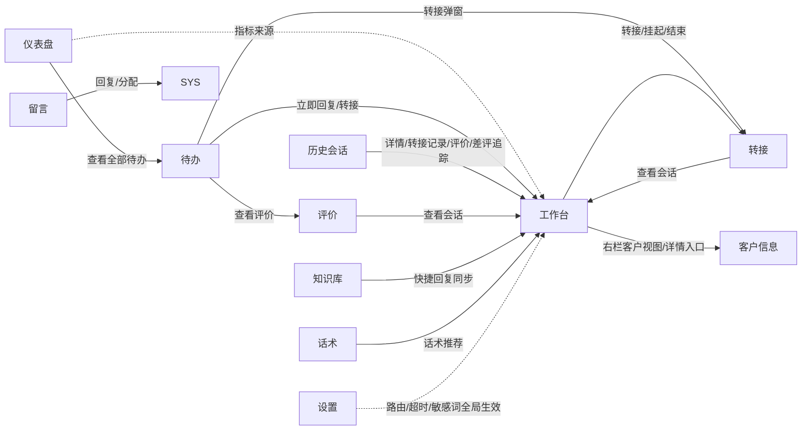
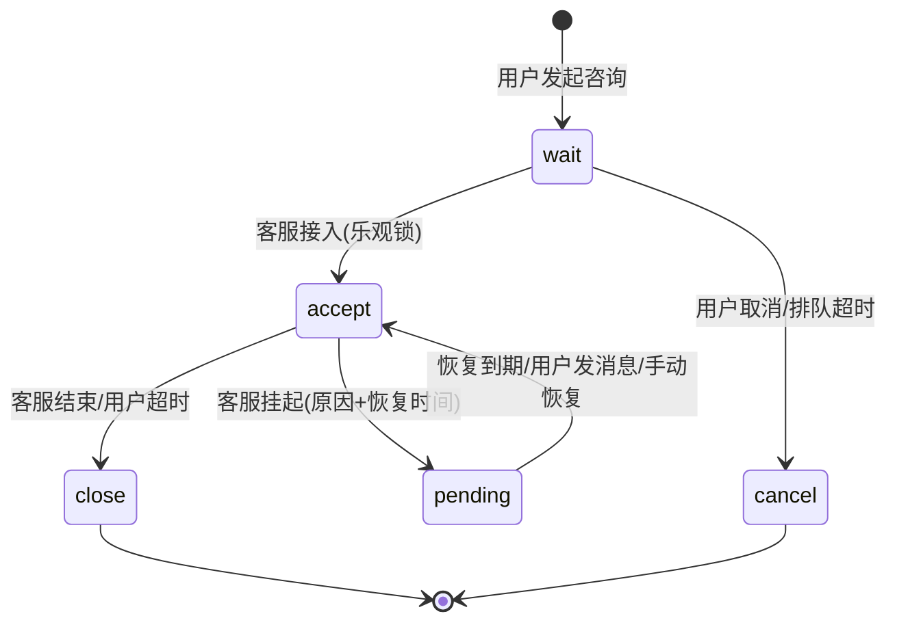

# OCS（在线客服）— 后台 PRD V2.0

> **版本**：后台 V2.0（重写稿） | **最后更新**：2026-06-18
> **本稿定位**：重写「一期后台」的产品需求，**替代 `PRD-OCS-V1.0.md` 中与后台相关的全部内容**（V1.0 的工作台 / 会话服务 / 内容配置三模块）。V1.0 后台部分的主要问题：① 功能与 admin 原型对不上（凭印象写，字段/状态/默认值多处偏差）；② 后台与用户端混在一篇、不够聚焦；③ 功能范围需重新界定。本稿全部修正。
> **范围口径**：**一期后台 11 个模块** = 侧边栏导航 10 页（数据仪表盘 / 客服工作台 / 待办事项 / 历史会话 / 会话转接 / 评价管理 / 留言管理 / 知识库 / 话术库 / 系统设置）+ 客户信息页（不在导航，从工作台进入，本期作为独立模块纳入）。用户端、2/3 期（工单/AI/绩效看板/技能组等）一律 Out of Scope。
> **事实来源**：功能清单以 `prototype-cs/admin/` 11 个原型 HTML 为准（逐页提取）。凡原型未实现、但 PRD 需要约束的点，统一用「📝 待补」标注，不冒充原型既有。
> **角色口径**：沿用 3 角色 C/A/SYS（C=终端用户 / A=客服 / SYS=客服主管），后台聚焦；C（用户）仅在与后台交互边界处出现。
> **模块简称**：本稿各模块以中文简称指代——仪表盘 / 工作台 / 待办 / 历史会话 / 客户信息 / 转接 / 评价 / 留言 / 知识库 / 话术 / 设置（见 §1.1「简称」列）。
> **原则**：一页纸讲清楚，图大于文，只写差异不写常识，只写原型真实存在的功能。

---

## 目录

- [一、范围边界](#一范围边界)
  - [1.1 本次做（In Scope）](#11-本次做in-scope)
  - [1.2 本次不做（Out of Scope）](#12-本次不做out-of-scope)
- [二、角色列表](#二角色列表)
- [三、后台总览与导航结构](#三后台总览与导航结构)
- [模块 · 数据仪表盘](#模块--数据仪表盘)
- [模块 · 客服工作台](#模块--客服工作台)
- [模块 · 待办事项](#模块--待办事项)
- [模块 · 历史会话](#模块--历史会话)
- [模块 · 客户信息](#模块--客户信息)
- [模块 · 会话转接](#模块--会话转接)
- [模块 · 评价管理](#模块--评价管理)
- [模块 · 留言管理](#模块--留言管理)
- [模块 · 知识库](#模块--知识库)
- [模块 · 话术库](#模块--话术库)
- [模块 · 系统设置](#模块--系统设置)
- [四、单据流转](#四单据流转)
- [五、接口时序](#五接口时序)
- [六、实时通信](#六实时通信)
- [检查清单（自查）](#检查清单自查)

---

## 一、范围边界

### 1.1 本次做（In Scope）

| 编号 | 模块 | 简称 | 页面文件 | 功能点 | 优先级 |
|------|------|:-:|------|--------|:-:|
| B-01 | 数据仪表盘 | 仪表盘 | `admin-dashboard.html` | 运营驾驶舱：4 核心指标卡 + 会话量趋势 + 满意度排行 + 待办汇总 + 今日概况 | P0 |
| B-02 | 客服工作台 | 工作台 | `admin-workbench.html` | 三栏接待：会话列表（4 状态 Tab）+ 聊天窗（收发/撤回/脱敏/富媒体卡片）+ 客户信息（4 Tab）+ 挂起/转接/结束 | P0 |
| B-03 | 待办事项 | 待办 | `admin-todo.html` | 三列集中处理：未回复消息 / 超时预警（3 类阈值）/ 待评价会话（3 态） | P0 |
| B-04 | 历史会话 | 历史会话 | `admin-session-list.html` | 历史服务记录多维筛选 + 详情/转接记录/查看评价/差评追踪 + 导出 | P0 |
| B-05 | 客户信息 | 客户信息 | `admin-customer-info.html` | 360° 画像 4 Tab（基础/行为/交易/服务），多源聚合 + 按源独立降级 | P0 |
| B-06 | 会话转接 | 转接 | `admin-transfer.html` | 转接记录 + 在线客服负载面板 + 发起转接 + TTL 回退策略 | P0 |
| B-07 | 评价管理 | 评价 | `admin-rating-mgmt.html` | 评价监控（评分分布/排行）+ 筛选 + 差评追踪（rate≤2）+ 催评转化率 | P0 |
| B-08 | 留言管理 | 留言 | `admin-leave-mgmt.html` | 留言分配/回复/标记无效状态机（强制先分配才能回复） | P0 |
| B-09 | 知识库 | 知识库 | `admin-knowledge.html` | FAQ 文章（分类树+富文本+审核闭环）+ 快捷回复管理 | P1 |
| B-10 | 话术库 | 话术 | `admin-scripts.html` | 场景×业务双维度话术管理 + 变量替换 + 关键词匹配 | P1 |
| B-11 | 系统设置 | 设置 | `admin-settings.html` | 欢迎语/离线语/路由规则/会话超时/敏感词，dirty 保存 | P1 |

> **客户信息页归属**：`admin-customer-info.html` 不在侧边栏导航（`nav.js` 全文无此条目），由工作台进入（页面顶部 `.back-link`「← 返回工作台」佐证），属详情型页面。本期按用户决策**作为独立模块（客户信息）纳入**，与工作台右栏内联客户视图区分（见 [模块 · 客户信息](#模块--客户信息) 差异说明）。

### 1.2 本次不做（Out of Scope）

> 口径：本稿只覆盖后台一期。以下不在本稿，原样保留以 <span style="color:#999">灰字</span> 提示，供后续版本参考。

**用户端（另一篇 PRD）**：
- <span style="color:#999">用户端咨询入口/聊天主界面、FAQ 自助、离线留言提交、服务评价提交（产出方，消费方为本稿后台）</span>

**2 期 · 体验提升**：
- <span style="color:#999">工单系统（`admin-ticket.html` 为占位页，42~110 行无实质）、客服账号管理/技能组（`admin-staff.html` 占位）、渠道接入（`admin-channel.html` 占位）、实时监控/个人绩效/预警看板、客户标签体系（客户信息页已埋标签入口，标 V2）、三方会话、消息预显、AI 辅助右栏</span>

**3 期 · AI 智能化**：
- <span style="color:#999">`ai-bot-config.html` / `ai-quality.html` / `ai-report.html` / `ai-scene.html`（文件保留，已从侧边栏隐藏）、智能质检、报表看板、机器人配置</span>

> 仪表盘「今日概况」中出现的「AI 托管会话 142 / 11%」为**指标占位**，不代表一期上线 AI（3 期）；本稿在数据仪表盘模块字段表中标注其为预留字段。

---

## 二、角色列表

| 角色 | 代号 | 后台职责 |
|------|:-:|------|
| 终端用户 | C | 后台各模块的数据产出方（发消息、提留言、提交评价）；本稿仅在与后台交互边界处出现 |
| 客服 | A | 工作台接待、待办处理、转接发起、消息撤回/脱敏、留言回复（分配后）|
| 客服主管 | SYS | 主管人工（路由/敏感词/知识库审核/留言分配/话术/系统设置/质检）+ 后端自动（cron 超时关闭/TTL 回退/WS 推送/敏感词过滤，按主管配置执行）|

> 客服后台集成于供应链系统，登录/鉴权/退出由供应链统一负责，本稿不设登录模块。

### 测试账号

| 账号 | 姓名 | 角色 | 用途 |
|------|------|------|------|
| 管理端测试号 | 王小明 / 张小明 / 刘洋 等 | A / SYS | 后台 11 模块全流程（原型内 Mock 账号）|

---

## 三、后台总览与导航结构

侧边栏由 `nav.js` 统一渲染（`#sidebar-nav` + `data-active`），分三组：

```
工作台        数据仪表盘  客服工作台(新页签)  待办事项
服务管理      历史会话    会话转接            评价管理    留言管理
配置          知识库      话术库              系统设置
（隐藏）      工单(2期) AI组(3期)
```

**页面间主联动**（后台内部）：



> **关键约定**：客服工作台为常驻全屏工作页签——侧边栏默认收起（`.admin-sidebar` `translateX(-208px)`，由 `.sidebar-trigger` 浮层展开），在工作台内点任何菜单都新开页签，不离开工作台。其余 10 页侧边栏常驻。

---

# 模块 · 数据仪表盘

客服主管运营驾驶舱。4 核心指标卡 + 会话量趋势 + 满意度排行 + 待办汇总 + 今日概况。只读展示，出口为待办页。

## 仪表盘.1 功能用例与验收

| 编号 | 角色 | 场景 | 动作 | 预期结果 |
|------|------|------|------|----------|
| UC-仪表盘-01 | A | 查看核心指标 | 进入仪表盘 | 4 张指标卡：今日会话数 / 在线客服数(X/24) / 平均响应时长 / 满意度评分(X.XX/5.0)，各带环比趋势箭头 |
| UC-仪表盘-02 | A | 查看会话量趋势 | 进入仪表盘 | 按小时柱状图（柱顶数值 + 时间刻度）|
| UC-仪表盘-03 | A | 切换趋势视图 | 点「今天 / 近7天」按钮 | 互斥切换选中态 + toast「已切换至 XXX 视图」 |
| UC-仪表盘-04 | A | 查看满意度排行 | 进入仪表盘 | 排行列表（排名 + 头像 + 姓名·工单数 + 进度条 + 满意度%）|
| UC-仪表盘-05 | A | 查看待办汇总 | 进入仪表盘 | 5 类待办计数（超时未响应/待转接/差评/未读留言/知识库待审核）|
| UC-仪表盘-06 | A | 跳转待办 | 点「查看全部待办 →」 | 跳转 `admin-todo.html` |
| UC-仪表盘-07 | A | 查看今日概况 | 进入仪表盘 | 6 项（当前排队/已接入/已关闭/转接次数/AI 托管/首次响应率），排队项橙色高亮 |

### 验收标准

| 编号 | 对应用例 | Given | When | Then |
|------|:------:|-------|------|------|
| AC-仪表盘-01 | UC-仪表盘-01 | 进入仪表盘 | 页面加载 | 4 指标卡渲染：icon 颜色 blue/green/orange/purple；趋势 `metric-trend up`(▲)/`down`(▼) |
| AC-仪表盘-02 | UC-仪表盘-03 | 趋势卡按钮组 | 点未选中按钮 | 该按钮加 `btn-primary`、原选中回退 `btn-default`；toast「已切换至 [按钮文本] 视图」|
| AC-仪表盘-03 | UC-仪表盘-06 | 待办汇总区 | 点 `.view-all-link` | 跳转 `admin-todo.html`（纯 a 跳转，无拦截）|
| AC-仪表盘-04 | UC-仪表盘-01 | 页面加载 | 实时标签 | `.live-tag::before` 绿点 pulse 动画（1→0.4→1，1.5s）|

## 仪表盘.2 核心流程

只读驾驶舱，无状态流转。唯一交互为趋势/排行按钮切换 + 待办跳转。

## 仪表盘.3 数据流向

> 📝 **待补**：原型为静态写死（Mock），无真实接口调用。下表字段为 PRD 落库口径（原型未显式声明接口），供后端实现。

| 字段中文名 | 类型 | 取值/口径 | 来源 | 去向 |
|-----------|------|----------|------|------|
| 今日会话数 | number | 当日新建会话计数（不含 cancel） | `customer_chat_sessions` | 指标卡 + WS 实时推送 |
| 在线客服数 | number | WS 连接客服数 / 上限 24 | WS `user-online` 统计 | 指标卡 `X/24` |
| 平均响应时长 | number(秒) | 客服首条回复 − 用户首条消息，取均值 | 会话消息时间差 | 指标卡 |
| 满意度评分 | number | `rate` 字段均分（1-5） | `customer_chat_messages`(type=rate) | 指标卡 `X.XX/5.0` |
| 会话量趋势 | series | 按小时会话量 | sessions 按小时聚合 | 柱状图 |
| 客服绩效 | object | 姓名 / 工单数 / 满意度% | 客服维度聚合 | 排行榜 |
| 待办分项计数 | object | 5 类（含知识库待审核）| 各业务模块聚合 | 待办汇总 |
| 今日概况 | object | 6 项（排队/已接入/已关闭/转接/AI托管/首次响应率）| 实时聚合 | 概况面板 |
| AI 托管会话 | number | 📝 3 期预留，一期指标位占位 | — | 概况「142 / 11%」 |

> 📝 **待补**：原型未给排队→接入的实时刷新策略、断连/空数据降级 UI。建议后端补 WS 推送刷新 + 超时降级占位（与 V1.0 仪表盘超时降级约定一致）。

---

# 模块 · 客服工作台

客服核心三栏工作台（左会话列表 / 中聊天窗 / 右客户信息），实时接待、消息收发与管理、挂起/转接/结束会话。

## 工作台.1 功能用例与验收

| 编号 | 角色 | 场景 | 动作 | 预期结果 |
|------|------|------|------|----------|
| UC-工作台-01 | A | 会话列表 Tab 切换 | 点「进行中/等待中/挂起/已关闭」Tab | 按 `data-status`（accept/wait/pending/close）过滤；进行中项无 data-status 也归 accept |
| UC-工作台-02 | A | 选中会话 | 点击会话项 | 全栏联动：顶栏客户名/标签、中栏消息流、右栏**基础信息**刷新 |
| UC-工作台-03 | A | 未读查看 | 会话项带 `.unread-badge` | 红底数字徽标；查看后（WS `read`）消失 |
| UC-工作台-04 | A | 发送文字 | 输入框输入 → Enter | 清空输入框；空内容（`.trim().length===0`）不发送；Shift+Enter 换行 |
| UC-工作台-05 | A | 快捷回复 | 点「快捷回复 ▾」→ 选话术 | 话术覆盖写入输入框，面板关闭，输入框获焦 |
| UC-工作台-06 | A | 撤回客服消息 | hover 客服消息「⋯」→「撤回」 | 2 分钟内：替换为「⏰ 你撤回了一条消息」，触发器隐藏；超 2 分钟：拒绝 |
| UC-工作台-07 | A | 隐藏用户消息 | hover 用户消息「⋯」→「隐藏」 | 替换为「该消息已被管理员隐藏」（灰斜体）|
| UC-工作台-08 | A | 脱敏用户消息 | hover 用户消息「⋯」→「脱敏」 | 手机号 `1[3-9]\d{9}`→前3****后4；地址→`****`；消息变黄底左橙边 |
| UC-工作台-09 | A | 发送富媒体卡片 | 点工具栏卡片按钮（订单/商品/优惠券/图片）| 生成对应卡片（颜色仅表示状态，非卡片类型）|
| UC-工作台-10 | A | 挂起会话 | 顶栏「挂起」→ 填原因 + 选恢复时间 | status=accept→pending；消息流追加挂起条；暂停无响应超时 |
| UC-工作台-11 | A | 恢复挂起 | 点挂起会话项 / 用户发新消息 / 恢复时间到期 | status=pending→accept；消息流追加恢复条；重新计入超时 |
| UC-工作台-12 | A | 转接会话 | 顶栏「转接」→ 选目标 + 原因 + 备注 | 创建转接单，消息流追加转接条 |
| UC-工作台-13 | A | 结束会话 | 顶栏「结束」→ 确认 | status=close；向用户推送满意度评价邀请 |
| UC-工作台-14 | A | 查看客户信息 | 右栏切 4 Tab（基础/行为/交易/服务）| 切换对应面板 |

### 验收标准

| 编号 | 对应用例 | Given | When | Then |
|------|:------:|-------|------|------|
| AC-工作台-01 | UC-工作台-01 | 会话列表 | 点 Tab | active Tab 加 `.active`（下划线 60% 宽）；按 `data-status` 显隐；accept Tab 显示无 data-status 项 |
| AC-工作台-02 | UC-工作台-02 | 会话列表 | 点会话项 | 当前项加 `.active`（左 3px 主色条 + 主色底）；顶栏/消息流/右栏**基础信息**联动刷新 |
| AC-工作台-03 | UC-工作台-04 | 输入框 | 输入文字按 Enter | 清空输入框（注释：无真实后端）；空 trim 不清空；Shift+Enter 换行 |
| AC-工作台-04 | UC-工作台-06 | 客服消息（sent_ts 存在）| 点撤回 | `elapsed ≤ 120s`：气泡/卡片替换为 `.msg-recalled`「⏰你撤回了一条消息」，`.msg-content` 加 `.is-recalled`，触发器隐藏；`elapsed > 120s`：alert「撤回失败…仅允许 2 分钟内消息撤回」并 return |
| AC-工作台-05 | UC-工作台-08 | 用户消息含手机号 | 点脱敏 | 手机号正则 `1[3-9]\d{9}`→`前3****后4`；地址正则→`****`；替换为 `.msg-redacted`（黄底 + 左 3px 橙边）|
| AC-工作台-06 | UC-工作台-10 | accept 会话 | 点挂起 → 原因为空点确认 | 原因框 `borderColor: danger` + focus（必填）；填后确认 → status=pending，追加 `.suspend-notice` |
| AC-工作台-07 | UC-工作台-11 | pending 会话 | 用户发新消息 / 恢复到期 / 点恢复 | status→accept，追加 `.resume-notice`「重新计入超时」|
| AC-工作台-08 | UC-工作台-12 | accept 会话 | 转接 → 目标为空点确认 | 目标框红边（必填）；填后确认 → 追加 `.suspend-notice` 转接条 |
| AC-工作台-09 | UC-工作台-13 | accept/pending 会话 | 点结束 → 确认 | status=close，追加 `.resume-notice`「已向用户推送满意度评价邀请」|

## 工作台.2 核心流程

### 工作台.2.1 状态流转

| 对象 | 状态1 | → 状态2 | 触发 | 角色 | 守卫 |
|------|-------|---------|------|------|------|
| 会话 | — | wait | 用户发起咨询 | C | 无活跃会话 |
| 会话 | wait | accept | 客服接入 | A | 乐观锁（未被他人接入）|
| 会话 | accept | pending | 客服挂起（原因 + 恢复时间）| A | 暂停无响应超时 |
| 会话 | pending | accept | 恢复到期 / 用户发新消息 / 手动恢复 | SYS/C/A | 用户行为优先于定时 |
| 会话 | accept/pending | close | 客服结束 / 用户超时 | A/SYS | 结束即推评价邀请 |
| 会话 | wait | cancel | 用户取消 / 排队超时 | C/SYS | — |

### 工作台.2.2 异常与边界

| 场景 | 处理 |
|------|------|
| 撤回时间戳缺省 | 📝 **待补口径**：原型注释「缺省视为已超时」，但代码 `if(sentTs)` 实为缺省放行。**本稿统一约定：无时间戳视为已超时，拒绝撤回**（以注释口径为准），后端实现须保证消息落库时带 `sent_ts`。 |
| 行为/交易/服务三栏不联动 | 原型右栏仅「基础信息」随客户切换刷新，行为/交易/服务恒显示默认客户 Mock。📝 **待补**：若要求四栏全联动，属增量需求。 |
| 富媒体卡片颜色 | 原型 CSS 注释「统一中性卡，颜色只用于状态」。卡片本身中性，状态用色（s-warn/s-proc/s-done/s-danger/s-closed）。 |
| 转接回退 | 转接弹窗 `.tf-tip` 提示「超时将触发回退策略」，但回退策略 UI/逻辑在工作台无体现 → 见 [模块 · 会话转接](#模块--会话转接)。 |

## 工作台.3 数据流向

> 📝 **待补**：原型工作台**未出现任何 `/api/backend/...` 接口路径，也未出现 WS action**，发送消息脚本注释明确 `// no real backend`。下表为 PRD 基于视觉规格定义的接口契约，非还原已有。

### 工作台.3.1 数据责任

| 业务数据 | A | SYS |
|---------|---|-----|
| 会话列表 | 查看/转接/挂起/结束 | 状态流转/超时关闭 |
| 聊天消息 | 收发/撤回/隐藏/脱敏 | 落库/敏感词过滤/已读同步 |
| 客户视图 | 查看（右栏）| 多源聚合/降级 |

### 工作台.3.2 字段说明

| 字段 | 类型 | 取值 | 来源 | 去向 |
|------|------|------|------|------|
| 会话状态 | data-status | accept/wait/pending/close | 状态机 | 左栏 Tab 分组 + 会话项样式 |
| 未读数 | number | ≥0 | messages `is_read=0` 且来源=用户 | `.unread-badge` |
| 撤回窗 | constant | 120 秒 | `RECALL_WINDOW` | 撤回校验 |
| 恢复时间 | enum | 15/30/60 分钟（默认 30）| 挂起弹窗 `.sm-radio` | pending 倒计时；对应系统设置 `pending_resume_default` |
| 富媒体卡片 type | enum | order/product/coupon | 工具栏 | 中栏卡片渲染 |
| 客户基础字段 | — | 手机号(脱敏)/会员等级/积分/来源渠道/地区/实名/标签 | 会员库 | 右栏基础 Tab |

> 富媒体卡片 JSON（订单/商品/优惠券）字段以工作台 DOM 还原为准，含 `type/type_label/state(状态色)/body(订单号/商品/SKU/金额…)/footer(操作按钮)`。用户端卡片渲染口径见用户端 PRD；后台发送侧字段须与之对齐。

---

# 模块 · 待办事项

客服/主管待办集中处理看板，三列分流：未回复消息 / 超时预警（3 类）/ 待评价会话（3 态）。

## 待办.1 功能用例与验收

| 编号 | 角色 | 场景 | 动作 | 预期结果 |
|------|------|------|------|----------|
| UC-待办-01 | A | 未回复-立即回复 | 未回复列点「立即回复」 | 跳转工作台定位该会话 |
| UC-待办-02 | A | 超时-接入 | 超时列点「立即接入/接入」 | 接入会话，移出队列，计数自减 |
| UC-待办-03 | A | 超时-催办 | 超时列点「催办」 | toast「已催办，将再次提醒客服响应」 |
| UC-待办-04 | A | 超时-转接 | 超时列点「转接」 | 弹出转接弹窗（`modal-transfer.html`）|
| UC-待办-05 | A | 待评价-筛选 | 点「全部/待评价/已跳过/已评价」 | 按 `data-status`(all/pending/skipped/done) 过滤 |
| UC-待办-06 | A | 待评价-催评 | 点「催评」/「一键催评全部」 | 向用户端推送评价邀请（不删行）|
| UC-待办-07 | A | 待评价-关闭 | 点「关闭」 | 移除行 + 列计数自减 + 顶部统计卡自减 |

### 验收标准

| 编号 | 对应用例 | Given | When | Then |
|------|:------:|-------|------|------|
| AC-待办-01 | UC-待办-02 | 超时行 | 点接入 | toast「已接入 [姓名] 的会话」；行 `removeRow`（opacity→0→display:none）+ 列 `.count-pill` −1 |
| AC-待办-02 | UC-待办-05 | 待评价列 | 点筛选标签 | 互斥高亮（primary 底白字 vs 灰底）；按 `data-status` 显隐行 |
| AC-待办-03 | UC-待办-06 | 待评价行 | 点催评 | toast「已向 [姓名] 发送催评邀请」，行保留；跳过态仍可催评 |
| AC-待办-04 | UC-待办-07 | 待评价行 | 点关闭 | `removeRow` + 列计数 −1 + `bumpStatByName('待评价', -1)` + toast「已关闭该未评价会话」|
| AC-待办-05 | UC-待办-01 | 紧急行 | 渲染 | `.urgency.high`（danger 底 + `#ffccc7` 边）+ `.countdown`「已超 N 分钟」+ 行 border-left danger |

## 待办.2 核心流程

### 待办.2.1 超时预警三类阈值

| 类型 | 阈值（原型写死）| 着色 | 触发 |
|------|------|------|------|
| 会话超时（静默）| 15 分钟 | danger 红底 | 客服最后回复后用户无响应 |
| 响应超时（首次响应）| 5 分钟 | orange 临界 | 用户首条消息后客服未响应 |
| 排队超时 | 4 分钟 | orange 临界 | 会话 wait 超时 |

> 阈值与 [模块 · 系统设置](#模块--系统设置) 系统设置联动：`idle_timeout`(静默)/首次响应/排队/`queue_timeout`。原型为写死文案，📝 **待补**：阈值应改为读取系统设置。

### 待办.2.2 评价状态流转

| 对象 | 状态1 | → 状态2 | 触发 | 守卫 |
|------|-------|---------|------|------|
| 评价 | — | pending(待评价) | 会话 close | cancel 不生成 |
| 评价 | pending | done(已评价) | 用户提交评价 | — |
| 评价 | pending | skipped(已跳过) | 用户跳过 / 超时 | — |
| 评价 | skipped | pending(再邀请) | 客服催评 | 仅再次邀请，不改业务状态 |

### 待办.2.3 异常与边界

| 场景 | 处理 |
|------|------|
| 关闭无二次确认 | 原型「关闭」直接移除行，无确认弹窗。📝 **待补**：建议补「确认关闭」守卫，避免误关未评价会话。 |
| 催评转化率口径 | `已评价 /（已评价 + 已跳过）`，列底展示（如 62%）。 |
| 角色权限 | 顶部显示「客服A」（普通客服），但页面含催办/转接/一键催评/设置规则等主管级操作。📝 **待补**：需澄清客服可见 vs 主管可见的操作子集。 |

## 待办.3 数据流向

| 业务数据 | A | SYS |
|---------|---|-----|
| 未回复消息 | 回复 | 推送/排队 |
| 超时预警 | 接入/催办/转接 | cron 扫描生成 |
| 待评价会话 | 催评/关闭 | 评价状态流转/超时归跳过 |

| 字段 | 类型 | 取值 | 说明 |
|------|------|------|------|
| 紧急度 urgency | enum | high/medium/low | 决定行着色与排序 |
| 评价状态 data-status | enum | pending/skipped/done | 待评价列筛选与三态计数 |
| 超时类型 | enum | session/response/queue | 对应三类阈值 |
| 催评转化率 | number | 已评价/(已评价+已跳过) | 列底统计 |

---

# 模块 · 历史会话

历史服务记录查询页：多维筛选 + 会话详情/转接记录/查看评价/差评追踪 + 导出。

## 历史会话.1 功能用例与验收

| 编号 | 角色 | 场景 | 动作 | 预期结果 |
|------|------|------|------|----------|
| UC-历史会话-01 | A | 统计摘要 | 进入页面 | 5 项：总会话/进行中/已关闭/已转接/平均评分 |
| UC-历史会话-02 | A | 筛选查询 | 设日期/客服/关键词 + 状态 Tab → 查询 | 列表按组合条件过滤；支持重置 |
| UC-历史会话-03 | A | 查看详情 | 行「详情」 | 弹窗 `modal-session-detail.html?type=detail` |
| UC-历史会话-04 | A | 查看转接记录 | 行「转接记录」 | 弹窗 `?type=transfer` |
| UC-历史会话-05 | A | 查看评价 | 行「查看评价」 | 弹窗 `?type=rating` |
| UC-历史会话-06 | A | 差评追踪 | 差评行（≤2 星）「差评追踪」 | 弹窗 `modal-bad-rating.html` |
| UC-历史会话-07 | A | 导出/刷新 | 点导出/刷新 | toast 反馈 |

### 验收标准

| 编号 | 对应用例 | Given | When | Then |
|------|:------:|-------|------|------|
| AC-历史会话-01 | UC-历史会话-02 | 列表 | 输入关键词点查询 | 按 `textContent` 行内全文匹配（用户昵称/会话ID/手机号）；无匹配→空状态 |
| AC-历史会话-02 | UC-历史会话-02 | 列表 | 切换状态 Tab | 4 Tab（全部/进行中/已关闭/已转接）按 `data-status`(ongoing/closed/transferred/cancelled) 过滤 |
| AC-历史会话-03 | UC-历史会话-06 | 评分 ≤2 行 | 渲染 | 操作列多出「差评追踪」链接（`.sl-track`），好评/中评行无此入口 |
| AC-历史会话-04 | UC-历史会话-02 | 已取消行 | 渲染 | 操作列仅「详情」，无第二链接 |

> 📝 **与 V1.0 差异（必须修正）**：V1.0 历史会话筛选列了「来源入口/消息类型/是否有评价/满意度/是否转接」等维度，**原型实际只有 4 维筛选（日期/客服/关键词/状态 Tab）**。其余维度（来源入口、消息类型、是否有评价、满意度区间、是否转接）原型未做，属增量需求，不在一期范围内。满意度/是否转接以**列视觉呈现 + 行操作按需出现**（差评追踪仅 ≤2 星行）表达，非独立筛选条件。

## 历史会话.2 核心流程

查询终点页，无状态流转。会话状态枚举（底部原文）：`wait → accept → close / cancel`；展示态映射 ongoing/closed/transferred/cancelled。

## 历史会话.3 数据流向

| 字段 | 取值 | 说明 |
|------|------|------|
| 会话 ID | `#CS` + yyyyMMdd + 序号 | `col-id` |
| 用户列 | 头像 + 昵称 + 会员等级(VIP1~4/普通) + 脱敏手机 `138****2891` | `col-user` |
| 客服列 | 单名 或 转接双名「张小明 → 李静」 | — |
| 状态 s-tag | ongoing/closed/transferred/cancelled | 4 态配色 |
| 评分 | 1-5 星 或 `未评价`（`.no-rate`）| — |

> 数据来源：`customer_chat_sessions`；转接记录见 `customer_chat_transfers`（底部原文）。

---

# 模块 · 客户信息

单个客户 360° 画像聚合页，4 Tab（基础/行为/交易/服务），数据来自会员库/埋点/OMS/客服库，按源独立降级。**不在侧边栏导航，从工作台进入。**

## 客户信息.1 功能用例与验收

| 编号 | 角色 | 场景 | 动作 | 预期结果 |
|------|------|------|------|----------|
| UC-客户信息-01 | A | 查看客户概要 | 进入页面 | 蓝色概要卡：头像 + 昵称 + 脱敏手机 + 会员等级 + 标签 + 快捷操作（发消息/建工单/加标签）|
| UC-客户信息-02 | A | 切换 4 Tab | 点基础/行为/交易/服务 | 切换对应面板，3 个 Tab 带计数角标 |
| UC-客户信息-03 | A | 数据源降级 | 某 Tab 数据源超时 | 红色错误图标 + 「数据加载失败」+ 源名 + 「重新加载」 |
| UC-客户信息-04 | A | 重新加载 | 错误态点「重新加载」 | 重置该源为正常态，恢复内容 |
| UC-客户信息-05 | A | 返回工作台 | 点「← 返回工作台」 | 返回来源页 |

### 验收标准

| 编号 | 对应用例 | Given | When | Then |
|------|:------:|-------|------|------|
| AC-客户信息-01 | UC-客户信息-02 | 4 Tab | 点 tab-item | 按 `data-tab`(basic/behavior/trade/service) 切 `.active`；选中 Tab 计数角标蓝底 |
| AC-客户信息-02 | UC-客户信息-03 | 某 Tab 源超时 | 渲染 | `.tab-error[data-source]` 显示：红叉 + 「数据加载失败」+「[源名] 响应超时，请稍后重试」+「重新加载」 |
| AC-客户信息-03 | UC-客户信息-03 | 多源 | 任一源失败 | 仅该 Tab 报错，其他 Tab 不受影响（按源独立降级）|
| AC-客户信息-04 | UC-客户信息-04 | 错误态 | 点重新加载 | `retryLoad` 重置源为 ok，还原内容 |

## 客户信息.2 核心流程

### 客户信息.2.1 4 Tab 数据源与降级

| Tab | 数据源（错误文案）| 接口 | Mock 占位 |
|-----|------|------|:-:|
| 基础信息 | 商城会员库 / 用户系统 | — | 无横幅（视为可直连）|
| 行为轨迹 | 埋点系统 | `GET /api/user/behavior` | 📝 Mock 横幅 |
| 交易记录 | OMS/订单库 | `GET /api/user/transactions`（与工作台订单卡共享）| 📝 Mock 横幅 |
| 服务历史 | 客服数据库 | — | 无横幅（视为可直连）|

> **关键契约**：交易 Tab 与工作台 US-MVP-17 订单卡片**共享 `GET /api/user/transactions`** 接口（原型 Mock 横幅明示），接口章节不得重复定义。

### 客户信息.2.2 异常与边界

| 场景 | 处理 |
|------|------|
| 降级粒度 | 按源独立降级，**未做**「全失败仅留基础信息」全局兜底。📝 **待补**：如需全局兜底属增量。 |
| 超时阈值 | 原型仅文案「响应超时」，无具体毫秒数。📝 **待补**：建议约定（如 2s）。 |
| 标签体系 | 基础 Tab 已实装标签 pill + 来源统计（自动 5 + 手动 2）+「管理」入口；`index.html` 将「标签体系」标为 V2/future。本期标签为**只读展示 + 占位入口**，完整标签管理属 2 期。 |

## 客户信息.3 数据流向

| Tab | 关键字段 |
|-----|---------|
| 基础 | 个人资料（昵称/手机/注册时间/渠道/实名）/ 会员信息（等级/积分/成长值进度/有效期/专属客服）/ 联系方式（手机/邮箱/微信/地址/语言）/ 客户标签 |
| 行为 | 4 stat-mini（浏览/加购/收藏/搜索词）+ 常逛分类 + 高频搜索词 + 近 7 天时间线（action: view/search/cart/order）|
| 交易 | 3 汇总（累计消费/订单数/退换货）+ 订单表 6 列（订单号/商品/金额/下单时间/状态/操作），状态：待付款/配送中/已完成/已退款/已换货 |
| 服务 | 4 统计（咨询次数/平均满意度/平均首次响应/平均时长）+ 历史咨询卡片（会话 ID/状态/消息数/时长/摘要/评价星级/接待客服）|

> **与工作台右栏内联视图的区别**：工作台右栏是会话上下文驱动的**轻量摘要**；本页是完整 360° 画像（4 Tab + 时间线 + 订单表 + 服务史 + 评价）。二者共用交易接口，但本页为详情型、从工作台进入。

---

# 模块 · 会话转接

转接记录管理 + 在线客服负载监控 + 发起转接 + TTL 回退策略。

## 转接.1 功能用例与验收

| 编号 | 角色 | 场景 | 动作 | 预期结果 |
|------|------|------|------|----------|
| UC-转接-01 | A | 查看转接统计 | 进入页面 | 5 项：累计/待处理/已接受/已拒绝/成功率 |
| UC-转接-02 | A | 筛选转接记录 | 设原客服/目标客服/原因 + 状态 Tab → 查询 | 列表过滤；支持重置 |
| UC-转接-03 | A | 查看客服负载 | 右栏在线客服面板 | 头像/角色组/技能/容量条/统计/状态；可排序（负载/技能/评分）|
| UC-转接-04 | A | 配置回退 | 设置 TTL(1~60 默认5) + 回退策略(3 选 1) | toast 反馈 |
| UC-转接-05 | A | 发起转接 | 点「发起转接」→ 弹窗选目标 + 原因 + 备注 → 确认 | 表头插入待处理行（黄底 + TTL 角标），计数自增 |
| UC-转接-06 | A | 催办 | 待处理行「催办」 | toast「已催办」 |
| UC-转接-07 | A | 查看会话 | 行「查看会话」 | 跳转 `admin-workbench.html?session=<id>` |
| UC-转接-08 | A | 取消转接 | 待处理行「取消」 | 状态→已取消，操作仅剩详情 |
| UC-转接-09 | A | 重新转接 | 超时行「重新转接」 | 弹窗，确认后状态回待处理 + 新 TTL |

### 验收标准

| 编号 | 对应用例 | Given | When | Then |
|------|:------:|-------|------|------|
| AC-转接-01 | UC-转接-03 | 在线客服面板 | 渲染 | 容量条绿(<50%)/黄(50~100%)/红(满载)；满载卡（如 10/10）「选为目标」disabled + 「无法转接」(`cursor:not-allowed`) |
| AC-转接-02 | UC-转接-05 | 在线面板 | 点满载卡「选为目标」 | 按钮 disabled，不可选 |
| AC-转接-03 | UC-转接-05 | 顶部 | 点发起转接 → 确认 | `addPendingRow`：表头插黄底行 + 状态「待处理 ⏱ 剩余 5:00」+ 原因映射 + Tab/Stat/PgInfo 计数 +1 |
| AC-转接-04 | UC-转接-08 | 待处理行 | 点取消 | 状态格→`cancelled` 已取消 + `data-status=cancelled` + 操作仅「详情」+ 去黄底 |
| AC-转接-05 | UC-转接-09 | 超时行 | 点重新转接 → 确认 | `setRowPending`：状态回「待处理 + ⏱剩余 5:00」+ 目标更新 + 操作恢复「催办/详情/取消」+ 黄底 |

## 转接.2 核心流程

### 转接.2.1 转接单状态机

| 状态1 | → 状态2 | 触发 | 角色 | 守卫 |
|-------|---------|------|------|------|
| — | pending(待处理) | 发起转接 / 重新转接 | A | 目标容量 < 上限 |
| pending | accepted(已接受) | 目标接受 | A | 并发乐观锁 |
| pending | rejected(已拒绝) | 目标拒绝 / 满载自动 | A | — |
| pending | cancelled(已取消) | 源点取消 / 客户取消 | A/C | — |
| pending | timeout(超时) | TTL 到期无响应 | SYS | 默认 5 分钟（1~60 可配）|

> **状态枚举 6 态**：pending/accepted/rejected/cancelled/timeout（+ 统计 success）。原型 `rejected` 有枚举与计数但**无示例行**展示。

### 转接.2.2 回退策略（TTL 到期）

| 策略 | 说明 |
|------|------|
| 回退至原客服 | 会话自动归还原客服 |
| 重新排队分配 | 进入排队队列，由路由引擎重分 |
| 自动取消并通知 | 转接取消，原客服 + 用户均收到通知 |

> 建议文案：高峰期用「重新排队分配」，低峰期用「回退至原客服」。

### 转接.2.3 异常与边界

| 场景 | 处理 |
|------|------|
| 满载目标 | 前端硬阻断（按钮 disabled + 灰字）|
| 容量上限 | 原型硬编码 10，阈值 50%/100% 写死。📝 **待补**：应参数化为系统设置 `max_sessions`。 |
| TTL 倒计时 | 原型为静态文本「⏱ 剩余 3:42」，非真实计时。📝 **待补**：实时倒计时属增量。 |
| 转接原因码 | 4 类：VIP/技能/繁忙/超时。「客户主动取消」仅作 cancelled 状态的 reason 文案，非独立原因码。 |
| 卡片「选为目标」 | 仅预选/可视化，**真正发起走顶部「发起转接」弹窗**。 |

## 转接.3 数据流向

| 字段 | 取值 | 说明 |
|------|------|------|
| 转接状态 t-tag | pending(黄)/accepted(蓝)/rejected(红)/cancelled(灰)/timeout(橙) | 6 态配色 |
| 转接原因 reason-tag | vip/skill/busy/timeout | 4 类 |
| 客服负载 | cur/max(默认10) | 容量条 |
| TTL | 1~60 分钟（默认 5）| input min/max |
| 成功率 | 已完成/(已完成+已拒绝+已取消) | 统计 |

> 数据来源：`customer_chat_transfers`；WS Action：`user-transfer`（底部原文）。

---

# 模块 · 评价管理

用户评价监控：评分分布 + 客服满意度排名 + 筛选 + 差评追踪 + 催评转化率。

## 评价.1 功能用例与验收

| 编号 | 角色 | 场景 | 动作 | 预期结果 |
|------|------|------|------|----------|
| UC-评价-01 | A | 查看评价指标 | 进入页面 | 4 指标：平均满意度/累计评价数/差评数(≤2星)/催评转化率 |
| UC-评价-02 | A | 查看评分分布 | 进入页面 | 5 行（5★~1★ 占比），≤2 星红色渐变 |
| UC-评价-03 | A | 查看客服排名 | 进入页面 | 客服满意度排名表（评价数/平均分/差评数）|
| UC-评价-04 | A | 筛选评价 | 设日期/客服/评分 pill/关键词 + 状态 Tab → 查询 | 列表过滤 |
| UC-评价-05 | A | 差评追踪 | 差评行「差评追踪」 | 弹窗 `modal-bad-rating.html` |
| UC-评价-06 | A | 查看评价详情 | 行「详情」 | 弹窗 `?type=rating` |
| UC-评价-07 | A | 查看会话 | 行「查看会话」 | toast「正在打开会话工作台…」 |

### 验收标准

| 编号 | 对应用例 | Given | When | Then |
|------|:------:|-------|------|------|
| AC-评价-01 | UC-评价-04 | 列表 | 切状态 Tab | 4 Tab（全部/好评≥4星/中评=3星/差评≤2星）按评分桶 good/mid/bad 过滤 |
| AC-评价-02 | UC-评价-04 | 列表 | 点评分 pill | 互斥单选（全部/5星/4星/3星/差评≤2星）|
| AC-评价-03 | UC-评价-05 | 评分 ≤2 行 | 渲染 | `.bad-rating` 黄底高亮；操作列多出「差评追踪」（`.sl-track`）|

> 📝 **与 V1.0 差异（必须修正）**：V1.0 评价写了「attitude/speed/professional/solution 四维评分各 1-5」。**原型只有单一星值（1-5）+ 标签集合，未渲染四维分数**。本期评价为单一维度；四维属后端字段预留，前端不展示。

## 评价.2 核心流程

### 评价.2.1 评价状态

| 桶 | 判定 |
|----|------|
| 好评 good | score ≥ 4 |
| 中评 mid | score === 3 |
| 差评 bad | score ≤ 2（**差评判定阈值 rate ≤ 2**）|

### 评价.2.2 评价标签（3 色）

| 类 | 标签 |
|----|------|
| positive(绿) | 态度好 / 回复快 / 专业 / 有耐心 |
| neutral(蓝) | 基本解决 / 一般 |
| negative(红) | 回复慢 / 未解决 / 态度差 / 转接混乱 |

## 评价.3 数据流向

| 字段 | 取值 | 说明 |
|------|------|------|
| 评价 ID | `#RT` + yyyyMMdd + 序号 | col-id |
| 评分 | 1-5 单一星值 | `rate` 字段 |
| 评价标签 rtag | positive/neutral/negative | 3 色 |
| 差评判定 | rate ≤ 2 | — |
| 催评转化率 | 已评价/(已评价+已跳过) = 1083/1748 = 62% | **唯一口径** |

> 数据来源：`customer_chat_messages`(type=rate) 的 `rate` 字段（1-5）；标签与评论由用户端评价弹层提交。底部原文：「差评判定：rate ≤ 2」。

---

# 模块 · 留言管理

用户离线/排队超时留言的分配/回复/标记无效管理。**强制约束：必须先分配才能回复。**

## 留言.1 功能用例与验收

| 编号 | 角色 | 场景 | 动作 | 预期结果 |
|------|------|------|------|----------|
| UC-留言-01 | SYS | 查看留言统计 | 进入页面 | 4 项：待处理/处理中/已回复/无效 |
| UC-留言-02 | SYS | 筛选留言 | 设搜索/分类/处理人/时间 + 状态 Tab → 查询 | 列表过滤 |
| UC-留言-03 | SYS | 分配处理人 | 待处理行「分配」→ 抽屉选处理人 → 确认 | 状态待处理→处理中，处理人列显示，「分配」按钮消失，回复按钮解锁 |
| UC-留言-04 | SYS | 回复留言 | 处理中行「继续回复」→ 抽屉填回复 → 确认 | 状态→已回复，操作变「查看回复/详情」 |
| UC-留言-05 | SYS | 标记无效 | 待处理行「标记无效」→ 弹窗 → 确认 | 状态→无效，行变灰，操作变「详情/撤销无效」 |
| UC-留言-06 | SYS | 撤销无效 | 无效行「撤销无效」 | 状态→待处理，恢复样式 |

### 验收标准

| 编号 | 对应用例 | Given | When | Then |
|------|:------:|-------|------|------|
| AC-留言-01 | UC-留言-03 | 待处理行 | 点分配 → 确认 | `data-status`→process，文案「处理中」；`.leave-unassigned` 替换为处理人头像+姓名；「分配」按钮隐藏；回复按钮去 `disabled` 改「继续回复」|
| AC-留言-02 | UC-留言-04 | **待处理行** | 点回复按钮 | 按钮 `disabled`（`.lm-reply-btn[disabled]`），hover 显示 tooltip「请先分配处理人」；JS 守卫 `if(!disabled)` 才开抽屉 |
| AC-留言-03 | UC-留言-04 | 处理中行 | 点继续回复 → 确认 | 状态→replied，操作变「查看回复/详情」 |
| AC-留言-04 | UC-留言-05 | 待处理行 | 点标记无效 → 确认 | 状态→invalid，行 opacity:0.6 + 灰底，操作变「详情/撤销无效」 |
| AC-留言-05 | UC-留言-06 | 无效行 | 点撤销无效 | 状态→pending，恢复样式，操作恢复「分配/回复(disabled)/详情/标记无效」 |

> 📝 **与 V1.0 差异（必须修正）**：V1.0 留言状态机为 3 态（待处理/处理中/已回复）。**原型为 4 态（待处理/处理中/已回复/无效），且 invalid ↔ pending 可逆**（撤销无效）。

## 留言.2 核心流程

### 留言.2.1 留言状态机（4 态，含可逆）

| 状态1 | → 状态2 | 触发 | 角色 | 守卫 |
|-------|---------|------|------|------|
| — | pending(待处理) | 用户提交 | C | 60s 冷却防重 |
| pending | process(处理中) | 主管分配 | SYS | **强制：必须先分配** |
| process | replied(已回复) | 处理人回复 | SYS | 已分配 |
| pending | invalid(无效) | 标记无效 | SYS | 广告/骚扰/重复 |
| invalid | pending | 撤销无效 | SYS | 可逆 |

> **强制约束（双层守卫）**：① CSS `.lm-reply-btn[disabled]:hover::after { content:'请先分配处理人' }`；② JS `if (replyBtn && !replyBtn.disabled)` 才开回复抽屉；③ 后端接口须校验：待处理态直接调回复返回「请先分配处理人」。

### 留言.2.2 异常与边界

| 场景 | 处理 |
|------|------|
| 待处理直接回复 | 前端 disabled + tooltip，后端拒绝 |
| 无效留言 | 不计入考核统计 |
| 通知通道 | 原型仅文案「用户收到通知」，未实现站内信/短信/微信通道选择 UI。📝 **待补**。 |
| 留言字段 | 列表层无独立 `order_no`/`images` 列（订单号嵌 content 文本），图片在抽屉内/后端字段。 |

## 留言.3 数据流向

| 字段 | 取值 | 说明 |
|------|------|------|
| 留言状态 leave-status | pending/process/replied/invalid | 4 态配色 |
| 问题分类 | 商品咨询/订单售后/物流问题/退款退货/账户问题/其他 | 6 枚举 |
| 联系方式 | 手机号(脱敏)/邮箱(脱敏)/手机号+微信 | 3 形态 |
| 处理人 | 未分配(斜体灰)/已分配(头像+姓名) | — |

> 数据来源：用户端 `user-offline.html` 提交；接口 `/api/backend/leave/assign`、`/leave/reply`（📝 原型未出现路径，属约定）。

---

# 模块 · 知识库

顶级双 Tab：知识库（FAQ 文章 + 分类树 + 富文本 + 审核闭环）+ 快捷回复管理。

## 知识库.1 功能用例与验收

| 编号 | 角色 | 场景 | 动作 | 预期结果 |
|------|------|------|------|----------|
| UC-知识库-01 | SYS | 顶级 Tab 切换 | 点知识库/快捷回复 | 切换面板（快捷回复带 badge 86）|
| UC-知识库-02 | SYS | 分类树筛选 | 点分类节点 | 节点高亮 + 同步下拉 + 右表过滤 |
| UC-知识库-03 | SYS | 新建/编辑文章 | 点新建/编辑 | 富文本编辑器展开 |
| UC-知识库-04 | SYS | 审核文章 | 待审核行「审核」→ 通过/驳回 | 通过→已发布；驳回→已驳回 + 原因 |
| UC-知识库-05 | SYS | 上下线 | 已发布「下线」/已下线「上线」 | 状态互换 |
| UC-知识库-06 | SYS | 删除文章 | 行「删除」 | 二次确认弹窗（不可恢复）|
| UC-知识库-07 | SYS | 快捷回复管理 | 新增/编辑/启停 | 同步工作台快捷回复面板 |

### 验收标准

| 编号 | 对应用例 | Given | When | Then |
|------|:------:|-------|------|------|
| AC-知识库-01 | UC-知识库-04 | 待审核行 | 点审核 → 驳回（不填原因）| 驳回原因必填；提交通过→`s-tag published`，操作变「预览/编辑/下线/删除」；驳回→`s-tag rejected`，操作变「查看驳回原因/修改并重新提交/删除」 |
| AC-知识库-02 | UC-知识库-02 | 分类树 | 点节点 | `.tree-node.active`（左 3px 竖条）+ 同步 `#kbCategory` + toast「已筛选分类：X」|
| AC-知识库-03 | UC-知识库-06 | 任意行 | 点删除 | `modal-delete-confirm`，desc「文章《X》删除后不可恢复」|

## 知识库.2 核心流程

### 知识库.2.1 文章状态机（5 态）

| 状态1 | → 状态2 | 触发 | 守卫 |
|-------|---------|------|------|
| draft(草稿) | published(已发布) | 草稿发布 | — |
| draft | review(待审核) | 提交审核 | 必填齐全 |
| review | published | 审核通过 | 内容未改 |
| review | rejected(已驳回) | 审核驳回 | 必填原因 |
| rejected | review | 修改后重提 | 改了被驳字段 |
| published | offline(已下线) | 下线 | — |
| offline | published | 上线 | 不需再审 |

### 知识库.2.2 异常与边界

| 场景 | 处理 |
|------|------|
| 删除 | 二次确认（不可恢复） |
| 驳回 | 必填原因，写入「查看驳回原因」title |
| 并发编辑 | 📝 **待补**：编辑锁定（进入编辑态锁定，他人见「正在被 XX 编辑」，30 分钟无操作释放）|

## 知识库.3 数据流向

| 字段 | 取值 | 说明 |
|------|------|------|
| 文章状态 s-tag | published/draft/review/offline/rejected | 5 态配色 |
| 文章分类 cat-tag | order/return/pay/logistic/account | 5 业务分类（+全部+回收站）|
| 快捷回复分类 qr-category-tag | general/greeting/presale/aftersale/complaint/logistic | **6 类**（≠话术库 4 类）|
| 快捷回复状态 qr-status | on/off | — |

> 数据来源：`customer_chat_knowledge_base`（文章）+ `customer_chat_kb_categories`（分类）+ `customer_chat_auto_messages`（快捷回复）。已发布文章→用户端 FAQ。

---

# 模块 · 话术库

场景×业务双维度话术管理 + 变量替换 + 关键词匹配，工作台智能推荐。

## 话术.1 功能用例与验收

| 编号 | 角色 | 场景 | 动作 | 预期结果 |
|------|------|------|------|----------|
| UC-话术-01 | SYS | 场景筛选 | 点场景标签 | 切 active，叠加场景+业务过滤 |
| UC-话术-02 | SYS | 业务筛选 | 点业务标签 | 切 active，叠加过滤 |
| UC-话术-03 | SYS | 新建话术 | 右侧表单填内容+场景+业务 → 保存 | 写入列表，统计刷新 |
| UC-话术-04 | SYS | 关键词匹配场景 | 新建选「关键词匹配」 | 额外显示「触发关键词」输入 |
| UC-话术-05 | SYS | 复制/编辑话术 | 卡片「复制/编辑」 | 复制到剪贴板 / 载入右侧编辑 |
| UC-话术-06 | SYS | 批量导入 | 点批量导入 | toast 选文件提示 |

### 验收标准

| 编号 | 对应用例 | Given | When | Then |
|------|:------:|-------|------|------|
| AC-话术-01 | UC-话术-01/02 | 已选场景 | 再点业务标签 | AND 组合过滤，无匹配→计数 0 |
| AC-话术-02 | UC-话术-04 | 新建表单 | 选「关键词匹配」场景 | 显示 `#keyword-group`（触发关键词输入），hint「用户消息包含任一关键词时自动推荐」 |
| AC-话术-03 | UC-话术-05 | 话术卡 | 点复制 | `navigator.clipboard.writeText` + toast「已复制」 |

## 话术.2 核心流程

### 话术.2.1 双维度枚举

| 维度 | 枚举 | 配色 |
|------|------|------|
| 场景 scene | enter(进入会话)/offline(客服离线)/keyword(关键词匹配)/transfer(转人工)/general(通用) | 蓝/黄/紫/红/绿 |
| 业务 biz | presale(售前)/aftersale(售后)/complaint(投诉)/general(通用) | — |

> 📝 **与知识库快捷回复区分（必须）**：话术库业务 **4 类**、场景 5 类；知识库快捷回复分类 **6 类**（general/greeting/presale/aftersale/complaint/logistic）。两套分类体系不同，勿混用。

### 话术.2.2 话术变量

发送时自动替换：`{用户昵称}` / `{订单号}` / `{客服昵称}`。

## 话术.3 数据流向

| 字段 | 取值 | 说明 |
|------|------|------|
| 场景 scene-badge | enter/offline/keyword/transfer/general | 5 类 |
| 业务 scene-badge | biz-presale/aftersale/complaint/general | 4 类 |
| 启用状态 | on/off | 新建默认启用 |
| 高频标记 | `.script-index.hot` + `.usage-count.hot` | 火焰图标 |

> 数据来源：`customer_chat_auto_messages` / `customer_chat_auto_rules` / `customer_chat_auto_rule_scenes`。话术→工作台聊天智能推荐；keyword 命中置顶快捷回复；enter/offline 系统自动触发；可作自动回复规则内容。

---

# 模块 · 系统设置

全局配置中心：欢迎语/离线语/路由规则/会话超时/敏感词，dirty 标记 + 保存。

## 设置.1 功能用例与验收

| 编号 | 角色 | 场景 | 动作 | 预期结果 |
|------|------|------|------|----------|
| UC-设置-01 | SYS | 锚点导航 | 点 5 锚点 | 跳转对应区块；有 dirty 弹离开确认 |
| UC-设置-02 | SYS | 编辑配置 | 改任意配置项 | 区块加 `.dirty`（左 3px 橙竖条）+ 底部「⚠️ 有 N 个模块已修改」 |
| UC-设置-03 | SYS | 保存设置 | 点「保存设置」 | 清 dirty，底部提示消失 |
| UC-设置-04 | SYS | 重置/取消 | 点重置默认/取消 | 还原 |
| UC-设置-05 | SYS | 离开拦截 | 有 dirty 点锚点 | confirm「您有未保存的修改，确定要离开吗？」 |

### 验收标准

| 编号 | 对应用例 | Given | When | Then |
|------|:------:|-------|------|------|
| AC-设置-01 | UC-设置-02 | 任意区块 | 改 textarea/input/switch/radio | `markDirty(section)`：`.card.setting-section.dirty`（左 3px `--cs-warning` 竖条）+ `#saveHint`「⚠️ 有 N 个模块已修改」 |
| AC-设置-02 | UC-设置-03 | 有 dirty | 点保存 | `dirtySections.clear()`，所有区块去 dirty，底部提示消失 |
| AC-设置-03 | UC-设置-05 | 有 dirty | 点锚点 | `confirm('您有未保存的修改，确定要离开吗？')`；取消→阻止跳转 |
| AC-设置-04 | UC-设置-02 | 欢迎语/离线语 | 输入 | 实时字数统计（X/200），超限 `.over` 变 danger |

## 设置.2 核心流程

### 设置.2.1 五区块配置项（真实字段名/默认值）

| 区块 | 字段 | 控件 | 默认值 | 说明 |
|------|------|------|--------|------|
| 欢迎语 | `welcome_content` * | textarea | "您好，欢迎联系商城客服中心！…" | ≤200 字（42/200）；0.5s 内推送 |
| 欢迎语 | 推送时机 | radio 3 | 进入会话立即推送 | 客服接入后推送 / 不推送 |
| 离线语 | `offline_content` * | textarea | "当前无客服在线（工作时间 9:00-21:00）…" | ≤200 字（58/200）|
| 离线语 | 允许留言 | switch | 开 | — |
| 离线语 | 留言通知方式 | select 3 | 站内消息 | 短信通知客服 / 企业微信推送 |
| 路由 | `is_auto_accept` | switch | 开（自动接入）| 新会话按分流策略自动分配 |
| 路由 | 分流策略 `routing_strategy` | radio 3 | 轮询分配（均衡）| 按空闲度 / 按客户优先级 |
| 路由 | 单客服接待上限 `max_sessions` | input | **10** 个会话 | 达上限进排队 |
| 路由 | 排队超时转人工 `queue_timeout` | input | **120** 秒 | 超时触发转人工 |
| 路由 | 关键词转人工 `transfer_keywords` | switch + 词表 | 开；词：人工/客服/投诉/退款/售后/转人工 | 命中跳过机器人 |
| 超时 | 用户无响应超时 `idle_timeout` | input | **15** 分钟 | 客服最后回复后计时 |
| 超时 | 自动关闭时长 `auto_close_timeout` | input | **30** 分钟 | wait/accept → close |
| 超时 | 超时提醒文案 | textarea | "您已长时间未回复…15 分钟后自动关闭。" | — |
| 超时 | cron 频率 | select | 每 1 分钟扫描一次（cron.go）| — |
| 超时 | 关闭后允许重发 | switch | 关（默认 off）| 关闭后可再次咨询 |
| 敏感词 | 全局过滤开关 | switch | 开 | 用户端 + 客服端实时检测 |
| 敏感词 | 命中策略 `sensitive_strategy` | radio 3 | 替换为 *** | 拦截并提示 / 仅记录不拦截 |
| 敏感词 | 敏感词库 | 4 分组词标签 | 政治5/色情8/广告4/辱骂3 = 20 词 | 批量导入/导出 |

> **默认值逐字对齐原型**：`max_sessions=10`、`queue_timeout=120秒`、`idle_timeout=15分钟`、`auto_close_timeout=30分钟`。

### 设置.2.2 异常与边界

| 场景 | 处理 |
|------|------|
| 路由策略变更 | 仅对新会话生效（footer-tip 明示）|
| 敏感词 fail-open | 📝 **待补**：词库加载失败放行 + 告警（fail-open）|
| 命中策略 | 替换 `***` / 拦截返回错误 / 仅记录审计；📝 原型无「红线词强制拦截」区分，按选中策略统一处理 |
| 离开拦截 | 仅锚点导航触发 confirm，无 beforeunload |

> 📝 **与 V1.0 差异（必须修正）**：V1.0 系统设置含 `pending_resume_default`（挂起恢复默认 30 分钟）。**原型系统设置页无此项**——挂起恢复时间在工作台挂起弹窗（15/30/60 默认 30）体现，不属系统设置配置项。若需可配，属增量。敏感词库为**新建表 `customer_chat_sensitive_words`**。

## 设置.3 数据流向

| 字段 | 取值 | 落表 |
|------|------|------|
| welcome_content / offline_content / is_auto_accept | — | `customer_chat_settings`（label 原样用列名）|
| max_sessions / queue_timeout / idle_timeout / auto_close_timeout / routing_strategy / sensitive_strategy / transfer_keywords | — | 📝 待补落表字段（底部原文仅点名前三列）|
| 敏感词库 | 4 分组 20 词 | 新建 `customer_chat_sensitive_words` |
| 超时逻辑 | cron 扫描 | `internal/cron/cron.go` |

> 生效范围：welcome/offline→用户端首条/离线态；routing→全局新会话；timeout→cron 全局关闭；sensitive→全局消息过滤。

---

## 四、单据流转

### 4.1 会话单（customer_chat_sessions）



| 阶段 | 触发 | 字段变更 | 关联动作 |
|------|------|----------|----------|
| 创建 | 用户点客服按钮 | id/user_id/customer_id/entry_tag/status=wait/created_at | 推等待计数；触发欢迎语 |
| 接入 | 客服接入 | admin_id/status=accept/accepted_at | 推 user-online；加载客户视图 |
| 交互 | 消息收发 | 持续写 messages | 敏感词过滤；撤回；已读同步 |
| 挂起 | 客服挂起 | status=pending/pending_reason/resume_at | 暂停超时；用户发消息立即恢复 |
| 转接 | 源发起 | 创建 transfers；接受后更新 admin_id | 推 user-transfer；TTL 倒计时 |
| 结束 | 客服关闭/超时 | status=close/closed_at | 推评价邀请；归档 |

### 4.2 转接单（customer_chat_transfers）

| 阶段 | 触发 | 字段变更 | 动作 |
|------|------|----------|------|
| 发起 | 源选目标确认 | session_id/from_admin_id/to_admin_id/reason/status=pending/ttl_expire_at | 推 user-transfer |
| 接受 | 目标接受 | status=accepted/accepted_at | 更新 admin_id；源退出 |
| 拒绝 | 目标拒绝/满载 | status=rejected/rejected_at | 保持源客服 |
| 取消 | 源/客户取消 | status=cancelled/cancelled_at | 保持源客服 |
| 超时 | TTL 到期 | status=timeout/timed_out_at | 执行回退策略 |

### 4.3 留言单（offline message）

| 阶段 | 触发 | 字段变更 | 动作 |
|------|------|----------|------|
| 提交 | 用户离线页提交 | id(#LM…)/user_id/name/contact/content/status=pending/created_at | 60s 冷却防重；通知 |
| 分配 | 主管选处理人 | assignee_id/priority/status=process/assigned_at | 锁定处理人 |
| 回复 | 处理人回复 | reply_content/status=replied/replied_at | 推送用户 |
| 无效 | 标记无效 | status=invalid/invalid_reason | 不计考核；可撤销→pending |

---

## 五、接口时序

### 5.1 同步接口

| # | 操作 | 路径 | 参数 | 异常码 |
|---|------|------|------|--------|
| 1 | 仪表盘数据 | GET `/api/backend/dashboard` | 时间范围 | 超时降级 |
| 2 | 客服接入 | POST `/api/backend/session/accept` | session_id | 已被接入(并发) |
| 3 | 发起转接 | POST `/api/backend/transfer/create` | session_id/to_admin_id/reason | 目标满载 |
| 4 | 接受转接 | POST `/api/backend/transfer/accept` | transfer_id | 满载/并发 |
| 5 | 留言分配 | POST `/api/backend/leave/assign` | leave_id/assignee_id/priority | 状态非待处理 |
| 6 | 留言回复 | POST `/api/backend/leave/reply` | leave_id/content/method/result | **未分配(强制先分配)** |
| 7 | 客户信息聚合 | GET `/api/backend/customer/info` | user_id | 部分降级 |
| 8 | 客户交易 | GET `/api/user/transactions` | user_id | 降级（与工作台订单卡/客户信息 交易 Tab 共享）|
| 9 | 客户行为 | GET `/api/user/behavior` | user_id | 降级 |
| 10 | 历史会话导出 | GET `/api/backend/session/export` | 筛选条件 | 空数据 |

> 📝 接口路径中 `/api/backend/leave/*`、`/api/user/transactions`、`/api/user/behavior` 为原型声明/约定的契约，其余 `/api/backend/*` 为 V1.0 继承 + 原型佐证的后台口径。原型 HTML 本身未硬编码路径（均为 Mock/占位）。

### 5.2 异步流程

| # | 触发 | 链路 | 重试 | 补偿 |
|---|------|------|------|------|
| 1 | 消息发送 | WS send-message → 存库 → 推对端 | 存库失败返 error；推送失败重连拉历史 | 上报 last_message_id |
| 2 | 会话超时关闭 | cron 扫描 → close → 推评价邀请 | 下次重试 | — |
| 3 | 转接 TTL 回退 | 扫描 ttl_expire_at<now → 回退策略 → 推送 | — | 源重选目标 |
| 4 | 敏感词过滤 | 消息中间件 → 命中 → 策略处理 | fail-open 放行+告警 | — |
| 5 | 客户视图聚合 | 并行调 4 源 → 聚合 | 按源独立降级 | 单源失败不影响其他 |
| 6 | 离线留言通知 | 站内信兜底 + 短信/微信 | 站内信必达；其余重试队列 | 不阻塞状态变更 |

---

## 六、实时通信

### 6.1 连接协议

| 项 | 说明 |
|----|------|
| 协议 | WebSocket（ws/wss）|
| 鉴权 | 供应链系统网关统一鉴权，客服模块不重复校验 |
| 心跳 | ping/pong 保活，超时断开重连 |
| 断线补偿 | 重连上报 `last_message_id`，后端推该 ID 之后缺失消息 |

### 6.2 Action 协议（后台相关）

| Action | 方向 | 触发 | 说明 |
|--------|------|------|------|
| send-message / receive-message | 双向 / S→C | 收发消息 | 用户/客服发消息 |
| receipt | S→C | 发送回执 | message_id + timestamp |
| read | 双向 | 已读 | 更新 is_read |
| user-online / user-offline | S→C | 用户上下线 | 通知客服端 |
| waiting-users / waiting-user-count | S→C | 队列变化 | 等待列表/计数 |
| admins | S→C | 客服列表 | 用户端展示在线客服 |
| user-transfer | S→C | 转接 | 通知目标客服 |
| error-message | S→C | 错误 | 推送错误 |

> 消息类型：text / image / audio / video / pdf / navigator / rate / notice（+ 一期富媒体：order_card / product_card / coupon_card）。
> 消息来源：0=用户 / 1=客服 / 2=系统（AI=3 属 3 期，一期 source=0/1/2）。

> 📝 原型工作台未硬编码 WS action（发送为视觉占位），上表为后台一期 IM 口径，供后端实现。

---

## 检查清单（自查）

- [x] 范围聚焦后台 11 模块，用户端/2-3 期明确 Out of Scope
- [x] 功能清单以 admin 原型 11 页为准（逐页提取，非转述 V1.0）
- [x] 每个 UC 的 GWT 可独立测试，UC↔AC 编号完整
- [x] 已标注所有「V1.0 与原型不符」的修正点（评价单一星值非四维 / 留言 4 态可逆 / 历史会话筛选 4 维 / 系统设置无 pending_resume_default / 话术业务 4 类 ≠ 快捷回复 6 类 等）
- [x] 涉及数据字段标「来源/去向」；统计口径（满意度 rate 均值 / 差评 rate≤2 / 催评转化率 已评价/(已评价+已跳过) / 转接成功率）写入字段表
- [x] 凡原型未实现但 PRD 需约束的点统一「📝 待补」标注，不冒充原型既有
- [x] 客户信息页作为独立模块（客户信息）纳入，与工作台右栏内联视图区分
- [x] 各模块 UC/AC/简称全局唯一（仪表盘/工作台/待办/历史会话/客户信息/转接/评价/留言/知识库/话术/设置）
