# CS 商城客服系统 — 原型操作流程图

> 生成日期：2026-06-12  
> 覆盖范围：全部 20 个原型页面（管理端 15 页 + 用户端 5 页）

---

## 目录

- [一、全局导航架构](#一全局导航架构)
- [二、管理端页面流程](#二管理端页面流程)
  - [1. 管理员登录](#1-管理员登录)
  - [2. 数据仪表盘](#2-数据仪表盘)
  - [3. 客服工作台](#3-客服工作台)
  - [4. 待办事项](#4-待办事项)
  - [5. 历史会话](#5-历史会话)
  - [6. 客户信息](#6-客户信息)
  - [7. 会话转接](#7-会话转接)
  - [8. 知识库管理](#8-知识库管理)
  - [9. 话术库](#9-话术库)
  - [10. 评价管理](#10-评价管理)
  - [11. 系统设置](#11-系统设置)
  - [12. 留言管理](#12-留言管理)
  - [13. 机器人配置](#13-机器人配置)
  - [14. 智能质检](#14-智能质检)
  - [15. 报表看板](#15-报表看板)
- [三、用户端页面流程](#三用户端页面流程)
  - [16. 场景咨询入口](#16-场景咨询入口)
  - [17. 聊天主界面](#17-聊天主界面)
  - [18. FAQ 常见问题](#18-faq-常见问题)
  - [19. 离线留言](#19-离线留言)
  - [20. 服务评价](#20-服务评价)
- [四、跨页面完整用户旅程](#四跨页面完整用户旅程)

---

## 一、全局导航架构

### 管理端侧边栏导航

```
┌─────────────────────────────┐
│       CS 客服管理后台         │
├─────────────────────────────┤
│ ▸ 工作台                     │
│   ├─ 数据仪表盘              │──→ admin-dashboard.html
│   ├─ 客服工作台              │──→ admin-workbench.html
│   └─ 待办事项                │──→ admin-todo.html
│ ▸ 服务管理                   │
│   ├─ 历史会话                │──→ admin-session-list.html
│   ├─ 会话转接                │──→ admin-transfer.html
│   ├─ 评价管理                │──→ admin-rating-mgmt.html
│   └─ 留言管理                │──→ admin-leave-mgmt.html
│ ▸ 配置                       │
│   ├─ 知识库                  │──→ admin-knowledge.html
│   ├─ 话术库                  │──→ admin-scripts.html
│   ├─ 自动回复                │──→ ai-bot-config.html
│   └─ 系统设置                │──→ admin-settings.html
│ ▸ AI 智能化                  │
│   ├─ 机器人配置              │──→ ai-bot-config.html
│   ├─ 质检分析                │──→ ai-quality.html
│   └─ 报表看板                │──→ ai-report.html
└─────────────────────────────┘
```

> 说明：所有管理端页面共享 `nav.js` 渲染侧边栏，通过 `data-active` 属性高亮当前页。

### 页面间核心导航关系

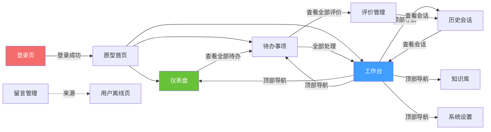

---

## 二、管理端页面流程

### 1. 管理员登录

**文件**：`admin/admin-login.html`  
**角色**：管理员

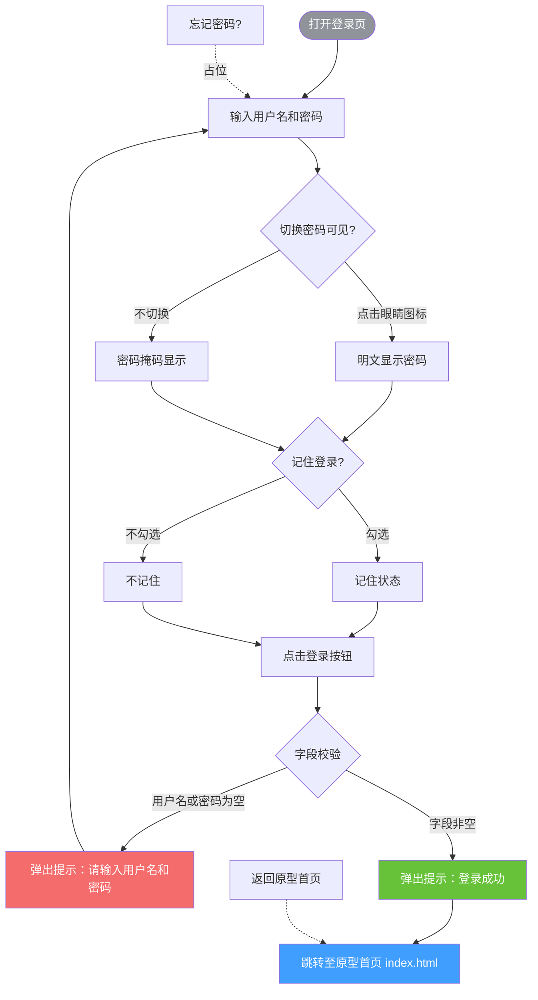

---

### 2. 数据仪表盘

**文件**：`admin/admin-dashboard.html`  
**功能**：运营数据概览 — 今日会话、在线客服、响应时长、满意度、趋势图、绩效排行、待办汇总

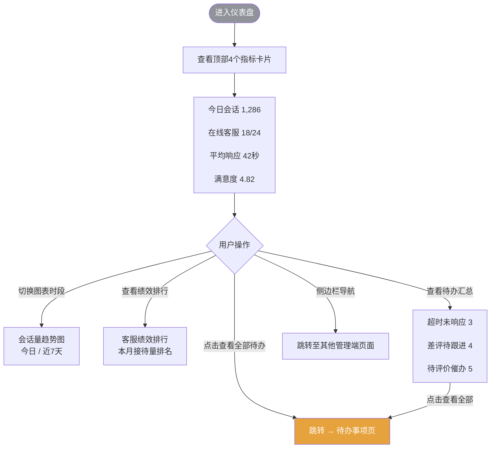

---

### 3. 客服工作台

**文件**：`admin/admin-workbench.html`  
**功能**：核心工作界面 — 三栏布局（会话列表 | 聊天窗 | 客户信息）

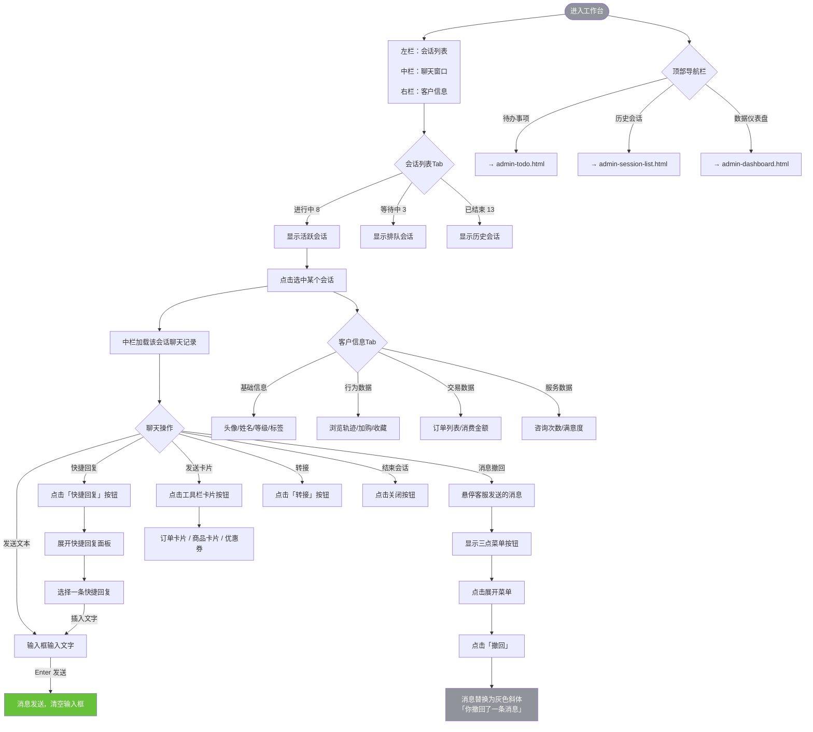

---

### 4. 待办事项

**文件**：`admin/admin-todo.html`  
**功能**：集中展示未回复消息、超时预警、待评价催办

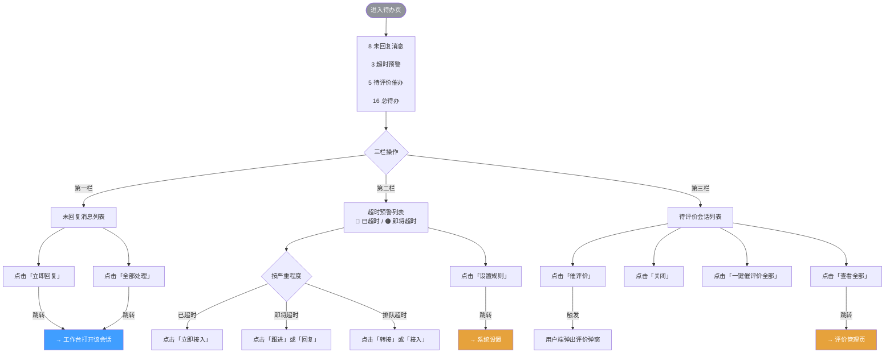

---

### 5. 历史会话

**文件**：`admin/admin-session-list.html`  
**功能**：多维度筛选历史会话记录，支持导出

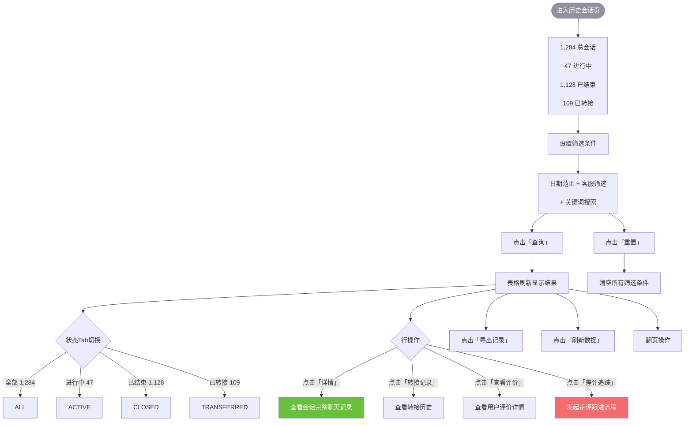

---

### 6. 客户信息

**文件**：`admin/admin-customer-info.html`  
**功能**：360° 客户画像 — 基础信息 / 行为轨迹 / 交易记录 / 服务历史

```mermaid
flowchart TD
    ENTER([进入客户详情页]) --> HEADER[
        客户头像 + 姓名 + 会员等级<br/>
        发消息 | 建工单 | 加标签
    ]
    
    HEADER --> HEADER_ACTION{头部操作}
    HEADER_ACTION -->|点击「发消息」| SEND_MSG[发送快捷消息]
    HEADER_ACTION -->|点击「建工单」| CREATE_TICKET[创建工单]
    HEADER_ACTION -->|点击「加标签」| ADD_TAG[添加客户标签]
    HEADER_ACTION -->|点击「返回工作台」| BACK_WB[→ 工作台]
    
    ENTER --> TAB_SWITCH{信息Tab切换}
    TAB_SWITCH -->|基础信息| BASIC[
        个人资料 → 编辑<br/>
        会员信息 → 只读<br/>
        联系方式 → 只读<br/>
        客户标签 → 管理
    ]
    TAB_SWITCH -->|行为轨迹 28| BEHAVIOR[
        近7天浏览记录<br/>
        访问12次 / 停留3.2h<br/>
        加购/收藏列表
    ]
    TAB_SWITCH -->|交易记录 15| TRADE[
        28笔订单 / 消费8.6k<br/>
        订单列表（含状态标签）<br/>
        点击「详情」 → 订单详情
    ]
    TAB_SWITCH -->|服务历史 6| SERVICE[
        16次咨询 / 本月3次<br/>
        满意度 4.8/5.0<br/>
        历史咨询记录
    ]
    
    BASIC -->|点击「编辑」| EDIT_PROFILE[编辑个人资料（需权限）]
    BASIC -->|点击「管理」| MANAGE_TAG[管理客户标签]
    TRADE -->|点击「加载更多」| LOAD_MORE[加载更多订单]
    TRADE -->|点击「详情」| ORDER_DETAIL[查看订单详情（OMS）]
    
    style ENTER fill:#909399,color:#fff
    style BACK_WB fill:#409eff,color:#fff
```

---

### 7. 会话转接

**文件**：`admin/admin-transfer.html`  
**功能**：管理转接记录 + 在线客服负载面板 + 选择转接目标

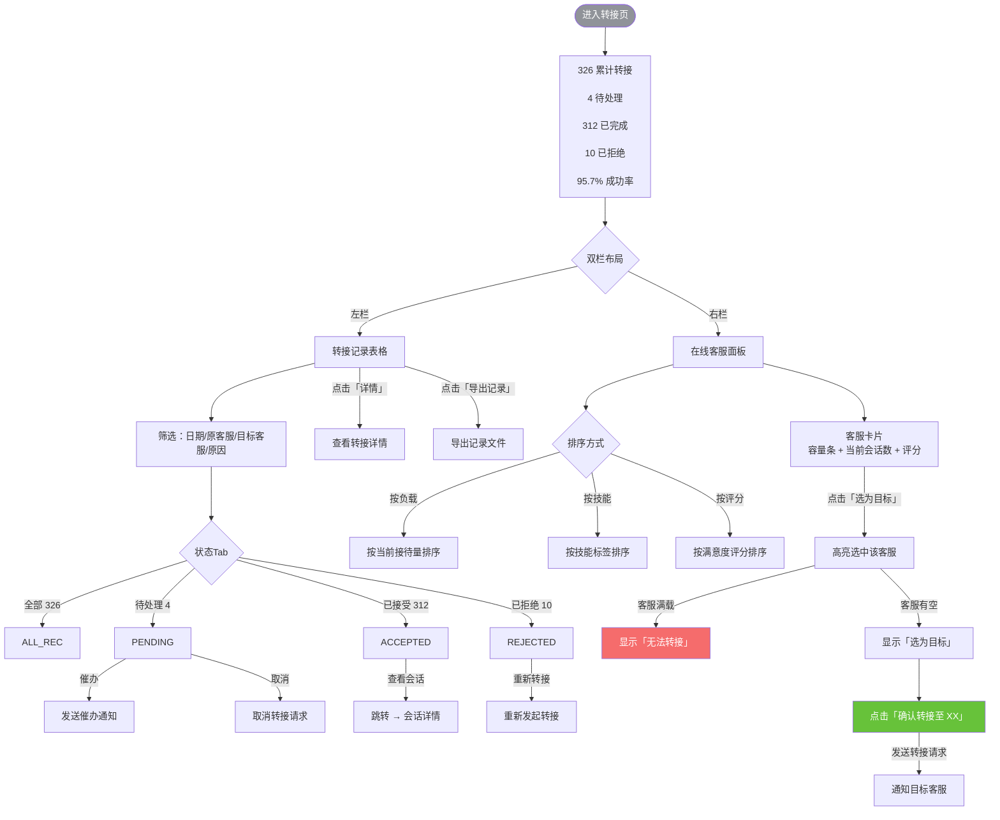

---

### 8. 知识库管理

**文件**：`admin/admin-knowledge.html`  
**功能**：FAQ 文章管理 + 快捷回复模板管理 + 富文本编辑器

```mermaid
flowchart TD
    ENTER([进入知识库页]) --> TOP_TAB{顶级Tab}
    
    %% 知识库Tab
    TOP_TAB -->|知识库| KB_TAB[知识库管理]
    KB_TAB --> KB_STATS[128篇文章 / 5个分类 / 1,847月浏览]
    
    KB_TAB --> KB_TREE[左侧：分类树<br/>全部文章 / 订单 / 退换货 / 支付 / 物流 / 账户]
    KB_TREE --> CLICK_NODE[点击分类节点]
    CLICK_NODE --> FILTER_ARTICLES[右侧文章列表按分类筛选]
    
    KB_TAB --> KB_TOOLBAR[工具栏：搜索 + 分类 + 状态 + 排序]
    KB_TOOLBAR --> CLICK_QUERY1[点击「查询」]
    CLICK_QUERY1 --> FILTERED_LIST[显示筛选后的文章列表]
    
    KB_TAB --> CLICK_NEW[点击「+ 新建文章」]
    CLICK_NEW --> OPEN_EDITOR[展开富文本编辑器]
    OPEN_EDITOR --> EDIT_TOOLBAR[
        工具栏：B I U S | 标题<br/>
        OL UL | 链接 图片<br/>
        对齐 | 代码块
    ]
    EDIT_TOOLBAR --> EDIT_CONTENT[编辑内容区 contenteditable]
    EDIT_CONTENT --> SAVE_ARTICLE[点击「保存」]
    
    FILTERED_LIST --> ROW_ACTION{文章行操作}
    ROW_ACTION -->|已发布| PUB_ACTION[预览 | 编辑 | 下线 | 删除]
    ROW_ACTION -->|草稿| DRAFT_ACTION[编辑 | 发布 | 删除]
    ROW_ACTION -->|待审核| REVIEW_ACTION[预览 | 编辑 | 审核 | 删除]
    ROW_ACTION -->|已下线| OFFLINE_ACTION[预览 | 编辑 | 上线 | 删除]
    
    PUB_ACTION -->|点击「编辑」| OPEN_EDITOR
    DRAFT_ACTION -->|点击「编辑」| OPEN_EDITOR
    
    %% 快捷回复Tab
    TOP_TAB -->|快捷回复 86| QR_TAB[快捷回复管理]
    QR_TAB --> QR_FILTER[搜索 + 分类（通用/问候/售前/售后/投诉/物流）+ 状态]
    QR_FILTER --> QR_TABLE[快捷回复表格<br/>10条模板 / 86条总计]
    
    QR_TABLE --> QR_ROW{行操作}
    QR_ROW -->|编辑| QR_EDIT[编辑快捷回复]
    QR_ROW -->|停用/启用| QR_TOGGLE[切换状态]
    QR_ROW -->|删除| QR_DELETE[删除确认]
    
    QR_TAB --> CLICK_ADD_QR[点击「+ 新增快捷回复」]
    CLICK_ADD_QR --> QR_MODAL[弹出新增弹窗]
    QR_MODAL --> FILL_FORM[填写：内容 + 分类 + 排序 + 状态]
    FILL_FORM --> CLICK_CONFIRM[点击「确定」]
    CLICK_CONFIRM --> CLOSE_MODAL[关闭弹窗，列表刷新]
    
    style ENTER fill:#909399,color:#fff
    style SAVE_ARTICLE fill:#67c23a,color:#fff
    style CLICK_CONFIRM fill:#67c23a,color:#fff
```

---

### 9. 话术库

**文件**：`admin/admin-scripts.html`  
**功能**：话术管理 — 双维度分类（场景标签 × 业务分类）

```mermaid
flowchart TD
    ENTER([进入话术库页]) --> STATS[
        48 条话术<br/>
        4 个业务分类<br/>
        2,136 累计使用
    ]
    
    STATS --> DOUBLE_FILTER[双维度筛选]
    
    %% 场景筛选
    DOUBLE_FILTER --> SCENE[场景标签筛选]
    SCENE --> SCENE_CLICK{点击场景标签}
    SCENE_CLICK -->|全部 48| ALL_SCENE
    SCENE_CLICK -->|进入会话 15| ENTER_SCENE
    SCENE_CLICK -->|客服离线 9| OFFLINE_SCENE
    SCENE_CLICK -->|关键词匹配 16| KEYWORD_SCENE
    SCENE_CLICK -->|转人工 8| TRANSFER_SCENE
    
    %% 业务分类筛选
    DOUBLE_FILTER --> BIZ[业务分类筛选]
    BIZ --> BIZ_CLICK{点击业务标签}
    BIZ_CLICK -->|全部 48| ALL_BIZ
    BIZ_CLICK -->|售前 12| PRESALE
    BIZ_CLICK -->|售后 18| AFTERSALE
    BIZ_CLICK -->|投诉 8| COMPLAINT
    BIZ_CLICK -->|通用 10| GENERAL
    
    SCENE_CLICK --> APPLY[组合筛选 AND 逻辑]
    BIZ_CLICK --> APPLY
    APPLY --> FILTERED[显示符合双条件的话术列表]
    
    FILTERED --> SCRIPT_ITEM{点击话术条目}
    SCRIPT_ITEM --> EXPAND[展开详情<br/>触发场景 / 关键词 / 使用效果]
    SCRIPT_ITEM --> COPY[点击「复制」 → 复制内容]
    SCRIPT_ITEM --> EDIT_SCRIPT[点击「编辑」 → 填入右侧表单]
    
    %% 右侧新建表单
    ENTER --> NEW_FORM[右侧：新建话术表单]
    NEW_FORM --> FILL_CONTENT[填写话术内容<br/>支持变量 {用户昵称} {订单号}]
    FILL_CONTENT --> SELECT_SCENE[选择场景标签]
    SELECT_SCENE -->|关键词匹配| SHOW_KEYWORD[显示「触发关键词」输入框]
    SELECT_SCENE -->|其他场景| HIDE_KEYWORD[隐藏关键词输入]
    FILL_CONTENT --> SELECT_BIZ[选择业务分类<br/>售前 / 售后 / 投诉 / 通用]
    FILL_CONTENT --> CLICK_SAVE[点击「保存话术」]
    CLICK_SAVE --> CREATED[新话术创建成功]
    
    style ENTER fill:#909399,color:#fff
    style CREATED fill:#67c23a,color:#fff
```

---

### 10. 评价管理

**文件**：`admin/admin-rating-mgmt.html`  
**功能**：评价列表 + 满意度分布 + 客服排名 + 差评追踪

```mermaid
flowchart TD
    ENTER([进入评价管理页]) --> TOP_METRICS[
        平均满意度 4.6<br/>
        总评价 1,083<br/>
        差评 42
    ]
    
    TOP_METRICS --> DIST[满意度分布图<br/>5星 62% / 4星 24% / 3星 10% / 2星 2.6% / 1星 1.3%]
    DIST --> AGENT_RANK[客服满意度排名表]
    
    ENTER --> FILTER[筛选条件]
    FILTER --> FILTER_BAR[日期范围 + 客服 + 评分范围 + 关键词]
    FILTER --> CLICK_QUERY[点击「查询」]
    
    ENTER --> STATUS_TAB{状态Tab}
    STATUS_TAB -->|全部评价 1,083| ALL_RATING
    STATUS_TAB -->|好评 ≥4星 931| POSITIVE
    STATUS_TAB -->|中评 3星 110| NEUTRAL
    STATUS_TAB -->|差评 ≤2星 42| NEGATIVE
    
    ALL_RATING --> TABLE[评价数据表格]
    POSITIVE --> TABLE
    NEUTRAL --> TABLE
    NEGATIVE --> TABLE
    
    TABLE --> ROW_ACTION{行操作}
    ROW_ACTION -->|普通评价| NORMAL_ACTION[详情 | 查看会话]
    ROW_ACTION -->|差评行 黄色高亮| BAD_ACTION[详情 | 查看会话 | 差评追踪]
    
    BAD_ACTION -->|差评追踪| TRACK[发起差评跟进流程<br/>分配跟进任务 → 记录处理结果]
    
    ENTER --> EXPORT[导出评价数据]
    ENTER --> REFRESH[刷新统计数据]
    
    style ENTER fill:#909399,color:#fff
    style TRACK fill:#f56c6c,color:#fff
```

---

### 11. 系统设置

**文件**：`admin/admin-settings.html`  
**功能**：5 大配置模块 — 欢迎语 / 离线语 / 路由规则 / 会话超时 / 敏感词

```mermaid
flowchart TD
    ENTER([进入系统设置页]) --> ANCHOR[锚点导航栏<br/>欢迎语 | 离线语 | 路由规则 | 会话超时 | 敏感词]
    
    ANCHOR --> SECTION{选择配置模块}
    
    %% 欢迎语
    SECTION -->|欢迎语| WELCOME[
        编辑欢迎语文本<br/>
        选择推送时机<br/>
        进入会话立即 / 客服接入后 / 不推送
        预览效果
    ]
    
    %% 离线语
    SECTION -->|离线语| OFFLINE[
        编辑离线提示文本<br/>
        开关：允许用户留言<br/>
        通知方式：站内/短信/企微
        预览效果
    ]
    
    %% 路由规则
    SECTION -->|路由规则| ROUTING[
        开关：自动接入<br/>
        分流策略：轮询 / 按空闲度 / 按优先级<br/>
        客服容量上限<br/>
        排队超时转人工<br/>
        关键词转人工 + 关键词管理
    ]
    
    %% 会话超时
    SECTION -->|会话超时| TIMEOUT[
        用户无响应超时 15分钟<br/>
        自动关闭时间 30分钟<br/>
        超时提醒文案<br/>
        扫描频率<br/>
        开关：允许用户重新发起
    ]
    
    %% 敏感词
    SECTION -->|敏感词| SENSITIVE[
        开关：全局过滤<br/>
        处理策略：替换 / 拦截 / 仅记录<br/>
        4个词组分类管理<br/>
        添加/删除敏感词<br/>
        批量导入 / 导出词库
    ]
    
    WELCOME --> FOOTER
    OFFLINE --> FOOTER
    ROUTING --> FOOTER
    TIMEOUT --> FOOTER
    SENSITIVE --> FOOTER
    
    FOOTER[底部操作栏] -->|保存设置| SAVE[保存所有配置]
    FOOTER -->|取消| CANCEL[放弃修改]
    FOOTER -->|重置默认| RESET[恢复默认值]
    
    style ENTER fill:#909399,color:#fff
    style SAVE fill:#67c23a,color:#fff
    style RESET fill:#e6a23c,color:#fff
```

---

### 12. 留言管理

**文件**：`admin/admin-leave-mgmt.html`  
**功能**：离线留言全生命周期管理 — 待处理 → 分配 → 回复 → 已回复

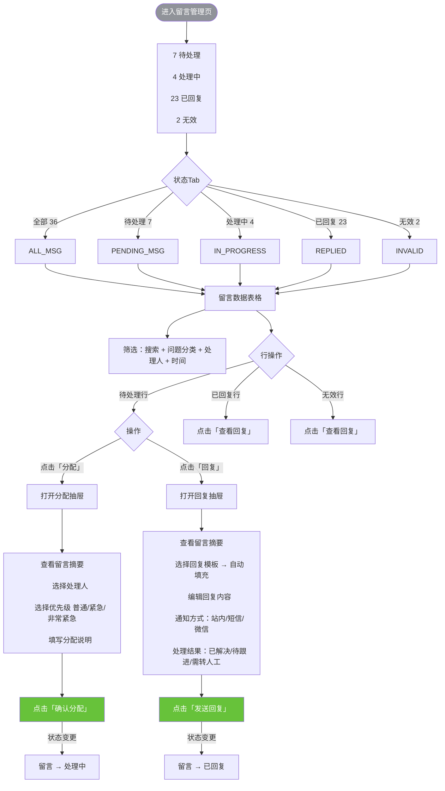

---

### 13. 机器人配置

**文件**：`admin/ai-bot-config.html`  
**分期**：3期  
**功能**：可视化对话流设计 + 意图管理 + 知识库关联 + 测试对话

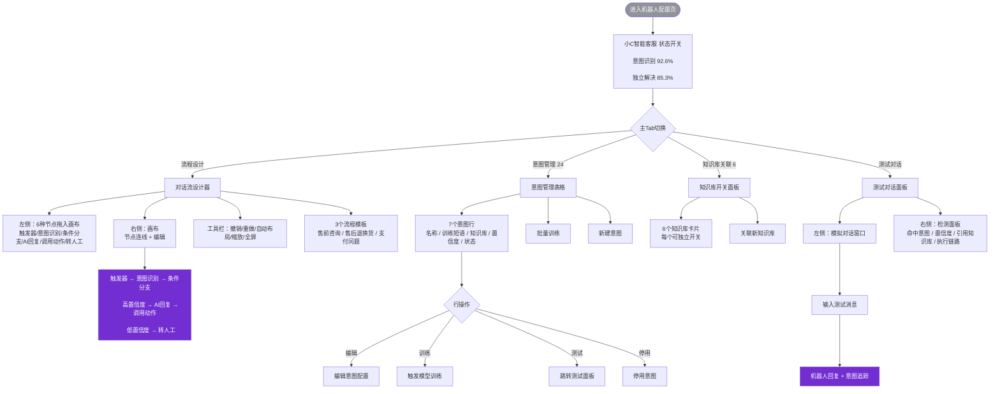

---

### 14. 智能质检

**文件**：`admin/ai-quality.html`  
**分期**：3期  
**功能**：AI 自动质检评分 + 规则配置 + 问题会话标记

```mermaid
flowchart TD
    ENTER([进入智能质检页]) --> TOP_METRICS[
        综合评分 92.4<br/>
        已质检 8,642<br/>
        问题会话 187<br/>
        通过率 97.8%
    ]
    
    TOP_METRICS --> SCORE_BREAKDOWN[
        维度评分<br/>
        服务态度 95 / 响应时效 88<br/>
        话术规范 96 / 问题解决率 90
    ]
    
    SCORE_BREAKDOWN --> PROBLEM_TYPE[问题类型分布<br/>服务态度 31% / 响应超时 24% / 敏感词 14%]
    
    ENTER --> RULES[质检规则配置]
    RULES --> RULE_TOGGLE{6条规则开关}
    RULE_TOGGLE --> R1[服务态度检测 30%]
    RULE_TOGGLE --> R2[首响响应时效 25%]
    RULE_TOGGLE --> R3[违规敏感词 20% 红线规则]
    RULE_TOGGLE --> R4[问题解决率 15%]
    RULE_TOGGLE --> R5[话术规范 10%]
    RULE_TOGGLE --> R6[承诺兑现 0% 实验中]
    
    ENTER --> FILTER[筛选条件<br/>日期 + 客服 + 问题类型 + 分数段]
    FILTER --> SCORE_RANGE{分数段筛选}
    SCORE_RANGE -->|优秀 ≥90| EXCELLENT
    SCORE_RANGE -->|合格 80-89| PASS
    SCORE_RANGE -->|预警 60-79| WARN
    SCORE_RANGE -->|不合格 <60| FAIL
    
    FILTER --> RESULTS[质检结果表格]
    RESULTS --> ROW_ACTION{行操作}
    ROW_ACTION -->|普通行| NORMAL[查看会话 | 质检详情]
    ROW_ACTION -->|标红行 不合格| FLAGGED[查看会话 | 质检详情 | 发起复检]
    
    ENTER --> EXPORT[导出质检报告]
    ENTER --> RUN[立即发起质检]
    
    style ENTER fill:#909399,color:#fff
    style FLAGGED fill:#f56c6c,color:#fff
    style RUN fill:#722ed1,color:#fff
```

---

### 15. 报表看板

**文件**：`admin/ai-report.html`  
**分期**：3期  
**功能**：综合运营数据 — 趋势图 + 排行 + 满意度 + 渠道 + AI解决率 + 热力图

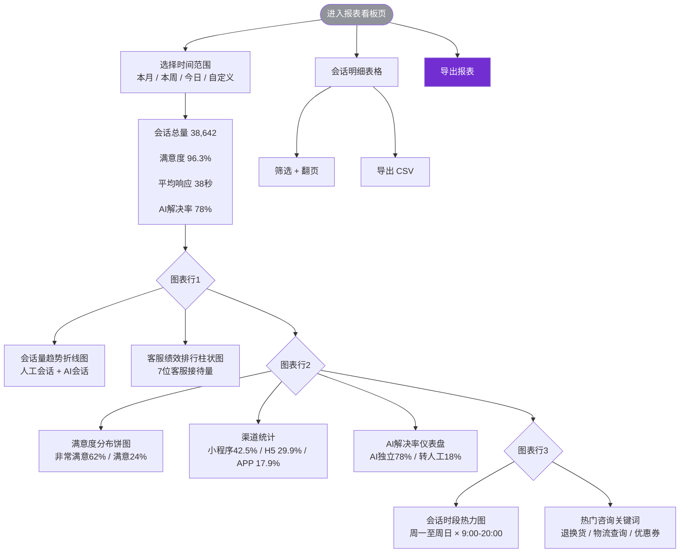

---

## 三、用户端页面流程

### 16. 场景咨询入口

**文件**：`user/user-entry.html`  
**功能**：展示商城 9 个页面中客服入口的嵌入方式和悬浮窗组件

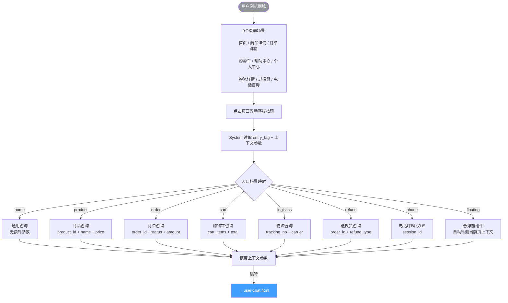

---

### 17. 聊天主界面

**文件**：`user/user-chat.html`  
**功能**：用户端核心聊天页 — 文字/图片/语音/卡片消息 + 历史会话 + 评价

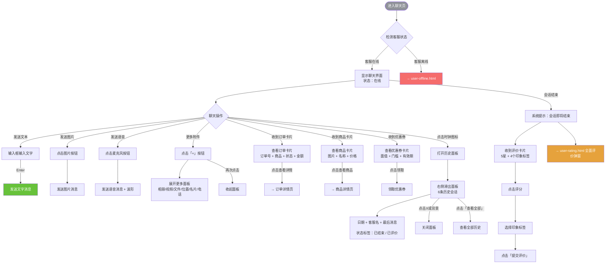

---

### 18. FAQ 常见问题

**文件**：`user/user-faq.html`  
**功能**：常见问题自助 + 图文服务指南

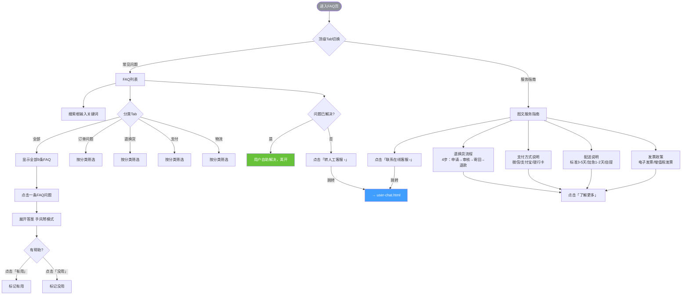

---

### 19. 离线留言

**文件**：`user/user-offline.html`  
**功能**：客服离线时的留言提交表单

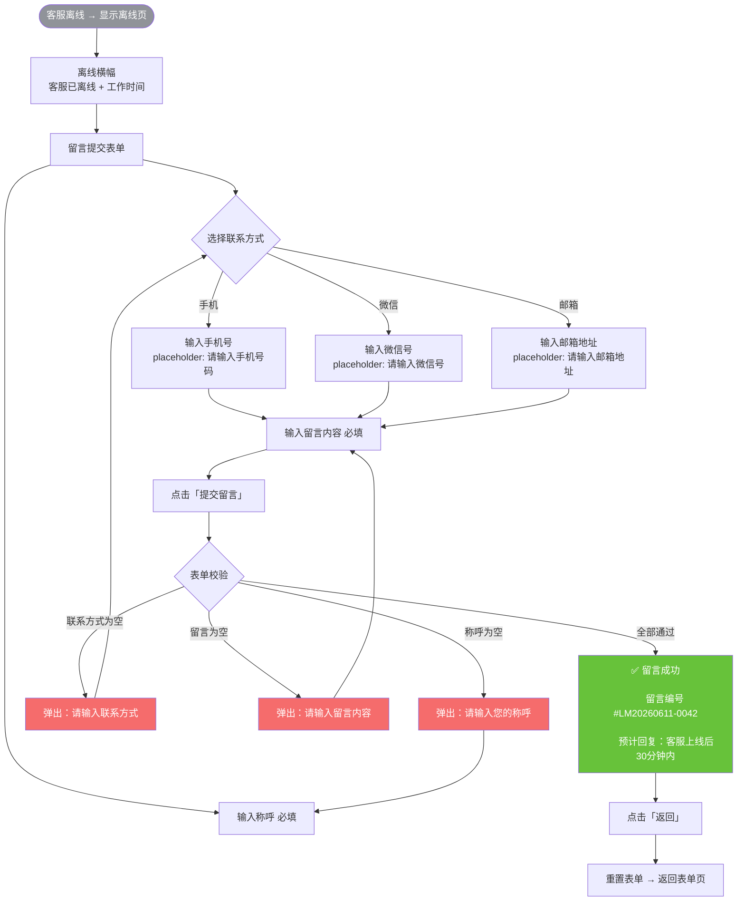

---

### 20. 服务评价

**文件**：`user/user-rating.html`  
**功能**：会话结束后的多维度评价弹窗

```mermaid
flowchart TD
    ENTER([会话结束 → 弹出评价弹窗]) --> RATING_FORM[评价表单]
    
    %% 星级评分
    RATING_FORM --> DIMENSIONS[4个维度评分]
    DIMENSIONS --> D1[服务态度 ★★★★★]
    DIMENSIONS --> D2[响应速度 ★★★★★]
    DIMENSIONS --> D3[专业能力 ★★★★★]
    DIMENSIONS --> D4[解决问题能力 ★★★★★]
    
    D1 --> CLICK_STAR[点击星星 → 填充至点击位置]
    D2 --> CLICK_STAR
    D3 --> CLICK_STAR
    D4 --> CLICK_STAR
    
    %% 印象标签
    RATING_FORM --> TAGS[服务印象标签<br/>10个标签多选]
    TAGS --> TAG_CLICK[点击标签 → 切换选中状态]
    TAG_CLICK --> POSITIVE_TAGS[正向标签：态度热情 / 响应及时 / 专业 / 耐心]
    TAG_CLICK --> NEGATIVE_TAGS[负向标签：回复慢 / 态度一般 / 未解决]
    
    %% 文字评价
    RATING_FORM --> COMMENT[补充评价 选填<br/>textarea 最多200字]
    COMMENT --> CHAR_COUNT[实时字数统计 N/200]
    
    %% 提交或跳过
    RATING_FORM --> SUBMIT_OR_SKIP{用户选择}
    SUBMIT_OR_SKIP -->|点击「提交评价」| SUBMIT[提交评价]
    SUBMIT --> SUCCESS[
        ✅ 评价提交成功<br/>
        感谢您的反馈，期待再次为您服务！
    ]
    
    SUBMIT_OR_SKIP -->|点击「跳过」| SKIP[关闭评价弹窗<br/>不记录评价]
    SKIP --> ENDED_CHAT[显示已结束的聊天页面<br/>输入框置灰：会话已结束]
    
    style ENTER fill:#909399,color:#fff
    style SUCCESS fill:#67c23a,color:#fff
    style SKIP fill:#909399,color:#fff
```

---

## 四、跨页面完整用户旅程

### 用户端完整旅程

```mermaid
flowchart TD
    START([用户浏览商城]) --> SCENE[
        9个场景入口<br/>
        首页/商品详情/订单详情/购物车<br/>
        /帮助中心/个人中心/物流详情<br/>
        /退换货/悬浮窗
    ]
    
    SCENE --> CLICK[点击「联系客服」按钮]
    CLICK --> PARAMS[携带 entry_tag + 上下文参数]
    
    PARAMS --> CHECK{检测客服在线状态}
    
    %% 在线路径
    CHECK -->|客服在线| CHAT[聊天主界面<br/>user-chat.html]
    
    CHAT --> CHAT_ACTIONS{聊天中操作}
    CHAT_ACTIONS -->|发送文字/图片/语音| SEND_MSG[发送消息]
    CHAT_ACTIONS -->|查看卡片| VIEW_CARD[订单/商品/优惠券卡片]
    CHAT_ACTIONS -->|查看历史| HISTORY[历史会话面板]
    CHAT_ACTIONS -->|需要自助| FAQ[→ FAQ页<br/>user-faq.html]
    
    %% FAQ分支
    FAQ --> FAQ_RESULT{FAQ解决问题?}
    FAQ_RESULT -->|是| EXIT_FAQ[用户自行离开]
    FAQ_RESULT -->|否| TO_HUMAN[点击「转人工客服」]
    TO_HUMAN --> CHAT
    
    %% 会话结束路径
    CHAT --> SESSION_END[会话结束]
    SESSION_END --> RATING[→ 服务评价页<br/>user-rating.html]
    
    RATING --> RATING_CHOICE{用户选择}
    RATING_CHOICE -->|提交评价| SUBMIT_OK[评价成功]
    RATING_CHOICE -->|跳过| SKIPPED[跳过评价]
    
    SUBMIT_OK --> END([返回商城])
    SKIPPED --> END
    
    %% 离线路径
    CHECK -->|客服离线| OFFLINE[→ 离线留言页<br/>user-offline.html]
    
    OFFLINE --> FILL_FORM[填写留言表单<br/>姓名 + 联系方式 + 留言]
    FILL_FORM --> VALIDATE{表单校验}
    VALIDATE -->|失败| FIX[修正输入]
    FIX --> FILL_FORM
    VALIDATE -->|通过| LEAVE_OK[留言提交成功<br/>留言编号 + 预计回复时间]
    LEAVE_OK --> END
    
    style START fill:#909399,color:#fff
    style CHAT fill:#409eff,color:#fff
    style FAQ fill:#67c23a,color:#fff
    style OFFLINE fill:#e6a23c,color:#fff
    style RATING fill:#f56c6c,color:#fff
    style END fill:#909399,color:#fff
```

### 管理端客服工作流

```mermaid
flowchart TD
    LOGIN([管理员登录<br/>admin-login.html]) --> DASH[数据仪表盘<br/>查看运营概览]
    
    DASH --> WB[客服工作台<br/>核心工作界面]
    
    %% 工作台日常操作
    WB --> DAILY{日常操作}
    
    DAILY -->|接待新会话| ACCEPT[接入会话]
    ACCEPT --> CHAT[在聊天窗回复用户]
    
    DAILY -->|使用快捷回复| QR[选择快捷回复模板]
    DAILY -->|撤回消息| RECALL[撤回已发送消息]
    DAILY -->|查看客户| CUSTOMER[右栏客户信息<br/>基础/行为/交易/服务]
    
    %% 会话流转
    CHAT --> NEED_TRANSFER{需要转接?}
    NEED_TRANSFER -->|是| TRANSFER[→ 会话转接页<br/>admin-transfer.html]
    TRANSFER --> SELECT_AGENT[选择目标客服]
    SELECT_AGENT --> CONFIRM_TRANSFER[确认转接]
    
    NEED_TRANSFER -->|否| CONTINUE[继续服务]
    
    CONTINUE --> SESSION_DONE{会话结束?}
    SESSION_DONE -->|是| CLOSE[关闭会话]
    SESSION_DONE -->|否| CHAT
    
    %% 待办事项
    DASH --> TODO[→ 待办事项<br/>admin-todo.html]
    TODO --> UNANSWERED[处理未回复消息]
    TODO --> TIMEOUT[处理超时预警]
    TODO --> EVAL_REMIND[催评价]
    
    UNANSWERED -->|点击回复| WB
    TIMEOUT -->|点击接入| WB
    
    %% 配置管理
    DASH --> CONFIG{配置管理}
    CONFIG -->|知识库| KB[知识库 + 快捷回复管理]
    CONFIG -->|话术库| SCRIPTS[话术库管理]
    CONFIG -->|系统设置| SETTINGS[欢迎语/离线语/路由/超时/敏感词]
    CONFIG -->|留言管理| LEAVE[留言分配与回复]
    
    %% 数据分析
    DASH --> ANALYSIS{数据分析}
    ANALYSIS -->|历史会话| SESSIONS[会话记录查询]
    ANALYSIS -->|评价管理| RATINGS[评价查看 + 差评追踪]
    ANALYSIS -->|报表| REPORTS[报表看板]
    ANALYSIS -->|质检| QUALITY[AI智能质检]
    
    %% AI 配置
    DASH --> AI[→ 机器人配置<br/>ai-bot-config.html]
    AI --> FLOW_DESIGN[对话流设计]
    AI --> INTENT[意图管理]
    AI --> KB_LINK[知识库关联]
    AI --> TEST[测试对话]
    
    style LOGIN fill:#f56c6c,color:#fff
    style WB fill:#409eff,color:#fff
    style DASH fill:#67c23a,color:#fff
    style TODO fill:#e6a23c,color:#fff
    style AI fill:#722ed1,color:#fff
```

---

> **文档结束**  
> 本文档覆盖全部 20 个原型页面，共包含 20 个 Mermaid 流程图 + 2 个跨页面旅程图。
> 如需编辑流程图，可使用支持 Mermaid 语法的 Markdown 编辑器（如 Typora、VS Code + Mermaid 插件、GitHub）渲染查看。
