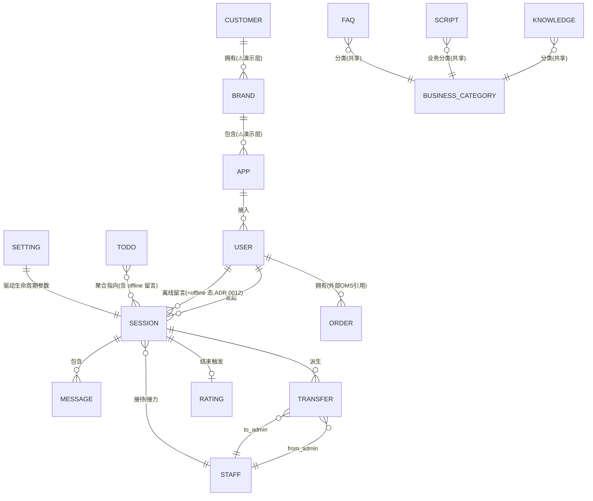
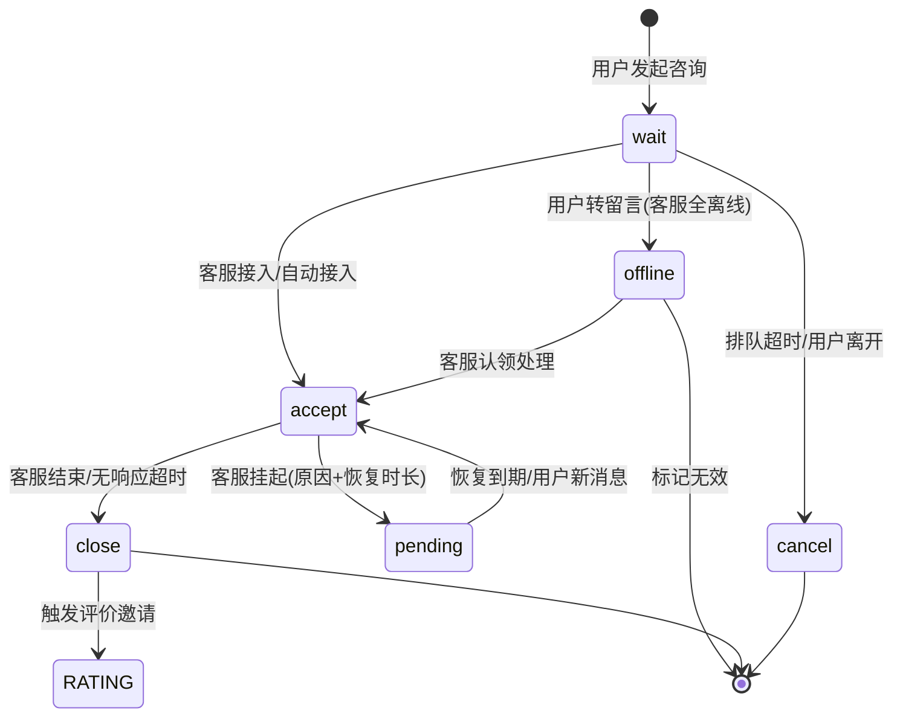
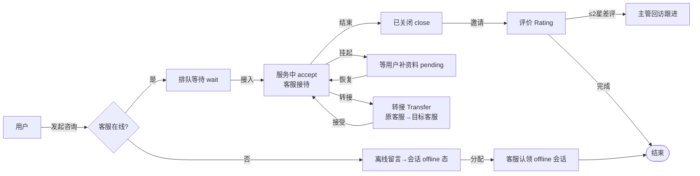
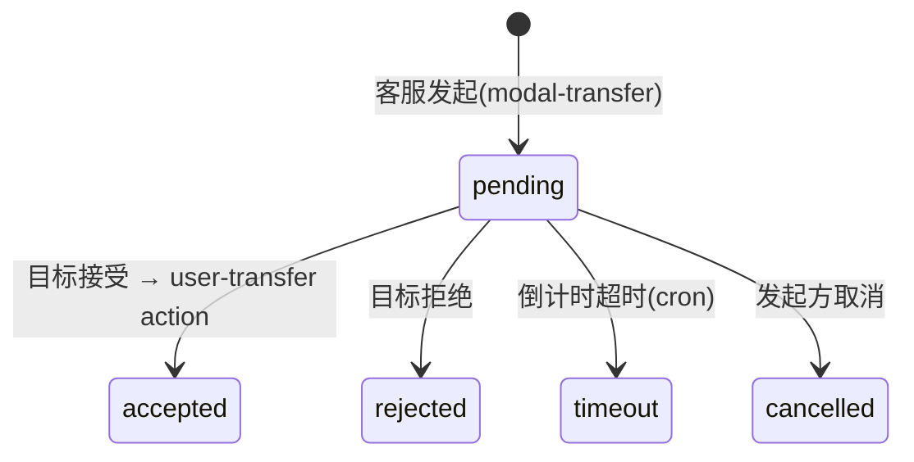
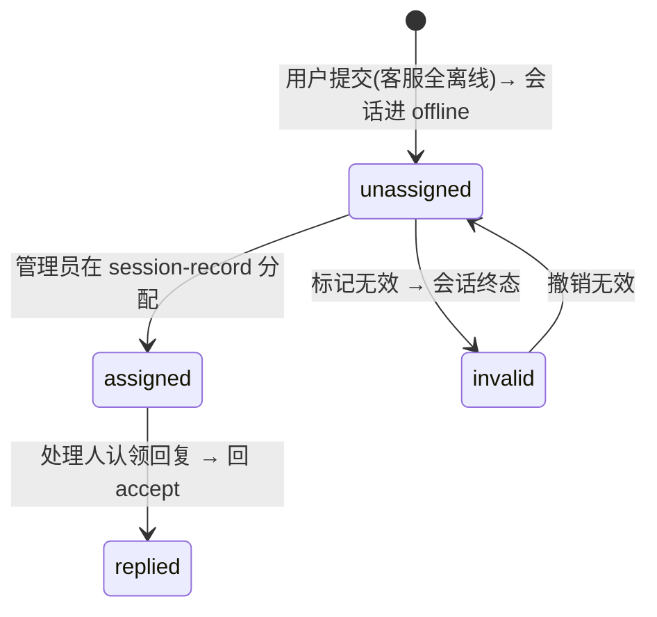
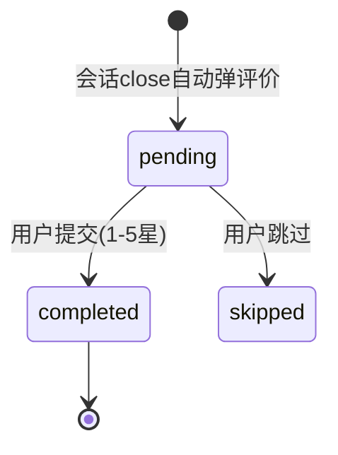
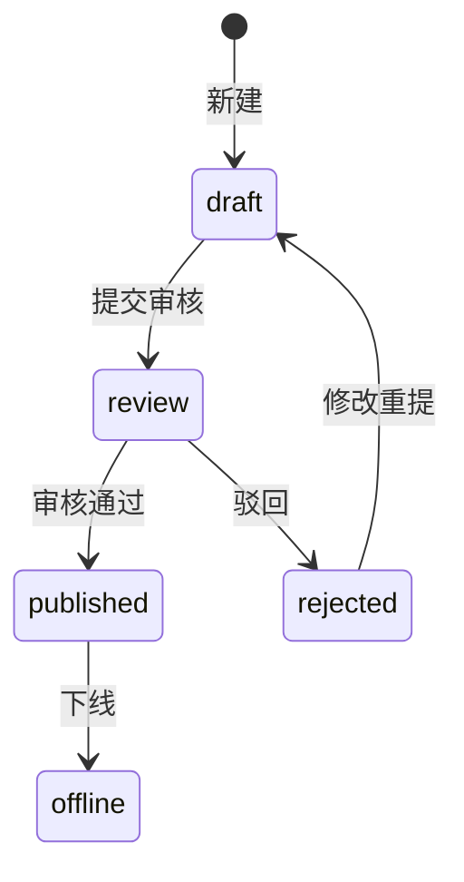
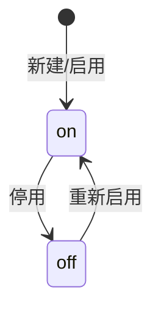

# 商城客服系统原型 — 实体模型 V2.0(业务 / 开发双视角)

> **一份文档,一个真相源,两个视角。业务视角优先。**
> - **§0 业务背景**:三层归属结构 + 演示数据警示 —— 读正文前的前置说明。
> - **§1 实体总览**:实体清单 + 关系图 + 状态机 + 状态词映射 —— 两版共用的单一真相源。
> - **§2 业务视角**:业务说明书 —— 流程/规则/角色边界/单据流转/待决策缺口。**(PM/评审优先读)**
> - **§3 开发视角**:实现契约 —— 类型/聚合/触发 action/数据源/枚举常量/技术缺口。
>
> 读法:先看 §0 业务背景与 §1 实体总览;**PM/评审读 §2,开发读 §3**。两章只补充各自独有维度,不重复核心。
>
> 期次:🟢=1期已实现 · 🟡=2期占位 · 🔵=3期占位。

---

## 📋 修订记录

- **2026-06-26 同步原型**(核对 6/25 后改动):
  - 🔧 **路由规则→客服分配规则** 改名;**紧急度判定→紧急度设置** 改名。
  - ✅ **B13 已解决**:较急档去掉后,T=首次响应超时子卡片(可配),60% 逻辑不存在。
  - ✅ **B14 已解决**:`modal-faq.html` 已建(问题/答案/分类/关键词/启停+校验+编辑预填);FAQ 分类管理弹窗已加(复用 modal-category)。
  - ➕ 自动回复区块新增 **FAQ 命中策略**(推送首条/全部/按优先级)。
  - 🔧 排队超时从路由移至**会话超时**子卡片(路由不再含排队超时)。
  - 🔧 设置 5 区块名更新:客服分配规则/会话超时设置/紧急度设置/敏感词/自动回复(含FAQ命中策略)。

- **2026-06-25 二次同步原型**(核对 09:23 后改动 + 重组"无关后置"):
  - 🆕 **新增 FAQ 实体**(`admin-faq.html` 独立页:6 分类/状态 on·off/`customer_chat_faqs`+`faq_card`;新建编辑表单未原型化)。
  - ⬇️ **快捷回复再次降级**:独立页 `.deprecated` → 并入话术库为 `quickreply` 业务分类(场景=general);话术业务分类 4→**5**。
  - 🔁 **nav 重组**:旧"工作台/服务管理/配置"→ **仪表盘 / 会话管理 / 知识库(话术·FAQ·知识文档)/ 客服设置**;知识库页 label 改"知识文档"(实体名不变)。
  - 🔧 **设置区块 6→5**:欢迎语+离线语并入「自动回复(autoreply)」section;会话超时拆为 6 个生命周期子阶段;路由仅 轮询/空闲度(无 VIP/技能组)。
  - ➕ 待评价流程补 `skipped` 态 + 催评/一键催评;工作台会话卡新增 `即将超时(warn)`/`转接入(transferred)` 展示标签;差评追踪入口扩到全部评价行。
  - 📐 **文档重组**:次要内容(缺口 B/T、3期占位、演示警示)统一后置,核心实体/状态/规则前置。

- **2026-06-24 同步原型**(核对 11:04 后改动,修正 12 处偏差):
  - 🔁 会话历史页 `session-list` → `session-record`;历史状态词 4→**5**(新增 `offline` 留言态)。
  - ⬇️ **留言 Leave 不再独立成实体**,降级为 Session 的 `offline` 状态(ADR 0012);user 端留言提交入口保留 → 闭环 **B5/T1**。
  - ⬆️ 快捷回复升独立页(状态仅 on/off,分类=固定 6 值枚举,非实体)。
  - ➕ 话术场景 4→**5**(+`general`),补 `triggerKeyword`;转接补 reason 枚举(vip/skill/busy/timeout)。
  - 🆕 **业务分类(BusinessCategory)** 为 Knowledge+Script 共享分类树(modal-category),非知识库私有。
  - 🔧 设置规则 7 类→**6 区块**:关键词转人工并入路由、**自动话术区块缺失**(新缺口)、新增离线语区块。
  - ⚠️ 工作台会话 tab 缺 `cancel` 入口(状态机存疑);差评跟进仍未沉淀为 Rating 字段(**B9/T4 未闭环**)。

---

# §0 业务背景(两版都须知道)

三层归属树:

```
企业客户(租户 customer) ─ 品牌商城(brand) ─ 应用端/渠道(app:小程序/H5/PC)
```

> ⚠️ **演示假数据警示**:`admin-session-record`/`transfer`/`rating-mgmt` 底部脚本**按行轮转**注入"企业/品牌/应用端"文本,`customer-info` 个人资料也硬填三层归属字段——均**原型演示用**。后端实际多租户**只有 `customer_id` 一层**(见 §3.3)。真实归属粒度待重新定义。

---

# §1 实体总览(单一真相源)

## 1.1 实体总表(19 行 · 留言/快捷回复降级 · 🆕FAQ)

> 「类型」列是开发视角的 DDD 标注(见 §3.1);业务读者可忽略,只看「实体」「期次」。

| 实体 | 类型 | 期次 | 后端数据源 | 承载页 |
|------|------|:----:|-----------|--------|
| 会话 Session | 聚合根·实体 | 🟢 | `customer_chat_sessions` | workbench, **session-record**(原 session-list) |
| 消息 Message | 实体 | 🟢 | `customer_chat_messages` | workbench, user-chat-* |
| 转接 Transfer | 实体(派生单据) | 🟢 | `customer_chat_transfers` | transfer |
| 评价 Rating | 实体 | 🟢 | `customer_chat_messages(type=rate)` | rating-mgmt, user-rating |
| 待办 Todo | **视图**(非实体) | 🟢 | 实时聚合查询,无表 | todo, dashboard |
| 用户 User | 聚合根·实体 | 🟢 | `users` | customer-info(基础/行为/交易/服务 4 tab) |
| 客服 Staff | 聚合根·实体 | 🟢/🔵 | `customer_admins`+`_chat_settings` | workbench, transfer(管理页🔵占位) |
| ~~留言 Leave~~ | **降级为 Session 的 `offline` 状态**(ADR 0012,非独立实体) | 🟢 | 复用 `sessions`+`offline_content`(无需独立表) | session-record「离线待处理」tab;**user-offline(用户端提交入口保留)** |
| 业务分类 BusinessCategory | 实体(配置) | 🟢 | ⚠️`customer_chat_kb_categories`(知识库5类)/话术5类(待确认是否同表) | modal-category(**共享组件,两套不同值**:知识库 order/return/pay/logistic/account + 话术 general/presale/aftersale/complaint/quickreply,**勿混用**) |
| 知识库文章 Knowledge | 聚合根·实体 | 🟢 | `customer_chat_knowledge_base`+`_kb_categories` | knowledge(+导入文档、浏览量) |
| FAQ Faq | 实体(配置) | 🟢 | ⚠️`customer_chat_faqs`+`faq_card`(待确认表名,原型标注) | **faq(🆕独立页,6 分类,状态 on/off)** |
| 快捷回复 QuickReply | ⬇️降级为话术库 `quickreply` 业务分类(场景=general) | 🟢 | `customer_chat_auto_messages`(复用话术表) | ~~quick-reply.deprecated~~ → 并入 **scripts**(话术库) |
| 话术 Script | 实体(配置) | 🟢 | `customer_chat_auto_messages` | scripts(+modal-script,5 场景) |
| 系统设置 Setting | **单例参数对象**(非实体) | 🟢 | `customer_chat_settings`+`_sensitive_words` | settings(5 区块:**客服分配规则**/会话超时设置/紧急度设置/敏感词/自动回复) |
| 订单 Order | **值对象/外部引用** | 🟢 | ⚠️外部 OMS,未对接 | customer-info 交易tab |
| 工单 Ticket | 聚合根·实体 | 🟡 | (无,2期) | ticket(占位) |
| 客服管理 StaffMgmt | — | 🔵 | (无,3期) | staff(占位,`admin-staff.html` 仍纯占位) |
| 渠道 Channel | — | 🔵 | (无,3期) | channel(占位) |
| AI bot/quality/report/scene | — | 🔵 | (无,3期) | ai-*(占位,已从 1期 nav 隐藏) |

**值对象/枚举**(不是实体,是属性):评分(1-5)· 会员等级(积分+成长值模型)· 评价标签(三元情感)· 消息类型(7类卡片)· 应用端 · 紧急度 · 转接原因 · 订单状态 · 业务分类(共享)· 话术场景(5)· FAQ分类(6)· ~~快捷回复分类(6,已降级并入话术quickreply)~~。

**领域事件**:会话结束(SessionClosed)· 差评提交(BadRatingSubmitted)· 转接发起(TransferInitiated)· 用户离线留言(SessionEnterOffline,原 LeaveSubmitted)· 客服上下线。

## 1.2 关系图



> 中枢是 `会话`;`待办`/`客户360` 是聚合视图;`设置` 驱动状态机参数。聚合边界划分见 §3.1。

## 1.3 状态机(中性主图,两版共用)

**会话**(拼合 workbench / session-list / settings / modal-suspend):


> **转接 · 会话 offline(留言)态 · 评价 · 差评跟进 · 知识库 · FAQ** 六张状态机图见 §3.2(开发,带 action);业务触发条件见 §2.2。此处不重复,避免冗余。

## 1.4 状态词汇映射表(⚠️ 两套词统一)

原型两套会话状态词汇并存,务必统一:

| 业务状态 | 运行态词(workbench) | 历史列表词(session-record) | 用户端体现 |
|---------|:-------------------:|:------------------------:|-----------|
| 等待/排队 | `wait` | — | user-queue「排队中·前面N人」 |
| 进行中 | `accept` | `ongoing` | user-chat 对话 |
| 离线待处理(留言) | (workbench 无入口) | `offline` | user-offline「留言待处理」 |
| 挂起 | `pending` | — | (用户侧暂停超时) |
| 已关闭 | `close` | `closed` | user-rating「会话已结束」 |
| 已转接 | (事件,非状态) | `transferred` | — |
| 已取消 | `cancel`(⚠️工作台 tab 缺入口) | `cancelled` | — |

**FAQ 状态**(独立于会话):

| 业务状态 | 列表标识 | 说明 |
|---------|:-------:|------|
| 启用 | `on`(绿点) | FAQ 可被命中推送 |
| 停用 | `off`(灰点) | FAQ 不参与匹配 |

---

# §2 业务视角(PRD / 评审用)

> 给 PM:**怎么运作**。在实体总览基础上补流程 + 规则维度。**(PM/评审优先读本节)**

## 2.1 跨角色端到端流程



**三角色分工**:用户(发起/评价)· 客服(接待/转接/挂起/结束/回复留言)· 主管/管理员(差评回访/留言分配/知识库审核)。

## 2.2 状态机的业务触发与边界场景

| 状态 | 业务触发(谁/何时) | 边界场景 |
|------|-------------------|---------|
| wait 排队 | 用户点咨询 | 客服全忙→排队;排队超时→提示转留言 |
| accept 服务中 | 客服接入或自动接入 | 用户无响应→超时提醒(15分)→自动关闭(30分) |
| pending 挂起 | 客服等用户补凭证/协同仓库 | **暂停无响应超时计时**;恢复时长到期自动回 accept |
| 转接 | VIP/技能不符/繁忙/超时 | 目标拒绝/超时→回退(原客服/重排队/取消) |
| close 关闭 | 客服主动结束 或 超时 | 关闭后允许"再次咨询"发起新会话 |
| 评价 | close 后自动邀请 | 用户可跳过;≤2星触发差评预警 |

## 2.3 业务规则清单

| 配置区块(settings) | 内容 | 备注 |
|--------|------|---------|
| 客服分配规则 #routing | 自动接入 · 分流(轮询/空闲度) · **关键词转人工**(命中词表) | ⬇️排队超时移至会话超时子卡片;路由改名"客服分配规则" |
| 会话超时 #timeout | **6 生命周期子阶段**:排队等待超时/首次响应超时/轮次响应超时/用户静默超时/转接超时/挂起超时;每阶段独立阈值+动作 | 🆕 拆为子卡片(原为简单阈值) |
| 紧急度设置 #urgency | 等待≥T 或 命中紧急关键词 → high；否则 low（去较急档） | ✅ T=首次响应超时子卡片(可配);较急档已去,B13 已解决 |
| 敏感词 #sensitive | 过滤开关 · 命中策略(替换***/仅用户端替换) · 词库(商城供给，OCS 不自建) | 商城词库；本模块仅消费(ADR-0007) |
| 自动回复 #autoreply | 🆕 欢迎语(welcome_content+推送时机) + 离线自动回复(offline_content+允许留言+通知方式) + **FAQ 命中策略**(推送首条/全部/按优先级) | 欢迎语+离线语并入此区块(原为独立 section);FAQ命中策略🆕 |

> Settings 从 V1 的 7 类规则重组为 **5 区块**:客服分配规则/会话超时设置/紧急度设置/敏感词/自动回复(含欢迎语+离线自动回复+FAQ命中策略)。⚠️ **"自动话术"区块仍缺失**——话术管理在 `scripts` 页(5 场景),settings 无自动话术触发开关(见 B10)。转接规则(原因/倒计时/回退)仍在 `transfer`+`modal-transfer`,不在此表。

## 2.4 角色边界与单据流转

- **会话主线**:用户发起 → 客服接待(可挂起/转接接力)→ 结束 → 评价。单据:会话单 →(派生)转接单 →(触发)评价单。
- **离线支线**:用户留言(客服全离线)→ 会话进 `offline` 态 → 管理员在 session-record「离线待处理」分配 → 客服认领/标记无效。单据:**会话单的 offline 状态**(留言不再独立成单,ADR 0012)。
- **质量支线**:差评 → 主管回访 → 录入结果。单据:挂在评价上的跟进记录。
- **2期工单支线**(规划):会话/客户详情 → 建工单 → 跨部门流转。

## 2.5 🔴 待 PM 拍板的业务缺口(评审用)

| # | 缺口 | 涉及 | 需拍板 |
|---|------|------|--------|
| B1 | 超时阈值两套不一致(todo 5/4/15分 vs settings 15/30分) | 会话/待办/设置 | 统一一套 or 分场景?入口合并? |
| B2 | 欢迎语/离线语 与 话术职责重叠 | 话术/设置 | 合并话术库 or settings 默认+话术细化? |
| B3 | cancel vs close 触发条件未明示 | 会话 | cancel=用户主动?close=系统超时? |
| B4 | 客服"忙碌"状态 UI 缺失 | 客服 | 补忙碌态 UI + 触发条件? |
| B5 | ~~留言是否进 1期 MVP~~ | ~~留言~~ | ✅ **已决策(2026-06-24)**:留言降级为 Session `offline` 状态,不独立建实体/表;user 端提交入口保留。对应 T1 闭环。 |
| B6 | 三层归属是演示假数据 | 全局 | 真实归属粒度?真需三层 or 单租户?(对应 T3) |
| B7 | 知识库完整审核流(5态) | 知识库 | 1期完整审核 or 简化为发布/下线?(对应 T7) |
| B8 | "已转接"当状态还是筛选 | 会话/转接 | 历史列表保留 tab or 改转接单筛选? |
| B9 | 差评跟进无独立状态 | 评价 | ✅ modal-bad-rating 有跟进时间线+录入回访;⚠️但仍未沉淀为 Rating 字段。仍需拍板 `follow_up_status` 落地(对应 T4)。 |
| B10 | 🆕 自动话术 settings 区块缺失 | 设置/话术 | 话术在 scripts 页(5场景),settings 无自动话术开关——未实现 or 并入他处?(对应 T9) |
| B11 | 🆕 业务分类共享建模 | 知识库/话术 | modal-category 是 Knowledge+Script 共用分类树——共享一张表 or 各自分类?(对应 T10) |
| B12 | 🆕 工作台会话 tab 缺 `cancel` | 会话 | cancel 在状态机但工作台列表 tab 无入口——补 tab or 确认 cancel 仅历史态? |
| ~~B13~~ | ~~紧急度首次响应阈值 T 不可配~~ | ~~设置~~ | ✅ **已解决(2026-06-26)**:较急档去掉,T=首次响应超时子卡片(可配),60%逻辑不存在 |
| ~~B14~~ | ~~FAQ 新建/编辑表单未原型化~~ | ~~FAQ~~ | ✅ **已解决(2026-06-26)**:`modal-faq.html` 已建;FAQ 分类管理弹窗已加(复用 modal-category) |

> 业务缺口(B)与 §3 开发技术缺口(T)一一对应:**你拍板业务口径,开发的技术缺口随之明确**——这正是双视角同文档的价值:评审会上业务与技术对着同一张表说话。

---

# §3 开发视角(实现契约)

> 给开发:**怎么落地**。在实体总览基础上补结构 + 契约维度。

## 3.1 实体类型判定与聚合边界

**类型判据**:`实体`=有 ID + 生命周期 + 可变;`值对象`=无 ID、由值定义、不可变;`聚合根`=一组对象的一致性边界与唯一访问入口;`视图`=不产生数据、聚合查询。

**聚合划分**(一致性边界):

| 聚合(根) | 聚合内对象 | 一致性规则 |
|----------|-----------|-----------|
| **会话聚合**(Session) | 消息 · 转接 · 评价 | 所有消息/转接/评价必须经所属会话访问;状态变更原子化 |
| **用户聚合**(User) | 用户标签 · 360数据(行为/交易为外部引用) | 标签增删经用户 |
| **客服聚合**(Staff) | 个人设置(`customer_admin_chat_settings`) · 负载 · 技能 | 负载随会话数实时变 |
| ~~留言聚合(Leave)~~ | —(已并入会话聚合) | ✅ ADR 0012:留言为 Session `offline` 子状态,分配/回复由会话聚合管理 |
| **知识库聚合**(Knowledge) | 分类 | 发布/审核流 |
| **配置聚合** | 话术(含 quickreply 快捷回复) · FAQ · 知识库 · 设置 | 全局规则定义,无运行态实例 |
| **租户聚合**(Customer) | 全部(经 `customer_id` 隔离) | 多租户隔离边界 |

> `待办`、`客户360`、`仪表盘` 是**视图**(CQRS 读模型),不属任何聚合,由跨聚合查询聚合而成。

## 3.2 状态机的触发 action + 代码落点

> 后端 WebSocket Action 见 CLAUDE.md 协议表;控制器在 `controller/backend/`。

**会话状态迁移 → action/触发源**:
| 迁移 | 触发 | action / 落点 |
|------|------|--------------|
| →wait | 用户发起 | `user-online` → `waiting-users`/`waiting-user-count` 推送 |
| wait→accept | 客服接入/自动 | `admins` + session update(`is_auto_accept`) |
| accept→pending | 客服挂起 | session update + 暂停超时 cron |
| pending→accept | 恢复/新消息 | cron 恢复 或 `send-message` |
| accept→close | 结束/超时 | `send-message`(结束) 或 cron(`cron.go` 超时关闭) |
| close→评价 | — | 推 `type=rate` 消息 |

**转接**:

→ 核心动作:`user-transfer` action(通知目标客服);超时回退由 cron/定时器。

**会话 `offline`(留言)态处理**(ADR 0012:留言不再独立成实体,为 Session 的 offline 子状态):


**评价提交** + **差评跟进**:

差评(≤2)→ 自动触发预警事件(BadRatingSubmitted)→ 主管介入 → 录入回访 → 已解决。⚠️ **无独立 `follow_up_status` 字段**(见 T4)。

**知识库**:


**FAQ**(🆕 简单启停):


## 3.3 实体 → 后端表映射 + 缺失表

| 实体 | 后端表 | 状态 |
|------|--------|------|
| 会话/消息/转接/评价/话术/规则/设置/客服设置/文件 | 见 §1.1 | ✅ 已有 |
| 知识库 | `customer_chat_knowledge_base` | ⚠️ 原型标注,`database.sql` 未确认是否已建 |
| FAQ | `customer_chat_faqs`+`faq_card` | ⚠️ 🆕 原型标注,表名待确认 |
| ~~留言~~ | ~~`customer_chat_leave`~~ | ✅ **已决策(ADR 0012)**:留言降级为 Session `offline` 状态,复用 `customer_chat_sessions`+`offline_content`,不建独立表 |
| 待办 | — | 视图,实时聚合(需定查询/缓存策略) |
| 用户行为/交易 | — | ⚠️ 外部系统(埋点/OMS),未对接 |
| 三层归属(brand/app) | 仅 `customer_id` | ⚠️ 无 brand/app 字段,演示层 |

## 3.4 枚举代码常量值

| 维度 | 字段 | 常量值 |
|------|------|--------|
| 消息来源 | `source` | 0=用户 · 1=客服 · 2=系统 · 3=AI |
| 消息类型 | `type` | `text`/`image`/`audio`/`video`/`pdf`/`navigator`/`rate`/`notice` |
| 会话状态 | — | `wait`/`accept`/`pending`/`offline`/`close`/`cancel`(`offline`=留言态,ADR 0012) |
| 富卡片(原型) | data-card | `order`/`product`/`coupon`/`image`/`cart`/`logistic`/`refund` ⚠️ 未映射到后端 type |
| 话术场景 | scene | `enter`/`offline`/`keyword`/`transfer`/`general`(5 场景,+`triggerKeyword` 字段) |
| FAQ 分类 | faq_category | 🆕 6 分类(order/return/pay/logistic/account/other,原型标注,待确认最终值) |
| 转接原因 | transfer_reason | `vip`/`skill`/`busy`/`timeout` |
| 快捷回复分类 | qr_category | ⬇️ 已降级为话术库 `quickreply` 业务分类(场景=general),非独立枚举 |
| 评价标签 | rtag | 三元情感 `positive`/`neutral`/`negative`(自由标签) |
| 业务分类 | biz_category | ⚠️共享 `modal-category` 组件但**两套不同值**:知识库 5 类(order/return/pay/logistic/account)/ 话术 5 类(general/presale/aftersale/complaint/quickreply),**勿混用** |
| WS Action | — | send-message/receive-message/receipt/read/user-online/offline/waiting-users/admins/user-transfer/other-login/more-than-one/error-message |

## 3.5 🔧 技术缺口清单(开发视角)

| # | 缺口 | 影响 | 建议 |
|---|------|------|------|
| T1 | ~~留言无后端表~~ | ~~留言功能无法落地~~ | ✅ **已决策**:留言降级为 Session `offline` 状态,复用 `sessions`+`offline_content`,不建独立表(对应 B5) |
| T2 | 富消息卡片 type 未定义 | order/product 等 7 类卡无后端类型 | 扩展 `type` 或新增 `card_type` 字段 |
| T3 | 三层归属无字段 | 企业/品牌/应用端筛选无数据支撑 | 确定真实归属粒度,补字段或去掉演示层(对应 B6) |
| T4 | 差评跟进无状态字段 | modal 有跟进 UI 但未持久化 | 评价增加 `follow_up_status`/`follow_up_records[]` 字段(对应 B9) |
| T5 | 会话状态两套词 | 前后端口径不一致 | 后端定一套,前端映射 |
| T6 | 待办是实时聚合 | 性能/缓存策略未定 | 读模型 + 缓存,或物化视图 |
| T7 | 知识库表待确认 | 审核流能否落地 | 确认表是否已建,补状态字段(对应 B7) |
| T8 | 关键词转人工/敏感词 | 词表存储触发场景需对齐 | 规则引擎 scene 与原型场景词对齐 |
| T9 | 🆕 自动话术无 settings 区块 | 自动话术规则无配置承载 | 确认话术触发是否仅靠 scripts 页,settings 是否需补开关(对应 B10) |
| T10 | 🆕 业务分类共享表设计 | Knowledge+Script 共用 modal-category | 确认 `kb_categories` 是否扩展为共享分类表,或两表(对应 B11) |
| T11 | 🆕 FAQ 表待建 | FAQ 页原型标注 `customer_chat_faqs`+`faq_card`,database.sql 未确认 | 确认表名/字段;`faq_card` 消息类型需扩展(对应 FAQ 实体) |

---

*V2.0 由 `prototype-domain-modeling` 技能产出。**业务视角(§2)** 给 PM 流程/规则/角色/单据/业务缺口;**开发视角(§3)** 标 DDD 类型/聚合/数据源/action/技术缺口。两版共享 §1 实体总览(真相源),状态机中性主图不重复。缺口 B↔T 一一对应。*
