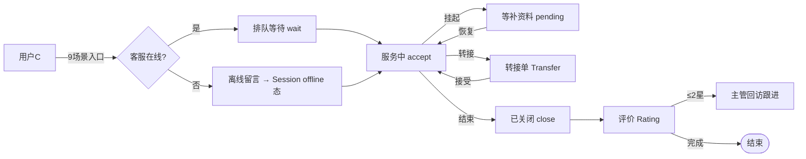
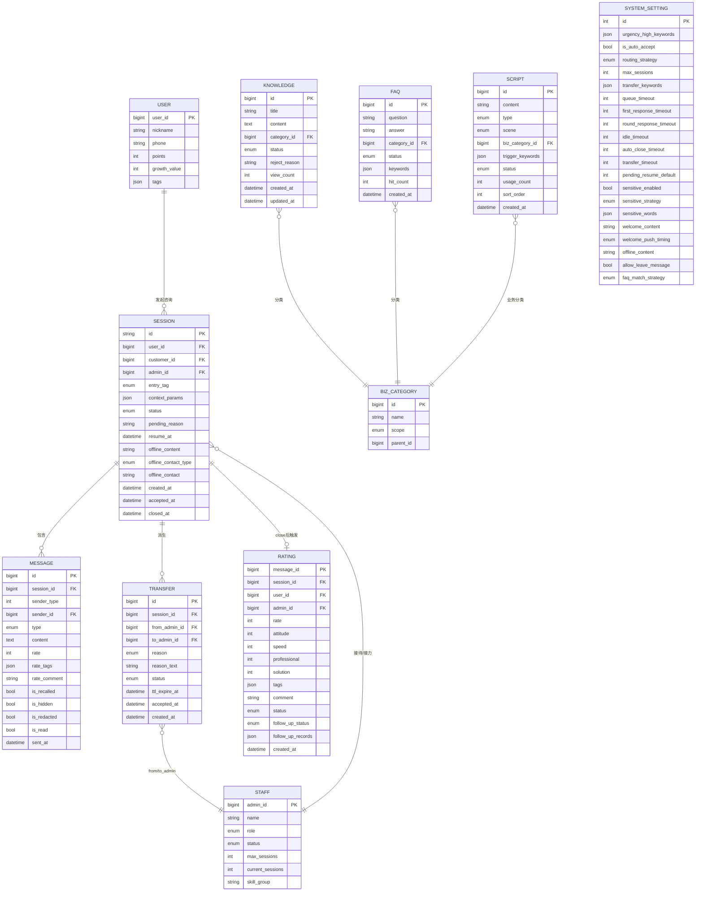
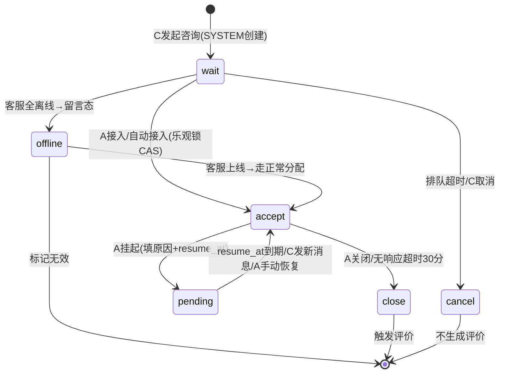
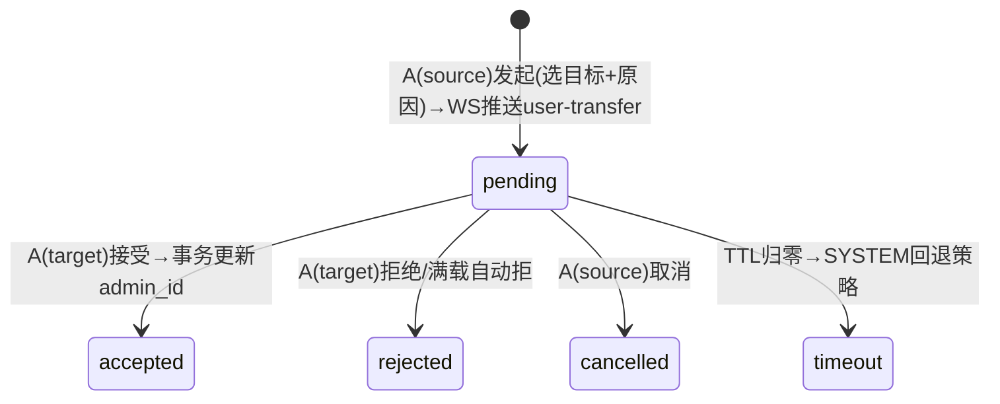
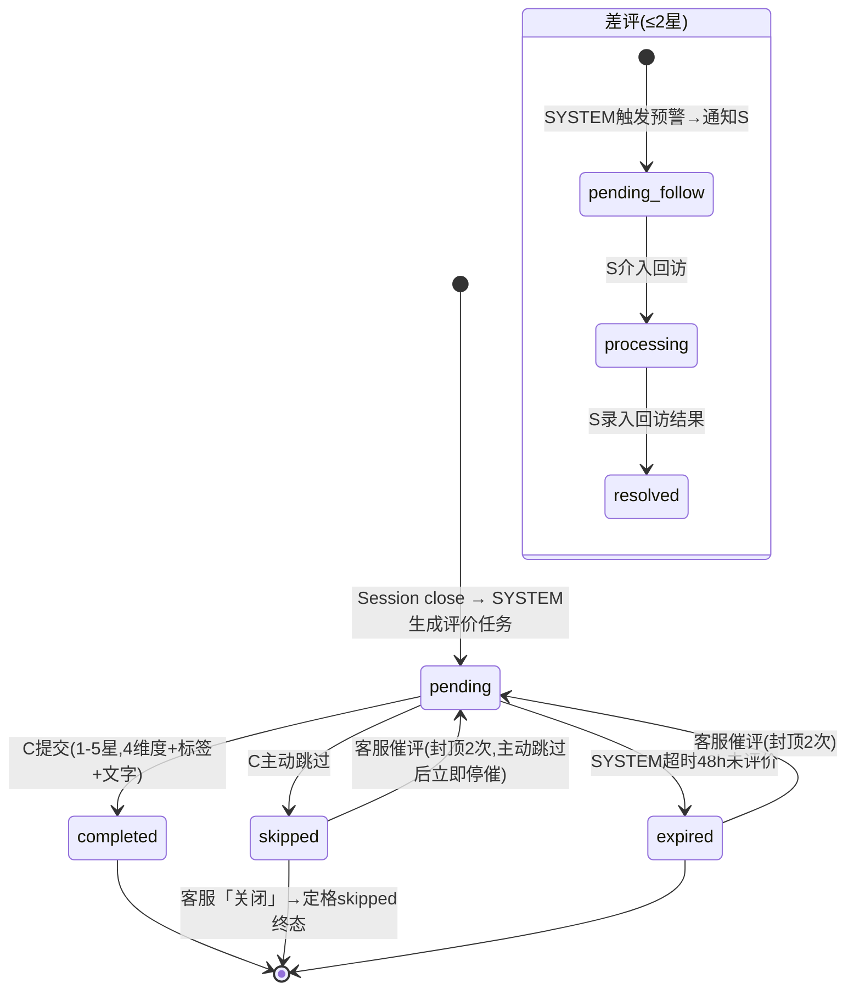
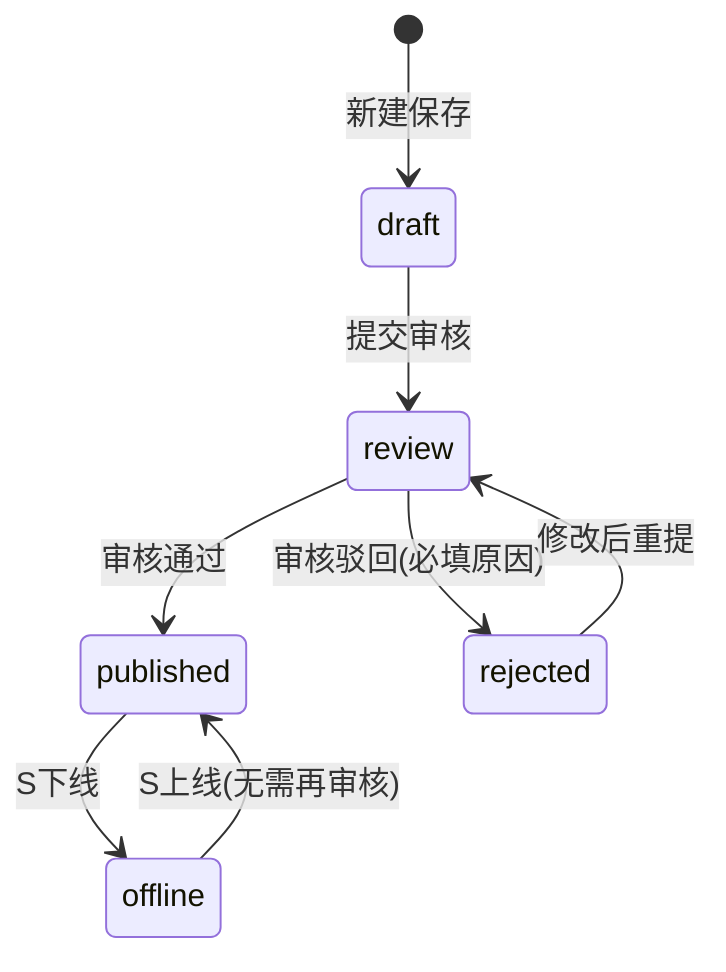

# 商城客服系统 · 业务建模文档 V0.3

> | 版本       | 日期             | 说明                                                                                           |
> | -------- | -------------- | -------------------------------------------------------------------------------------------- |
> | V0.1     | 2026-06-15     | 从管理端原型逆向提取实体，建状态机+关系图（原 `业务实体模型-管理端原型_V1.0.md`）                                              |
> | V0.2     | 2026-06-24     | 双视角（业务+开发）重构：留言降级为 Session offline 态、新增 FAQ 实体、快捷回复并入话术、Settings 重组（原 `业务实体模型_V2.0.md`）      |
> |   V0.3   |   2026-06-26   |   四维框架重构  ：角色泳道 → 单据实体(含ER图) → 用例拆解(十字法) → 约束规则。合入 ADR 0012、FAQ 实体、Settings 5 区块等全部 V0.2 决策。 |
>
>   读法  ：§1-§3 讲清业务全貌，§4-§6 逐模块拆解到可开发粒度，§7 为 PM 遗留决策。

***

## §1 业务闭环

>   一句话  ：C 端用户在商城任意页面点击客服按钮发起会话 → 客服(A)在工作台接入/转接/结束 → 离线时会话进留言态等待分配 → 关闭后触发评价 → 差评由主管(S)回访闭环。

### 1.1 范围边界


本期做（1 期 MVP，16 页原型）

：

| 模块    |  简称 | 优先级 | 核心功能                              |
| ----- | :-: | :-: | --------------------------------- |
| 用户端咨询 |  U  |  P0 | 9 场景入口 + 聊天（文字/图片/语音/卡片）+ 历史会话    |
| 工作台   |  W  |  P0 | 仪表盘 + 三栏工作台（会话列表/聊天窗/客户信息）        |
| 会话管理  |  S  |  P0 | 历史会话 + 转接 + 评价 + 留言(offline态)     |
| 知识库   |  C  |  P1 | 知识文档 + 话术(含快捷回复) + FAQ + 5 区块系统设置 |


本期不做

：工单系统、AI 机器人/质检/报表、客服账号 CRUD、渠道接入（详见 PRD §1.2）。

### 1.2 端到端流程



***

## §2 角色泳道

### 2.1 角色定义

| 角色   |   代号   | source | 权限边界                                    |
| ---- | :----: | :----: | --------------------------------------- |
| 终端用户 |    C   |    0   | 发起会话、发消息、提交留言、提交/跳过评价、浏览 FAQ            |
| 客服 | A | 1 | 接入/回复/撤回/脱敏/挂起/转接/结束会话、使用快捷回复、查看客户 360°。**仅见分配给自己的会话**（工作台/历史会话均按 admin_id 过滤） |
| 客服主管 | S | 1(高位) | 留言分配/认领、知识库审核/上下线、话术管理、差评回访、全局设置。**见全部会话**（含他人接待中），A/S 的差别在权限位 |
| 系统   | SYSTEM |    2   | 超时关闭、TTL 回退、敏感词过滤、欢迎语推送、冷却防重、评价超时归跳过    |

> 审计口径：任一会话状态迁移必须可区分 S（人点）还是 SYSTEM（自动）。

### 2.2 角色 × 阶段矩阵

| 阶段              |              C             |           A           |     S     |         SYSTEM         |
| --------------- | :------------------------: | :-------------------: | :-------: | :--------------------: |
|   发起咨询          | 点击客服按钮，携带 entry\_tag + 上下文 |           —           |     —     | 创建会话 status=wait，推送欢迎语 |
|   排队等待          |           查看排队人数           |         查看等待列表        |     —     |    超时→cancel/offline   |
|   服务中           |          收发消息、收卡片          |    回复/转接/挂起/结束/收发卡片   |     —     |          敏感词过滤         |
|   挂起            |         等待，发新消息自动恢复        |        设原因+恢复时间       |     —     |    resume\_at 到期自动恢复   |
|   转接            |           收到切换提示           | source 发起/target 接受或拒 |   配置回退策略  |      TTL 倒计时→超时回退      |
|   留言(offline)   |        填写留言提交（60s冷却）       |        认领后走正常接待       |  在会话列表分配  |            —           |
|   会话结束          |           收到评价邀请           |          会后总结         |     —     |       超时自动 close       |
|   评价            |          4维度评分/跳过          |          查看评价         |   差评回访跟进  |          超时归跳过         |
|   FAQ/知识库       |          搜索/浏览 FAQ         |         使用快捷回复        | 审核/发布/上下线 |            —           |
|   系统配置          |              —             |           —           |   5 区块设置  |        读参数驱动状态机        |

***

## §3 单据实体模型

### 3.1 实体关系图（Mermaid ER）

| 英文 | 中文 | 英文 | 中文 |
|------|------|------|------|
| USER | 用户 | RATING | 评价 |
| STAFF | 客服 | KNOWLEDGE | 知识文档 |
| SESSION | 会话 | FAQ | FAQ常见问题 |
| MESSAGE | 消息 | SCRIPT | 话术 |
| TRANSFER | 转接单 | BIZ_CATEGORY | 业务分类 |
| — | — | SYSTEM_SETTING | 系统设置 |



**字段说明**（类型 + 约束 + 枚举值）：

| 表 | 字段 | 中文名 | 类型/说明 |
|----|------|--------|-----------|
| USER | user_id | 用户ID | 会员库 |
| USER | tags | 客户标签 | 高价值/易流失/复购用户等 |
| STAFF | role | 角色 | agent / supervisor |
| STAFF | status | 状态 | online / busy / offline |
| STAFF | max_sessions | 接待上限 | 默认 10 |
| STAFF | current_sessions | 实时负载 | WebSocket 统计 |
| STAFF | skill_group | 技能组 | 退款专员/售后客服/综合客服 |
| SESSION | id | 会话ID | #CS+日期+序号 |
| SESSION | customer_id | 租户ID | 多租户隔离 |
| SESSION | entry_tag | 场景标签 | home/product/order/cart/help/profile/logistics/refund/phone |
| SESSION | context_params | 上下文参数 | product_id/order_id/tracking_no 等 JSON |
| SESSION | status | 会话状态 | wait/accept/pending/offline/close/cancel |
| SESSION | offline_content | 留言内容 | offline 态时存储 |
| SESSION | offline_contact_type | 联系方式类型 | phone/wechat/email |
| MESSAGE | sender_type | 发送方 | 0=用户 / 1=客服 / 2=系统 |
| MESSAGE | type | 消息类型 | text/image/audio/card/rate/notice |
| MESSAGE | content | 内容 | 文本或卡片 JSON |
| MESSAGE | rate | 评分 | 1-5，type=rate 时必填 |
| MESSAGE | rate_comment | 评价文字 | ≤200 字，选填 |
| TRANSFER | session_id / to_admin_id | 联合唯一 | 防并发重复转接 |
| TRANSFER | reason | 转接原因 | vip/skill/busy/timeout |
| TRANSFER | status | 转接状态 | pending/accepted/rejected/cancelled/timeout |
| TRANSFER | ttl_expire_at | TTL 到期 | 默认 5 分钟，1~60 可配 |
| RATING | message_id | 评价ID | 即 MESSAGE.id（type=rate） |
| RATING | rate | 综合评分 | 1-5，≤2 判定差评 |
| RATING | attitude/speed/professional/solution | 四维度 | 各 1-5 分 |
| RATING | status | 评价状态 | pending/completed/skipped/expired（skipped=主动跳过/expired=48h超时） |
| RATING | follow_up_status | 差评跟进 | pending/processing/resolved |
| RATING | follow_up_records | 跟进记录 | JSON 时间线 |
| KNOWLEDGE | status | 文章状态 | draft/review/published/offline/rejected |
| KNOWLEDGE | reject_reason | 驳回原因 | status=rejected 时必填 |
| FAQ | status | FAQ状态 | on/off |
| FAQ | keywords | 触发关键词 | JSON 数组 |
| SCRIPT | type | 类型 | script / quickreply |
| SCRIPT | scene | 触发场景 | enter/offline/keyword/transfer/general |
| SCRIPT | trigger_keywords | 触发关键词 | scene=keyword 时必填 |
| SCRIPT | status | 状态 | on/off |
| BIZ_CATEGORY | scope | 适用范围 | knowledge / script |
| BIZ_CATEGORY | parent_id | 父分类 | 自引用树 |
| SYSTEM_SETTING | id | — | 单行=1 |
| SYSTEM_SETTING | is_auto_accept | 自动接入 | bool，默认 true |
| SYSTEM_SETTING | routing_strategy | 分流策略 | round_robin / idle |
| SYSTEM_SETTING | max_sessions | 客服上限 | 默认 10 |
| SYSTEM_SETTING | transfer_keywords | 转人工词表 | JSON：人工/客服/投诉/退款/售后/转人工 |
| SYSTEM_SETTING | urgency_high_keywords | 紧急关键词 | 退款/退货/投诉/差评/破损/物流异常 |
| SYSTEM_SETTING | queue_timeout | 排队超时 | 秒，默认 240 |
| SYSTEM_SETTING | first_response_timeout | 首次响应 | 分钟 |
| SYSTEM_SETTING | round_response_timeout | 轮次响应 | 分钟，默认 3 |
| SYSTEM_SETTING | idle_timeout | 用户静默 | 分钟，默认 15 |
| SYSTEM_SETTING | auto_close_timeout | 自动关闭 | 分钟，默认 30 |
| SYSTEM_SETTING | transfer_timeout | 转接超时 | 分钟，默认 5 |
| SYSTEM_SETTING | pending_resume_default | 挂起恢复 | 分钟，默认 10 |
| SYSTEM_SETTING | sensitive_enabled | 敏感词开关 | bool |
| SYSTEM_SETTING | sensitive_strategy | 命中策略 | replace_both / replace_user_only |
| SYSTEM_SETTING | sensitive_words | 敏感词库 | 商城供给，按分组 JSON |
| SYSTEM_SETTING | welcome_content | 欢迎语 | ≤200 字 |
| SYSTEM_SETTING | welcome_push_timing | 推送时机 | immediate / after_accept |
| SYSTEM_SETTING | offline_content | 离线语 | 全客服离线展示 |
| SYSTEM_SETTING | faq_match_strategy | FAQ命中策略 | first / all / priority |

### 3.2 实体定义

#### 3.2.1 类型判定

| 类型        | 判据                          | 本系统                                                           |
| --------- | --------------------------- | ------------------------------------------------------------- |
|   聚合根实体   | 有 ID + 状态机 + 独立表 + 外部唯一访问入口 | Session、User                                                  |
|   实体      | 有 ID + 独立生命周期 + 持久化         | Message、Transfer、Rating、Knowledge、FAQ、Script、BusinessCategory |
|   值对象     | 无 ID，由属性值定义                 | entry\_tag、转接原因、评价标签、会员等级、订单（外部引用）                            |
|   单例参数    | 全局唯一行                       | SystemSetting                                                 |
|   视图      | 不产生数据，跨实体聚合                 | Todo、Dashboard                                                |

#### 3.2.2 核心实体速查

| 实体               | 表                                   | ID 格式     | 状态枚举                                        |      聚合归属     |
| ---------------- | ----------------------------------- | --------- | ------------------------------------------- | :-----------: |
| Session          | `customer_chat_sessions`            | #CS+日期+序号 | wait/accept/pending/offline/close/cancel    |  Session 聚合根  |
| Message          | `customer_chat_messages`            | 自增        | 正常/已撤回/已隐藏/已脱敏                              |   依附 Session  |
| Transfer         | `customer_chat_transfers`           | 自增        | pending/accepted/rejected/cancelled/timeout |   依附 Session  |
| Rating           | `customer_chat_messages`(type=rate) | 同 Message | pending/completed/skipped                   |   依附 Session  |
| Knowledge        | `customer_chat_knowledge_base`      | 自增        | draft/review/published/offline/rejected     | Knowledge 聚合根 |
| FAQ              | `customer_chat_faqs`                | 自增        | on/off                                      |       配置      |
| Script           | `customer_chat_auto_messages`       | 自增        | on/off（含 quickreply）                        |       配置      |
| BusinessCategory | `customer_chat_categories`          | 自增        | —                                           |       配置      |
| SystemSetting    | `customer_chat_settings`            | 单行=1      | —                                           |      全局参数     |

>   已删除的表  ：`customer_chat_leave_messages` / `customer_chat_leave_replies` — ADR 0012 决定留言为 Session 的 `offline` 状态，留言内容直接写入 Session 的 `offline_content` 字段。

### 3.3 聚合边界

```
┌──── Session 聚合 ───────────────────────────────────┐
│  SESSION (聚合根)                                     │
│    ├── MESSAGE × N                                    │
│    ├── TRANSFER × N                                   │
│    └── RATING × 1                                     │
│                                                       │
│  事务规则：                                             │
│  · 接受转接 → 同一事务更新 sessions.admin_id            │
│    和 transfers.status                                 │
│  · session_id + to_admin_id 联合唯一约束防并发          │
│  · 多客服抢同一 wait 会话 → 乐观锁 CAS                  │
│  · 删 Session → 级联删 Message/Transfer                │
└───────────────────────────────────────────────────────┘
```

### 3.4 状态机

#### 会话状态机（全系统中枢，含 offline 留言态）



| 状态      | 含义    | 进入条件        | 可流转至                  | 关键规则                        |
| ------- | ----- | ----------- | --------------------- | --------------------------- |
| wait    | 排队等待  | C发起咨询       | accept/cancel/offline | 推送排队计数；客服全离线→offline        |
| accept  | 服务中   | A接入         | pending/close         | 消息双向收发；可挂起/转接               |
| pending | 挂起    | A挂起         | accept                |   不计入无响应超时  ；C发消息优先恢复       |
| offline | 留言待处理 | 客服全离线/C主动留言 | accept                | 客服上线后走正常分配；留言内容存 Session 字段 |
| close   | 已关闭   | A关闭/超时      | 终态                    | 触发评价卡片                      |
| cancel  | 已取消   | 排队超时/C取消    | 终态                    | 不生成评价任务                     |

#### 转接单状态机



#### 评价状态机（含差评跟进）



#### 知识库文章状态机



***

## §4 用例拆解（十字法）

> 十字法 = 角色 × 场景 交叉，每个交叉点拆   正常用例   +   异常/边界用例  。

### 4.1 用户端咨询（C × 会话入口）

| 编号      | 场景     | 前置               | 动作           | 预期                                            |
| ------- | ------ | ---------------- | ------------ | --------------------------------------------- |
| UC-U-01 | 首页咨询   | 商城首页             | 点击悬浮「联系客服」按钮 | 跳转聊天页，携带 `entry_tag:home`                     |
| UC-U-02 | 商品咨询   | 商品详情页            | 点击「商品咨询」     | 自动发送商品卡片 + `entry_tag:product` + `product_id` |
| UC-U-03 | 订单咨询   | 订单详情页            | 点击「订单咨询」     | 自动发送订单卡片 + `entry_tag:order` + `order_id`     |
| UC-U-04 | 发送消息   | 会话 status=accept | 输入文字按 Enter  | 右侧气泡 + 时间戳；空内容不发送                             |
| UC-U-05 | 接收客服卡片 | 客服发送卡片           | 查看会话         | 订单卡(橙)/商品卡(绿)/优惠券(红) + 操作按钮                   |
| UC-U-06 | 查看历史会话 | 聊天页顶部            | 点击时钟图标       | 右侧滑入历史面板（时间/状态/客服/预览）                         |

| 编号       | 异常场景     | 触发条件             | 处理                  |
| -------- | -------- | ---------------- | ------------------- |
| UC-U-E01 | 客服离线     | 进入聊天页检测无客服在线     | 会话进 offline 留言态     |
| UC-U-E02 | 电话咨询仅 H5 | 小程序环境点电话         | 不支持拨号，提示仅 H5 可用     |
| UC-U-E03 | 挂起期间发消息  | pending 态 C 发新消息 | 立即恢复 accept（用户行为优先） |

### 4.2 工作台接待（A × 会话操作）

| 编号      | 场景        | 前置           | 动作              | 预期                        |
| ------- | --------- | ------------ | --------------- | ------------------------- |
| UC-W-01 | 查看仪表盘     | 进入仪表盘        | 页面加载            | 4 张指标卡：今日会话/在线客服/响应时长/满意度 |
| UC-W-02 | 会话列表 Tab  | 工作台左侧        | 点击「进行中/等待中/已关闭」 | 切换过滤 + 计数徽标变色             |
| UC-W-03 | 发送消息      | 已选中会话        | 输入文字 Enter      | WS 推送；Shift+Enter 换行      |
| UC-W-04 | 快捷回复      | 已选中会话        | 点「快捷回复▾」→ 选话术   | 话术填入输入框                   |
| UC-W-05 | 消息撤回      | hover 客服消息   | 「⋯」→「撤回」        | 替换为撤回提示，仅限 2 分钟内          |
| UC-W-06 | 脱敏处理      | hover 用户消息   | 「⋯」→「脱敏」        | 手机号→前3后4打码，地址→`****`      |
| UC-W-07 | 隐藏消息      | hover 用户消息   | 「⋯」→「隐藏」        | 替换为「已被管理员隐藏」              |
| UC-W-08 | 挂起会话      | 选中 accept 会话 | 「挂起」→ 填原因+恢复时间  | status=pending，暂停超时计时     |
| UC-W-09 | 查看客户 360° | 选中会话         | 右栏切换基础/行为/交易/服务 | 多源数据聚合，失败降级               |

| 编号       | 异常场景      | 触发条件          | 处理                     |
| -------- | --------- | ------------- | ---------------------- |
| UC-W-E01 | 多客服抢同一会话  | 同时接入 wait 会话  | 乐观锁 CAS，仅第一个成功         |
| UC-W-E02 | 撤回超时      | 超过 2 分钟       | 拒绝撤回                   |
| UC-W-E03 | 客户视图数据源失败 | 会员库/埋点/OMS 超时 | 该 Tab 降级显示「数据暂不可用」+ 重试 |

### 4.3 会话转接（A × 转接流程）

| 编号       | 场景     | 前置           | 动作               | 预期                               |
| -------- | ------ | ------------ | ---------------- | -------------------------------- |
| UC-TR-01 | 发起转接   | 选中 accept 会话 | 「转接」→ 选目标客服 → 确认 | 创建转接单，WS 推送 user-transfer，TTL 启动 |
| UC-TR-02 | 接受转接   | 目标客服收到通知     | 点「接受」            | 同一事务更新 admin\_id + 转接状态，源退出      |
| UC-TR-03 | 查看客服负载 | 转接页右侧        | 查看容量条            | 绿(<50%)/黄(50-80%)/红(满载)，满载不可选    |
| UC-TR-04 | 配置回退策略 | 转接页          | 设 TTL 分钟数 + 回退动作 | 新策略对后续转接生效                       |

| 编号        | 异常场景      | 触发条件                      | 处理                            |
| --------- | --------- | ------------------------- | ----------------------------- |
| UC-TR-E01 | 目标满载      | `current >= max_sessions` | 卡片标红「满载」，`cursor:not-allowed` |
| UC-TR-E02 | TTL 超时    | `ttl_expire_at < now` 无响应 | SYSTEM 自动执行回退策略               |
| UC-TR-E03 | 转接中 C 发消息 | pending 转接单存在             | source 只读，C 侧提示「正在转接」         |
| UC-TR-E04 | 接受时容量变满 | 接受瞬间满容 | 并发校验（乐观锁），返回「容量已满」 |
| UC-TR-E05 | 连环转接限深 | 第 3 跳再发起 | 拒绝转接；timeout 回退「重新排队」时计数重置 |
| UC-TR-E06 | 重排队终止兜底 | 累计重新排队 2 次无人接手 | 回原客服/否则关闭+致歉+留言邀约 |
| UC-TR-E07 | 失败回流消息 | rejected/cancelled/timeout | 转接期间队列消息退原客服不丢（ADR-0003 Q4） | 接受时容量变满   | 接受瞬间满容                    | 并发校验（乐观锁），返回「容量已满」            |

### 4.4 评价管理（A/S × 评价生命周期）

| 编号       | 场景     | 前置       | 动作            | 预期                     |
| -------- | ------ | -------- | ------------- | ---------------------- |
| UC-RA-01 | 查看评价列表 | 评价管理页    | 按星级/客服/关键词筛选  | 差评行黄底高亮                |
| UC-RA-02 | 差评追踪   | 差评行(≤2星) | 点击「差评追踪」      | 打开回访跟进流程（时间线）          |
| UC-RA-03 | 录入回访结果 | 差评跟进中    | S 填回访结果       | follow\_up\_status→已解决 |
| UC-RA-04 | 催评     | 待办-待评价   | 「催评」/「一键催评全部」 | WS 推送评价邀请至 C 端         |

| 编号        | 异常场景      | 处理                                                 |
| --------- | --------- | -------------------------------------------------- |
| UC-RA-E01 | C 跳过评价    | `sessionStorage.cs_rating_status='skipped'`，本会话不再弹 |
| UC-RA-E02 | 评价超时      | 48h 未评价→SYSTEM 归 expired；仍可催评（封顶 2 次）                      |
| UC-RA-E03 | cancel 会话 | 不生成评价任务                                            |
| UC-RA-E04 | 催评封顶      | 会话维度封顶 2 次（不分 skipped/expired 累计）；C 主动跳过后立即停催         |

### 4.5 留言处理（S × offline 会话）

| 编号       | 场景     | 前置             | 动作             | 预期               |
| -------- | ------ | -------------- | -------------- | ---------------- |
| UC-LV-01 | 查看离线会话 | 会话列表「离线待处理」Tab | 筛选 offline 态会话 | 显示留言内容/联系方式/提交时间 |
| UC-LV-02 | 认领/分配  | offline 会话     | 认领或分配客服        | 客服上线→走正常会话路由     |
| UC-LV-03 | 标记无效   | offline 会话     | 标记无效           | 会话关闭，不计入统计       |

| 编号        | 异常场景      | 处理                    |
| --------- | --------- | --------------------- |
| UC-LV-E01 | 60 秒内重复提交 | 同一 C 相似内容仅保留首条        |
| UC-LV-E02 | 在线时主动留言   | 会话进 offline 态，不影响在线服务 |

### 4.6 知识库与 FAQ（S × 内容配置）

| 编号       | 场景     | 前置            | 动作                   | 预期                         |
| -------- | ------ | ------------- | -------------------- | -------------------------- |
| UC-KB-01 | 新建知识文章 | 知识库页          | 「+新建」→ 富文本编辑 → 保存    | status=draft               |
| UC-KB-02 | 提交审核   | status=draft  | 点「提交审核」              | status=review              |
| UC-KB-03 | 审核通过   | status=review | S 审核 → 通过            | status=published，FAQ 同步更新  |
| UC-KB-04 | 审核驳回   | status=review | S 审核 → 驳回+填原因        | status=rejected，操作列变「修改重提」 |
| UC-KB-05 | 新建 FAQ | FAQ 页         | 「+新建」→ 填问题/答案/分类/关键词 | status=on                  |
| UC-KB-06 | 话术双维筛选 | 话术库页          | 场景标签 + 业务分类标签        | AND 组合筛选，计数更新              |

| 编号        | 异常场景     | 处理                                          |
| --------- | -------- | ------------------------------------------- |
| UC-KB-E01 | FAQ 停用   | status=off，不参与命中推送                          |
| UC-KB-E02 | 业务分类混用   | 知识库 5 类和话术 5 类共享 `modal-category` 组件但值不同，勿混 |

### 4.7 用户端自助（C × FAQ/留言/评价）

| 编号       | 场景       | 动作                | 预期                                                   |
| -------- | -------- | ----------------- | ---------------------------------------------------- |
| UC-FU-01 | FAQ 搜索筛选 | 搜索框输入/点分类标签       | 过滤列表，单展开显示答案+有用/没用反馈                                 |
| UC-FU-02 | FAQ 转人工  | 点「转人工客服」          | 跳转聊天页，携带 `entry_tag:help`                            |
| UC-FU-03 | 离线留言提交   | 填称呼+选联系方式+填内容→提交  | 成功页+留言编号+60s冷却倒计时                                    |
| UC-FU-04 | 提交评价     | 4 维度星级+标签多选+文字→提交 | `sessionStorage.cs_rating_status='completed'`        |
| UC-FU-05 | 跳过评价     | 点「跳过」             | `sessionStorage.cs_rating_status='skipped'`，toast 提示 |

***

## §5 约束与规则清单

### 5.1 不可违反的不变性约束

|   编号   | 约束                                     | 涉及实体               | 实现方式              |
| :----: | -------------------------------------- | ------------------ | ----------------- |
| INV-01 | cancel 会话不生成评价任务                       | Session → Rating   | 状态机守卫             |
| INV-02 | pending 态不计入无响应超时                      | Session            | cron 跳过 pending   |
| INV-03 | C 发新消息优先于 resume\_at 定时恢复              | Session            | WS 拦截             |
| INV-04 | 消息撤回限 2 分钟内                            | Message            | `data-sent-ts` 校验 |
| INV-05 | 60 秒内同 C 相似留言仅首条                       | Session(offline)   | 后端去重              |
| INV-06 | 转接接受时 admin\_id 和 transfer status 同一事务 | Session + Transfer | 事务                |
| INV-07 | 多客服抢同 wait 会话仅首个成功                     | Session            | 乐观锁 CAS           |
| INV-08 | session\_id + to\_admin\_id 联合唯一       | Transfer           | DB 约束             |
| INV-09 | 敏感词库不可达时 fail-open 放行                  | Message            | ADR-0008          |
| INV-10 | 客服容量=0 不参与自动分配（手动不受限）                  | Staff              | 路由逻辑              |

### 5.2 系统设置驱动的参数

| 区块     | 参数                       | 默认值            | 影响范围                |
| ------ | ------------------------ | -------------- | ------------------- |
| 客服分配规则 | `is_auto_accept`         | true           | wait→accept 手动/自动   |
| 客服分配规则 | `routing_strategy`       | round\_robin   | 新会话分配逻辑             |
| 客服分配规则 | `max_sessions`           | 10             | 客服满载判定              |
| 客服分配规则 | `transfer_keywords`      | 人工/客服/投诉/退款/售后 | C 消息命中→自动转人工        |
| 紧急度设置   | `urgency_high_keywords`  | 退款/退货/投诉/差评/破损/物流异常 | 命中→紧急；等待≥T→紧急 |
| 会话超时   | `queue_timeout`          | 240s           | wait→cancel/offline |
| 会话超时   | `first_response_timeout` | 5min           | 首次响应预警              |
| 会话超时   | `round_response_timeout` | 3min           | accept 对话中每轮响应       |
| 会话超时   | `idle_timeout`           | 15min          | 静默提醒                |
| 会话超时   | `auto_close_timeout`     | 30min          | accept→close        |
| 会话超时   | `transfer_timeout`       | 5min           | TTL 回退              |
| 会话超时   | `pending_resume_default` | 10min          | pending→accept      |
| 敏感词    | `sensitive_enabled`      | true           | 消息中间件开关（默认开）        |
| 敏感词    | `sensitive_strategy`     | replace_both   | 替换双方/仅用户端替换 |
| 自动回复   | `welcome_content`        | —              | 新会话 0.5s 内推送        |
| 自动回复   | `offline_content`        | —              | 全客服离线展示             |

***

## §6 领域事件

| 事件                      | 触发             | 后续动作                     |
| ----------------------- | -------------- | ------------------------ |
| `SessionCreated`        | C 发起咨询         | 推送 wait 队列；触发欢迎语         |
| `SessionAccepted`       | A 接入           | 推送 user-online；加载客户 360° |
| `SessionSuspended`      | A 挂起           | 暂停超时计时；移入挂起列表            |
| `SessionResumed`        | pending 恢复     | 重新计入超时；A 收到提醒            |
| `SessionEnteredOffline` | 客服全离线/C 留言     | 进 offline 态；待办新增         |
| `SessionClosed`         | A 关闭/SYSTEM 超时 | 下发评价卡片；归档                |
| `SessionCancelled`      | 排队超时/C 取消      | 不生成评价                    |
| `MessageSent`           | 双向发送           | WS 推送对端；敏感词过滤            |
| `MessageRecalled`       | A 撤回(≤2min)    | 替换撤回提示                   |
| `MessageModerated`      | S 隐藏/脱敏        | 气泡内容变更                   |
| `TransferCreated`       | A(source)发起    | WS user-transfer；TTL 启动  |
| `TransferAccepted`      | A(target)接受    | 事务更新归属                   |
| `TransferTimedOut`      | TTL 到期         | SYSTEM 回退                |
| `RatingSubmitted`       | C 提交           | 更新仪表盘；≤2 星→差评预警          |
| `RatingSkipped`         | C 跳过/超时        | 不计入分母                    |
| `BadRatingAlerted`      | 差评提交           | 通知 S 回访                  |
| `FollowUpResolved`      | S 录入结果         | 差评闭环                     |
| `ArticleSubmitted`      | 作者提交审核         | 进审核队列                    |
| `ArticlePublished`      | 审核通过           | FAQ 同步                   |
| `SettingsChanged`       | S 保存设置         | 新参数对后续生效                 |

***

## §7 待决策缺口

|  #  | 缺口                                            | 影响                          | 建议                                                 |
| :-: | --------------------------------------------- | --------------------------- | -------------------------------------------------- |
|  B1 | 超时阈值两套概念（todo 预警 5/4/15 vs settings 动作 15/30） | 开发不知用哪套                     | todo 是是是预警展示是是阈值，settings 是是是自动动作是是阈值；并存但命名解耦      |
|  B2 | 欢迎语/离线语与话术职责重叠                                | 双写冲突                        | settings 做全局默认，scripts 做场景细化覆盖                     |
|  B3 | cancel vs close 精确触发条件                        | 审计口径模糊                      | cancel=排队超时+C主动取消；close=正常结束+超时关闭                  |
|  B4 | 客服「忙碌」态 UI 缺失                                 | 状态机不完整                      | 补 busy 态：不接受新会话但完成当前                               |
|  B5 | 三层归属是演示假数据                                    | 表结构无 brand/app 字段           | 确定真实粒度；1期可能仅需 `customer_id`                        |
|  B6 | 知识库完整审核流 5 态                                  | 原型列表仅见 published/rejected   | 按本文 §3.4 补全                                        |
|  B7 | 差评跟进无独立 follow\_up\_status 字段                 | 跟进无法持久化                     | Rating 表加 follow\_up\_status + follow\_up\_records |
|  B8 | 工作台会话 tab 缺 cancel                            | cancel 仅历史可见                | 补 tab 或确认 cancel 为纯终态                              |
|  B9 | 自动话术 settings 区块缺失                            | 话术触发无全局开关                   | 确认 scripts 页场景开关是否足够                               |
| B10 | 业务分类共享建模                                      | Knowledge + Script 共享组件但值不同 | 同表＋scope 字段区分，或建两表                                 |

***

>   版本归档  ：
>
> - V0.1（原始版）：`doc-pm/业务实体模型_V0.1.md`（原 业务实体模型-管理端原型\_V1.0.md）
> - V0.2（双视角版）：`doc-pm/业务实体模型_V0.2.md`（原 业务实体模型\_V2.0.md）
> -   V0.3（本文）  ：`doc-pm/业务建模_V0.3.md`
>
>   配套文档  ：
>
> - `doc-pm/V1.0/CONTEXT.md` — 术语表
> - `doc-pm/V1.0/PRD-OCS-V1.0.md` — 功能规格
> - `doc-pm/V1.0/业务逻辑清单_V1.0.md` — 完整用例表
> - `doc-pm/V1.0/PROTOTYPE-FLOWS.md` — 页面流程图
> - `doc-pm/V1.0/docs/adr/0001~0012` — 架构决策

