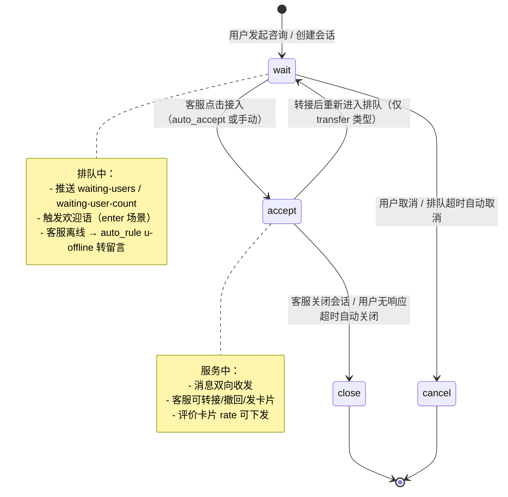
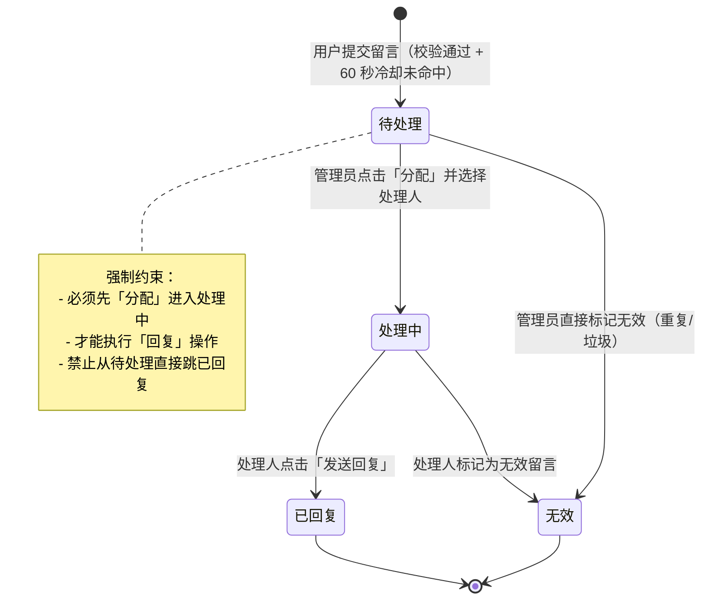
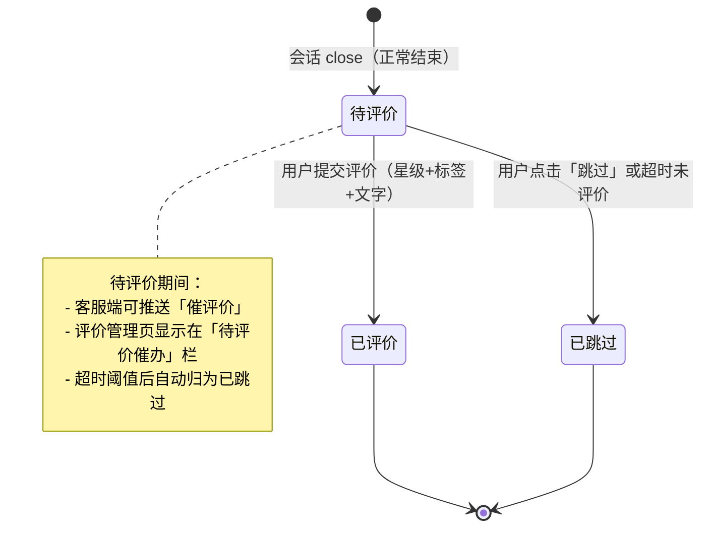
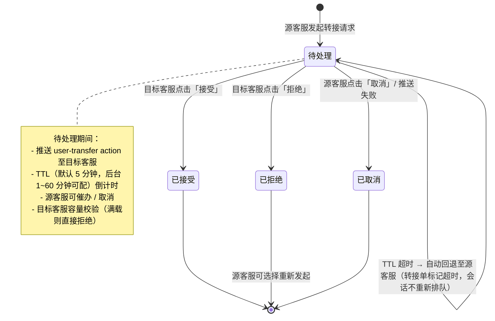
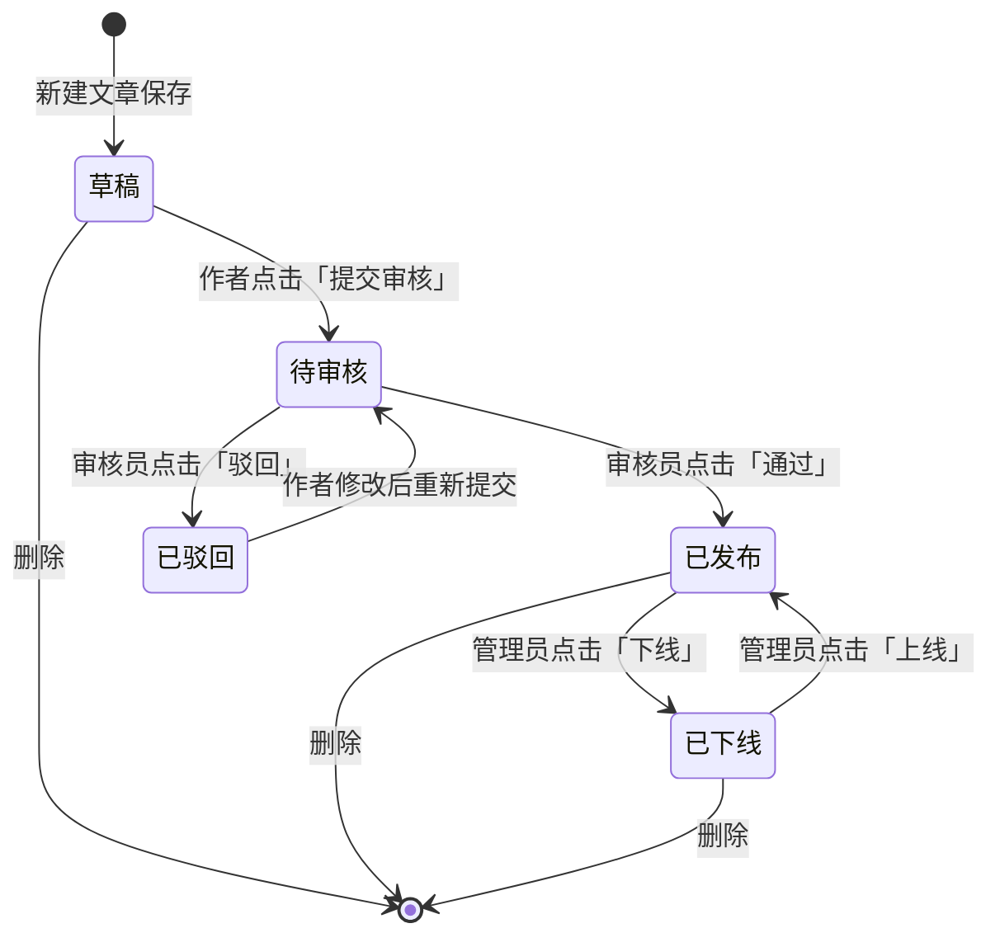
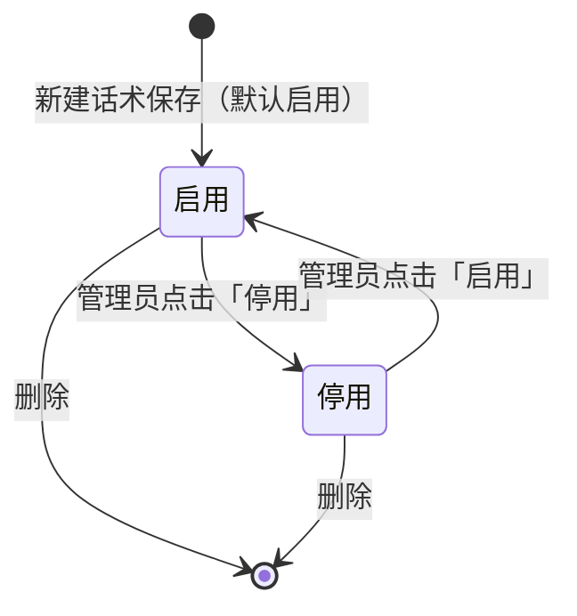
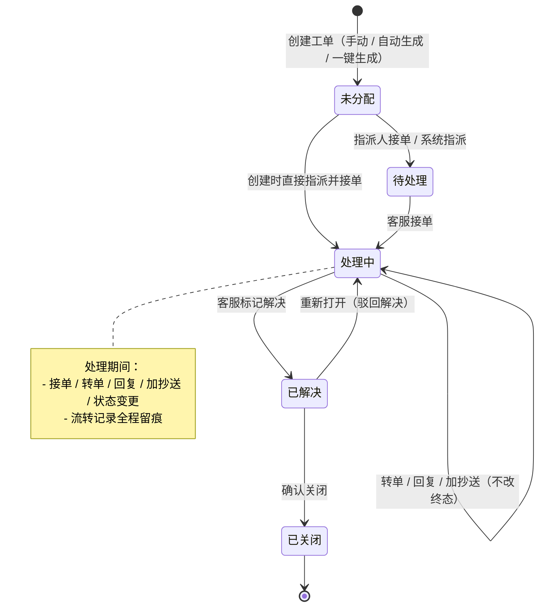
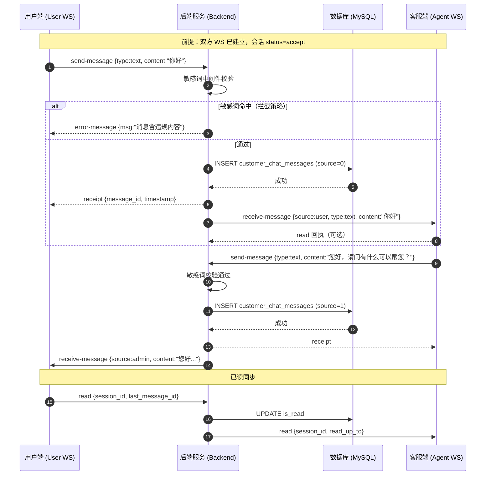
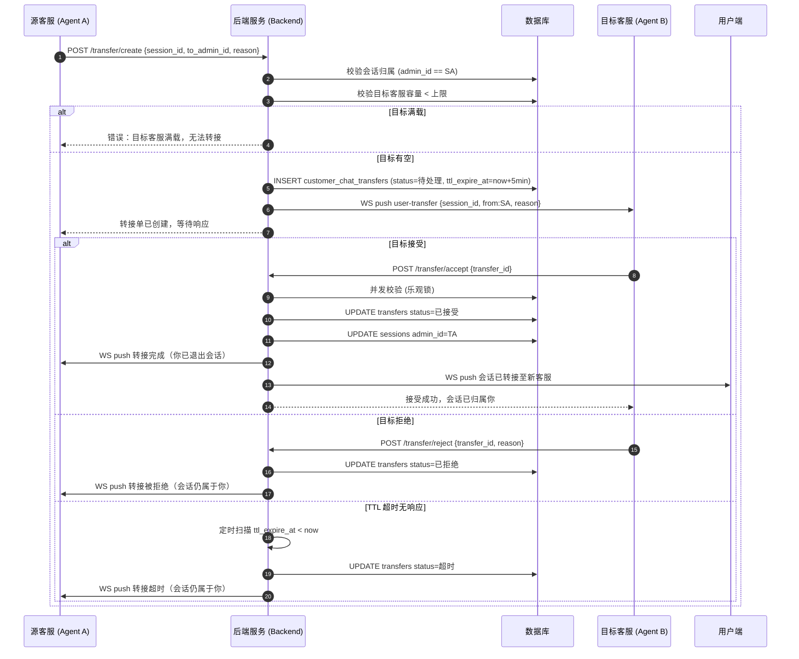
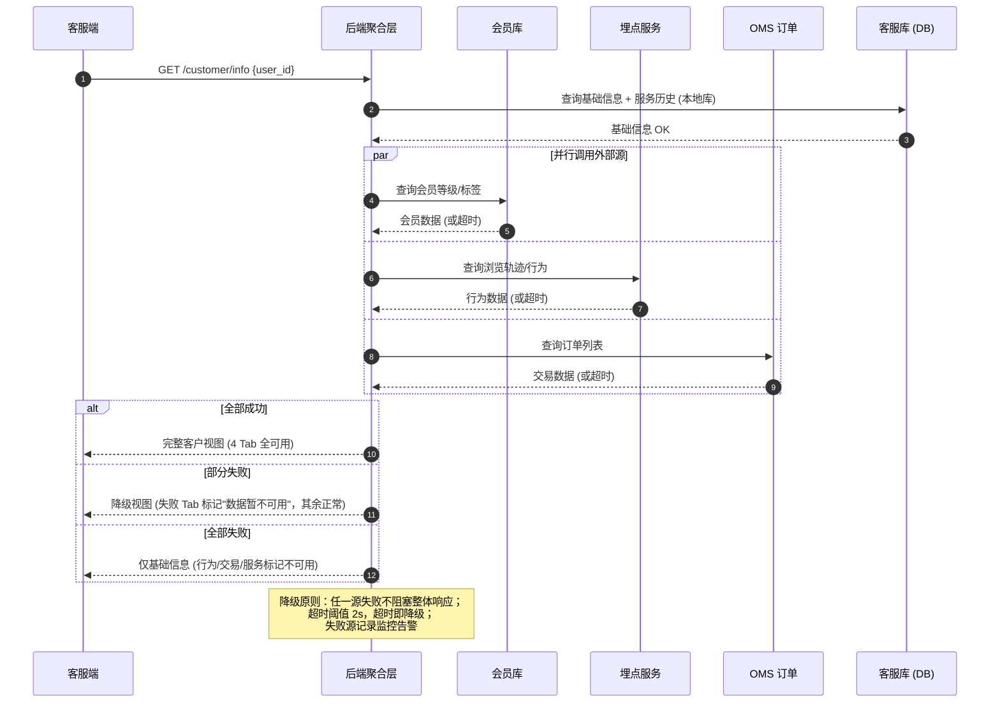

# CS 商城客服系统 - 业务逻辑清单 V1.0

> 本文档为 **Extract 模式**逆向提取，基于 `prototype-cs/` 下 20 个原型 HTML 页面（管理端 15 页 + 用户端 5 页）生成的完整业务逻辑清单。
>
> **覆盖范围**：1期-MVP 全量功能，含 2期/3期 原型页面标注。
>
> **三端架构对应**：
> - 后端 `go-chat-service/`（Go/GoFrame/WebSocket）— 会话/消息/路由/规则引擎
> - 管理端 `service-frontend/`（React/Umi Max）— 客服工作后台，对应本清单模块一~四
> - 用户端 `service-user/`（Taro/小程序+H5）— 终端用户咨询，对应本清单模块五~六
>
> **数据来源说明**：
> - 客户视图四类数据（基础信息/行为/交易/服务）分别来自 会员库、埋点系统、OMS/订单库、客服库；MVP 阶段行为/交易为 Mock 占位
> - 状态常量、WebSocket Action、路由场景来自后端 `internal/consts/consts.go`
> - 13 张核心表通过 `customer_id` 实现多租户隔离
>
> **统计口径**：
> - 会话量 = `customer_chat_sessions` 表按时间范围计数（不含 cancel）
> - 满意度 = 评价均分（`customer_chat_messages.type=rate`），1-5 星映射
> - AI 解决率 = AI 独立关闭会话数 / 总会话数（3期指标）
>
> **截图说明**：`./screenshots/*.png` 为页面截图占位，管理端为桌面布局、用户端为移动端（375×812），需手动截取补充。
>
> **最近修复（已纳入用例）**：工作台消息撤回与用户消息管理、待办评价三态筛选、客户视图加载/错误降级、转接 TTL 超时回退、留言分配/回复状态机、系统设置脏状态跟踪、知识库审核闭环、离线留言 60 秒冷却、评价跳过状态追踪。

---

## 一、登录与工作台

### 一.1 管理员登录（admin-login.html）

#### 一.1.1 功能用例表

| # | 场景 | 前置条件 | 操作步骤 | 预期结果 | 异常分支 |
|---|------|----------|----------|----------|----------|
| 1 | 密码明暗文切换 | 已进入登录页 | 点击密码输入框右侧眼睛图标（`#togglePwd`） | 密码框 `type` 在 `password`/`text` 间切换，图标在「睁眼/闭眼」SVG 间切换 | — |
| 2 | 记住我勾选/取消 | 已进入登录页 | 点击「记住我」复选框区域（`.checkbox-wrap`） | 复选框 `.checkbox-box` 的 `.checked` 类切换（蓝底白勾 / 空白边框） | 点击区域内的链接（A 标签）不触发勾选（`e.target.tagName === 'A'` 拦截） |
| 3 | 必填校验 | 未输入用户名或密码 | 直接点击「登录」按钮 | `alert('请输入用户名和密码')`，阻止提交 | 用户名或密码任一为空（`.trim()` 后为空）→ 弹窗提示并 `return false` |
| 4 | 登录成功（原型） | 用户名 `admin`、密码 `123456`（默认填入） | 点击「登录」按钮 | `alert('登录成功（原型演示）')` 后跳转 `../index.html` | — |
| 5 | 忘记密码 | 已进入登录页 | 点击「忘记密码？」链接（`href="javascript:;"`） | 原型阶段无实际跳转，占位链接 | — |
| 6 | 返回原型首页 | 已进入登录页 | 点击左上角原型提示内链接 / 底部「← 返回原型首页」 | 跳转 `../index.html` | — |

#### 一.1.2 关键字段数据来源

| 字段 | 从哪来 | 往哪去 | 变了怎么办 |
|------|--------|--------|------------|
| 用户名 | 管理端用户输入（默认 `admin`） | 登录请求体（正式版 POST `/api/backend/login`） | 输入框 `value` 实时同步，提交时 `.trim()` 后校验非空 |
| 密码 | 管理端用户输入（默认 `123456`） | 登录请求体（正式版经加密后传输） | 输入框 `value` 实时同步，`type` 随眼睛图标切换 |
| 记住我 | 管理端用户勾选状态（`.checkbox-box.checked`） | 正式版决定 JWT Token 存储时长（Cookie 过期时间） | 切换 `.checked` 类，影响后续 Token 续期策略 |
| 租户标识 | 登录页所属租户（URL 或子域名推断） | 登录请求携带 `customer_id`，隔离多租户数据 | 切换租户需重新登录，Token 失效 |

---

### 一.2 数据仪表盘（admin-dashboard.html）

#### 一.2.1 功能用例表

| # | 场景 | 前置条件 | 操作步骤 | 预期结果 | 异常分支 |
|---|------|----------|----------|----------|----------|
| 1 | 查看核心指标 | 已登录，进入仪表盘 | 页面加载 | 顶部 4 张指标卡片展示：今日会话数（1,286次）、在线客服数（18/24）、平均响应时长（42秒）、满意度评分（4.82/5.0），每张含趋势箭头（▲绿/▼绿表示提速） | 后端 `/api/backend/dashboard` 超时 → 正式版降级显示占位或错误提示（原型为静态数据） |
| 2 | 切换会话量趋势时间范围 | 已进入仪表盘 | 点击「近7天」/「今天」按钮 | 切换柱状图数据源（原型仅视觉切换按钮 active 状态） | — |
| 3 | 查看客服绩效排行 | 已进入仪表盘 | 滚动至「客服绩效排行」卡片 | 展示 Top5 客服，含排名序号（1金/2灰/3橙底色）、头像、姓名+满意度百分比、进度条（`rank-bar-fill` 宽度按分数比例）、得分（蓝/绿/橙/紫/青色区分） | 本月无数据 → 正式版显示空状态（原型为静态） |
| 4 | 查看待处理事项汇总 | 已进入仪表盘 | 查看「待处理事项」卡片 | 5 类待办按紧急度（红/黄/蓝圆点）展示计数：超时未响应（3，红色数字）、待转接确认（2，橙色数字）、差评待跟进（4，橙色数字）、未读留言（7，蓝色数字）、知识库待审核（5，蓝色数字） | — |
| 5 | 跳转待办全部 | 已进入仪表盘 | 点击「查看全部待办 →」链接 | 跳转 `admin-todo.html` | — |
| 6 | 查看今日概况 | 已进入仪表盘 | 查看「今日概况」卡片 | 展示：当前排队（6人，橙色加粗）、已接入会话（1,280）、已关闭会话（1,124）、转接次数（38）、AI 托管会话（142，紫色）、首次响应率（96.4%，绿色） | — |
| 7 | 实时状态标识 | 已进入仪表盘 | 查看右上角「实时」标签 | 绿色 `live-tag` 带脉冲动画（`@keyframes pulse`），表示数据实时推送 | WebSocket 断连 → 正式版标签变灰并提示重连 |

#### 一.2.2 关键字段数据来源

| 字段 | 从哪来 | 往哪去 | 变了怎么办 |
|------|--------|--------|------------|
| 今日会话数 | 本系统 `customer_chat_sessions` 当日新建会话计数 | 仪表盘指标卡（正式版 `/api/backend/dashboard` 接口 + WebSocket 实时推送） | 新会话建立 → 数字递增，趋势百分比对比昨日重新计算 |
| 在线客服数 | 本系统 WebSocket 连接的客服（`ActionUserOnline`）实时统计 | 仪表盘指标卡 `/18 在线 / 24 总数` | 客服上下线 → 数字即时变化 |
| 平均响应时长 | 本系统 `customer_chat_messages` 中客服首条回复与用户首条消息的时间差均值 | 仪表盘指标卡（单位：秒） | 新响应记录 → 重新计算滑动平均 |
| 满意度评分 | 本系统评价消息（`type=rate`）的 `rate` 字段平均值 | 仪表盘指标卡（`X.XX / 5.0`） | 新评价提交 → 重新计算平均值 |
| 客服绩效得分 | 本系统按客服聚合的会话数+满意度+响应速度综合评分 | 排行榜 `rank-score`（数字）+ `rank-bar-fill`（进度条宽度） | 本月数据变化 → 重新排序 Top5 |
| 待处理事项计数 | 本系统各待办类型实时统计（超时会话/转接待确认/差评/留言/知识库） | 待处理事项面板各类 `todo-num` | 事项处理完成 → 对应计数递减，红色/橙色高亮消除 |

---

### 一.3 客服工作台（admin-workbench.html）

#### 一.3.1 功能用例表

| # | 场景 | 前置条件 | 操作步骤 | 预期结果 | 异常分支 |
|---|------|----------|----------|----------|----------|
| 1 | 会话列表 Tab 切换 | 已进入工作台 | 点击「进行中(8)」/「等待中(3)」/「已关闭(13)」Tab | 切换 `.wb-tabs .tab.active`（蓝色下划线+加粗），数字徽标变色（active 态蓝底白字） | — |
| 2 | 搜索会话 | 已进入工作台 | 在搜索框输入用户名/订单号 | 正式版实时过滤会话列表（原型为静态输入框） | — |
| 3 | 选中会话 | 已进入工作台 | 点击左侧任一会话项（`.session-item`） | 该项添加 `.active` 类（左侧 3px 蓝色竖条 + 浅蓝背景），其余移除 active | — |
| 4 | 查看会话状态标签 | 会话存在特殊状态 | 查看会话项右下角标签 | 紧急（红底红字 `s-tag.urgent`）、转接入（紫底紫字 `s-tag.transferred`）、等待（黄底 `s-tag.waiting`）、未读徽标（红色圆形 `unread-badge` 显示数字） | — |
| 5 | 发送文字消息 | 已选中会话 | 在输入框输入文字 → 按 Enter（或点击「发送」按钮） | 清空输入框，消息出现在会话区（正式版经 WebSocket `send-message` 推送） | 输入框为空（`.trim().length === 0`）→ 不执行发送 |
| 6 | 换行输入 | 已选中会话 | 按 Shift + Enter | 输入框内换行（不触发发送） | — |
| 7 | 快捷回复 | 已选中会话 | 点击「快捷回复 ▾」→ 展开面板 → 点击某条话术 | 话术内容填入输入框，面板关闭，输入框聚焦 | 点击面板外部 → 自动关闭面板（`document.click` 监听） |
| 8 | 发送富媒体卡片 | 已选中会话 | 点击工具栏卡片按钮（订单/商品/优惠券/图片） | 正式版弹出选择器，选中后在会话区生成对应卡片（订单卡橙色 banner/商品卡绿色 banner/优惠券红色 banner） | — |
| 9 | 消息撤回（客服消息） | 客服已发送文字/卡片消息 | hover 客服消息 → 点击「⋯」触发器 → 点击「撤回」 | 原消息内容替换为灰色斜体「⏱ 你撤回了一条消息」，添加 `.is-recalled` 类，隐藏触发器 | 已撤回的消息 → 触发器不再显示（`.is-recalled .msg-actions-trigger { display:none }`） |
| 10 | 撤回卡片消息 | 客服已发送订单/商品/优惠券卡片 | hover 卡片消息 → 点击「⋯」→「撤回」 | `.thread-card` 被替换为含撤回提示的 `.msg-bubble` | — |
| 11 | 隐藏用户消息 | 用户发送了消息 | hover 用户消息 → 点击「⋯」→「隐藏消息」 | 消息内容替换为「🔒 该消息已被管理员隐藏」，触发器隐藏 | — |
| 12 | 脱敏用户消息 | 用户消息含手机号/地址 | hover 用户消息 → 点击「⋯」→「脱敏处理」 | 正则匹配手机号 `1[3-9]\d{9}` → 替换为 `前3位****后4位`；匹配地址 `[路街区园村号楼室]` 模式 → 替换为 `****`，消息变为黄底左边框「消息已脱敏：...」 | 消息无敏感信息 → 原样显示脱敏标签但内容无变化 |
| 13 | 转接会话 | 已选中会话 | 点击顶部「转接」按钮（`.btn-sm.primary`） | 跳转 `admin-transfer.html`（正式版弹出转接目标选择） | — |
| 14 | 结束会话 | 已选中会话 | 点击顶部「×」图标按钮 | 正式版关闭会话，状态流转 accept → close | — |
| 15 | 查看客户基础信息 | 已选中会话 | 查看右侧面板「基础信息」标签 | 展示头像、姓名、用户ID、手机号（脱敏 `138****6621`）、会员等级（橙金渐变徽章）、积分、来源渠道、地区、实名认证、客户标签（高价值/易流失/复购） | — |
| 16 | 查看客户行为数据 | 已选中会话 | 点击「行为数据」标签 | 展示最近浏览（商品名+时间+次数）、活跃度统计（近7天访问/平均停留） | — |
| 17 | 查看客户交易数据 | 已选中会话 | 点击「交易数据」标签 | 展示交易概览（累计订单/累计消费）、近期订单列表（订单号+状态徽标+金额+时间） | — |
| 18 | 查看客户服务数据 | 已选中会话 | 点击「服务数据」标签 | 展示服务统计（累计咨询/本月咨询）、满意度评价（星级+评分+评价次数）、历史咨询记录（问题+客服+状态） | — |
| 19 | 右侧面板标签切换 | 已进入工作台 | 点击「基础信息」/「行为数据」/「交易数据」/「服务数据」标签 | 切换 `.info-tabs .itab.active`（蓝色下划线），对应 `.info-pane.active` 显示，其余隐藏 | — |

#### 一.3.2 关键字段数据来源

| 字段 | 从哪来 | 往哪去 | 变了怎么办 |
|------|--------|--------|------------|
| 会话列表（进行中/等待中/已关闭） | 本系统 `customer_chat_sessions` 按 `status` 分组（wait/accept/close） | 左栏 Tab 计数 + 列表渲染 | 会话状态流转 → 对应 Tab 计数增减，列表项迁移 |
| 未读消息数 | 本系统 `customer_chat_messages` 中 `is_read=0` 且来源=用户 的消息计数 | 会话项 `unread-badge`（红色圆形数字） | 客服查看消息（`ActionRead`）→ 徽标消失 |
| 消息撤回状态 | 本系统消息记录的撤回标记（正式版 `is_recalled` 字段） | 消息气泡内容替换为撤回提示 + `.is-recalled` 类 | 撤回操作 → 该消息不可再操作，触发器隐藏 |
| 用户消息隐藏/脱敏状态 | 本系统消息审核标记（正式版 `is_hidden` / `is_redacted` 字段） | 消息气泡显示隐藏提示/脱敏后内容 | 审核操作 → 消息内容变更，触发器隐藏 |
| 客户基础信息 | 本系统 `users` 表 + 商城会员库（会员等级/积分） | 右侧面板「基础信息」各 `info-row` | 用户资料变更 → 面板数据刷新 |
| 客户行为数据 | 商城埋点系统（浏览/加购/收藏/搜索）→ 正式版 `GET /api/user/behavior` | 右侧面板「行为数据」时间线 + 统计 | 实时埋点 → 时间线新增条目 |
| 客户交易数据 | OMS/订单库 → 正式版 `GET /api/user/transactions` | 右侧面板「交易数据」订单列表 | 订单状态变更 → 徽标颜色更新（待发货蓝/退款红/已完成绿） |
| 客户服务数据 | 本系统 `customer_chat_sessions` + `customer_chat_messages` + 评价表聚合 → `GET /api/backend/user/service-stats` | 右侧面板「服务数据」统计 + 历史咨询 | 新会话/评价 → 统计重新计算 |
| 快捷回复话术 | 本系统 `customer_chat_auto_messages`（按分类组织） | 快捷回复面板 `qr-item` 列表（常用问候/售后处理/结束语） | 话术库 CRUD → 面板列表更新 |

---

### 一.4 待办事项（admin-todo.html）

#### 一.4.1 功能用例表

| # | 场景 | 前置条件 | 操作步骤 | 预期结果 | 异常分支 |
|---|------|----------|----------|----------|----------|
| 1 | 查看待办统计概览 | 已进入待办页 | 查看顶部统计条 | 4 张统计卡：未回复消息（8）、超时预警（3）、待评价会话（5，含 3待评价·1已跳过·1已评价）、待办总数（16） | — |
| 2 | 查看未回复消息列 | 已进入待办页 | 查看「未回复消息」列 | 8 条消息按紧急度排序（紧急红色头像 > 较急橙色头像 > 一般蓝色头像），每条含用户名+紧急度标签+消息摘要+时间；超时项左侧 3px 红边 + 黄色背景高亮 + 倒计时「已超 3 分钟」 | — |
| 3 | 立即回复未回复消息 | 存在紧急未回复消息 | 点击「立即回复」按钮（`.todo-btn-sm.primary`） | 跳转 `admin-workbench.html` 并定位到该会话 | — |
| 4 | 查看超时预警列 | 已进入待办页 | 查看「超时预警」列 | 3 条预警按严重度着色：会话超时（红底，已等待时长超过阈值）、响应临界（橙底，距超时剩余时长）、排队临界（橙底，等待队列时长接近阈值）；底部展示预警规则（首次响应 5 分钟/排队 4 分钟/静默 15 分钟） | — |
| 5 | 立即接入超时会话 | 存在超时会话 | 点击「立即接入」按钮 | 正式版接入该会话，从等待队列移除 | — |
| 6 | 催办临界超时 | 存在临界超时消息 | 点击「催办」按钮 | 正式版向负责客服发送催办通知 | — |
| 7 | 转接排队超时 | 存在排队超时 | 点击「转接」按钮 | 跳转 `admin-transfer.html` | — |
| 8 | 评价状态筛选 | 已进入待办页 | 点击「全部 5」/「待评价 3」/「已跳过 1」/「已评价 1」筛选标签 | 切换 active 态（蓝底白字 / 灰底灰字），按 `data-status` 属性过滤 `.todo-row` 显示/隐藏（`display:none`） | — |
| 9 | 催评待评价会话 | 存在待评价会话 | 点击「催评」按钮 | 正式版向用户端推送评价邀请（`user-rating.html` 弹层） | — |
| 10 | 关闭未评价会话 | 存在待评价会话 | 点击「关闭」按钮（`.todo-btn-sm.danger`） | 正式版结束会话，状态流转至 close | — |
| 11 | 查看已评价详情 | 存在已评价会话 | 点击「查看评价」链接 | 正式版跳转评价详情（`admin-rating-mgmt.html`） | — |
| 12 | 一键催评全部 | 存在多条待评价 | 点击底部「一键催评全部」按钮 | 正式版批量向所有待评价用户推送催评邀请 | — |
| 13 | 查看催评转化率 | 已进入待办页 | 查看待评价列底部 | 展示「平均催评转化率：62%」（绿色加粗） | — |

#### 一.4.2 关键字段数据来源

| 字段 | 从哪来 | 往哪去 | 变了怎么办 |
|------|--------|--------|------------|
| 未回复消息列表 | 本系统 `customer_chat_sessions`（status=accept）中客服未回复的用户消息，按等待时长排序 | 左列 `todo-row`（含紧急度标签 `urgency high/medium/low`） | 客服回复 → 从列表移除；超时 → 高亮+倒计时显示 |
| 超时预警状态 | 本系统按预警规则计算：首次响应 >5 分钟 / 排队 >4 分钟 / 静默 >15 分钟 | 中列预警条目背景色（红 `danger-bg` / 橙 `orange-bg`）+ 倒计时文字 | 达到阈值 → 升级为超时（红色背景）；规则调整 → 阈值文本更新 |
| 预警规则阈值 | 系统设置（`admin-settings.html`）配置的响应/排队/静默时间阈值 | 中列底部规则说明文本（5 分钟/4 分钟/15 分钟） | 管理员修改设置 → 阈值重新计算，预警列表实时刷新 |
| 待评价会话状态 | 本系统会话关闭后 `rate` 字段状态：待评价（null）/ 已跳过（用户跳过）/ 已评价（1-5 星） | 右列 `data-status` 属性 + 状态标签（蓝/灰/绿） | 用户评价/跳过 → 状态变更，筛选计数更新（3待评价·1已跳过·1已评价） |
| 紧急度等级 | 本系统根据会话标签（VIP/投诉）+ 等待时长 + 关键词（退款/换货）综合判定 | 紧急度标签 `urgency high(红)/medium(橙)/low(绿)` | 等待时长增加 → 可能升级紧急度 |
| 催评转化率 | 本系统已评价数 / (已评价数 + 已跳过数) 的历史比率 | 右列底部统计（百分比，绿色加粗） | 更多用户评价/跳过 → 比率重新计算 |

---

## 二、会话服务

### 二.1 历史会话（admin-session-list.html）

#### 二.1.1 功能用例表

| # | 场景 | 前置条件 | 操作步骤 | 预期结果 | 异常分支 |
|---|------|----------|----------|----------|----------|
| 1 | 查看统计摘要 | 已进入历史会话页 | 查看顶部统计条 | 展示：总会话（1,284，蓝色强调）、进行中（47）、已关闭（1,128）、已转接（109）、平均评分（4.6，橙色） | — |
| 2 | 状态 Tab 筛选 | 已进入历史会话页 | 点击「全部 1284」/「进行中 47」/「已关闭 1128」/「已转接 109」Tab | 切换 `.status-tab.active`，列表按状态过滤 | — |
| 3 | 日期范围筛选 | 已进入历史会话页 | 在「日期范围」选择起止日期 → 点击「查询」 | 列表按 `created_at` 过滤 | 日期为空 → 正式版提示选择日期范围 |
| 4 | 客服筛选 | 已进入历史会话页 | 在「客服」下拉选择指定客服 → 点击「查询」 | 列表按 `customer_admins_id` 过滤 | — |
| 5 | 关键词搜索 | 已进入历史会话页 | 在搜索框输入用户昵称/会话ID/手机号 → 点击「查询」 | 列表按关键词模糊匹配 | 无匹配结果 → 正式版显示空状态 |
| 6 | 重置筛选 | 已设置筛选条件 | 点击「重置」按钮 | 清空所有筛选条件，恢复默认列表 | — |
| 7 | 查看会话详情 | 列表中存在目标会话 | 点击操作列「详情」链接 | 正式版打开会话详情抽屉/页面，展示完整消息记录 | — |
| 8 | 查看转接记录 | 会话曾被转接（客服列含「→」箭头） | 点击操作列「转接记录」链接 | 跳转 `admin-transfer.html` 并定位该会话转接记录 | 非转接会话 → 操作列无「转接记录」链接 |
| 9 | 查看评价 | 会话有评分（星级显示） | 点击操作列「查看评价」链接 | 正式版打开评价详情 | 未评价会话 → 评分列显示「未评价」，无「查看评价」链接 |
| 10 | 差评追踪 | 会话评分 ≤2 星（差评） | 点击操作列「差评追踪」链接 | 正式版打开差评跟进流程 | — |
| 11 | 导出记录 | 已进入历史会话页 | 点击右上角「导出记录」按钮 | 正式版导出当前筛选结果为 Excel/CSV | — |
| 12 | 分页跳转 | 列表数据超过单页 | 点击分页按钮 / 输入页码跳转 | 切换到对应页码，列表刷新 | — |
| 13 | 刷新数据 | 已进入历史会话页 | 点击右上角「刷新数据」按钮 | 保持当前筛选条件不变，重新拉取会话列表，统计摘要同步更新 | — |

#### 二.1.2 关键字段数据来源

| 字段 | 从哪来 | 往哪去 | 变了怎么办 |
|------|--------|--------|------------|
| 会话ID | 本系统 `customer_chat_sessions.id`（格式 `#CS` + 日期 + 序号） | 表格「会话ID」列（等宽字体 `.col-id`） | — |
| 用户信息 | 本系统 `users` 表（昵称 + 会员等级 VIP1-4 + 手机号脱敏） | 表格「用户」列（头像 + 姓名 + 副标题） | 用户资料变更 → 下次查询刷新 |
| 客服（含转接流向） | 本系统 `customer_chat_transfers` 记录的原客服 → 目标客服 | 表格「客服」列，转接会话显示「原客服 → 目标客服」 | 转接发生 → 列显示更新为箭头流向 |
| 会话时长 | 本系统 `closed_at - created_at`（或进行中的 `now - created_at`） | 表格「时长」列（格式 `XX分XX秒`） | 会话进行中 → 时长实时增长 |
| 会话状态 | 本系统 `customer_chat_sessions.status`（wait/accept/close/cancel） | 表格「状态」列彩色标签（进行中蓝/已关闭灰/已转接紫/已取消红） | 状态流转 → 标签颜色+文本更新 |
| 评分 | 本系统评价消息（`type=rate`）的 `rate` 字段（1-5 星） | 表格「评分」列（金色星级，未评价显示灰色「未评价」） | 用户评价 → 星级渲染更新 |
| 转接记录 | 本系统 `customer_chat_transfers` 表 | 「转接记录」链接（仅转接会话显示） | 新增转接 → 链接出现 |

---

### 二.2 客户信息（admin-customer-info.html）

#### 二.2.1 功能用例表

| # | 场景 | 前置条件 | 操作步骤 | 预期结果 | 异常分支 |
|---|------|----------|----------|----------|----------|
| 1 | 查看客户 Profile 头部 | 已进入客户信息页 | 查看蓝色渐变头部 | 展示头像、姓名、手机（脱敏）、会员等级徽章（金色渐变「黄金会员」）、客户标签（高活跃/复购客户/母婴兴趣/VIP-需关注） | — |
| 2 | 快捷操作 | 已进入客户信息页 | 点击头部「发消息」/「建工单」/「加标签」按钮 | 正式版触发对应操作（原型 `alert` 提示） | — |
| 3 | 返回工作台 | 已进入客户信息页 | 点击头部「← 返回工作台」 | 正式版返回工作台（原型 `alert` 提示） | — |
| 4 | 标签页切换 | 已进入客户信息页 | 点击「基础信息」/「行为轨迹(28)」/「交易记录(15)」/「服务历史(6)」标签 | 切换 `.tab-item.active`（蓝色下划线），对应 `.tab-content.active` 显示 | — |
| 5 | 编辑个人资料 | 已在「基础信息」标签 | 点击「个人资料」卡片右上角「编辑」链接 | 正式版打开编辑表单（需权限校验） | — |
| 6 | 管理客户标签 | 已在「基础信息」标签 | 点击「客户标签」卡片右上角「管理」链接 | 正式版打开标签管理（增删改标签，显示来源：系统自动 5 + 手动 2） | — |
| 7 | 查看会员成长进度 | 已在「基础信息」标签 | 查看「会员信息」卡片 | 展示会员等级、积分、成长值、进度条（距铂金会员还需 2,650 成长值，当前 82%）、有效期、专属客服 | 会员库响应超时 → 显示错误降级状态（见用例 10） |
| 8 | 数据加载失败降级 | 数据源响应超时 | 系统自动触发或通过演示面板切换「加载失败」 | 显示红色错误图标 + 「数据加载失败」+ 具体数据源（会员库/埋点系统/OMS/客服数据库）+ 「重新加载」按钮 | — |
| 9 | 数据加载中骨架屏 | 数据正在请求 | 系统自动触发或通过演示面板切换「加载中」 | 显示骨架屏动画（灰色渐变滚动条 `skeleton-loading`，卡片+文本占位） | — |
| 10 | 重新加载失败数据 | 数据加载失败 | 点击「重新加载」按钮 | 重置该标签为正常状态（`simulateState(source, 'ok')`），恢复原始内容 | — |
| 11 | 查看行为时间线 | 已在「行为轨迹」标签 | 查看时间线 | 按时间倒序展示行为：浏览（蓝点）、搜索（紫点）、加购（黄点）、下单（绿点），每条含时间+动作标签+描述 | 埋点系统超时 → 显示错误降级 |
| 12 | 查看交易订单 | 已在「交易记录」标签 | 查看订单表格 | 展示订单号、商品、金额、下单时间、状态徽标（待付款黄/配送中蓝/已完成绿/已退款红/已换货红）+ 「详情」链接 | OMS 超时 → 显示错误降级 |
| 13 | 加载更多订单 | 已在「交易记录」标签 | 点击「加载更多」按钮 | 正式版加载更多历史订单（原型 `alert`） | — |
| 14 | 查看服务历史 | 已在「服务历史」标签 | 查看咨询记录卡片 | 展示每次咨询：会话ID+状态+时间+消息摘要+评分星级+接待客服，含转接记录（「→ 物流组」） | 客服数据库超时 → 显示错误降级 |

#### 二.2.2 关键字段数据来源

| 字段 | 从哪来 | 往哪去 | 变了怎么办 |
|------|--------|--------|------------|
| 个人资料 | 本系统 `users` 表（昵称/手机/注册时间/渠道/登录时间/实名认证） | 「基础信息」标签「个人资料」卡片各 `info-row` | 用户更新资料 → 重新拉取刷新 |
| 会员等级与积分 | 商城会员库（Mock 阶段）→ 正式版 `GET /api/user/member` | 「会员信息」卡片 + 头部金色徽章 + 成长值进度条 | 会员升级 → 徽章颜色+进度条更新 |
| 联系方式 | 本系统 `users` 表 + 用户系统（Mock） | 「联系方式」卡片（手机/邮箱/微信/地址/语言，均脱敏） | 用户修改联系方式 → 下次查询刷新 |
| 客户标签 | 系统自动打标（行为分析 5 个）+ 客服手动打标（2 个） | 「客户标签」卡片彩色 `pill`（蓝/绿/黄/红/灰区分类型） | 新增/删除标签 → pill 列表更新，来源计数变化 |
| 行为数据 | 商城埋点系统（Mock）→ 正式版 `GET /api/user/behavior` | 「行为轨迹」标签统计卡 + 常逛分类 + 时间线 | 实时埋点 → 时间线新增条目，统计重算 |
| 交易订单 | OMS/订单库（Mock）→ 正式版 `GET /api/user/transactions` | 「交易记录」标签摘要卡 + 订单表格（状态徽标颜色区分） | 订单状态变更 → 徽标颜色更新 |
| 服务历史 | 本系统 `customer_chat_sessions` + `customer_chat_messages` + 评价表聚合 → `GET /api/backend/user/service-stats` | 「服务历史」标签统计卡 + 咨询记录卡片（含评分+客服） | 新会话/评价 → 统计与记录列表更新 |
| 数据加载状态 | 各数据源响应结果（ok/loading/error） | 标签面板切换：正常内容 / 骨架屏 / 错误降级页 | 数据源恢复 → 点击「重新加载」重置为正常 |

---

### 二.3 会话转接（admin-transfer.html）

#### 二.3.1 功能用例表

| # | 场景 | 前置条件 | 操作步骤 | 预期结果 | 异常分支 |
|---|------|----------|----------|----------|----------|
| 1 | 查看转接统计 | 已进入转接页 | 查看顶部统计条 | 展示：累计转接（326，蓝色）、待处理（4，橙色）、已完成（312）、已拒绝（10，红色）、转接成功率（95.7%，绿色） | — |
| 2 | 状态 Tab 筛选 | 已进入转接页 | 点击「全部 326」/「待处理 4」/「已接受 312」/「已拒绝 10」Tab | 切换 `.status-tab.active`，列表按转接状态过滤 | — |
| 3 | 多维筛选 | 已进入转接页 | 选择日期/原客服/目标客服/转接原因 → 点击「查询」 | 列表按组合条件过滤 | — |
| 4 | 查看待处理转接倒计时 | 存在待处理转接 | 查看待处理行状态列 | 显示橙色「待处理」标签 + 黄色倒计时徽标「⏱ 剩余 3:42」 | 倒计时归零 → 自动触发回退策略（见用例 9） |
| 5 | 催办待处理转接 | 存在待处理转接 | 点击操作列「催办」链接 | 正式版向目标客服发送催办通知 | — |
| 6 | 取消待处理转接 | 存在待处理转接 | 点击操作列「取消」链接 | 正式版取消转接，状态变为「已取消」 | — |
| 7 | 查看转接详情/会话 | 转接已完成或拒绝 | 点击操作列「详情」/「查看会话」链接 | 正式版打开转接详情/会话记录 | 已拒绝的转接 → 操作列为「重新转接」 |
| 8 | 选择转接目标 | 已进入转接页 | 点击右侧在线客服卡片 | 该卡片添加 `.selected` 类（蓝边+浅蓝底），底部按钮变为「✓ 已选为目标」+「取消选择」，底部确认按钮显示「确认转接至 {姓名}」 | 客服满载（会话数 10/10）→ 卡片显示红色「满载」+「无法转接」按钮（`cursor:not-allowed`） |
| 9 | 查看客服负载状态 | 已进入转接页 | 查看右侧客服卡片容量条 | 容量进度条颜色：绿（空闲，<50%）/黄（较忙，50-80%）/红（满载，100%）；底部状态文字「● 空闲/较忙/满载」 | — |
| 10 | 切换客服排序 | 已进入转接页 | 点击「按负载」/「按技能」/「按评分」排序项 | 切换 `.sort-item.active`，客服列表重新排序 | — |
| 11 | 配置转接超时回退策略 | 已进入转接页 | 在「转接超时设置」区修改分钟数（1-60）和回退动作下拉 | 正式版保存配置：超过 N 分钟未响应 → 自动执行「回退至原客服」/「重新排队分配」/「自动取消并通知」 | 输入超出 1-60 范围 → `min/max` 属性限制 |
| 12 | 确认发起转接 | 已选择目标客服 | 点击底部「确认转接至 {姓名}」按钮 | 正式版发起转接，WebSocket 推送 `user-transfer` 通知目标客服 | 未选择目标 → 确认按钮不可用 |
| 13 | 发起转接（顶部入口） | 已进入转接页 | 点击右上角「发起转接」按钮 | 正式版打开转接目标选择流程 | — |
| 14 | 导出记录 | 已进入转接页 | 点击右上角「导出记录」按钮 | 正式版按当前筛选条件导出转接记录为 Excel/CSV | — |

#### 二.3.2 关键字段数据来源

| 字段 | 从哪来 | 往哪去 | 变了怎么办 |
|------|--------|--------|------------|
| 转接记录 | 本系统 `customer_chat_transfers` 表（原客服/目标客服/时间/状态/原因） | 左栏表格各行 | 转接状态变更 → 标签颜色+操作按钮更新 |
| 转接状态 | 本系统 `customer_chat_transfers.status`（pending/success/rejected/cancelled） | 状态标签 `t-tag`（黄色待处理/绿色已完成/红色已拒绝/灰色已取消） | 目标客服响应 → 状态流转，倒计时消除 |
| 转接倒计时 | 本系统 `transfer_created_at + timeout_config` 计算剩余时间 | 待处理行黄色倒计时徽标（`剩余 M:SS`） | 倒计时归零 → 触发回退策略 |
| 转接原因分类 | 本系统转接记录标注（VIP/技能/繁忙/超时） | 原因标签 `reason-tag`（橙 VIP/绿技能/红繁忙/黄超时）+ 原因文本 | — |
| 在线客服负载 | 本系统 WebSocket 实时统计各客服当前会话数 / 最大会话数 | 右栏客服卡片容量条（绿/黄/红）+ 「当前会话 X/10」 | 会话接入/结束 → 容量条宽度+颜色实时变化 |
| 客服技能标签 | 本系统 `customer_admins` 的技能组配置 | 右栏客服卡片 `skill-tag`（蓝色标签） | 客服技能调整 → 标签列表更新 |
| 超时回退策略 | 系统设置（`admin-settings.html`）配置的超时分钟数 + 回退动作 | 超时设置区 `input[number]` + `select` 下拉 | 管理员修改 → 下次转接超时按新策略执行 |
| 转接成功率 | 本系统 `已完成数 / (已完成数 + 已拒绝数 + 已取消数)` | 统计条「转接成功率」（百分比，绿色） | 新转接完成/拒绝 → 比率重新计算 |

---

### 二.4 评价管理（admin-rating-mgmt.html）

#### 二.4.1 功能用例表

| # | 场景 | 前置条件 | 操作步骤 | 预期结果 | 异常分支 |
|---|------|----------|----------|----------|----------|
| 1 | 查看评价核心指标 | 已进入评价管理页 | 查看顶部 3 张指标卡 | 展示：平均满意度（4.6，金色星标）、累计评价数（1,083）、差评数（42 条，≤2 星，红色图标）+ 趋势箭头 | — |
| 2 | 查看评分分布 | 已进入评价管理页 | 查看「评分分布」卡片 | 5 档星级横向条形图：5 星（671，62.0%，蓝条）、4 星（260，24.0%）、3 星（110，10.2%）、2 星（28，2.6%，红条 `dist-fill low`）、1 星（14，1.3%，红条） | — |
| 3 | 查看客服满意度排名 | 已进入评价管理页 | 查看「客服满意度排名（本月）」卡片 | 表格展示各客服：评价数、平均分（星级）、差评数（灰/黄/红着色区分严重度） | — |
| 4 | 评分范围筛选 | 已进入评价管理页 | 点击「全部」/「5 星」/「4 星」/「3 星」/「差评 ≤2 星」星点筛选标签 | 切换 `.star-pill.active`（蓝底蓝字），列表按评分过滤 | — |
| 5 | 状态 Tab 筛选 | 已进入评价管理页 | 点击「全部评价 1083」/「好评(≥4星) 931」/「中评(3星) 110」/「差评(≤2星) 42」Tab | 切换 `.status-tab.active`，列表按评分区间过滤 | — |
| 6 | 日期+客服+关键词组合筛选 | 已进入评价管理页 | 设置日期范围/选择客服/输入关键词（用户昵称/评价内容/会话ID）→ 点击「查询」 | 列表按组合条件过滤 | — |
| 7 | 查看差评高亮行 | 列表中存在差评（≤2 星） | 查看差评行 | 差评行添加 `.bad-rating` 类（黄色背景 `warning-bg`），评分数字红色 `score-num low`，评价标签红色 `rtag negative`（回复慢/未解决/态度差/转接混乱） | — |
| 8 | 差评追踪 | 存在差评记录 | 点击差评行操作列「差评追踪」链接（橙色 `.warn`） | 正式版打开差评跟进流程（联系用户/复核/改进记录） | 非差评记录 → 无「差评追踪」链接 |
| 9 | 查看评价详情 | 列表中存在评价 | 点击操作列「详情」链接 | 正式版打开评价详情（评分+标签+评论全文+会话上下文） | — |
| 10 | 查看关联会话 | 列表中存在评价 | 点击操作列「查看会话」链接 | 正式版跳转会话详情（`admin-session-list.html` 定位） | — |
| 11 | 导出评价 | 已进入评价管理页 | 点击右上角「导出评价」按钮 | 正式版导出当前筛选结果为 Excel/CSV | — |

#### 二.4.2 关键字段数据来源

| 字段 | 从哪来 | 往哪去 | 变了怎么办 |
|------|--------|--------|------------|
| 评分 | 本系统 `customer_chat_messages`（type=rate）的 `rate` 字段（1-5 整数） | 表格「评分」列金色星级 + 数字 / 指标卡平均值 / 分布图计数 | 新评价提交 → 平均值、分布、排名全部重算 |
| 评价标签 | 用户端评价弹层（`user-rating.html`）提交的预设标签 | 表格「评价标签」列彩色 `rtag`（绿 positive/蓝 neutral/红 negative） | — |
| 评论文本 | 用户端评价弹层提交的自由文本 | 表格「评论内容」列（2 行截断 `comment-text`） | — |
| 差评判定 | 本系统 `rate ≤ 2` 的评价 | 差评行 `.bad-rating` 高亮 + 差评数指标卡 + 「差评追踪」操作链接 | 评价修改 → 重新判定是否差评 |
| 评分分布 | 本系统按 `rate` 字段分组计数 / 总评价数 | 分布图各星级 `dist-fill` 宽度（百分比）+ 计数 + 百分比 | 新评价 → 分布条形图动画更新 |
| 客服满意度排名 | 本系统按 `customer_admins_id` 聚合的评价均分 + 差评数 | 排名表格（评价数/平均分星级/差评数着色） | 新评价 → 排名实时重排 |
| 评价关联会话 | 本系统评价消息关联的 `session_id` | 「查看会话」链接 → 跳转会话详情 | — |

---

### 二.5 留言管理（admin-leave-mgmt.html）

#### 二.5.1 功能用例表

| # | 场景 | 前置条件 | 操作步骤 | 预期结果 | 异常分支 |
|---|------|----------|----------|----------|----------|
| 1 | 查看留言统计 | 已进入留言管理页 | 查看顶部 4 张统计卡 | 展示：待处理（7）、处理中（4）、已回复（23）、无效（2） | — |
| 2 | 状态 Tab 筛选 | 已进入留言管理页 | 点击「全部 36」/「待处理 7」/「处理中 4」/「已回复 23」/「无效 2」Tab | 切换 `.status-tab.active`，列表按状态过滤 | — |
| 3 | 搜索+分类+处理人+时间组合筛选 | 已进入留言管理页 | 输入搜索词 + 选择问题分类下拉 + 选择处理人下拉 + 选择时间下拉 → 点击「查询」 | 列表按组合条件过滤 | — |
| 4 | 分配处理人（打开抽屉） | 存在待处理留言（未分配） | 点击操作列「分配」按钮（`.btn-sm.primary`） | 打开右侧分配抽屉（`.drawer.show` + 遮罩 `.drawer-mask.show`），展示留言摘要（留言人/分类/时间/内容）+ 处理人下拉 + 优先级下拉（默认紧急）+ 备注 textarea | — |
| 5 | 确认分配 | 已打开分配抽屉 | 选择处理人 + 优先级 → 点击「确认分配」按钮 | 关闭抽屉，该行状态从「待处理」变为「处理中」（`s-pending` → `s-process`），处理人列从「未分配」变为头像+姓名，「分配」按钮隐藏，「回复」按钮启用并改为「继续回复」，移除黄色高亮背景 | 未选择处理人 → 正式版校验提示（原型直接关闭） |
| 6 | 关闭抽屉 | 已打开分配/回复抽屉 | 点击「×」/「取消」按钮 / 点击遮罩层 | 抽屉滑出关闭（`transform: translateX(100%)`），遮罩隐藏 | — |
| 7 | 回复用户（打开抽屉） | 留言已分配处理人 | 点击「继续回复」/「回复」按钮（`.btn-sm.success`） | 打开回复抽屉，展示留言摘要（含订单号）+ 快捷模板下拉 + 回复 textarea + 通知方式复选框（站内消息/短信/微信模板消息）+ 处理结果标记下拉 | — |
| 8 | 选择快捷回复模板 | 已打开回复抽屉 | 在「快捷回复模板」下拉选择某项 | 模板内容自动填入下方 textarea（`onchange` 联动） | — |
| 9 | 发送回复 | 已打开回复抽屉，填写回复内容 | 点击「发送回复」按钮 | 关闭抽屉，正式版发送回复（状态变为「已回复」），用户收到通知 | — |
| 10 | 查看已回复留言 | 存在已回复留言 | 点击操作列「查看回复」按钮 | 正式版展示已发送的回复内容 | — |
| 11 | 待处理留言回复禁用 | 留言未分配处理人 | 尝试点击「回复」按钮 | 按钮 `disabled`，hover 时显示 tooltip「请先分配处理人」 | — |
| 12 | 批量分配 | 已进入留言管理页 | 勾选多条留言 → 批量分配（正式版） | 按问题分类智能推荐处理人，批量指派 | — |
| 13 | 批量标记无效 | 存在广告/骚扰留言 | 勾选 → 批量标记无效（正式版） | 状态变为「无效」，行透明度 0.7，不计入考核统计 | — |
| 14 | 查看留言处理流程 | 已进入留言管理页 | 查看底部「留言处理流程」卡片 | 展示 4 步流程：用户提交 → 待处理分配 → 处理中回复 → 已回复/无效 | — |

#### 二.5.2 关键字段数据来源

| 字段 | 从哪来 | 往哪去 | 变了怎么办 |
|------|--------|--------|------------|
| 留言内容 | 用户端离线留言页（`user-offline.html`）提交的文本 + 问题分类 | 表格「留言内容」列（2 行截断 `leave-msg`）+ 分类标签（退款红/商品咨询蓝等） | — |
| 留言人联系方式 | 用户端提交的手机号（脱敏）/邮箱（脱敏 `chen***@qq.com`） | 表格「留言人」列副标题 | — |
| 留言状态 | 本系统留言记录状态机：待处理（pending）→ 处理中（process）→ 已回复（replied）/ 无效（invalid） | 表格「状态」列彩色标签（黄 `s-pending`/蓝 `s-process`/绿 `s-replied`/灰 `s-invalid`） | 分配 → pending 转 process；回复 → process 转 replied；标记无效 → 转 invalid |
| 处理人 | 主管或系统按分类分配的客服（`customer_admins`） | 表格「处理人」列（头像+姓名 / 「未分配」灰色斜体） | 分配操作 → 从「未分配」变为具体客服 |
| 分配优先级 | 分配抽屉中选择的优先级（普通/紧急/非常紧急） | 正式版影响处理人待办列表排序 | — |
| 回复内容 | 客服在回复抽屉填写的文本（可选快捷模板） | 正式版存入回复记录，用户在 `user-offline.html` 查看 | — |
| 通知方式 | 回复抽屉中勾选的通知渠道（站内消息/短信/微信模板消息） | 正式版按勾选渠道推送回复通知给用户 | — |
| 处理结果标记 | 回复抽屉中选择的结果（已解决/待跟进/需转人工客服） | 正式版记录处理结果，影响统计 | — |
| 留言时间 | 用户提交留言的时间 | 表格「时间」列（绝对时间 + 相对时间「25 分钟前」） | — |

---

### 二.6 工单系统（2期规划·无原型）

> **归属**：B8-工单系统（2期） · **分期**：2期-体验提升 · **状态**：排期表已规划，暂无原型页面。
> 工单用于跨部门流转处理用户问题。在会话页面、客户详情页均可为该客户创建工单（参考美团/饿了么）。

#### 二.6.1 功能用例表（规划）

| # | 场景 | 前置条件 | 操作步骤 | 预期结果 | 异常分支 |
|---|------|----------|----------|----------|----------|
| 1 | 创建工单（手动） | 客服在会话页或客户详情页 | 点击「创建工单」按钮 → 填写表单（标题、分类[售后/投诉/技术故障等]、描述、附件、优先级、指派人）→ 提交 | 工单创建，状态为「未分配」，指派人收到通知 | 必填字段缺失 → 校验提示 |
| 2 | 消息联动-自动生成 | 用户发送消息命中工单条件 | 系统自动为该会话/客户生成工单 | 工单创建并关联会话，状态「未分配」，客服在工单列表可见（参考美团/饿了么） | — |
| 3 | 消息联动-一键生成 | 客服在会话框中 | 点击「一键生成工单」 | 复用会话上下文（客户/订单/消息）预填表单，客服无需退出会话即可创建（参考美团/饿了么） | — |
| 4 | 接单 | 工单状态为「未分配」或「待处理」 | 指派人或值班客服点击「接单」 | 状态流转为「处理中」，工单归属该客服 | — |
| 5 | 转单 | 工单状态为「处理中」 | 点击「转单」→ 选择目标客服/部门 → 确认 | 工单指派人变更，原处理人退出，目标收到通知 | — |
| 6 | 回复 | 工单任意非终态 | 在工单详情填写回复 → 发送 | 回复记录留痕，相关人收到通知 | — |
| 7 | 加抄送 | 工单任意非终态 | 点击「加抄送」→ 选择抄送人 | 抄送人进入「抄送我的」列表，可查看但无处理权 | — |
| 8 | 状态变更 | 工单非终态 | 选择目标状态 → 确认 | 状态按流转规则变更（未分配→待处理→处理中→已解决→已关闭），流转记录留痕 | 非法流转（如未分配直接已关闭）→ 拒绝 |
| 9 | 与我相关筛选 | 进入工单列表 | 切换筛选 Tab：待我处理 / 我创建的 / 抄送我的 / 我处理的 / 我解决的 | 列表按维度过滤展示 | — |

#### 二.6.2 关键字段数据来源

| 字段 | 从哪来 | 往哪去 | 变了怎么办 |
|------|--------|--------|------------|
| 工单字段（标题/分类/描述/附件/优先级/指派人） | 客服填写或会话上下文自动预填 | 工单表单 + 工单详情页 | 编辑 → 更新工单记录，通知相关人 |
| 工单状态（未分配/待处理/处理中/已解决/已关闭） | 工单操作触发状态流转 | 工单列表状态列彩色标签 + 筛选 | 状态变更 → 标签更新，流转记录追加 |
| 与我相关维度（待我处理/我创建的/抄送我的/我处理的/我解决的） | 按当前客服与工单的关系计算 | 列表筛选 Tab | 接单/转单/解决 → 实时重新归类 |
| 会话-工单关联 | 消息联动（自动/一键生成）产生 | 工单详情展示来源会话；会话页展示关联工单 | 会话或工单任一侧更新 → 双向同步 |
| 工单报表 | 工单表聚合（创建量/分类占比/处理时长/超时/各客服处理量） | 3 期数据报表（B11-数据报表） | — |

## 三、内容配置（管理端）

### 三.1 知识库管理（admin-knowledge.html）

#### 三.1.1 功能用例表

| # | 场景 | 前置条件 | 操作步骤 | 预期结果 | 异常分支 |
|---|------|----------|----------|----------|----------|
| 1 | 切换知识库 / 快捷回复 Tab | 进入知识库管理页 | 点击顶部 Tab「知识库」或「快捷回复」 | 切换对应面板内容，Tab 高亮主色下划线，「快捷回复」Tab 带 86 条数量徽标 | — |
| 2 | 按分类树筛选文章 | 知识库 Tab 激活 | 点击左侧分类树节点（全部文章 / 订单 32 / 退换货 28 / 支付 25 / 物流 24 / 账户 19 / 回收站 6） | 节点高亮（左侧 3px 主色竖条 + 主色背景），右侧表格仅显示该分类文章 | — |
| 3 | 搜索与筛选文章 | 知识库 Tab 激活 | 在工具条输入关键词，选择分类/状态/更新时间，点击「查询」 | 表格按条件刷新，点击「重置」清空筛选 | — |
| 4 | 新建/编辑文章 | 知识库 Tab 激活 | 点击「+ 新建文章」或表格行「编辑」（class `kb-edit-btn`） | `#editor-section` 区域 display 由 none 变 block，平滑滚动至编辑器顶部 | — |
| 5 | 富文本编辑文章 | 编辑器区域展开 | 在标题输入框修改标题；在 `contenteditable` 编辑区输入内容；点击工具栏按钮（加粗/斜体/下划线/删除线/标题/列表/链接/图片/对齐/代码块） | 工具栏按钮点击后 toggle `active` 类高亮主色背景，编辑区实时反映格式 | — |
| 6 | 收起编辑器 | 编辑器展开 | 点击「收起编辑器」或「取消」 | `#editor-section` display 变 none | — |
| 7 | 审核待审核文章 | 文章状态为「待审核」 | 点击行操作列「审核」（`onclick="openReviewModal(title)"`） | 弹出审核 Modal：显示文章标题与内容预览、审核人下拉、审核决定单选（通过/驳回） | 选择「驳回」→ 显示「驳回原因」必填文本域（`toggleRejectReason(true)`）；不选决定点提交 → `alert('请选择审核决定')` |
| 8 | 提交审核结果 | 审核 Modal 打开 | 选择通过或驳回（驳回需填原因），点击「提交审核结果」（`submitReview()`） | 通过 → 该行状态变「已发布」，操作列恢复为预览/编辑/下线/删除；驳回 → 状态变「已驳回」，操作列变「查看驳回原因（title 属性悬停显示原因）/修改并重新提交/删除」 | — |
| 9 | 新增快捷回复 | 快捷回复 Tab 激活 | 点击「+ 新增快捷回复」 | 弹出 Modal：回复内容（必填，支持变量 `{用户昵称}` 等）、分类下拉（通用/问候/售前/售后/投诉/物流）、排序数字、状态单选（启用/停用），点击确定关闭 Modal | — |
| 10 | 启用/停用快捷回复 | 快捷回复列表中状态为「停用」 | 点击行操作「启用」或「停用」 | 状态标签在 `qr-status on`（绿色）与 `qr-status off`（灰色）之间切换，操作按钮文案随之变化 | — |

#### 三.1.2 关键字段数据来源

| 字段 | 从哪来 | 往哪去 | 变了怎么办 |
|------|--------|--------|------------|
| 文章状态（published/draft/review/offline/rejected） | `customer_chat_knowledge_base.status` | 表格状态列 `s-tag` 标签展示 | 审核通过 → published；审核驳回 → rejected；手动下线 → offline；草稿发布 → review 待审核 |
| 文章分类（order/return/pay/logistic/account） | `customer_chat_kb_categories` 分类树 | 左侧分类树节点 + 表格分类列 `cat-tag` 标签 | 分类树点击筛选右侧列表；hover 节点显示编辑/新增子类操作 |
| 快捷回复分类（general/greeting/presale/aftersale/complaint/logistic） | `customer_chat_auto_messages.category` | 快捷回复表格分类列 `qr-category-tag` | 新增 Modal 中下拉选择；6 种分类对应 6 种颜色标签 |
| 快捷回复状态（on/off） | `customer_chat_auto_messages` 启用字段 | 表格状态列 `qr-status` | 切换后工作台快捷回复列表实时同步 |
| 审核驳回原因 | 审核人手填 | 存入文章记录，操作列「查看驳回原因」链接的 `title` 属性 | 作者修改后重新提交，状态回到 review |
| 统计摘要（128 文章/112 已发布/9 草稿/7 待审核/5 分类/1847 浏览） | 聚合查询 `customer_chat_knowledge_base` | 顶部 `stat-summary` 条 | 文章增删改后数字实时刷新 |

---

### 三.2 话术库（admin-scripts.html）

#### 三.2.1 功能用例表

| # | 场景 | 前置条件 | 操作步骤 | 预期结果 | 异常分支 |
|---|------|----------|----------|----------|----------|
| 1 | 按场景标签筛选话术 | 进入话术库页 | 点击场景筛选标签（全部 48 / 进入会话 15 / 客服离线 9 / 关键词匹配 16 / 转人工 8） | 标签高亮（主色背景+边框+加粗），`applyFilters()` 按 `.scene-badge` 文本匹配，列表底部计数 `#list-count` 更新为可见条数 | — |
| 2 | 按业务分类筛选话术 | 进入话术库页 | 点击业务分类标签（全部 48 / 售前 12 / 售后 18 / 投诉 8 / 通用 10） | 标签高亮，`applyFilters()` 按 `data-biz` 属性匹配，与场景筛选可组合（AND 逻辑） | — |
| 3 | 场景+业务组合筛选 | 已选场景标签 | 再点击业务分类标签 | 同时满足场景与业务分类的话术显示，其余 `display:none`，计数更新 | 无匹配项 → 列表为空，计数显示 0 条 |
| 4 | 展开话术详情 | 话术列表展示 | 点击话术条目（`onclick="toggleExpand(this)"`） | 条目添加 `expanded` 类：左侧 3px 主色边框、浅蓝背景，展开 `.script-extra` 显示触发场景/关联关键词/使用效果 | 再次点击收起 |
| 5 | 复制话术 | 话术条目 | 点击「复制」按钮（`onclick="event.stopPropagation()"` 阻止冒泡） | 复制话术内容到剪贴板 | — |
| 6 | 新建话术-选择场景 | 右侧新建表单 | 点击场景选择器（进入会话/客服离线/关键词匹配/转人工/通用），`selectScene(this)` | 选中项高亮（主色背景+边框），场景说明面板 `#scene-info` 更新对应描述与颜色 | 选择「关键词匹配」→ 额外显示「触发关键词」输入框（`#keyword-group` display block） |
| 7 | 新建话术-选择业务分类 | 右侧新建表单 | 点击业务分类选择器（通用/售前/售后/投诉），`selectBiz(this)` | 选中项高亮 | — |
| 8 | 保存话术 | 填写话术内容+场景+业务分类 | 点击「保存话术」 | 话术写入列表，统计数据（话术总数/累计使用次数）刷新 | — |
| 9 | 搜索话术 | 筛选栏搜索框 | 输入话术内容或关键词 | 按输入内容过滤列表 | — |
| 10 | 编辑话术 | 列表中存在已保存话术 | 点击话术条目「编辑」按钮（`onclick="event.stopPropagation()"` 阻止冒泡，不触发展开） | 话术内容回填至右侧新建表单（话术内容输入框 + 原场景 + 原业务分类预填），供修改后保存覆盖 | 关键词匹配场景话术 → 编辑时自动展开「触发关键词」输入框并预填 |

#### 三.2.2 关键字段数据来源

| 字段 | 从哪来 | 往哪去 | 变了怎么办 |
|------|--------|--------|------------|
| 场景标签（enter/offline/keyword/transfer/general） | `customer_chat_auto_rule_scenes` 场景表 | 话术条目 `scene-badge` 标签 + 筛选栏标签 + 新建表单场景选择器 | 场景筛选标签点击触发 `filterScene()`，按 badge 文本映射过滤；新建时选择场景决定话术触发时机 |
| 业务分类（presale/aftersale/complaint/general） | 话术 `data-biz` 属性 | 话术条目 `biz-*` 颜色标签 + 筛选栏 `biz-tag` | 业务筛选点击触发 `filterBiz()`，与场景标签可组合 |
| 使用次数 | `customer_chat_auto_messages` 使用计数 | 话术条目 `usage-count`（高频 ≥100 显示红色 hot 样式） | 客服每次使用话术自动 +1，用于识别高频话术 |
| 触发关键词 | 关键词匹配场景话术配置 | 展开后 `.script-extra` 中「触发关键词」展示 | 用户消息命中任一关键词时，话术出现在工作台快捷回复列表顶部（部分匹配） |
| 统计数据（话术总数 48/业务分类 4/累计使用 2136/高频使用 186） | 聚合查询 | 顶部 4 个 `stat-card` 统计卡 | 话术增删与使用后实时刷新 |

---

### 三.3 系统设置（admin-settings.html）

#### 三.3.1 功能用例表

| # | 场景 | 前置条件 | 操作步骤 | 预期结果 | 异常分支 |
|---|------|----------|----------|----------|----------|
| 1 | 编辑欢迎语 | 进入系统设置页「欢迎语」区块 | 修改 `welcome_content` 文本域（200 字限制，实时字数统计 42/200）；选择推送时机（进入会话立即推送/客服接入后推送/不推送） | 用户端预览气泡实时更新；区块卡片添加 `dirty` 类（左侧 3px 橙色竖条） | — |
| 2 | 编辑离线语 | 「离线语」区块 | 修改 `offline_content` 文本域；切换「允许用户提交留言」开关；选择留言通知方式（站内消息/短信通知/企业微信推送） | 离线态预览气泡更新；区块标记 dirty | — |
| 3 | 配置路由规则 | 「路由规则」区块 | 切换 `is_auto_accept` 自动接入开关；选择分流策略（轮询分配/按空闲度分配/按客户优先级）；设置单客服接待上限（默认 10）、排队超时转人工（默认 120 秒）；配置关键词转人工（人工/客服/投诉/退款/售后/转人工，可增删） | 区块标记 dirty | — |
| 4 | 配置会话超时 | 「会话超时」区块 | 设置用户无响应超时（默认 15 分钟）、自动关闭时长（默认 30 分钟）；编辑超时提醒文案；选择 cron 扫描频率（每 1 分钟）；切换「允许用户重新发起会话」开关 | 区块标记 dirty | — |
| 5 | 管理敏感词 | 「敏感词」区块 | 切换全局敏感词过滤开关；选择命中策略（替换为 \*\*\*/拦截并提示/仅记录不拦截）；在 4 个分组（政治/色情/广告/辱骂）中增删敏感词 | 区块标记 dirty | — |
| 6 | 脏状态跟踪-修改未保存 | 任意设置区块有修改（dirty） | 修改任何表单控件（input/textarea/switch/radio-card） | `markDirty(section)` 将区块 id 加入 `dirtySections` Set，区块添加 `dirty` 类，底部吸底栏显示「⚠️ 有 N 个模块已修改」 | — |
| 7 | 脏状态-锚点跳转拦截 | 存在未保存修改（`dirtySections.size > 0`） | 点击锚点导航链接 | 弹出 `confirm('您有未保存的修改，确定要离开吗？')` | 用户取消 → `e.preventDefault()` 阻止跳转；用户确认 → 正常跳转 |
| 8 | 保存设置 | 有 dirty 区块 | 点击底部「保存设置」按钮（`#btnSave`） | `dirtySections.clear()`，所有区块移除 `dirty` 类，底部提示消失 | — |
| 9 | 重置默认 | 任意 | 点击「重置默认」 | 恢复默认配置值 | — |
| 10 | 放弃修改（取消） | 存在未保存修改（dirty 区块） | 点击底部「取消」按钮 | 正式版丢弃当前所有未保存修改，所有区块移除 `dirty` 类，表单控件恢复至上次保存值，底部提示消失 | 原型阶段为占位按钮（无 JS 绑定），仅视觉呈现 |

#### 三.3.2 关键字段数据来源

| 字段 | 从哪来 | 往哪去 | 变了怎么办 |
|------|--------|--------|------------|
| welcome_content（欢迎语） | `customer_chat_settings.welcome_content` | 文本域编辑 + 用户端预览气泡 | 修改后标记 dirty，保存后新会话生效，用户进入会话 0.5s 内自动推送 |
| offline_content（离线语） | `customer_chat_settings.offline_content` | 文本域编辑 + 离线态预览气泡 | 所有客服离线时展示给用户，保存后即时生效 |
| is_auto_accept（自动接入） | `customer_chat_settings.is_auto_accept` | 路由规则区块 switch 开关 | 开启后新会话按分流策略自动分配，无需客服手动接入 |
| 分流策略（轮询/空闲度/优先级） | `customer_chat_settings` 路由配置 | 三选一 `radio-card` 单选卡片 | 保存后对新会话生效 |
| 用户无响应超时 / 自动关闭时长 | `customer_chat_settings` 超时配置 | `input-with-unit` 数字+单位输入 | 由 `internal/cron/cron.go` 每 1 分钟扫描，超时自动关闭会话（wait/accept → close） |
| 敏感词库 | 新建表 `customer_chat_sensitive_words` | 4 个分组标签（政治/色情/广告/辱骂），可增删 | 消息发送时实时检测，命中按策略处理（替换/拦截/记录），今日命中 156 次统计 |
| 关键词转人工词表 | `customer_chat_settings` 路由配置 | `sensitive-tags` 紫色标签列表，可增删 | 用户消息命中关键词时自动转人工，跳过机器人 |
| 脏状态（dirtySections） | 各区块表单控件的未提交修改 | 区块 `.dirty` 类（左侧 3px 橙色竖条）+ 底部吸顶栏「⚠️ 有 N 个模块已修改」 | 「保存设置」→ 清空 dirty 集合；「取消」→ 清空 dirty 并恢复上次保存值；「重置默认」→ 清空 dirty 并恢复出厂值 |

---

## 四、AI 智能化（3期）

> 以下三页均属 **3期 AI 智能化** 范围，未纳入 V1.4 在线客服版上线节点。数据来源标注「3期」，建议基于 `service/langchain.go` + 向量数据库实现。

### 四.1 机器人配置（ai-bot-config.html）

#### 四.1.1 功能用例表

| # | 场景 | 前置条件 | 操作步骤 | 预期结果 | 异常分支 |
|---|------|----------|----------|----------|----------|
| 1 | 查看 Bot 状态 Hero | 进入机器人配置页（3期） | 查看顶部 Dark Accent 状态卡 | 显示 Bot 名称（小 C 智能客服）、启用状态开关、模型信息（GPT-4o）、4 项 KPI（意图识别 92.6%/独立解决 85.3%/平均响应 1.2s/今日会话 3482） | — |
| 2 | 流程设计器-拖拽编排 | 「流程设计」Tab 激活 | 从左侧节点素材库（触发器/意图识别/条件分支/AI 回复/调用动作/转人工）拖拽节点到画布；用 SVG 虚线连线串联节点；点击节点选中（紫色边框+阴影）；工具栏撤销/重做/自动布局/缩放 | 画布显示节点卡片（渐变色头部+正文），节点间紫色虚线连线；选中态高亮 | — |
| 3 | 流程设计器-加载模板 | 流程设计器 | 从流程模板（售前咨询/售后退换货/支付问题）选择 | 画布加载预置流程节点与连线 | — |
| 4 | 意图管理-查看列表 | 「意图管理」Tab 激活（24 个意图） | 查看意图表格：意图名称、训练语料 chips、关联知识库、置信度进度条（high 绿/mid 橙/low 红）、状态（已启用/训练中/已停用） | 表格展示 7 条示例意图，含内置「转人工（兜底）」 | — |
| 5 | 意图管理-编辑/训练/测试 | 意图列表行 | 点击行操作「编辑/训练/测试/停用（或启用）」 | 跳转对应操作 | — |
| 6 | 知识库关联-启停 | 「知识库关联」Tab 激活（6 个库：售前 FAQ / 售后退换货 / 支付帮助 / 物流配送 / 商品库 SKU / 营销活动） | 点击知识库卡片右上角 `mini-switch` 开关 | 启用态卡片紫色边框 + 浅紫背景（`linked` 类），停用态显示「未启用」黄色文字 | — |
| 7 | 测试对话-模拟用户 | 「测试对话」Tab 激活 | 在聊天模拟器输入框输入消息回车发送 | Bot 回复消息，回复气泡底部显示 trace（命中意图+置信度+引用知识库）；右侧 Dark Inspector 实时更新命中意图、置信度、Tokens、知识库引用、执行链路、候选意图 | 置信度 < 0.65 → 走转人工分支 |
| 8 | 保存并发布 | 配置完成 | 点击顶部「保存并发布」 | 流程配置生效 | — |

#### 四.1.2 关键字段数据来源

| 字段 | 从哪来 | 往哪去 | 变了怎么办 |
|------|--------|--------|------------|
| 流程节点（trigger/intent/cond/reply/action/transfer） | 3期新增 `customer_chat_bot_flows` | 流程设计器画布节点卡片（6 种渐变色头部） | 拖拽增删节点、修改连线，保存并发布后影响 Bot 对话流 |
| 意图置信度（0-1.0） | 3期新增 `customer_chat_intents` | 意图列表置信度进度条 + 测试面板 Inspector | 训练后置信度更新；流程中条件分支节点按阈值 ≥0.65 判断走 AI 回复或转人工 |
| 训练语料 chips | `customer_chat_intents` 训练样本 | 意图列表语料列 chips 标签 | 批量训练后更新模型，影响意图识别准确率 |
| 知识库关联状态 | 3期新增 `customer_chat_bot_kb_links` | 知识库卡片 `linked` 类 + mini-switch 开关（共 6 个库：售前 FAQ 32 文档 / 售后退换货 28 / 支付帮助 25 / 物流配送 24 / 商品库 SKU 1,820 / 营销活动 14） | 启停后影响 Bot RAG 检索范围，停用的库不参与回答 |
| Bot KPI（意图准确率/独立解决率/响应/会话量） | 3期大模型运行统计 | 顶部 Hero 卡片 4 项 KPI（渐变色数字） | 实时统计 Bot 运行数据 |
| 执行链路 trace | Bot 运行时生成 | 测试面板回复气泡底部 trace + Inspector「执行链路」区块 | 每条回复实时展示触发→意图→分支→回复→动作完整链路 |

---

### 四.2 智能质检（ai-quality.html）

#### 四.2.1 功能用例表

| # | 场景 | 前置条件 | 操作步骤 | 预期结果 | 异常分支 |
|---|------|----------|----------|----------|----------|
| 1 | 查看质检总览 | 进入智能质检页（3期） | 查看顶部 4 项指标卡 | 综合服务质量分 92.4 分（紫蓝渐变数字）、本月已质检 8642 会话（100% 覆盖）、命中问题 187 条（▼12）、质检通过率 97.8% | — |
| 2 | 查看质量分维度拆解 | 总览区 | 查看环形质量分（92.4）+ 4 维度进度条 | 服务态度 95、响应时效 88、话术规范 96、问题解决率 90 | — |
| 3 | 查看问题类型分布 | 总览区 | 查看本月命中问题分布条 | 6 类问题：服务态度 58 条(31%)、响应超时 45(24.1%)、违规敏感词 26(13.9%)、问题未解决 23(12.3%)、承诺未兑现 18(9.6%)、流程违规 17(9.1%) | — |
| 4 | 配置质检规则 | 质检规则配置卡 | 开关规则（switch 紫色）；调整权重（总和 100%）；点击「+ 新增规则」 | 规则行显示图标、名称、标签、描述、权重；关闭规则后该维度不计入综合分 | 权重变更 → 系统异步重算历史会话评分 |
| 5 | 筛选质检结果 | 筛选条 | 选择质检时间范围、客服、问题类型、质检结果胶囊（全部/优秀≥90/合格 80-89/预警 60-79/不合格<60）、关键词搜索 | 表格按条件刷新 | — |
| 6 | 查看质检结果明细 | 结果列表 | 查看表格：会话 ID、客服、质检评分（excellent 绿/pass 蓝/warn 黄/fail 红）、问题类型标签、AI 建议、质检时间 | 命中红线规则的行整行红色背景高亮（`flagged` 类） | — |
| 7 | 发起复检 | 不合格会话行 | 点击操作列「发起复检」（紫色） | 跳转复检流程 | — |
| 8 | 导出质检报告 | 任意 | 点击顶部「导出质检报告」 | 下载报告 | — |
| 9 | 立即发起质检 | 任意 | 点击顶部「立即发起质检」（紫色按钮） | 触发全量会话质检 | — |

#### 四.2.2 关键字段数据来源

| 字段 | 从哪来 | 往哪去 | 变了怎么办 |
|------|--------|--------|------------|
| 综合服务质量分（92.4） | 3期大模型质检引擎加权计算 | 顶部指标卡 + 环形图中心数字（紫蓝渐变） | 规则权重变更后异步重算历史评分，分数实时更新 |
| 质检评分（excellent/pass/warn/fail） | 质检引擎按规则权重评分 | 表格 `qscore` 徽章（4 色对应 ≥90/80-89/60-79/<60） | 不合格记录（<60）自动同步至客服绩效看板 |
| 问题类型标签（service/response/profanity/unresolved/timeout/norm） | 质检引擎识别结果 | 表格问题类型列 `qtag` 彩色标签 | 命中红线规则（profanity）→ 整行红色高亮 + 支持「发起复检」 |
| AI 改进建议 | 3期大模型生成 | 表格「AI 建议」列（带 AI 渐变标签，2 行截断） | 每条会话自动生成针对性改进建议 |
| 规则权重 | 管理员配置（30%/25%/20%/15%/10%/0%） | 规则行 `rule-weight` 权重列 | 调整后系统自动重算历史会话评分 |
| 质检通过率（97.8%） | 合格及以上会话占比 | 顶部指标卡（绿色） | 随质检结果实时更新 |

---

### 四.3 报表看板（ai-report.html）

#### 四.3.1 功能用例表

| # | 场景 | 前置条件 | 操作步骤 | 预期结果 | 异常分支 |
|---|------|----------|----------|----------|----------|
| 1 | 查看核心指标 | 进入报表看板（3期） | 查看顶部 4 指标卡 | 会话总量 38642（▲18.2%）、客户满意度 96.3%（▲2.1%）、平均响应 38 秒（▼12.6%）、AI 解决率 78%（▲6.4%） | — |
| 2 | 切换时间范围 | 顶部筛选 | 选择本月/本周/今日/自定义 | 指标与图表按时间范围刷新 | — |
| 3 | 查看会话量趋势折线图 | 图表区第 1 行 | 查看双折线图（人工蓝色实线 + AI 紫色虚线） | SVG 折线展示 06/05-06/11 趋势，可 hover 圆点放大 | — |
| 4 | 查看客服绩效排行 | 图表区第 1 行 | 查看柱状图 | 7 位客服柱状排行（李明 328 居首），不同颜色渐变柱 | — |
| 5 | 查看满意度分布饼图 | 图表区第 2 行 | 查看环形饼图 + 图例 | 非常满意 62%/满意 24%/一般 9%/不满意 5%，中心显示 96% 好评率 | — |
| 6 | 查看渠道统计 | 图表区第 2 行 | 查看渠道列表 | 4 渠道：微信小程序 42.5%/H5 29.9%/APP 17.9%/邮件社交 9.6%，带渐变色进度条 | — |
| 7 | 查看 AI 解决率 | 图表区第 2 行 | 查看仪表盘 + 拆解 | 独立解决 78%（30140）/转人工 18%（6955）/直接人工 4%（1547） | — |
| 8 | 查看时段热力图 | 图表区第 3 行 | 查看周一至周日 × 9-20 点热力网格 | 颜色深浅表示会话量，周五午间最深 | — |
| 9 | 查看热门关键词 | 图表区第 3 行 | 查看词云 | Top 10 关键词（退换货最大紫色、物流查询蓝色等），按频次大小递减 | — |
| 10 | 查看会话明细 | 明细表 | 查看表格：会话 ID/用户/渠道/客服/状态/满意度星级/时长/时间；分页 38642 条 | 支持导出 CSV | — |
| 11 | 导出报表 | 任意 | 点击顶部「导出」 | 下载 Excel/PDF | — |

#### 四.3.2 关键字段数据来源

| 字段 | 从哪来 | 往哪去 | 变了怎么办 |
|------|--------|--------|------------|
| 会话总量（38642） | `customer_chat_sessions` 聚合（3期报表接口 `/api/backend/report`） | 顶部指标卡 + 折线图趋势 + 明细表分页总数 | 按时间范围筛选实时刷新 |
| 客户满意度（96.3%） | `customer_chat_messages`（type=rate）评价聚合 | 顶部指标卡 + 饼图分布（4 档） | 评价提交后实时更新 |
| AI 解决率（78%） | 3期大模型客服运行统计 | 顶部指标卡（紫色）+ 仪表盘 + 拆解列表 | 依赖 3期 AI 客服能力，随 Bot 运行持续优化 |
| 渠道分布（微信/H5/APP/邮件） | `customer_chat_sessions` 渠道字段聚合 | 渠道列表（图标+名称+进度条+数量+占比） | 各渠道会话量变化时进度条与占比刷新 |
| 客服绩效排行 | 按 `customer_chat_sessions` 客服维度聚合 | 柱状图（7 位客服，渐变色柱，柱顶数值） | 按本月/本周切换重新排序 |
| 热门关键词 Top 10 | 3期 NLP 提取会话关键词 | 词云标签（按频次大小+颜色区分） | 月度更新 |
| 会话明细 | `customer_chat_sessions` + `customer_chat_messages` | 明细表 8 列（含 AI 机器人/转人工标记） | 支持导出 CSV，分页 38642 条 |

---

## 五、用户端-咨询入口

### 五.1 场景咨询入口（user-entry.html）

#### 五.1.1 功能用例表

| # | 场景 | 前置条件 | 操作步骤 | 预期结果 | 异常分支 |
|---|------|----------|----------|----------|----------|
| 1 | 首页点击联系客服 | 用户在商城首页 | 点击右下角悬浮「联系客服」按钮（`cs-fab`，呼吸动画） | 跳转 user-chat.html，携带 `entry_tag: home`，通用咨询入口 | — |
| 2 | 商品详情页咨询商品 | 用户在商品详情页 | 点击右下角「商品咨询」按钮 | 跳转聊天页，自动发送商品卡片，携带 `entry_tag: product` + `product_id` + `product_name` + `price` | — |
| 3 | 订单详情页咨询订单 | 用户在订单详情页 | 点击右下角「订单咨询」按钮 | 跳转聊天页，自动发送订单卡片，携带 `entry_tag: order` + `order_id` + `order_status` + `amount` | — |
| 4 | 购物车页咨询 | 用户在购物车页 | 点击右下角「联系客服」按钮 | 跳转聊天页，携带 `entry_tag: cart` + `cart_items[]` + `total_amount` | — |
| 5 | 帮助中心转人工 | 用户在帮助中心页，FAQ 无法解决 | 点击底部「在线客服」按钮 | 跳转聊天页，携带 `entry_tag: help` + `faq_category` | — |
| 6 | 个人中心咨询账户问题 | 用户在个人中心页 | 点击「联系客服」按钮 | 跳转聊天页，携带 `entry_tag: profile` + `member_level` | — |
| 7 | 物流详情页咨询物流 | 用户在物流详情页 | 点击右下角「物流咨询」按钮 | 跳转聊天页，自动附带物流信息，携带 `entry_tag: logistics` + `tracking_no` + `carrier` + `order_id` | — |
| 8 | 退换货页咨询退换货 | 用户在退换货申请页 | 点击右下角「退换货咨询」按钮 | 跳转聊天页，自动附带退货商品信息，携带 `entry_tag: refund` + `order_id` + `refund_type` + `reason` | — |
| 9 | 电话咨询（仅 H5） | 用户在聊天页 | 点击顶部「电话咨询」按钮 | H5 环境唤起拨号；携带 `entry_tag: phone` + `session_id` | 小程序环境不支持直接拨号 |
| 10 | 拖拽悬浮按钮 | 全站悬浮按钮可见 | 长按拖动圆形按钮 | 按钮放大 1.1x、半透明、跟随手指；松手自动吸附最近屏幕边缘 | — |
| 11 | 悬浮按钮状态变化 | 有未读消息 / 会话进行中 | 系统状态变化 | 有未读 → 右上角红点角标 + 呼吸动画；会话中 → 按钮变绿色 | — |

#### 五.1.2 关键字段数据来源

| 字段 | 从哪来 | 往哪去 | 变了怎么办 |
|------|--------|--------|------------|
| entry_tag（场景标签） | 前端根据当前页面自动识别 | 跳转聊天页时携带，客服端工作台会话建立时展示用户来源场景 | 不同页面 entry_tag 不同，按钮文案随之变化（「商品咨询」「物流咨询」等） |
| product_id / order_id / tracking_no 等上下文参数 | 当前页面 URL 或页面数据 | 跳转聊天页自动填充首条消息 + 对应卡片 | 客服端无需用户复述即可获知咨询对象 |
| 悬浮按钮位置 | 用户拖拽后 localStorage 记忆 | 全站通用组件位置 | 松手吸附屏幕边缘，下次访问恢复 |
| 悬浮按钮颜色状态 | 未读消息数 / 会话状态 | 按钮背景色（蓝色默认/绿色会话中）+ 红点角标 | 未读清零 → 角标消失；会话结束 → 恢复蓝色 |
| entry_tag 对照表（10 条） | 页面级配置 | 底部对照表展示页面/tag/参数/典型场景 | 新增页面入口时扩展对照表 |

---

### 五.2 聊天主界面（user-chat.html）

#### 五.2.1 功能用例表

| # | 场景 | 前置条件 | 操作步骤 | 预期结果 | 异常分支 |
|---|------|----------|----------|----------|----------|
| 1 | 发送文字消息 | 会话已建立 | 在底部输入框输入文字，点击发送按钮 | 用户右侧气泡显示文字 + 时间戳 | — |
| 2 | 发送图片消息 | 会话已建立 | 点击输入栏图片图标 | 选择图片后发送，右侧显示 160×120 图片缩略图 | — |
| 3 | 发送语音消息（US-MVP-14） | 会话已建立 | 点击输入栏语音/麦克风图标 | 录音后发送，显示语音气泡（波形条 + 时长 8"） | — |
| 4 | 展开更多面板 | 会话已建立 | 点击输入栏「+」图标（`#moreBtn`） | `#morePanel` 展开（`show` 类），显示 6 个入口：相册/视频/文件/位置/名片/电话 | 再次点击收起 |
| 5 | 接收订单卡片（US-MVP-17） | 客服发送订单卡片 | 查看左侧客服消息 | 显示订单卡片：橙色 banner + 订单编号/商品/状态/金额 + 「查看订单详情」按钮 | — |
| 6 | 接收商品卡片（US-MVP-18） | 客服发送商品卡片 | 查看左侧客服消息 | 显示商品卡片：绿色 banner + 缩略图 + 名称 + 价格 + 「查看商品」按钮 | — |
| 7 | 接收优惠券卡片（US-MVP-19） | 客服发送优惠券卡片 | 查看左侧客服消息 | 显示优惠券卡片：红色 banner + 面额（¥20）+ 门槛 + 有效期 + 「立即领取」按钮 | — |
| 8 | 服务评价（US-MVP-21） | 会话即将结束 | 客服发送评价卡片 | 显示评价卡片：5 星评分（点击填充）+ 标签多选（态度热情/回复迅速/专业靠谱/问题解决）+ 提交按钮 | — |
| 9 | 查看历史会话 | 聊天页顶部 | 点击右上角时钟图标（`#historyBtn`） | 右侧滑入历史面板（`#historyPanel` translateX 0）+ 半透明遮罩；展示历史会话列表（时间/状态/客服/预览） | — |
| 10 | 关闭历史面板 | 历史面板展开 | 点击关闭按钮或遮罩 | 面板滑出 + 遮罩消失 | — |
| 11 | 返回上一页 | 聊天页 | 点击顶部返回箭头（`.header-back`） | `window.location.href = '../index.html'` | — |

#### 五.2.2 关键字段数据来源

| 字段 | 从哪来 | 往哪去 | 变了怎么办 |
|------|--------|--------|------------|
| 客服名称与在线状态 | WebSocket `admins` action + 会话信息 | 顶部 header 客服头像 + 名称 + 「在线」绿点状态 | 客服离线 → 状态变灰 |
| 消息类型（text/image/voice/order_card/product_card/coupon_card/rate） | WebSocket `receive-message` action | 不同消息渲染不同气泡组件 | — |
| 订单卡片数据（订单号/商品/状态/金额） | 客服端通过 `order_card` 消息类型发送 | 订单卡片 4 行信息 + 「查看订单详情」跳转 | — |
| 优惠券数据（面额/门槛/有效期） | 客服端 `coupon_card` 消息 | 优惠券卡片展示 + 「立即领取」 | — |
| 历史会话列表 | `getChatSessions` API | 历史面板列表项（时间/状态/客服/预览） | 每次会话结束后新增记录 |
| 评价星级与标签 | 用户在评价卡片选择 | 提交后写入 `customer_chat_messages`（type=rate） | — |
| entry_tag 场景上下文 | 从咨询入口页跳转携带 | 会话首条消息自动携带场景标签 + 卡片 | — |

---

## 六、用户端-自助与评价

### 六.1 FAQ 常见问题（user-faq.html）

#### 六.1.1 功能用例表

| # | 场景 | 前置条件 | 操作步骤 | 预期结果 | 异常分支 |
|---|------|----------|----------|----------|----------|
| 1 | 切换常见问题/服务指南 Tab | 进入 FAQ 页 | 点击顶部 Tab「常见问题」或「服务指南」 | Tab 高亮（主色文字+底部 40px 主色下划线），对应面板显示，底部提示文案切换 | — |
| 2 | 搜索 FAQ | 常见问题面板 | 在搜索框输入关键词（如「退款进度」） | 按关键词过滤 FAQ 列表 | — |
| 3 | 按分类筛选 FAQ | 常见问题面板 | 点击分类标签（全部/订单问题/退换货/支付/物流/账户） | 标签高亮（主色背景白字），`data-cat` 匹配的 FAQ 显示，其余隐藏 | — |
| 4 | 展开 FAQ 答案 | 常见问题列表 | 点击 FAQ 条目（`onclick="toggleFaq(this)"`） | 单展开模式：收起其他展开项，当前条目添加 `expanded` 类（主色边框+阴影），显示绿色答案气泡 + 「有用/没用」反馈按钮 | 再次点击收起 |
| 5 | FAQ 反馈 | 答案展开 | 点击「有用」或「没用」按钮 | 「有用」按钮主色高亮，记录反馈影响命中频次排序 | — |
| 6 | 查看服务指南-退换货流程 | 服务指南面板 | 查看红色卡片 | 显示 4 步流程（申请退换货→等待审核→寄回商品→退款到账），带编号+图标+连接线 | — |
| 7 | 查看服务指南-支付方式 | 服务指南面板 | 查看蓝色卡片 | 显示 3 种支付方式（微信/支付宝/银行卡），带图标+说明 | — |
| 8 | 查看服务指南-配送说明 | 服务指南面板 | 查看绿色卡片 | 显示 3 种配送方式（标准/加急/自提），带图标+时效+费用 | — |
| 9 | 查看服务指南-发票政策 | 服务指南面板 | 查看橙色卡片 | 显示电子发票与增值税发票说明 | — |
| 10 | 转人工客服 | FAQ 无法解决 | 点击底部「转人工客服 ›」 | 跳转人工客服会话 | — |

#### 六.1.2 关键字段数据来源

| 字段 | 从哪来 | 往哪去 | 变了怎么办 |
|------|--------|--------|------------|
| FAQ 问题与答案 | 管理端 `customer_chat_knowledge_base` 已发布文章 | FAQ 列表条目 + 展开后答案气泡 | 管理端发布/下线文章后 FAQ 列表同步更新 |
| FAQ 分类（order/refund/pay/logistics/account） | 文章 `category` 字段 | 分类标签栏 `faq-tab` + 条目 `data-cat` | 点击分类标签过滤显示 |
| 命中频次（2.3w/1.8w 等） | FAQ 浏览/搜索统计聚合 | 条目右侧 `faq-hit` 火焰图标 + 次数 | 按频次排序，高频问题标注 HOT 红色标签 |
| 有用/没用反馈 | 用户点击记录 | FAQ 排序权重 | 反馈数据回流影响热门排序 |
| 服务指南内容（4 张卡片） | 管理端配置或固定内容 | 服务指南面板 4 张图文卡片（退换货红/支付蓝/配送绿/发票橙） | 卡片左侧色条对应业务类型 |

---

### 六.2 离线留言（user-offline.html）

#### 六.2.1 功能用例表

| # | 场景 | 前置条件 | 操作步骤 | 预期结果 | 异常分支 |
|---|------|----------|----------|----------|----------|
| 1 | 查看离线提示 | 所有客服离线，用户进入客服页 | 自动展示离线横幅 | 显示月亮图标（橙色圆+阴影）+「客服已离线」标题 + 提示文案 + 工作时间（09:00-21:00）胶囊 | — |
| 2 | 填写留言-姓名 | 离线表单展示 | 在「您的称呼」输入框填写 | 必填校验 | 未填 → `alert('请输入您的称呼')` |
| 3 | 切换联系方式类型 | 离线表单展示 | 点击联系方式类型胶囊（手机/微信/邮箱），`switchContactType(type)` | 选中胶囊高亮（主色边框+浅蓝背景），输入框 placeholder 随类型切换（手机号码/微信号/邮箱地址），清空已输入内容 | — |
| 4 | 填写留言内容 | 离线表单展示 | 在「留言内容」文本域填写问题描述 | 必填校验，提示附带订单号/商品链接 | 未填 → `alert('请输入留言内容')` |
| 5 | 提交留言 | 所有必填项已填 | 点击「提交留言」按钮（`submitLeaveMessage()`） | 表单视图隐藏，成功视图显示：绿色勾选圆（pop 动画）+「留言成功」+ 留言编号（#LM20260611-0042）+ 预计回复时间 + 启动 60 秒冷却倒计时 | — |
| 6 | 60 秒冷却防刷 | 留言已提交 | 查看成功页冷却区域 | `#cooldownArea` 显示，倒计时数字从 60 递减；返回按钮禁用，文案变「请等待 (Ns)」，半透明+禁止光标 | 倒计时结束（≤0）→ 返回按钮恢复可用，文案变「提交新留言」，冷却区隐藏 |
| 7 | 返回/提交新留言 | 冷却结束 | 点击「提交新留言」按钮 | `resetForm()` 清空表单、清除计时器、切回表单视图、重置按钮状态 | — |

#### 六.2.2 关键字段数据来源

| 字段 | 从哪来 | 往哪去 | 变了怎么办 |
|------|--------|--------|------------|
| 离线状态 | 所有客服 admins 状态为离线/忙碌 | 离线横幅展示（月亮图标+标题+工作时间） | 客服上线 → 自动切换为正常聊天界面 |
| offline_content（离线提示文案） | `customer_chat_settings.offline_content` | 离线横幅副标题文案 | 管理端修改后实时生效 |
| 留言表单（姓名/联系方式/内容） | 用户填写 | 提交后进入管理端「待办事项」并通知客服 | 联系方式类型切换时清空输入、切换 placeholder |
| 联系方式类型（phone/wechat/email） | 用户选择 | 输入框 placeholder 切换 | 切换类型清空已输入内容 |
| 留言编号（#LM20260611-0042） | 系统自动生成 | 成功页 `success-meta` 展示 | — |
| 冷却倒计时（60 秒） | 前端 `setInterval` 每秒递减 | 成功页倒计时数字 + 返回按钮禁用文案 | 倒计时归零后恢复提交能力，防止重复刷提交 |

---

### 六.3 服务评价（user-rating.html）

#### 六.3.1 功能用例表

| # | 场景 | 前置条件 | 操作步骤 | 预期结果 | 异常分支 |
|---|------|----------|----------|----------|----------|
| 1 | 弹出评价弹层 | 会话已结束 | 系统自动弹出底部评价弹层（`slide-up` 动画） | 显示拖拽指示条 + 绿色勾选圆 + 标题 + 客服信息条（头像/姓名/工号/服务时长） | — |
| 2 | 4 维度星级评分 | 评价弹层展开 | 点击 4 个维度（服务态度/响应速度/专业能力/解决问题能力）的星星 | 点击的星星及左侧星星添加 `active` 类变金色（`var(--cs-warning)`），hover 放大 1.12x | 已是 1 星再点击 → 清零（最低可清零） |
| 3 | 选择印象标签（多选） | 评价弹层展开 | 点击标签 chips（态度热情/响应及时/专业/耐心/解决问题/沟通顺畅/有礼貌/回复慢/态度一般/未解决） | 点击 toggle `selected` 类（主色背景+边框），可多选 | — |
| 4 | 填写文字评价（选填） | 评价弹层展开 | 在 textarea 输入补充评价（maxlength 200） | 实时字数统计（0/200） | — |
| 5 | 提交评价 | 评分完成 | 点击「提交评价」按钮（`#submitBtn`） | `sessionStorage.setItem('cs_rating_status', 'completed')`；弹层内容替换为成功态（星星图标 +「评价提交成功」+ 感谢文案） | — |
| 6 | 跳过评价 | 评价弹层展开 | 点击「跳过」按钮（`#skipBtn`） | `sessionStorage.setItem('cs_rating_status', 'skipped')`；显示顶部 toast「已跳过评价」；1 秒后关闭弹层（`#ratingOverlay` display none）；底部追加「会话已结束 · 已跳过评价」状态栏；toast 1 秒后消失 | — |
| 7 | 跳过状态持久化 | 用户曾跳过评价 | 页面刷新后读取 `sessionStorage.cs_rating_status` |值为 `skipped` → 不再弹评价；`completed` → 不再弹 | — |

#### 六.3.2 关键字段数据来源

| 字段 | 从哪来 | 往哪去 | 变了怎么办 |
|------|--------|--------|------------|
| 4 维度评分（attitude/speed/professional/solution） | 用户点击星星（`data-val` 1-5） | 星星 `active` 类金色高亮 | 提交后写入 `customer_chat_messages`（type=rate），影响客服绩效与质检评分 |
| 印象标签（10 个，含正面与负面） | 用户多选 | 标签 `selected` 类（主色背景+边框） | 提交后聚合至客服评价管理，用于标签云统计 |
| 文字评价（选填，≤200 字） | 用户输入 | textarea + 字数计数 | 提交后存入评价记录 |
| 评价状态（completed/skipped） | `sessionStorage.cs_rating_status` | 控制弹层是否再次弹出 | completed 或 skipped 后本会话不再弹评价 |
| 客服信息（姓名/工号/服务时长） | 会话信息 | 评价弹层 `agent-bar` 展示 | — |
| 提交成功态 | 提交后前端替换弹层 HTML | 成功页（星星图标+标题+描述） | — |
| 跳过 toast | 跳过按钮触发 | 顶部 toast（灰色胶囊）1 秒淡入淡出 | toast 消失后弹层已关闭 |
## 七、页面导航

### 7.1 全局跳转关系表

> 覆盖全部 20 个页面（管理端 15 页 + 用户端 5 页）之间的跳转关系。"页面B" 列标注对应原型文件。

| # | 页面 A | 触发条件 | 页面 B |
|----|--------|----------|--------|
| 1 | 登录页 `admin-login.html` | 输入用户名/密码 → 点击「登录」→ 字段非空校验通过 | 原型首页 `index.html` |
| 2 | 原型首页 `index.html` | 点击任意管理端页面入口 | 对应 `admin-*.html` |
| 3 | 全部管理端页面 | 点击侧边栏菜单「工作台 → 数据仪表盘」 | `admin-dashboard.html` |
| 4 | 全部管理端页面 | 点击侧边栏菜单「工作台 → 客服工作台」 | `admin-workbench.html` |
| 5 | 全部管理端页面 | 点击侧边栏菜单「工作台 → 待办事项」 | `admin-todo.html` |
| 6 | 全部管理端页面 | 点击侧边栏菜单「服务管理 → 历史会话」 | `admin-session-list.html` |
| 7 | 全部管理端页面 | 点击侧边栏菜单「服务管理 → 会话转接」 | `admin-transfer.html` |
| 8 | 全部管理端页面 | 点击侧边栏菜单「服务管理 → 评价管理」 | `admin-rating-mgmt.html` |
| 9 | 全部管理端页面 | 点击侧边栏菜单「服务管理 → 留言管理」 | `admin-leave-mgmt.html` |
| 10 | 全部管理端页面 | 点击侧边栏菜单「配置 → 知识库」 | `admin-knowledge.html` |
| 11 | 全部管理端页面 | 点击侧边栏菜单「配置 → 话术库」 | `admin-scripts.html` |
| 12 | 全部管理端页面 | 点击侧边栏菜单「配置 → 自动回复」 | `ai-bot-config.html` |
| 13 | 全部管理端页面 | 点击侧边栏菜单「配置 → 系统设置」 | `admin-settings.html` |
| 14 | 全部管理端页面 | 点击侧边栏菜单「AI 智能化 → 机器人配置」 | `ai-bot-config.html` |
| 15 | 全部管理端页面 | 点击侧边栏菜单「AI 智能化 → 质检分析」 | `ai-quality.html` |
| 16 | 全部管理端页面 | 点击侧边栏菜单「AI 智能化 → 报表看板」 | `ai-report.html` |
| 17 | 工作台 `admin-workbench.html` | 顶部导航点击「待办事项」 | `admin-todo.html` |
| 18 | 工作台 `admin-workbench.html` | 顶部导航点击「会话记录」 | `admin-session-list.html` |
| 19 | 工作台 `admin-workbench.html` | 顶部导航点击「数据看板」 | `admin-dashboard.html` |
| 20 | 工作台 `admin-workbench.html` | 顶部导航点击「知识库」 | `admin-knowledge.html` |
| 21 | 工作台 `admin-workbench.html` | 顶部导航点击「系统设置」 | `admin-settings.html` |
| 22 | 工作台 `admin-workbench.html` | 右栏客户信息区 → 点击客户姓名 | 客户信息 `admin-customer-info.html` |
| 23 | 工作台 `admin-workbench.html` | 工具栏点击「转接」 | 转接页 `admin-transfer.html` |
| 24 | 工作台 `admin-workbench.html` | 顶部「← 返回原型首页」 | `index.html` |
| 25 | 仪表盘 `admin-dashboard.html` | 待办汇总区 → 点击「查看全部待办」 | 待办事项 `admin-todo.html` |
| 26 | 待办事项 `admin-todo.html` | 未回复消息 → 点击「立即回复」/「全部处理」 | 工作台 `admin-workbench.html`（定位到该会话） |
| 27 | 待办事项 `admin-todo.html` | 超时预警 → 点击「立即接入」/「跟进」 | 工作台 `admin-workbench.html`（定位到该会话） |
| 28 | 待办事项 `admin-todo.html` | 超时预警 → 点击「设置规则」 | 系统设置 `admin-settings.html`（路由/超时锚点） |
| 29 | 待办事项 `admin-todo.html` | 待评价催办 → 点击「查看全部」 | 评价管理 `admin-rating-mgmt.html` |
| 30 | 待办事项 `admin-todo.html` | 待评价催办 → 点击「催评价」 | 用户端 `user-rating.html`（推送评价弹窗） |
| 31 | 历史会话 `admin-session-list.html` | 行操作 → 点击「详情」 | 工作台 `admin-workbench.html`（以只读模式回放） |
| 32 | 历史会话 `admin-session-list.html` | 行操作 → 点击「查看评价」 | 评价管理 `admin-rating-mgmt.html`（定位该条评价） |
| 33 | 历史会话 `admin-session-list.html` | 行操作 → 点击「转接记录」 | 转接页 `admin-transfer.html`（定位该条转接） |
| 34 | 客户信息 `admin-customer-info.html` | 头部 → 点击「返回工作台」 | 工作台 `admin-workbench.html` |
| 35 | 客户信息 `admin-customer-info.html` | 交易记录 → 点击订单「详情」 | 商城 OMS 订单详情页（外链） |
| 36 | 转接页 `admin-transfer.html` | 待处理行 → 点击「催办」/「取消」 | 本页内（状态刷新，不跳转） |
| 37 | 转接页 `admin-transfer.html` | 已接受行 → 点击「查看会话」 | 工作台 `admin-workbench.html` |
| 38 | 转接页 `admin-transfer.html` | 已拒绝行 → 点击「重新转接」 | 本页右侧目标选择面板（不跳转） |
| 39 | 评价管理 `admin-rating-mgmt.html` | 行操作 → 点击「查看会话」 | 历史会话 `admin-session-list.html`（定位该会话） |
| 40 | 评价管理 `admin-rating-mgmt.html` | 差评行 → 点击「差评追踪」 | 本页差评跟进抽屉（不跳转） |
| 41 | 知识库 `admin-knowledge.html` | 文章行 → 点击「预览」 | FAQ 页 `user-faq.html`（只读预览态） |
| 42 | 留言管理 `admin-leave-mgmt.html` | 待处理行 → 点击「分配」 | 本页分配抽屉（不跳转） |
| 43 | 留言管理 `admin-leave-mgmt.html` | 待处理行 → 点击「回复」 | 本页回复抽屉（不跳转） |
| 44 | 用户端场景入口 `user-entry.html` | 任意 9 场景点击客服按钮（携带 entry_tag + 上下文） | 用户聊天 `user-chat.html` |
| 45 | 用户聊天 `user-chat.html` | 进入时检测客服离线 | 离线留言 `user-offline.html` |
| 46 | 离线留言 `user-offline.html` | 提交成功 → 点击「返回」 | 返回来源页（原场景入口或 `user-chat.html`） |
| 47 | 用户聊天 `user-chat.html` | 会话结束 → 评价卡片点击「全面评价」 | 服务评价 `user-rating.html`（全屏弹窗） |
| 48 | 用户聊天 `user-chat.html` | 顶部点击「历史」图标 | 本页右侧滑出历史面板（不跳转） |
| 49 | 用户聊天 `user-chat.html` | 收到订单/商品卡片 → 点击「查看详情」 | 商城对应详情页（外链） |
| 50 | FAQ 页 `user-faq.html` | 点击「转人工客服 ›」 | 用户聊天 `user-chat.html` |
| 51 | FAQ 页 `user-faq.html` | 服务指南 → 点击「联系在线客服 ›」 | 用户聊天 `user-chat.html` |
| 52 | 服务评价 `user-rating.html` | 提交评价或点击「跳过」 | 返回 `user-chat.html`（已结束态，输入框置灰） |

### 7.2 返回导航说明

| 场景 | 返回方式 | 目标 |
|------|----------|------|
| 管理端任意页 | 顶部「← 返回原型首页」链接 | `index.html`（原型索引页） |
| 管理端任意页 | 侧边栏「客服工作台」 | `admin-workbench.html`（一键回工作台） |
| 工作台会话内 | 顶部导航原路返回 | 上一管理端页面（浏览器历史） |
| 客户信息页 | 头部「返回工作台」按钮 | `admin-workbench.html` |
| 用户聊天页 | 系统返回手势/按钮 | 来源场景页（商城原页面） |
| 离线留言页 | 提交后「返回」按钮 | 来源页（表单重置） |
| 服务评价弹窗 | 关闭/跳过 | `user-chat.html`（会话已结束态） |
| FAQ 页 | 系统返回 | 来源商城页 |

> 说明：管理端采用「侧边栏 + 顶部面包屑」双返回机制；用户端遵循小程序原生导航栈，评价弹窗为模态层不压栈。

### 7.3 登录拦截表

| 分类 | 页面 | 拦截规则 |
|------|------|----------|
| **公开页面** | `admin-login.html`、`index.html`（原型首页）、全部 `user-*.html`（用户端 5 页） | 无需登录，直接访问 |
| **受保护页面（管理端）** | `admin-dashboard.html` | AdminAuth 中间件：Cookie 无 JWT 或 JWT 过期 → 重定向 `admin-login.html` |
| 受保护页面（管理端） | `admin-workbench.html` | 同上 |
| 受保护页面（管理端） | `admin-todo.html` | 同上 |
| 受保护页面（管理端） | `admin-session-list.html` | 同上 |
| 受保护页面（管理端） | `admin-customer-info.html` | 同上 |
| 受保护页面（管理端） | `admin-transfer.html` | 同上 |
| 受保护页面（管理端） | `admin-knowledge.html` | 同上 |
| 受保护页面（管理端） | `admin-scripts.html` | 同上 |
| 受保护页面（管理端） | `admin-rating-mgmt.html` | 同上 |
| 受保护页面（管理端） | `admin-leave-mgmt.html` | 同上 |
| 受保护页面（管理端） | `admin-settings.html` | 同上 |
| 受保护页面（管理端） | `ai-bot-config.html` | 同上 |
| 受保护页面（管理端） | `ai-quality.html` | 同上 |
| 受保护页面（管理端） | `ai-report.html` | 同上 |
| **WebSocket 鉴权** | 全部 ws 连接 | 连接时携带 `?token=<JWT>`，服务端校验失败 → 推送 `other-login` / 断开 |

> 后端路由对应关系：`/api/backend/login` 为公开登录接口；其余 `/api/backend/*` 路由受 `AdminAuth` 中间件保护；`/api/user/*`（含 `/chat`）受 `UserAuth` 中间件保护。

---

## 八、状态流转

### 8.1 会话状态机（customer_chat_sessions）

| 状态值 | 常量 | 含义 | 进入条件 | 可流转至 | 关联动作 |
|--------|------|------|----------|----------|----------|
| `wait` | `ChatSessionStatusWait` | 排队等待接入 | 用户发起咨询、转接后重新排队 | `accept` / `cancel` | 推送等待计数、触发欢迎语 |
| `accept` | `ChatSessionStatusAccept` | 客服已接入服务中 | 客服点击接入（自动/手动） | `close` / `wait`(转接) | 消息收发、客户视图加载 |
| `close` | `ChatSessionStatusClose` | 正常结束 | 客服关闭、用户无响应超时 | 终态 | 下发评价卡片、归档历史会话 |
| `cancel` | `ChatSessionStatusCancel` | 取消结束 | 用户主动取消、排队超时 | 终态 | 不生成评价任务 |

### 8.2 留言状态机（offline message）

| 状态值 | 含义 | 进入条件 | 可流转至 | 备注 |
|--------|------|----------|----------|------|
| 待处理 | 新提交未分配 | 用户提交成功 | 处理中 / 无效 | 列表显示「分配」「回复」按钮，回复前强制校验已分配 |
| 处理中 | 已分配处理人，待回复 | 管理员分配成功 | 已回复 / 无效 | 锁定处理人字段，支持站内/短信/微信通知 |
| 已回复 | 已发送回复内容 | 处理人发送回复 | 终态 | 记录处理结果：已解决/待跟进/需转人工 |
| 无效 | 标记为无效留言 | 管理员/处理人标记 | 终态 | 重复留言、垃圾内容、测试数据 |

### 8.3 评价状态机（rate）

| 状态值 | 含义 | 进入条件 | 可流转至 | 备注 |
|--------|------|----------|----------|------|
| 待评价 | 会话已结束等待用户评价 | 会话 `close` | 已评价 / 已跳过 | 关联待办催办，支持推送催评 |
| 已评价 | 用户完成评价提交 | 用户点击「提交评价」 | 终态 | 写入 rate 字段 + 标签 + 文字，同步至评价管理 |
| 已跳过 | 用户主动跳过或超时 | 用户点击「跳过」或超时 | 终态 | rate 字段留空，不计入满意度统计分母 |

> 注：`cancel` 状态的会话不生成评价任务，不进入待评价态。

### 8.4 转接状态机（customer_chat_transfers）

| 状态值 | 含义 | 进入条件 | 可流转至 | 备注 |
|--------|------|----------|----------|------|
| 待处理 | 转接请求已发送待响应 | 源客服发起 | 已接受 / 已拒绝 / 已取消 / 超时回退 | TTL 倒计时，推送通知 |
| 已接受 | 目标客服接受转接 | 目标客服点击接受 | 终态 | 会话客服归属变更，源客服退出会话 |
| 已拒绝 | 目标客服拒绝 | 目标客服点击拒绝 / 容量满载自动拒绝 | 终态 | 会话保持源客服，可重新发起 |
| 已取消 | 源客服主动取消 | 源客服点击取消 | 终态 | 会话保持源客服 |
| 超时回退 | TTL 到期无响应 | TTL 到期 | 终态（转接单） | 转接单关闭，会话保持源客服，提示「转接超时」 |

### 8.5 知识库文章状态机

| 状态值 | 含义 | 进入条件 | 可流转至 | 行操作可见 |
|--------|------|----------|----------|------------|
| 草稿 | 新建未提交 | 新建保存 | 待审核 / 删除 | 编辑 / 发布 / 删除 |
| 待审核 | 等待审核 | 作者提交 / 驳回后重新提交 | 已发布 / 已驳回 | 预览 / 编辑 / 审核 / 删除 |
| 已发布 | 审核通过对外可见 | 审核通过 / 已下线重新上线 | 已下线 / 删除 | 预览 / 编辑 / 下线 / 删除 |
| 已驳回 | 审核未通过 | 审核驳回 | 待审核（修改后） | 预览 / 编辑 / 删除 |
| 已下线 | 已发布文章临时下线 | 管理员下线 | 已发布 / 删除 | 预览 / 编辑 / 上线 / 删除 |

### 8.6 话术状态机（快捷回复 / 话术库）

| 状态值 | 含义 | 进入条件 | 可流转至 | 备注 |
|--------|------|----------|----------|------|
| 启用 | 话术在工作台可用 | 新建默认 / 手动启用 | 停用 / 删除 | 出现在客服快捷回复面板 |
| 停用 | 话术不可用但保留 | 手动停用 | 启用 / 删除 | 不出现在回复面板，历史引用仍保留 |

### 8.7 工单状态机（2期规划·无原型）

| 状态值 | 含义 | 进入条件 | 可流转至 | 备注 |
|--------|------|----------|----------|------|
| 未分配 | 新建未指派 | 创建工单（手动/自动/一键） | 待处理 / 处理中 | 等待指派人接单 |
| 待处理 | 已指派待处理 | 指派人接单 / 系统指派 | 处理中 | 指派人收到通知 |
| 处理中 | 处理进行中 | 客服接单 | 已解决 | 支持转单/回复/加抄送，流转留痕 |
| 已解决 | 客服标记解决 | 处理人标记已解决 | 已关闭 / 处理中（重开） | 等待确认关闭 |
| 已关闭 | 终态 | 确认关闭 | 终态 | 归档，可纳入报表统计 |

---

## 九、角色泳道图（完整咨询旅程）

> 以矩阵表形式呈现各角色在完整咨询旅程各阶段的职责与动作。

| 阶段 | 终端用户（User） | 客服（Agent） | 管理员/主管（Admin） | 后端服务（Backend） | 数据库（DB） |
|------|------------------|---------------|----------------------|---------------------|--------------|
| **1. 发起咨询** | 浏览商城 → 点击客服按钮（携带 entry_tag + 商品/订单上下文） | — | — | 接收 `/api/user/chat` 请求 → 校验 UserAuth → 创建/复用会话 | 写入 `customer_chat_sessions`（status=wait） |
| **2. 路由分配** | 排队等待，接收等待计数提示 | 接收 `waiting-users` 推送，看到待接入列表 | 配置路由规则（轮询/空闲度/优先级 + 容量上限） | 执行分流算法：校验客服容量 → 按策略分配 → 推送 `admins` 列表 | 读 `customer_admins` 容量字段；写会话 admin_id |
| **3. 客服接待** | 接收「客服已接入」通知，开始对话 | 点击接入 → 发送欢迎语 → 查看右栏客户信息（4 Tab） | — | 推送 `user-online`；会话 status=accept；加载客户视图聚合数据 | 写 `customer_chat_messages`（source=2 欢迎语）；读用户/订单/行为数据 |
| **4. 交互服务** | 发送文字/图片/语音；查看订单/商品/优惠券卡片；打开历史会话 | 收发消息；快捷回复；消息撤回；发卡片；敏感词由后端过滤 | 监控工作台负载面板 | WebSocket `send-message`/`receive-message` 双向转发；敏感词中间件校验；AI 话术推荐（可选） | 写 `customer_chat_messages`；读/写 `customer_chat_files` |
| **5a. 转接** | 接收「会话已转接」通知 | 发起转接 → 选择目标客服 → 确认 | 监控转接记录页；介入协调 | 创建转接单 → 推送 `user-transfer` 至目标 → TTL 倒计时 | 写 `customer_chat_transfers`；更新会话 admin_id（接受时） |
| **5b. 留言（离线）** | 客服离线 → 跳转离线页 → 填写表单（称呼+联系方式+留言） → 提交 | — | 留言管理页 → 分配处理人 → 回复 | 校验 60 秒冷却 → 存储留言 → 通知管理员 | 写 `customer_chat_messages`（offline 类型）或留言表 |
| **6. 会话结束** | 接收「会话即将结束」提示；收到评价卡片 | 点击「关闭会话」或无响应超时自动关闭 | 查看会话是否归档 | 会话 status=close → 推送评价卡片（rate 类型） | 更新 `customer_chat_sessions` status=close |
| **7. 服务评价** | 评分（4 维度星级）+ 选印象标签 + 写文字评价 → 提交或跳过 | 接收评价通知（满意度反馈） | 评价管理页查看；差评触发差评追踪流程 | 校验评价 → 写入 rate 字段 → 同步待办（清除催办） | 更新 `customer_chat_sessions` rate 字段 |
| **8. 质检归档** | — | （可选）查看自己的质检评分 | 智能质检页 → AI 自动评分 → 标记问题会话 → 发起复检 | 异步质检任务：6 维度评分 → 写质检结果 | 写质检结果表；更新会话归档标记 |

---

## 十、核心单据流转

### 10.1 会话单（customer_chat_sessions）生命周期

| 阶段 | 触发 | 单据字段变更 | 关联动作 |
|------|------|--------------|----------|
| 创建 | 用户点击客服按钮 | `id` 生成 / `user_id` / `customer_id` / `entry_tag` / `status=wait` / `created_at` | 推送等待计数；触发欢迎语（enter 场景 auto_rule） |
| 接入 | 客服点击接入（自动/手动） | `admin_id` 写入 / `status=accept` / `accepted_at` | 推送 `user-online`；加载客户视图；通知用户「客服已接入」 |
| 交互 | 消息收发循环 | 不改会话主字段；持续写 `customer_chat_messages` | 敏感词过滤；撤回标记；卡片下发；已读同步 |
| 转接（可选） | 源客服发起转接 | 创建 `customer_chat_transfers` 单；接受后更新 `admin_id` | 推送 `user-transfer`；TTL 倒计时；目标接受后会话归属变更 |
| 结束 | 客服关闭 / 用户超时 | `status=close` / `closed_at` | 下发评价卡片；归档至历史会话；触发质检（异步） |
| 质检（异步） | 会话 close 后定时触发 | 写质检结果（评分 + 问题标记） | 更新质检看板；差评/低分触发预警 |

> 转接过程会话本身不重新创建，仅变更 `admin_id` 归属；仅当转接类型为「重新排队」时会短暂回到 `wait`。

### 10.2 留言单（offline message）生命周期

| 阶段 | 触发 | 单据字段变更 | 关联动作 |
|------|------|--------------|----------|
| 提交 | 用户在离线页提交表单（校验通过） | `id` 生成（编号 #LM...）/ `user_id` / `name` / `contact` / `content` / `status=待处理` / `created_at` | 60 秒冷却防重；通知管理员有新留言 |
| 分配 | 管理员点击「分配」选择处理人 | `assignee_id` / `priority` / `assign_note` / `status=处理中` / `assigned_at` | 锁定处理人；站内/短信/微信通知处理人 |
| 处理 | 处理人打开回复抽屉编辑 | （处理中状态，无字段变更） | 可选择回复模板自动填充 |
| 回复 | 处理人点击「发送回复」 | `reply_content` / `reply_method` / `result`（已解决/待跟进/需转人工）/ `status=已回复` / `replied_at` | 按通知方式推送至用户；留言管理页移出待处理 |
| 标记无效 | 管理员/处理人标记 | `status=无效` / `invalid_reason` | 不再通知用户；保留审计记录 |

> 强制约束：`status=待处理` 时不允许直接执行回复，必须先分配进入 `处理中`。

### 10.3 转接单（customer_chat_transfers）生命周期

| 阶段 | 触发 | 单据字段变更 | 关联动作 |
|------|------|--------------|----------|
| 发起 | 源客服选择目标客服并确认 | `id` 生成 / `session_id` / `from_admin_id` / `to_admin_id` / `reason` / `status=待处理` / `created_at` / `ttl_expire_at` | 推送 `user-transfer` 至目标；TTL 倒计时启动 |
| 待响应 | 目标客服收到通知 | （无字段变更） | 源客服可催办；目标客服容量校验；倒计时持续 |
| 接受 | 目标客服点击「接受」 | `status=已接受` / `accepted_at` | 更新会话 `admin_id`；源客服退出会话；通知用户「会话已转接」 |
| 拒绝 | 目标客服点击「拒绝」/ 容量满载自动拒绝 | `status=已拒绝` / `rejected_at` / `reject_reason` | 会话保持源客服；源客服可重新发起 |
| 取消 | 源客服点击「取消」 | `status=已取消` / `cancelled_at` | 会话保持源客服；通知目标取消 |
| 超时回退 | TTL 到期无响应 | `status=超时`（归入已取消一类）/ `timed_out_at` | 会话保持源客服；推送「转接超时」提示；源客服可重新选择目标 |

---

## 十一、系统交互时序

### 11.1 系统交互链路表

| # | 触发操作 | 请求链路 | 同步/异步 | 失败策略 |
|----|----------|----------|-----------|----------|
| 1 | 用户发送文字消息 | User WS → `send-message` → Backend → 存 DB → 推送 `receive-message` → Agent WS | 同步（存库）+ 异步（推送） | 存库失败 → 返回 `error-message`；推送失败 → 客服端断线重连后拉历史 |
| 2 | 客服发送消息 | Agent WS → `send-message` → 敏感词过滤 → 存 DB → 推送 `receive-message` → User WS | 同步 + 异步 | 敏感词命中 → 按策略（替换/拦截/仅记录）处理；拦截时返回错误给客服 |
| 3 | 消息撤回 | Agent WS → 撤回请求 → 校验时序（2 分钟内）→ 更新 DB 撤回标记 → 推送撤回通知 → 双端 | 同步 + 异步 | 超时不可撤回 → 返回错误；对端离线 → 重连后同步撤回态 |
| 4 | 消息已读 | User/Agent WS → `read` action → 更新 `is_read` → 推送 `read` → 对端 | 异步 | 推送失败 → 重连后批量同步已读状态 |
| 5 | 客服接入会话 | Agent → `/api/backend/session/accept` → 并发校验 → 更新 status=accept → 推送 `user-online` → User | 同步 | 并发抢同一会话 → 乐观锁，仅第一个成功，其余返回「已被接入」 |
| 6 | 发起转接 | Agent → `/api/backend/transfer/create` → 创建转接单 → 推送 `user-transfer` → 目标 Agent | 同步（建单）+ 异步（推送） | 目标离线 → 标记待处理等重连；TTL 超时 → 自动回退 |
| 7 | 接受转接 | 目标 Agent → `/api/backend/transfer/accept` → 并发校验容量 → 更新会话归属 → 推送转接完成 → 双端 | 同步 | 容量满载 → 拒绝；并发接受 → 乐观锁第一个成功 |
| 8 | 用户提交离线留言 | User → `/api/user/offline/submit` → 60 秒冷却校验 → 存 DB → 通知 Admin | 同步 | 冷却命中 → 返回「请勿重复提交」；存库失败 → 返回错误并保留表单 |
| 9 | 留言分配 | Admin → `/api/backend/leave/assign` → 校验状态=待处理 → 更新处理人 → 通知处理人 | 同步 | 状态非待处理 → 返回「留言状态已变更」 |
| 10 | 留言回复 | 处理人 → `/api/backend/leave/reply` → 校验已分配 → 更新回复内容 → 推送通知至用户 | 同步 | 未分配 → 拒绝（强制先分配）；通知失败 → 站内信兜底 |
| 11 | 用户提交评价 | User → `/api/user/rate` → 校验会话 status=close → 写 rate 字段 → 清除催办待办 → 同步评价管理 | 同步 | 会话非 close → 拒绝；重复评价 → 幂等返回已评价 |
| 12 | 客户视图聚合加载 | Agent → `/api/backend/customer/info` → 并行调用 会员库/埋点/OMS/客服库 → 聚合返回 | 同步（聚合） | 任一源失败 → 降级返回部分数据 + 标记数据源不可用；全部失败 → 返回基础信息 |
| 13 | AI 话术推荐（可选） | Agent 输入 → 匹配话术库 → 推荐候选 → Agent 选用 | 异步 | AI 服务不可用 → 静默降级，不影响主流程 |
| 14 | 敏感词过滤 | 消息发送链路中间件 → 命中词库 → 按策略处理 | 同步 | 词库加载失败 → 放行 + 告警（fail-open） |
| 15 | 会话超时关闭 | 定时任务扫描 → 无响应超时会话 → 更新 status=close → 推送通知 | 异步（cron） | 扫描失败 → 下次周期重试；单个会话更新失败 → 跳过并告警 |

### 11.2 WebSocket 消息收发时序

### 11.3 会话转接时序

### 11.4 客户视图多数据源聚合时序（含降级）

---

## 十二、边界条件清单

| # | 边界类型 | 场景 | 处理策略 |
|----|----------|------|----------|
| 1 | 并发 | 多个客服同时点击接入同一等待会话 | 乐观锁：仅第一个接入成功（`status` 从 `wait` 改 `accept` 的 CAS 操作），其余返回「会话已被接入」 |
| 2 | 并发 | 转接目标同时被多个源客服发起转接 | 转接单以 `to_admin_id + session_id` 唯一约束；目标客服同一时刻只接受一个转接，第二个发起返回「目标正在被转接中」 |
| 3 | 并发 | 目标客服同时收到多个转接请求 | 按 TTL 先到先得；接受一个后容量校验，满载则其余自动拒绝 |
| 4 | 幂等 | 用户短时间内重复提交离线留言 | 60 秒冷却：同一 `user_id` + 相似内容（哈希比对）在 60 秒内仅保留首条，后续返回「请勿重复提交」并展示原留言编号 |
| 5 | 幂等 | 客户端重发同一消息（断线重连场景） | 消息携带 `client_message_id`（UUID），后端去重；同 ID 返回原 `receipt`，不重复入库 |
| 6 | 幂等 | 用户重复提交评价 | 校验会话 rate 字段已存在 → 幂等返回「已评价」，不覆盖原评分 |
| 7 | 数据一致性 | 会话状态变更需同步双端 | 状态变更后立即通过 WS 推送通知双端；客户端断线重连后主动拉取会话最新状态对齐 |
| 8 | 数据一致性 | 转接接受后会话归属与转接单状态一致 | 同一事务内更新 `sessions.admin_id` 和 `transfers.status`，保证原子性；失败整体回滚 |
| 9 | 数据一致性 | 客户视图多数据源降级 | 任一外部源（会员库/埋点/OMS）超时或失败 → 该 Tab 降级显示「数据暂不可用」，不阻塞其他 Tab；超时阈值 2 秒 |
| 10 | 超时 | 转接 TTL 回退 | 转接单 TTL 默认 5 分钟（后台 1~60 分钟可配），到期无响应自动标记「超时」，会话保持源客服，推送「转接超时」提示；源客服可重新选择目标 |
| 11 | 超时 | 会话用户无响应自动关闭 | 用户侧无消息超过阈值（默认 15 分钟）→ 推送超时提醒；超过自动关闭时间（默认 30 分钟）→ 会话 status=close；可在系统设置配置 |
| 12 | 超时 | 客服无响应超时预警 | 客服侧未回复超过阈值 → 进入待办「超时预警」栏（🔴 已超时/🟠 即将超时）；不自动关闭会话，仅提醒 |
| 13 | 超时 | 待评价催评超时 | 会话 close 后超时未评价 → 自动归为「已跳过」，退出待评价催办列表；rate 字段留空 |
| 14 | 超限 | 客服接待量达到容量上限 | 该客服不再被分配新会话；工作台显示容量条满载；转接时该客服显示「无法转接」 |
| 15 | 超限 | 排队人数超限 | 触发排队超时转人工规则（系统设置可配）；或推送离线留言引导；等待队列推送 `waiting-user-count` 实时更新 |
| 16 | 超限 | 敏感词命中 | 按处理策略执行：替换（替换为 `***`）/ 拦截（阻断发送并返回错误）/ 仅记录（放行但标记审计）；红线词强制拦截 |
| 17 | 时序 | 消息撤回时序 | 仅允许撤回 2 分钟内发送的消息；超时拒绝撤回；撤回后双端消息替换为「你撤回了一条消息」，对端离线则重连后同步 |
| 18 | 时序 | 评价状态与待办同步 | 用户提交评价后，待办事项「待评价催办」立即移除该项；若客服正在催办则取消推送；评价管理与待办数据源同一会话状态，事务保证一致 |
| 19 | 时序 | 留言分配与回复顺序 | 强制约束：必须先 `分配`（待处理→处理中）才能 `回复`；待处理态直接调回复接口返回「请先分配处理人」 |
| 20 | 时序 | 会话结束后消息发送 | 会话 status=close/cancel 后，用户端输入框置灰；后端拒绝该会话的新消息写入，返回「会话已结束」 |
| 21 | 时序 | 知识库文章审核与发布 | 草稿必须经「待审核 → 已发布」流转；驳回后修改需重新提交审核；已下线文章重新上线不需再次审核（管理员直接操作） |
| 22 | 并发 | 管理员同时编辑同一知识库文章 | 编辑锁定：文章进入编辑态后锁定，其他管理员看到「正在被 XX 编辑」；超时（默认 30 分钟无操作）自动释放锁 |
| 23 | 超限 | 评价文字超长 | 文字评价限制 200 字，前端实时字数统计；超出截断并提示 |
| 24 | 幂等 | WebSocket 断线重连消息补偿 | 重连后客户端上报 `last_message_id`，后端推送该 ID 之后的所有缺失消息；避免重复或遗漏 |
| 25 | 边界 | 异地登录踢出 | 同一账号在新设备登录 → 旧连接收到 `other-login` action 后断开；前端跳转登录页 |
| 26 | 边界 | 多开警告 | 同一账号多设备同时在线 → 推送 `more-than-one` 警告，不强制踢出 |
| 27 | 边界 | 客服容量配置为 0 | 该客服不参与自动分配；手动接入不受限（管理员可强制分配） |
| 28 | 数据一致性 | 离线留言通知失败 | 站内信为兜底通道；短信/微信通知失败 → 记录重试队列，不阻塞留言状态变更 |
