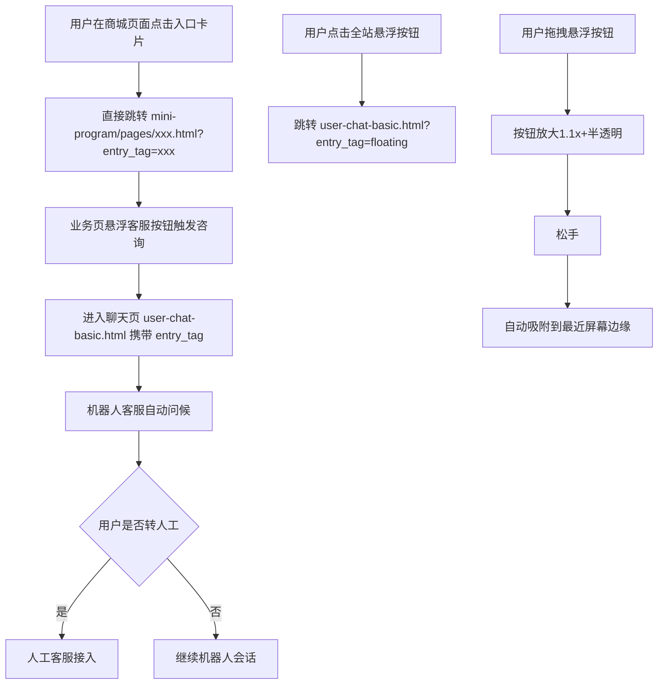

# 1 客服入口

本模块包含场景咨询入口页面，负责从商城各页面引导用户进入客服咨询流程，支持在线咨询和电话咨询两种方式，并通过 entry_tag 场景透传自动携带页面上下文。

## 1.1 场景咨询入口（user-entry.html）

### 1.1.1 功能概述

场景咨询入口是用户从商城各页面进入客服系统的统一入口页面，展示 7 个商城场景的客服入口嵌入方式 + 1 个全站悬浮按钮组件。用户点击任意入口卡片后自动携带 entry_tag 场景标签及对应业务参数直接跳转对应小程序业务页（咨询方式选择面板已移除，统一由 mini-program 端 cs-panel.js 接管）。默认进入会话后由机器人客服问候"您好，我是智能客服小助手，请问有什么可以帮您？"，转人工后才有人工客服问候。

### 1.1.2 页面结构

页面从上到下分为四个区域：页面头部、概览统计条、7 场景入口卡片网格、entry_tag 对照表（页面另含 1 个 fixed 定位可拖拽的全站悬浮按钮）。

| 区域 | 说明 |
|------|------|
| 页面头部 | 蓝色渐变背景，面包屑导航（原型首页/用户端/场景咨询入口）、标题"场景咨询入口 — 8 页面客服入口嵌入"、需求标签（US-MVP-16/1期MVP/用户端·Taro/entry_tag场景透传/更新于2026-06-11） |
| 概览统计条 | 2项数字+1句说明：8 商城页面入口、8 entry_tag 场景标签、说明"点击即进入会话，并自动携带页面上下文（商品/订单/分类）" |
| 7 场景入口卡片网格 | 3列网格（响应式：≤1100px 2列，≤720px 1列），每张卡片含：卡片头部（场景名称+emoji图标+entry_tag标签chip）、会话预览样式区（280px，含浏览器URL栏+智能客服banner `.mock-banner`+机器人客服问候气泡 `.mock-bubble.agent`+场景卡片预览 `.mock-bubble.card`+输入框 `.mock-input-bar`）、卡片底部（入口说明+键值对信息） |
| entry_tag 对照表 | 表格列出所有场景的 entry_tag、携带参数、典型咨询场景 |
| 全站悬浮按钮（fixed） | 页面右下角 fixed 定位可拖拽圆形悬浮按钮（52×52px），点击跳转 user-chat-basic.html?entry_tag=floating |

### 1.1.3 七大场景入口详情

原型中包含 7 个场景入口卡片，每个入口的位置、携带上下文、典型咨询场景各不相同：

| # | 场景名称 | entry_tag | 入口位置 | 携带上下文参数 | 典型咨询场景 |
|---|----------|-----------|----------|----------------|--------------|
| 1 | 首页 | `home` | 全局悬浮 · 右下角 | — | 活动咨询、通用问题 |
| 2 | 商品详情 | `product` | 右下角「商品咨询」按钮 | product_id, product_name, price | 尺码、库存、规格咨询 |
| 3 | 订单详情 | `order` | 「订单咨询」按钮 | order_id, order_status, amount | 物流、催发货、退款 |
| 4 | 购物车 | `cart` | 右下角「联系客服」按钮 | cart_items[], total_amount | 凑单、优惠、满减 |
| 5 | 个人中心 | `profile` | 「联系客服」按钮 | member_level | 账户、会员、地址 |
| 6 | 物流详情页 | `logistics` | 「物流咨询」按钮 | tracking_no, carrier, order_id | 物流延误、地址变更、签收问题 |
| 7 | 退换货 | `refund` | 「退换货咨询」按钮 | order_id, refund_type, reason | 退货、换货、退款进度 |

各场景卡片会话预览内容（统一结构：智能客服 banner + 机器人客服问候 + 场景卡片预览 + 输入框）：
- **首页**：智能客服 banner（"智能客服 · 在线"）+ 机器人问候 + 🏠 首页咨询卡片
- **商品详情**：智能客服 banner（"智能客服 · 商品咨询"）+ 机器人问候 + 🛒 商品·YONEX 天斧100ZZ 卡片
- **订单详情**：智能客服 banner（"智能客服 · 订单咨询"）+ 机器人问候 + 📦 订单·待发货 卡片
- **购物车**：智能客服 banner（"智能客服 · 购物车咨询"）+ 机器人问候 + 🛒 购物车·3 件商品 卡片
- **个人中心**：智能客服 banner（"智能客服 · 账户咨询"）+ 机器人问候 + 👤 账户·黄金会员 卡片
- **物流详情页**：智能客服 banner（"智能客服 · 物流咨询"）+ 机器人问候 + 🚚 物流·顺丰 SF1234567890 卡片
- **退换货**：智能客服 banner（"智能客服 · 退款咨询"）+ 机器人问候 + ↩️ 售后·退货退款·待商家审核 卡片

### 1.1.4 全站悬浮按钮组件

全站悬浮按钮（entry_tag: `floating`）为页面右下角 fixed 定位可拖拽圆形按钮，在商城所有页面通用展示。

**组件规格**：

| 属性 | 说明 |
|------|------|
| 尺寸 | 48×48px（演示区）/ 52×52px（真实可交互按钮） |
| 形状 | 圆形 |
| 背景 | 渐变蓝色 linear-gradient(135deg, #1677ff, #4096ff) |
| 图标 | 耳机客服图标（白色SVG） |
| 阴影 | 0 4px 12px rgba(22,119,255,.35) |
| 脉冲动画 | fab-pulse 2.4s ease-in-out infinite |
| 位置 | 默认右下角，可拖动 |
| 场景感知 | 按钮文案随页面场景变化（「商品咨询」「物流咨询」等） |
| 未读角标 | 有未读消息时右上角显示红点角标（8px红色圆点+白色边框） |
| 页面适配 | 自动识别当前页面的 entry_tag |

**拖拽交互状态**：

| 状态 | 外观 | 说明 |
|------|------|------|
| 默认状态 | 右下角固定，蓝色渐变，显示耳机图标 | 常态展示 |
| 拖拽中 | 按钮放大1.1x，半透明(opacity:0.9)，跟随手指移动 | cursor: grabbing，transition: none |
| 松手吸附 | 自动吸附到最近的屏幕边缘 | right/left 0.3s cubic-bezier(.2,.8,.2,1) |
| 有未读消息 | 右上角红点角标 + 呼吸动画 | 红点8px，border: 1.5px solid #fff |
| 会话进行中 | 按钮变绿色（linear-gradient(135deg, #52c41a, #73d13d)） | 表示正在服务中 |

### 1.1.5 咨询方式选择面板（已移除）

咨询方式选择面板已从原型中移除，统一由 mini-program 端 cs-panel.js 接管。入口卡片点击直接跳转对应小程序业务页（mini-program/pages/xxx.html?entry_tag=xxx），不再弹出选择面板。

### 1.1.6 操作流程

入口卡片点击跳转时自动携带 entry_tag 参数及对应业务参数（如 product_id、order_id 等），聊天页据此自动发送对应场景卡片消息。

### 1.1.7 字段与交互

| 字段名称 | 字段标识 | 字段类型 | 必填 | 数据类型 | 长度限制 | 默认值 | 校验规则 | 取值范围 | 来源 | 错误提示 |
|----------|----------|----------|------|----------|----------|--------|----------|----------|------|----------|
| 场景标签 | entry_tag | 路径参数 | 否 | String | - | 空 | 合法场景枚举值 | home/product/order/cart/refund/help/profile/logistics/phone/floating | URL参数 | - |
| 商品ID | product_id | 路径参数 | 条件必填 | String | - | 空 | 数字格式 | - | URL参数（product场景） | - |
| 商品名称 | product_name | 路径参数 | 否 | String | - | 空 | - | - | URL参数（product场景） | - |
| 商品价格 | price | 路径参数 | 否 | String | - | 空 | - | - | URL参数（product场景） | - |
| 订单ID | order_id | 路径参数 | 条件必填 | String | - | 空 | 订单号格式 | - | URL参数（order/refund/logistics场景） | - |
| 订单状态 | order_status | 路径参数 | 否 | String | - | 空 | - | 待付款/待发货/已发货/已完成/已取消 | URL参数（order场景） | - |
| 订单金额 | amount | 路径参数 | 否 | String | - | 空 | - | - | URL参数（order场景） | - |
| 购物车商品数 | cart_items | 路径参数 | 否 | String | - | 空 | - | - | URL参数（cart场景） | - |
| 购物车总额 | total_amount | 路径参数 | 否 | String | - | 空 | - | - | URL参数（cart场景） | - |
| FAQ分类 | faq_category | 路径参数 | 否 | String | - | 空 | - | - | URL参数（help场景） | - |
| 会员等级 | member_level | 路径参数 | 否 | String | - | 空 | - | - | URL参数（profile场景） | - |
| 物流单号 | tracking_no | 路径参数 | 条件必填 | String | - | 空 | - | - | URL参数（logistics场景） | - |
| 快递公司 | carrier | 路径参数 | 否 | String | - | 空 | - | - | URL参数（logistics场景） | - |
| 退款类型 | refund_type | 路径参数 | 否 | String | - | 空 | - | 退货退款/换货/仅退款 | URL参数（refund场景） | - |
| 退款原因 | reason | 路径参数 | 否 | String | - | 空 | - | - | URL参数（refund场景） | - |
| 会话ID | session_id | 路径参数 | 否 | String | - | 空 | - | - | URL参数（phone场景） | - |
| 悬浮按钮 | cs_fab | 可拖拽按钮 | - | - | - | - | - | - | - | - |

### 1.1.8 业务规则

| 规则编号 | 规则描述 |
|----------|----------|
| RULE-ENTRY-001 | entry_tag 场景透传：点击入口时自动将当前页面场景标签及业务参数写入URL参数，聊天页据此自动生成对应场景卡片消息 |
| RULE-ENTRY-002 | 全站悬浮按钮组件：商城所有页面右下角均展示 fixed 定位可拖拽"联系客服"悬浮按钮，带脉冲动画（fab-pulse 2.4s），点击直接跳转 user-chat-basic.html?entry_tag=floating |
| RULE-ENTRY-003 | 电话咨询入口仅H5环境可用，小程序环境隐藏或提示 |
| RULE-ENTRY-004 | 8 种商城页面 entry_tag 对应场景：home(首页)、product(商品详情)、order(订单详情)、cart(购物车)、help(帮助中心)、profile(个人中心)、logistics(物流详情页)、refund(退换货)；另有 phone(电话咨询，仅H5) 和 floating(全站悬浮按钮) 2 种辅助 entry_tag |
| RULE-ENTRY-005 | 悬浮按钮可拖拽：拖拽时放大1.1x+半透明，松手自动吸附到最近屏幕边缘（0.3s cubic-bezier动画） |
| RULE-ENTRY-006 | 悬浮按钮场景感知：按钮文案随页面场景变化（商品详情页→「商品咨询」，物流页→「物流咨询」等） |
| RULE-ENTRY-007 | 悬浮按钮未读角标：有未读消息时显示红点角标（8px红色圆点+1.5px白色边框），会话进行中按钮变绿色 |
| RULE-ENTRY-008 | 电话咨询按钮 confirm 直拨：点击 phone-call-btn 后直接弹出 confirm 确认框"是否拨打客服热线 400-888-8888？"，确认后拨打（仅H5） |
| RULE-ENTRY-009 | 各场景入口携带参数映射：product→product_id+product_name+price；order→order_id+order_status+amount；cart→cart_items+total_amount；logistics→tracking_no+carrier+order_id；refund→order_id+refund_type+reason；phone→session_id |
| RULE-ENTRY-010 | 入口卡片点击行为：点击整个卡片直接跳转对应小程序业务页（mini-program/pages/xxx.html?entry_tag=xxx），不再弹出咨询方式选择面板 |

### 1.1.9 页面跳转

**入口**：
- 商城各页面悬浮"联系客服"按钮
- 入口卡片点击（user-entry.html 页面）

**出口**：
- 入口卡片点击 → mini-program/pages/xxx.html?entry_tag=xxx（对应小程序业务页）
- 悬浮按钮点击 → 聊天页（user-chat-basic.html?entry_tag=floating）
- 电话咨询按钮（phone-call-btn） → confirm 确认后拨打 400-888-8888（仅H5）
- 点击返回 → 来源商城页面
