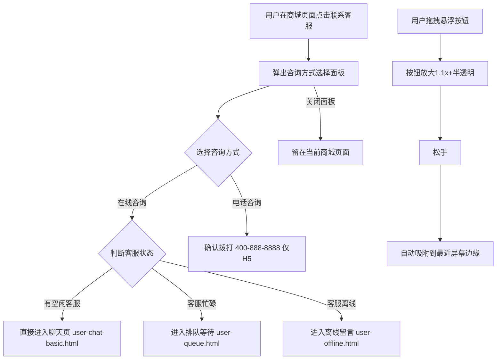

# 1 客服入口

本模块包含场景咨询入口页面，负责从商城各页面引导用户进入客服咨询流程，支持在线咨询和电话咨询两种方式，并通过 entry_tag 场景透传自动携带页面上下文。

## 1.1 场景咨询入口（user-entry.html）

### 1.1.1 功能概述

场景咨询入口是用户从商城各页面进入客服系统的统一入口页面，展示 9 大商城场景的客服入口嵌入方式 + 1 个全站悬浮按钮组件。用户点击任意入口后弹出咨询方式选择面板（在线咨询/电话客服），选择后自动携带 entry_tag 场景标签及对应业务参数跳转咨询页面。

### 1.1.2 页面结构

页面从上到下分为五个区域：页面头部、概览统计条、9 场景入口卡片网格、全站悬浮按钮组件专区、entry_tag 对照表。

| 区域 | 说明 |
|------|------|
| 页面头部 | 蓝色渐变背景，面包屑导航（原型首页/用户端/场景咨询入口）、标题"场景咨询入口 — 9 页面客服入口嵌入"、需求标签（US-MVP-16/1期MVP/用户端·Taro/entry_tag场景透传/更新于2026-06-11） |
| 概览统计条 | 5项统计：8商城页面入口、9 entry_tag场景标签、1全站悬浮按钮组件、1电话咨询入口（仅H5）、说明"点击即进入会话，并自动携带页面上下文（商品/订单/分类）" |
| 9 场景入口卡片网格 | 3列网格（响应式：≤1100px 2列，≤720px 1列），每张卡片含：卡片头部（场景名称+emoji图标+entry_tag标签chip）、模拟页面预览区（280px，含浏览器URL栏+模拟商城页面内容+悬浮客服按钮）、卡片底部（入口说明+键值对信息） |
| 全站悬浮按钮组件专区 | 独立section，3列网格：左侧为悬浮按钮交互演示、中间为组件规格说明、右侧为拖拽交互状态说明 |
| entry_tag 对照表 | 表格列出所有场景的 entry_tag、携带参数、典型咨询场景 |

### 1.1.3 九大场景入口详情

原型中包含 9 个场景入口卡片，每个入口的位置、携带上下文、典型咨询场景各不相同：

| # | 场景名称 | entry_tag | 入口位置 | 携带上下文参数 | 典型咨询场景 |
|---|----------|-----------|----------|----------------|--------------|
| 1 | 首页 | `home` | 全局悬浮 · 右下角 | — | 活动咨询、通用问题 |
| 2 | 商品详情 | `product` | 右下角「商品咨询」按钮 | product_id, product_name, price | 尺码、库存、规格咨询 |
| 3 | 订单详情 | `order` | 「订单咨询」按钮 | order_id, order_status, amount | 物流、催发货、退款 |
| 4 | 购物车 | `cart` | 右下角「联系客服」按钮 | cart_items[], total_amount | 凑单、优惠、满减 |
| 5 | 帮助中心 | `help` | 底部「在线客服」按钮 | faq_category | FAQ 兜底、政策咨询 |
| 6 | 个人中心 | `profile` | 「联系客服」按钮 | member_level | 账户、会员、地址 |
| 7 | 物流详情 | `logistics` | 「物流咨询」按钮 | tracking_no, carrier, order_id | 物流延误、地址变更、签收问题 |
| 8 | 退换货 | `refund` | 「退换货咨询」按钮 | order_id, refund_type, reason | 退货、换货、退款进度 |
| 9 | 电话咨询 | `phone` | 聊天页顶部「电话咨询」按钮 | session_id | 语音沟通 · 仅H5 |

各场景模拟页面预览内容：
- **首页**：春季运动装备节banner + 商品推荐区
- **商品详情**：YONEX天斧100ZZ羽毛球拍 + ¥1,580.00 价格标签
- **订单详情**：订单号202606110001 + 待发货状态 + ¥1,580.00
- **购物车**：3件商品 + 多个商品行 + 价格
- **帮助中心**：物流查询/退换货政策/支付问题列表项
- **个人中心**：黄金会员 + 我的订单/优惠券/收货地址列表
- **物流详情**：顺丰速运SF1234567890 + 物流轨迹步骤（揽收→在途→派送中）
- **退换货**：申请退换货 + 商品信息 + 退货按钮
- **电话咨询**：聊天页面内嵌电话咨询按钮 + 客服对话

### 1.1.4 全站悬浮按钮组件

全站悬浮按钮（entry_tag: `floating`）为独立组件，在商城所有页面通用展示。

**组件规格**：

| 属性 | 说明 |
|------|------|
| 尺寸 | 48×48px（演示区）/ 52×52px（真实可交互按钮） |
| 形状 | 圆形 |
| 背景 | 渐变蓝色 linear-gradient(135deg, #1677ff, #4096ff) |
| 图标 | 耳机客服图标（白色SVG） |
| 阴影 | 0 4px 12px rgba(22,119,255,.35) |
| 脉冲动画 | fab-pulse 2.4s ease-in-out infinite |
| 位置 | 默认右下角，可拖动 |
| 场景感知 | 按钮文案随页面场景变化（「商品咨询」「物流咨询」等） |
| 未读角标 | 有未读消息时右上角显示红点角标（8px红色圆点+白色边框） |
| 页面适配 | 自动识别当前页面的 entry_tag |

**拖拽交互状态**：

| 状态 | 外观 | 说明 |
|------|------|------|
| 默认状态 | 右下角固定，蓝色渐变，显示耳机图标 | 常态展示 |
| 拖拽中 | 按钮放大1.1x，半透明(opacity:0.9)，跟随手指移动 | cursor: grabbing，transition: none |
| 松手吸附 | 自动吸附到最近的屏幕边缘 | right/left 0.3s cubic-bezier(.2,.8,.2,1) |
| 有未读消息 | 右上角红点角标 + 呼吸动画 | 红点8px，border: 1.5px solid #fff |
| 会话进行中 | 按钮变绿色（linear-gradient(135deg, #52c41a, #73d13d)） | 表示正在服务中 |

### 1.1.5 咨询方式选择面板

点击入口后弹出居中卡片弹窗，供用户选择咨询方式。

| 元素 | 说明 |
|------|------|
| 遮罩层 | 全屏半透明黑色背景 rgba(0,0,0,.5)，点击关闭 |
| 弹窗卡片 | 白色圆角(20px)卡片，max-width: 340px，缩放动画(scale .9→1) |
| 标题 | "请选择咨询方式"，居中 |
| 关闭按钮 | 右上角28×28px灰色圆形按钮 |
| 在线咨询选项 | 蓝色渐变圆形图标(56px) + "在线咨询" + "文字对话，平均响应 < 30 秒" |
| 电话客服选项 | 红色渐变圆形图标(56px) + "电话客服" + "400-888-8888，09:00-21:00" |

### 1.1.6 操作流程

在线咨询跳转时自动携带 entry_tag 参数及对应业务参数（如 product_id、order_id 等），聊天页据此自动发送对应场景卡片消息。

### 1.1.7 字段与交互

| 字段名称 | 字段标识 | 字段类型 | 必填 | 数据类型 | 长度限制 | 默认值 | 校验规则 | 取值范围 | 来源 | 错误提示 |
|----------|----------|----------|------|----------|----------|--------|----------|----------|------|----------|
| 场景标签 | entry_tag | 路径参数 | 否 | String | - | 空 | 合法场景枚举值 | home/product/order/cart/refund/help/profile/logistics/phone/floating | URL参数 | - |
| 商品ID | product_id | 路径参数 | 条件必填 | String | - | 空 | 数字格式 | - | URL参数（product场景） | - |
| 商品名称 | product_name | 路径参数 | 否 | String | - | 空 | - | - | URL参数（product场景） | - |
| 商品价格 | price | 路径参数 | 否 | String | - | 空 | - | - | URL参数（product场景） | - |
| 订单ID | order_id | 路径参数 | 条件必填 | String | - | 空 | 订单号格式 | - | URL参数（order/refund/logistics场景） | - |
| 订单状态 | order_status | 路径参数 | 否 | String | - | 空 | - | 待付款/待发货/已发货/已完成/已取消 | URL参数（order场景） | - |
| 订单金额 | amount | 路径参数 | 否 | String | - | 空 | - | - | URL参数（order场景） | - |
| 购物车商品数 | cart_items | 路径参数 | 否 | String | - | 空 | - | - | URL参数（cart场景） | - |
| 购物车总额 | total_amount | 路径参数 | 否 | String | - | 空 | - | - | URL参数（cart场景） | - |
| FAQ分类 | faq_category | 路径参数 | 否 | String | - | 空 | - | - | URL参数（help场景） | - |
| 会员等级 | member_level | 路径参数 | 否 | String | - | 空 | - | - | URL参数（profile场景） | - |
| 物流单号 | tracking_no | 路径参数 | 条件必填 | String | - | 空 | - | - | URL参数（logistics场景） | - |
| 快递公司 | carrier | 路径参数 | 否 | String | - | 空 | - | - | URL参数（logistics场景） | - |
| 退款类型 | refund_type | 路径参数 | 否 | String | - | 空 | - | 退货退款/换货/仅退款 | URL参数（refund场景） | - |
| 退款原因 | reason | 路径参数 | 否 | String | - | 空 | - | - | URL参数（refund场景） | - |
| 会话ID | session_id | 路径参数 | 否 | String | - | 空 | - | - | URL参数（phone场景） | - |
| 在线咨询按钮 | btn_online_consult | 按钮 | - | - | - | - | - | - | - | - |
| 电话咨询按钮 | btn_phone_consult | 按钮 | - | - | - | - | 仅H5环境可用 | - | - | 小程序环境提示"请在H5中使用" |
| 关闭按钮 | btn_close_sheet | 按钮 | - | - | - | - | - | - | - | - |
| 悬浮按钮 | cs_fab | 可拖拽按钮 | - | - | - | - | - | - | - | - |

### 1.1.8 业务规则

| 规则编号 | 规则描述 |
|----------|----------|
| RULE-ENTRY-001 | entry_tag 场景透传：点击入口时自动将当前页面场景标签及业务参数写入URL参数，聊天页据此自动生成对应场景卡片消息 |
| RULE-ENTRY-002 | 全站悬浮按钮组件：商城所有页面右下角均展示"联系客服"悬浮按钮，带脉冲动画（fab-pulse 2.4s），点击触发咨询方式选择面板 |
| RULE-ENTRY-003 | 电话咨询入口仅H5环境可用，小程序环境隐藏或提示 |
| RULE-ENTRY-004 | 10种 entry_tag 对应场景：home(首页)、product(商品详情)、order(订单详情)、cart(购物车)、help(帮助中心)、profile(个人中心)、logistics(物流详情)、refund(退换货)、phone(电话咨询)、floating(全站悬浮按钮) |
| RULE-ENTRY-005 | 悬浮按钮可拖拽：拖拽时放大1.1x+半透明，松手自动吸附到最近屏幕边缘（0.3s cubic-bezier动画） |
| RULE-ENTRY-006 | 悬浮按钮场景感知：按钮文案随页面场景变化（商品详情页→「商品咨询」，物流页→「物流咨询」等） |
| RULE-ENTRY-007 | 悬浮按钮未读角标：有未读消息时显示红点角标（8px红色圆点+1.5px白色边框），会话进行中按钮变绿色 |
| RULE-ENTRY-008 | 电话客服确认弹窗：点击电话咨询后弹出确认框"是否拨打客服热线 400-888-8888？"，确认后拨打 |
| RULE-ENTRY-009 | 各场景入口携带参数映射：product→product_id+product_name+price；order→order_id+order_status+amount；cart→cart_items+total_amount；logistics→tracking_no+carrier+order_id；refund→order_id+refund_type+reason；phone→session_id |
| RULE-ENTRY-010 | 入口卡片点击行为：有对应小程序页面的卡片点击整个卡片跳转小程序页面预览；电话咨询卡片内的phone-call-btn点击弹出选择面板 |

### 1.1.9 页面跳转

**入口**：
- 商城各页面悬浮"联系客服"按钮
- 帮助中心"联系客服"链接
- 聊天页顶部"电话咨询"按钮

**出口**：
- 在线咨询（有空闲客服） → 聊天页（user-chat-basic.html），携带 entry_tag + 业务参数
- 在线咨询（客服忙碌） → 排队等待（user-queue.html），携带 entry_tag + 业务参数
- 在线咨询（客服离线） → 离线留言（user-offline.html），携带 entry_tag + 业务参数
- 电话咨询 → 确认后拨打 400-888-8888（仅H5）
- 入口卡片点击 → 对应小程序页面预览
- 点击返回 → 来源商城页面
