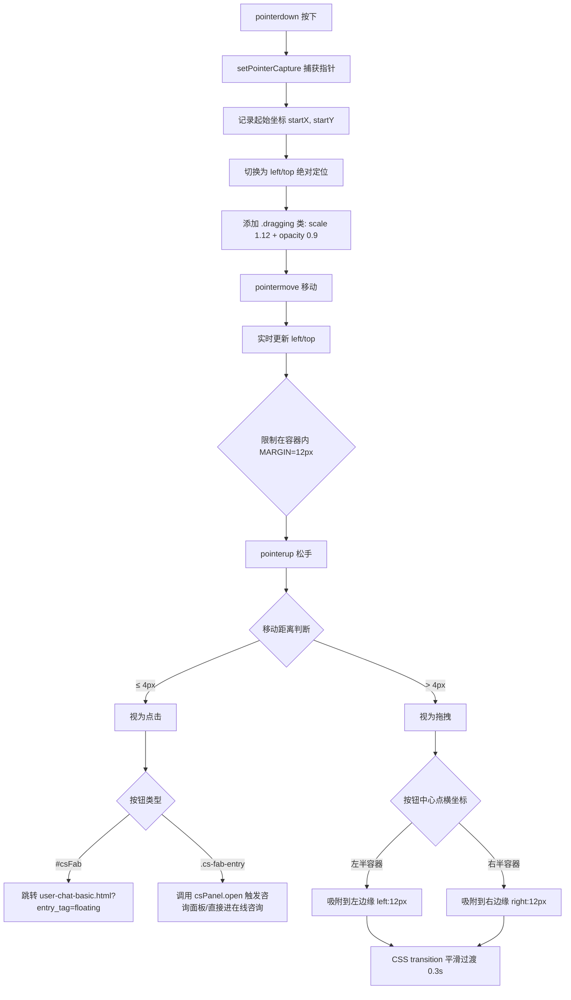

# 01-客服入口

> 页面：`user-entry.html` | 版本：V1.0 | 2026-07-05
> 数据源：原型 HTML 逐功能提取

---

## 1.1 功能概述

客服入口页是 CS 商城所有业务页面的客服咨询统一入口，展示 8 个业务场景（首页、商品详情、订单详情、购物车、帮助中心、个人中心、物流详情、退换货）中嵌入客服入口的视觉效果和交互逻辑。用户在任意业务页面点击客服入口后，系统携带 `entry_tag` 场景标识参数跳转至聊天页面，客服端自动加载对应上下文（商品信息、订单状态等）。页面同时包含一个全站可拖拽的悬浮客服按钮，作为通用咨询入口。

---

## 1.2 页面结构

页面从上到下分为五个区域：页面头部、概览条、入口卡片网格、对照表格、悬浮按钮。

| 区域 | 选择器 | 说明 |
|------|--------|------|
| 页面头部 | `.page-header` | 红色渐变背景，含面包屑导航（→ `index.html`）、H1 标题"场景咨询入口 — 8 页面客服入口嵌入"、版本标签行列（pill：US-MVP-16、1期MVP、用户端·Taro） |
| 概览条 | `.overview-bar` | 白色卡片，展示 3 个统计项：8个入口场景、8个entry_tag标签、全场景覆盖说明 |
| 入口卡片网格 | `.entry-grid` | CSS Grid 3 列布局（≤1100px 时 2 列，≤720px 时 1 列），每张卡片 `.entry-card` 展示一个业务场景的模拟页面 |
| 对照表格 | `table.card` | 完整 entry_tag 对照表，10 行数据（含 8 个场景 + 全站悬浮 + 电话咨询），列出每个场景的携带参数和典型咨询场景 |
| 悬浮按钮 | `#csFab` (`.cs-fab`) | 52×52px 圆形固定定位按钮（`position: fixed`），支持拖拽 + 松手吸边，点击跳转 `user-chat-basic.html?entry_tag=floating`。mini-program 业务页面使用 `.cs-fab-entry`（48×48px icon + "联系客服"文字，`position: absolute` 相对 `.phone-frame`），由 `cs-panel.js` 自动绑定同样的拖拽+吸边逻辑 |

### 入口卡片内部结构

每张 `.entry-card` 包含以下子区域：

| 子区域 | 选择器 | 说明 |
|--------|--------|------|
| 卡片头部 | `.entry-card-head` | 场景名 `.scene-name` + emoji 图标 + entry_tag 标签 `.entry-tag-chip`（蓝底白字） |
| 模拟页面 | `.mock-page` | 280px 高，模拟浏览器窗口外观 |
| URL 栏 | `.mock-urlbar` | 三色圆点（红黄绿）+ 模拟 URL 路径 |
| 页面内容 | `.mock-body` | 场景化的模拟内容：Banner（`.mock-banner`，有 home/product/order/cart/help/profile/logistics/refund 等变体）、聊天气泡（`.mock-bubble.agent` / `.mock-bubble.user`）、模拟输入栏（`.mock-input-bar`）、悬浮圆形按钮（`.floating-circle-btn`）、电话按钮（`.phone-call-btn`） |
| 卡片底部 | `.entry-card-foot` | 说明文字 + 键值对 `.kv`（展示携带参数） |

---

## 1.3 操作流程

### 主流程：从业务页面发起咨询

```mermaid
flowchart TD
    A[用户在业务页面] --> B[点击客服入口按钮]
    B --> C{入口类型}
    C -->|页面内按钮| D[携带 entry_tag 参数]
    C -->|全站悬浮按钮| E[entry_tag=floating]
    D --> F[跳转 mini-program/pages/{page}.html?entry_tag=xxx]
    E --> F
    F --> G[业务页面加载 entry_tag 上下文]
    G --> H[用户点击业务页内客服按钮]
    H --> I[跳转 user-chat-basic.html?entry_tag=xxx]
    I --> J[聊天页初始化会话上下文]
    J --> K[客服工作台自动加载对应场景]
```

### 入口卡片点击流程

```mermaid
flowchart TD
    A[用户点击 .entry-card] --> B{点击目标判断}
    B -->|目标是 .phone-call-btn| C[e.stopPropagation 阻止冒泡]
    C --> D[confirm: 是否拨打客服热线 400-888-8888?]
    D -->|确定| E[alert: 正在拨打 400-888-8888...]
    D -->|取消| F[无操作]
    B -->|目标是卡片其他区域| G{检查 .entry-tag-chip 是否存在}
    G -->|存在| H[获取 entry_tag 值]
    H --> I[从 MINI_PAGES 映射获取目标页面路径]
    I --> J[window.open 跳转: {page}.html?entry_tag=xxx]
    G -->|不存在| K[跳过该卡片]
```

### 悬浮按钮拖拽与吸边流程

适用于两类悬浮按钮：
- **入口页** `#csFab`（`user-entry.html`）：52×52px，`position: fixed` 相对视口，点击跳转 `user-chat-basic.html?entry_tag=floating`
- **业务页面** `.cs-fab-entry`（mini-program 各业务页）：48×48px icon + "联系客服"文字，`position: absolute` 相对 `.phone-frame`，由 `cs-panel.js` 自动绑定，点击触发 `csPanel.open(tag, {}, {skipPanel})`



补充说明：
- 拖拽使用 Pointer Events API，`touch-action: none` 防止页面滚动干扰，`user-select: none` 防止文字选中
- 拖拽时禁用 transition（`.dragging` 类），松手吸边时启用 transition（`cubic-bezier(.2,.8,.2,1)` 0.3s）
- 移动距离阈值 4px 用于区分点击和拖拽意图，避免误触
- 容器边界：`#csFab` 用 `window.innerWidth/innerHeight`，`.cs-fab-entry` 用 `fab.offsetParent.getBoundingClientRect()`
- 拖拽后 `moved=true` 标记会阻止后续 click 事件，避免吸边后误触发咨询面板

---

## 1.4 字段与交互

### 入口卡片交互

| 字段名称 | 字段标识 | 字段类型 | 必填 | 数据类型 | 长度限制 | 默认值 | 校验规则 | 取值范围 | 来源 | 错误提示 |
|----------|----------|----------|------|----------|----------|--------|----------|----------|------|----------|
| 场景标识 | entry_tag | 文本 | 是 | String | 最长20字符 | — | 非空，必须为预定义值 | home/product/order/cart/help/profile/logistics/refund/floating/phone | 卡片 data-entry-tag 属性 | — |
| 商品ID | product_id | 文本 | 否 | String | 最长30字符 | — | — | — | ENTRY_PARAMS 配置 | — |
| 商品名称 | product_name | 文本 | 否 | String | 最长100字符 | — | — | — | ENTRY_PARAMS 配置 | — |
| 商品价格 | price | 文本 | 否 | String | 最长20字符 | — | — | — | ENTRY_PARAMS 配置 | — |
| 订单ID | order_id | 文本 | 否 | String | 最长30字符 | — | — | — | ENTRY_PARAMS 配置 | — |
| 订单状态 | order_status | 文本 | 否 | String | 最长20字符 | — | — | 待发货/运输中/已签收/已完成/已取消等 | ENTRY_PARAMS 配置 | — |
| 订单金额 | amount | 文本 | 否 | String | 最长20字符 | — | — | — | ENTRY_PARAMS 配置 | — |
| 购物车商品数 | cart_items | 文本 | 否 | String | 最长10字符 | — | — | — | ENTRY_PARAMS 配置 | — |
| 购物车总额 | total_amount | 文本 | 否 | String | 最长20字符 | — | — | — | ENTRY_PARAMS 配置 | — |
| FAQ 分类 | faq_category | 文本 | 否 | String | 最长20字符 | — | — | — | ENTRY_PARAMS 配置 | — |
| 会员等级 | member_level | 文本 | 否 | String | 最长20字符 | — | — | 黄金会员/白银会员/普通会员 | ENTRY_PARAMS 配置 | — |
| 物流单号 | tracking_no | 文本 | 否 | String | 最长30字符 | — | — | — | ENTRY_PARAMS 配置 | — |
| 承运商 | carrier | 文本 | 否 | String | 最长20字符 | — | — | 顺丰速运/圆通速递/中通快递等 | ENTRY_PARAMS 配置 | — |
| 退款类型 | refund_type | 文本 | 否 | String | 最长20字符 | — | — | 退货退款/仅退款/换货 | ENTRY_PARAMS 配置 | — |

### 悬浮按钮交互

| 字段名称 | 字段标识 | 字段类型 | 必填 | 数据类型 | 长度限制 | 默认值 | 校验规则 | 取值范围 | 来源 | 错误提示 |
|----------|----------|----------|------|----------|----------|--------|----------|----------|------|----------|
| 悬浮按钮 | csFab | 按钮 | — | — | — | 右下角固定定位 | — | — | 系统生成 | — |
| 拖拽起始X | startX | 数值 | — | Number | — | 0 | — | — | pointerdown 事件 | — |
| 拖拽起始Y | startY | 数值 | — | Number | — | 0 | — | — | pointerdown 事件 | — |
| 移动距离 | moveDistance | 数值 | — | Number | — | 0 | 用于判断点击 vs 拖拽 | ≤4 为点击，>4 为拖拽 | 指针移动计算 | — |
| 提示标签 | csFabLabel | 文本 | — | String | 最长20字符 | — | — | — | 系统生成 | — |

### 电话拨打交互

| 字段名称 | 字段标识 | 字段类型 | 必填 | 数据类型 | 长度限制 | 默认值 | 校验规则 | 取值范围 | 来源 | 错误提示 |
|----------|----------|----------|------|----------|----------|--------|----------|----------|------|----------|
| 客服电话 | phoneNumber | 文本 | 是 | String | 11-15位 | 400-888-8888 | — | — | 系统配置 | — |
| 拨打确认 | phoneConfirm | 弹窗 | — | Boolean | — | — | 用户选择确定/取消 | true/false | 用户操作 | — |

---

## 1.5 业务规则

| 规则编号 | 规则描述 |
|----------|----------|
| RULE-ENTRY-001 | 入口卡片点击时，通过事件委托统一处理：先判断点击目标是否为 `.phone-call-btn`，如果是则阻止冒泡并处理电话拨打，否则执行页面跳转 |
| RULE-ENTRY-002 | 卡片跳转时先从 `.entry-tag-chip` 获取 `entry_tag` 值，再从 `MINI_PAGES` 映射表获取目标页面路径，最终通过 `window.open` 跳转并附加 `?entry_tag=xxx` 参数 |
| RULE-ENTRY-003 | 悬浮按钮拖拽：`#csFab`（入口页，相对视口）和 `.cs-fab-entry`（mini-program 业务页面，相对 `.phone-frame`）均使用 Pointer Events API 实现拖拽，`touch-action: none` 禁止页面滚动干扰，`user-select: none` 防止文字选中。拖拽时添加 `.dragging` 类（scale 1.12 + opacity 0.9 + transition:none）。移动距离 ≤ 4px 视为点击，> 4px 视为拖拽 |
| RULE-ENTRY-004 | 悬浮按钮吸边规则：松手时判断按钮中心点横坐标，在容器左半侧吸附左边缘（`left: 12px`），右半侧吸附右边缘（`right: 12px`），垂直位置保持不变（限制在容器内）。吸附时切换为 `left+top` 或 `right+top` 定位，触发 CSS transition（`cubic-bezier(.2,.8,.2,1)` 0.3s）平滑过渡。MARGIN=12px 与默认定位一致 |
| RULE-ENTRY-005 | 咨询方式选择弹窗（`.cs-sheet` / `.cs-sheet-mask`）的 HTML 和 CSS 代码保留在页面中，但 JS 触发逻辑已移除，统一由小程序端 `cs-panel.js` 接管 |
| RULE-ENTRY-006 | `ENTRY_PARAMS` 对象定义了各场景的 Mock 业务参数，但当前代码中仅用于文档说明，未实际用于构建跳转 URL（URL 仅携带 `entry_tag`） |
| RULE-ENTRY-007 | 入口卡片网格响应式布局：默认 3 列（CSS Grid），视口宽度 ≤ 1100px 时 2 列，≤ 720px 时 1 列 |
| RULE-ENTRY-008 | 卡片 hover 效果：上浮 3px（`translateY(-3px)`）并加深阴影，transition 0.2s ease |

---

## 1.6 页面跳转

**入口**：
- 原型首页 `index.html` 点击"客服入口"链接

**出口**：
- 入口卡片点击 → `mini-program/pages/{page}.html?entry_tag=xxx`（见下表）
- 悬浮按钮点击 → `user-chat-basic.html?entry_tag=floating`
- 面包屑 → `index.html`
- 返回链接 → `history.back()`

| entry_tag | 跳转目标 |
|-----------|---------|
| `home` | `mini-program/pages/home_page.html` |
| `product` | `mini-program/pages/product_detail.html` |
| `order` | `mini-program/pages/order_detail.html` |
| `cart` | `mini-program/pages/cart.html` |
| `help` | `mini-program/pages/help.html` |
| `profile` | `mini-program/pages/profile.html` |
| `logistics` | `mini-program/pages/logistics.html` |
| `refund` | `mini-program/pages/refund.html` |
| `floating` | `user-chat-basic.html` |

---

## 1.7 各入口场景卡片推送映射

用户从业务页面点击客服入口后，最终会跳转至 `user-chat-basic.html?entry_tag=xxx`，系统根据 `entry_tag` 自动推送对应场景卡片（详见 02-聊天主界面.md §2.4.17）。映射关系如下：

| entry_tag | 来源业务页面 | 进入聊天页后推送的卡片 | 卡片数据来源 | 客服自动跟进文案 |
|-----------|------------|----------------------|------------|----------------|
| `home` | 首页 | 无卡片，仅机器人问候语 | — | — |
| `floating` | 全站悬浮按钮 | 无卡片（同 home） | — | — |
| `product` | 商品详情页 | 商品卡片（`.thread-card.product`） | product_id / product_name / price | 好的，您咨询的是这款商品，请问有什么可以帮您？ |
| `order` | 订单详情页 | 订单卡片（`.thread-card.order`） | order_id / order_status / amount | 好的，已收到您的订单信息，请问这笔订单有什么问题？ |
| `logistics` | 物流详情页 | 物流卡片（`.thread-card.logistics`） | tracking_no / carrier | 好的，已为您查询物流，包裹正在运输中。 |
| `refund` | 退款/售后页 | 退款卡片（`.thread-card.refund`） | refund_id / refund_type | 好的，已收到您的退款信息，我来为您查看进度。 |
| `help` | 帮助中心 | FAQ 卡片（`.thread-card.faq`） | 无（猜你想问 + "换一换"） | — |
| `cart` | 购物车页 | 不自动推送（用户主动点击快捷栏"购物车"按钮触发） | — | — |
| `profile` | 个人中心页 | 不自动推送（用户主动点击快捷栏触发） | — | — |

补充说明：
- 富媒体卡片不支持撤回（详见 02-聊天主界面.md RULE-CHAT-032），仅文本/图片/语音消息支持撤回