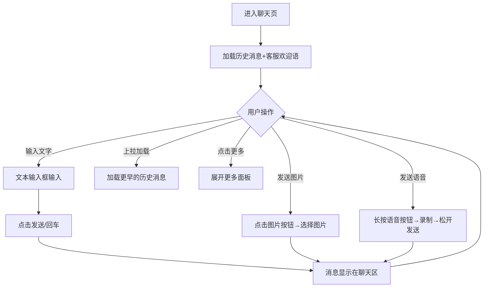
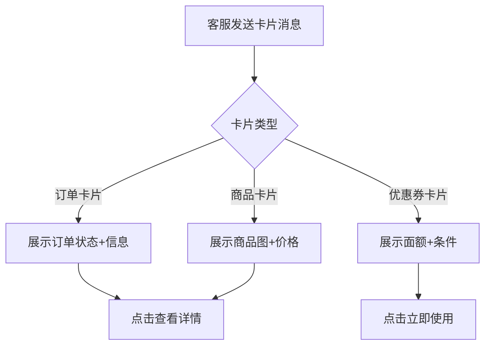
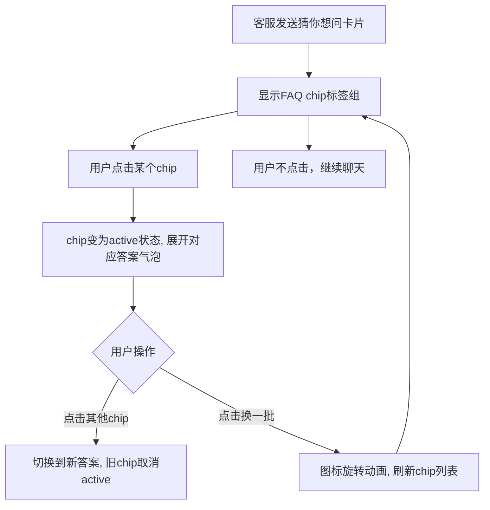
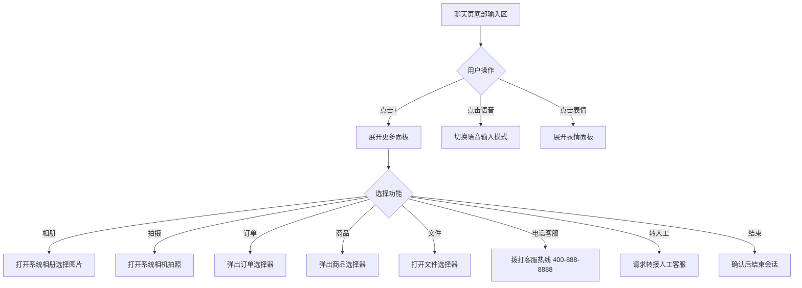
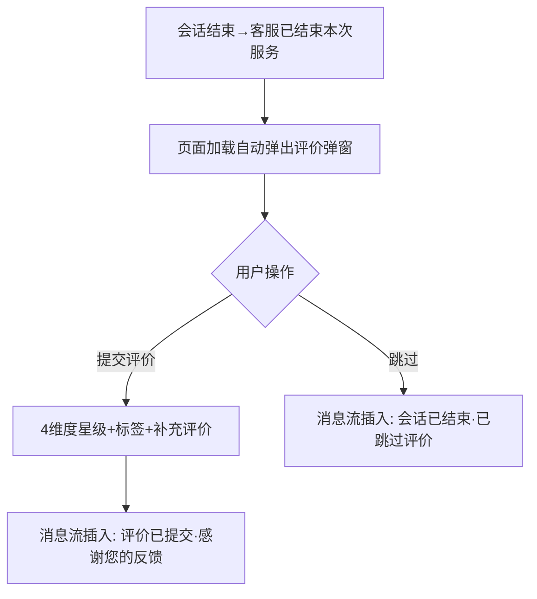

# 2 聊天主界面

本模块包含聊天主界面总览和5个功能子页面，是用户与客服进行实时交互的核心模块。聊天主界面总览为5大功能域的导航入口，各子页面按功能域拆分展示具体交互细节。

## 2.0 会话聊天模块定义

聊天页面采用统一的375px移动端布局外壳，包含：小程序状态栏、导航栏（返回+客服信息+更多操作）、消息列表、底部输入区。5个功能子页面共享此外壳结构，差异在于消息内容和交互功能。

导航栏客服信息区域显示：客服头像（蓝色渐变圆形，首字）、客服姓名、在线状态（绿色圆点+"在线"）。导航栏右侧操作按钮：基础消息交互页（user-chat-basic.html）仅有电话按钮（拨打客服热线 400-888-8888）；输入工具栏页（user-chat-input.html）含电话按钮和更多按钮（三点菜单，弹出 toast 提示"转人工 · 结束会话 · 投诉建议"）。

## 2.1 聊天主界面（总览）（user-chat.html）

### 2.1.1 功能概述

聊天主界面总览页是5大功能域的导航入口，以卡片网格形式展示5个功能子页面的预览和说明：基础消息交互、富媒体卡片、输入工具栏与更多面板、超时提示、会话关闭提示+评价引导。用户点击卡片即可进入对应功能子页面查看详细原型。

### 2.1.2 页面结构

页面从上到下分为四个区域：页面头部、概览统计条、功能卡片网格、返回链接。

| 区域 | 说明 |
|------|------|
| 页面头部 | 蓝色渐变背景，面包屑导航+标题"聊天主界面 — 5 大功能域拆分"+需求标签 |
| 概览统计条 | 5功能子页面 / 375px移动端 / 1统一会话外壳 |
| 功能卡片网格 | 3列网格（响应式），5张功能卡片，每张含：头部（功能名+标签chip）、模拟预览区（280px，含聊天场景模拟）、底部（功能说明+需求编号+进入按钮） |
| 返回链接 | "返回上一页"链接 |

5张功能卡片：
1. **基础消息交互**(basic) — 文本/图片/语音消息收发，US-MVP-14
2. **富媒体卡片**(cards) — 订单/商品/优惠券卡片，US-MVP-17/18/19
3. **输入工具栏与更多面板**(input) — 工具栏+8项快捷操作，US-MVP-14/16
4. **超时提示**(timeout) — 用户无响应超时提醒+自动关闭会话，US-MVP-14
5. **会话关闭提示+评价引导**(closed) — 会话结束道别+评价卡片+重新咨询，US-MVP-21/24

### 2.1.3 操作流程

此页面为导航总览页，无复杂操作流程。用户点击功能卡片即可跳转对应子页面。

### 2.1.4 字段与交互

| 字段名称 | 字段标识 | 字段类型 | 必填 | 数据类型 | 长度限制 | 默认值 | 校验规则 | 取值范围 | 来源 | 错误提示 |
|----------|----------|----------|------|----------|----------|--------|----------|----------|------|----------|
| 基础消息交互卡片 | card_basic | 可点击卡片 | - | - | - | - | 点击跳转 | - | - | - |
| 富媒体卡片卡片 | card_cards | 可点击卡片 | - | - | - | - | 点击跳转 | - | - | - |
| 输入工具栏卡片 | card_input | 可点击卡片 | - | - | - | - | 点击跳转 | - | - | - |
| 超时提示卡片 | card_timeout | 可点击卡片 | - | - | - | - | 点击跳转 | - | - | - |
| 会话关闭提示卡片 | card_closed | 可点击卡片 | - | - | - | - | 点击跳转 | - | - | - |

### 2.1.5 业务规则

| 规则编号 | 规则描述 |
|----------|----------|
| RULE-CHAT-INDEX-001 | 功能卡片点击后跳转对应子页面（onclick location.href） |
| RULE-CHAT-INDEX-002 | 卡片hover效果：上移3px + 蓝色边框 + 阴影增强 |

### 2.1.6 页面跳转

**入口**：
- 原型首页导航

**出口**：
- 点击"基础消息交互" → user-chat-basic.html
- 点击"富媒体卡片" → user-chat-cards.html
- 点击"输入工具栏与更多面板" → user-chat-input.html
- 点击"超时提示" → user-chat-timeout.html
- 点击"会话关闭提示+评价引导" → user-chat-closed.html
- 点击返回 → 来源页面

## 2.2 基础消息交互（user-chat-basic.html）

### 2.2.1 功能概述

基础消息交互页面是聊天功能的核心页面，实现用户与客服之间的文本、图片、语音消息收发。页面顶部显示客服信息和在线状态，中部为消息列表（支持历史消息上拉加载），底部为输入工具栏。支持消息类型包括：文字消息、图片消息、语音消息（波形+时长）、系统消息、客服欢迎语。

### 2.2.2 页面结构

页面采用移动端375px布局，从上到下分为四个区域：导航栏、消息列表、底部输入区。

| 区域 | 说明 |
|------|------|
| 导航栏 | 返回按钮 + 客服头像("王",蓝色)+姓名"客服王小明"+在线状态(绿色圆点+"在线") + 电话按钮(拨打400-888-8888) + 微信胶囊 |
| 消息列表 | 系统分隔线"— 您好，已为您接入在线客服 —" + 客服欢迎消息气泡 + 用户消息气泡 + 历史消息上拉加载器。场景化初始化时系统消息为"已为您接入在线客服 · {场景标签}"，问候语统一为"您好，请问有什么可以帮您？" |
| 底部输入区 | 语音按钮 + 文本输入框 + 更多按钮("+") + 发送按钮（输入内容时显示，替换"+"按钮）。注意：本页面无表情按钮，表情功能在 user-chat-input.html 的完整输入工具栏中 |
| 更多面板 | 点击"+"展开，4项快捷操作：📷相册、📷拍照、📞电话客服、🔄转人工。点击外部区域自动关闭 |
| 快捷卡片入口栏 | 输入框上方横向滚动的快捷入口标签栏，包含4个快捷按钮：订单、退款、物流、购物车。每个按钮含图标+文字，hover时蓝色边框+蓝色文字+蓝色背景。点击后发送对应卡片到会话流（订单/退款/物流需先弹出对象选择器modal-object-picker.html，购物车直接发送）。转人工后快捷栏末尾追加"结束会话"按钮（红色图标+文字，点击需二次确认） |

消息气泡样式：
- 客服消息：左侧显示，白色背景，左上圆角为2px，带客服头像
- 用户消息：右侧显示，蓝色背景(#1677ff)，右上圆角为2px，带用户头像
- 系统消息：居中显示，半透明黑色背景，白色文字

### 2.2.3 操作流程

发送消息后输入框清空，消息自动滚动到底部。历史消息上拉加载显示加载指示器。

### 2.2.4 字段与交互

| 字段名称 | 字段标识 | 字段类型 | 必填 | 数据类型 | 长度限制 | 默认值 | 校验规则 | 取值范围 | 来源 | 错误提示 |
|----------|----------|----------|------|----------|----------|--------|----------|----------|------|----------|
| 消息输入 | msg_input | 文本输入 | 否 | String | - | 空 | - | - | 用户输入 | - |
| 发送按钮 | btn_send | 按钮 | - | - | - | 禁用 | 输入框trim非空时启用 | - | - | 空消息不发送 |
| 语音按钮 | btn_voice | 按钮 | - | - | - | - | 长按录制，松开发送 | - | - | - |
| 表情按钮 | btn_emoji | 按钮 | - | - | - | - | 弹出表情面板 | - | - | - |
| 更多按钮 | btn_more | 按钮 | - | - | - | - | 展开/收起更多面板 | - | - | - |
| 历史加载器 | history_loader | 加载指示 | - | - | - | 隐藏 | 上拉触发加载 | - | - | - |

### 2.2.5 业务规则

| 规则编号 | 规则描述 |
|----------|----------|
| RULE-CHAT-BASIC-001 | 发送消息前校验输入框trim后非空，空消息不发送 |
| RULE-CHAT-BASIC-002 | 发送后清空输入框，消息列表自动滚动到底部 |
| RULE-CHAT-BASIC-003 | 历史消息上拉加载：滚动到顶部时触发，显示加载指示器 |
| RULE-CHAT-BASIC-004 | Enter发送消息 |
| RULE-CHAT-BASIC-005 | 客服消息和用户消息分别靠左/靠右显示，带头像和时间戳 |
| RULE-CHAT-BASIC-006 | 发送按钮与"+"按钮互斥切换：输入框有内容时显示发送按钮、隐藏"+"按钮；输入框为空时隐藏发送按钮、显示"+"按钮 |
| RULE-CHAT-BASIC-007 | 语音录制浮层：长按语音按钮进入录制模式，显示半透明黑色浮层（红色脉冲圆点 + "正在录音... 00:0X"计时），松手发送语音消息 |
| RULE-CHAT-BASIC-008 | 导航栏电话按钮点击弹出确认弹窗"是否拨打客服热线 400-888-8888？"，确认后拨打 |
| RULE-CHAT-BASIC-009 | 快捷卡片入口栏：输入框上方横向滚动展示4个快捷按钮（订单、退款、物流、购物车），hover时蓝色边框+蓝色文字+蓝色背景。点击订单/退款/物流按钮弹出对象选择器半屏弹窗（modal-object-picker.html），选择后发送对应卡片到会话流；点击购物车按钮直接发送购物车卡片 |
| RULE-CHAT-BASIC-010 | 更多面板4项操作：相册（打开系统相册）、拍照（打开系统相机）、电话客服（弹出确认弹窗后拨打400-888-8888）、转人工（toast提示"正在为您转接人工客服…"，1.5s后插入系统消息"人工客服已接入，您现在可以与真人客服沟通"，快捷栏追加"结束会话"按钮） |
| RULE-CHAT-BASIC-011 | 转人工后快捷栏追加"结束会话"按钮（红色图标+文字），点击弹出确认弹窗"确认结束本次会话？"，确认后toast"会话已结束"并800ms后返回上一页 |
| RULE-CHAT-BASIC-012 | 场景化会话初始化：根据URL参数entry_tag推送不同内容。统一问候语"您好，请问有什么可以帮您？"，系统消息"已为您接入在线客服 · {场景标签}"。场景映射：home→纯问候、product→商品卡片、order→订单卡片、cart→购物车卡片、logistics→物流卡片、refund→退款卡片、profile→账户卡片、help→FAQ卡片 |
| RULE-CHAT-BASIC-013 | 卡片点击交互：信息类卡片（商品、物流、账户）点击打开半屏预览弹窗；操作类卡片（订单、退款、购物车）点击打开半屏操作菜单弹窗。弹窗内操作完成后在会话流插入系统消息+toast提示 |
| RULE-CHAT-BASIC-014 | 卡片操作回调映射：商品→加入购物车/查看详情；订单→查看详情/申请退换货/取消订单/修改地址/查看物流/联系客服；退款→查看进度/补充说明/填写退货物流/撤销申请；购物车→查看购物车/去结算/咨询全部/清理失效；物流→复制运单号/刷新物流；账户→查看账户/积分中心/订单列表/商品评价 |

### 2.2.6 页面跳转

**入口**：
- 咨询入口在线咨询（直接接入时）
- 排队等待接通后自动跳转
- 聊天主界面总览点击"基础消息交互"

**出口**：
- 点击更多"+" → 更多面板（user-chat-input.html功能）
- 客服邀请评价 → 评价弹窗（modal-rating.html）
- 会话结束 → 服务评价（user-rating.html）
- 点击返回 → 来源页面

## 2.3 富媒体卡片（user-chat-cards.html）

### 2.3.1 功能概述

富媒体卡片页面展示聊天中客服发送的订单卡片、商品卡片、优惠券卡片三种富媒体消息类型。卡片支持 entry_tag 场景透传动态生成，用户点击卡片可查看详情。订单卡片含状态banner和订单信息，商品卡片含图片和价格，优惠券卡片含面额和使用条件。

### 2.3.2 页面结构

页面采用移动端375px布局，导航栏和输入区与基础消息交互一致，差异在消息列表中的卡片消息。

| 区域 | 说明 |
|------|------|
| 导航栏 | 同基础消息交互 |
| 消息列表 | 包含三种卡片消息类型 |
| 底部输入区 | 同基础消息交互 |

三种主卡片类型：
1. **订单卡片** — 橙色banner(待发货/待付款等) + 订单号 + 商品摘要 + 金额 + 查看详情按钮
2. **商品卡片** — 绿色banner(在售) + 商品图(56×56px缩略图) + 商品名 + 描述 + 标签 + 价格(现价+原价划线) + 查看详情按钮
3. **优惠券卡片** — 红色banner + 面额(22px大字体+单位) + 使用条件 + 有效期 + 立即使用按钮

扩展卡片类型：
4. **购物车卡片** — 蓝色banner("3 件商品") + 购物车图标 + 商品摘要("购物车共 3 件商品") + 商品数量行 + 合计金额行 + "查看购物车"操作按钮
5. **退款卡片** — 红色banner("退货退款") + 退款图标 + 商品摘要 + 订单号行 + 退款类型行 + 退款金额行 + 申请时间 + "查看退款进度"操作按钮
6. **FAQ卡片** — 蓝色banner("推荐") + 问号图标 + 常见问题列表（每项含问题文本+右箭头">"，如"物流什么时候到？""如何申请退换货？""发票怎么开具？""优惠券怎么使用？"）
7. **账户卡片** — 黄色banner("黄金会员") + 用户图标 + 会员等级行 + 账户积分行 + 优惠券行 + 注册时间 + "查看我的账户"操作按钮

其他消息类型：
8. **物流轨迹卡片** — 卡片内嵌物流时间线，含多个轨迹步骤（track-step），每个步骤含圆点状态（active蓝色/done绿色/pending灰色）+ 物流描述 + 时间
9. **文件卡片** — 文件图标(红色背景) + 文件名(单行省略) + 文件大小，点击可下载/预览
10. **图片消息** — 160×120px图片区域，圆角展示，支持点击查看大图
11. **语音消息** — 波形条(6段不同高度蓝色柱状) + 时长文字，用户端蓝色波形

场景提示条：当URL携带 entry_tag 参数时，消息列表顶部显示蓝色虚线边框提示条（scene-hint），内容为"当前场景：entry_tag=xxx"，提示开发者当前场景上下文。

entry_tag 动态卡片插入：URL携带 entry_tag 时，根据 CARD_DATA 映射自动插入用户侧场景卡片消息，同时隐藏静态演示卡片。映射关系如下：
| entry_tag | 卡片类型 | 携带参数 |
|-----------|----------|----------|
| product | 商品卡片 | product_name, product_desc, price, origin_price, product_meta |
| order | 订单卡片 | order_id, order_status, product_name, product_spec, amount, order_time |
| logistics | 物流卡片 | tracking_no, carrier, order_id |
| refund | 退款卡片 | order_id, refund_type, reason |
| cart | 购物车卡片 | cart_items, total_amount |
| home | 纯文本消息 | "你好，我想咨询一下" |
| help | 纯文本消息 | "我在帮助中心看了「{faq_category}」相关内容，还有疑问想问客服" |
| profile | 纯文本消息 | "你好，我有账户相关的问题需要咨询" |
| phone | 纯文本消息 | "您好，我想通过语音咨询问题" |

### 2.3.3 操作流程

卡片消息由客服端发送，用户端展示。用户可点击卡片中的操作按钮。

**卡片点击弹窗对应关系**：

| 卡片类型 | 弹窗类型 | 弹窗文件 | 弹窗内容 | 底部操作按钮 |
|----------|----------|----------|----------|-------------|
| 订单卡片 | 操作菜单 | modal-order-actions.html | 订单摘要(订单号+状态) + 6项操作 | 取消 |
| 退款卡片 | 操作菜单 | modal-refund-actions.html | 退款摘要(退款单号+金额+状态) + 按状态动态操作项 | 取消 |
| 购物车卡片 | 操作菜单 | modal-cart-actions.html | 购物车摘要(商品数+金额) + 4项操作 | 取消 |
| 商品卡片 | 预览弹窗 | modal-product-preview.html | 商品主图+价格+标题+规格+评价 | 加入购物车 / 查看商品详情 |
| 物流卡片 | 预览弹窗 | modal-logistics-preview.html | 物流状态+快递信息+物流时间线 | 复制运单号 / 刷新物流 |
| 优惠券卡片 | 预览弹窗 | modal-coupon-preview.html | 优惠券主体(面额+条件+有效期) | 稍后再用 / 立即领取 |
| 账户卡片 | 预览弹窗 | modal-profile-preview.html | 会员信息+数据卡片+功能入口 | 关闭 / 查看我的账户 |
| FAQ卡片 | 答案弹窗 | modal-faq-answer.html | 问题+答案(支持步骤式)+反馈 | 关闭 / 仍要咨询客服 |

### 2.3.4 字段与交互

| 字段名称 | 字段标识 | 字段类型 | 必填 | 数据类型 | 长度限制 | 默认值 | 校验规则 | 取值范围 | 来源 | 错误提示 |
|----------|----------|----------|------|----------|----------|--------|----------|----------|------|----------|
| 订单状态 | order_status | 展示文本 | - | String | - | - | - | 待付款/待发货/已发货/已完成/已取消 | 系统数据 | - |
| 订单号 | order_id | 展示文本 | - | String | - | - | - | - | 系统数据 | - |
| 商品名称 | product_name | 展示文本 | - | String | - | - | - | - | 系统数据 | - |
| 商品价格 | product_price | 展示文本 | - | String | - | - | - | - | 系统数据 | - |
| 优惠券面额 | coupon_amount | 展示文本 | - | String | - | - | - | - | 系统数据 | - |
| 查看详情 | btn_card_detail | 按钮 | - | - | - | - | - | - | - | - |
| 立即使用 | btn_coupon_use | 按钮 | - | - | - | - | 仅优惠券卡片 | - | - | - |

### 2.3.5 业务规则

| 规则编号 | 规则描述 |
|----------|----------|
| RULE-CARDS-001 | 卡片宽度限制为252px（--chat-card-width），超出文本省略号截断 |
| RULE-CARDS-002 | 订单卡片banner颜色按状态区分：待付款(橙色)、待发货(蓝色)、已发货(绿色)、已完成(灰色) |
| RULE-CARDS-003 | 商品卡片支持 entry_tag 场景透传，从商品详情页进入时自动发送商品卡片 |
| RULE-CARDS-004 | 优惠券卡片"立即使用"按钮跳转商城优惠券使用页面 |
| RULE-CARDS-005 | 购物车卡片显示商品数量和合计金额，"查看购物车"按钮跳转购物车页面 |
| RULE-CARDS-006 | 退款卡片显示退款类型、退款金额和申请时间，"查看退款进度"按钮跳转退款详情页 |
| RULE-CARDS-007 | FAQ卡片内问题列表每项可点击，右箭头">"表示可跳转查看详情 |
| RULE-CARDS-008 | 账户卡片显示会员等级、积分、优惠券数量，"查看我的账户"按钮跳转个人中心 |
| RULE-CARDS-009 | entry_tag 动态卡片插入：URL携带 entry_tag 时，根据 CARD_DATA 映射自动插入场景卡片，product/order/logistics/refund/cart 插入对应卡片，home/help/profile/phone 插入纯文本消息 |
| RULE-CARDS-010 | 动态卡片插入时隐藏静态演示卡片（staticOrder/staticText1/staticProduct/staticText2/staticCoupon），避免重复 |
| RULE-CARDS-011 | 对象选择器弹窗（modal-object-picker.html）：点击快捷栏订单/退款/物流按钮时弹出半屏弹窗，支持4种类型（order/product/refund/logistics），每种类型显示不同的标题和说明。列表项含缩略图(44×44px,渐变色背景+首字)+名称+元信息+状态标签(s-warn/s-proc/s-done/s-danger)，点击选中后发送对应卡片到会话流。底部"取消"按钮关闭弹窗 |
| RULE-CARDS-012 | 订单操作菜单弹窗（modal-order-actions.html）：点击订单卡片弹出半屏操作菜单。头部含订单摘要（订单号+状态标签），6项操作：①查看订单详情(蓝色图标) ②申请退换货(橙色图标，退货退款/仅退款/换货) ③取消订单(红色图标，仅待付款/待发货可取消，已发货后隐藏) ④修改收货地址(紫色图标，仅待发货可修改，已发货后隐藏) ⑤查看物流(绿色图标，仅已发货/已签收显示) ⑥继续咨询客服(灰色图标，返回会话)。订单状态与可用操作映射：待付款→①②③④⑥；待发货→①②③④⑥；已发货→①②⑤⑥；已签收→①②⑤⑥；已取消→①⑥ |
| RULE-CARDS-013 | 退款操作菜单弹窗（modal-refund-actions.html）：点击退款卡片弹出半屏操作菜单。头部含退款摘要（退款单号+退款金额+状态标签），操作项按退款状态动态显示：①查看退款进度(常驻，蓝色图标) ②补充说明(条件显示，橙色图标，上传凭证或补充问题描述) ③填写退货物流(常驻，绿色图标) ④撤销退款申请(条件显示，红色图标，撤销后无法恢复需重新申请) ⑤联系人工客服(常驻，灰色图标)。退款状态与可用操作映射：审核中→①②③④⑤；待填物流→①③⑤；已拒绝→①②⑤；已退款→①⑤ |
| RULE-CARDS-014 | 购物车操作菜单弹窗（modal-cart-actions.html）：点击购物车卡片弹出半屏操作菜单。头部含购物车摘要（商品数量+合计金额+待结算标签），4项操作：①查看购物车(蓝色图标) ②去结算(红色图标，进入订单确认页) ③咨询这些商品(绿色图标，在对话中咨询购物车全部商品) ④清理失效商品(灰色图标，移除已下架或缺货商品) |
| RULE-CARDS-015 | 商品预览弹窗（modal-product-preview.html）：点击商品卡片弹出半屏预览。内容含商品主图轮播+价格区(现价/原价划线/折扣标签)+标题+标签(正品保障/7天无理由/极速退款)+规格行+评价区(用户头像/评分/内容/日期)。底部2按钮：加入购物车(橙色) + 查看商品详情(蓝色) |
| RULE-CARDS-016 | 物流预览弹窗（modal-logistics-preview.html）：点击物流卡片弹出半屏预览。内容含状态头(运输中蓝色渐变/已签收绿色渐变)+快递信息栏(快递公司+运单号+复制按钮)+商品缩略图+物流时间线(active蓝色圆点/done绿色圆点/pending灰色圆点)。底部2按钮：复制运单号(灰色) + 刷新物流(蓝色) |
| RULE-CARDS-017 | 优惠券预览弹窗（modal-coupon-preview.html）：点击优惠券卡片弹出半屏预览。内容含优惠券主体(红色渐变背景+面额+使用条件+有效期+使用范围)，底部2按钮：稍后再用(灰色) + 立即领取(红色，已领取则disabled) |
| RULE-CARDS-018 | 账户预览弹窗（modal-profile-preview.html）：点击账户卡片弹出半屏预览。内容含会员信息头(头像+昵称+会员等级标签)+数据卡片(积分/优惠券/余额)+功能入口列表(我的订单/收货地址/帮助中心)。底部2按钮：关闭(灰色) + 查看我的账户(蓝色) |
| RULE-CARDS-019 | FAQ答案弹窗（modal-faq-answer.html）：点击FAQ卡片内问题项弹出半屏答案详情。内容含问题头(蓝色Q图标+问题文本)+答案区(绿色A图标+答案文本，支持步骤式答案)+有帮助反馈(有用/没用按钮)。底部2按钮：关闭(灰色) + 仍要咨询客服(蓝色) |
| RULE-CARDS-020 | 所有半屏弹窗统一为sheet变体（底部弹出），含32×4px灰色拖拽手柄，支持向下拖拽关闭。操作菜单类弹窗底部有"取消"按钮关闭弹窗 |

### 2.3.6 页面跳转

**入口**：
- 聊天主界面总览点击"富媒体卡片"
- 客服在聊天中发送卡片消息

**出口**：
- 点击"查看详情" → 对应商城页面（订单详情/商品详情）
- 点击"立即使用" → 优惠券使用页面
- 点击返回 → 来源页面

## 2.4 猜你想问（user-chat-faq.html）

### 2.4.1 功能概述

猜你想问页面展示会话内的FAQ快捷问题卡片，用户点击问题chip即可快速查看答案，无需离开聊天页面。FAQ问题以chip标签形式展示在消息流中，点击后展开答案气泡，支持多问题切换。此功能帮助用户快速获取常见问题答案，减少客服工作量。

### 2.4.2 页面结构

页面采用移动端375px布局，导航栏和输入区与基础消息交互一致，差异在消息列表中的FAQ快捷问题区域。

| 区域 | 说明 |
|------|------|
| 导航栏 | 同基础消息交互 |
| 消息列表 | 客服消息"猜你想问，点一下即可查看" + FAQ chip标签组 + "换一批"按钮 + 答案展开区域 |
| 底部输入区 | 同基础消息交互 |

FAQ chip标签组示例（第1组）：退款多久到账？/ 可以修改收货地址吗？/ 查不到物流怎么办？/ 支持哪些支付方式？

3组问题循环切换（点击"换一批"按钮循环）：

| 组别 | 问题1 | 问题2 | 问题3 | 问题4 |
|------|-------|-------|-------|-------|
| 第1组 | 退款多久到账？ | 可以修改收货地址吗？ | 查不到物流怎么办？ | 支持哪些支付方式？ |
| 第2组 | 如何开发票？ | 优惠券怎么用？ | 商品保修期多久？ | 会员等级权益？ |
| 第3组 | 订单如何取消？ | 七天无理由退货？ | 积分怎么获取？ | 支持哪些快递？ |

答案示例：
- "退款多久到账？" → "退款审核通过后：支付宝/微信原路退回 1-3 个工作日；银行卡 3-7 个工作日；余额即时到账。节假日可能顺延。"
- "可以修改收货地址吗？" → "订单未发货前，可在订单详情页点击「修改地址」更新收货信息。已发货订单无法修改，建议联系收件人或快递员沟通改派。"
- "查不到物流怎么办？" → "物流单号一般在发货后 2-4 小时内更新。超过 24 小时仍无更新多为系统延迟，可耐心等待；急需处理可点「转人工」。"
- "支持哪些支付方式？" → "目前支持微信支付、支付宝、银联云闪付、信用卡分期及商城余额支付，部分商品支持花呗与白条。"

猜你想问卡片结构：
- 标题行：问号图标 + "猜你想问，点一下即可查看" + "换一批"按钮（蓝色圆角标签，含旋转图标，点击后图标旋转360°动画刷新问题列表）
- chip标签组：蓝色背景圆角标签，点击后变为实心蓝色（active状态）
- 答案展开区域：点击chip后显示，含问题文本（加粗）+ 答案文本

### 2.4.3 操作流程

点击chip后展开答案气泡，点击其他chip切换答案。"换一批"按钮点击后图标旋转360°动画，刷新问题列表。

### 2.4.4 字段与交互

| 字段名称 | 字段标识 | 字段类型 | 必填 | 数据类型 | 长度限制 | 默认值 | 校验规则 | 取值范围 | 来源 | 错误提示 |
|----------|----------|----------|------|----------|----------|--------|----------|----------|------|----------|
| FAQ chip | faq_chip | 可点击标签 | - | - | - | - | 点击变为active状态 | - | 系统数据 | - |
| 答案气泡 | faq_answer | 展示区域 | - | - | - | 隐藏 | 点击chip展开 | - | 系统数据 | - |
| 换一批按钮 | qa_refresh | 按钮 | - | - | - | - | 点击后图标旋转360°动画 | - | - | - |

### 2.4.5 业务规则

| 规则编号 | 规则描述 |
|----------|----------|
| RULE-CHAT-FAQ-001 | FAQ chip标签以消息流内嵌方式展示，不遮挡聊天内容 |
| RULE-CHAT-FAQ-002 | 点击chip展开答案，chip变为active状态（实心蓝色）；点击其他chip切换答案，旧chip取消active |
| RULE-CHAT-FAQ-003 | FAQ问题根据 entry_tag 场景动态推荐（如商品详情页进入推荐商品相关FAQ） |
| RULE-CHAT-FAQ-004 | "换一批"按钮点击后图标旋转360°动画（0.5s ease），250ms时切换到下一组问题，500ms后动画结束。3组问题循环切换（第3组→第1组）。切换时清空已展开的答案区域 |
| RULE-CHAT-FAQ-005 | "换一批"按钮在旋转动画期间（spinning状态）不可重复点击，防止连续触发 |
| RULE-CHAT-FAQ-006 | 再次点击已active的chip可收起答案（toggle行为） |

### 2.4.6 页面跳转

**入口**：
- 聊天主界面总览点击"猜你想问"
- 客服在聊天中发送FAQ快捷问题

**出口**：
- 点击返回 → 来源页面

## 2.5 输入工具栏与更多面板（user-chat-input.html）

### 2.5.1 功能概述

输入工具栏与更多面板页面展示聊天底部的输入工具栏和点击"+"后展开的更多面板。工具栏包含语音、表情、更多、发送四个按钮；更多面板包含8项快捷操作：相册、相机、订单、商品、文件、位置、转人工、结束会话。

### 2.5.2 页面结构

页面采用移动端375px布局，重点展示底部输入区和更多面板。

| 区域 | 说明 |
|------|------|
| 导航栏 | 同基础消息交互 |
| 消息列表 | 客服提示消息"点击'+'查看更多功能" |
| 输入工具栏 | 语音按钮 + 文本输入框 + 表情按钮 + 更多"+"按钮 + 发送按钮（输入内容时显示，替换表情和"+"按钮） |
| 更多面板 | 4×2网格布局，8项快捷操作图标：📷相册/📷拍摄/📦订单/🛒商品/📁文件/📞电话客服/🔄转人工/❌结束会话 |

### 2.5.3 操作流程

更多面板点击外部区域自动关闭。面板展开时输入区上移。

### 2.5.4 字段与交互

| 字段名称 | 字段标识 | 字段类型 | 必填 | 数据类型 | 长度限制 | 默认值 | 校验规则 | 取值范围 | 来源 | 错误提示 |
|----------|----------|----------|------|----------|----------|--------|----------|----------|------|----------|
| 消息输入 | msg_input | 文本输入 | 否 | String | - | 空 | - | - | 用户输入 | - |
| 语音按钮 | btn_voice | 切换按钮 | - | - | - | 键盘模式 | - | 键盘/语音 | - | - |
| 表情按钮 | btn_emoji | 切换按钮 | - | - | - | 收起 | - | 展开/收起 | - | - |
| 更多按钮 | btn_more | 切换按钮 | - | - | - | 收起 | - | 展开/收起 | - | - |
| 发送按钮 | btn_send | 按钮 | - | - | - | 禁用 | 输入框非空时启用 | - | - | - |
| 相册 | btn_album | 面板按钮 | - | - | - | - | - | - | - | - |
| 相机 | btn_camera | 面板按钮 | - | - | - | - | - | - | - | - |
| 订单 | btn_order | 面板按钮 | - | - | - | - | - | - | - | - |
| 商品 | btn_product | 面板按钮 | - | - | - | - | - | - | - | - |
| 文件 | btn_file | 面板按钮 | - | - | - | - | - | - | - | - |
| 电话客服 | btn_phone_cs | 面板按钮 | - | - | - | - | 弹出确认后拨打400-888-8888 | - | - | - |
| 转人工 | btn_transfer | 面板按钮 | - | - | - | - | - | - | - | - |
| 结束会话 | btn_end_session | 面板按钮 | - | - | - | - | 需二次确认 | - | - | - |

### 2.5.5 业务规则

| 规则编号 | 规则描述 |
|----------|----------|
| RULE-INPUT-001 | 更多面板与表情面板互斥，同时只展开一个 |
| RULE-INPUT-002 | 点击面板外部区域自动关闭面板 |
| RULE-INPUT-003 | "结束会话"需二次确认弹窗，防止误操作 |
| RULE-INPUT-004 | 语音模式与键盘模式互斥切换 |
| RULE-INPUT-005 | 面板展开时输入区上移，不遮挡消息内容 |
| RULE-INPUT-006 | 发送按钮与"+"按钮互斥：输入框有内容时显示发送按钮（蓝色实心）、隐藏表情和"+"按钮；输入框为空时隐藏发送按钮、显示表情和"+"按钮 |
| RULE-INPUT-007 | 电话客服按钮点击弹出确认弹窗"是否拨打客服热线 400-888-8888？"，确认后拨打 |
| RULE-INPUT-008 | 更多面板8项操作：相册、拍摄、订单、商品、文件、电话客服、转人工、结束会话 |

### 2.5.6 页面跳转

**入口**：
- 聊天主界面总览点击"输入工具栏与更多面板"
- 聊天页点击"+"按钮

**出口**：
- 选择相册/相机 → 系统选择器
- 选择订单/商品 → 对应选择器弹窗
- 转人工 → 转接流程
- 结束会话 → 服务评价（user-rating.html）
- 点击返回 → 来源页面

## 2.6 会话内评价邀请（user-chat-rating.html）

### 2.6.1 功能概述

会话内评价邀请页面展示客服结束会话后的评价场景。会话结束后页面自动弹出评价弹窗（modal-rating.html），用户完成评价或跳过后在消息流插入系统提醒。底部输入区进入禁用态，仅电话客服按钮可用。

### 2.6.2 页面结构

页面采用移动端375px布局，与基础消息交互一致，差异在消息列表和底部输入区状态。

| 区域 | 说明 |
|------|------|
| 导航栏 | 同基础消息交互（含电话按钮和更多按钮） |
| 消息列表 | 历史消息 + 系统消息"客服已结束本次服务" + 评价结果系统提醒 |
| 底部输入区 | 会话已结束禁用态：输入框disabled(placeholder"会话已结束") + 语音/表情按钮opacity:0.4+pointer-events:none + 更多"+"按钮仍可点击展开面板 |
| 更多面板 | 会话结束后仍可展开，8项操作中仅"电话客服"可正常使用，其余按钮点击提示toast"会话已结束" |

### 2.6.3 操作流程

页面加载时（DOMContentLoaded）自动通过 csModal.open 唤起评价弹窗，与 user-rating.html 体验一致。

### 2.6.4 字段与交互

| 字段名称 | 字段标识 | 字段类型 | 必填 | 数据类型 | 长度限制 | 默认值 | 校验规则 | 取值范围 | 来源 | 错误提示 |
|----------|----------|----------|------|----------|----------|--------|----------|----------|------|----------|
| 消息输入 | msg_input | 文本输入 | - | - | - | 禁用 | 会话已结束，不可输入 | - | - | - |
| 更多面板 | more_panel | 展开面板 | - | - | - | 收起 | 点击"+"展开/收起 | - | - | - |

### 2.6.5 业务规则

| 规则编号 | 规则描述 |
|----------|----------|
| RULE-CHAT-RATING-001 | 页面加载后自动弹出评价弹窗（DOMContentLoaded → csModal.open），无需用户手动触发 |
| RULE-CHAT-RATING-002 | 评价完成后在消息流插入系统提醒条，区分"✓ 评价已提交 · 感谢您的反馈"和"会话已结束 · 已跳过评价"两种状态 |
| RULE-CHAT-RATING-003 | 会话结束后底部输入区进入禁用态：输入框disabled + 语音/表情按钮opacity:0.4+pointer-events:none |
| RULE-CHAT-RATING-004 | 更多"+"按钮会话结束后仍可点击展开面板，面板中仅"电话客服"可正常使用，其余按钮点击提示toast"会话已结束，无法操作" |
| RULE-CHAT-RATING-005 | 导航栏更多按钮（三点）点击弹出toast"更多：转人工 · 结束会话 · 投诉建议" |
| RULE-CHAT-RATING-006 | 导航栏电话按钮会话结束后仍可用，点击弹出确认弹窗"是否拨打客服热线 400-888-8888？" |

### 2.6.6 页面跳转

**入口**：
- 聊天主界面总览点击"会话内评价邀请"
- 会话结束后自动进入

**出口**：
- 评价完成/跳过 → 留在当前页
- 点击返回 → 来源页面
