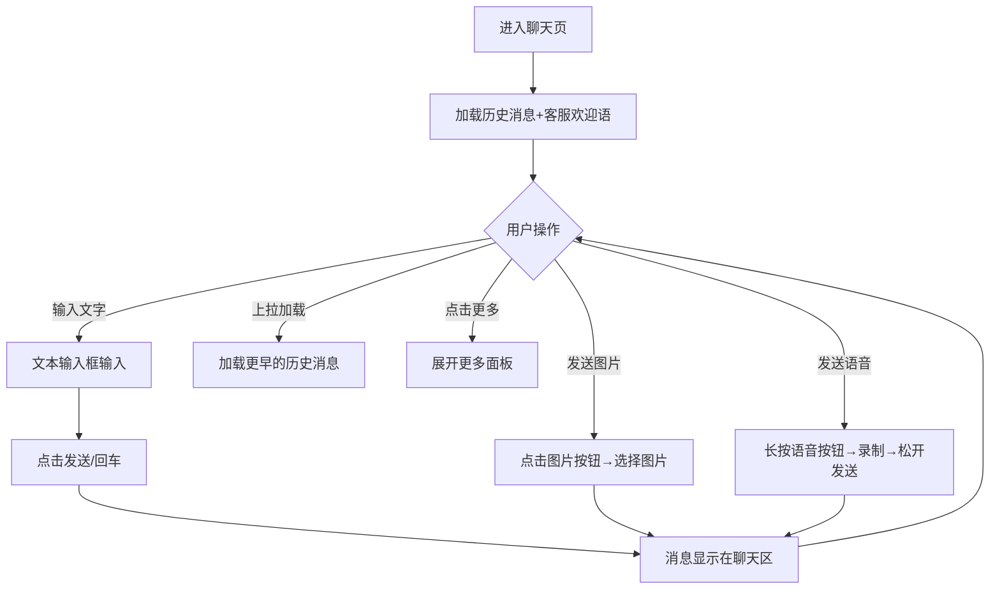
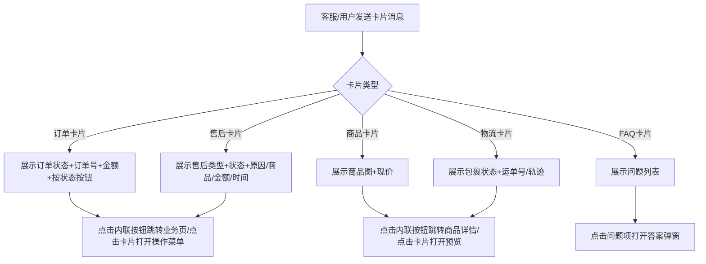
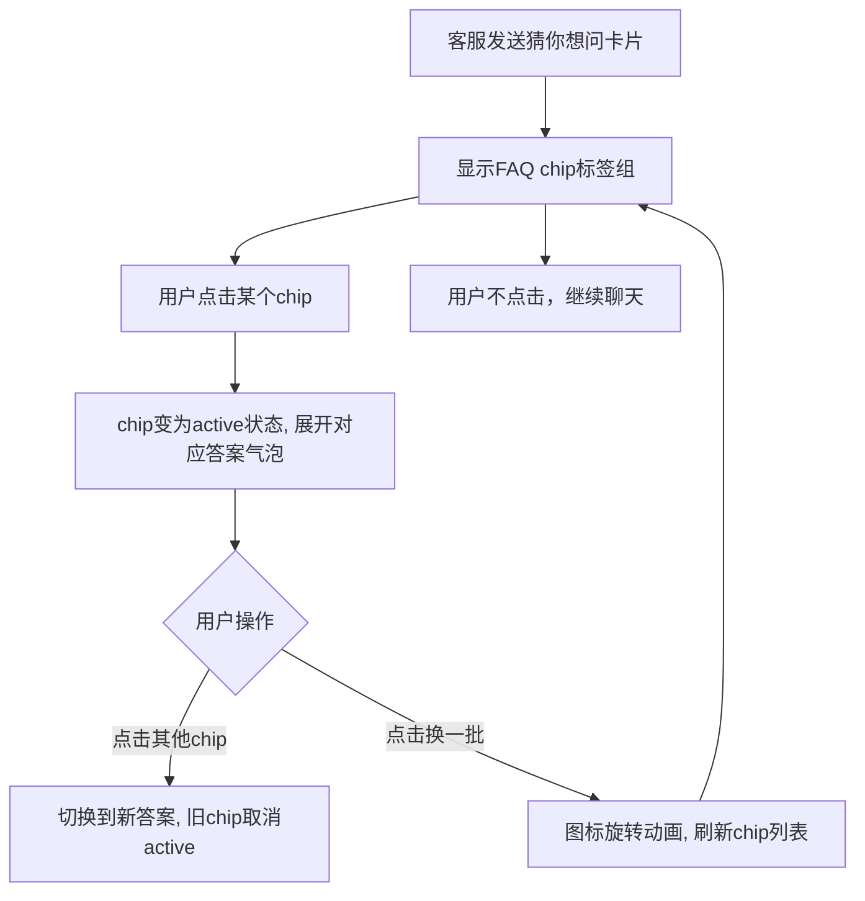
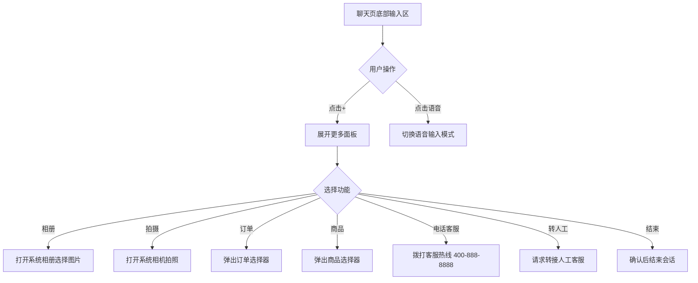
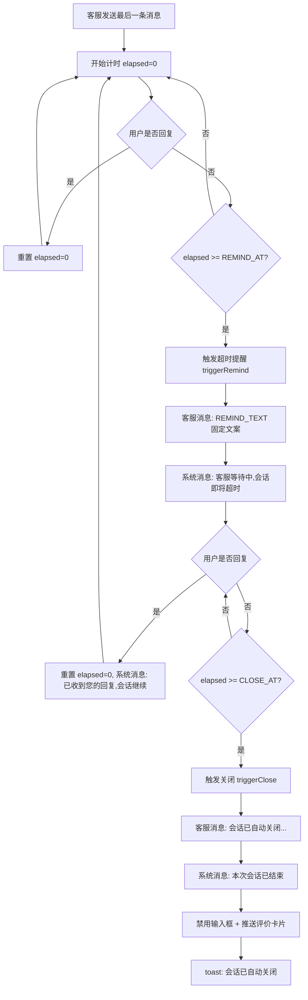
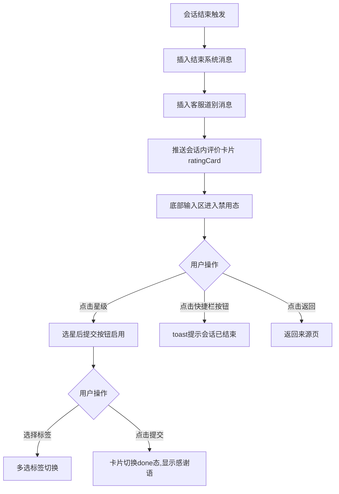
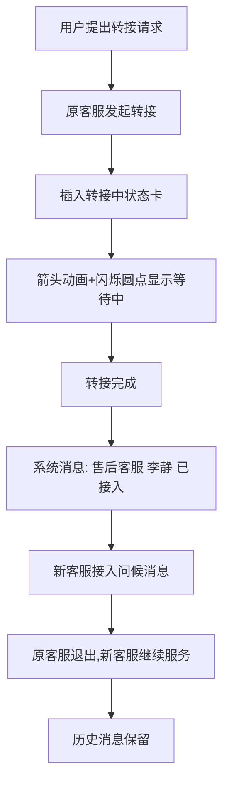

# 2 聊天主界面

本模块包含聊天主界面总览和5个功能子页面，是用户与客服进行实时交互的核心模块。聊天主界面总览为5大功能域的导航入口，各子页面按功能域拆分展示具体交互细节。

## 2.0 会话聊天模块定义

聊天页面采用统一的375px移动端布局外壳，包含：小程序状态栏、导航栏（返回+客服信息+更多操作）、消息列表、底部输入区。5个功能子页面共享此外壳结构，差异在于消息内容和交互功能。

导航栏客服信息区域显示：客服头像（蓝色渐变圆形，首字）+ 客服名称，无在线状态绿点。默认会话为智能客服场景：头像首字"智"、名称"智能客服"；转人工后切换为头像首字"客"、名称"在线客服"。导航栏右侧操作按钮：基础消息交互页（user-chat-basic.html）仅有电话按钮（拨打客服热线 400-888-8888）；输入工具栏页（user-chat-input.html）含电话按钮和更多按钮（三点菜单，弹出 toast 提示"转人工 · 结束会话 · 投诉建议"）。

## 2.1 聊天主界面（总览）（user-chat.html）

### 2.1.1 功能概述

聊天主界面总览页是5大功能域的导航入口，以卡片网格形式展示5个功能子页面的预览和说明：基础消息交互、富媒体卡片、输入工具栏与更多面板、超时提示、会话关闭提示+评价引导。用户点击卡片即可进入对应功能子页面查看详细原型。

### 2.1.2 页面结构

页面从上到下分为四个区域：页面头部、概览统计条、功能卡片网格、返回链接。

| 区域 | 说明 |
|------|------|
| 页面头部 | 蓝色渐变背景，面包屑导航+标题"聊天主界面 — 5 大功能域拆分"+需求标签 |
| 概览统计条 | 5功能子页面 / 375px移动端 / 1统一会话外壳 |
| 功能卡片网格 | 3列网格（响应式），5张功能卡片，每张含：头部（功能名+标签chip）、模拟预览区（280px，含聊天场景模拟）、底部（功能说明+需求编号+进入按钮） |
| 返回链接 | "返回上一页"链接 |

5张功能卡片：
1. **基础消息交互**(basic) — 文本/图片/语音消息收发，US-MVP-14
2. **富媒体卡片**(cards) — 卡片样本画廊（订单/售后/商品/物流/FAQ/评价/媒体），US-MVP-17/18/19
3. **输入工具栏与更多面板**(input) — 工具栏+7项快捷操作，US-MVP-14/16
4. **超时提示**(timeout) — 用户无响应超时提醒+自动关闭会话，US-MVP-14
5. **会话关闭提示+评价引导**(closed) — 会话结束道别+评价卡片+重新咨询，US-MVP-21/24

### 2.1.3 操作流程

此页面为导航总览页，无复杂操作流程。用户点击功能卡片即可跳转对应子页面。

### 2.1.4 字段与交互

| 字段名称 | 字段标识 | 字段类型 | 必填 | 数据类型 | 长度限制 | 默认值 | 校验规则 | 取值范围 | 来源 | 错误提示 |
|----------|----------|----------|------|----------|----------|--------|----------|----------|------|----------|
| 基础消息交互卡片 | card_basic | 可点击卡片 | - | - | - | - | 点击跳转 | - | - | - |
| 富媒体卡片卡片 | card_cards | 可点击卡片 | - | - | - | - | 点击跳转 | - | - | - |
| 输入工具栏卡片 | card_input | 可点击卡片 | - | - | - | - | 点击跳转 | - | - | - |
| 超时提示卡片 | card_timeout | 可点击卡片 | - | - | - | - | 点击跳转 | - | - | - |
| 会话关闭提示卡片 | card_closed | 可点击卡片 | - | - | - | - | 点击跳转 | - | - | - |

### 2.1.5 业务规则

| 规则编号 | 规则描述 |
|----------|----------|
| RULE-CHAT-INDEX-001 | 功能卡片点击后跳转对应子页面（onclick location.href） |
| RULE-CHAT-INDEX-002 | 卡片hover效果：上移3px + 蓝色边框 + 阴影增强 |

### 2.1.6 页面跳转

**入口**：
- 原型首页导航

**出口**：
- 点击"基础消息交互" → user-chat-basic.html
- 点击"富媒体卡片" → user-chat-cards.html
- 点击"输入工具栏与更多面板" → user-chat-input.html
- 点击"超时提示" → user-chat-timeout.html
- 点击"会话关闭提示+评价引导" → user-chat-closed.html
- 点击返回 → 来源页面

## 2.2 基础消息交互（user-chat-basic.html）

### 2.2.1 功能概述

基础消息交互页面是聊天功能的核心页面，实现用户与客服之间的文本、图片、语音消息收发。页面顶部显示客服信息和在线状态，中部为消息列表（支持历史消息上拉加载），底部为输入工具栏。支持消息类型包括：文字消息、图片消息、语音消息（波形+时长）、系统消息、客服欢迎语。

### 2.2.2 页面结构

页面采用移动端375px布局，从上到下分为四个区域：导航栏、消息列表、底部输入区。

| 区域 | 说明 |
|------|------|
| 导航栏 | 返回按钮 + 客服头像(默认"智",蓝色渐变)+名称"智能客服"(转人工后切为"客"+"在线客服") + 电话按钮(拨打400-888-8888) + 微信胶囊。无在线状态绿点 |
| 消息列表 | 系统分隔线"已为您接入智能客服 · {场景标签}" + 机器人欢迎消息气泡(发送者"智能客服小助手"，文案"您好，我是智能客服小助手，很高兴为您服务！请问有什么可以帮您？") + 场景卡片(机器人发送，延迟400ms) + 用户/客服消息气泡 + 历史消息上拉加载器 + 撤回提示("对方撤回了一条消息")。转人工后追加系统消息"人工客服已接入，您现在可以与真人客服沟通" + 人工问候"您好，我是人工客服王小明，很高兴为您服务！请问有什么可以帮您？" + 场景摘要卡片(订单/商品/物流/售后场景数据) |
| 底部输入区 | 语音按钮 + 文本输入框 + 更多按钮("+") + 发送按钮（输入内容时显示，替换"+"按钮）。无表情按钮 |
| 更多面板 | 点击"+"展开，4项快捷操作：📷相册、📷拍照、📞电话客服、🔄转人工。点击外部区域自动关闭 |
| 快捷卡片入口栏 | 输入框上方横向滚动的快捷入口标签栏，由公共组件 CsCommon.quickCardsBar() 生成，6个快捷按钮（按顺序）：转人工、发送订单、发送售后、查看物流、购物车、发送服务评价。每个按钮含图标+文字，hover时蓝色边框+蓝色文字+蓝色背景。点击发送订单/发送售后/查看物流时弹出对象选择器（modal-object-picker.html）选择对象后发送对应卡片到会话流；点击购物车直接发送购物车相关消息；点击发送服务评价推送评价卡片；点击转人工触发转人工流程。转人工后快捷栏末尾追加"结束会话"按钮（点击需二次确认） |

消息气泡样式：
- 客服消息：左侧显示，白色背景，左上圆角为2px，带客服头像
- 用户消息：右侧显示，蓝色背景(#1677ff)，右上圆角为2px，带用户头像
- 系统消息：居中显示，半透明黑色背景，白色文字

### 2.2.3 操作流程



发送消息后输入框清空，消息自动滚动到底部。历史消息上拉加载显示加载指示器。

### 2.2.4 字段与交互

| 字段名称 | 字段标识 | 字段类型 | 必填 | 数据类型 | 长度限制 | 默认值 | 校验规则 | 取值范围 | 来源 | 错误提示 |
|----------|----------|----------|------|----------|----------|--------|----------|----------|------|----------|
| 消息输入 | msg_input | 文本输入 | 否 | String | - | 空 | - | - | 用户输入 | - |
| 发送按钮 | btn_send | 按钮 | - | - | - | 禁用 | 输入框trim非空时启用 | - | - | 空消息不发送 |
| 语音按钮 | btn_voice | 按钮 | - | - | - | - | 长按录制，松开发送 | - | - | - |
| 更多按钮 | btn_more | 按钮 | - | - | - | - | 展开/收起更多面板 | - | - | - |
| 历史加载器 | history_loader | 加载指示 | - | - | - | 隐藏 | 上拉触发加载 | - | - | - |

### 2.2.5 业务规则

| 规则编号 | 规则描述 |
|----------|----------|
| RULE-CHAT-BASIC-001 | 发送消息前校验输入框trim后非空，空消息不发送 |
| RULE-CHAT-BASIC-002 | 发送后清空输入框，消息列表自动滚动到底部 |
| RULE-CHAT-BASIC-003 | 历史消息上拉加载：滚动到顶部时触发，显示加载指示器 |
| RULE-CHAT-BASIC-004 | Enter发送消息 |
| RULE-CHAT-BASIC-005 | 客服消息和用户消息分别靠左/靠右显示，带头像和时间戳 |
| RULE-CHAT-BASIC-006 | 发送按钮与"+"按钮互斥切换：输入框有内容时显示发送按钮、隐藏"+"按钮；输入框为空时隐藏发送按钮、显示"+"按钮 |
| RULE-CHAT-BASIC-007 | 语音录制浮层：长按语音按钮进入录制模式，显示半透明黑色浮层（红色脉冲圆点 + "正在录音... 00:0X"计时），松手发送语音消息 |
| RULE-CHAT-BASIC-008 | 导航栏电话按钮点击弹出确认弹窗"是否拨打客服热线 400-888-8888？"，确认后拨打 |
| RULE-CHAT-BASIC-009 | 快捷卡片入口栏：由公共组件 CsCommon.quickCardsBar() 生成，横向滚动展示6个快捷按钮（转人工/发送订单/发送售后/查看物流/购物车/发送服务评价），hover时蓝色边框+蓝色文字+蓝色背景。点击发送订单/发送售后/查看物流弹出对象选择器半屏弹窗（modal-object-picker.html），选择后发送对应卡片到会话流；点击购物车直接发送；点击发送服务评价推送会话内评价卡片；点击转人工触发转人工流程。转人工按钮无特殊颜色，与其他按钮样式一致 |
| RULE-CHAT-BASIC-010 | 更多面板4项操作：相册（打开系统相册）、拍照（打开系统相机）、电话客服（弹出确认弹窗后拨打400-888-8888）、转人工（toast提示"正在为您转接人工客服…"，1.5s后：①顶栏头像"智"→"客"、名称"智能客服"→"在线客服" ②插入系统消息"人工客服已接入，您现在可以与真人客服沟通" ③发送人工问候语"您好，我是人工客服王小明，很高兴为您服务！请问有什么可以帮您？" ④如有场景数据则发送场景摘要文本消息 ⑤快捷栏追加"结束会话"按钮） |
| RULE-CHAT-BASIC-011 | 转人工后快捷栏追加"结束会话"按钮，点击弹出确认弹窗"确认结束本次会话？"，确认后：发送系统消息"本次会话已结束，如有需要请重新发起咨询"（带"去留言"按钮，msg-system-with-action 样式）→ 客服道别消息"感谢您的咨询，欢迎下次再来～" → 推送会话内评价卡片（ratingCard）。会话停留在当前页，不自动返回上一页 |
| RULE-CHAT-BASIC-012 | 场景化会话初始化：根据URL参数entry_tag推送不同内容。默认机器人客服问候，系统消息"已为您接入智能客服 · {场景标签}"，机器人问候语"您好，我是智能客服小助手，很高兴为您服务！请问有什么可以帮您？"（发送者显示"智能客服小助手"）。场景映射：home→纯问候、product→商品卡片、order→订单卡片、logistics→物流卡片、refund→售后卡片、help→FAQ卡片。无cart/profile/phone场景卡片插入 |
| RULE-CHAT-BASIC-013 | 卡片点击交互分两类：①卡片内联按钮（card-action-btn）点击直接执行操作（跳转mini-program业务页，如订单详情/退款详情/物流页等），并在会话流插入系统消息+toast提示；②卡片整体（.card-action）点击打开半屏弹窗（商品→modal-product-preview、物流→modal-logistics-preview、订单→modal-order-actions、售后→modal-refund-actions）；③FAQ卡片内问题项点击打开modal-faq-answer答案弹窗。售后卡片无"转人工"按钮（已全部删除），转人工仅通过快捷栏入口触发 |
| RULE-CHAT-BASIC-014 | 卡片操作回调映射（跳转mini-program业务页）：商品→查看商品详情(viewDetail_product)；订单→查看详情(viewDetail_order)/申请售后(aftersale/aftersale_exchange)/修改地址(editAddress)/查看物流(trackLogistics)/查看售后进度(viewProgress)；售后→查看进度(viewProgress)/补充说明(supplement)/填写物流(fillLogistics)/撤销申请(revoke)；物流→查看物流详情(viewDetail_logistics)；FAQ→查看帮助(viewFaq) |
| RULE-CHAT-BASIC-015 | 消息撤回：客服撤回消息时在会话流插入"对方撤回了一条消息"提示（msg-recalled-notice 样式，含时钟图标）；用户消息支持2分钟内撤回（CsCommon.bindRecall），长按（移动端500ms）或右键（PC端）触发确认弹窗，确认后替换为"你撤回了一条消息"提示。超过2分钟提示"发送超过 2 分钟，无法撤回" |
| RULE-CHAT-BASIC-016 | 转人工场景摘要：转人工时如携带场景数据（scene+payload），人工接入后追加场景摘要文本消息。订单场景→"【订单咨询】订单号 xxx（状态）"；商品场景→"【商品咨询】商品名"；物流场景→"【物流咨询】承运商 运单号"；售后场景→"【售后咨询】售后类型 售后单号（状态）" |

### 2.2.6 页面跳转

**入口**：
- 咨询入口在线咨询（直接接入时）
- 排队等待接通后自动跳转
- 聊天主界面总览点击"基础消息交互"

**出口**：
- 点击更多"+" → 更多面板（user-chat-input.html功能）
- 结束会话 → 会话内推送评价卡片（ratingCard），停留当前页不跳转
- 点击返回 → 来源页面

## 2.3 富媒体卡片（user-chat-cards.html）

### 2.3.1 功能概述

富媒体卡片页面已重构为卡片样本画廊（.samples-grid），以网格形式集中展示 user-chat-basic.html 实际会话中所有富媒体卡片类型及其状态变体，用于核对视觉与交互一致性。所有卡片均由公共组件 CsCommon.cardHtml() 生成，与实际会话卡片 1:1 同步。覆盖：订单卡片（6种状态）、售后卡片（3种类型×关键状态，共19个样本）、商品卡片、物流卡片（单包裹+多包裹）、FAQ卡片、服务评价卡片、图片/语音媒体消息。本页无场景动态插入逻辑、无 staticOrder 等静态演示卡片ID，纯样本展示。

### 2.3.2 页面结构

页面采用 720px 居中布局，顶部页面标题+说明，主体为样本网格（.samples-grid，2列响应式，窄屏单列），每个样本含 sample-head（标题+状态标签）和 sample-body（卡片渲染区，灰底居中）。按区块分组渲染：订单卡片6状态、售后卡片3类型19状态、其它单一形态卡片（商品/物流/FAQ）、服务评价卡片、媒体消息。

| 区域 | 说明 |
|------|------|
| 页面标题 | "富媒体卡片样本（用户端）" + 返回链接 + 说明条（覆盖范围描述） |
| 样本网格 | 2列响应式网格，分区块展示所有卡片样本，每样本由 CsCommon.cardHtml() / CsCommon.ratingCard() 渲染 |
| 页面底注 | 卡片同步说明 + 返回链接 |

卡片类型（由 CsCommon.cardHtml 生成，type 参数）：

1. **订单卡片**(order) — 头部"订单"+状态徽标(6态) + body(订单编号/实付金额) + 按状态动态按钮组
2. **售后卡片**(aftersale/refund) — 头部"售后·{类型}"+状态徽标 + body(申请原因/商品名称/可退积分/退款金额/申请时间/处理意见) + 按状态动态按钮组
3. **商品卡片**(product) — 头部"商品"+s-done"在售" + body(商品缩略图+商品名+描述+现价) + "查看商品"按钮
4. **物流卡片**(logistics) — 头部"物流"+状态徽标(取首个非"已签收"包裹状态) + body(单包裹:运单号/承运商/轨迹步骤；多包裹:按包裹分组块) + "查看物流详情"按钮
5. **FAQ卡片**(faq) — 头部"常见问题"+"换一换"按钮 + body(4条问题列表，每项右箭头">"，点击跳转help.html)

其他消息类型：
6. **服务评价卡片** — 由 CsCommon.ratingCard() 生成：标题"服务评价" + 副标题 + 5星评分 + 4标签(响应迅速/态度友好/专业能力强/问题已解决) + 提交按钮 + 感谢语
7. **图片消息** — 200×150px图片区域，圆角展示
8. **语音消息** — 语音图标 + 6段波形条 + 时长文字

订单状态枚举（6态）与徽标颜色：

| 状态 | 徽标类 | 说明 |
|------|--------|------|
| 待发货 | s-warn | 待发货 |
| 运输中 | s-proc | 运输中 |
| 已签收 | s-done | 已签收 |
| 售后中 | s-danger | 售后中 |
| 已完成 | s-done | 已完成 |
| 已取消 | s-danger | 已取消 |

售后卡片状态徽标映射（按类型流转）：

| 类型 | 状态流转 |
|------|----------|
| 仅退款(5态) | 待商家审核(s-warn) → 待退款(s-warn) → 完成(s-done) / 申请已拒绝(s-danger) / 已取消(s-closed) |
| 退货退款(7态) | 待商家审核(s-warn) → 待寄回商品(s-proc) → 待商家收货(s-proc) → 待退款(s-warn) → 完成(s-done) / 申请已拒绝(s-danger) / 已取消(s-closed) |
| 换货(7态) | 待商家审核(s-warn) → 待寄回商品(s-proc) → 待商家收货(s-proc) → 待商家重新发货(s-warn) → 完成(s-done) / 申请已拒绝(s-danger) / 已取消(s-closed) |

售后卡片 body 字段显示规则：
- 申请原因、商品名称：所有类型/状态均显示
- 可退积分：仅 refund_points > 0 时显示（"xx苏银豆"）
- 退款金额：仅"仅退款"和"退货退款"显示（换货不显示）
- 申请时间：所有类型/状态均显示
- 处理意见(merchant_opinion)：仅"申请已拒绝"状态显示

### 2.3.3 操作流程



卡片消息由客服端或用户端发送，用户端展示。卡片交互分两类：内联按钮（card-action-btn）直接执行操作跳转mini-program业务页；卡片整体（.card-action）点击打开半屏弹窗。

**卡片点击弹窗对应关系**：

| 卡片类型 | 弹窗类型 | 弹窗文件 | 弹窗内容 | 底部操作按钮 |
|----------|----------|----------|----------|-------------|
| 订单卡片 | 操作菜单 | modal-order-actions.html | 订单摘要(订单号+状态) + 按状态动态操作项 | 取消 |
| 售后卡片 | 操作菜单 | modal-refund-actions.html | 售后摘要(售后单号+金额+状态) + 按状态动态操作项 | 取消 |
| 商品卡片 | 预览弹窗 | modal-product-preview.html | 商品主图+价格+标题+规格+评价 | 加入购物车 / 查看商品详情 |
| 物流卡片 | 预览弹窗 | modal-logistics-preview.html | 物流状态+快递信息+物流时间线 | 复制运单号 / 刷新物流 |
| FAQ卡片 | 答案弹窗 | modal-faq-answer.html | 问题+答案(支持步骤式)+反馈 | 关闭 / 仍要咨询客服 |

### 2.3.4 字段与交互

| 字段名称 | 字段标识 | 字段类型 | 必填 | 数据类型 | 长度限制 | 默认值 | 校验规则 | 取值范围 | 来源 | 错误提示 |
|----------|----------|----------|------|----------|----------|--------|----------|----------|------|----------|
| 订单状态 | order_status | 展示文本 | - | String | - | - | - | 待发货/运输中/已签收/售后中/已完成/已取消 | 系统数据 | - |
| 订单号 | order_id | 展示文本 | - | String | - | - | - | - | 系统数据 | - |
| 实付金额 | amount | 展示文本 | - | String | - | - | - | - | 系统数据 | - |
| 商品名称 | product_name | 展示文本 | - | String | - | - | - | - | 系统数据 | - |
| 商品价格 | product_price | 展示文本 | - | String | - | - | - | - | 系统数据 | - |
| 售后类型 | aftersale_type | 展示文本 | - | String | - | - | - | 仅退款/退货退款/换货 | 系统数据 | - |
| 售后状态 | aftersale_status | 展示文本 | - | String | - | - | - | 待商家审核/待寄回商品/待商家收货/待退款/待商家重新发货/完成/申请已拒绝/已取消 等 | 系统数据 | - |
| 可退积分 | refund_points | 展示文本 | - | Number | - | 0 | >0时显示 | - | 系统数据 | - |
| 退款金额 | refund_amount | 展示文本 | - | String | - | - | 仅仅退款/退货退款显示 | - | 系统数据 | - |
| 处理意见 | merchant_opinion | 展示文本 | - | String | - | - | 仅"申请已拒绝"显示 | - | 系统数据 | - |
| 运单号 | tracking_no | 展示文本 | - | String | - | - | - | - | 系统数据 | - |
| 查看详情 | btn_card_detail | 按钮 | - | - | - | - | - | - | - | - |

### 2.3.5 业务规则

| 规则编号 | 规则描述 |
|----------|----------|
| RULE-CARDS-001 | 卡片宽度限制为252px（--chat-card-width），超出文本省略号截断 |
| RULE-CARDS-002 | 订单卡片状态徽标颜色按 orderStatusMap 区分：待发货(s-warn)、运输中(s-proc)、已签收(s-done)、售后中(s-danger)、已完成(s-done)、已取消(s-danger) |
| RULE-CARDS-003 | 订单卡片按钮按状态动态显示：待发货→查看详情+申请售后+修改地址；运输中→查看详情+查看物流+申请售后；已签收→查看详情+查看物流+申请售后；售后中→查看详情+查看售后进度；已完成/已取消→查看详情 |
| RULE-CARDS-004 | 售后卡片头部显示"售后 · {类型}"（仅退款/退货退款/换货）+状态徽标。状态徽标按 aftersaleStatusMap 映射：待商家审核/待退款/待商家重新发货(s-warn)、商家已审核/待寄回商品/已寄回商品/待商家收货/商家已收货/商家已发货(s-proc)、已退款/完成/已完成(s-done)、申请已拒绝(s-danger)、已取消(s-closed) |
| RULE-CARDS-005 | 售后卡片 body 字段显示规则：申请原因、商品名称、申请时间始终显示；可退积分(refund_points)仅>0时显示（"xx苏银豆"）；退款金额仅"仅退款"和"退货退款"显示（换货不显示）；处理意见(merchant_opinion)仅"申请已拒绝"状态显示。售后卡片无售后单号字段（已删除） |
| RULE-CARDS-006 | 售后卡片按钮按状态动态显示：所有状态显示"查看进度"(viewProgress→refund_detail)；待商家审核追加"补充说明"(supplement)+"撤销申请"(revoke)；商家已审核/待寄回商品追加"填写物流"(fillLogistics)。撤销申请需二次确认 |
| RULE-CARDS-007 | 物流卡片支持多包裹（packages数组）：多包裹时按包裹分组渲染（pkg-block），每包裹含包裹号+状态徽标+承运商+运单号+商品+轨迹提示，包裹间虚线分隔；头部状态取首个非"已签收"包裹状态，全部已签收则显示"已签收"。单包裹向后兼容（运单号+承运商+轨迹步骤） |
| RULE-CARDS-008 | FAQ卡片内问题列表每项可点击，右箭头">"表示可跳转查看详情（跳转mini-program help.html）。FAQ卡片头部含"换一换"按钮，3组问题循环切换，点击图标旋转360°动画 |
| RULE-CARDS-009 | 卡片样本画廊（user-chat-cards.html）无场景动态插入逻辑、无 staticOrder 等静态演示卡片ID，纯样本展示。所有样本由 CsCommon.cardHtml() 渲染，与 user-chat-basic.html 实际会话卡片 1:1 同步 |
| RULE-CARDS-010 | 卡片上的"转人工"按钮已全部删除（cs-common.js transferBtn 已移除），转人工仅通过快捷卡片入口栏的"转人工"按钮触发（携带场景数据转人工） |
| RULE-CARDS-011 | 对象选择器弹窗（modal-object-picker.html）：点击快捷栏发送订单/发送售后/查看物流按钮时弹出半屏弹窗，支持4种类型（order/product/refund/logistics），每种类型显示不同的标题和说明。列表项含缩略图(44×44px,渐变色背景+首字)+名称+元信息+状态标签(s-warn/s-proc/s-done/s-danger)，点击选中后发送对应卡片到会话流。底部"取消"按钮关闭弹窗 |
| RULE-CARDS-012 | 订单操作菜单弹窗（modal-order-actions.html）：点击订单卡片整体弹出半屏操作菜单。头部含订单摘要（订单号+状态标签），操作项按订单状态动态显示。订单状态与可用操作映射（对齐6态）：待发货→查看详情/申请售后/修改地址/继续咨询；运输中→查看详情/查看物流/申请售后/继续咨询；已签收→查看详情/查看物流/申请售后/继续咨询；售后中→查看详情/查看售后进度/继续咨询；已完成/已取消→查看详情/继续咨询 |
| RULE-CARDS-013 | 售后操作菜单弹窗（modal-refund-actions.html）：点击售后卡片整体弹出半屏操作菜单。头部含售后摘要，操作项按售后状态动态显示：查看进度(常驻)、补充说明(条件)、填写物流(条件)、撤销申请(条件)、联系人工客服(常驻)。状态与操作映射对齐小程序 refund_detail |
| RULE-CARDS-014 | 商品预览弹窗（modal-product-preview.html）：点击商品卡片整体弹出半屏预览。内容含商品主图轮播+价格区+标题+标签+规格行+评价区。底部2按钮：加入购物车(橙色) + 查看商品详情(蓝色) |
| RULE-CARDS-015 | 物流预览弹窗（modal-logistics-preview.html）：点击物流卡片整体弹出半屏预览。内容含状态头+快递信息栏(快递公司+运单号+复制按钮)+商品缩略图+物流时间线。底部2按钮：复制运单号(灰色) + 刷新物流(蓝色) |
| RULE-CARDS-016 | FAQ答案弹窗（modal-faq-answer.html）：点击FAQ卡片内问题项弹出半屏答案详情。内容含问题头+答案区(支持步骤式)+有帮助反馈。底部2按钮：关闭(灰色) + 仍要咨询客服(蓝色) |
| RULE-CARDS-017 | 卡片内联按钮（card-action-btn）点击直接执行操作跳转mini-program业务页（data-cs-action 映射 ACTION_URLS），不弹半屏弹窗；执行后在会话流插入系统消息+toast提示。已操作的按钮标记 done 防止重复触发。撤销申请/取消订单需二次确认 |
| RULE-CARDS-018 | 所有半屏弹窗统一为sheet变体（底部弹出），含拖拽手柄，支持向下拖拽关闭。操作菜单类弹窗底部有"取消"按钮关闭弹窗 |

### 2.3.6 页面跳转

**入口**：
- 聊天主界面总览点击"富媒体卡片"

**出口**：
- 卡片内联按钮/卡片整体点击 → 跳转mini-program业务页（订单详情/商品详情/物流页/退款详情/帮助页）或打开半屏弹窗
- 点击返回 → 来源页面

## 2.4 猜你想问（user-chat-faq.html）

### 2.4.1 功能概述

猜你想问页面展示会话内的FAQ快捷问题卡片，用户点击问题chip即可快速查看答案，无需离开聊天页面。FAQ问题以chip标签形式展示在消息流中，点击后展开答案气泡，支持多问题切换。此功能帮助用户快速获取常见问题答案，减少客服工作量。

### 2.4.2 页面结构

页面采用移动端375px布局，导航栏和输入区与基础消息交互一致，差异在消息列表中的FAQ快捷问题区域。

| 区域 | 说明 |
|------|------|
| 导航栏 | 同基础消息交互 |
| 消息列表 | 客服消息"猜你想问，点一下即可查看" + FAQ chip标签组 + "换一批"按钮 + 答案展开区域 |
| 底部输入区 | 同基础消息交互 |

FAQ chip标签组示例（第1组）：退款多久到账？/ 可以修改收货地址吗？/ 查不到物流怎么办？/ 支持哪些支付方式？

3组问题循环切换（点击"换一批"按钮循环）：

| 组别 | 问题1 | 问题2 | 问题3 | 问题4 |
|------|-------|-------|-------|-------|
| 第1组 | 退款多久到账？ | 可以修改收货地址吗？ | 查不到物流怎么办？ | 支持哪些支付方式？ |
| 第2组 | 如何开发票？ | 优惠券怎么用？ | 商品保修期多久？ | 会员等级权益？ |
| 第3组 | 订单如何取消？ | 七天无理由退货？ | 积分怎么获取？ | 支持哪些快递？ |

答案示例：
- "退款多久到账？" → "退款审核通过后：支付宝/微信原路退回 1-3 个工作日；银行卡 3-7 个工作日；余额即时到账。节假日可能顺延。"
- "可以修改收货地址吗？" → "订单未发货前，可在订单详情页点击「修改地址」更新收货信息。已发货订单无法修改，建议联系收件人或快递员沟通改派。"
- "查不到物流怎么办？" → "物流单号一般在发货后 2-4 小时内更新。超过 24 小时仍无更新多为系统延迟，可耐心等待；急需处理可点「转人工」。"
- "支持哪些支付方式？" → "目前支持微信支付、支付宝、银联云闪付、信用卡分期及商城余额支付，部分商品支持花呗与白条。"

猜你想问卡片结构：
- 标题行：问号图标 + "猜你想问，点一下即可查看" + "换一批"按钮（蓝色圆角标签，含旋转图标，点击后图标旋转360°动画刷新问题列表）
- chip标签组：蓝色背景圆角标签，点击后变为实心蓝色（active状态）
- 答案展开区域：点击chip后显示，含问题文本（加粗）+ 答案文本

### 2.4.3 操作流程



点击chip后展开答案气泡，点击其他chip切换答案。"换一批"按钮点击后图标旋转360°动画，刷新问题列表。

### 2.4.4 字段与交互

| 字段名称 | 字段标识 | 字段类型 | 必填 | 数据类型 | 长度限制 | 默认值 | 校验规则 | 取值范围 | 来源 | 错误提示 |
|----------|----------|----------|------|----------|----------|--------|----------|----------|------|----------|
| FAQ chip | faq_chip | 可点击标签 | - | - | - | - | 点击变为active状态 | - | 系统数据 | - |
| 答案气泡 | faq_answer | 展示区域 | - | - | - | 隐藏 | 点击chip展开 | - | 系统数据 | - |
| 换一批按钮 | qa_refresh | 按钮 | - | - | - | - | 点击后图标旋转360°动画 | - | - | - |

### 2.4.5 业务规则

| 规则编号 | 规则描述 |
|----------|----------|
| RULE-CHAT-FAQ-001 | FAQ chip标签以消息流内嵌方式展示，不遮挡聊天内容 |
| RULE-CHAT-FAQ-002 | 点击chip展开答案，chip变为active状态（实心蓝色）；点击其他chip切换答案，旧chip取消active |
| RULE-CHAT-FAQ-003 | FAQ问题根据 entry_tag 场景动态推荐（如商品详情页进入推荐商品相关FAQ） |
| RULE-CHAT-FAQ-004 | "换一批"按钮点击后图标旋转360°动画（0.5s ease），250ms时切换到下一组问题，500ms后动画结束。3组问题循环切换（第3组→第1组）。切换时清空已展开的答案区域 |
| RULE-CHAT-FAQ-005 | "换一批"按钮在旋转动画期间（spinning状态）不可重复点击，防止连续触发 |
| RULE-CHAT-FAQ-006 | 再次点击已active的chip可收起答案（toggle行为） |

### 2.4.6 页面跳转

**入口**：
- 聊天主界面总览点击"猜你想问"
- 客服在聊天中发送FAQ快捷问题

**出口**：
- 点击返回 → 来源页面

## 2.5 输入工具栏与更多面板（user-chat-input.html）

### 2.5.1 功能概述

输入工具栏与更多面板页面展示聊天底部的输入工具栏和点击"+"后展开的更多面板。工具栏包含语音、更多、发送三个按钮（无表情按钮）；更多面板包含7项快捷操作：相册、拍摄、订单、商品、电话客服、转人工、结束会话（无文件、无位置）。输入框上方含快捷卡片入口栏（对齐基础消息交互页，由公共组件 CsCommon.quickCardsBar() 生成6按钮）。

### 2.5.2 页面结构

页面采用移动端375px布局，重点展示底部输入区和更多面板。

| 区域 | 说明 |
|------|------|
| 导航栏 | 返回 + 客服头像"客"+名称"在线客服" + 电话按钮 + 更多按钮(三点菜单，toast"转人工 · 结束会话 · 投诉建议") + 微信胶囊 |
| 消息列表 | 客服提示消息"点击'+'查看更多功能" |
| 快捷卡片入口栏 | 输入框上方横向滚动，对齐 basic 页，6按钮：发送订单/发送售后/查看物流/购物车/发送服务评价等 |
| 输入工具栏 | 语音按钮 + 文本输入框 + 更多"+"按钮 + 发送按钮（输入内容时显示，替换"+"按钮）。无表情按钮 |
| 更多面板 | 4列网格布局，7项快捷操作图标：📷相册/📷拍摄/📦订单/🛒商品/📞电话客服/🔄转人工/❌结束会话 |

### 2.5.3 操作流程



更多面板点击外部区域自动关闭。面板展开时输入区上移。

### 2.5.4 字段与交互

| 字段名称 | 字段标识 | 字段类型 | 必填 | 数据类型 | 长度限制 | 默认值 | 校验规则 | 取值范围 | 来源 | 错误提示 |
|----------|----------|----------|------|----------|----------|--------|----------|----------|------|----------|
| 消息输入 | msg_input | 文本输入 | 否 | String | - | 空 | - | - | 用户输入 | - |
| 语音按钮 | btn_voice | 切换按钮 | - | - | - | 键盘模式 | - | 键盘/语音 | - | - |
| 更多按钮 | btn_more | 切换按钮 | - | - | - | 收起 | - | 展开/收起 | - | - |
| 发送按钮 | btn_send | 按钮 | - | - | - | 禁用 | 输入框非空时启用 | - | - | - |
| 相册 | btn_album | 面板按钮 | - | - | - | - | - | - | - | - |
| 相机 | btn_camera | 面板按钮 | - | - | - | - | - | - | - | - |
| 订单 | btn_order | 面板按钮 | - | - | - | - | - | - | - | - |
| 商品 | btn_product | 面板按钮 | - | - | - | - | - | - | - | - |
| 电话客服 | btn_phone_cs | 面板按钮 | - | - | - | - | 弹出确认后拨打400-888-8888 | - | - | - |
| 转人工 | btn_transfer | 面板按钮 | - | - | - | - | - | - | - | - |
| 结束会话 | btn_end_session | 面板按钮 | - | - | - | - | 需二次确认 | - | - | - |

### 2.5.5 业务规则

| 规则编号 | 规则描述 |
|----------|----------|
| RULE-INPUT-001 | 点击更多面板外部区域自动关闭面板 |
| RULE-INPUT-002 | "结束会话"需二次确认弹窗，防止误操作 |
| RULE-INPUT-003 | 语音模式与键盘模式互斥切换 |
| RULE-INPUT-004 | 面板展开时输入区上移，不遮挡消息内容 |
| RULE-INPUT-005 | 发送按钮与"+"按钮互斥：输入框有内容时显示发送按钮（蓝色实心）、隐藏"+"按钮；输入框为空时隐藏发送按钮、显示"+"按钮。无表情按钮 |
| RULE-INPUT-006 | 电话客服按钮点击弹出确认弹窗"是否拨打客服热线 400-888-8888？"，确认后拨打 |
| RULE-INPUT-007 | 更多面板7项操作：相册、拍摄、订单、商品、电话客服、转人工、结束会话（无文件、无位置） |
| RULE-INPUT-008 | 输入框上方含快捷卡片入口栏，对齐 basic 页，由公共组件 CsCommon.quickCardsBar() 生成6按钮 |
| RULE-INPUT-009 | 导航栏更多按钮（三点）点击弹出toast"更多：转人工 · 结束会话 · 投诉建议" |

### 2.5.6 页面跳转

**入口**：
- 聊天主界面总览点击"输入工具栏与更多面板"
- 聊天页点击"+"按钮

**出口**：
- 选择相册/相机 → 系统选择器
- 选择订单/商品 → 对应选择器弹窗
- 转人工 → 转接流程
- 结束会话 → 会话内推送评价卡片，停留当前页
- 点击返回 → 来源页面

## 2.6 会话内评价邀请（user-chat-rating.html）

### 2.6.1 功能概述

会话内评价邀请页面展示客服结束会话后的评价场景。会话结束后在消息流内嵌服务评价卡片（CsCommon.ratingCard()），用户在卡片内完成评价（单维5星+4标签，无补充评价textarea，无弹窗）。底部输入区进入禁用态，仅电话客服按钮可用。

### 2.6.2 页面结构

页面采用移动端375px布局，与基础消息交互一致，差异在消息列表和底部输入区状态。

| 区域 | 说明 |
|------|------|
| 导航栏 | 同基础消息交互（含电话按钮和更多按钮） |
| 消息列表 | 历史消息 + 系统消息"客服已结束本次服务" + 会话内嵌评价卡片（ratingCard） |
| 会话内评价卡片 | 标题"服务评价" + 副标题"感谢您的咨询，请对本次服务打分" + 5星评分（rc-star，点击1-5星） + 4标签（响应迅速/态度友好/专业能力强/问题已解决，多选） + 提交按钮（默认disabled，选星后启用） + 感谢语（提交后显示） |
| 底部输入区 | 会话已结束禁用态：输入框disabled(placeholder"会话已结束") + 语音按钮opacity:0.4+pointer-events:none + 更多"+"按钮仍可点击展开面板。无表情按钮 |
| 更多面板 | 会话结束后仍可展开，7项操作中仅"电话客服"可正常使用，其余按钮点击提示toast"会话已结束" |

### 2.6.3 操作流程

```mermaid
flowchart TD
    A[会话结束→客服已结束本次服务] --> B[消息流内嵌评价卡片]
    B --> C[用户点击星级评分]
    C --> D[选星后提交按钮启用]
    D --> E{用户操作}
    E -->|选择标签| F[多选标签，可重复点击切换]
    E -->|点击提交| G[卡片切换为done态，按钮显示"已提交"，显示感谢语]
```

评价卡片由 CsCommon.ratingCard() 生成，CsCommon.bindRating() 绑定交互。选星后提交按钮启用，提交后卡片不可再操作。

### 2.6.4 字段与交互

| 字段名称 | 字段标识 | 字段类型 | 必填 | 数据类型 | 长度限制 | 默认值 | 校验规则 | 取值范围 | 来源 | 错误提示 |
|----------|----------|----------|------|----------|----------|--------|----------|----------|------|----------|
| 星级评分 | rating_star | 评分控件 | 是 | Number | - | 0 | 点击1-5星，提交前需选星 | 1-5 | 用户选择 | - |
| 评价标签 | rating_tag | 多选标签 | 否 | Array | - | 空 | 多选，可重复点击切换 | 响应迅速/态度友好/专业能力强/问题已解决 | 用户选择 | - |
| 提交按钮 | btn_submit | 按钮 | - | - | - | 禁用 | 选星后启用，提交后disabled | - | - | - |
| 消息输入 | msg_input | 文本输入 | - | - | - | 禁用 | 会话已结束，不可输入 | - | - | - |
| 更多面板 | more_panel | 展开面板 | - | - | - | 收起 | 点击"+"展开/收起 | - | - | - |

### 2.6.5 业务规则

| 规则编号 | 规则描述 |
|----------|----------|
| RULE-CHAT-RATING-001 | 评价采用会话内嵌卡片（CsCommon.ratingCard()），不弹窗。会话结束后在消息流插入评价卡片，CsCommon.bindRating() 绑定交互 |
| RULE-CHAT-RATING-002 | 评价为单维度5星评分（非4维度），点击1-5星设置评分；4个标签多选（响应迅速/态度友好/专业能力强/问题已解决），无补充评价textarea |
| RULE-CHAT-RATING-003 | 提交按钮默认disabled，选星后启用；提交后卡片加 done 类，按钮显示"已提交"并disabled，显示感谢语"感谢您的评价，祝您生活愉快！" |
| RULE-CHAT-RATING-004 | 会话结束后底部输入区进入禁用态：输入框disabled + 语音按钮opacity:0.4+pointer-events:none（无表情按钮） |
| RULE-CHAT-RATING-005 | 更多"+"按钮会话结束后仍可点击展开面板，面板中仅"电话客服"可正常使用，其余按钮点击提示toast"会话已结束，无法操作" |
| RULE-CHAT-RATING-006 | 导航栏更多按钮（三点）点击弹出toast"更多：转人工 · 结束会话 · 投诉建议" |
| RULE-CHAT-RATING-007 | 导航栏电话按钮会话结束后仍可用，点击弹出确认弹窗"是否拨打客服热线 400-888-8888？" |

### 2.6.6 页面跳转

**入口**：
- 聊天主界面总览点击"会话内评价邀请"
- 会话结束后自动进入

**出口**：
- 评价完成/跳过 → 留在当前页
- 点击返回 → 来源页面

## 2.7 超时提示（user-chat-timeout.html）

### 2.7.1 功能概述

超时提示页演示用户长时间未回复客服消息后的超时状态机。会话从客服最后一条消息开始计时，到达提醒阈值后由客服身份发送超时提醒消息，到达关闭阈值后自动关闭会话并推送服务评价卡片。该状态机对齐 admin-settings.html「会话超时设置」的业务规则，原型为便于观察使用演示加速（1秒=1演示分钟），实际阈值见下表。

| 阈值 | 演示值 | 实际值 | 触发动作 |
|------|--------|--------|----------|
| 提醒阈值(REMIND_AT) | 30 秒 | 15 分钟 | 客服身份发送超时提醒文案 |
| 关闭阈值(CLOSE_AT) | 60 秒 | 30 分钟 | 自动关闭会话+推送评价卡片 |

### 2.7.2 页面结构

页面采用移动端375px布局，与基础消息交互一致，差异在于消息列表中含超时状态机驱动的动态消息，且会话已为转人工后的在线客服态。

| 区域 | 说明 |
|------|------|
| 导航栏 | 返回按钮 + 客服头像"客"+名称"在线客服" + 微信胶囊。无在线状态绿点 |
| 消息列表 | 系统消息"已为您接入在线客服 · 订单咨询" + 用户咨询消息 + 客服回复消息（最后一条客服消息，从此开始计时） + 超时提醒（客服消息气泡形式） + 系统消息"客服等待中，会话即将超时" + 关闭提示（客服消息"会话已自动关闭（用户长时间未回复），感谢您的咨询。"） + 系统消息"本次会话已结束" + 会话内服务评价卡片 |
| 快捷卡片入口条 | 与基础消息交互一致，5个快捷按钮（发送订单/发送售后/查看物流/购物车/发送服务评价）。转人工后状态无"转人工"按钮 |
| 底部输入区 | 语音按钮 + 文本输入框 + 更多按钮 + 发送按钮。会话关闭后输入框disabled，placeholder改为"会话已关闭" |
| 演示控制条 | 原型专用，含"触发超时提醒"和"立即关闭"两个按钮，便于观察流程。正式环境无此控件 |

### 2.7.3 操作流程



超时提醒文案固定为"您已长时间未回复，如需继续咨询请回复任意内容；会话将在 15 分钟后自动关闭。"。用户在提醒后回复会重置计时并插入"已收到您的回复，会话继续"系统消息。

### 2.7.4 字段与交互

| 字段名称 | 字段标识 | 字段类型 | 必填 | 数据类型 | 长度限制 | 默认值 | 校验规则 | 取值范围 | 来源 | 错误提示 |
|----------|----------|----------|------|----------|----------|--------|----------|----------|------|----------|
| 提醒阈值 | REMIND_AT | 配置项 | 是 | Number | - | 15分钟(演示30秒) | - | - | admin-settings | - |
| 关闭阈值 | CLOSE_AT | 配置项 | 是 | Number | - | 30分钟(演示60秒) | - | - | admin-settings | - |
| 提醒文案 | REMIND_TEXT | 配置项 | 是 | String | - | 固定文案 | - | - | admin-settings | - |
| 计时器 | elapsed | 状态变量 | - | Number | - | 0 | 每秒递增，用户回复重置 | - | - | - |
| 已提醒标记 | reminded | 状态变量 | - | Boolean | - | false | 触发提醒后置true | - | - | - |
| 已关闭标记 | closed | 状态变量 | - | Boolean | - | false | 触发关闭后置true | - | - | - |
| 消息输入 | msg_input | 文本输入 | 否 | String | - | 空 | 会话关闭后disabled | - | 用户输入 | - |

### 2.7.5 业务规则

| 规则编号 | 规则描述 |
|----------|----------|
| RULE-CHAT-TIMEOUT-001 | 超时状态机以客服最后一条消息为起点开始计时（elapsed=0），每秒递增。用户回复任意消息重置 elapsed=0 |
| RULE-CHAT-TIMEOUT-002 | 到达提醒阈值（15分钟/演示30秒）触发 triggerRemind：以客服身份发送超时提醒消息（REMIND_TEXT 固定文案"您已长时间未回复，如需继续咨询请回复任意内容；会话将在 15 分钟后自动关闭。"） + 系统消息"客服等待中，会话即将超时"。reminded 标记置 true，不重复触发 |
| RULE-CHAT-TIMEOUT-003 | 到达关闭阈值（30分钟/演示60秒）触发 triggerClose：以客服身份发送关闭提示"会话已自动关闭（用户长时间未回复），感谢您的咨询。" + 系统消息"本次会话已结束" + 禁用输入框（placeholder改为"会话已关闭"）+ 推送服务评价卡片（CsCommon.ratingCard()）+ toast"会话已自动关闭"。closed 标记置 true，清除计时器 |
| RULE-CHAT-TIMEOUT-004 | 用户在提醒后回复会重置计时：elapsed=0、reminded=false，并插入系统消息"已收到您的回复，会话继续"。会话关闭后用户回复不再重置（state.closed 时 return） |
| RULE-CHAT-TIMEOUT-005 | 提醒阈值和关闭阈值对齐 admin-settings.html「会话超时设置」，正式环境分别为15分钟和30分钟，提醒文案固定（与后台 textarea 一致） |
| RULE-CHAT-TIMEOUT-006 | 会话关闭后允许"再次咨询"（reconsult-bar），点击后重新发起新会话 |
| RULE-CHAT-TIMEOUT-007 | 演示控制条（btnDemoTimeout/btnDemoClose）仅原型用，手动触发提醒/关闭便于观察流程，正式环境无此控件 |

### 2.7.6 页面跳转

**入口**：
- 聊天主界面总览点击"超时提示"
- 会话中用户长时间未回复自动进入此状态（实际业务中）

**出口**：
- 会话关闭后点击"再次咨询" → 重新发起新会话
- 点击返回 → 来源页面

## 2.8 会话关闭提示（user-chat-closed.html）

### 2.8.1 功能概述

会话关闭提示页展示会话正常结束后的完整收尾流程。会话结束后在消息流依次插入：结束系统消息、客服道别消息、会话内嵌服务评价卡片（CsCommon.ratingCard()）。底部输入区进入禁用态（placeholder"会话已结束，感谢您的咨询"），快捷卡片入口条仍可见但操作受限。用户可在评价卡片内完成评分提交，提交后卡片切换为已提交态。

### 2.8.2 页面结构

页面采用移动端375px布局，与基础消息交互一致，差异在于消息列表含结束收尾消息序列和评价卡片，底部输入区为禁用态。

| 区域 | 说明 |
|------|------|
| 导航栏 | 返回按钮 + 客服头像"客"+名称"在线客服" + 微信胶囊。无在线状态绿点 |
| 消息列表 | 系统消息"已为您接入在线客服 · 订单咨询" + 历史对话片段（用户咨询/客服回复/用户致谢） + 结束系统消息"本次会话已结束 · 如有需要请重新发起咨询" + 客服道别消息"感谢您的咨询，欢迎下次再来～" + 会话内评价卡片（ratingCard） |
| 会话内评价卡片 | 标题"服务评价" + 副标题 + 5星评分 + 4标签（响应迅速/态度友好/专业能力强/问题已解决） + 提交按钮 + 感谢语（提交后） |
| 快捷卡片入口条 | 与基础消息交互一致，5个快捷按钮。会话结束后操作受限 |
| 底部输入区 | 语音按钮 + 文本输入框(disabled, placeholder"会话已结束，感谢您的咨询") + 更多按钮 + 发送按钮 |

### 2.8.3 操作流程



评价卡片由 CsCommon.ratingCard() 生成，CsCommon.bindRating() 绑定交互。会话结束后用户仍可在评价卡片内完成评分提交。

### 2.8.4 字段与交互

| 字段名称 | 字段标识 | 字段类型 | 必填 | 数据类型 | 长度限制 | 默认值 | 校验规则 | 取值范围 | 来源 | 错误提示 |
|----------|----------|----------|------|----------|----------|--------|----------|----------|------|----------|
| 结束系统消息 | msg_system_closed | 系统消息 | - | String | - | "本次会话已结束 · 如有需要请重新发起咨询" | - | - | 系统 | - |
| 客服道别消息 | msg_agent_farewell | 客服消息 | - | String | - | "感谢您的咨询，欢迎下次再来～" | - | - | 系统 | - |
| 星级评分 | rating_star | 评分控件 | 是 | Number | - | 0 | 点击1-5星，提交前需选星 | 1-5 | 用户选择 | - |
| 评价标签 | rating_tag | 多选标签 | 否 | Array | - | 空 | 多选切换 | 响应迅速/态度友好/专业能力强/问题已解决 | 用户选择 | - |
| 提交按钮 | btn_submit | 按钮 | - | - | - | 禁用 | 选星后启用，提交后disabled | - | - | - |
| 消息输入 | msg_input | 文本输入 | - | - | - | 禁用 | placeholder"会话已结束，感谢您的咨询" | - | - | - |

### 2.8.5 业务规则

| 规则编号 | 规则描述 |
|----------|----------|
| RULE-CHAT-CLOSED-001 | 会话结束后依次插入：结束系统消息"本次会话已结束 · 如有需要请重新发起咨询" → 客服道别消息"感谢您的咨询，欢迎下次再来～" → 会话内评价卡片（CsCommon.ratingCard()） |
| RULE-CHAT-CLOSED-002 | 评价卡片由 CsCommon.ratingCard() 生成，CsCommon.bindRating() 绑定交互。单维5星评分 + 4标签多选，无补充评价textarea，无弹窗 |
| RULE-CHAT-CLOSED-003 | 提交按钮默认disabled，选星后启用；提交后卡片加 done 类，按钮显示"已提交"并disabled，显示感谢语 |
| RULE-CHAT-CLOSED-004 | 底部输入区进入禁用态：输入框disabled，placeholder"会话已结束，感谢您的咨询"。无表情按钮 |
| RULE-CHAT-CLOSED-005 | 快捷卡片入口条仍可见，会话结束后操作受限（点击提示toast） |
| RULE-CHAT-CLOSED-006 | 会话结束后用户停留在当前页，不自动返回上一页，可完成评价后手动返回 |
| RULE-CHAT-CLOSED-007 | 客服道别消息和评价卡片均以客服身份（头像"客"+发送者"客服 王小明"）展示 |

### 2.8.6 页面跳转

**入口**：
- 聊天主界面总览点击"会话关闭提示+评价引导"
- 会话正常结束后自动进入此状态

**出口**：
- 评价完成 → 留在当前页
- 点击返回 → 来源页面

## 2.9 客服转接（user-chat-transfer.html）

### 2.9.1 功能概述

客服转接页演示会话过程中客服将用户转接给另一客服（如售后组）的完整流程。转接流程包含：用户提出转接请求 → 原客服发起转接 → 转接中状态卡（原客服→目标客服，箭头动画）→ 转接完成系统消息 → 新客服接入问候。转接过程中原客服退出会话，由新客服继续服务，历史消息保留。转接中输入框可输入但提示"转接中，请稍候…"。

### 2.9.2 页面结构

页面采用移动端375px布局，与基础消息交互一致，差异在于消息列表中嵌入转接中状态卡。

| 区域 | 说明 |
|------|------|
| 导航栏 | 返回按钮 + 客服头像"客"+名称"在线客服" + 微信胶囊。无在线状态绿点 |
| 消息列表 | 系统消息"已为您接入在线客服 · 售后咨询" + 用户转接请求消息 + 原客服发起转接消息（发送者"客服 王小明"） + 转接中状态卡（transfer-card） + 转接完成系统消息"售后客服 李静 已接入" + 新客服接入问候消息（发送者"售后 李静"） |
| 转接中状态卡 | transfer-flow: 原客服(头像"客"+名称"在线客服"+角色"原客服") → 箭头动画(tf-pulse,左右移动) → 目标客服(头像"售"+名称"售后组·李静"+角色"目标客服")；transfer-status: 闪烁圆点+"正在转接，预计等待 < 1 分钟"；transfer-tip: "转接后原客服退出，由新客服继续为您服务，历史消息保留" |
| 快捷卡片入口条 | 与基础消息交互一致，5个快捷按钮（发送订单/发送售后/查看物流/购物车/发送服务评价）。转接中点击提示"转接中，已选择xx卡片（演示）" |
| 底部输入区 | 语音按钮 + 文本输入框(placeholder"转接中，请稍候…") + 更多按钮 + 发送按钮。转接中可输入 |

### 2.9.3 操作流程



转接中状态卡的箭头动画（tf-pulse）左右移动表示转接进行中，闪烁圆点表示等待状态。转接完成后原客服退出会话，由新客服继续服务。

### 2.9.4 字段与交互

| 字段名称 | 字段标识 | 字段类型 | 必填 | 数据类型 | 长度限制 | 默认值 | 校验规则 | 取值范围 | 来源 | 错误提示 |
|----------|----------|----------|------|----------|----------|--------|----------|----------|------|----------|
| 原客服名称 | from_agent_name | 展示文本 | - | String | - | "在线客服" | - | - | 系统 | - |
| 原客服角色 | from_agent_role | 展示文本 | - | String | - | "原客服" | - | - | 系统 | - |
| 目标客服名称 | to_agent_name | 展示文本 | - | String | - | "售后组·李静" | - | - | 系统 | - |
| 目标客服角色 | to_agent_role | 展示文本 | - | String | - | "目标客服" | - | - | 系统 | - |
| 转接状态 | transfer_status | 展示文本 | - | String | - | "正在转接，预计等待 < 1 分钟" | - | - | 系统 | - |
| 转接提示 | transfer_tip | 展示文本 | - | String | - | "转接后原客服退出，由新客服继续为您服务，历史消息保留" | - | - | 系统 | - |
| 转接完成消息 | msg_transfer_done | 系统消息 | - | String | - | "售后客服 李静 已接入" | - | - | 系统 | - |
| 新客服问候 | msg_new_agent | 客服消息 | - | String | - | "您好，我是售后李静..." | - | - | 系统 | - |
| 消息输入 | msg_input | 文本输入 | 否 | String | - | 空 | placeholder"转接中，请稍候…" | - | 用户输入 | - |

### 2.9.5 业务规则

| 规则编号 | 规则描述 |
|----------|----------|
| RULE-CHAT-TRANSFER-001 | 转接流程：用户提出转接请求 → 原客服发起转接消息 → 转接中状态卡 → 转接完成系统消息 → 新客服接入问候 |
| RULE-CHAT-TRANSFER-002 | 转接中状态卡（transfer-card）含 transfer-flow：原客服(头像"客"+名称"在线客服"+角色"原客服") → 箭头动画(tf-pulse,1.4s循环,左右移动3px,透明度0.3↔1) → 目标客服(头像"售"+名称"售后组·李静"+角色"目标客服") |
| RULE-CHAT-TRANSFER-003 | 转接状态显示闪烁圆点（blink动画,1s循环）+"正在转接，预计等待 < 1 分钟"；下方提示"转接后原客服退出，由新客服继续为您服务，历史消息保留" |
| RULE-CHAT-TRANSFER-004 | 转接完成后插入系统消息"售后客服 李静 已接入"，随后新客服发送问候消息（发送者显示"售后 李静"，文案"您好，我是售后李静，已收到您的转接信息。关于订单退款进度我来为您跟进，请稍等。"） |
| RULE-CHAT-TRANSFER-005 | 转接后原客服退出会话，由新客服继续服务，历史消息保留。导航栏客服名称仍为"在线客服"（不变更） |
| RULE-CHAT-TRANSFER-006 | 转接中底部输入区可输入，placeholder"转接中，请稍候…"。快捷卡片入口条仍可见，点击提示"转接中，已选择xx卡片（演示）" |
| RULE-CHAT-TRANSFER-007 | 目标客服头像使用不同背景色（target类，蓝色渐变#1677ff→#4096ff）以区别于原客服（主色渐变） |

### 2.9.6 页面跳转

**入口**：
- 客服发起转接后自动进入转接流程
- 聊天主界面总览（如提供入口）

**出口**：
- 转接完成后留在当前页继续与新客服对话
- 点击返回 → 来源页面
