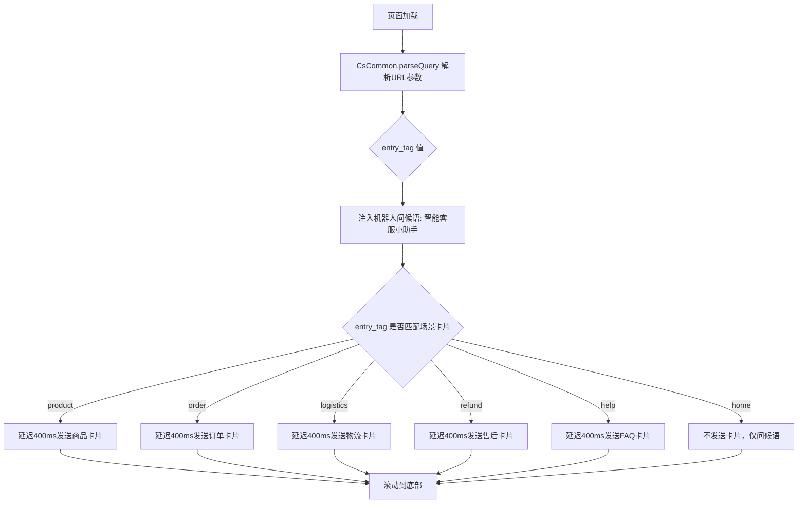
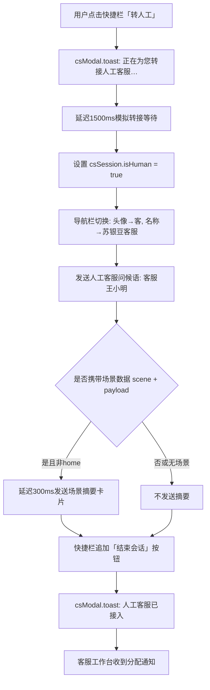
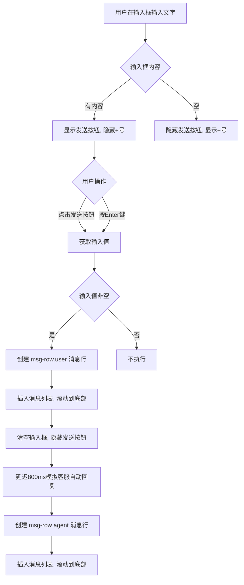
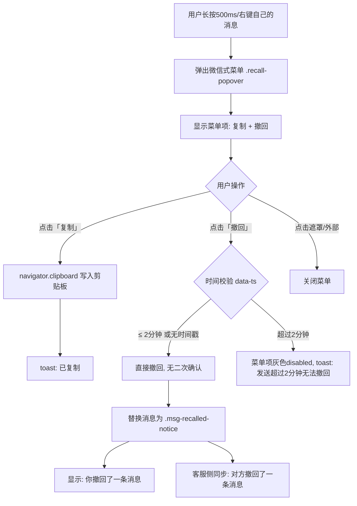
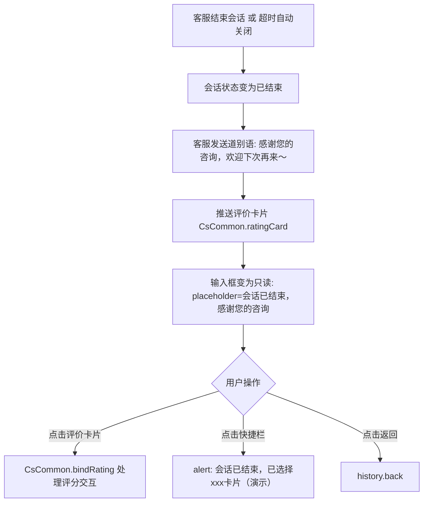
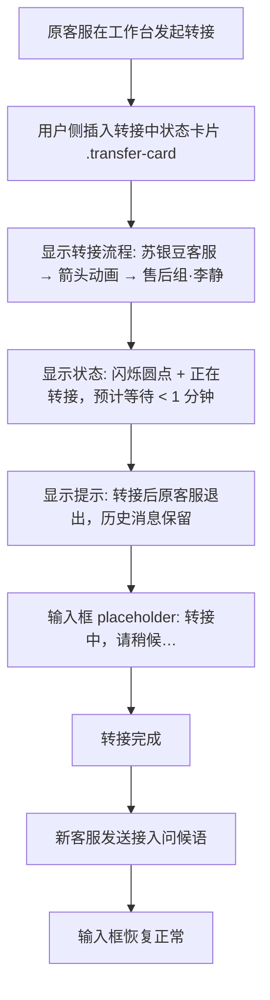
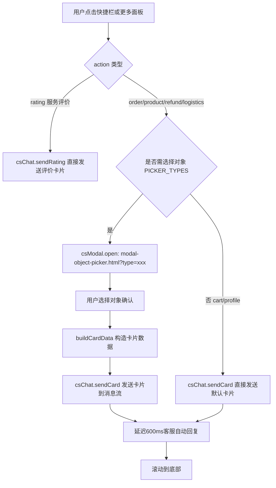
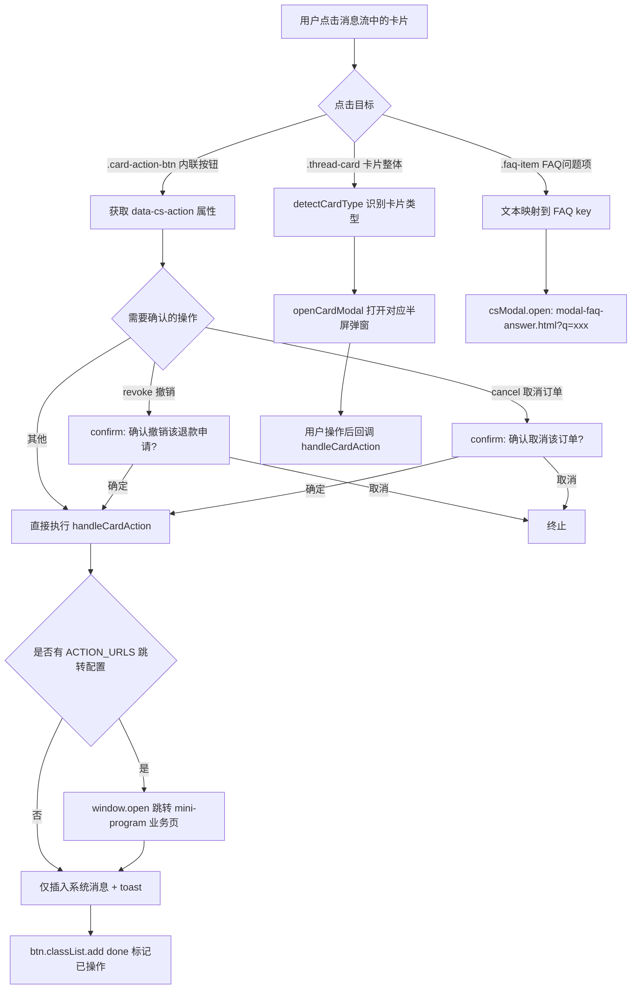

# 02-聊天主界面

> 页面组：`user-chat-basic.html`（入口）+ 5 子页面 | 版本：V1.0 | 2026-07-05
> 数据源：原型 HTML 逐功能提取
> 跨端 ADR：ADR-0003（转接）、ADR-0006（消息审核）、ADR-0009（挂起）

---

## 2.1 功能概述

聊天主界面是 CS 商城用户端客服系统的核心交互模块，用户在此与客服（智能客服或人工客服）进行实时消息沟通。系统覆盖 6 个交互场景：

| 子页面 | 文件 | 场景说明 |
|--------|------|----------|
| 基础消息交互 | `user-chat-basic.html` | 文本/图片/语音收发、转人工、卡片发送、撤回、场景化会话初始化 |
| 富媒体卡片样本 | `user-chat-cards.html` | 所有卡片类型及状态变体展示（订单6态/售后19态/商品/物流/FAQ/评价），用于核对视觉与交互一致性 |
| 输入工具栏 | `user-chat-input.html` | 7 项更多面板（相册/拍摄/订单/商品/电话客服/转人工/结束会话）、语音录制、消息发送 |
| 超时提示 | `user-chat-timeout.html` | 用户无响应超时提醒（15分钟）→ 自动关闭会话（30分钟）→ 用户回复可重置计时 |
| 会话关闭 | `user-chat-closed.html` | 会话结束后历史消息保留、评价卡片、重新咨询入口 |
| 会话转接 | `user-chat-transfer.html` | 转接中状态卡片（箭头动画）+ 新客服接入问候，历史消息保留 |

用户从任意业务页面（首页、商品详情、订单详情等）点击客服入口后，携带 `entry_tag` 场景参数跳转至 `user-chat-basic.html`，系统自动初始化对应场景的上下文（智能客服问候语 + 场景卡片）。在会话过程中，用户可发送文本/图片/语音消息，点击快捷栏或更多面板的"转人工"按钮将切换到人工客服，客服可在工作台发起转接或结束会话。

---

## 2.2 页面结构

### 2.2.1 通用布局（所有子页面共享）

页面承载于 375px 宽的 `.cs-phone` 移动端容器内，从上到下分为五个区域：

| 区域 | 选择器 | 说明 |
|------|--------|------|
| 状态栏 | `CsCommon.statusBar()` | 公共组件注入，模拟小程序顶部状态栏（时间、电量、信号） |
| 导航栏 | `.cs-nav-bar.chat-nav` | 左侧返回按钮 `.cs-back`、中间客服名称 `.nav-peer`（仅含 `.peer-info > .peer-name`，无头像）、右侧电话按钮 `.nav-action`、胶囊按钮 `CsCommon.capsule()` |
| 消息列表 | `.chat-messages#chatMessages` | flex:1 可滚动区域，隐藏滚动条，包含客服气泡、用户气泡、撤回提示、卡片消息、评价卡片（basic 页不再插入系统消息） |
| 快捷卡片条 | `.quick-cards-bar` | `CsCommon.quickCardsBar()` 公共组件注入，横向滚动，6个快捷入口（转人工、订单、售后、物流、购物车、服务评价） |
| 输入工具栏 | `.chat-input-area` | 语音图标 `#voiceIcon` + 文本输入框 `#msgInput` + 更多图标 `#moreIcon` + 发送按钮 `#sendBtn` |

```
┌─ .cs-phone (375px) ─────────────────┐
│ [statusBar]                          │
│ [<返回] [名称/状态] [电话] [···]      │
├──────────────────────────────────────┤
│ .chat-messages#chatMessages          │
│  ├ .msg-row > .msg-bubble-agent     │
│  ├ .msg-row.user > .msg-bubble-user │
│  ├ .msg-recalled-notice (撤回提示)   │
│  ├ .thread-card (富媒体卡片)         │
│  └ .msg-rating-card (评价卡片)      │
├──────────────────────────────────────┤
│ .quick-cards-bar (CsCommon注入)      │
├──────────────────────────────────────┤
│ .chat-input-area                     │
│  [🎤语音] [输入框] [+更多] [发送]     │
└──────────────────────────────────────┘
```

---

## 2.3 操作流程

### 2.3.1 场景化会话初始化（basic）

用户从业务页面携带 `entry_tag` 进入聊天页后，系统自动初始化会话上下文：



补充说明：
- basic 页不再插入"已为您接入苏银豆客服"系统消息，进入后直接显示机器人问候语
- 机器人问候语立即插入，场景卡片延迟 400ms 后插入，模拟真实加载节奏
- 机器人问候语携带发送者名称 `.msg-sender`，显示为"智能客服小助手"
- 场景卡片由 `CsCommon.cardHtml(type, data)` 生成，卡片数据从 URL 参数或默认值获取
- 各 entry_tag 对应的卡片类型详见 2.4.17 节映射表

### 2.3.2 转人工流程（basic）



补充说明：
- `transferToHuman(scene, payload)` 为全局函数，支持外部调用传入场景标识和关键数据
- 场景摘要格式：`【订单咨询】订单号 JS2026040888001（运输中）`
- 转人工后快捷栏追加的"结束会话"按钮样式为 `.quick-card-end`，点击弹出确认框后推送结束消息+评价卡片

### 2.3.3 用户消息发送流程



补充说明：
- 输入内容使用 `val.replace(/</g, '&lt;')` 做 XSS 防护
- 客服自动回复文案固定为"您好，您的问题已收到，稍后为您处理～"
- 消息时间戳取 `new Date().toTimeString().slice(0,5)` 格式化为 HH:MM

### 2.3.4 消息撤回流程



补充说明：
- 长按 500ms 触发菜单弹出，菜单定位在消息气泡右上方（空间不足时自动切换到下方）
- 菜单采用白色背景，横排布局（flex），"复制"和"撤回"左右排列，中间用1px灰色分隔线隔开
- 菜单包含"复制"和"撤回"两个选项（有文本时才显示"复制"）
- 超过 2 分钟撤回窗口时，"撤回"项显示为灰色不可点击（`.disabled`）
- 点击遮罩或菜单外部区域自动关闭菜单
- 菜单弹出动画：0.15s 缩放渐入（`scale(0.9)` → `scale(1)`）

### 2.3.5 超时状态机（timeout）

```mermaid
flowchart TD
    A[客服发送最后一条消息] --> B[开始计时 elapsed=0]
    B --> C[每秒 elapsed++]
    C --> D{elapsed 判断}
    D -->|< REMIND_AT 30s(演示)/15min(生产)| C
    D -->|≥ REMIND_AT 且未提醒| E[触发超时提醒]
    D -->|≥ CLOSE_AT 60s(演示)/30min(生产)| F[触发自动关闭]
    E --> G[state.reminded = true]
    G --> H[以客服身份发送超时提醒文案]
    H --> C
    F --> J[state.closed = true]
    J --> K[停止计时器]
    K --> L[以客服身份发送关闭提示]
    L --> N[禁用输入框: disabled + placeholder=会话已关闭]
    N --> O[推送服务评价卡片 CsCommon.ratingCard]
    O --> P[toast: 会话已自动关闭]
    D -->|用户回复| Q[onUserReply 重置]
    Q --> R[elapsed = 0, reminded = false]
    R --> C
```

补充说明：
- **阈值来源**：对齐 admin-auto-reply.html「会话超时设置」配置——用户静默超时 15 分钟（演示 30 秒）、自动关闭 30 分钟（演示 60 秒）。演示值为生产值的 1/30 缩放，方便快速验证
- 超时提醒文案：`您已长时间未回复，如需继续咨询请回复任意内容；会话将在 15 分钟后自动关闭。`
- 演示控制按钮 `#btnDemoTimeout` 和 `#btnDemoClose` 可手动触发超时/关闭流程，跳过倒计时等待

### 2.3.6 会话关闭流程（closed）



### 2.3.7 会话转接流程（transfer）



### 2.3.8 卡片发送流程（basic）



### 2.3.9 卡片点击交互流程（basic）



补充说明：
- 卡片类型检测按 `product > order > logistics > refund > faq` 顺序匹配 CSS class
- `ACTION_URLS` 映射了 11 个 action 到 mini-program 业务页面的跳转路径（详见 2.4.16）
- 购物车"咨询这些商品"（askAll）→ 弹商品选择器 `modal-object-picker.html?type=product`
- FAQ"相关问题"（viewFaq）→ 关闭当前弹窗后重新打开 `modal-faq-answer.html`

## 2.4 字段与交互

### 2.4.1 消息发送（basic / input / timeout / closed / transfer 通用）

| 字段名称 | 字段标识 | 字段类型 | 必填 | 数据类型 | 长度限制 | 默认值 | 校验规则 | 取值范围 | 来源 | 错误提示 |
|----------|----------|----------|------|----------|----------|--------|----------|----------|------|----------|
| 消息输入框 | msgInput | 文本输入 | 否 | String | 最长500字符 | 空 | 非空时发送按钮显示 | 任意文本 | 用户输入 | — |
| 发送按钮 | sendBtn | 按钮 | — | — | — | 隐藏 | 输入框有内容时显示 `.show` | — | 系统生成 | — |
| 更多按钮 | moreIcon | 按钮 | — | — | — | 显示 | 输入框无内容时显示，有内容时隐藏 | — | 系统生成 | — |
| 语音按钮 | voiceIcon | 按钮 | — | — | — | 显示 | 点击切换语音录制浮层 | — | 系统生成 | — |
| 消息内容 | msg_text | 文本 | 是 | String | 最长500字符 | — | 非空，XSS过滤 `<` → `&lt;` | 任意文本 | 用户输入 | — |
| 消息时间 | msg_time | 文本 | 否 | String | 5位 | — | 自动生成 | HH:MM 格式 | 系统生成 | — |
| 消息发送者 | msg_sender | 文本 | 否 | String | 最长20字符 | — | — | 客服 王小明 / 智能客服小助手 / 售后 李静 | 系统配置 | — |

### 2.4.2 更多面板功能项（basic: 4项 / input: 7项）

| 字段名称 | 字段标识 | 字段类型 | 必填 | 数据类型 | 长度限制 | 默认值 | 校验规则 | 取值范围 | 来源 | 错误提示 |
|----------|----------|----------|------|----------|----------|--------|----------|----------|------|----------|
| 相册 | album | 按钮 | — | — | — | — | 仅演示toast | — | 用户操作 | — |
| 拍照/拍摄 | camera | 按钮 | — | — | — | — | 仅演示toast | — | 用户操作 | — |
| 订单 | order | 按钮 | — | — | — | — | 弹对象选择器→发送订单卡片 | — | 用户操作 | — |
| 商品 | product | 按钮 | — | — | — | — | 弹对象选择器→发送商品卡片 | — | 用户操作 | — |
| 电话客服 | phone | 按钮 | — | — | — | — | 确认后拨打 400-888-8888 | — | 用户操作 | — |
| 转人工 | transfer | 按钮 | — | — | — | — | 触发 transferToHuman() | — | 用户操作 | — |
| 结束会话 | end | 按钮 | — | — | — | — | 确认后跳转 user-rating.html | — | 用户操作 | — |

### 2.4.3 快捷卡片条

| 字段名称 | 字段标识 | 字段类型 | 必填 | 数据类型 | 长度限制 | 默认值 | 校验规则 | 取值范围 | 来源 | 错误提示 |
|----------|----------|----------|------|----------|----------|--------|----------|----------|------|----------|
| 转人工 | transfer | 按钮 | — | — | — | 第一位 | 点击触发转人工流程 | — | 系统生成 | — |
| 发送订单 | order | 按钮 | — | — | — | — | 弹对象选择器→发送卡片 | — | 系统生成 | — |
| 发送售后 | refund | 按钮 | — | — | — | — | 弹对象选择器→发送卡片 | — | 系统生成 | — |
| 查看物流 | logistics | 按钮 | — | — | — | — | 弹对象选择器→发送卡片 | — | 系统生成 | — |
| 购物车 | cart | 按钮 | — | — | — | — | 直接发送购物车卡片 | — | 系统生成 | — |
| 服务评价 | rating | 按钮 | — | — | — | — | 直接发送评价卡片 | — | 系统生成 | — |
| 结束会话（转人工后追加） | end | 按钮 | — | — | — | 转人工后动态添加 | 确认后推送结束消息+评价卡片 | — | 系统生成 | — |

### 2.4.4 语音录制

| 字段名称 | 字段标识 | 字段类型 | 必填 | 数据类型 | 长度限制 | 默认值 | 校验规则 | 取值范围 | 来源 | 错误提示 |
|----------|----------|----------|------|----------|----------|--------|----------|----------|------|----------|
| 语音录制浮层 | voiceRecording | 浮层 | — | — | — | 隐藏 | 点击切换显示/隐藏 | — | 系统生成 | — |
| 录制计时器 | vrSec | 数值 | — | Number | — | 0 | 每秒递增 | 0-∞ | 系统生成 | — |
| 录制状态点 | vr-dot | 视觉 | — | — | — | — | 脉冲动画 vr-pulse 1s无限循环 | — | 系统生成 | — |

### 2.4.5 转人工交互（basic）

| 字段名称 | 字段标识 | 字段类型 | 必填 | 数据类型 | 长度限制 | 默认值 | 校验规则 | 取值范围 | 来源 | 错误提示 |
|----------|----------|----------|------|----------|----------|--------|----------|----------|------|----------|
| 是否人工 | csSession.isHuman | 布尔 | — | Boolean | — | false | — | true/false | 系统状态 | — |
| 转接场景 | csSession.scene | 文本 | 否 | String | 最长20字符 | null | — | order/product/logistics/aftersale/home | 调用方传入 | — |
| 场景数据 | csSession.payload | 对象 | 否 | Object | — | null | — | — | 调用方传入 | — |
| 导航栏名称 | navPeerName | 文本 | — | String | 最长20字符 | 苏银豆客服 | 全会话统一显示"苏银豆客服" | — | 系统切换 | — |
| 转接等待 | transfer_delay | 数值 | — | Number | — | 1500ms | 模拟转接等待时间 | — | 系统配置 | — |

### 2.4.6 消息撤回

| 字段名称 | 字段标识 | 字段类型 | 必填 | 数据类型 | 长度限制 | 默认值 | 校验规则 | 取值范围 | 来源 | 错误提示 |
|----------|----------|----------|------|----------|----------|--------|----------|----------|------|----------|
| 撤回窗口 | recall_window | 数值 | — | Number | — | 120秒 | 超过则撤回菜单项灰色不可点 | 0-120 | 系统配置 | 发送超过 2 分钟，无法撤回 |
| 长按触发时长 | press_duration | 数值 | — | Number | — | 500ms | 长按达到此时长弹出菜单 | — | 系统配置 | — |
| 撤回菜单 | recallPopover | 浮层 | — | — | — | 隐藏 | 长按/右键触发显示，点击遮罩关闭 | — | 系统生成 | — |
| 菜单遮罩 | recallPopoverMask | 浮层 | — | — | — | 隐藏 | 透明遮罩，点击关闭菜单 | — | 系统生成 | — |
| 复制菜单项 | recall-popover-item[data-action=copy] | 按钮 | — | — | — | 有文本时显示 | 点击复制消息文本到剪贴板 | — | 系统生成 | — |
| 撤回菜单项 | recall-popover-item[data-action=recall] | 按钮 | — | — | — | 红色#ee0a24 | 点击直接撤回，无二次确认；超时则灰色#c8c9cc disabled | — | 系统生成 | — |
| 菜单背景 | recall-popover bg | 视觉 | — | — | — | #fff白色 | 白底深字，横排flex布局，项间1px灰色分隔线 | — | 系统配置 | — |
| 菜单动画 | recallPopoverIn | 动画 | — | — | — | 0.15s | scale(0.9)→scale(1) 缩放渐入 | — | 系统配置 | — |
| 撤回提示-用户侧 | recall_notice_user | 文本 | — | String | — | — | — | "你撤回了一条消息" | 系统生成 | — |
| 撤回提示-客服侧 | recall_notice_agent | 文本 | — | String | — | — | — | "对方撤回了一条消息" | 系统生成 | — |
| 撤回图标 | recall_icon | 视觉 | — | SVG | — | — | 时钟图标 | — | 系统生成 | — |

### 2.4.7 超时状态机（timeout）

| 字段名称 | 字段标识 | 字段类型 | 必填 | 数据类型 | 长度限制 | 默认值 | 校验规则 | 取值范围 | 来源 | 错误提示 |
|----------|----------|----------|------|----------|----------|--------|----------|----------|------|----------|
| 经过秒数 | state.elapsed | 数值 | — | Number | — | 0 | 每秒递增 | 0-∞ | 系统计时 | — |
| 是否已提醒 | state.reminded | 布尔 | — | Boolean | — | false | 到达REMIND_AT时设为true | true/false | 系统状态 | — |
| 是否已关闭 | state.closed | 布尔 | — | Boolean | — | false | 到达CLOSE_AT时设为true | true/false | 系统状态 | — |
| 提醒阈值 | REMIND_AT | 数值 | — | Number | — | 30秒(演示) | 实际15分钟=900秒 | 正整数 | 系统配置 | — |
| 关闭阈值 | CLOSE_AT | 数值 | — | Number | — | 60秒(演示) | 实际30分钟=1800秒 | 正整数 | 系统配置 | — |
| 超时提醒文案 | REMIND_TEXT | 文本 | — | String | — | 固定文案 | — | — | 系统配置 | — |
| 输入框禁用 | msgInput.disabled | 布尔 | — | Boolean | — | false | 关闭后设为true | true/false | 系统状态 | — |

### 2.4.8 转接卡片（transfer）

| 字段名称 | 字段标识 | 字段类型 | 必填 | 数据类型 | 长度限制 | 默认值 | 校验规则 | 取值范围 | 来源 | 错误提示 |
|----------|----------|----------|------|----------|----------|--------|----------|----------|------|----------|
| 转接卡片 | transfer-card | 容器 | — | — | — | — | CSS动画：箭头脉冲 tf-pulse 1.4s | — | 系统生成 | — |
| 原客服头像 | tf-avatar | 视觉 | — | — | — | 客户服头像 | 蓝紫渐变背景 | — | 系统生成 | — |
| 原客服名称 | tf-name | 文本 | — | String | — | 苏银豆客服 | — | — | 系统配置 | — |
| 原客服角色 | tf-role | 文本 | — | String | — | 原客服 | — | — | 系统配置 | — |
| 目标客服头像 | tf-avatar.target | 视觉 | — | — | — | 蓝色渐变背景 | — | — | 系统生成 | — |
| 目标客服名称 | tf-name | 文本 | — | String | — | 售后组·李静 | — | — | 系统配置 | — |
| 目标客服角色 | tf-role | 文本 | — | String | — | 目标客服 | — | — | 系统配置 | — |
| 转接状态 | transfer-status | 文本 | — | String | — | 闪烁圆点+文字 | 圆点动画 blink 1s无限循环 | — | 系统生成 | — |
| 转接提示 | transfer-tip | 文本 | — | String | — | 固定文案 | — | — | 系统配置 | — |
| 转接中输入框 | msgInput placeholder | 文本 | — | String | — | 转接中，请稍候… | — | — | 系统配置 | — |

### 2.4.9 历史消息加载（basic）

> 已移除：basic 页不再支持历史消息加载，相关字段（historyLoader / loading / allLoaded / batch / MAX_BATCH / load_delay / scroll_trigger）全部废弃。

### 2.4.10 客服自动回复（basic）

| 字段名称 | 字段标识 | 字段类型 | 必填 | 数据类型 | 长度限制 | 默认值 | 校验规则 | 取值范围 | 来源 | 错误提示 |
|----------|----------|----------|------|----------|----------|--------|----------|----------|------|----------|
| 自动回复延迟 | auto_reply_delay | 数值 | — | Number | — | 800ms | 用户发送消息后延迟 | — | 系统配置 | — |
| 自动回复文案 | auto_reply_text | 文本 | — | String | — | 固定文案 | — | — | 系统配置 | — |

### 2.4.11 卡片发送API（csChat 全局对象）

| 字段名称 | 字段标识 | 字段类型 | 必填 | 数据类型 | 长度限制 | 默认值 | 校验规则 | 取值范围 | 来源 | 错误提示 |
|----------|----------|----------|------|----------|----------|--------|----------|----------|------|----------|
| 发送卡片 | csChat.sendCard | 方法 | — | Function | — | — | 参数: type, who, data | — | 系统API | — |
| 发送文本 | csChat.sendText | 方法 | — | Function | — | — | 参数: text, who | — | 系统API | — |
| 发送系统消息 | csChat.sendSystem | 方法 | — | Function | — | — | 参数: text, withAction | — | 系统API | — |
| 发送评价卡片 | csChat.sendRating | 方法 | — | Function | — | — | 无参数 | — | 系统API | — |
| 卡片默认数据 | csChat.defaults | 对象 | — | Object | — | CARD_DEFAULTS | — | — | 系统配置 | — |

### 2.4.12 消息类型定义

| 消息类型 | CSS类名 | 发送者 | 气泡样式 | 说明 |
|----------|---------|--------|----------|------|
| 系统消息 | `.msg-system` | 系统 | 灰底白字居中 | 场景接入、会话状态变更（注：接入/超时/结束/转接的具体系统消息条已移除，由对应客服气泡/道别语体现，`.msg-system` 基础样式保留备用） |
| 用户文本 | `.msg-row.user` > `.msg-bubble-user` | 用户 | 绿底(#95ec69)右对齐 | 用户发送的文本消息 |
| 客服文本 | `.msg-row` > `.msg-bubble-agent` | 客服 | 白底灰边左对齐 | 客服发送的文本消息 |
| 用户图片 | `.msg-row.user` > `.msg-image` | 用户 | 图片占位 | 用户发送的图片消息 |
| 用户语音 | `.msg-row.user` > `.msg-voice` | 用户 | 白底声波动画 | 用户发送的语音消息 |
| 撤回提示 | `.msg-recalled-notice` | 系统 | 灰色居中+时钟图标 | 消息撤回通知 |
| 卡片消息 | `.thread-card` | 客服/用户 | 白底卡片 | 由 CsCommon.cardHtml() 生成 |
| 评价卡片 | `.msg-rating-card` | 客服 | 白底评价卡片 | 由 CsCommon.ratingCard() 生成 |
| 转接卡片 | `.transfer-card` | 系统 | 白底流程卡片 | 自定义HTML，非公共组件 |

### 2.4.13 消息气泡换行规则

消息气泡在 375px 移动端屏幕下的文本换行规范：

| 字段名称 | 字段标识 | 字段类型 | 必填 | 数据类型 | 长度限制 | 默认值 | 校验规则 | 取值范围 | 来源 | 错误提示 |
|----------|----------|----------|------|----------|----------|--------|----------|----------|------|----------|
| 气泡最大宽度 | msg_bubble_max_width | 样式 | — | Number | — | 252px | 用户/客服气泡统一 | — | CSS变量 `--chat-card-width` | — |
| 气泡内边距 | msg_bubble_padding | 样式 | — | String | — | 9px 14px | 上下9px 左右14px | — | CSS | — |
| 字号 | msg_bubble_font_size | 样式 | — | Number | — | 15px | `--cs-font-size-md` | — | CSS | — |
| 行高 | msg_bubble_line_height | 样式 | — | Number | — | 1.6 | 中文行高1.6倍字号，保证多行可读性 | — | CSS | — |
| 换行模式 | msg_bubble_wrap | 样式 | — | — | — | break-word | `word-wrap`+`word-break`+`overflow-wrap` 三重保险 | — | CSS | — |
| 空白处理 | msg_bubble_white_space | 样式 | — | — | — | pre-wrap | 保留用户输入的换行和空格 | — | CSS | — |
| 中文字数/行 | cn_chars_per_line | 计算 | — | Number | — | ≈15字 | 252px-28px=224px内宽 ÷ 15px/字 | — | 系统计算 | — |
| 英文字数/行 | en_chars_per_line | 计算 | — | Number | — | ≈30字符 | 224px ÷ ~7.5px/字符 | — | 系统计算 | — |
| 最大字符数 | msg_max_length | 限制 | 是 | Number | 500 | 500 | 超出截断并提示 | 0-500 | 系统配置 | 消息不能超过500字符 |
| 长链接处理 | long_url_wrap | 样式 | — | — | — | — | 长URL自动折行不溢出 | — | `overflow-wrap: break-word` | — |
| 手动换行 | manual_line_break | 交互 | — | — | — | — | 用户输入 `\n` 保留为换行 | — | `white-space: pre-wrap` | — |

换行规则说明：
1. **气泡宽度**：用户气泡和客服气泡统一最大宽度 252px（`--chat-card-width`），不再使用百分比
2. **自动换行**：中文满约15字自动换行，英文满约30字符自动换行
3. **长词处理**：长URL、长英文单词通过 `overflow-wrap: break-word` 在词内折行，不溢出气泡
4. **手动换行**：用户在输入框中按回车产生的换行符 `\n` 通过 `white-space: pre-wrap` 保留显示
5. **行间距**：行高 1.6 倍（15px × 1.6 = 24px），保证多行消息的可读性
6. **消息上限**：单条消息最长 500 字符，超出时截断并提示"消息不能超过500字符"

### 2.4.13 富媒体卡片类型与状态

| 卡片类型 | CSS类 | 状态数 | 状态列表 |
|----------|-------|:-----:|----------|
| 订单卡片 | `.thread-card.order` | 6 | 待发货 / 运输中 / 已签收 / 售后中 / 已完成 / 已取消 |
| 仅退款 | `.thread-card.refund` | 5 | 待商家审核 / 待退款 / 完成 / 申请已拒绝 / 已取消 |
| 退货退款 | `.thread-card.refund` | 7 | 待商家审核 / 待寄回商品 / 待商家收货 / 待退款 / 完成 / 申请已拒绝 / 已取消 |
| 换货 | `.thread-card.refund` | 7 | 待商家审核 / 待寄回商品 / 待商家收货 / 待商家重新发货 / 完成 / 申请已拒绝 / 已取消 |
| 商品卡片 | `.thread-card.product` | 1 | 在售 |
| 物流卡片 | `.thread-card.logistics` | 2 | 单包裹 / 多包裹 |
| FAQ卡片 | `.thread-card.faq` | 1 | 猜你想问（含"换一换"） |
| 评价卡片 | `.msg-rating-card` | 2 | 未提交 / 已提交(.done) |

### 2.4.15 卡片状态色

| Class | 颜色 | 典型场景 |
|-------|------|----------|
| `.s-warn` | 橙 | 待发货、运输中、审核中、推荐 |
| `.s-done` | 绿 | 已签收、已完成、在售 |
| `.s-danger` | 红 | 售后中、已退款、已取消 |

> 三色系统与客服工作台完全一致，无蓝/灰色状态。

### 2.4.16 卡片操作按钮跳转映射（cs-common.js · ACTION_URLS）

富媒体卡片底部按钮点击后跳转至 mini-program 对应业务页面。以下为原型中实际定义的 13 个 action 及其对应按钮：

| action | 按钮文字 | 所属卡片 | 跳转目标 | 备注 |
|--------|---------|----------|----------|------|
| `viewDetail_product` | 查看商品 | 商品卡片(product) | `product_detail.html` | by product_id |
| `viewDetail_order` | 查看详情 | 订单卡片(order) | `order_detail.html` | by order_id |
| `aftersale` | 申请售后 | 订单卡片(order) | `apply_refund.html` | 待发货/运输中/已签收状态显示 |
| `editAddress` | 修改地址 | 订单卡片(order) | `address_edit.html` | 仅待发货状态显示 |
| `trackLogistics` | 查看物流 | 订单卡片(order) | `logistics.html` | 运输中/已签收状态显示 |
| `viewProgress` | 查看进度 / 查看售后进度 | 订单卡片(order) / 售后卡片(refund) | `refund_detail.html` | 售后中状态显示 |
| `supplement` | 补充说明 | 售后卡片(refund) | `refund_detail.html` | 仅待商家审核状态显示 |
| `revoke` | 撤销申请 | 售后卡片(refund) | `refund_detail.html` | 仅待商家审核状态显示 |
| `fillLogistics` | 填写物流 | 售后卡片(refund) | `refund_detail.html` | 商家已审核/待寄回商品状态显示 |
| `viewDetail_logistics` | 查看物流详情 | 物流卡片(logistics) | `logistics.html` | by tracking_no |
| `viewFaq` | FAQ 问题条目点击 | FAQ 卡片(faq) | — | 点击→发用户气泡(问题文本)→延迟500ms发客服气泡(答案)，不跳转页面、不弹窗（详见 06-FAQ机器人客服.md §6.7） |

补充说明：
- 按钮由 `cardHtml(type, p)` 中的 `btn(text, action)` 函数生成，添加到 `.card-actions` 容器
- 跳转基础路径：`MINI_BASE = 'mini-program/pages/'`
- 按钮显示条件由卡片类型和状态决定（如"修改地址"仅在订单待发货时显示，"撤销申请"仅在售后待商家审核时显示）
- 按钮的 `data-cs-action` 属性用于事件委托，`onclick` 直接跳转（原型阶段不走路由）

### 2.4.17 场景化会话初始化（entry_tag → 场景卡片映射）

用户从不同业务页面（详见 01-客服入口.md）携带 `entry_tag` 进入 `user-chat-basic.html` 后，系统根据下表自动推送对应场景卡片（延迟 400ms 插入）。`home` 与 `floating` 入口仅展示机器人问候语，不推送任何卡片。

| entry_tag | 来源业务页面 | 卡片类型 | 卡片数据源 | 客服自动跟进文案 |
|-----------|------------|----------|------------|----------------|
| `home` | 首页 | 无卡片 | — | — |
| `floating` | 全站悬浮按钮 | 无卡片（同 home） | — | — |
| `product` | 商品详情页 | product | URL参数: product_id / product_name / price | 好的，您咨询的是这款商品，请问有什么可以帮您？ |
| `order` | 订单详情页 | order | URL参数: order_id / order_status / amount | 好的，已收到您的订单信息，请问这笔订单有什么问题？ |
| `logistics` | 物流详情页 | logistics | URL参数: tracking_no / carrier | 好的，已为您查询物流，包裹正在运输中。 |
| `refund` | 退款/售后页 | refund | URL参数: refund_id / refund_type | 好的，已收到您的退款信息，我来为您查看进度。 |
| `help` | 帮助中心 | faq | 无额外数据（猜你想问 + "换一换"） | — |

补充说明：
- 卡片由 `CsCommon.cardHtml(type, data)` 生成，数据未在 URL 中携带时使用 Mock 默认值
- 转人工后若 `csSession.scene` 非空且非 home，会发送场景摘要卡片（格式：`【场景标签】关键信息`），便于人工客服快速定位上下文
- `profile`（个人中心）、`cart`（购物车）入口未在场景化初始化中映射，由用户在会话中主动点击快捷栏"购物车"按钮触发卡片发送

---

## 2.5 业务规则

| 规则编号 | 规则描述 |
|----------|----------|
| RULE-CHAT-001 | 消息发送时，输入内容中的 `<` 字符替换为 `&lt;` 防止 XSS 注入 |
| RULE-CHAT-002 | 输入框有内容时，发送按钮 `.send-btn` 添加 `.show` 类显示，同时隐藏更多按钮 `#moreIcon`；输入框为空时恢复 |
| RULE-CHAT-003 | 按 Enter 键等同于点击发送按钮，需 `e.preventDefault()` 阻止默认换行 |
| RULE-CHAT-004 | 用户发送消息后 800ms 自动模拟客服回复（仅 basic 页面），回复文案固定为"您好，您的问题已收到，稍后为您处理～" |
| RULE-CHAT-005 | 消息撤回窗口为 2 分钟（120 秒）。长按消息 500ms 或右键触发微信式弹出菜单 `.recall-popover`（深色背景，含"复制"和"撤回"两个选项）。点"撤回"直接执行，无二次确认；超过 2 分钟则"撤回"项灰色不可点（`.disabled`），点击时 toast 提示"发送超过 2 分钟，无法撤回"。撤回后用户侧显示"你撤回了一条消息"，客服侧同步显示"对方撤回了一条消息" |
| RULE-CHAT-006 | 消息撤回通过 `CsCommon.bindRecall(box)` 绑定长按/右键事件。菜单定位在消息气泡右上方（空间不足时自动切换到下方），点击遮罩或菜单外部关闭。菜单弹出动画 0.15s 缩放渐入。撤回后原消息气泡替换为 `.msg-recalled-notice` 元素 |
| RULE-CHAT-007 | 所有客服消息（非 .user 的 .msg-row）通过 MutationObserver 自动补 `.msg-sender` 发送者名称，默认显示"客服 王小明" |
| RULE-CHAT-008 | 转人工流程：toast 提示 → 1500ms 等待 → 切换导航栏（头像→客，名称→苏银豆客服）→ 插入系统消息 → 人工问候语 → 场景摘要卡片（如有）→ 快捷栏追加"结束会话"按钮 |
| RULE-CHAT-009 | 转人工后快捷栏追加的"结束会话"按钮，点击弹出确认框，确认后推送结束消息（sendSystem + sendText + sendRating） |
| RULE-CHAT-010 | 超时状态机：REMIND_AT=30秒触发提醒（演示），CLOSE_AT=60秒自动关闭（演示）；用户回复任意消息重置 elapsed=0 |
| RULE-CHAT-011 | 超时关闭后：输入框 disabled=true，placeholder="会话已关闭"，推送评价卡片；用户可通过演示控制按钮手动触发 |
| RULE-CHAT-012 | 会话关闭后，关闭提示条 `.closed-banner` 显示灰色"会话已结束"状态，历史消息保留可滚动查看 |
| RULE-CHAT-013 | 转接卡片中的箭头使用 `tf-pulse` 动画（1.4s ease-in-out 无限循环），状态圆点使用 `blink` 动画（1s 无限循环）|
| RULE-CHAT-014 | 转接中输入框 placeholder 显示"转接中，请稍候…"，转接完成后恢复为正常输入状态 |
| RULE-CHAT-015 | 卡片发送需区分类型：order/product/refund/logistics 需先弹对象选择器 `modal-object-picker.html`，cart/profile 直接发送默认卡片，rating 直接调用 `csChat.sendRating()` |
| RULE-CHAT-016 | 卡片发送后延迟 600ms 客服自动回复对应文案（订单→"好的，已收到您的订单信息…"，商品→"好的，您咨询的是这款商品…"，物流→"好的，已为您查询物流…"，退款→"好的，已收到您的退款信息…"） |
| RULE-CHAT-017 | 卡片内联按钮 `.card-action-btn` 点击后添加 `.done` 类防止重复触发；需确认的操作（撤销/取消订单）弹出 confirm 确认框 |
| RULE-CHAT-018 | 点击 `.thread-card` 整体（非按钮区域）时，根据卡片类型打开对应半屏 modal：order→modal-order-actions.html，refund→modal-refund-actions.html，product→modal-product-preview.html，logistics→modal-logistics-preview.html |
| RULE-CHAT-019 | （已废弃）历史消息加载功能已从 basic 页移除，相关代码、字段和样式全部删除 |
| RULE-CHAT-020 | （已废弃）历史消息加载相关滚动位置保持逻辑已移除 |
| RULE-CHAT-021 | 场景化会话初始化：basic 页进入后**不再插入"已为您接入苏银豆客服"系统消息**，直接显示机器人问候语（带"智能客服小助手"发送者名称），延迟 400ms 后插入场景卡片（详见 2.4.17 映射表） |
| RULE-CHAT-022 | 语音录制：点击语音图标切换浮层显示/隐藏，显示时启动每秒递增计时器，隐藏时停止并 toast 显示录音时长 |
| RULE-CHAT-023 | 更多面板 `.more-panel` 点击功能项后自动收起面板（`.classList.remove('show')`） |
| RULE-CHAT-024 | 卡片操作需确认的类型：revoke（撤销退款）提示"确认撤销该退款申请？撤销后无法恢复"，cancel（取消订单）提示"确认取消该订单？取消后关联的退款申请将自动撤销" |
| RULE-CHAT-025 | 取消订单后联动：同卡片内的退款按钮同步添加 `.done` 类标记为不可操作 |
| RULE-CHAT-026 | 评价卡片通过 `CsCommon.bindRating(row)` 绑定交互，使用 `card.dataset.bound === '1'` 防止重复绑定 |
| RULE-CHAT-027 | 电话拨打（顶栏电话按钮和更多面板电话客服）：弹出 confirm 确认框"是否拨打客服热线 400-888-8888？"，确认后 toast "正在拨打 400-888-8888…" |
| RULE-CHAT-028 | user-chat-cards.html 为纯样本展示页面，不包含实际聊天交互，所有卡片由 `CsCommon.cardHtml()` 生成，与 basic 页 1:1 同步 |
| RULE-CHAT-029 | **命名规范**：所有用户端聊天页面顶栏 `.nav-peer` 仅含 `.peer-info`（无头像），`.peer-name` 统一显示"苏银豆客服"（取自商城名称"苏银豆商城"），不区分机器人/人工/离线/转接等会话状态。basic 页不再插入系统消息；其他静态子页面（queue/offline/faq/input/rating/timeout/closed/transfer）保留"已为您接入苏银豆客服"系统消息作为分界条。消息内发送者名称（`.msg-sender`）保留具体身份（如"智能客服小助手"、"客服 王小明"） |
| RULE-CHAT-030 | **欢迎语统一**（来源：admin-auto-reply.html 配置）：① 机器人欢迎语——"您好，我是 AI 助手，可以为您查询订单、解答常见问题。请问有什么可以帮您？转人工请回复"转人工"。" ② 客服欢迎语——"您好，欢迎联系苏银豆商城客服中心！我是您的专属客服，请问有什么可以帮您？" ③ 转接欢迎语——"您好，我是客服 {客服昵称}，您的会话已转接给我，将继续为您服务，请问有什么可以帮您？" ④ 离线语——"当前无客服在线（工作时间 9:00-21:00），您可以留下问题和联系方式，客服上线后将第一时间为您处理。" 所有用户端页面（basic/queue/offline/faq/input/rating/timeout/closed/transfer）必须使用上述文案，禁止自定义 |
| RULE-CHAT-031 | **消息气泡换行规则**：用户/客服气泡最大宽度统一 252px（`--chat-card-width`），行高 1.6 倍（15px × 1.6 = 24px）。中文约 15 字/行自动换行，英文约 30 字符/行。`word-wrap`+`word-break`+`overflow-wrap` 三重 break-word 防溢出。`white-space: pre-wrap` 保留用户手动换行。单条消息上限 500 字符 |
| RULE-CHAT-032 | **卡片消息不支持撤回**：撤回菜单（`.recall-popover`）仅挂在文本气泡（`.msg-bubble-user` / `.msg-bubble-agent`）上，富媒体卡片（`.thread-card` 订单/商品/物流/退款/FAQ 卡片、`.msg-rating-card` 评价卡片、`.transfer-card` 转接卡片）长按不触发撤回菜单。原因：① 卡片发送即触发后端动作（如查询物流、记录退款），撤回卡片易造成"消息没了但客服已处理"的歧义；② 与微信、淘宝、京东客服等行业惯例一致；③ 避免用户误以为"撤回卡片=取消订单/退款" |
| RULE-CHAT-033 | **头像圆形化**：所有用户端页面消息头像 `.msg-avatar`（34×34px）统一使用 `border-radius: 50%` 圆形样式，agent 渐变蓝紫、user 渐变绿。转接卡片头像 `.tf-avatar`（40×40px）、评价 modal 头像 `.agent-avatar`（36×36px）均为圆形 |
| RULE-CHAT-034 | **客服撤回 → 用户端展示**（ADR-0006 双向可见）：客服在工作台撤回消息后，用户端该条客服消息行替换为居中灰条提示「客服撤回了一条消息」。① **触发**：客服端执行撤回 → 后端推送 recall 事件 → 用户端调用 `CsCommon.renderAgentRecalled(row)` 渲染；② **展示形式**：复用 `.msg-recalled-notice` 居中灰条样式（与时钟图标 + 灰色文案，与用户自己撤回的提示同款），文案改主语为「客服撤回了一条消息」；③ **不保留原文**：用户端不显示被撤回的气泡内容，不允许重新查看原文（符合微信/淘宝惯例，撤回即对用户不可见）；④ **留痕在后端**：前端仅显示提示，原文由后端保留（PRD 07 §10.2）；⑤ **时间窗仅约束操作方**：2 分钟内可撤回是客服端的限制（RULE-CHAT-006），用户端收到 recall 事件即展示提示，不受时间窗影响 |

---

## 2.6 页面跳转

**入口**：
- 任意业务页面客服入口点击 → `user-chat-basic.html?entry_tag=xxx`（携带场景参数）
- 全站悬浮按钮 → `user-chat-basic.html?entry_tag=floating`
- 原型首页 `index.html` → 点击对应入口链接
- 卡片样本页 → 通过 `user-chat-cards.html` 直接访问

**出口**：

| 触发 | 目标 |
|------|------|
| 返回按钮 | `history.back()` |
| 转人工 | 当前页切换状态（不跳转） |
| 更多面板「结束会话」 | `user-rating.html`（input 页面，延迟 800ms） |
| 卡片操作按钮 | `mini-program/pages/{page}.html`（见 2.4.16 ACTION_URLS 映射表） |
| 卡片整体点击 | `modals/modal-{type}.html`（半屏弹窗） |
| 快捷栏「服务评价」 | 当前页内嵌评价卡片 |
| 超时关闭后「重新咨询」 | `user-chat-basic.html`（timeout 页面） |
| 会话关闭后返回 | `history.back()` |
| 卡片样本页返回 | `javascript:history.back()` |