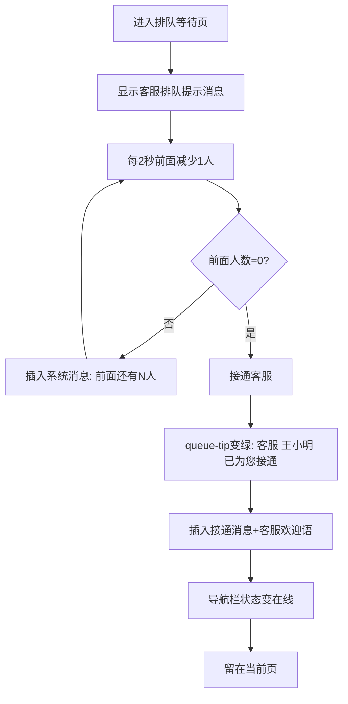

# 3.1 人工客服 — 排队等待

本模块包含排队等待页面，在客服忙碌时为用户提供排队提示和等待进度，支持自动接通。

## 3.1 排队等待（user-queue.html）

### 3.1.1 功能概述

排队等待页面在客服忙碌时展示，告知用户已进入排队队列。页面无排队提示条常驻显示（.queue-banner CSS 存在但 HTML 未渲染；.queue-tip 元素初始 display:none，排队期间不显示），消息区展示系统排队消息与客服排队提示文案（不含排队人数与预计等待时间），底部输入区可用（含公共快捷卡片入口条），用户可正常输入。排队递减后自动接通客服，接通后仅更新当前页面 UI，不跳转。

### 3.1.2 页面结构

页面采用移动端375px布局，从上到下分为四个区域：小程序状态栏、导航栏（含客服信息）、消息列表、底部输入区。

| 区域 | 说明 |
|------|------|
| 小程序状态栏 | 时间+WiFi/电量图标 |
| 导航栏 | 返回按钮 + 客服头像("客",蓝色渐变)+名称"在线客服"+peer-status"排队中"初始 display:none(排队期间不显示) + 微信胶囊 |
| 排队提示条 | 无（.queue-banner CSS 定义但 HTML 未渲染；.queue-tip 元素初始 display:none，排队期间不常驻显示） |
| 消息列表 | 系统消息"— 已为您接入在线客服 —" + 客服排队提示消息"您好，当前咨询人数较多，已为您进入排队队列。客服上线后将自动为您接通，请耐心等待。" + 排队进度系统消息"您前面还有 N 位用户" + 接通后系统消息"— 客服 王小明 已为您服务 —" + 客服欢迎语"您好，我是客服王小明，很高兴为您服务！请问有什么可以帮您？" |
| 底部输入区 | 公共快捷卡片入口条(CsCommon.quickCardsBar 6 按钮：转人工/发送订单/发送售后/查看物流/购物车/发送服务评价) + 输入区(54px 灰色背景)：语音按钮 + 输入框(placeholder"请输入消息...",可用未禁用) + 更多(+)按钮 + 发送按钮 |

### 3.1.3 操作流程

预计等待时间每秒递减1秒，前面人数每2秒递减1人（模拟前面用户被接通）。接通后 queue-tip 文字变为"客服 王小明 已为您接通"并切绿色样式，导航栏 peer-status 显示"在线"（绿色），输入区保持可用，不跳转页面。

### 3.1.4 字段与交互

| 字段名称 | 字段标识 | 字段类型 | 必填 | 数据类型 | 长度限制 | 默认值 | 校验规则 | 取值范围 | 来源 | 错误提示 |
|----------|----------|----------|------|----------|----------|--------|----------|----------|------|----------|
| 前面人数 | ahead_number | 展示文本 | - | Number | - | 3 | - | ≥0 | 系统计算 | - |
| 预计等待时间 | eta_time | 展示文本 | - | String | 5位(MM:SS) | 02:30 | mm:ss格式 | - | 系统计算 | - |
| 排队提示 | queue_tip | 文本提示 | - | - | - | 隐藏 | 初始display:none，接通后显示"客服 王小明 已为您接通" | - | 系统状态 | - |
| 消息输入框 | queue_input | 文本输入 | - | - | - | 可用 | placeholder"请输入消息..."，排队期间可用未禁用 | - | - | - |
| 快捷卡片入口条 | quick_cards_bar | 公共组件 | - | - | - | - | CsCommon.quickCardsBar 6按钮转人工首位，点击弹演示提示 | - | - | - |

### 3.1.5 业务规则

| 规则编号 | 规则描述 |
|----------|----------|
| RULE-3.1-QUEUE-001 | 排队期间输入框可用，placeholder显示"请输入消息..."，无禁用态 |
| RULE-3.1-QUEUE-002 | 前面人数每2秒递减1人，预计等待时间每秒递减1秒 |
| RULE-3.1-QUEUE-003 | 前面人数归零时自动接通客服：queue-tip 变绿显示"客服 王小明 已为您接通"、导航栏 peer-status 显示"在线"、插入接通消息、输入区保持可用 |
| RULE-3.1-QUEUE-004 | 接通后仅更新当前页 UI，不跳转聊天页 |
| RULE-3.1-QUEUE-005 | 排队期间无排队提示条常驻显示（.queue-banner CSS 存在但 HTML 未渲染；.queue-tip 初始 display:none） |
| RULE-3.1-QUEUE-006 | 接通后插入客服欢迎语消息"您好，我是客服王小明，很高兴为您服务！请问有什么可以帮您？" |
| RULE-3.1-QUEUE-007 | 底部使用公共快捷卡片入口条（CsCommon.quickCardsBar），6 按钮：转人工/发送订单/发送售后/查看物流/购物车/发送服务评价，点击弹演示提示 |
| RULE-3.1-QUEUE-008 | Toast 组件（.cs-toast）与 showToast() 已定义但当前流程未调用，无"正在为您接通客服..."提示 |

### 3.1.6 页面跳转

**入口**：
- 咨询入口选择在线咨询（客服忙碌时）

**出口**：
- 排队接通 → 留在当前页（user-queue.html），仅更新 UI
- 点击返回 → 来源页面
