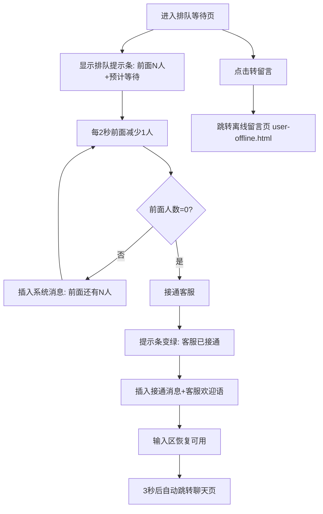

# 3.1 人工客服 — 排队等待

本模块包含排队等待页面，在客服忙碌时为用户提供排队提示和等待进度，支持转留言和自动接通。

## 3.1 排队等待（user-queue.html）

### 3.1.1 功能概述

排队等待页面在客服忙碌时展示，告知用户当前排队位置和预计等待时间。页面顶部显示排队提示条（前面人数+预计等待），消息区展示系统排队消息，底部输入区在排队期间禁用但提供"转留言"按钮。排队递减后自动接通客服并跳转聊天页。

### 3.1.2 页面结构

页面采用移动端375px布局，从上到下分为五个区域：小程序状态栏、导航栏（含客服状态）、排队提示条、消息列表、底部输入区。

| 区域 | 说明 |
|------|------|
| 小程序状态栏 | 时间+WiFi/电量图标 |
| 导航栏 | 返回按钮 + 客服头像("客")+名称"在线客服"+状态"排队中"(橙色) + 微信胶囊 |
| 排队提示条 | 36px高度，黄底(#fff7e6)，显示：闪烁圆点(橙色) + "排队中 · 前面还有 N 人 · 预计 MM:SS" |
| 消息列表 | 系统消息"您已进入排队队列" + 客服排队提示消息"您好，当前咨询人数较多，已为您进入排队队列。您前面还有 N 位用户，预计等待 MM:SS，客服上线后将自动为您接通，请耐心等待。" + 排队进度系统消息 + 接通后客服欢迎语"您好，我是客服王小明，很高兴为您服务！请问有什么可以帮您？" |
| 底部输入区 | 56px高度，灰色背景，输入框禁用(placeholder"排队中，暂无法发送消息") + "转留言"按钮 |

### 3.1.3 操作流程

预计等待时间每秒递减1秒，前面人数每2秒递减1人（模拟前面用户被接通）。接通后提示条变为绿色背景+绿色圆点，导航栏状态变为"在线"。

### 3.1.4 字段与交互

| 字段名称 | 字段标识 | 字段类型 | 必填 | 数据类型 | 长度限制 | 默认值 | 校验规则 | 取值范围 | 来源 | 错误提示 |
|----------|----------|----------|------|----------|----------|--------|----------|----------|------|----------|
| 前面人数 | ahead_number | 展示文本 | - | Number | - | 3 | - | ≥0 | 系统计算 | - |
| 预计等待时间 | eta_time | 展示文本 | - | String | 5位(MM:SS) | 02:30 | mm:ss格式 | - | 系统计算 | - |
| 排队提示条 | queue_banner | 状态条 | - | - | - | 排队中 | - | 排队中/已接通 | 系统状态 | - |
| 消息输入框 | queue_input | 文本输入 | - | - | - | 禁用 | 排队期间禁用 | - | - | - |
| 转留言按钮 | btn_leave_msg | 按钮 | - | - | - | - | - | - | - | - |

### 3.1.5 业务规则

| 规则编号 | 规则描述 |
|----------|----------|
| RULE-3.1-QUEUE-001 | 排队期间输入框禁用，placeholder显示"排队中，暂无法发送消息" |
| RULE-3.1-QUEUE-002 | 前面人数每2秒递减1人，预计等待时间每秒递减1秒 |
| RULE-3.1-QUEUE-003 | 前面人数归零时自动接通客服：提示条变绿、导航栏状态变"在线"、插入接通消息、输入区恢复 |
| RULE-3.1-QUEUE-004 | 接通后3秒自动跳转聊天页（user-chat.html） |
| RULE-3.1-QUEUE-005 | 排队提示条闪烁圆点动画：blink 1s infinite（排队中），接通后停止动画 |
| RULE-3.1-QUEUE-006 | 接通后插入客服欢迎语消息"您好，我是客服XXX，很高兴为您服务！请问有什么可以帮您？" |
| RULE-3.1-QUEUE-007 | Toast提示组件：页面底部弹出黑色半透明圆角提示条，2秒后自动消失（如"正在为您接通客服..."） |

### 3.1.6 页面跳转

**入口**：
- 咨询入口选择在线咨询（客服忙碌时）

**出口**：
- 排队接通 → 聊天页（user-chat.html）
- 点击"转留言" → 离线留言（user-offline.html）
- 点击返回 → 来源页面
