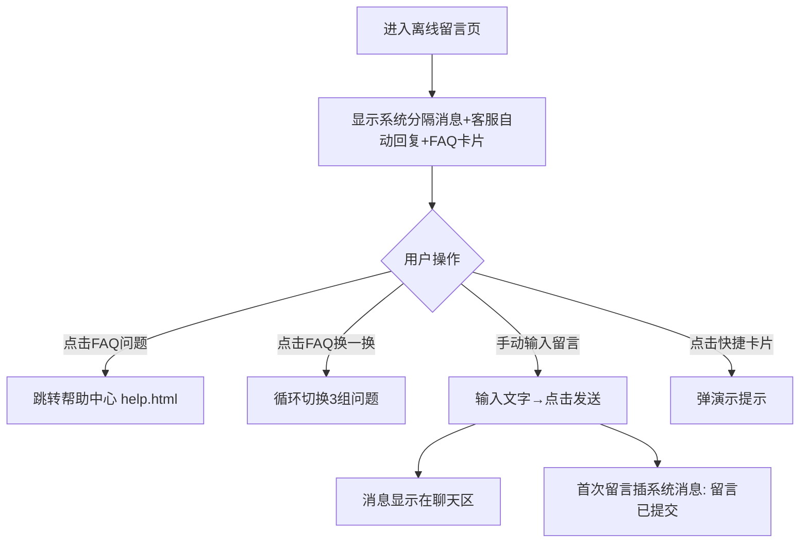

# 3.2 人工客服 — 留言与离线反馈

本模块包含离线留言页面，在客服离线时为用户提供留言功能，消息区默认展示FAQ常见问题卡片。

## 3.2 离线留言（user-offline.html）

### 3.2.1 功能概述

离线留言页面在客服离线（非工作时间）时展示，告知用户客服已离线但可照常留言。页面无离线提示条常驻显示（.offline-notice-bar CSS 存在但 HTML 未渲染，仅消息流内一条系统分隔消息，无月亮图标无工作时间），消息区展示客服离线自动回复和 FAQ 常见问题卡片（含换一换+4 问题项），用户可点击 FAQ 问题跳转帮助中心或手动输入留言。entry_tag 场景联动函数 applySceneContext() 与 SCENE_TEMPLATES 已定义但从未调用，且操作的元素 id 在 DOM 中不存在，实际不可用；快捷问题模板栏 CSS 与 bindQuickTemplates() 已定义但 HTML 无对应元素且函数从未调用，模板不可用。

### 3.2.2 页面结构

页面采用移动端375px布局，从上到下分为四个区域：小程序状态栏、导航栏（含客服信息）、消息列表、底部输入区。

| 区域 | 说明 |
|------|------|
| 小程序状态栏 | 时间+WiFi/电量图标 |
| 导航栏 | 返回按钮 + 客服头像("夏",蓝色渐变)+名称"客服小夏"(无"离线"状态文字与灰色圆点) + 更多按钮(三点，点击弹出toast"更多：查看留言记录 · 切换联系方式 · 投诉建议") + 微信胶囊 |
| 离线提示条 | 无（.offline-notice-bar CSS 存在但 HTML 未渲染；消息流内仅一条系统分隔消息"— 客服当前离线，留言将在客服上线后回复 —"，无月亮图标无工作时间） |
| 消息列表 | 系统分隔消息"— 客服当前离线，留言将在客服上线后回复 —" + 客服离线自动回复"您好，我是客服小夏。当前为非工作时间，我暂时无法实时回复，但您可以照常留言，我会在上线后第一时间为您处理～"(meta"昨天 22:15") + FAQ常见问题卡片(CsCommon.cardHtml('faq')含换一换按钮+4问题项，点击问题跳转 help.html，meta"09:41") |
| 快捷问题模板栏 | 无（CSS 与 bindQuickTemplates() 已定义但 HTML 无模板栏元素且函数从未调用，模板不可用） |
| 底部输入区 | 公共快捷卡片入口条(CsCommon.quickCardsBar 6按钮转人工首位) + 输入区：语音按钮 + 输入框(placeholder"客服离线，留言即可...") + 更多(+)按钮(点击toast"更多：图片 · 快捷留言模板 · 转人工") + 发送按钮 |

### 3.2.3 操作流程

场景联动（不可用）：applySceneContext() 函数与 SCENE_TEMPLATES 映射（product/order/cart/refund/help/home/profile 7 种）已定义但从未在初始化中调用，且操作的元素 id（sceneCardTitle/sceneCardMeta/sceneCardPrice 等）在 DOM 中不存在，场景联动实际不可用，无卡片消息生成。

### 3.2.4 字段与交互

| 字段名称 | 字段标识 | 字段类型 | 必填 | 数据类型 | 长度限制 | 默认值 | 校验规则 | 取值范围 | 来源 | 错误提示 |
|----------|----------|----------|------|----------|----------|--------|----------|----------|------|----------|
| 留言输入 | msg_input | 文本输入 | 否 | String | - | 空 | - | - | 用户输入 | - |
| 发送按钮 | btn_send | 按钮 | - | - | - | - | 无禁用态视觉，仅trim空值return拦截 | - | - | - |
| 语音按钮 | btn_voice | 按钮 | - | - | - | - | - | - | - | - |
| 更多(+)按钮 | btn_more | 按钮 | - | - | - | - | 点击toast"更多：图片 · 快捷留言模板 · 转人工" | - | - | - |
| 快捷卡片入口条 | quick_cards_bar | 公共组件 | - | - | - | - | CsCommon.quickCardsBar 6按钮转人工首位 | - | - | - |
| FAQ常见问题卡片 | faq_card | 卡片 | - | - | - | - | CsCommon.cardHtml('faq')含换一换+4问题项，点击跳转help.html | - | - | - |

### 3.2.5 业务规则

| 规则编号 | 规则描述 |
|----------|----------|
| RULE-3.2-OFFLINE-001 | 无离线提示条常驻显示（.offline-notice-bar CSS 存在但 HTML 未渲染），消息流内仅一条系统分隔消息，无月亮图标无工作时间 |
| RULE-3.2-OFFLINE-002 | 消息流默认展示 FAQ 常见问题卡片（CsCommon.cardHtml('faq')），含换一换按钮（循环切换3组问题）+ 4个问题项，点击问题跳转 help.html |
| RULE-3.2-OFFLINE-003 | entry_tag 场景联动不可用：applySceneContext() 与 SCENE_TEMPLATES 已定义但从未调用，且操作的元素 id 在 DOM 中不存在 |
| RULE-3.2-OFFLINE-004 | 快捷问题模板栏不可用：CSS 与 bindQuickTemplates() 已定义但 HTML 无模板栏元素且函数从未调用 |
| RULE-3.2-OFFLINE-005 | 离线状态下用户仍可正常发送消息（文字），消息在客服上线后可见 |
| RULE-3.2-OFFLINE-006 | 发送按钮无禁用态视觉，仅 sendMessage() 中 trim 空值 return 拦截 |
| RULE-3.2-OFFLINE-007 | 导航栏更多按钮（三点）点击弹出toast"更多：查看留言记录 · 切换联系方式 · 投诉建议" |
| RULE-3.2-OFFLINE-008 | 输入区更多(+)按钮点击弹出toast"更多：图片 · 快捷留言模板 · 转人工" |
| RULE-3.2-OFFLINE-009 | 首次留言确认：用户发送第一条消息后300ms，系统自动插入系统消息"留言已提交，客服将在上线后回复您（预计 09:00 上线后 30 分钟内）"，仅触发一次 |
| RULE-3.2-OFFLINE-010 | 底部使用公共快捷卡片入口条（CsCommon.quickCardsBar），6 按钮：转人工/发送订单/发送售后/查看物流/购物车/发送服务评价 |

### 3.2.6 页面跳转

**入口**：
- 咨询入口选择在线咨询（客服离线时）

**出口**：
- 客服上线接通 → 聊天页（user-chat-basic.html）
- 点击返回 → 来源页面
