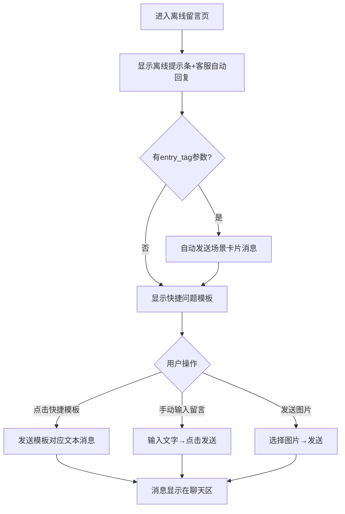

# 3.2 人工客服 — 留言与离线反馈

本模块包含离线留言页面，在客服离线时为用户提供留言功能，支持快捷问题模板和 entry_tag 场景联动。

## 3.2 离线留言（user-offline.html）

### 3.2.1 功能概述

离线留言页面在客服离线（非工作时间）时展示，告知用户客服已离线但可照常留言。页面顶部显示离线提示条（含工作时间），消息区展示客服离线自动回复和快捷问题模板，用户可点击模板快速发送常见问题或手动输入留言。支持 entry_tag 场景联动，自动发送商品/订单卡片消息。

### 3.2.2 页面结构

页面采用移动端375px布局，从上到下分为五个区域：小程序状态栏、导航栏（含客服离线状态）、消息列表、底部输入区。

| 区域 | 说明 |
|------|------|
| 小程序状态栏 | 时间+WiFi/电量图标 |
| 导航栏 | 返回按钮 + 客服头像("夏",灰色)+名称"客服小夏"+状态"离线"(灰色圆点) + 更多按钮(三点，点击弹出toast"查看留言记录 · 切换联系方式 · 投诉建议") + 微信胶囊 |
| 离线提示条 | 黄底(#fff7e6)，月亮图标 + "客服已离线，您可以照常留言，客服上线后将回复您" + "工作时间 09:00 - 21:00" |
| 消息列表 | 系统消息"客服当前离线，留言将在客服上线后回复" + 客服离线自动回复"您好，我是客服小夏。当前为非工作时间，我暂时无法实时回复，但您可以照常留言，我会在上线后第一时间为您处理～" + 场景联动卡片(按需显示) + 快捷问题模板栏 |
| 快捷问题模板栏 | 白色卡片，标题"常见问题快捷模板（点击发送）"+ 6个模板标签：退款进度咨询/物流状态查询/商品质量咨询/发票开具咨询/取消订单申请/优惠券使用问题 |
| 底部输入区 | 语音按钮 + 输入框(placeholder"客服离线，留言即可...") + 图片按钮 + 发送按钮 |

### 3.2.3 操作流程

场景联动：URL中携带 entry_tag 参数时，自动根据模板生成对应卡片消息（商品咨询/订单咨询/购物车咨询/退款咨询等7种场景）。

场景卡片消息结构：
| 字段 | 说明 |
|------|------|
| 缩略图 | 56×56px商品/订单图片，圆角4px |
| 标题 | 商品名/订单号，单行省略 |
| 元信息 | 分类/规格等描述文字，灰色12px |
| 价格 | 现价(红色14px) + 原价划线(灰色12px) |

场景卡片示例（entry_tag=product）：
- 缩略图：商品主图
- 标题："2024春季新款休闲运动鞋"
- 元信息："分类：运动鞋"
- 价格："¥299" + "¥399"

### 3.2.4 字段与交互

| 字段名称 | 字段标识 | 字段类型 | 必填 | 数据类型 | 长度限制 | 默认值 | 校验规则 | 取值范围 | 来源 | 错误提示 |
|----------|----------|----------|------|----------|----------|--------|----------|----------|------|----------|
| 场景标签 | entry_tag | URL参数 | 否 | String | - | 空 | 合法场景枚举 | product/order/cart/refund/help/home/profile | URL参数 | - |
| 留言输入 | msg_input | 文本输入 | 否 | String | - | 空 | - | - | 用户输入 | - |
| 退款进度咨询 | tpl_refund | 快捷模板 | - | - | - | - | - | - | - | - |
| 物流状态查询 | tpl_logistics | 快捷模板 | - | - | - | - | - | - | - | - |
| 商品质量咨询 | tpl_product | 快捷模板 | - | - | - | - | - | - | - | - |
| 发票开具咨询 | tpl_invoice | 快捷模板 | - | - | - | - | - | - | - | - |
| 取消订单申请 | tpl_cancel | 快捷模板 | - | - | - | - | - | - | - | - |
| 优惠券使用问题 | tpl_coupon | 快捷模板 | - | - | - | - | - | - | - | - |
| 发送按钮 | btn_send | 按钮 | - | - | - | 禁用 | 输入框非空时启用 | - | - | - |
| 语音按钮 | btn_voice | 按钮 | - | - | - | - | - | - | - | - |
| 图片按钮 | btn_image | 按钮 | - | - | - | - | - | - | - | - |

### 3.2.5 业务规则

| 规则编号 | 规则描述 |
|----------|----------|
| RULE-3.2-OFFLINE-001 | 离线提示条常驻显示，包含工作时间 09:00-21:00 |
| RULE-3.2-OFFLINE-002 | 快捷模板点击即发送对应预设文本（如退款进度咨询→"退款进度咨询：我于近期申请了退款，想了解退款进度及预计到账时间。"） |
| RULE-3.2-OFFLINE-003 | entry_tag 场景联动：URL携带 entry_tag 参数时，自动根据 SCENE_TEMPLATES 映射生成卡片消息（含标题、来源、价格） |
| RULE-3.2-OFFLINE-004 | 离线状态下用户仍可正常发送消息（文字/图片），消息在客服上线后可见 |
| RULE-3.2-OFFLINE-005 | 发送按钮在输入框为空时禁用，非空时启用 |
| RULE-3.2-OFFLINE-006 | 导航栏更多按钮（三点）点击弹出toast提示"查看留言记录 · 切换联系方式 · 投诉建议" |
| RULE-3.2-OFFLINE-007 | 首次留言确认：用户发送第一条消息后300ms，系统自动插入系统消息"留言已提交，客服将在上线后回复您（预计 09:00 上线后 30 分钟内）"，仅触发一次 |

### 3.2.6 页面跳转

**入口**：
- 咨询入口选择在线咨询（客服离线时）
- 排队等待页点击"转留言"

**出口**：
- 客服上线接通 → 聊天页（user-chat-basic.html）
- 点击返回 → 来源页面
