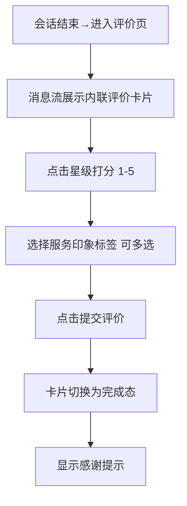

# 3.3 人工客服 — 服务评价

本模块包含服务评价页面，在会话结束后以消息流内联评价卡片形式为用户提供服务评价能力。评价卡片为内联组件，复用于 user-rating.html 和 user-chat-closed.html 两个页面。

## 3.3.0 服务评价模块定义

服务评价以内联评价卡片（.msg-rating-card）形式嵌入消息流，而非独立弹窗。评价卡片包含：标题、5星评分（单维度）、4个服务印象标签（可多选）、提交按钮、完成态提示。评价卡片复用于 user-rating.html（服务评价页）和 user-chat-closed.html（会话关闭提示页），交互逻辑一致。

## 3.3 服务评价（user-rating.html）

### 3.3.1 功能概述

服务评价页面在会话结束后展示，背景为已结束的会话消息流，输入区禁用。消息流中内联展示评价卡片，用户完成评价（打分+选标签+提交）后卡片切换为完成态。

### 3.3.2 页面结构

页面采用移动端375px布局，从上到下分为四个区域：小程序状态栏、导航栏、消息列表（含内联评价卡片）、底部输入区（禁用）。

| 区域 | 说明 |
|------|------|
| 小程序状态栏 | 时间+WiFi/电量图标 |
| 导航栏 | 返回按钮 + 客服头像("夏",灰色)+名称"客服小夏"+副标题"会话已结束" + 微信胶囊 |
| 关闭提示条 | 灰底(#f5f5f5)，灰色圆点 + "本次会话已结束" |
| 消息列表 | 系统消息"已为您接入在线客服" + 客服消息气泡 + 系统消息"本次会话已结束 · 如有需要请重新发起咨询" + 内联评价卡片 |
| 内联评价卡片 | 标题"服务评价" + 副标题"感谢您的咨询，请对本次服务打分" + 5颗星 + 4个标签chip + 提交按钮（禁用态） + 完成态"感谢您的评价，祝您生活愉快！" |
| 底部输入区 | 输入框禁用，placeholder"会话已结束"，灰色背景 |

### 3.3.3 操作流程

### 3.3.4 字段与交互

| 字段名称 | 字段标识 | 字段类型 | 必填 | 数据类型 | 长度限制 | 默认值 | 校验规则 | 取值范围 | 来源 | 错误提示 |
|----------|----------|----------|------|----------|----------|--------|----------|----------|------|----------|
| 星级评分 | rating_star | 星级评分 | 是 | Number | - | 0 | ≥1才可提交 | 1-5 | 用户操作 | - |
| 服务印象标签 | impression_tags | 多选标签 | 否 | Array | - | [] | - | 响应迅速/态度友好/专业能力强/问题已解决 | 用户操作 | - |
| 提交评价 | btn_submit | 按钮 | - | - | - | 禁用 | 评分≥1时启用 | - | - | - |
| 消息输入 | msg_input | 文本输入 | - | - | - | 禁用 | 会话已结束，不可输入 | - | - | - |

### 3.3.5 业务规则

| 规则编号 | 规则描述 |
|----------|----------|
| RULE-3.3-RATING-001 | 评价卡片内联展示在消息流中，无需用户手动触发弹窗 |
| RULE-3.3-RATING-002 | 输入区禁用，会话已结束不可发送消息 |
| RULE-3.3-RATING-003 | 星级交互：点击第N星，1~N星全部亮起（黄色 #faad14）；提交按钮在评分≥1时启用 |
| RULE-3.3-RATING-004 | 服务印象标签可多选，点击切换选中/未选中状态 |
| RULE-3.3-RATING-005 | 提交评价后卡片添加 .done 类，切换为完成态：隐藏星级和标签交互，显示"感谢您的评价，祝您生活愉快！" |
| RULE-3.3-RATING-006 | 评价卡片交互逻辑在 user-rating.html 和 user-chat-closed.html 中保持一致 |

### 3.3.6 页面跳转

**入口**：
- 聊天页会话结束

**出口**：
- 评价完成 → 留在当前页
- 点击返回 → 来源页面

## 3.4 会话关闭提示+评价引导（user-chat-closed.html）

### 3.4.1 功能概述

会话关闭提示页在会话结束后展示客服道别语、内联评价卡片和重新咨询入口。与 user-rating.html 共用相同的评价卡片组件和交互逻辑，差异在于额外包含客服道别消息和"重新咨询"入口。

### 3.4.2 页面结构

页面采用移动端375px布局，从上到下分为：小程序状态栏、导航栏（客服王小明+已结束）、关闭提示条、消息列表（含道别语+评价卡片）、底部输入区（禁用）。

| 区域 | 说明 |
|------|------|
| 导航栏 | 返回按钮 + 客服头像("王",蓝色)+姓名"客服王小明"+状态"已结束" + 微信胶囊 |
| 关闭提示条 | 灰底，灰色圆点 + "本次会话已结束" |
| 消息列表 | 系统消息 + 客服消息 + 客服道别语"感谢您的咨询，欢迎下次再来～" + 内联评价卡片（与 user-rating.html 一致） |
| 内联评价卡片 | 标题"服务评价" + 5颗星 + 4个标签 + 提交按钮 + 完成态提示 |
| 底部输入区 | 输入框禁用 |

### 3.4.3 业务规则

| 规则编号 | 规则描述 |
|----------|----------|
| RULE-3.4-CLOSED-001 | 评价卡片交互与 user-rating.html 完全一致 |
| RULE-3.4-CLOSED-002 | 提交评价后显示 toast"评价已提交，感谢您的反馈" |
| RULE-3.4-CLOSED-003 | 页面提供"重新咨询"入口，点击返回咨询入口页 |

### 3.4.4 页面跳转

**入口**：
- 聊天主界面总览点击"会话关闭提示+评价引导"卡片

**出口**：
- 评价完成 → 留在当前页
- 点击返回 → 来源页面
