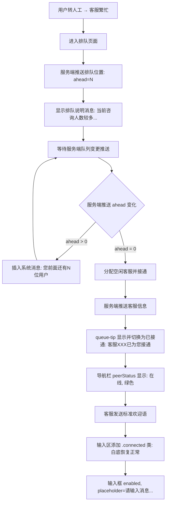

# 03-排队等待

> 页面：`user-queue.html` | 版本：V1.0 | 2026-07-05
> 数据源：原型 HTML 逐功能提取
> 需求编号：US-MVP-21

---

## 3.1 功能概述

排队等待页是用户转人工客服后，当所有客服均处于繁忙状态时展示的等待界面。服务端将用户加入排队队列并实时推送当前排队位置；每有一人完成服务出队，剩余用户的排队人数自动减 1。当用户排到队首时，系统自动分配空闲客服并接通，导航栏状态切换为"在线"，输入区恢复正常可用，客服发送标准欢迎语开始服务。

> 原型演示：使用 `ahead=3` 硬编码起始值，每 2 秒模拟减 1，共 6 秒完成排队。生产环境由服务端 WebSocket 实时推送队列位置。

---

## 3.2 页面结构

页面承载于 375px 宽的 `.cs-phone` 移动端容器内，从上到下分为五个区域：

| 区域 | 选择器 | 说明 |
|------|--------|------|
| 状态栏 | `CsCommon.statusBar()` | 公共组件注入，模拟小程序顶部状态栏 |
| 导航栏 | `.cs-nav-bar.chat-nav` | 左侧返回按钮 `.cs-back`、中间名称"苏银豆客服"（无头像）、胶囊按钮 `CsCommon.capsule()`。排队期间 `.peer-status` 隐藏，接通后显示"在线"绿色 |
| 消息列表 | `.chat-messages#chatMessages` | 含客服排队说明消息、排队进度系统消息（动态插入）。注：原"已为您接入苏银豆客服"系统消息已移除，接通后由客服欢迎语体现 |
| 快捷卡片条 | `.quick-cards-bar` | `CsCommon.quickCardsBar()` 公共组件注入，排队中点击提示"排队中，已选择xxx卡片（演示）" |
| 输入工具栏 | `.chat-input-area#queueInputBar` | 排队中正常显示，输入框可用；接通后添加 `.connected` 类恢复白底 |

```
┌─ .cs-phone (375px) ─────────────────┐
│ [statusBar]                          │
│ [<返回] [苏银豆客服] [···]            │
├──────────────────────────────────────┤
│ .chat-messages                       │
│  ├ .msg-row agent: 排队说明消息      │
│  └ .msg-system: 排队进度消息（动态）  │
├──────────────────────────────────────┤
│ .quick-cards-bar (CsCommon注入)      │
├──────────────────────────────────────┤
│ .chat-input-area#queueInputBar       │
│  [🎤语音] [请输入消息...] [+更多] [发送] │
└──────────────────────────────────────┘
```

---

## 3.3 操作流程

### 排队与接通主流程



补充说明：
- 排队位置由服务端实时统计，通过 WebSocket 推送给客户端；每有一人出队，所有剩余用户收到更新
- 排队进度以系统消息形式插入消息流，格式为"您前面还有 N 位用户"
- 排队期间不展示倒计时秒数，仅展示排队人数变化
- 原型演示：`ahead=3` 硬编码，每 2 秒模拟减 1 人；生产环境由服务端推送驱动

---

## 3.4 字段与交互

### 3.4.1 排队状态

| 字段名称 | 字段标识 | 字段类型 | 必填 | 数据类型 | 长度限制 | 默认值 | 校验规则 | 取值范围 | 来源 | 错误提示 |
|----------|----------|----------|------|----------|----------|--------|----------|----------|------|----------|
| 前面排队人数 | state.ahead | 数值 | — | Number | — | — | 服务端实时推送，每有一人出队减 1；≤0 时接通 | 0-∞ | 服务端 WebSocket 推送 | — |

### 3.4.2 排队提示条（接通后）

| 字段名称 | 字段标识 | 字段类型 | 必填 | 数据类型 | 长度限制 | 默认值 | 校验规则 | 取值范围 | 来源 | 错误提示 |
|----------|----------|----------|------|----------|----------|--------|----------|----------|------|----------|
| 排队提示容器 | queueTip | 容器 | — | — | — | 隐藏 display:none | 初始隐藏；接通后设为可见并切换为"客服 王小明 已为您接通" | — | 系统生成 | — |
| 接通后提示 | queueTip.connected | 文本 | — | String | — | — | 切换为"客服 王小明 已为您接通" | — | 系统生成 | — |

### 3.4.3 导航栏状态

| 字段名称 | 字段标识 | 字段类型 | 必填 | 数据类型 | 长度限制 | 默认值 | 校验规则 | 取值范围 | 来源 | 错误提示 |
|----------|----------|----------|------|----------|----------|--------|----------|----------|------|----------|
| 排队状态 | peerStatus | 文本 | — | String | — | 隐藏(display:none) | 排队期间隐藏；接通后显示"在线"绿色(.online) | — | 系统状态 | — |

### 3.4.4 输入区状态

| 字段名称 | 字段标识 | 字段类型 | 必填 | 数据类型 | 长度限制 | 默认值 | 校验规则 | 取值范围 | 来源 | 错误提示 |
|----------|----------|----------|------|----------|----------|--------|----------|----------|------|----------|
| 输入区 | queueInputBar | 容器 | — | — | — | 正常 | 接通后添加 .connected 类 | — | 系统状态 | — |
| 输入框 | input | 文本输入 | 否 | String | — | 正常 | 接通后 enabled=true | — | 系统状态 | — |
| 输入框占位符 | input.placeholder | 文本 | — | String | — | 请输入消息... | — | — | 系统配置 | — |

### 3.4.5 快捷卡片条（排队中）

| 字段名称 | 字段标识 | 字段类型 | 必填 | 数据类型 | 长度限制 | 默认值 | 校验规则 | 取值范围 | 来源 | 错误提示 |
|----------|----------|----------|------|----------|----------|--------|----------|----------|------|----------|
| 快捷栏点击 | quickCards | 按钮组 | — | — | — | — | 排队中点击提示"排队中，已选择xxx卡片（演示）" | — | 用户操作 | — |

---

## 3.5 业务规则

| 规则编号 | 规则描述 |
|----------|----------|
| RULE-QUEUE-001 | 排队初始化：服务端将用户加入排队队列，实时推送当前排队位置 ahead=N |
| RULE-QUEUE-002 | 队列推进：服务端每有一人完成服务出队，向所有排队用户推送更新后的 ahead 值；客户端收到后插入系统消息"您前面还有 N 位用户"；ahead=0 时触发接通 |
| RULE-QUEUE-003 | 排队期间不展示倒计时秒数；`queue-tip` 初始 `display:none`，仅在接通时切换为可见并显示"客服 XXX 已为您接通" |
| RULE-QUEUE-004 | 接通后 queue-tip 切换为绿色已接通状态（.connected），圆点闪烁动画停止 |
| RULE-QUEUE-005 | 接通后导航栏 peerStatus 从隐藏（display:none）切换为 `.online`（绿色"在线"） |
| RULE-QUEUE-006 | 接通后输入区添加 `.connected` 类：输入框背景变白、边框恢复、文字颜色恢复；输入框 disabled 设为 false |
| RULE-QUEUE-007 | 接通后客服发送标准欢迎语：`您好，欢迎联系苏银豆商城客服中心！我是您的专属客服，请问有什么可以帮您？`（与 admin-auto-reply.html 客服欢迎语一致） |
| RULE-QUEUE-008 | 排队期间快捷栏点击不执行实际卡片发送，仅 alert 提示"排队中，已选择xxx卡片（演示）" |

---

## 3.6 页面跳转

**入口**：
- 聊天页 `user-chat-basic.html` 点击"转人工" → 所有客服繁忙时进入排队

**出口**：
- 返回按钮 → `history.back()`
- 排队接通后 → 当前页切换为正常聊天状态（不跳转）