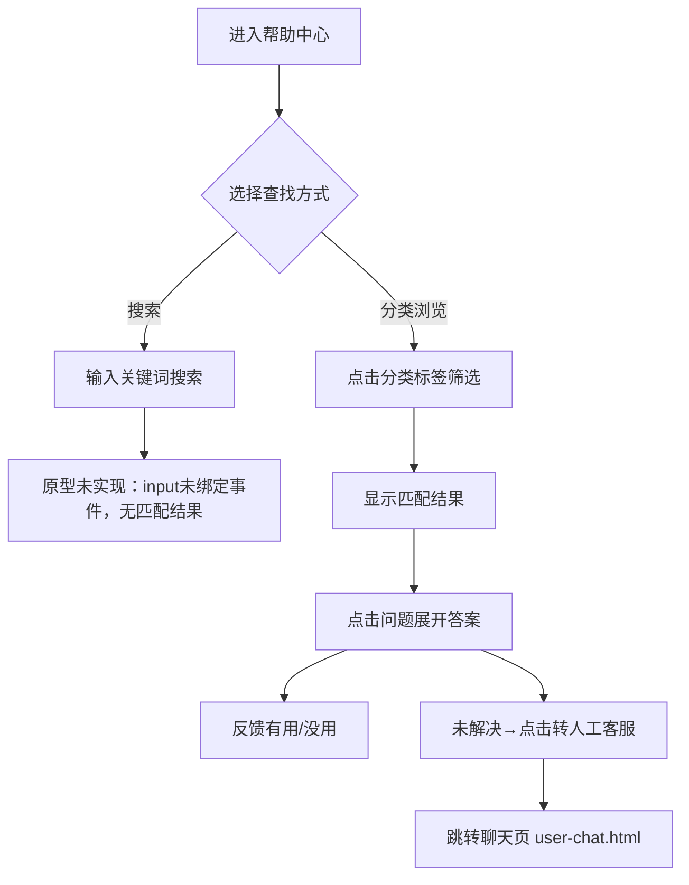

# 4 FAQ机器人客服

本模块包含帮助中心页面，提供FAQ自助服务和转人工入口，帮助用户在不联系客服的情况下自助解决常见问题。

> 版本标记：US-MVP-24（用户端 · FAQ自助 + 转人工）

## 4.1 帮助中心（user-faq.html）

### 4.1.1 功能概述

帮助中心为用户提供FAQ自助服务，包含搜索栏、分类筛选、问题列表与答案展开等功能。用户可通过分类标签浏览筛选常见问题，点击问题展开答案并反馈有用/没用。未找到答案时可点击底部"转人工客服"跳转咨询入口。

> 说明：
> - 搜索框 UI 已渲染（圆角18px，placeholder"搜索常见问题，如'退款进度'"），但 input 未绑定任何事件，输入关键词无匹配结果反馈，**原型未实现搜索逻辑**（V1 待实现）。
> - 历史的"服务指南"功能（含退换货流程、支付方式、配送说明、发票政策4张卡片）**已下线**：原型 HTML 残留但 panelGuide 永久 display:none，分类标签中"服务指南"入口已移除，切换逻辑不再做面板互斥，仅 panelFaq 常驻显示。
> - 聊天页（user-chat.html 等）通过 `CsCommon.cardHtml('faq')` 渲染 FAQ 卡片，含快捷问题清单与"换一换"交互，详见 4.1.7。

### 4.1.2 页面结构

页面采用移动端375px布局，从上到下分为五个区域：小程序状态栏、导航栏、搜索栏+分类标签栏、内容区（FAQ列表）、底部提示。

| 区域 | 说明 |
|------|------|
| 小程序状态栏 | 显示时间09:41、WiFi/电量图标 |
| 导航栏 | 返回按钮 + 标题"帮助中心" + 微信胶囊按钮 |
| 搜索栏+分类标签栏 | 搜索框（圆角18px，placeholder"搜索常见问题，如'退款进度'"，**UI已渲染但未绑定事件，原型未实现搜索逻辑**）+ 分类标签横向滚动（全部/订单问题/退换货/支付/物流/账户，共6个，无"服务指南"入口） |
| FAQ列表 | 按分类筛选的问题列表，每项含：问题文本（热度标签已下线，不展示浏览量），点击展开答案气泡（浅绿背景+左侧绿色竖条+"答"圆角徽标+有用/没用按钮）；列表统一为"全部问题"一个区域（原"热门问题"分区已合并）。共9个FAQ问题： |

FAQ问题列表：

| 区域 | 问题 | 分类 | 热度 |
|------|------|------|------|
| 热门问题 | 如何申请七天无理由退货？ | 退换货 | 2.3w |
| 热门问题 | 订单显示"已发货"但查不到物流信息？ | 订单问题 | 1.8w |
| 热门问题 | 退款多久能到账？ | 退换货 | 1.5w |
| 全部问题 | 支持哪些支付方式？ | 支付 | 9821 |
| 全部问题 | 支付时提示"交易关闭"怎么办？ | 支付 | 6430 |
| 全部问题 | 可以修改或取消已下的订单吗？ | 订单问题 | 7210 |
| 全部问题 | 可以修改收货地址吗？ | 物流 | 5380 |
| 全部问题 | 忘记登录密码怎么找回？ | 账户 | 4120 |
| 全部问题 | 收到的商品有质量问题如何处理？ | 退换货 | 3290 |
| 底部提示 | "没找到答案？" + "转人工客服 ›"链接（跳转 user-chat.html） |

### 4.1.3 操作流程

分类标签切换时，FAQ列表按 data-cat 属性过滤显示（"全部"显示所有分类），panelFaq 常驻显示，不再有服务指南面板切换。答案展开为手风琴模式，全局同一时间只有一个问题处于展开状态（不区分分类，展开当前项时收起全局所有其他已展开项）。

### 4.1.4 字段与交互

| 字段名称 | 字段标识 | 字段类型 | 必填 | 数据类型 | 长度限制 | 默认值 | 校验规则 | 取值范围 | 来源 | 错误提示 |
|----------|----------|----------|------|----------|----------|--------|----------|----------|------|----------|
| 搜索关键词 | faq_search | 文本输入 | 否 | String | - | 空 | - | - | 用户输入 | - （原型未实现：input未绑定事件，无匹配结果） |
| 分类标签 | faq_tab | 单选标签 | 否 | String | - | all | - | all/order/refund/pay/logistics/account | 用户点击 | - |
| 问题项 | faq_item | 可展开卡片 | - | - | - | 收起 | - | - | 系统数据 | - |
| 热度标签 | faq_hit | 展示文本 | - | String | - | - | - | - | 系统数据 | - |
| 答案气泡 | faq_answer | 展示区域 | - | - | - | 隐藏 | 点击问题展开 | - | 系统数据 | - |
| 有用按钮 | btn_useful | 按钮 | - | - | - | - | - | - | - | - |
| 没用按钮 | btn_not_useful | 按钮 | - | - | - | - | - | - | - | - |
| 联系客服 | btn_contact_cs | 链接 | - | - | - | - | - | - | - | - |

### 4.1.5 业务规则

| 规则编号 | 规则描述 |
|----------|----------|
| RULE-4-FAQ-001 | 分类标签切换时，FAQ列表按 data-cat 属性过滤，"全部"显示所有分类；panelFaq 常驻显示，不再有服务指南面板切换 |
| RULE-4-FAQ-002 | 问题展开时添加 .expanded 类（红色边框 var(--cs-primary) 即 #ee0a24 + rgba(238,10,36,0.08) 阴影），答案区域从隐藏变为显示 |
| RULE-4-FAQ-003 | 热度标签仅展示浏览量数据，不参与排序逻辑（原型为静态排序） |
| RULE-4-FAQ-004 | 有用/没用反馈为前端交互，正式版需上报统计 |
| RULE-4-FAQ-005 | 【已下线】原"服务指南面板与FAQ面板互斥切换"逻辑已移除：分类标签切换仅 panelFaq.classList.add('active')，无面板互斥 |
| RULE-4-FAQ-006 | 【已下线】原"服务指南4张卡片"功能已对用户不可见：HTML 残留但 panelGuide 永久 display:none，分类标签中"服务指南"入口已移除 |
| RULE-4-FAQ-007 | 【已下线】原"退换货流程步骤式指南"卡片随服务指南一并下线，不再展示 |
| RULE-4-FAQ-008 | FAQ答案展开为手风琴交互：点击问题展开当前项答案时，自动收起**全局所有**其他已展开的 .faq-item.expanded（不区分分类，比"同分类内收起"更严格），同一时间只有一个问题处于展开状态 |
| RULE-4-FAQ-009 | 聊天页 FAQ 卡片（CsCommon.cardHtml('faq')）渲染4个快捷问题，点击任一问题跳转 mini-program/pages/help.html |
| RULE-4-FAQ-010 | 聊天页 FAQ 卡片右上角"换一换"按钮（.faq-refresh）：点击循环切换 FAQ_GROUPS 共3组12个问题（gi = (gi+1) % 3），同时图标 SVG 执行 rotate((gi+1)*360deg) 旋转动画（transition .45s）；通过 CsCommon.bindFaqRefresh(container) 绑定 |

### 4.1.6 页面跳转

**入口**：
- 商城页面"帮助中心"入口
- 咨询入口页帮助中心入口

**出口**：
- 点击"转人工客服" → 聊天页（user-chat.html，即聊天主界面总览）
- 点击返回 → 来源页面

### 4.1.7 聊天页 FAQ 卡片（CsCommon.cardHtml('faq')）

聊天页（user-chat.html 等）通过 `CsCommon.cardHtml('faq')` 渲染 FAQ 卡片，作为客服会话中的快捷自助入口。卡片结构与帮助中心页（user-faq.html）独立，二者不可混淆。

#### 卡片结构

| 区域 | 说明 |
|------|------|
| 卡片头部 | 左侧"常见问题"标题（带问号图标）+ 右侧"换一换"按钮（.faq-refresh，红色文字+刷新图标，data-cs-action="faqRefresh"） |
| 快捷问题清单 | 默认渲染4个快捷问题（.faq-item），每个问题右侧带 ">" 箭头（.q-arrow），点击跳转 mini-program/pages/help.html |

#### 快捷问题清单（FAQ_GROUPS，共3组12个问题）

| 组序号 | 问题1 | 问题2 | 问题3 | 问题4 |
|--------|-------|-------|-------|-------|
| 第1组（默认） | 如何注册苏银豆商城账号？ | 积分如何获取和使用？ | 退款多久能到账？ | 忘记密码怎么办？ |
| 第2组 | 如何修改收货地址？ | 优惠券如何使用？ | 订单如何取消？ | 发票如何开具？ |
| 第3组 | 会员等级有哪些权益？ | 商品退换货流程？ | 如何联系人工客服？ | 订单多久自动确认收货？ |

#### 交互：换一换

- 触发：点击卡片头部右侧"换一换"按钮（.faq-refresh）
- 行为：按 `gi = (gi + 1) % FAQ_GROUPS.length` 循环切换至下一组问题，清空 .faq-list 并重新渲染该组4个问题
- 动画：刷新图标 SVG 执行 `transform: rotate((gi+1)*360deg)`，transition .45s
- 绑定入口：`CsCommon.bindFaqRefresh(container)`，内部以 `dataset.bound='1'` 防重复绑定
- 跳转：每个快捷问题点击均跳转 `mini-program/pages/help.html`（MINI_BASE = '../../../mini-program/pages/'）
