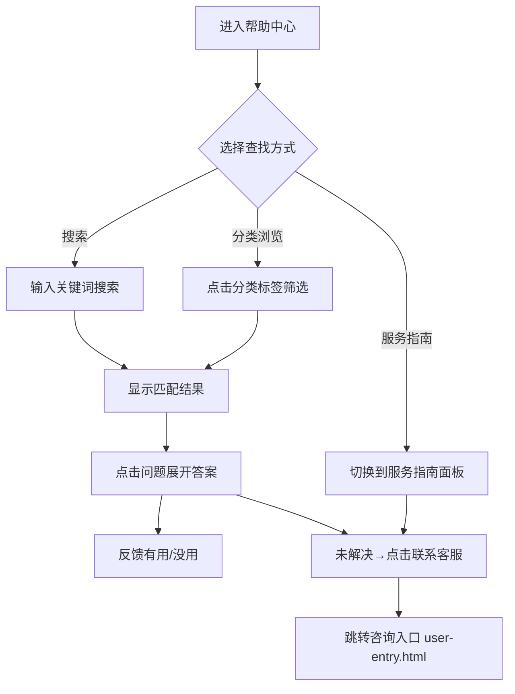

# 4 FAQ机器人客服

本模块包含帮助中心页面，提供FAQ自助服务和转人工入口，帮助用户在不联系客服的情况下自助解决常见问题。

## 4.1 帮助中心（user-faq.html）

### 4.1.1 功能概述

帮助中心为用户提供FAQ自助服务，包含搜索、分类筛选、问题列表与答案展开、服务指南等功能。用户可通过搜索或分类浏览查找常见问题，点击问题展开答案并反馈有用/没用；也可切换到服务指南查看支付方式、物流配送、发票开具等操作指南。未找到答案时可点击底部"联系客服"跳转咨询入口。

### 4.1.2 页面结构

页面采用移动端375px布局，从上到下分为五个区域：小程序状态栏、导航栏、搜索栏+分类标签栏、内容区（FAQ列表/服务指南）、底部提示。

| 区域 | 说明 |
|------|------|
| 小程序状态栏 | 显示时间09:41、WiFi/电量图标 |
| 导航栏 | 返回按钮 + 标题"帮助中心" + 微信胶囊按钮 |
| 搜索栏+分类标签栏 | 搜索框（圆角18px，placeholder"搜索常见问题，如'退款进度'"）+ 分类标签横向滚动（全部/订单问题/退换货/支付/物流/账户/服务指南） |
| FAQ列表 | 按分类筛选的问题列表，每项含：问题文本+热度标签（火焰图标+浏览量如2.3w），点击展开答案气泡（绿色背景+A标签+有用/没用按钮）；列表分"热门问题"和"全部问题"两个区域。共9个FAQ问题： |

FAQ问题列表：

| 区域 | 问题 | 分类 | 热度 |
|------|------|------|------|
| 热门问题 | 如何申请七天无理由退货？ | 退换货 | 2.3w |
| 热门问题 | 订单显示"已发货"但查不到物流信息？ | 订单问题 | 1.8w |
| 热门问题 | 退款多久能到账？ | 退换货 | 1.5w |
| 全部问题 | 支持哪些支付方式？ | 支付 | 9821 |
| 全部问题 | 支付时提示"交易关闭"怎么办？ | 支付 | 6430 |
| 全部问题 | 可以修改或取消已下的订单吗？ | 订单问题 | 7210 |
| 全部问题 | 可以修改收货地址吗？ | 物流 | 5380 |
| 全部问题 | 忘记登录密码怎么找回？ | 账户 | 4120 |
| 全部问题 | 收到的商品有质量问题如何处理？ | 退换货 | 3290 |
| 服务指南 | 点击"服务指南"分类标签切换显示，包含4张指南卡片，每张含标题+详细内容+"了解更多"链接：①退换货流程（4步步骤式指南：申请退换货→等待审核→寄回商品→退款到账）②支付方式说明（微信支付/支付宝/银行卡，含图标+说明+退款时效）③配送说明（标准配送/加急配送/门店自提，含图标+时效+费用）④发票政策（电子发票+增值税发票，含标签+说明+补开提示） |
| 底部提示 | "没找到答案？" + "转人工客服 ›"链接 |

### 4.1.3 操作流程

分类标签切换时，FAQ列表按 data-cat 属性过滤显示；点击"服务指南"标签切换到指南面板。答案展开为手风琴模式，同一时间只有一个问题处于展开状态。

### 4.1.4 字段与交互

| 字段名称 | 字段标识 | 字段类型 | 必填 | 数据类型 | 长度限制 | 默认值 | 校验规则 | 取值范围 | 来源 | 错误提示 |
|----------|----------|----------|------|----------|----------|--------|----------|----------|------|----------|
| 搜索关键词 | faq_search | 文本输入 | 否 | String | - | 空 | - | - | 用户输入 | - |
| 分类标签 | faq_tab | 单选标签 | 否 | String | - | all | - | all/order/refund/pay/logistics/account/guide | 用户点击 | - |
| 问题项 | faq_item | 可展开卡片 | - | - | - | 收起 | - | - | 系统数据 | - |
| 热度标签 | faq_hit | 展示文本 | - | String | - | - | - | - | 系统数据 | - |
| 答案气泡 | faq_answer | 展示区域 | - | - | - | 隐藏 | 点击问题展开 | - | 系统数据 | - |
| 有用按钮 | btn_useful | 按钮 | - | - | - | - | - | - | - | - |
| 没用按钮 | btn_not_useful | 按钮 | - | - | - | - | - | - | - | - |
| 联系客服 | btn_contact_cs | 链接 | - | - | - | - | - | - | - | - |

### 4.1.5 业务规则

| 规则编号 | 规则描述 |
|----------|----------|
| RULE-4-FAQ-001 | 分类标签切换时，FAQ列表按 data-cat 属性过滤，"全部"显示所有分类 |
| RULE-4-FAQ-002 | 问题展开时添加 .expanded 类（蓝色边框+阴影），答案区域从隐藏变为显示 |
| RULE-4-FAQ-003 | 热度标签仅展示浏览量数据，不参与排序逻辑（原型为静态排序） |
| RULE-4-FAQ-004 | 有用/没用反馈为前端交互，正式版需上报统计 |
| RULE-4-FAQ-005 | 服务指南面板与FAQ面板互斥切换，同一时间只显示一个 |
| RULE-4-FAQ-006 | 服务指南共4张卡片：退换货流程、支付方式说明、配送说明、发票政策，每张卡片底部含"了解更多"链接（带右箭头图标） |
| RULE-4-FAQ-007 | 退换货流程卡片为步骤式指南，含4步：①申请退换货（在「我的订单」点击「申请售后」）→②等待审核（24小时内）→③寄回商品（系统生成退货物流单）→④退款到账（1-7个工作日原路退回） |
| RULE-4-FAQ-008 | FAQ答案展开为手风琴交互：点击问题展开当前项答案时，自动收起同一分类下其他已展开的问题，同一时间只有一个问题处于展开状态 |

### 4.1.6 页面跳转

**入口**：
- 商城页面"帮助中心"入口
- 咨询入口页帮助中心入口

**出口**：
- 点击"转人工客服" → 聊天页（user-chat.html，即聊天主界面总览）
- 点击返回 → 来源页面
