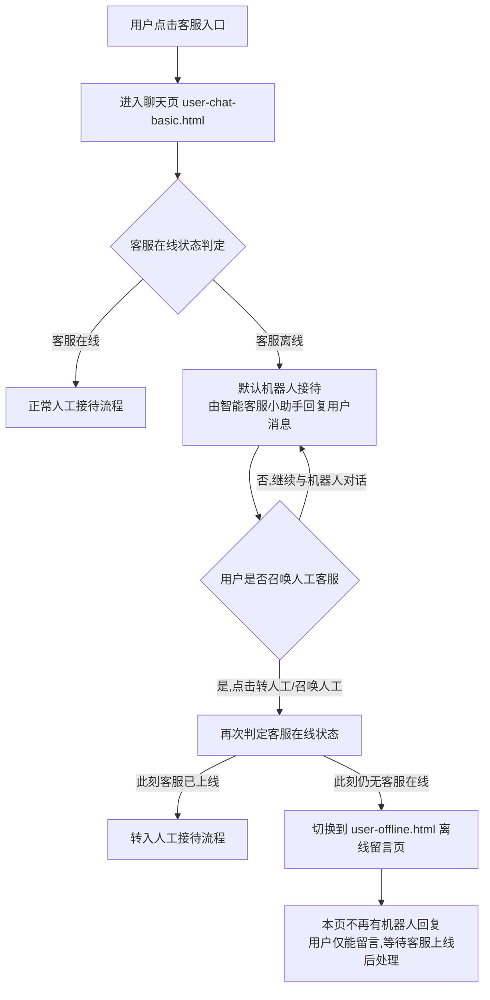
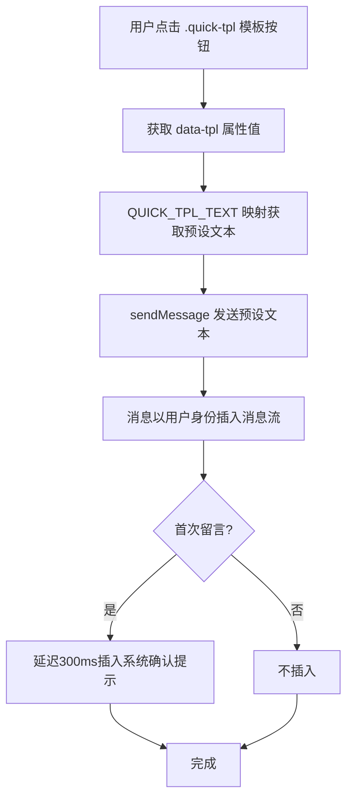

# 04-留言与离线反馈

> 页面：`user-offline.html` | 版本：V1.0 | 2026-07-05
> 数据源：原型 HTML 逐功能提取
> 需求编号：US-MVP-20 / US-MVP-22

---

## 4.1 功能概述

留言与离线反馈页是用户在客服离线时段（非工作时间）进入客服系统时看到的界面。系统展示离线提示条告知用户当前状态及客服工作时间，同时保留消息发送能力——用户可照常输入留言，留言提交后系统插入确认提示告知预计回复时间。用户首次留言会触发系统自动回复确认，后续留言不再重复提示。

此外，页面支持场景联动：用户从业务页面（商品详情、订单列表等）携带 `entry_tag` 参数进入本页时，系统自动在消息流中插入对应的场景卡片消息（商品咨询/订单咨询/购物车咨询/退款咨询/帮助中心/首页咨询/个人中心），帮客服在离线回复时快速了解用户上下文。

页面还提供了6个快捷问题模板（退款进度、物流状态、商品质量、发票开具、取消订单、优惠券问题），用户点击即可一键发送预设的问题文本，降低留言的输入成本。

---

## 4.2 页面结构

页面承载于 375px 宽的 `.cs-phone` 移动端容器内，从上到下分为五个区域：

| 区域 | 选择器 | 说明 |
|------|--------|------|
| 状态栏 | `CsCommon.statusBar()` | 公共组件注入 |
| 导航栏 | `.cs-nav-bar.chat-nav` | 左侧返回按钮 `.cs-back`、中间客服头像+名称 `.nav-peer`（头像"客"、名称"苏银豆客服"、离线状态"离线"灰色）、右侧更多按钮 `.nav-action`、胶囊按钮 `CsCommon.capsule()` |
| 消息列表 | `.chat-messages#chatMessages` | 含系统分隔线（离线提示）、客服离线问候语、场景卡片消息（动态）、用户留言、快捷问题模板条 `.quick-tpl-bar`、系统确认提示 |
| 快捷卡片条 | `.quick-cards-bar` | `CsCommon.quickCardsBar()` 公共组件注入，离线中点击提示"已选择xxx卡片（演示）" |
| 输入工具栏 | `.chat-input-area` | 语音图标 + 输入框（placeholder="客服离线，留言即可..."） + 更多按钮 + 发送按钮 |

```
┌─ .cs-phone (375px) ─────────────────┐
│ [statusBar]                          │
│ [<返回] [客] [苏银豆客服·离线] [···] [···]│
├──────────────────────────────────────┤
│ .chat-messages#chatMessages          │
│  ├ .msg-system: 客服当前离线，留言... │
│  ├ .msg-row agent: 离线问候语        │
│  ├ .msg-row agent: FAQ卡片（默认）   │
│  ├ .quick-tpl-bar: 快捷问题模板     │
│  ├ [场景卡片 .msg-row — 动态插入]    │
│  ├ 用户留言 .msg-row.user           │
│  └ .msg-system: 留言已提交确认       │
├──────────────────────────────────────┤
│ .quick-cards-bar (CsCommon注入)      │
├──────────────────────────────────────┤
│ .chat-input-area                     │
│  [🎤语音] [客服离线，留言即可...] [+] [发送]│
└──────────────────────────────────────┘
```

---

## 4.3 操作流程

### 4.3.0 离线判定与会话路由（何时进入本页）

> 本节描述用户从进入客服系统到到达 `user-offline.html` 的判定链路。核心原则：**客服离线时不直接展示离线页，而是先由机器人接待；只有用户主动召唤人工后，才在确认无客服在线时切换到离线留言页，且切换后不再有机器人回复。**



补充说明：
- **机器人接待发生在聊天页**（`user-chat-basic.html`），不在本页（`user-offline.html`）。客服离线时，用户进入聊天页看到的是机器人问候语与机器人回复，体验与"在线"几乎一致，区别仅在于消息由机器人发出。
- **触发本页的唯一条件**：客服离线 **且** 用户已主动召唤人工客服。两个条件缺一不可——客服离线但用户没召唤人工，则一直在聊天页由机器人接待，不跳转。
- **进入本页后机器人停止回复**：本页是纯留言场景，机器人不再介入对话；用户的每条消息都作为离线留言处理，等待客服上线后回复（详见 §4.3.2 用户留言发送流程）。
- **召唤人工后的二次判定**：用户从"机器人接待"点击召唤人工时，系统需重新检测一次客服在线状态（因为用户与机器人对话期间可能有客服上线）。若已上线则直接转人工，仍离线才跳本页。
- 在线/离线的判定口径与工作时间一致：每日 09:00–22:00 为在线时段，其余时段视为离线（与 §4.4.1 工作时间一致）。

### 4.3.1 场景联动初始化

```mermaid
flowchart TD
    A[页面加载] --> B[getQueryParams 解析URL参数]
    B --> C{entry_tag 存在且匹配}
    C -->|product| D[场景标签: 商品咨询]
    C -->|order| E[场景标签: 订单咨询]
    C -->|cart| F[场景标签: 购物车咨询]
    C -->|refund| G[场景标签: 退款咨询]
    C -->|help| H[场景标签: 帮助中心]
    C -->|home| I[场景标签: 首页咨询]
    C -->|profile| J[场景标签: 个人中心]
    C -->|无匹配| K[不触发场景卡片，仅显示默认FAQ卡片]
    D --> L[填充场景卡片内容]
    E --> L
    F --> L
    G --> L
    H --> L
    I --> L
    J --> L
    L --> M[sceneCardMsg.style.display = flex 显示卡片]
    M --> N[卡片标题: 对应模板的 title]
    N --> O[卡片副标题: meta + URL参数补充]
    O --> P[卡片价格: 对应模板的 price]
    P --> Q[卡片时间: currentTime()]
    K --> R[保持默认FAQ卡片显示]
```

补充说明：
- 场景模板 `SCENE_TEMPLATES` 定义7个场景的标签、标题、副标题、价格
- 卡片内容通过 `document.getElementById` 填充到 `#sceneCardTitle`、`#sceneCardMeta`、`#sceneCardPrice`、`#sceneCardTime`
- 卡片消息默认隐藏（`display:none`），仅当 entry_tag 匹配时才显示

### 4.3.2 用户留言发送流程

```mermaid
flowchart TD
    A[用户输入留言文本] --> B{触发方式}
    B -->|点击发送按钮| C[sendMessage(input.value)]
    B -->|按Enter键| D[e.preventDefault, sendMessage(input.value)]
    C --> E{text.trim() 是否为空}
    D --> E
    E -->|是| F[不执行]
    E -->|否| G[创建 msg-row.user 消息行]
    G --> H[填充 msg-bubble-user 文本 + msg-meta 时间]
    H --> I[appendChild 插入消息列表]
    I --> J[scrollToBottom 滚动到底部]
    J --> K[清空输入框 value='']
    K --> L{是否首次留言 firstLeaveAck}
    L -->|是| M[设置 firstLeaveAck = true]
    M --> N[延迟300ms插入系统确认提示]
    N --> O[提示: 留言已提交，客服将在上线后回复您（预计 09:00 上线后 30 分钟内）]
    L -->|否| P[不插入确认提示]
    O --> Q[scrollToBottom]
    P --> Q
```

### 4.3.3 快捷问题模板互动



---

## 4.4 字段与交互

### 4.4.1 离线提示条

| 字段名称 | 字段标识 | 字段类型 | 必填 | 数据类型 | 长度限制 | 默认值 | 校验规则 | 取值范围 | 来源 | 错误提示 |
|----------|----------|----------|------|----------|----------|--------|----------|----------|------|----------|
| 离线提示 | offlineNoticeBar | 容器 | — | — | — | 显示 | 黄底提示条 | — | 系统生成 | — |
| 提示文案 | noticeText | 文本 | — | String | — | — | 客服离线中 · 工作时间 09:00-22:00 | — | 系统配置 | — |
| 工作时间 | worktime | 文本 | — | String | — | — | 客服在线时间：每日 09:00 – 22:00 | — | 系统配置 | — |

### 4.4.2 导航栏状态

| 字段名称 | 字段标识 | 字段类型 | 必填 | 数据类型 | 长度限制 | 默认值 | 校验规则 | 取值范围 | 来源 | 错误提示 |
|----------|----------|----------|------|----------|----------|--------|----------|----------|------|----------|
| 客服头像 | agentAvatar | 文本 | — | String | 1字符 | 客 | — | — | 系统配置 | — |
| 客服名称 | peerName | 文本 | — | String | — | 苏银豆客服 | — | — | 系统配置 | — |
| 离线状态 | peerStatus | 视觉 | — | — | — | .offline灰色 | 灰色圆点+文字 | — | 系统生成 | — |

### 4.4.3 离线问候语

| 字段名称 | 字段标识 | 字段类型 | 必填 | 数据类型 | 长度限制 | 默认值 | 校验规则 | 取值范围 | 来源 | 错误提示 |
|----------|----------|----------|------|----------|----------|--------|----------|----------|------|----------|
| 问候语文案 | greetingText | 文本 | — | String | — | 固定文案 | — | — | 系统配置 | — |
| 问候语时间 | greetingTime | 文本 | — | String | — | 昨天 22:15 | 模拟离线留言时间 | — | 系统配置 | — |

### 4.4.4 消息发送

| 字段名称 | 字段标识 | 字段类型 | 必填 | 数据类型 | 长度限制 | 默认值 | 校验规则 | 取值范围 | 来源 | 错误提示 |
|----------|----------|----------|------|----------|----------|--------|----------|----------|------|----------|
| 输入框 | msgInput | 文本输入 | 否 | String | — | 空 | 回车或点击发送触发 | 任意文本 | 用户输入 | — |
| 发送按钮 | sendBtn | 按钮 | — | — | — | 显示 | 点击触发 sendMessage | — | 用户操作 | — |
| 首次留言标记 | firstLeaveAck | 布尔 | — | Boolean | — | false | 首次留言后设为true | true/false | 系统状态 | — |
| 留言确认延迟 | ackDelay | 数值 | — | Number | — | 300ms | — | — | 系统配置 | — |
| 留言确认文案 | ackText | 文本 | — | String | — | 固定文案 | — | — | 系统配置 | — |

### 4.4.5 场景联动（entry_tag）

| 字段名称 | 字段标识 | 字段类型 | 必填 | 数据类型 | 长度限制 | 默认值 | 校验规则 | 取值范围 | 来源 | 错误提示 |
|----------|----------|----------|------|----------|----------|--------|----------|----------|------|----------|
| 场景标签 | entry_tag | 文本 | 否 | String | 最长20字符 | — | URL参数 | product/order/cart/refund/help/home/profile | URL参数 | — |
| 商品ID | product_id | 文本 | 否 | String | — | — | URL参数 | — | URL参数 | — |
| 订单ID | order_id | 文本 | 否 | String | — | — | URL参数 | — | URL参数 | — |
| 卡片标题 | sceneCardTitle | 文本 | — | String | — | 默认FAQ标题 | 动态填充 | — | 场景模板 | — |
| 卡片副标题 | sceneCardMeta | 文本 | — | String | — | 默认FAQ副标题 | 动态填充 | — | 场景模板+URL参数 | — |
| 卡片价格 | sceneCardPrice | 文本 | — | String | — | 默认FAQ价格 | 动态填充 | — | 场景模板 | — |
| 卡片消息容器 | sceneCardMsg | 容器 | — | — | — | display:none | 匹配场景后显示 | — | 系统生成 | — |

### 4.4.6 场景模板数据

| entry_tag | 标签 | 标题 | 来源 | 价格 |
|-----------|------|------|------|------|
| product | 商品咨询 | 无线降噪耳机 H9 | 来自商品详情页 | ¥899 |
| order | 订单咨询 | 订单 #20260611042 | 来自订单列表 | ¥1,299 |
| cart | 购物车咨询 | 购物车 3 件商品 | 来自购物车页面 | ¥1,599 |
| refund | 退款咨询 | 退款申请 #RF20260611 | 来自退款详情页 | ¥299 |
| help | 帮助中心 | 帮助中心咨询 | 来自帮助中心 | — |
| home | 首页咨询 | 首页咨询 | 来自首页 | — |
| profile | 个人中心 | 账户咨询 | 来自个人中心 | — |

### 4.4.7 快捷问题模板

| 字段名称 | 字段标识 | 字段类型 | 必填 | 数据类型 | 长度限制 | 默认值 | 校验规则 | 取值范围 | 来源 | 错误提示 |
|----------|----------|----------|------|----------|----------|--------|----------|----------|------|----------|
| 退款进度 | tpl-refund | 按钮 | — | — | — | — | 点击发送预设文本 | — | 系统配置 | — |
| 物流状态 | tpl-logistics | 按钮 | — | — | — | — | 点击发送预设文本 | — | 系统配置 | — |
| 商品质量 | tpl-product | 按钮 | — | — | — | — | 点击发送预设文本 | — | 系统配置 | — |
| 发票开具 | tpl-invoice | 按钮 | — | — | — | — | 点击发送预设文本 | — | 系统配置 | — |
| 取消订单 | tpl-cancel | 按钮 | — | — | — | — | 点击发送预设文本 | — | 系统配置 | — |
| 优惠券问题 | tpl-coupon | 按钮 | — | — | — | — | 点击发送预设文本 | — | 系统配置 | — |

### 4.4.8 快捷问题模板文案

| 模板标识 | 模板文案 |
|----------|----------|
| refund | 退款进度咨询：我于近期申请了退款，想了解退款进度及预计到账时间。 |
| logistics | 物流状态查询：我的订单物流长时间未更新，请帮忙查询当前物流状态。 |
| product | 商品质量咨询：收到的商品与描述不符/存在质量问题，需要处理。 |
| invoice | 发票开具咨询：需要为本次订单开具发票，请协助处理发票抬头及税号信息。 |
| cancel | 取消订单申请：因个人原因需要取消订单，请协助处理取消及退款事宜。 |
| coupon | 优惠券使用问题：下单时优惠券无法使用/未生效，请帮忙核实。 |

### 4.4.9 快捷卡片条（离线中）

| 字段名称 | 字段标识 | 字段类型 | 必填 | 数据类型 | 长度限制 | 默认值 | 校验规则 | 取值范围 | 来源 | 错误提示 |
|----------|----------|----------|------|----------|----------|--------|----------|----------|------|----------|
| 快捷栏点击 | quickCards | 按钮组 | — | — | — | — | 离线中点击提示"已选择xxx卡片（演示）" | — | 用户操作 | — |

### 4.4.10 顶栏更多按钮

| 字段名称 | 字段标识 | 字段类型 | 必填 | 数据类型 | 长度限制 | 默认值 | 校验规则 | 取值范围 | 来源 | 错误提示 |
|----------|----------|----------|------|----------|----------|--------|----------|----------|------|----------|
| 更多按钮 | moreHeaderBtn | 按钮 | — | — | — | 显示 | 点击toast: 更多：查看留言记录 · 切换联系方式 · 投诉建议 | — | 用户操作 | — |

---

## 4.5 业务规则

| 规则编号 | 规则描述 |
|----------|----------|
| RULE-OFFLINE-001 | 离线状态下系统以"苏银豆客服"身份发送离线问候语，显示"当前为非工作时间，我暂时无法实时回复，但您可以照常留言，我会在上线后第一时间为您处理～" |
| RULE-OFFLINE-002 | 离线问候语时间显示为"昨天 22:15"，模拟非工作时间场景 |
| RULE-OFFLINE-003 | 用户首次留言后，延迟 300ms 插入系统确认提示"留言已提交，客服将在上线后回复您（预计 09:00 上线后 30 分钟内）"；后续留言不再重复提示 |
| RULE-OFFLINE-004 | 首次留言标记 `firstLeaveAck` 初始为 false，首次留言发送后设为 true |
| RULE-OFFLINE-005 | 输入框使用 `e.preventDefault()` 阻止 Enter 键默认换行行为 |
| RULE-OFFLINE-006 | 快捷问题模板点击后，以用户身份发送预设文本，触发首次留言规则（如适用） |
| RULE-OFFLINE-007 | 场景联动：从 URL 参数 `entry_tag` 读取场景标识，匹配 SCENE_TEMPLATES 后填充场景卡片内容并显示卡片消息 |
| RULE-OFFLINE-008 | 场景卡片消息默认 `display:none` 隐藏，仅当 entry_tag 匹配且 SCENE_TEMPLATES 中存在对应模板时显示 |
| RULE-OFFLINE-009 | 场景卡片副标题自动拼接额外参数：product_id → "商品 #xxx"，order_id → "订单 #xxx" |
| RULE-OFFLINE-010 | 默认 FAQ 卡片（"猜你想问"）始终存在于消息列表中，场景卡片为额外追加 |
| RULE-OFFLINE-011 | 离线期间快捷栏点击不执行实际卡片发送，仅 toast 提示"已选择xxx卡片（演示）" |
| RULE-OFFLINE-012 | 顶栏"更多"按钮点击 toast 提示"更多：查看留言记录 · 切换联系方式 · 投诉建议" |
| RULE-OFFLINE-013 | 客服离线时，用户进入聊天页 `user-chat-basic.html` 默认由机器人（智能客服小助手）接待，**不直接跳转**到本离线页 |
| RULE-OFFLINE-014 | 只有当"客服离线"且"用户已主动召唤人工客服"两个条件同时满足时，才切换到本页 `user-offline.html`；客服离线但用户未召唤人工的，持续在聊天页由机器人接待 |
| RULE-OFFLINE-015 | 用户召唤人工时，系统需重新检测一次客服在线状态：若期间已有客服上线则转入人工接待，仍无客服在线才跳转本页 |
| RULE-OFFLINE-016 | 进入本页后机器人停止回复，用户消息一律作为离线留言处理，等待客服上线后在 09:00 后 30 分钟内回复（与 RULE-OFFLINE-003 一致） |
| RULE-OFFLINE-017 | **售后列表页客服入口**（`refund.html` 右下角悬浮按钮）：`data-cs-tag="refund_list"` + `skipPanel=true`，一键直进聊天页，`entry_tag=refund_list` → 推送 **FAQ 卡片**（泛咨询，不绑定具体售后单） |
| RULE-OFFLINE-018 | **售后详情页客服入口**（`refund_detail.html` 底部"联系客服"按钮）：`csPanel.open('refund', {}, {skipPanel:true})` 一键直进聊天页（取消原 3 选项浮窗），`entry_tag=refund` → 推送**退款卡片**（带售后单上下文 refund_id/refund_type） |

---

## 4.6 页面跳转

**入口**：
- **聊天页 `user-chat-basic.html`**（唯一主入口）：客服离线 → 默认机器人接待 → **用户主动召唤人工** → 二次判定仍无客服在线 → 跳转本页（详见 §4.3.0 与 RULE-OFFLINE-013/014/015）
  > 注意：仅"客服离线"一个条件不会跳转，必须同时满足"用户已召唤人工"。
- 首页客服入口（非工作时间）→ 聊天页机器人接待，再经上述流程进入本页；URL 带 `?entry_tag=home`（直达场景见下条）
- 业务页面客服入口 → 聊天页机器人接待，再经上述流程进入本页；URL 带 `?entry_tag=product|order|cart|refund|help|profile`

**出口**：
- 返回按钮 → `history.back()`
- 底部"转人工客服"链接 → `user-chat.html`（该链接在离线页中仅作演示，实际跳转回聊天页判断是否可转人工）