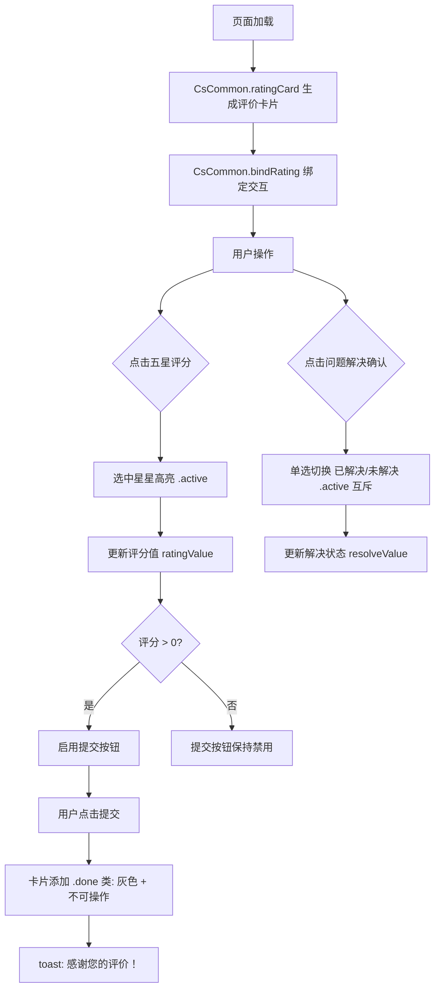

# 05-服务评价

> 页面：`user-rating.html` | 版本：V1.0 | 2026-07-05
> 数据源：原型 HTML 逐功能提取
> 跨端 ADR：ADR-0006（消息审核）

---

## 5.1 功能概述

服务评价是客服会话结束后，系统推送给用户的服务质量反馈入口。页面以会话消息流的形式展示完整的服务对话记录（含客服接入、咨询服务、用户确认问题解决、客服道别、会话结束通知），并在消息流底部嵌入评价卡片。

用户可对本次服务进行 1-5 星评分，并回答问题解决确认（"请问您的问题解决了吗?"，可选"已解决"/"未解决"，单选互斥）。评价卡片使用 `CsCommon.ratingCard()` 公共组件生成，交互通过 `CsCommon.bindRating()` 统一绑定。提交后卡片变灰标记为已完成，评分和解决状态数据可被后续的满意度分析系统消费。

页面同时保留了快捷卡片条和输入区（已结束态），用户可点击快捷栏查看演示提示，输入区处于 `disabled` 状态仅作展示。

---

## 5.2 页面结构

页面承载于 375px 宽的 `.cs-phone` 移动端容器内，从上到下分为五个区域：

| 区域 | 选择器 | 说明 |
|------|--------|------|
| 状态栏 | `CsCommon.statusBar()` | 公共组件注入 |
| 导航栏 | `.cs-nav-bar.chat-nav` | 左侧返回按钮 `.cs-back`、中间客服头像+名称 `.nav-peer`（头像"客"、名称"苏银豆客服"）、右侧更多按钮 `.nav-action`、胶囊按钮 `CsCommon.capsule()` |
| 消息列表 | `.chat-messages#chatMessages` | 含系统接入消息、客服问候语、用户确认消息、客服道别语、会话结束分隔线、评价卡片 |
| 快捷卡片条 | `.quick-cards-bar` | `CsCommon.quickCardsBar()` 公共组件注入，已结束中点击提示"已选择xxx卡片（演示）" |
| 输入工具栏 | `.chat-input-area` | 语音图标 + 输入框（disabled, placeholder="会话已结束，感谢您的咨询"） + 更多按钮 + 发送按钮 |

```
┌─ .cs-phone (375px) ─────────────────┐
│ [statusBar]                          │
│ [<返回] [客] [苏银豆客服] [···] [···]   │
├──────────────────────────────────────┤
│ .chat-messages#chatMessages          │
│  ├ .msg-system: 已为您接入苏银豆客服    │
│  ├ .msg-row agent: 问候语           │
│  ├ .msg-row user: 问题已解决        │
│  ├ .msg-row agent: 道别语           │
│  ├ .msg-system: 本次会话已结束       │
│  └ .msg-rating-card (评价卡片)      │
├──────────────────────────────────────┤
│ .quick-cards-bar (CsCommon注入)      │
├──────────────────────────────────────┤
│ .chat-input-area                     │
│  [🎤语音] [会话已结束...] [+] [发送]  │
└──────────────────────────────────────┘
```

---

## 5.3 操作流程

### 评价交互流程



---

## 5.4 字段与交互

### 5.4.1 评价卡片（CsCommon.ratingCard 公共组件）

| 字段名称 | 字段标识 | 字段类型 | 必填 | 数据类型 | 长度限制 | 默认值 | 校验规则 | 取值范围 | 来源 | 错误提示 |
|----------|----------|----------|------|----------|----------|--------|----------|----------|------|----------|
| 评分星级 | ratingStars | 按钮组 | 是 | Number | — | 0 | 点击选中，支持1-5星 | 1-5 | 用户操作 | — |
| 问题解决确认 | resolveValue | 单选按钮 | 否 | String | — | — | 单选互斥，点击切换 .active | resolved/unresolved | 用户操作 | — |
| 提交按钮 | ratingSubmit | 按钮 | — | — | — | 禁用 | 评分>0时启用 | — | 系统生成 | — |
| 已提交状态 | .done | CSS类 | — | — | — | 无 | 提交后添加，卡片灰色不可操作 | — | 系统生成 | — |
| 绑定标记 | data-bound | 属性 | — | String | — | 0 | 防重复绑定，绑定后设为1 | 0/1 | 系统生成 | — |

### 5.4.2 问题解决确认选项

| 选项文本 | 选项标识 | data-v | 选中配色 | 说明 |
|----------|----------|--------|----------|------|
| 已解决 | resolved | `resolved` | 绿（.s-done / success） | 用户问题得到解决 |
| 未解决 | unresolved | `unresolved` | 橙（.s-warn / orange） | 用户问题未解决 |

> 两个按钮单选互斥，选中一个自动取消另一个；与三色状态系统一致。问题左侧显示提问文案"请问您的问题解决了吗?"。
> 两个按钮**横排并排**显示（`.rc-resolve-btns` 用 `flex` + 每个按钮 `flex:1` 各占 50% 宽度，等宽居中），问题文案独占上一行。

### 5.4.3 会话消息流（静态展示）

| 消息序号 | 发送者 | 气泡类型 | 内容 |
|----------|--------|----------|------|
| 1 | 客服(夏) | .msg-bubble-agent | 您好，很高兴为您服务，请问还有什么可以帮您的吗？ |
| 2 | 用户(我) | .msg-bubble-user | 没有了，问题已经解决，谢谢！ |
| 3 | 客服(夏) | .msg-bubble-agent | 感谢您的咨询，祝您生活愉快！欢迎下次再来～ |

> 注：原"已为您接入苏银豆客服"与"本次会话已结束"系统消息已移除——接入由人工客服问候语体现，会话结束由客服道别语体现，避免冗余。

### 5.4.4 输入区状态（已结束态）

| 字段名称 | 字段标识 | 字段类型 | 必填 | 数据类型 | 长度限制 | 默认值 | 校验规则 | 取值范围 | 来源 | 错误提示 |
|----------|----------|----------|------|----------|----------|--------|----------|----------|------|----------|
| 输入框 | msgInput | 文本输入 | 否 | — | — | disabled | 已结束态不可输入 | — | 系统状态 | — |
| 输入框占位符 | placeholder | 文本 | — | String | — | 会话已结束，感谢您的咨询 | — | — | 系统配置 | — |
| 更多按钮 | moreIcon | 按钮 | — | — | — | 显示 | 点击toast: 会话已结束，如需帮助请重新发起咨询 | — | 用户操作 | — |

### 5.4.5 快捷卡片条（已结束态）

| 字段名称 | 字段标识 | 字段类型 | 必填 | 数据类型 | 长度限制 | 默认值 | 校验规则 | 取值范围 | 来源 | 错误提示 |
|----------|----------|----------|------|----------|----------|--------|----------|----------|------|----------|
| 快捷栏点击 | quickCards | 按钮组 | — | — | — | — | 已结束中点击提示"已选择xxx卡片（演示）" | — | 用户操作 | — |

### 5.4.6 顶栏更多按钮

| 字段名称 | 字段标识 | 字段类型 | 必填 | 数据类型 | 长度限制 | 默认值 | 校验规则 | 取值范围 | 来源 | 错误提示 |
|----------|----------|----------|------|----------|----------|--------|----------|----------|------|----------|
| 更多按钮 | moreHeaderBtn | 按钮 | — | — | — | 显示 | 点击toast: 更多：转人工 · 结束会话 · 投诉建议 | — | 用户操作 | — |

### 5.4.11 评价卡片（已过期态）

会话关闭超过评价有效期后（如会话关闭 N 天后），用户再次进入会话时评价卡片以**已过期禁用态**展示，不可再评价。由 `CsCommon.ratingCardExpired()` 生成（结构同正常评价卡片，整体加 `.expired` 类）。

| 字段名称 | 字段标识 | 字段类型 | 必填 | 数据类型 | 长度限制 | 默认值 | 校验规则 | 取值范围 | 来源 | 错误提示 |
|----------|----------|----------|------|----------|----------|--------|----------|----------|------|----------|
| 过期态类名 | `.expired` | CSS类 | — | — | — | 无 | 卡片整体灰色（背景 #fafafa、opacity 0.75） | — | 系统生成 | — |
| 副标题文案 | rc-sub | 文本 | — | String | — | 该会话评价已过期 | — | — | 系统配置 | — |
| 星级 | ratingStars | 按钮组 | — | — | — | 浅灰显示 | 不可点击（`pointer-events: none`） | — | 系统生成 | — |
| 解决确认按钮 | rc-resolve-btn | 按钮 | — | — | — | 灰色禁用 | `disabled`，不可点击 | — | 系统生成 | — |
| 提交按钮 | ratingSubmit | 按钮 | — | — | — | 灰色禁用 | `disabled`，文案"评价已过期" | — | 系统生成 | — |

---

## 5.5 业务规则

| 规则编号 | 规则描述 |
|----------|----------|
| RULE-RATING-001 | 评价卡片由 `CsCommon.ratingCard()` 公共组件生成，交互由 `CsCommon.bindRating(container)` 统一绑定 |
| RULE-RATING-002 | 评分范围 1-5 星，点击星星选中 `.active` 高亮，再次点击可改变评分 |
| RULE-RATING-003 | 问题解决确认单选互斥：点击"已解决"或"未解决"按钮选中 `.active`，自动取消另一按钮；可重复点击同一按钮保持选中（不取消） |
| RULE-RATING-004 | 提交按钮启用条件：评分 > 0；问题解决确认非必填；未满足评分条件时按钮禁用 |
| RULE-RATING-005 | 评价提交后卡片添加 `.done` 类：颜色变灰、所有交互元素不可操作（pointer-events: none） |
| RULE-RATING-006 | 评价提交后 toast 提示"感谢您的评价！" |
| RULE-RATING-007 | 防重复绑定：`CsCommon.bindRating()` 通过 `card.dataset.bound === '1'` 判断是否已绑定 |
| RULE-RATING-008 | 会话消息流为静态展示，不可交互（非实时聊天） |
| RULE-RATING-009 | 输入框处于 `disabled` 状态，placeholder 显示"会话已结束，感谢您的咨询" |
| RULE-RATING-010 | 输入区"更多"按钮点击 toast 提示"会话已结束，如需帮助请重新发起咨询" |
| RULE-RATING-011 | 顶栏"更多"按钮点击 toast 提示"更多：转人工 · 结束会话 · 投诉建议" |
| RULE-RATING-012 | 快捷栏在已结束态点击仅提示"已选择xxx卡片（演示）"，不执行实际卡片发送 |
| RULE-RATING-013 | **一次会话仅允许推送一张评价卡片**。一次会话定义为：从接入人工客服开始，到会话结束（客服主动结束 / 超时自动关闭）这个完整动作。无论评价卡片由"会话结束自动推送"还是"客服中途手动推送"产生，整个会话内评价卡片最多出现一次 |
| RULE-RATING-014 | **手动推送优先，自动推送去重**：若客服在会话进行中已手动推送过评价卡片，则会话结束（含超时自动关闭）时**不再自动推送**评价卡片；反之，若会话期间未手动推送，则在会话结束时自动推送一张。系统需在推送前检查当前会话是否已存在评价卡片 |
| RULE-RATING-015 | **评价过期态**：会话关闭超过评价有效期（如 N 天）后，用户再次进入该会话时，评价卡片以已过期禁用态展示（`.expired` 类：整体灰色、所有交互元素 `pointer-events: none` / `disabled`），用户无法再进行评分/选择/提交 |
| RULE-RATING-016 | 过期态卡片由 `CsCommon.ratingCardExpired()` 生成，结构与正常评价卡片一致（仅追加 `.expired` 类），副标题显示"该会话评价已过期"，提交按钮文案变为"评价已过期" |

---

## 5.6 页面跳转

**入口**：
- 聊天页 `user-chat-basic.html` 客服结束会话 → **检查本会话是否已推送过评价卡片**（见 RULE-RATING-014）：未推送则推送评价卡片 → 会话关闭后跳转至本页；已推送过则跳过自动推送，直接关闭跳转
- 聊天页 input 更多面板"结束会话" → 延迟 800ms 跳转至 `user-rating.html`（同样遵循去重规则）
- 超时自动关闭 → **检查本会话是否已推送过评价卡片**：未推送则推送后跳转本页，已推送过则直接跳转
- 客服中途手动推送评价卡片（工作台侧主动发起）→ 仅记录"本会话已推送评价"，不立即跳转，待会话真正结束时按上述规则判定是否跳转本页

**出口**：
- 返回按钮 → `history.back()`