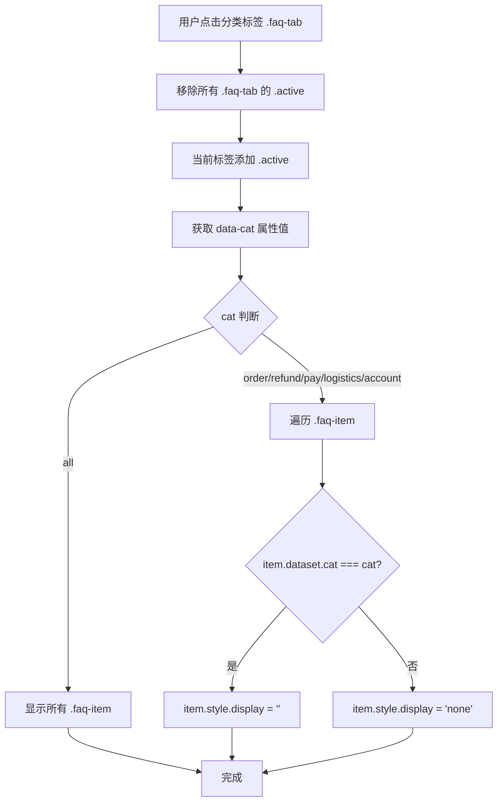
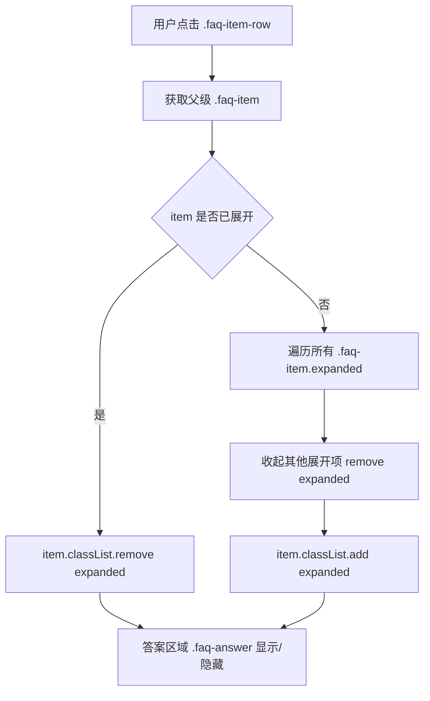
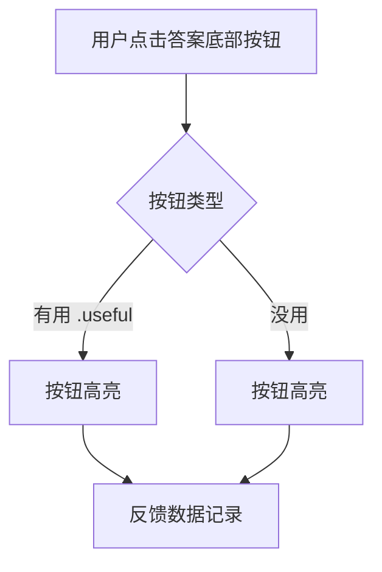
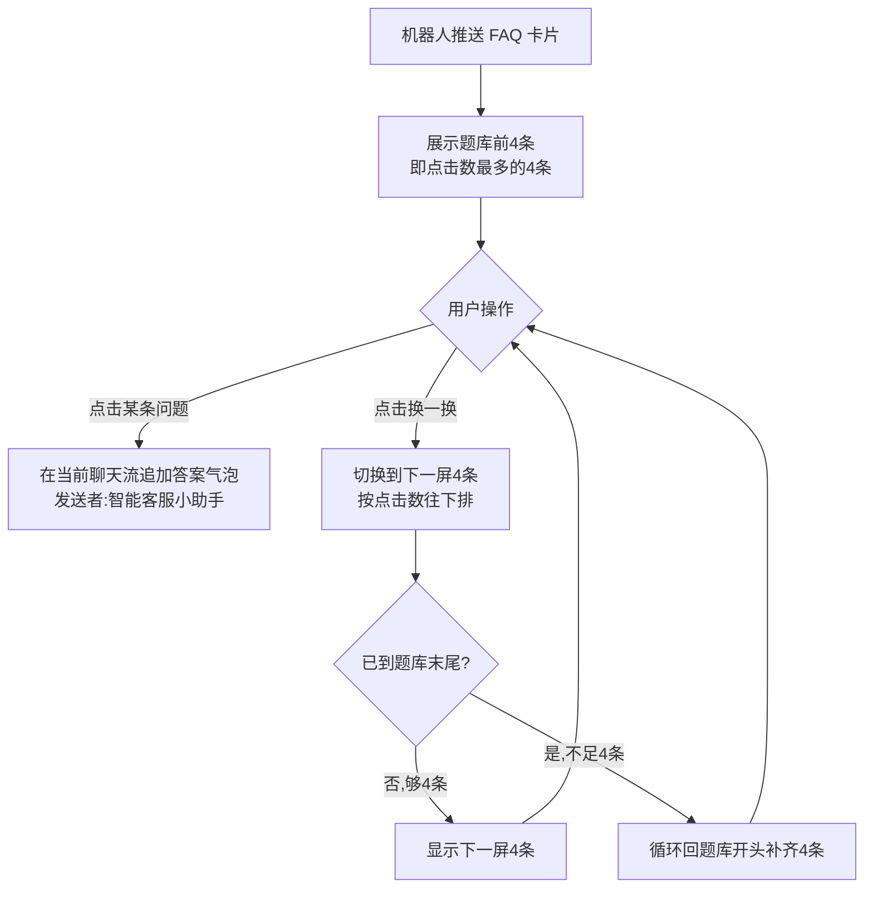

# 06-FAQ机器人客服

> 页面：`user-faq.html` | 版本：V1.0 | 2026-07-05
> 数据源：原型 HTML 逐功能提取
> 需求编号：US-MVP-24

---

## 6.1 功能概述

FAQ 机器人客服页（帮助中心）是用户自助解决问题的入口，提供 6 大分类、9 条常见问题。用户可通过搜索框输入关键词实时过滤 FAQ 列表（匹配问题标题和答案内容），无匹配时显示"未找到相关问题，请尝试其他关键词"。支持分类标签筛选 FAQ、点击问题展开答案气泡，并对答案进行"有用/没用"反馈。

页面底部固定"联系客服"入口，用户在 FAQ 中无法找到答案时可一键跳转聊天页并自动转人工。

---

## 6.2 页面结构

页面承载于 375px 宽的 `.cs-phone` 移动端容器内，从上到下分为：

| 区域 | 选择器 | 说明 |
|------|--------|------|
| 状态栏 | `CsCommon.statusBar()` | 公共组件注入 |
| 导航栏 | `.cs-nav-bar` | 左侧返回按钮 `.cs-back`、标题"帮助中心"、胶囊按钮 `CsCommon.capsule()` |
| 搜索栏 | `.faq-search` | 搜索图标 + 输入框 |
| 分类标签 | `.faq-tabs` | 横向滚动 6 个分类标签（全部/订单/退换货/支付/物流/账户），点击切换筛选 |
| FAQ 列表 | `.faq-list` | 9 条 FAQ 问答，可展开/收起 |
| 底部入口 | `.contact-section` | "没有找到答案？联系在线客服..." 卡片 |

```
┌─ .cs-phone (375px) ─────────────────┐
│ [statusBar]                          │
│ [<返回] 帮助中心 [···]              │
├──────────────────────────────────────┤
│ [🔍 搜索输入框]                       │
├──────────────────────────────────────┤
│ .faq-tabs                            │
│ [全部][订单][退换货][支付][物流][账户] │
├──────────────────────────────────────┤
│ .faq-list                            │
│  ├ .faq-item[data-cat=refund]       │
│  ├ .faq-item[data-cat=order]        │
│  ├ ... (9条FAQ)                     │
│  └ .faq-item[data-cat=refund]       │
├──────────────────────────────────────┤
│ .contact-section                     │
│  没有找到答案？联系在线客服...        │
└──────────────────────────────────────┘
```

---

## 6.3 操作流程

### 6.3.1 FAQ 分类筛选流程



### 6.3.2 FAQ 答案展开/收起流程



补充说明：
- 采用单展开模式（accordion），同一时间最多只有一个 FAQ 处于展开状态
- 展开后 `.faq-item` 添加 `.expanded` 类，边框变为主色、带阴影
- `.faq-answer` 默认 `display: none`，`.expanded .faq-answer` 设为 `display: block`

### 6.3.3 答案反馈流程



---

## 6.4 字段与交互

### 6.4.1 搜索栏

| 字段名称 | 字段标识 | 字段类型 | 必填 | 数据类型 | 长度限制 | 默认值 | 校验规则 | 取值范围 | 来源 | 错误提示 |
|----------|----------|----------|------|----------|----------|--------|----------|----------|------|----------|
| 搜索输入框 | faqSearchInput | 文本输入 | 否 | String | — | 空 | 输入时实时过滤 FAQ 列表（匹配问题标题+答案内容） | 任意文本 | 用户输入 | — |
| 空结果提示 | faqNoResult | 文本 | — | String | — | 未找到相关问题，请尝试其他关键词 | 全部不匹配时显示 | — | 动态生成 | — |

### 6.4.2 分类标签

| 字段名称 | 字段标识 | 字段类型 | 必填 | 数据类型 | 长度限制 | 默认值 | 校验规则 | 取值范围 | 来源 | 错误提示 |
|----------|----------|----------|------|----------|----------|--------|----------|----------|------|----------|
| 分类标签 | faqTab | 按钮 | — | — | — | 全部.active | 点击切换筛选 | 全部/订单/退换货/支付/物流/账户 | 系统配置 | — |
| 激活状态 | .active | CSS类 | — | — | — | 蓝色填充白字 | — | — | 系统生成 | — |

### 6.4.3 FAQ 问答列表

| 字段名称 | 字段标识 | 字段类型 | 必填 | 数据类型 | 长度限制 | 默认值 | 校验规则 | 取值范围 | 来源 | 错误提示 |
|----------|----------|----------|------|----------|----------|--------|----------|----------|------|----------|
| FAQ条目 | faqItem | 容器 | — | — | — | 收起 | 点击展开/收起，单展开模式 | — | 系统生成 | — |
| 所属分类 | data-cat | 属性 | 是 | String | — | — | 用于分类筛选 | order/refund/pay/logistics/account | 系统配置 | — |
| 问题文本 | faqQuestion | 文本 | — | String | — | — | — | — | 系统配置 | — |
| 答案文本 | faqAnswer | 文本 | — | String | — | — | 展开时显示 | — | 系统配置 | — |
| 展开状态 | .expanded | CSS类 | — | — | — | 无 | 单展开模式 | — | 系统生成 | — |
| 有用按钮 | .useful | 按钮 | — | — | — | 蓝色主色 | 点击高亮 | — | 用户操作 | — |
| 没用按钮 | unnamed | 按钮 | — | — | — | 白色 | 点击高亮 | — | 用户操作 | — |

### 6.4.4 FAQ 问答内容

| 序号 | 分类 | 问题 | 答案摘要 |
|:----:|------|------|----------|
| 1 | refund | 如何申请七天无理由退货？ | 我的订单→申请售后→退货退款，商品需保持全新未使用 |
| 2 | order | 订单显示"已发货"但查不到物流信息？ | 物流单号2-4小时内更新，超24小时可联系客服 |
| 3 | refund | 退款多久能到账？ | 支付宝/微信1-3工作日，银行卡3-7工作日，余额即时 |
| 4 | pay | 支持哪些支付方式？ | 微信/支付宝/银联云闪付/信用卡分期/余额 |
| 5 | pay | 支付时提示"交易关闭"怎么办？ | 超30分钟自动关闭，重新下单或重新支付 |
| 6 | order | 可以修改或取消已下的订单吗？ | 待付款直接取消，已付款未发货申请取消，已发货无法取消 |
| 7 | logistics | 可以修改收货地址吗？ | 未发货可修改，已发货联系快递员改派 |
| 8 | account | 忘记登录密码怎么找回？ | 登录页→忘记密码→手机验证→设置新密码 |
| 9 | refund | 收到的商品有质量问题如何处理？ | 签收后7天内申请售后，上传照片/视频凭证 |

### 6.4.5 答案气泡

| 字段名称 | 字段标识 | 字段类型 | 必填 | 数据类型 | 长度限制 | 默认值 | 校验规则 | 取值范围 | 来源 | 错误提示 |
|----------|----------|----------|------|----------|----------|--------|----------|----------|------|----------|
| 答案气泡 | faqAnswerBubble | 容器 | — | — | — | 隐藏 | 展开时显示 | — | 系统生成 | — |
| 答案标签 | .label | 徽标 | — | String | — | 答 | 绿色徽标 | — | 系统配置 | — |
| 答案样式 | 绿底边框 | 视觉 | — | — | — | #f6ffed背景+d9f7be边框+绿色左边框 | — | 系统配置 | — |

### 6.4.6 底部入口

| 字段名称 | 字段标识 | 字段类型 | 必填 | 数据类型 | 长度限制 | 默认值 | 校验规则 | 取值范围 | 来源 | 错误提示 |
|----------|----------|----------|------|----------|----------|--------|----------|----------|------|----------|
| 联系客服按钮 | btnContactAgent | 按钮 | — | — | — | — | 点击跳转 user-chat-basic.html?entry_tag=help&auto_transfer=1 | — | 用户操作 | — |
| 标题文案 | contactTitle | 文本 | — | String | — | 没有找到答案？ | — | — | 系统配置 | — |
| 描述文案 | contactDesc | 文本 | — | String | — | 联系在线客服，我们将为您解答 | — | — | 系统配置 | — |

---

## 6.5 业务规则

| 规则编号 | 规则描述 |
|----------|----------|
| RULE-FAQ-001 | FAQ 答案采用单展开模式（accordion）：展开一个 FAQ 时自动收起其他已展开的 FAQ |
| RULE-FAQ-002 | 分类筛选：点击分类标签后，遍历所有 `.faq-item`，`data-cat` 匹配的显示，不匹配的隐藏 |
| RULE-FAQ-003 | 分类标签"全部"对应 `data-cat="all"`，显示所有 FAQ 条目 |
| RULE-FAQ-004 | FAQ 条目包含 9 条问题，覆盖 6 大分类：订单(2)、退换货(3)、支付(2)、物流(1)、账户(1) |
| RULE-FAQ-005 | 答案气泡采用绿色系样式：背景 `#f6ffed`、边框 `#d9f7be`、左侧 3px 绿色实线 |
| RULE-FAQ-006 | 答案底部"有用/没用"按钮为演示交互，点击高亮，无实际数据提交 |
| RULE-FAQ-007 | 搜索框输入时实时过滤 FAQ 列表：匹配问题标题（`.faq-question`）和答案内容（`.faq-answer-bubble`），不区分大小写；全部不匹配时显示空状态提示"未找到相关问题，请尝试其他关键词"；清空搜索框恢复全部显示 |
| RULE-FAQ-008 | 底部"联系客服"卡片（`.contact-section`）点击跳转 `user-chat-basic.html?entry_tag=help&auto_transfer=1`，进入聊天页后自动转人工 |
| RULE-FAQ-009 | 分类标签栏横向滚动，隐藏滚动条，适配移动端触控滑动 |
| RULE-FAQ-010 | 展开的 FAQ 条目添加 `.expanded` 类：边框变为主色、带阴影 `box-shadow: 0 2px 8px rgba(238,10,36,0.08)` |

---

## 6.6 页面跳转

**入口**：
- 聊天页 `user-chat-basic.html` 快捷栏点击 FAQ 卡片 → `user-faq.html`
- 客服入口 `entry_tag=help` → `user-faq.html`
- 首页 `index.html` → 原型入口链接

**出口**：
- 返回按钮 → `history.back()`
- 底部"联系客服" → `user-chat-basic.html?entry_tag=help&auto_transfer=1`

---

## 6.7 聊天 FAQ 卡片（会话内机器人推送）

> 本节描述聊天消息流里的 FAQ 卡片（`CsCommon.cardHtml('faq')` 生成、右上角带"换一换"按钮），区别于 §6.1–6.6 描述的帮助中心页（`user-faq.html`）。FAQ 卡片在多个入口的机器人接待阶段自动推送（见 `02-聊天主界面.md` 与 `user-chat-basic.html` 的 SCENES 映射：home/cart/profile/refund_list/help 等入口均推送 FAQ 卡片）。

### 6.7.1 题库与排序

| 字段 | 说明 |
|------|------|
| 题库 `FAQ_LIBRARY` | 9 条问答，取自本文件 §6.4.4 的 FAQ 问答内容表（问题 + 答案） |
| 排序规则 | **按"用户点击次数"从高到低排序**——点击次数最多的问题排在最前，优先展示给用户 |
| 单卡数量 `FAQ_PAGE_SIZE` | 一张 FAQ 卡片**显示 4 条问题** |

### 6.7.2 操作流程



### 6.7.3 业务规则

| 规则编号 | 规则描述 |
|----------|----------|
| RULE-CHATFAQ-001 | 聊天 FAQ 卡片的题库为 `FAQ_LIBRARY`（9 条问答），题库内容与 §6.4.4 帮助中心问答一致 |
| RULE-CHATFAQ-002 | 题库按**用户点击次数从高到低排序**；点击次数越多的问题越靠前，优先展示 |
| RULE-CHATFAQ-003 | 一张 FAQ 卡片显示 **4 条**问题（`FAQ_PAGE_SIZE = 4`） |
| RULE-CHATFAQ-004 | 点击 FAQ 卡片内任意一条问题，**直接在当前聊天消息流追加该问题的答案气泡**（发送者显示"智能客服小助手"），不跳转页面、不弹窗 |
| RULE-CHATFAQ-005 | 答案气泡使用与客服消息一致的 `.msg-bubble-agent` 样式，包含头像、发送者名称、答案文本、时间戳 |
| RULE-CHATFAQ-006 | 点击"换一换"按钮，切换到**下一屏 4 条**问题（按点击数顺序往下取） |
| RULE-CHATFAQ-007 | 换一换采用**循环机制**：当剩余问题不足 4 条时，从题库开头补齐（如 9 条题库：第 1 屏 1–4、第 2 屏 5–8、第 3 屏 9+1+2+3 循环补齐） |
| RULE-CHATFAQ-008 | 换一换切换到新一屏后，对新显示的问题重新绑定点击事件（点击仍推送答案到聊天流） |
| RULE-CHATFAQ-009 | 换一换按钮的图标每次切换时旋转 360°（视觉反馈） |
