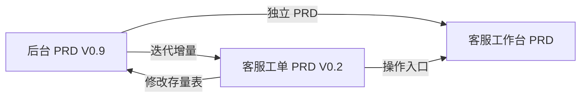

# OCS 客服后台 — PRD 索引

> 最后更新：2026-09-01

## 目录结构

```
PRD/
├── README.md                          # 本文件
├── 后台/
│   ├── PRD-后台-V0.9.md               # 当前版本（11 模块）
│   ├── archive/                       # 历史版本
│   └── research/                      # 竞品分析等输入文档
├── 客服工单/
│   ├── PRD-客服工单-V0.7.md           # 当前版本(2026-09-01 开发评审后修订)
│   ├── PRD-工作台转工单-V0.1.md       # 增量 PRD
│   ├── PRD-会话记录创建工单-V0.1.md   # 增量 PRD
│   ├── archive/                       # 历史版本(含 CHANGES-V0.2.md 旧改动清单)
│   └── research/
└── 客服工作台/
    └── PRD-客服工作台.md               # 待建
```

## 模块概览

| 模块 | 当前版本 | 状态 | 依赖 |
|------|---------|------|------|
| 后台 | [V0.9](后台/PRD-后台-V0.9.md) | ✅ 评审稿 | — |
| 客服工单 | [V0.7](客服工单/PRD-客服工单-V0.7.md) | ✅ 评审稿(2026-09-01 开发评审后修订) | 后台 V0.9 |
| 客服工作台 | — | ⬜ 待建 | 后台 V0.9 |

## 模块关系



- **后台 V0.9** 定义基础架构：会话状态机、角色体系（R-A/R-S）、通知通道、仪表盘、配置表 `customer_chat_settings`
- **客服工单 V0.2** 是后台 V0.9 的迭代增量，在现有基础设施上新建工单实体 + SLA 引擎 + 会话协同

## 版本历史

### 后台
| 版本 | 文件 | 说明 |
|------|------|------|
| V0.9 | `后台/PRD-后台-V0.9.md` | 当前版本，11 模块 |
| V0.8 | `后台/archive/PRD-后台-V0.8.md` | — |
| V0.7 | `后台/archive/PRD-后台-V0.7.md` | — |
| V0.6 | `后台/archive/PRD-后台-V0.6.md` | — |

### 客服工单
| 版本 | 文件 | 说明 |
|------|------|------|
| V0.7 | `客服工单/PRD-客服工单-V0.7.md` | 当前版本，2026-09-01 开发评审(十八轮)修订：联系方式手动维护/发起售后不带字段/供应链SKU命名/操作日志与历史版本不做等 |
| V0.6 | `客服工单/archive/PRD-客服工单-V0.6.md` | 十七轮简化稿(2026-07-28) |
| V0.2 | `客服工单/archive/PRD-客服工单-V0.2.md` | 修正 V0.1 矛盾 + 对齐后台 PRD |
| V0.1 | `客服工单/archive/PRD-工单系统-V0.1.md` | 首版（已废弃），更名为「客服工单」 |

## 相关调研

| 文档 | 路径 |
|------|------|
| 后台竞品分析 | `后台/research/竞品分析-后台-V0.9.md` |
| 工单系统竞品调研 | `客服工单/research/竞品调研-工单系统-V0.1.md` |
