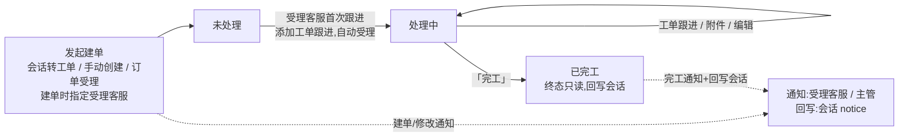
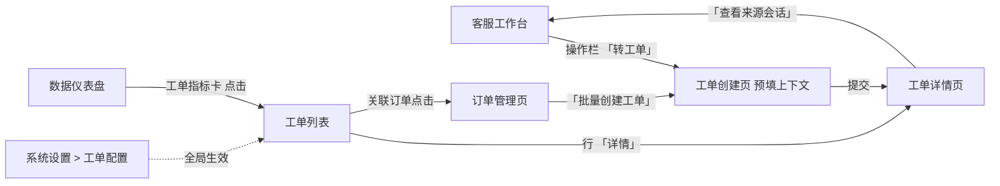
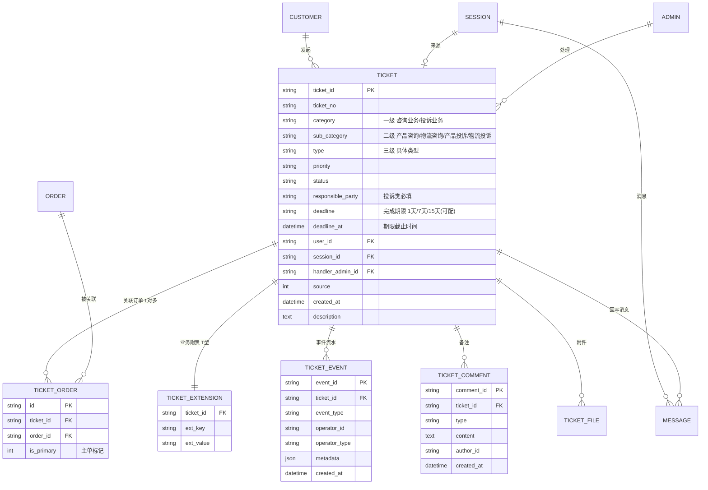

# PRD-客服工单-V0.7

> **版本**: V0.7 | **日期**: 2026-09-01 | **状态**: 评审稿(开发评审后修订)
>
> **原型目录**: `prototype/admin/` (`admin-ticket.html` / `admin-ticket-create.html` / `admin-ticket-detail.html` / `admin-ticket-settings.html` / `admin-order-list.html` / `admin-workbench.html`)
>
> **依据**: 《商城客服工单需求-20260721.pptx》→《PPT转换-商城客服工单业务需求文档-V1.5.md》(BRD V1.5)、《7月21日09:16 面聊纪要》、《PRD-后台-V0.9.md》、《2026-09-01 客服工单开发评审》(视频纪要 + 音频转写,十八轮)
>
> **归档**: 历史版本见 `PRD/客服工单/archive/`,本稿为现行版本。
>
> **核心口径**:
> - 三级分类:`category`(一级 受理业务类型) + `sub_category`(二级 咨询/投诉类别) + `type`(三级 具体类型),字典后台可配,初始字典取自 BRD §4.4。
> - 完成期限代替 SLA:`deadline`(1天/7天/15天,设置页可配)+ `deadline_at` 自动计算;列表/详情倒计时,超时标记,cron 每 30 分钟扫描并通知处理人+主管。
> - 受理客服与状态流转(2026-07-28 十七轮简化):建单时指定**受理客服**(跟进人,取代原「指派」动作);**取消手动「受理」**,受理客服首次跟进(添加工单跟进)时状态自动转为处理中;3 态状态机(未处理 / 处理中 / 已完工),已完工=终态只读。
> - **十八轮(2026-09-01 开发评审)修订**:① **联系方式改为客服手动维护**(C1)——不自动带出订单收货地址、不随订单增删联动,新联系人仅一条;② **发起售后不带任何字段**(C2,售后监控未预留关联字段;发起补偿仍带工单号);③ 受理客服下拉取商城运营后台权限系统**「客服」角色**用户列表(C3);④ 工单描述**限 200 字符**、**历史版本不做**、**操作日志 UI 1 期不开发**(O2/O5,底层事件流水保留,待统一操作日志系统);⑤ 列表多订单显示「+X」点击弹小弹窗、关联订单拆主/子两列、来源类型显示口径(O3);⑥ 商品字段统一命名**「供应链SKU编码 / 供应链商品名称」**(O4,不单列物流编码);⑦ 责任承担方**仅投诉类展示**(O7);⑧ 协助部门含**客服部=无需协助**、按部门角色反查、一人一部门(O8);⑨ 批量创建仅订单列表顶部一个按钮(O9,原型已就绪)。
> - 业务字段:企业名称 + 商城名称(订单/会话建单自动带出,手工建单下拉选择,均必填)+ 反馈方式(必填)+ 协助部门(必填)+ 二次投诉。
> - 工单为内部处理,用户不可见(消费者自助建单 2 期);会话转工单限人工处理过的会话;工单-订单 1 对多。

---

## 总览:工单状态机与操作流程

**总状态机**(3 态;受理客服建单时指定,首次跟进自动转处理中,已完工=终态只读):

```mermaid
stateDiagram-v2
    [*] --> 未处理: 创建(会话转/手动/订单受理;指定受理客服)
    未处理 --> 处理中: 首次跟进(受理客服添加工单跟进,自动受理)
    处理中 --> 处理中: 催办(人工+超时自动)
    处理中 --> 已完工: 完工(终态只读)
    已完工 --> [*]
```



**总操作流程**(端到端:发起(指定受理客服) → 首次跟进自动受理 → 处理 → 完工,全程通知/回写):



> 一句话口径:**创建即未处理(建单时已指定受理客服);受理客服首次跟进自动转处理中;完工即终态,继续处理须新建工单。** 详细转换表(守卫条件/执行角色)见 §六.1,单据字段级流转见 §十一。

---

## 零、对存量系统的改动清单

> **原则**:客服工单是 OCS 客服后台 V0.9 的**迭代增量**。区分「新建」与「改动现有」。

| 序号 | 动作 | 对象 | 说明 |
|------|------|------|------|
| 0.1 | **新建表** | `customer_chat_tickets` | 工单主表(含 `category` / `sub_category` / `type` 三级 / `responsible_party` / `deadline` / `deadline_at`,见三.2.1) |
| 0.2 | **新建表** | `customer_chat_ticket_events` | 工单事件流水(底层保留;**操作日志 UI 1 期不开发**,待统一操作日志系统——2026-09-01 评审 O5) |
| 0.3 | **新建表** | `customer_chat_ticket_comments` | 工单备注(内部) |
| 0.4 | **新建表** | `customer_chat_ticket_extensions` | 工单业务附表(T 型:联系方式 / 订单快照 / 业务字段) |
| 0.5 | **新建表** | `customer_chat_ticket_orders` | **工单-订单关联表(1 对多)**,支持批量追加 |
| 0.6 | **改现有表** | `customer_chat_messages` | + `ticket_id varchar(32) NULL FK→tickets` |
| 0.7 | **改现有表** | `customer_chat_sessions` | + `ticket_id varchar(32) NULL FK→tickets` |
| 0.8 | **新建 API** | `/api/backend/ticket/*` | 工单 CRUD + 分派 + 受理 + 备注 + 催办 + 导出(见十二) |
| 0.9 | **改现有 API** | `/api/backend/session/end` | 结束原因枚举增加 `converted_to_ticket` |
| 0.10 | **扩展 cron** | `internal/cron/cron.go` | + `ticketDeadlineCheck`(每 30 分钟,到期扫标记+通知)(十七轮:取消轮询自动分派 `ticketAutoAssign`,受理客服建单时指定) |
| 0.11 | **新建页面** | `admin-ticket.html` | 工单列表页(状态分栏 + 三级分类筛选 + 完成期限筛选 + 倒计时列) |
| 0.12 | **新建页面** | `admin-ticket-detail.html` | 工单详情独立页(列表行「详情」进入;含催办 / 附件 / 倒计时 / 受理) |
| 0.13 | **扩展页面** | `admin-ticket-settings.html` | 工单设置页(三级分类 + 责任承担方 + 优先级 + **完成期限值** 增删改) |
| 0.14 | **扩展页面** | `admin-dashboard.html` | + 工单指标卡 |
| 0.15 | **改工作台** | `admin-workbench.html` | 操作栏 +「转工单」+「受理」按钮;右栏 +「该客户工单」区;**由工作台负责人另排,属 1 期范围** |
| 0.16 | **已就绪(1 期)** | `admin-order-list.html` | 订单列表「批量创建工单」(工具栏,勾选 ≥1 单)→建单入口(创建方式③,已在原型实现;原行内「创建工单」已去除,仅保留批量) |
| 0.17 | **新建页面** | `admin-ticket-create.html` | 工单创建独立页(standalone / order / batch 三模式,预填会话或订单上下文;三级分类级联 + 批量追加订单) |

---

## 一、范围边界

| 范围 | 内容 |
|------|------|
| **In Scope (1 期)** | 工单列表与查询 / 工单详情与处理 / **会话转工单** / 工单分派(手动 + 轮询) / **「受理」操作** / 工单回写会话通知 / **三级分类 + 责任承担方配置** / **受理字段族 + 订单自动带出** / **批量追加订单(1 对多)** / **催办** / **附件上传** / **完成期限+倒计时+超时通知** / 仪表盘扩展工单指标卡 / **订单列表页「创建工单」建单** / **工作台工单入口同步**(由工作台负责人另排) |
| **Out Scope(本期不做)** | **消费者侧自助提交工单**(2 期);**触发式自动建单 / AI 智能建单**(2 / 3 期);**规则型分配**(按类型 / 项目 / 客户等级 / 技能,2 期);轮次响应 / 关单确认 / 母子工单 / 审批 / 技能组分派 / 流转触发器 / 完整报表 / OMS 深度集成(退款退货换货直连);**工单评价**(2 期) |

> **定位**:客服工单是 OCS 客服后台 **V0.9 的迭代增量**,在已有会话 / 客户 / 通知 / 角色基础设施上,增加「工单」事务实体 + 会话协同接口。会话解决即时问题,工单承接需跨部门 / 需订单系统操作的售后问题(退款 / 退货 / 换货 / 投诉 / 补发 / 价格干预)。
>
> **本期工单为内部处理,用户不可见**(消费者自助建单 2 期)。以完成期限(1天/7天/15天,设置页可配)代替 SLA,到期倒计时提醒 + 超时自动标记 + 通知处理人与主管 + 人工催办。

### 一.1 角色列表

| 代号 | 角色 | 客服工单职责 |
|------|------|-------------|
| R-A | 客服 | 会话转工单、处理工单、工单跟进(首次跟进自动受理)、催办、回复用户(跳工作台)、发起售后/补偿、完工、上传附件 |
| R-S | 客服主管 | 查看全部工单、工单分类 / 责任承担方 / 完成期限值配置、催促跟进、催办、导出;2 期含审批 |
| R-C | 终端用户 | (本期工单为内部处理,用户不可见,无操作;消费者自助建单 2 期) |
| R-SYS | 系统 | 状态自动流转、回写会话通知、建单/修改通知、超时扫描通知 |

> **审计口径**(ADR-0001):工单每次状态迁移通过 `ticket_event` 记录,`operator_type` 区分 `admin` / `customer` / `system`。
>
> **数据可见性**(ADR-0002):R-A 仅见分配给自己的工单;R-S 见全部。
>
> **协助部门可见性**:工单填写协助部门后,该部门与客服部同时可见该工单数据(用于跨部门协同跟进,如物流部协助处理物流类工单)。
>
> **协助部门权限实现**(2026-09-01 评审 O8):系统无部门级权限,通过**新增固定角色「商品部 / 商务部 / 物流部」**并绑定对应人员账号实现;工单按「协助部门」字段**反查**拥有该角色的用户进行展示。约束:角色名称固定不可改;人员变动由管理员调整角色绑定;一人仅归属一个部门。选**客服部 = 无需协助**,仅客服自身可见。

---

## 二、页面清单

| 序号 | 页面名称 | 文件名 | 状态 | 说明 |
|------|----------|--------|------|------|
| 1 | 工单列表 | admin-ticket.html | ✅ 已建 | 商城运营后台「订单与售后 > 客服工单」(状态分栏 + 三级分类筛选 + 完成期限筛选 + 倒计时列) |
| 2 | 工单详情 | admin-ticket-detail.html | ✅ 已建 | 独立页(列表行「详情」进入),含催办 / 附件 / 倒计时 / 受理 / 新联系字段 |
| 3 | 工单创建 | admin-ticket-create.html | ✅ 已建 | 独立建单页(standalone / order / batch 三模式,预填上下文) |
| 4 | 工单配置 | admin-ticket-settings.html | ✅ 已建 | 商城运营后台「系统设置 > 工单配置」:三级分类 + 责任承担方 + 优先级 + 完成期限值 增删改 |
| 5 | 订单列表 | admin-order-list.html | ✅ 已建 | 订单「批量创建工单」(工具栏)→建单入口(1 期可用) |
| 6 | 客服工作台 | admin-workbench.html | 🔧 改现有 | 操作栏 +「转工单」+「受理」;右栏 +「该客户工单」区;**由工作台负责人另排** |

### 二.1 页面跳转关系



> 工单列表 / 工单创建 / 工单详情均为独立页,页面骨架 = **商城运营后台**(白顶栏 + 自有侧边栏 + 页签栏)。工单属「订单与售后」模块:侧边栏分组内顺序 = 订单列表 → 客服工单,两页互跳;从客服模块菜单进入时跨系统新开页签。工单配置挂「系统设置」分组。「订单列表 / 客服工单 / 工单配置」3 个菜单带 **V1.5 角标**。

---

## 三、实体关系总览

### 三.1 核心实体 ER 图



### 三.2 字段说明

#### 三.2.1 工单主表 (`customer_chat_tickets`)

| 序号 | 字段名 | 显示名 | 类型 | 必填 | 校验 / 默认 | 来源 / 口径 |
|------|--------|--------|------|------|-----------|-----------|
| 1 | ticket_id | 工单 ID | varchar(32) PK | 是 | 系统生成 | 系统生成 |
| 2 | ticket_no | 受理编号 | varchar(32) UK | 是 | `#TK` + yyyyMMdd + 6 位序号 | 系统生成;创建后不可修改(BRD §4.2) |
| 3 | category | 受理业务类型(一级) | varchar(10) | 是 | 咨询业务 / 投诉业务 | 创建时选(见三.3) |
| 4 | sub_category | 咨询/投诉类别(二级) | varchar(20) | 是 | 联动一级:产品咨询/物流咨询/产品投诉/物流投诉(BRD §4.4 字典) | 创建时选(见三.3) |
| 5 | type | 具体咨询/投诉类型(三级) | varchar(30) | 是 | 联动二级(BRD §4.4 字典,可后台增删改) | 创建时选(见三.3) |
| 6 | priority | 优先级(紧急程度) | varchar(10) | 否 | 一般 / 紧急 / 特急 | 创建时选(可配,见十.2;分类/排序用,不驱动 SLA) |
| 7 | status | 工单状态 | varchar(20) | 是 | 未处理 / 处理中 / 已完工,默认「未处理」 | 状态机流转 |
| 8 | responsible_party | 责任承担方 | varchar(30) | 投诉类必填 | 宏兆 / 供应商 / 东莞邮政 / 昆山吉波(可配) | 投诉类创建时必选;**字段仅投诉类展示**(O7,2026-09-01 评审,见三.3) |
| 9 | deadline | 完成期限 | varchar(10) | 否 | 1天 / 7天 / 15天(设置页可配) | 创建时选;驱动 deadline_at |
| 10 | deadline_at | 期限截止时间 | datetime | 否 | `created_at` + deadline 时长 | 系统自动计算;用于倒计时展示 + 超时扫描 |
| 11 | user_id | 客户 ID | varchar(32) | 否 | FK → CUSTOMER | 会话 / 订单建单自动绑定;手动创建 1 期不强制选客户(可通过关联订单 / 联系方式追溯) |
| 12 | session_id | 来源会话 ID | varchar(32) | 否 | FK → SESSION | 会话转工单时写入(人工处理过的会话) |
| 13 | handler_admin_id | 受理客服 | varchar(32) | 否 | FK → ADMIN | 建单时指定(跟进人),后续可改(十七轮:取代原「指派」动作);下拉取**商城运营后台权限系统中拥有「客服」角色的用户列表**(C3,2026-09-01 评审;角色名以权限系统现值为准,写入 PRD 供开发取用) |
| 14 | source | 来源 | tinyint | 是 | 0=用户 / 1=客服 / 2=系统 / 3=订单受理 | 创建时确定(会话转工单 / 手动创建=客服;从订单受理创建=订单受理) |
| 15 | created_at | 受理时间 | datetime | 是 | 系统时间,精确到秒 | 系统自动;不可修改(BRD §4.2) |
| 16 | description | 工单描述(受理内容) | text | 否 | **限 200 字符**(O2) | 创建时填写;详情可编辑;**不保留历史版本**(O5,2026-09-01 评审) |

> **BRD §4.2 字段落位**:受理编号 / 受理时间(不可改)= 序号 2 / 15;受理客服 = 序号 13(handler);紧急程度 = 序号 6;受理业务类型 / 类别 / 类型 = 序号 3 / 4 / 5;责任承担方 = 序号 8;完成期限 = 序号 9;受理内容 = 序号 16。其余联系方式 / 订单 / 业务字段落 `extension`(三.2.6)。**无 title / SLA / 评分字段**。

#### 三.2.2 ~ 三.2.5(事件流水 / 备注 / MESSAGE 扩展 / SESSION 扩展)

- `customer_chat_ticket_events`:事件类型 `ticket.created` / `ticket.assigned` / `ticket.accepted` / `ticket.edited`(编辑工单信息:字段级旧值→新值,UC-TL-06) / `ticket.replied` / `ticket.reminded`(催办) / `ticket.overdue`(超时标记) / `ticket.finished`。`operator_type` = admin / customer / system。**所有 event 记录不可修改、不可删除。**(O5,2026-09-01 评审:**操作日志 UI 1 期不开发**,本表仅作底层流水保留,后续接入统一操作日志系统)
- `customer_chat_ticket_comments`:internal(内部)。
- MESSAGE + `ticket_id`(回写消息可追溯)。
- SESSION + `ticket_id`(转工单标记 + 反向跳转)。

#### 三.2.6 业务附表 (`customer_chat_ticket_extensions`)字段清单

> T 型扩展表(`ext_key` / `ext_value`)承载 BRD §4.2 / §4.3 的受理字段与订单快照。

| 分组 | ext_key | 说明 | 来源 |
|------|---------|------|------|
| **收货信息**(原「联系方式」分组,十八轮 34:37 拆分更名;与新联系人信息各为独立区块) | contact_name | 联系人(**客服手动录入维护**,不自动带出、不随订单增删联动——C1,2026-09-01 评审) | BRD §4.2 |
| | contact_phone | 移动电话(客服手动录入维护) | BRD §4.2 |
| | contact_address | 联系地址(客服手动录入维护) | BRD §4.2 |
| | incoming_call | 来电电话(人工录入) | BRD §4.2 |
| | new_contact_name | 新联系人(收货人以外的实际联系人,**仅一条固定字段**,不做多条列表——C1) | BRD §4.2 |
| | new_contact_phone | 新移动电话(人工录入) | BRD §4.2 |
| | new_contact_tel | 新座机电话(人工录入) | BRD §4.2 |
| | new_contact_address | 新联系地址(人工录入) | BRD §4.2 |
| **业务字段** | enterprise_name | 企业名称(**必填**;订单 / 会话建单自动带出,手工建单下拉选择) | BRD §4.2 / §4.3 |
| | mall | 商城名称(**必填**;同 enterprise_name,来源与订单「所属商城」一致) | BRD §4.2 / §4.3 |
| | feedback_method | 反馈方式(**必填**:电话 / 在线客服会话 / 短信 / 业务口 / 客户平台 / 客户邮件) | BRD §4.2 |
| | is_secondary_complaint | 是否二次投诉(是 / 否) | BRD §4.2 |
| | submit_dept | 协助部门(**必填**:客服部 / 商品部 / 商务部 / 物流部) | BRD §4.2 |
| **订单快照** | order_snapshot | 建单时自动带入的订单信息 JSON(平台 / 主子单号 / 下单时间 / SKU / SKU名称 / 数量 / 金额 / 支付方式 / 供应商 / 收货人 / 收货电话 / 收货地址 / 企业名称 / 商城名称) | BRD §4.3 |

> 订单的**1 对多关联**走 `TICKET_ORDER` 表(三.1);`order_snapshot` 仅存建单时刻主单快照供详情展示与留痕。

### 三.3 工单分类体系(三级)与责任承担方

> 对齐 BRD §4.4 三级树:一级「受理业务类型」+ 二级「咨询/投诉类别」+ 三级「具体咨询/投诉类型」。分类字典后台可配(设置页)。

```
受理业务类型(一级 category)
├── 咨询业务(category=咨询业务)
│   ├── 产品咨询(sub_category=产品咨询)
│   │   └── 具体类型(type):产品信息 / 操作使用 / 售后网点 / 产品原因更换 / 产品原因退货 / 缺货更换 / 缺货取消 / 开具发票 / 其他
│   └── 物流咨询(sub_category=物流咨询)
│       └── 具体类型(type):配送情况 / 更改配送地址 / 客户原因取消配送 / 客户原因重新配送 / 物流原因取消配送 / 物流原因重新配送 / 商务导单错误 / 其他
└── 投诉业务(category=投诉业务)  ← 投诉类必填「责任承担方」
    ├── 产品投诉(sub_category=产品投诉)
    │   └── 具体类型(type):产品原因更换 / 产品原因退货 / 返修 / 补配件 / 缺货超时未收到 / 补偿 / 其他
    │        责任承担方:宏兆 / 供应商 / 东莞邮政 / 昆山吉波
    └── 物流投诉(sub_category=物流投诉)
        └── 具体类型(type):超时未收到 / 否认签收 / 少货 / 错货 / 物流破损更换 / 物流破损退货 / 丢失 / 其他
             责任承担方:宏兆 / 供应商 / 东莞邮政 / 昆山吉波
```

| 规则 | 说明 |
|------|------|
| 一级 | 咨询业务 / 投诉业务(必选,可增删改,删除前校验子分类) |
| 二级 | 联动一级:产品咨询 / 物流咨询 / 产品投诉 / 物流投诉(必选,可后台增删改) |
| 三级 | 联动二级,具体类型(BRD §4.4 字典,可后台增删改) |
| 责任承担方 | **仅投诉类必填,且字段仅投诉类展示**(O7,2026-09-01 评审);选项可配(默认宏兆 / 供应商 / 东莞邮政 / 昆山吉波),取值来源于工单配置 |
| 查询筛选 | 三级联动(如「投诉业务 → 物流投诉 → 物流破损退货」) |
| 字典维护 | 设置页增删改(见十.2),分类字典需业务方维护责任(见十六) |

---

## 四、工单列表与查询(代号:TL)

工单查询页。状态分栏 + 多维筛选 + 操作入口。R-A 仅见自己的工单,R-S 见全部。

- **入口**: 商城运营后台「订单与售后 > 客服工单」
- **使用角色**: R-A / R-S

### 四.1 功能用例与验收

| UC 编号 | 用例名称 | 角色 | 说明 |
|---------|---------|------|------|
| UC-TL-01 | 状态分栏 + 统计摘要 | R-A | 分栏:未处理 / 处理中 / 已完工 / 全部;4 项统计卡片:工单总数 / 未处理 / 处理中 / 今日完工;**分栏 tab 不带数量徽标**(数量只在统计卡,避免重复——十八轮 23:35) |
| UC-TL-02 | 筛选查询 | R-A | **关联订单号** / **联系人(合并匹配:收货联系人 + 新联系人两套字段)** / **联系人手机号(合并匹配:收货手机 + 新手机/座机)** / **来电手机号** / **受理客服** / **工单类型(三级联动)** / **完成期限** / 优先级 / 状态 / **供应链SKU编码(单一字段,O4)** / **供应链商品名称(O4)** / **企业名称(模糊)** / **商城名称(输入框,模糊——十八轮 25:27 由下拉改为输入框)** / **受理时间(区间)** 组合过滤(十七轮:处理人并入受理客服,创建日期改受理时间;十八轮:SKU 字段统一命名「供应链SKU编码 / 供应链商品名称」,不单列物流编码;**联系字段合并匹配——十八轮 A 方案:收货信息与新联系人两套字段一套筛选项跨字段查询**) |
| UC-TL-03 | 查看详情 | R-A | 行「详情」打开详情页 |
| UC-TL-04 | 导出 | R-S | 点击「导出」弹窗选范围:**① 导出勾选数据**(列表行勾选,含全选;未勾选时禁用)/ **② 导出查询结果数据**(当前筛选结果,跨页全部命中行);仅主管可用;客服角色按钮常显置灰、点击提示;导出 Excel(财务对账 / 运营复盘,BRD §4.12) |
| UC-TL-05 | 修改来源会话 | R-A | 行「来源」点击 → 内联编辑会话 ID(关联 / 修改 / 清除);**后端校验:关联会话须为人工处理过的(accept 过 / 有 admin_id)** |
| UC-TL-06 | 编辑工单信息 | R-A | 行「编辑」→ 抽屉改单(三级分类 / 责任承担方 / 优先级 / 完成期限 / 联系方式 / 业务字段);**已完工终态不可改**;改完成期限按修改时刻 + 新期限重算截止;改为投诉类必校验责任承担方;写事件流水(字段级旧值→新值;**操作日志 UI 1 期不开发**,O5);详情页元信息卡同一入口;编辑 / 创建 / 详情三处排版一致(分区 + 标签左置);**业务字段(企业名称 / 商城名称 / 反馈方式 / 协助部门 / 二次投诉)并入「基本信息」分区,不单独成区** |

### 四.2 列表交互与样式

| 项 | 口径 |
|----|------|
| 页面骨架 | 商城运营后台(白顶栏含角色切换演示 + 自有侧边栏 + 页签栏) |
| 统计区 | 4 卡片(图标圆 + 大数字):工单总数 / 未处理 / 处理中 / 今日完工 |
| 筛选区 | 内嵌标签式筛选框;**默认收起**:常显 3 项(关联订单号 / 联系人 / 联系人手机号)+ 操作组(收起/展开 · 重置 · 查询)占一个组件位置,收起时正好一行;点「展开」显示全部条件,操作组在末行末列;创建日期为单格区间(框内显字段名 + 双日期值) |
| 行勾选 | 勾选行蓝底高亮;表头全选 = 当前页 |
| 分页 | 真分页,10 条/页,右对齐(第X-Y条/总共N条 + 页码);筛选变化重置回第 1 页 |
| 数据口径 | **列表脱敏、详情不脱敏**:联系人手机号列展示掩码(如 138****2891),全号保留供筛选匹配,详情页展示全号 |
| 操作列 | 冻结吸附右侧 |
| 排序 | 受理时间列默认降序(新→旧),点击表头切换升序,再点切回(▲ 升 / ▼ 降) |

### 四.3 数据字段(列表列)

| 字段 | 取值 | 说明 |
|------|------|------|
| 工单号 | `#TK` + yyyyMMdd + 序号 | col-id |
| 工单业务类型 | 一级>二级>三级(如 投诉业务>物流投诉>物流破损退货) | **合并单列**,父子类型以「>」连接(原受理业务类型/咨询投诉类别/具体类型 3 独立列合并;存储仍 3 字段,仅展示合并) |
| 优先级 | 一般 / 紧急 / 特急 | tag,紧急红色 |
| 责任承担方 | 宏兆 / 供应商 / …(投诉类) | 投诉类显示;黑色普通字(不用彩色 tag) |
| 剩余时间 / 完成期限 | 首行剩余时间(超时红字不加粗)/ 次行灰字完成期限 | 合并列;倒计时;超时以首行红字提示(行不做整行高亮;临期 ≤24h 橙色) |
| 状态 | 未处理 / 处理中 / 已完工 | s-tag 圆点 |
| 受理时间 | 工单创建时间(= `created_at`,BRD「受理时间」) | 默认降序,点击表头切升序;位于状态列后 |
| 关联订单 | 主订单号 / 子订单号两列(O3,十八轮拆分);多单超出显示「+X」 | 点击「+X」在字段值上弹小弹窗显示全部子订单号(O3);子单号可点击跳订单列表页按子单号搜索定位;1 对多 |
| 联系人/手机号 | 联系人姓名 + 手机号(列表脱敏,详情不脱敏) | 展示 = **默认收货联系人;有新联系人时优先显示新联系人 +「新」标签**(十八轮 A 方案);筛选「联系人/联系人手机号」合并匹配收货信息 + 新联系人两套字段;均客服手动维护(C1);非 CUSTOMER 昵称;不显示头像 |
| 受理客服 / 更新时间 | 受理客服(跟进人)+ 更新时间(合并列) | — |
| 来源类型 | 订单 / 会话 / 客服工单 | 显示类型 + 标识:**会话创建显示会话编号和类型**(点击可编辑:关联 / 修改 / 清除);**订单列表批量创建只显示第一个订单号**;客服工单直接创建显示「-」(O3,十八轮口径);位于操作列前 |
| 操作 | 未处理:详情/编辑;处理中:详情/编辑/回复 + ⋯(催办,**按钮 >3 项收进下拉**);已完工:详情 | 按状态显示;**完工 / 发起售后 / 发起补偿 在详情页底部操作栏(非行操作,对齐六.2)** |

---

## 五、工单创建(代号:CT)— 核心模块

客服把需异步跟进的售后问题创建为工单,带上下文建单,处理后回写会话通知用户。

- **入口**: 客服工作台 > 会话操作栏「转工单」/ 工单列表「创建工单」/ 订单管理页「创建工单」
- **使用角色**: R-A(创建)、R-SYS(回写通知)

### 五.1 创建方式(3 种)

| 方式 | 入口 | 说明 |
|------|------|------|
| ① 会话转工单 | 工作台会话操作栏「转工单」 | **人工处理过的会话(accept / 有 admin_id)**点「转工单」,建单页预填上下文(客户 + 订单 + 消息摘要);机器人 / 排队 / 留言等未人工处理的会话不可转 |
| ② 手动创建 | 工单列表「创建工单」 | **自定义来源**(客服创建 / 电话 / 邮件 / 线下其他)+ 选订单(可选,按客户查;支持批量追加)+ 填写;无 session_id;**1 期不强制绑定客户**(可通过关联订单 / 联系方式追溯);企业名称 / 商城名称由客服下拉选择 |
| ③ 从订单受理创建 | 订单管理页「批量创建工单」(工具栏,多单合并一张,不限制客户) | 基于订单建单,自动带出商品 / 收货 / 企业名称 / 商城名称;admin-order-list.html 入口已就绪(2026-07-28:行内「创建工单」入口已去除,仅保留批量) |

> 企业名称 / 商城名称取值规则:**方式①③ 从订单 / 会话自带信息自动带出(可改);方式② 手工下拉选择;两者均必填**。消费者侧自助提交工单(BRD BR-110/111)= **2 期**,本期不做。

### 五.2 订单信息自动关联(自动带出)— BRD §4.3

建单时(方式①②③)若关联订单,系统自动带入以下信息(落 `extension.order_snapshot` + `TICKET_ORDER`)。**例外(C1,2026-09-01 评审):联系方式不自动带出**——收货信息与新联系人均由客服手动填写,不随订单增删联动(曾讨论默认取第一个订单收货地址,最终放弃):

| 编号 | 自动带入 |
|------|---------|
| BR-130 | 平台、企业名称、商城名称 |
| BR-131 | ~~收货人姓名、电话、地址~~ → **不自动带出,客服手动填写**(C1) |
| BR-132 | 主订单号、子订单号、下单时间、供应链SKU、SKU名称、数量 |
| BR-133 | 订单金额、支付方式 |
| BR-134 | 供应商名称 / 供应商商品信息 |
| BR-135 | 同一手机号多个订单 → 手机号搜索全量订单 → **批量追加(1 对多)**(见五.3) |
| **BR-136** | **关联订单区展示列(建单页 / 详情页):主订单号 / 子订单号 / 供应链SKU编码 / 供应链商品名称 / 数量 / 供应商名称(另保留金额 / 状态列;O4 十八轮统一命名,取值以供应链系统为准);手动追加的订单仅有单号,其余列显示「-」(OMS 字段待对接);多单按行拆分,逐单一行;子订单号为关联主键、可点击 → 跳订单列表按子单号搜索定位(详情页不再单设「查看详情」按钮;主子列顺序不变)** |

### 五.3 批量追加订单(1 对多)

| UC 编号 | 用例 | 说明 |
|---------|------|------|
| UC-CT-10 | 批量追加订单 | 建单 / 处理中,通过客户手机号搜索其全部订单 → 全选多单 → 批量加入工单(工单-订单 1 对多,`TICKET_ORDER`);无需逐个输入订单号 |
| UC-CT-11 | 手动追加单订单 | 输入具体订单号追加(适用于无手机号 / 老订单场景) |

> 主单 `is_primary=1`,其余 `is_primary=0`。

#### 五.3.1 关联订单弹窗交互

- **形态**:**居中普通弹窗**(宽约 960px,遮罩点击 / ESC / × 可关);建单页 / 详情页两处「添加订单」入口同一弹窗。
- **结构**:顶部**筛选区** + 中部**结果列表** + 底部操作栏。
- **筛选区**:6 个筛选组件——**主订单号**(兼容子订单号模糊)/ **供应链SKU编码**(O4)/ **供应链商品名称**(O4)/ **供应商名称** / **收货手机号** 5 个输入框 + **订单状态**下拉(**全部/待付款/待发货/已发货/已完成/已取消/已关闭——枚举以订单列表页为准**,十八轮 17:11「以那边为准」);多条件 **AND** 组合,「查询」按钮 / 回车触发,「重置」清空全部条件恢复全量。
- **列表**:数据表格,首列为**勾选列**(表头勾选框 = 全选 / 全不选**当前页**),其余列与关联订单卡片(BR-136)完全一致:**主订单号 / 子订单号 / 供应链SKU编码 / 供应链商品名称 / 数量 / 供应商名称 / 金额 / 状态**(O4);整行点击与点勾选框等效切换选中,选中行蓝底高亮;列表区固定高度、表头吸顶。
- **分页**:**5 条/页**,表格下方右对齐分页条(共 N 条 + 上一页/页码/下一页,末页下一页置灰);查询 / 重置 / 回车触发条件变化时**自动回第 1 页**;勾选项**跨页保留**(全选仅作用当前页,与工单列表口径一致)。
- **已选保留**:勾选项跨查询 / 翻页不丢失;底部左侧实时显示「已选 N 单」,确认按钮显示「确认关联(N)」,未选时禁用。
- **确认**:按主订单号**去重**追加到工单关联订单区(已关联的重复单自动跳过),空结果提示「未找到匹配订单」。

### 五.4 建单页布局与校验

| 项 | 口径 |
|----|------|
| 表单布局 | 一行 4 个组件(窄屏 <1100px 回落 2 列);分区:基本信息(三级分类级联 / 优先级 / 完成期限 / 企业名称 / 商城名称 / 反馈方式 / 协助部门 / 二次投诉 / 来源)→ 关联订单 → **收货信息 → 新联系人信息**(两块独立卡片,十八轮 34:37 拆分;新联系人默认折叠,「添加新联系人」按钮展开,仅一条);卡片铺满内容区宽度 |
| 上下文带入 | 会话 / 订单 / 批量模式顶部显上下文卡(来源信息 + 带出的企业 / 商城 / 订单状态等),并预填表单 |
| 必填校验 | 三级分类 / 投诉类责任承担方 / 企业名称 / 商城名称 / 反馈方式 / 协助部门;缺项 toast 提示不提交 |
| 字段口径(十八轮) | **责任承担方仅当业务类型为投诉类时展示**(O7);**工单描述限 200 字符**(O2);**联系方式由客服手动维护,不自动带出、不随订单联动,新联系人仅一条**(C1);受理客服下拉取权限系统「客服」角色(C3) |
| 底部操作 | 吸底操作栏,按钮居中(取消 / 创建工单) |

### 五.5 会话状态联动与回写

| UC 编号 | 用例 | 说明 |
|---------|------|------|
| UC-CT-04 | 会话状态联动 | 会话转工单后**会话自动结束**(`end`),结束原因 `converted_to_ticket` |
| UC-CT-05 | 工单回写会话 | 工单状态变更 → 向来源会话推系统消息(`notice`)通知用户 |

---

## 六、工单详情与处理(代号:TD)

工单详情页:基本信息 + 状态流转 + 工单跟进 + 来源会话 + 附件 + 倒计时(**操作日志 UI 1 期不开发**,O5,待统一操作日志系统;底层事件流水保留)。工单描述可编辑(**不保留历史版本**,O5);回复用户跳转会话工作台。

- **入口**: 工单列表「详情」/ 工作台「转工单」后
- **使用角色**: R-A(处理)、R-S(查看全部)

### 六.1 工单状态机

```mermaid
stateDiagram-v2
    [*] --> 未处理: 创建(转工单/手动/订单受理;指定受理客服)
    未处理 --> 处理中: 首次跟进(受理客服添加工单跟进,自动受理)
    处理中 --> 已完工: 客服完工
    已完工 --> [*]
```



| 当前状态 | 目标状态 | 触发动作 | 守卫条件 | 执行角色 | 1期/2期 |
|----------|----------|----------|----------|----------|---------|
| — | 未处理 | 转工单 / 手动创建 / 订单受理(建单时指定受理客服) | — | R-A / R-C | ✅ 1 期 |
| 未处理 | 处理中 | 首次跟进(自动受理) | 受理客服添加首条工单跟进 | R-A(受理客服) | ✅ 1 期 |
| 处理中 | 已完工 | 客服完工 | — | R-A | ✅ 1 期 |

> 3 态(未处理 / 处理中 / 已完工)。受理客服建单时指定(取代原指派);受理客服首次跟进(添加工单跟进)→ 状态自动转处理中(取消手动受理)。已完工为终态,不可操作,继续处理需新建工单。

### 六.2 功能用例与验收(UC-TD / AC-TD)

| UC 编号 | 用例名称 | 角色 | 说明 |
|---------|---------|------|------|
| UC-TD-01 | 查看详情 | R-A / R-S | 基本信息(2 列网格)+ 关联订单 + 描述 + 附件 + 备注 全览(操作日志 UI 1 期不开发,O5) |
| UC-TD-02 | 首次跟进自动受理 | R-A(受理客服) | 未处理态,受理客服添加首条工单跟进 → 状态自动转处理中(取消手动受理;写 `ticket.accepted`) |
| UC-TD-07 | 完工 | R-A | 处理中态点「完工」→ 已完工(终态,不可操作) |
| UC-TD-08 | 编辑描述 | R-A | 详情「编辑」→ 改描述 → 直接保存(**历史版本功能不做**,O5,2026-09-01 评审);限 200 字符(O2) |
| UC-TD-09 | ~~查看描述历史~~ | R-A | **取消**(2026-09-01 评审:历史版本不做,无该入口) |
| UC-TD-10 | 回复用户 | R-A | 点「回复用户」→ 跳转会话工作台(在会话里回复,非工单内留言) |
| UC-TD-11 | 添加工单跟进 | R-A | 工单内添加工单跟进(不回写会话;纯内部工单,**不做客户可见性区分与标注**——十八轮 39:14);**录入结果清晰可见**(纪要点 6) |
| UC-TD-12 | 催办 | R-A / R-S / R-SYS | 对处理中工单催办(人工催办写 `ticket.reminded` + 站内通知处理人;**超时工单系统自动催办**) |
| UC-TD-13 | 附件 / 追加材料 | R-A | 详情上传附件 / 处理后追加材料(`TICKET_FILE`);处理记录不可改,附件只增 |
| UC-TD-14 | 发起售后 | R-A | 处理中态点「发起售后」→ **新页签**打开售后监控并弹「新增售后申请」弹窗;**对方页面未预留关联字段,不携带任何字段,信息由客服自行填写**(C2,2026-09-01 评审);2 期 OMS 集成后回写工单 |
| UC-TD-16 | 发起补偿 | R-A | 处理中态点「发起补偿」→ 跳**积分管理**页(携带工单号作为来源,其余由客服自填;C2 口径:仅此跳转带工单号);2 期接入 |
| UC-TD-15 | 编辑工单信息 | R-A | 元信息卡「编辑」→ 同 UC-TL-06 编辑抽屉;已完工终态入口隐藏;保存写操作日志 |

> 状态操作按钮集中详情页**底部吸底操作栏(居中)**。**已完工终态详情页整体只读**:编辑 / 添加订单 / 添加备注 / 上传附件 / 描述编辑 / 订单移除 全部隐藏,底部仅「返回列表」。

### 六.3 详情页布局与展示口径

| 项 | 口径 |
|----|------|
| 页头状态栏 | 一栏合并:工单详情 + #工单号 + 状态(圆点 tag)+ 期限倒计时 |
| 主栏(约 2/3) | 基本信息(**2 列网格**:工单业务类型(一级>二级>三级)/ 优先级(紧急、特急红字)/ 责任承担方(投诉类)/ 完成期限 / 企业名称 / 商城名称 / 来源会话(可跳工作台)/ 反馈方式 / 协助部门 / 二次投诉 / 受理客服 / 受理时间;**收货信息 / 新联系人信息各为独立虚线分组**(十八轮 34:37 拆分,与建单页两块一致;收货信息=联系人/移动电话/来电电话/联系地址,C1 客服手动维护;新联系人有则展示,仅一条))+ 关联订单 + 工单描述 + 附件(**操作日志区块移除**,O5,2026-09-01 评审,1 期不开发) |
| 右栏(360px) | 工单跟进(原内部备注)一张卡,延伸至底部充满内容区高度,内部滚动(备注输入框吸底) |
| 备注 / 日志 | **时间降序**(最新在顶);每条 = 时间 + 内容 + 操作账号(姓名),**不显示角色标签**;系统产生的记录账号名显示「系统」 |
| 备注输入 | 默认收起,卡片仅显「添加备注」按钮,点击展开输入框(可取消),提交后自动收起 |
| 卡片操作 | 各卡片操作按钮统一收入卡片标题行右端(基本信息「编辑」/ 关联订单「添加订单」/ 描述「编辑」(历史版本入口移除,O5)/ 附件「上传附件 / 追加材料」/ 备注「添加备注」) |
| 关联订单 | 多单按行拆分,首单带完整字段,其余单仅单号(明细 mock 未带显示「-」) |
| 底部操作栏 | 未处理:返回列表(跟进入口=工单跟进卡,首次跟进自动受理);处理中:催办 / 回复用户 / 发起售后 / 发起补偿 / 完工(全显,不下拉);已完工:返回列表 |

---

## 七、工单分派(代号:AS)

1 期:建单时指定受理客服(取代指派动作);受理客服首次跟进自动转处理中(取消手动受理)。2 期:规则型分派(按类型 / 项目 / 客户等级 / 负载 / 技能)。

- **使用角色**: R-A(跟进处理)、R-SYS(超时扫描)
- **cron 调度**: **超时扫描每 30 分钟**扫描 deadline_at < now 且未完工工单(十七轮:取消轮询自动分派,受理客服建单时指定)

### 七.1 功能用例与验收(UC-AS / AC-AS)

受理客服建单时指定 / 首次跟进自动受理 / 超时自动通知。

> BRD §4.5 规则型分配(退款→售后组、物流投诉→物流组、VIP 优先、负载均衡、技能匹配)= **2 期**;多规则命中优先级待评审(BRD Open Issue #2)。

---

## 八、工单回写与通知(代号:RB)

工单状态变更回写来源会话(若有 `session_id`),通知用户;建单/修改/超时通知处理人与主管,形成闭环。

- **使用角色**: R-SYS

### 八.1 功能用例与验收

| UC 编号 | 用例名称 | 角色 | 说明 |
|---------|---------|------|------|
| UC-RB-01 | 状态回写 | R-SYS | 处理中 / 已完工 → 来源会话推 `notice` 消息 |
| UC-RB-02 | (本期不做) | — | 对客回复走「回复用户」跳工作台,工单内不做对客消息回写 |
| UC-RB-03 | 超时通知 | R-SYS | deadline_at 到期/已超 → 标记工单超时 + 站内通知处理人 + 通知主管(BRD BR-161/162) |
| UC-RB-04 | 建单通知 | R-SYS | 新建工单(尤其带指派) → 站内通知处理人(BRD BR-150) |
| UC-RB-05 | 修改通知 | R-SYS | 工单内容修改 → 站内通知处理人(BRD BR-150) |

**验收标准(AC-RB)**

| AC 编号 | 验收标准 | 对应 | Given | When | Then |
|---------|---------|:----:|-------|------|------|
| AC-RB-01 | 回写消息可追溯 | UC-RB-01 | 工单 session_id 存在 | 状态变更 | 向会话推 `type=notice` 消息(MESSAGE.ticket_id=工单ID),用户端可见 |
| AC-RB-02 | 无来源会话 | UC-RB-01 | session_id 为空 | 状态变更 | 跳过回写,仅站内通知处理人 |
| AC-RB-03 | 超时自动通知 | UC-RB-03 | deadline_at < now 且 status≠已完工 | cron 扫描 | 标记超时 + 通知处理人 + 通知主管 |

> 完结消息卡片通知客户(BRD BR-151)= **随消费者自助建单 2 期**,本期不做。

---

## 九、工单评价(代号:TE)

**本期不实现**(工单为内部处理,用户不可见,无评价)。主表不保留评分字段,2 期如需用户评价再新增。

---

## 十、工单报表与配置(代号:RP / CF)

### 十.1 工单报表(RP)

扩展现有数据仪表盘(`admin-dashboard.html`),新增工单指标卡。

| 指标 | 口径 |
|------|------|
| 工单量 | 时段内新建工单数(按类型 / 优先级分类) |
| 平均处理时长 | 完工(event) − `created_at` 均值 |
| 客服工单绩效 | 处理量 / 平均时长,按 handler_admin_id 聚合 |
| 超期工单数 | deadline_at < now 且未完工的工单数 |

### 十.2 工单配置(CF)

`admin-ticket-settings.html`,菜单入口 = 商城运营后台「**系统设置 > 工单配置**」,页面骨架与订单列表/客服工单一致(mo 骨架)。**菜单常显;页面内容仅主管(R-S)可配**,客服访问显示无权限占位(原型以顶栏「当前角色」切换演示)。三级分类 + 责任承担方 + 优先级 + 完成期限值 + 反馈方式 增删改(含数量显示)。

| 配置 | 说明 | 存储 |
|------|------|------|
| 一级分类 | 咨询业务 / 投诉业务(可增删改,删除前校验子分类) | `customer_chat_settings` |
| 二级类别 | 增删改类别(联动一级:产品咨询/物流咨询/产品投诉/物流投诉) | 同上 |
| 三级类型 | 增删改具体类型(联动二级,BRD §4.4 字典) | 同上 |
| 责任承担方 | 增删改(宏兆 / 供应商 / 东莞邮政 / 昆山吉波;投诉类用) | 同上 |
| 优先级 | 增删改(一般 / 紧急 / 特急) | 同上 |
| 完成期限值 | 增删改(默认:1天 / 7天 / 15天,可自定义天数;**单位固定为「天」,输入限正整数**——2026-09-01 开发评审) | 同上 |
| 反馈方式 | 增删改(默认:电话 / 在线客服会话 / 短信 / 业务口 / 客户平台 / 客户邮件;建单/编辑下拉同源) | 同上 |
| 数量展示 | 各分类 / 责任方 / 优先级 / 完成期限 显示当前工单数量(只读统计) | 实时聚合 |

---

## 十一、单据流转

### 十一.1 工单单(`customer_chat_tickets`)

| 阶段 | 触发 | 字段变更 | 关联动作 |
|------|------|----------|----------|
| 创建 | 会话转工单 / 手动创建 / 订单受理 | ticket_id / ticket_no / category / sub_category / type / priority / responsible_party(投诉类) / deadline / deadline_at / **status=未处理** / **handler_admin_id(受理客服,建单时指定)** / user_id / TICKET_ORDER / session_id / source / created_at / extension(联系方式+业务字段+订单快照) | 写 `ticket.created`;若 session_id则会话 end(reason=converted_to_ticket)+ticket_id;建单通知受理客服 |
| 首次跟进(自动受理) | 受理客服添加首条工单跟进 | **status=处理中** | 写 `ticket.accepted`(十七轮:取消手动指派/受理) |
| 催办 | 人工(R-A/R-S) / 系统(auto:deadline_at<now) | — | 写 `ticket.reminded` + 站内通知处理人;超时→附加 `ticket.overdue` |
| 超时 | cron 扫描 deadline_at < now且未完工 | 超时标记 | 写 `ticket.overdue` + 通知处理人 + 通知主管 |
| 完工 | 客服完工 | **status=已完工** | 回写会话 notice;**终态,不可操作,继续需新建工单**;已完工工单不再参与超时扫描 |

> 对齐 3 态状态机(六.1):创建→未处理(已指定受理客服);首次跟进→处理中;已完工=终态。**所有 event 记录不可修改、不可删除。** 无「待回复 / 阻塞 / 重启 / 关闭」阶段。

---

## 十二、接口时序

### 十二.1 同步接口

| # | 操作 | 方法 | 路径 | 关键参数 | 异常码 |
|---|------|------|------|----------|--------|
| 1 | 工单列表 | GET | `/api/backend/ticket/list` | 筛选(category/sub_category/type/deadline/priority/status/受理客服/联系人/联系人手机号/来电手机号/关联订单号/供应链SKU编码/供应链商品名称/企业名称/商城名称/受理时间date;O4 命名) | 空数据 |
| 2 | 工单详情 | GET | `/api/backend/ticket/detail` | ticket_id | 无权限 / 不存在 |
| 3 | 创建工单(含转工单) | POST | `/api/backend/ticket/create` | category / sub_category / type / deadline / priority / responsible_party(投诉类) / **enterprise_name / mall / feedback_method / submit_dept / handler_admin_id(受理客服)** / user_id(选填) / order_ids[] / session_id / extension(联系方式+业务字段) | 参数缺失 / order_id 无效 / 投诉类缺责任承担方 / 协助部门或反馈方式未填 |
| 4 | 状态变更 | POST | `/api/backend/ticket/update` | ticket_id / action(**finish**;十七轮取消 assign/accept,首次跟进自动受理) | 非法状态迁移(3 态) |
| 5 | _(十七轮移除)_ 受理/指派 | — | 受理客服建单时指定(经 #3/#15 带 handler_admin_id)+ 首次跟进自动受理,无独立接口 | — |
| 7 | 备注 | POST | `/api/backend/ticket/comment` | ticket_id / type / content | — |
| 8 | 分类 / 责任方 / 优先级 / 完成期限值配置 | GET/POST | `/api/backend/ticket/type-config` | 三级分类 + 责任承担方 + 优先级 + 完成期限值 列表 | — |
| 9 | 工单导出 | GET | `/api/backend/ticket/export` | 筛选条件 / 导出范围(勾选 / 查询结果) | 空数据 |
| 10 | 会话结束(扩展) | POST | `/api/backend/session/end` | session_id / reason | — |
| 11 | 客户搜索(直接建单) | GET | `/api/backend/customer/search?keyword=` | 关键词(手机号 / 昵称 / ID) | 空结果 |
| 12 | 按客户查订单(直接建单 / 批量追加) | GET | `/api/backend/customer/orders?user_id=` | user_id | 空订单 |
| 13 | 催办 | POST | `/api/backend/ticket/remind` | ticket_id | — |
| 14 | 附件上传 / 追加材料 | POST | `/api/backend/file/upload` | ticket_id / file | 文件超限 |
| 15 | 编辑工单信息 | POST | `/api/backend/ticket/edit` | ticket_id / category / sub_category / type / responsible_party / priority / deadline(按修改时刻+新期限重算 deadline_at) / extension(联系方式+业务字段) | 已完工终态不可改 / 投诉类缺责任承担方 |

### 十二.2 异步流程

| # | 触发 | 链路 | cron 频率 | 补偿 |
|---|------|------|-----------|------|
| 1 | 状态回写 | 工单状态变更 → 有 session_id 则推 notice 消息 → 写入 MESSAGE(含 ticket_id) | 即时(事件驱动) | 推送失败则 WS 重连后客户端拉历史 |
| 2 | _(十七轮移除)_ 自动分派 | — | 受理客服建单时指定,取消轮询自动分派 | — |
| 3 | 超时扫描 | cron 扫 deadline_at < now 且 status≠已完工工单 → 超时标记 + 通知处理人 + 通知主管 | **每 30 分钟** | maxRetry 3 → 告警 |
| 4 | 建单/修改通知 | 工单创建(带指派)/内容修改 → 站内通知相关处理人 | 即时(事件驱动) | — |

### 十二.3 与 OMS 集成接口(2 期,1 期仅记录不操作)

查询订单 / 发起退款 / 退货退款(RMA)/ 换货补发 / 售后事件回写 —— 均 2 期,1 期工单仅记录 order_id 关联(1 对多)。

---

## 十三、与前台的交互

工单通知通过现有 WebSocket 通道推送到用户端(复用 `receive-message` action,消息类型 `notice`)。MESSAGE.ticket_id 使前端可识别工单通知。

| 交互点 | 方向 | 说明 |
|--------|------|------|
| 工单进度通知 | SYS → 用户 | `type=notice`,内容含工单号 + 状态,附带 ticket_id |
| 建单通知 | SYS → 处理人 | 站内消息:新建工单(带指派时通知被指派人) |
| 超时通知 | SYS → 处理人+主管 | 站内消息:工单已超期,附带 deadline_at |
| 用户补充信息 | 用户 → 工单 | 通过来源会话发送消息(MESSAGE 关联 ticket_id),工单详情可查看 |

> 工单评价邀请、完结消息卡片 = **2 期**(随消费者自助建单)。

---

## 十四、与现有客服系统集成总结

| 集成点 | 现有 OCS 能力 | 客服工单接入方式 | 复用程度 |
|--------|--------------|-----------------|----------|
| 会话转工单 | 会话状态机 + 工作台操作栏 | 操作栏增「转工单」+「受理」;转后会话 end | **改现有** |
| 客户关联 | CUSTOMER 表 + 客户 360 画像 | TICKET.user_id FK | **复用** |
| 订单关联 | 客户信息-交易 Tab(OMS) | TICKET_ORDER(1 对多) | **复用** |
| 通知通道 | csNotify + 企业微信 | 状态回写 / 催办 / 超时 / 建单通知 复用通道 | **复用** |
| 角色体系 | R-A / R-S | 处理人=R-A,主管=R-S | **复用** |
| 审计口径 | 事件流水模式(ADR-0001) | TICKET_EVENT(operator_type=admin/customer/system) | **改现有模式** |
| 仪表盘 | 数据仪表盘(admin-dashboard) | 扩展工单指标卡(含超期工单数) | **改现有页面** |
| 会话回写 | MESSAGE 表 + WS 推送 | MESSAGE.ticket_id + type=notice | **改现有表** |
| 附件存储 | 七牛云 / 本地(library/storage) | TICKET_FILE 复用存储 | **复用** |

---

## 十五、落地路线

**1 期(MVP):**

| 序号 | 交付项 | 依赖 |
|------|--------|------|
| 1 | 数据库迁移:新建 TICKET 五表(主表含三级分类+deadline/deadline_at + events + comments + extensions + **orders 1对多**)+ MESSAGE/SESSION.ticket_id | — |
| 2 | 工单 CRUD API + 状态机(3 态,首次跟进自动受理)+ 三级分类 + 责任承担方 + 完成期限校验 | 1 |
| 3 | 会话转工单(工作台操作栏 + 上下文预填 + 会话自动 end) | 2 + 现有工作台 |
| 4 | 受理客服建单时指定(取代指派)+ 首次跟进自动受理(未处理→处理中) | 2 |
| 5 | 工单回写会话通知(notice + ticket_id) | 2 + 现有 WS |
| 5.5 | **建单/修改通知处理人 + 超时扫描通知(每30分钟)** | 2 + cron |
| 6 | **受理字段族(含新XXX)+ 订单自动带出(extension)** | 2 + OMS 字段(十六) |
| 7 | **批量追加订单(1 对多)** | 2 + #11 接口 |
| 8 | **催办(#13)+ 附件(#14)** | 2 |
| 9 | 工单列表页(状态分栏 + 三级分类筛选 + 完成期限筛选 + 倒计时列)+ 详情页(含受理+新联系字段)+ 建单页(三级级联 + 批量追加) | 2 |
| 10 | 工单设置页(三级分类 + 责任承担方 + 优先级 + **完成期限值**) | 现有 settings 模式 |
| 11 | 仪表盘扩展工单指标卡(含超期工单数) | 2 + 现有 dashboard |
| 12 | **工作台同步:操作栏+「受理」,右栏+「该客户工单」区,建单通知展示** | 由工作台负责人另排(属 1 期范围) |

**2 期:**

| 序号 | 交付项 |
|------|--------|
| 13 | 消费者侧自助提交工单(前端入口 + 完结消息卡片) |
| 14 | 触发式自动建单 / AI 智能建单(仅人工处理过的会话) |
| 15 | 规则型分配(类型 / 项目 / 客户等级 / 技能 / 负载) |
| 16 | 技能组分派 + 流转触发器 + 母子工单 + 审批 |
| 17 | 完整工单报表 + 看板 + 工单评价(重新引入 score) |
| 18 | OMS 深度集成(退款 / 退货 / 换货直连) |

---

## 十六、风险与待确认

| # | 风险 / 待确认 | 说明 | 应对 |
|---|------------|------|------|
| 🟢 1 | 完成期限代替 SLA | 已定:用完成期限(1/7/15天,可配)代替 SLA | 到期倒计时+超时标记+自动通知处理人+主管;期限值设置页可配 |
| 🟢 2 | 消费者自助建单 | BRD 标 P0,**已定:2 期** | 本期工单内部处理,用户不可见 |
| 🔴 3 | OMS 接口 / 字段未就绪 | OMS 重构中;**受理字段族 + 订单带出依赖 OMS 字段梳理**(纪要待办:本周发字段清单) | 1 期仅记录关联;字段清单待业务方确认;原型暂以 mock 演示(企业名称 / 收货人 / 收货地址等) |
| ✅ 4 | 「完成期限」字段 | 已定:保留并对齐 BRD,替代原 SLA | 设置页可配;倒计时+超时通知已纳入 1 期 |
| ✅ 5 | 受理字段取舍 | 已确定:新XXX联系字段/协助部门(必填)/反馈方式(必填)/二次投诉均保留 | 落 extension;字段清单本稿已定 |
| ⚠️ 6 | 分类三级字典维护 | 三级分类字典需业务方维护责任 | 设置页可配;初始字典取自 BRD §4.4 |
| ⚠️ 7 | 转工单时机 | 自动转 vs 手动转;**前提:工单的会话必须是人工处理过的** | 1 期手动 + 关键词建议;自动转 2 期且仅限人工处理过的会话 |
| ⚠️ 8 | 工作台右栏「该客户工单」区 + 操作栏「受理」 | 需在工作台新增工单功能入口 | **由工作台负责人另排,属本次 1 期范围**;需与工作台 PRD 对齐 |
| ⚠️ 9 | 受理客服未及时跟进 | 建单指定受理客服后,若一直不首次跟进,工单停在未处理 | 主管督促+催办;未处理栏展示(十七轮简化口径) |
| ✅ 10 | 操作日志 / 描述历史版本 | **已定(2026-09-01 评审 O5):1 期均不开发** | 操作日志待统一操作日志系统;`ticket_events` 底层流水保留照写;描述编辑直接覆盖,无版本 |

---

## 附录 A:原型实现清单

> 原型已全部对齐本稿(`prototype-cs/admin/`)。各文件职责与当前形态:

| 原型文件 | 职责 | 对应 PRD |
|---------|------|---------|
| `admin-ticket.html`(列表) | 商城运营后台骨架;状态分栏(**tab 不带数量**,十八轮)+ 统计 4 卡片;筛选区收起/展开(默认收起,操作组占一格);三级联动筛选 + 完成期限 + 企业名称/**商城名称(输入框,十八轮)**;真分页 10 条/页;行勾选蓝底 + 全选=当前页;导出弹窗(仅主管);行操作按状态(详情/编辑/回复+⋯催办;未处理仅详情/编辑);**关联订单拆主/子订单两列,多单「+X」点击弹小弹窗列全部子订单号,子单号点击跳订单列表按子单号搜索(十八轮)**;**联系人筛选取值合并匹配收货+新联系人两套字段(A 方案,十八轮)**;mock 17 行示例数据(含临期倒计时/昆山吉波责任方/短信·客户邮件反馈/未处理两分流等场景) | 四 |
| `admin-ticket-detail.html`(详情) | 独立页;页头状态栏合并;主栏 2 列网格基本信息(含企业名称/商城名称/受理客服/受理时间)+ 关联订单(多单拆行,子订单号可点击跳订单列表,无单独查看详情按钮)+ 描述(历史版本)+ 附件;右栏 360px 工单跟进(延伸满高;首次跟进自动受理:未处理→处理中);操作日志移至主栏底部附件之后(随主栏滚动,降序,时间+内容+账号,无角色标签);底部操作栏:未处理仅返回、处理中=催办/回复用户/发起售后/发起补偿/完工;已完工终态只读 | 六 |
| `admin-ticket-create.html`(建单) | 独立页;standalone / order / batch / session 四模式,上下文卡带入并预填(含企业名称/商城名称);表单一行 4 组件、卡片铺满;三级级联 + 投诉类责任方 + 受理客服(建单时指定,默认当前客服);关联订单卡(添加订单=居中弹窗,子订单号可点击跳订单列表)+ 手动追加;新联系人折叠;底部按钮居中;必填校验齐全 | 五 |
| `admin-ticket-settings.html`(配置) | 商城运营后台骨架(与订单列表/客服工单一致);三级分类(一/二/三级均可增删改,删除前校验子分类)+ 责任承担方 + 优先级 + 完成期限值 行式增删改 + 当前工单数量展示;菜单常显,内容仅主管可配(角色切换演示,客服显示无权限占位) | 十.2 |
| `admin-order-list.html`(订单列表) | 子订单号为展示主键(蓝色可点击,主子列顺序不变);工具栏「批量创建工单」→ mode=batch(多单合并一张,勾选 ≥1 单);从工单侧跳入时按子订单号搜索定位(2026-07-28:行内「创建工单」入口已去除,仅保留批量) | 五.1③ |
| `admin-workbench.html`(工作台) | 「转工单」入口(→建单页 mode=session);受理入口 / 右栏工单区 / 通知展示 **由工作台负责人另排** | §零 0.15 |
| `admin-after-sale.html`(占位) | 发起售后申请占位页:接收 ?ticket_id=,展示来源工单号 + 售后表单占位;OMS 售后系统对接后接入(十七轮新增) | UC-TD-14 |
| `admin-compensation.html`(占位) | 发起补偿占位页:接收 ?ticket_id=,展示来源工单号 + 补偿表单占位;补偿/财务系统对接后接入(十七轮新增) | UC-TD-16 |
| `modals/drawer-ticket-order.html` | 关联订单居中弹窗(960px):6 组件筛选 + 查询/重置 + 勾选列表 + 5 条/页分页 + 跨页保留已选 + 确认去重;建单/详情共用 | 五.3.1 |
| `modals/drawer-ticket-edit.html` | 编辑工单右侧抽屉(640px):三级分类 / 责任方 / 优先级 / 完成期限 / 企业名称 / 商城名称 / 反馈方式 / 协助部门 / 受理客服 / 二次投诉 / 联系方式 / 新联系人;必填校验;列表/详情两处入口共用 | UC-TL-06 |
| `js/ticket-dict.js` | 公共字典:三级分类树 / 责任承担方 / 优先级 / 完成期限 / 反馈方式(6 项)/ 协助部门 / 受理客服(ACCEPTORS)/ 企业名称 / 商城名称;建单 / 列表 / 编辑抽屉共引用 | 三.3 / 三.2.6 |

**已知待办**:
1. 工作台 B1(受理入口 / 右栏「该客户工单」区 / 建单·超时通知展示)由工作台负责人另排,属 1 期。
2. OMS 字段(企业名称 / 收货人 / 收货地址 / 订单明细)未就绪,原型以 mock 演示,正式对接待 OMS 字段清单。

---

*本稿对齐 BRD V1.5:分类三级化、完成期限代替 SLA(倒计时+超时通知)、「受理」操作、受理字段族(新XXX/协助部门必填/反馈方式必填/企业名称/商城名称)、建单/修改/超时通知。消费者自助/自动/AI建单、规则分配、OMS深度集成、工单评价归 2/3 期。标注 🔴 项需向技术/业务确认(OMS 字段可用性);工作台同步由工作台负责人另排。*
